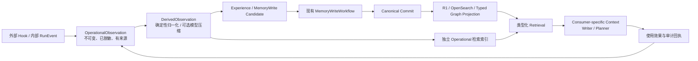

# agentmemory 参考评审与 Memory 成熟化优化路线

> Lifecycle: `TECHNICAL_REFERENCE / NON_AUTHORITATIVE`
>
> Initial date: 2026-08-01 +08:00
>
> Updated: 2026-08-10 +08:00
>
> Purpose: 供 Stage 3 Writer、Stage 4 Planner 和 Stage 5 长期运行设计评审、成熟化改进和验收规划使用
>
> Local observation baseline: `ecd3bcad7e9ccca6ac8a857cf27fb72c35f8ebd3`
>
> Upstream evidence baseline:
> [rohitg00/agentmemory@8c90741](https://github.com/rohitg00/agentmemory/tree/8c90741c633c020d5d24c34b6aa0ba53e2dd2226)
>
> Local executable source baseline: `agentmemory_lab/ref/agentmemory@d219763ccb2ac84ac36c091ae49091cac4a37c02`
> (`0.9.28`); local protocol-v1 result: `agentmemory_lab/results/REPORT_20260803.md`
>
> Authority boundary: 本文是比较研究与候选方案，不是 ADR、阶段状态或 Gate 通过证据；
> 当前状态仍以 [project_status.md](project_status.md) 为准，阶段编号仍以
> [ADR-0006](adr/0006-three-product-stage-topology.md) 为准。
>
> 2026-08-10 正式吸收映射：Writer 的 plan-conditioned Memory 留在 Stage 3；Planner inquiry-conditioned
> Memory、graph path receipt、Anchor→Graph 条件扩展、compact→expand 和检索消融进入 Stage 4；外部
> Hook ingress、Operational 异步派生、durable replay、retention 和受控 Experience/Skill 演化统一进入
> Stage 5 的渐进工作包。旧的多阶段映射仅保留于 Git 历史，第 7 节是本文当前映射。

## 0. 一页结论

### 0.1 核心判断

`agentmemory` 最值得借鉴的不是它把 Memory 做成了一个可视化产品，而是它把日常代理活动变成了
一条低摩擦的运行闭环：

```text
事件/Hook 自动采集
  → Observation
  → 异步压缩、总结和聚合
  → 可检索的派生记忆
  → 按预算注入 Agent
  → 访问、替代、遗忘和审计
```

NS 已经有比该项目更严格的 Canon、Commit、Projection、Freshness、Evidence、Writer Context
和 Memory Write Workflow。NS 不应重新建设一套通用 Memory 数据库，也不应让
`agentmemory` 风格的观察记录成为叙事事实真源。真正值得补齐的是：

1. Canon 之外的自动、低成本、可恢复 Observation 采集；
2. Observation 到派生记录、再到候选变更的异步流水线；
3. 从捕获、派生、检索、Context 到 Writer/Planner 实际使用的完整 provenance；
4. 对混合检索各通道、Context 效用、版本替代和生命周期的量化反馈；
5. 删除、索引、重建、降级、隐私和成本方面的运维回归门禁。

因此，本报告的总原则是：

> 借鉴 `agentmemory` 的运行机制和测试习惯，不借用它的事实权威；增强 NS 的
> Operational/Derived 层，不替换 Canonical 层。

### 0.2 优先级

下表是后续成熟度顺序，不是当前 Stage 2M/Stage 3 的实施授权。2026-08-03 决定先校正大
`TextBlock` 的读取粒度，再关闭 exact raw slice 到 claim 的支持走廊；Hook、consolidation/晋升、
retention/遗忘、通用 observation graph、Viewer 和
learned fusion 全部暂缓到正式 Stage 站位。

| 时点 | 建议 | 结论 |
|---|---|---|
| 当前 Stage 2M | 大 Block → paragraph/window exact slices、token-bounded semantic-input/Ledger packing、未闭合 Need 按需 claim 与 terminal funnel | 先保 raw 信息，不改 Writer 公共合同，不设固定三条/全量 atom 链 |
| Stage 3 | Writer reactive Need、ContextDelta、Context exposed/used 和安全窗口压缩 | 只扩展给定规划的 Writer Loop，不建外部 Hook/长期平台 |
| Stage 4 | Planner Context、graph path receipt、Anchor→Graph、compact→expand、source/path diversity 和完整消融 | 由 Planner inquiry 条件触发，不把 triple 设为所有查询默认 |
| Stage 5 | 外部 Hook ingress、Observation provenance、Operational/Derived retention、恢复、consolidation/Skill candidate 和可选 Viewer | 只覆盖真实长期 caller；Canon/Plan/active Skill 仍须受控晋升 |

### 0.3 对 BM25＋向量＋图检索和 Hooks 的直接结论

| 机制 | 能否使用 | NS 中的正确位置 | 关键限制 |
|---|---|---|---|
| BM25＋向量＋图检索 | **可以，而且关系链/因果多跳路径已经存在** | Stage 4 把现有 `TYPED_GRAPH + ANCHOR_BM25 + ANCHOR_DENSE` 做成有 path receipt、可消融、可降级的正式能力 | 只按 Need 条件触发；Exact/quote 不走 triple；图只接受 typed canonical/evidence edge |
| Hooks | **可以，但主要是未来的外部 ingress** | Stage 3–4 内部流程继续直接写 `RunEvent`；Stage 5 接外部 Agent/IDE/tool 并按需增加 durable replay | Hook 请求只校验、脱敏、限长、持久化；不做 LLM、embedding、图抽取、Context 注入或 Canon write |

换句话说，这不是两个需要整体移植的新子系统：检索侧是**成熟化现有三通道**，采集侧是**只补现有
Runtime 管不到的外部边界**。

### 0.4 明确不做

`agentmemory` 的 Memory、Graph、Session Summary 或 Viewer 不得直接充当：

- Canonical State；
- 角色状态数据库；
- 世界规则根；
- 叙事时间线；
- 伏笔、承诺和义务系统；
- PlanRoot；
- Canon Commit、Projection Snapshot 或 Freshness 证明。

这些职责在 NS 中已经有独立的 Canonical Root、`StateRecord`、`Event`、`PlanObligation`、
`PlanRootDocument`、Commit 与 Derived Snapshot 合同。模糊的 session memory 不能降低这些
边界的可信度。

## 1. 评审范围、证据和限制

### 1.1 本次读了什么

本地侧按“权威文档 → 当前状态 → 领域合同 → Service → Adapter/Runtime → 测试与 Gate”读取：

- [ADR-0004](adr/0004-stage2m-writer-context-product.md)：
  `WriterContextPackage` 是 Memory read-side product；
- [Stage 3 总设计](stage3_writer_core_overall_design.md)：Stage 3 只做最小生成质量闭环，
  不继续扩建 Memory 基础设施；
- [正式开发执行规划](../长篇小说Agent正式开发执行规划_v0.1.md)：Stage 3 Writer、Stage 4 Planner、Stage 5 长期运行的正式职责；
- `domain/memory.py`、`domain/retrieval_routing.py`、`services/retrieval.py`、
  `services/search_retrieval.py`：类型化路由、混合检索、RRF、fallback 与 trace；
- `domain/writer_context.py`、`services/writer_context_assembler.py`：
  exact token budget、Evidence Ledger、Claim Support 与 cutoff；
- `domain/memory_write.py`、`services/memory_write_workflow.py`：
  候选、验证、修复、Guardian、Commit、Projection、Freshness；
- `domain/runtime.py`、`services/event_log.py`、`services/tool_audit.py`：
  事件重放、幂等、工具和模型审计；
- `domain/benchmark.py`、`domain/memory_benchmark.py` 及 Gate/Reporter：
  Recall、MRR、NDCG、时态正确性、未来泄漏、Context 效用和逐阶段损失。

上游侧通过 GitHub Connector 阅读固定提交
[`8c90741`](https://github.com/rohitg00/agentmemory/commit/8c90741c633c020d5d24c34b6aa0ba53e2dd2226)，
重点覆盖：

- [类型与版本关系](https://github.com/rohitg00/agentmemory/blob/8c90741c633c020d5d24c34b6aa0ba53e2dd2226/src/types.ts)；
- [Observation 捕获](https://github.com/rohitg00/agentmemory/blob/8c90741c633c020d5d24c34b6aa0ba53e2dd2226/src/functions/observe.ts)、
  [压缩](https://github.com/rohitg00/agentmemory/blob/8c90741c633c020d5d24c34b6aa0ba53e2dd2226/src/functions/compress.ts)、
  [总结](https://github.com/rohitg00/agentmemory/blob/8c90741c633c020d5d24c34b6aa0ba53e2dd2226/src/functions/summarize.ts)
  和
  [聚合](https://github.com/rohitg00/agentmemory/blob/8c90741c633c020d5d24c34b6aa0ba53e2dd2226/src/functions/consolidation-pipeline.ts)；
- [混合检索](https://github.com/rohitg00/agentmemory/blob/8c90741c633c020d5d24c34b6aa0ba53e2dd2226/src/state/hybrid-search.ts)、
  [Context 组装](https://github.com/rohitg00/agentmemory/blob/8c90741c633c020d5d24c34b6aa0ba53e2dd2226/src/functions/context.ts)
  和 Hook 脚本；
- Retention、Auto-forget、Audit、Snapshot、索引持久化及其回归测试；
- LongMemEval、coding-agent-life、synthetic quality 和 scale benchmark。

### 1.2 证据解释

1. 本地工作树在评审时已有未提交修改。本文只增加新报告和文档索引，不把工作树修改当成已验收
   能力，也不修改现有脏文件。
2. 初版只把上游源码和测试作为设计证据；2026-08-03 已在隔离的
   `agentmemory_lab/ref/agentmemory` 基线与本地服务上完成协议 v1 五 checkpoint 复现。该协议的
   输入、评分和 verifier 合同与 NS Gate 不同，只能作为比较实验，不能替代 Stage 2M 证据。
3. 上游公布的数据是其固定版本、数据集和机器上的自测，不能直接作为 NS Gate。
4. `agentmemory` 面向 coding-agent session recall；NS 面向长篇小说的当前状态、历史证据、
   计划义务、知识边界和未来隔离。二者的 Recall 分母不相同。
5. 上游采用
   [Apache-2.0](https://github.com/rohitg00/agentmemory/blob/8c90741c633c020d5d24c34b6aa0ba53e2dd2226/LICENSE)。
   法律上允许按许可证条件复用，但 TypeScript/iii 与 NS 的 Python/PostgreSQL/OpenSearch
   技术边界差异很大；本报告默认“复用设计与测试合同、原生重写实现”，不默认复制源码。

## 2. 正确的系统边界

### 2.1 三层数据责任

| 层 | 真源性质 | 允许内容 | 是否可直接影响叙事事实 |
|---|---|---|---|
| Canonical | 受控、版本化、可验证 | World、Plan、Text、Profile、Reference Roots | 是，但只能经现有 Commit 流程 |
| Derived | 可重建、有 basis、有 attestation | R1、OpenSearch、embedding、typed graph、Context 派生物 | 只能引用 Canon，不可自行授予真值 |
| Operational | 运行观察、访问、效果、错误、候选经验 | Hook、RunEvent、tool/model outcome、usage feedback | 否；只能形成候选 |

`agentmemory` 的 RawObservation、CompressedObservation、SessionSummary、Semantic/Procedural
Memory 和 access log，最多映射到 NS 的 Operational 或 Derived 层。只有通过
`MemoryWriteWorkflow` 的候选，经过现有验证、风险决策、Commit、Projection 和 Freshness 后，
才可能改变 Canon。

### 2.2 推荐数据流



硬约束：

- `O → K` 和 `D → K` 不存在直连；
- Operational 检索命中必须保留其非 Canon 身份；
- Writer 的叙事事实主张仍必须有 Evidence/Plan provenance；
- 访问频率、近期性和模型总结可以影响派生排序，不能改变事实真值；
- 删除 Operational 数据不能级联删除 Canon、Evidence 或审计所需的不可变记录。

### 2.3 Memory 的产品不是 Viewer

当前已接受的 Writer read-side product 是 `WriterContextPackage`。Viewer 只可能是它和运行
审计记录的一个读取界面，不是产品本体。

Planner 侧目前的 `PlanningTask` 主要携带 `base_commit`、`source_ids` 和 creative scope，
尚没有与 Writer 一样成熟的 evidence-bound、token-budgeted context 产品。Stage 4 出现真实
Reactive MemoryNeed 后，应评审一个 consumer-specific 的 Planner Context/ContextDelta 合同，
而不是：

- 让 Planner 直接读取所有底层 memory；
- 把 `WriterContextPackage` 原样复用给 Planner；
- 为了统一界面先建一个无消费合同的 Viewer。

## 3. NS 当前实现已经具备什么

### 3.1 现有优势

| 能力 | 当前实现 | 相对 `agentmemory` 的判断 |
|---|---|---|
| Canon 写入 | `MemoryWriteWorkflow` 有 basis、候选、修复、Guardian/Human、Commit、Projection、Freshness | 明显更强，必须保留 |
| Commit 一致性 | project lock、base commit CAS、幂等 receipt、manifest 与 projection outbox 同事务 | 明显更强 |
| Derived basis | exact snapshot、channel coverage、index manifest、模型 revision/runtime fingerprint | 明显更强 |
| 检索 | R0/R1/R2、lexical/dense/hierarchy/typed graph、单一 RRF owner、typed fallback | 更适合小说域 |
| 信息边界 | Working、World、Plan、Text、Reference、Procedural、Operational 分域 | 更精细 |
| Writer Context | typed sections、mandatory/optional、exact tokenizer、EvidenceLedger、typed overflow | 明显更强 |
| Provenance | commit/snapshot/cutoff、EvidenceRef、ClaimSupportReceipt、ModelCallRecord、独立 verifier | 明显更强 |
| 审计/重放 | append-only RunEvent、单调 sequence、幂等、checkpoint、tool/model/effect audit | 更严格 |
| Benchmark | Recall/MRR/NDCG 之外还有时态、实体、未来泄漏、Context utility 和 stage loss | 更适合当前目标 |

具体证据包括：

- [`RetrievalTrace` 与 `ContextBudgetReport`](../src/novel_agent/domain/memory.py)；
- [`InformationDomain.OPERATIONAL` 与 Projection attestation](../src/novel_agent/domain/retrieval_routing.py)；
- [`ClaimSupportReceipt`、`EvidenceLedger`、`WriterContextBudgetReport`](../src/novel_agent/domain/writer_context.py)；
- [检索编排和 RRF](../src/novel_agent/services/retrieval.py)；
- [OpenSearch basis/access/truth filters](../src/novel_agent/services/search_retrieval.py)；
- [PostgreSQL event log](../src/novel_agent/services/event_log.py)；
- [Memory write state machine](../src/novel_agent/services/memory_write_workflow.py)。

### 3.2 当前真正的成熟度缺口

1. 内部 `RunEvent` 很完整，但“外部 agent/tool surface → 安全 RunEvent/Observation”没有统一
   ingress contract。
2. Writer/Editor/Curator 已形成候选链，但运行观察还没有一个跨 session 的异步派生与检索产品。
3. Provenance 在 Canon/Context 侧很强，capture-level 的 adapter version、redaction policy、
   raw/redacted hash 和 observation derivation 边还不统一。
4. 检索指标丰富，但还缺“retrieved → selected → ledger → rendered → consumer used”的实际使用漏斗。
5. 删除、替代、保留和 Operational 索引一致性还没有形成跨路径的审计覆盖政策。
6. CLI/API 目前不是运维查询面；这不要求先做 Viewer，但需要可机器读取的审计导出。
7. 当前 Stage 2M Gate M4 和 Stage 3 semantic gate 尚未通过，因此任何新策略只能先以隔离 shadow
   方式收集证据，不能借“成熟化”名义改变冻结的 deterministic safe default。

## 4. agentmemory 的成熟设计与局限

### 4.1 值得学习的部分

#### 自动捕获是 best-effort 边界

[`observe.ts`](https://github.com/rohitg00/agentmemory/blob/8c90741c633c020d5d24c34b6aa0ba53e2dd2226/src/functions/observe.ts)
对 hook payload 做校验、去重、脱敏和 session 串行化，再持久化 RawObservation。Claude Code
Hook 的实现强调超时和错误不能中断主 Agent。

更重要的教训来自
[context-injection.test.ts](https://github.com/rohitg00/agentmemory/blob/8c90741c633c020d5d24c34b6aa0ba53e2dd2226/test/context-injection.test.ts)：
pre-tool context injection 默认关闭，禁用时不得读 stdin、不得发网络请求、不得向 stdout 写入；
后端不可用也必须安全退出。原因不是功能不足，而是每次文件工具调用都自动注入会持续消耗上下文。

#### Observation 与 Memory 应当解耦，但上游默认主记录并非无损双存

上游类型层把 RawObservation、CompressedObservation、SessionSummary、Semantic/Procedural
Memory 分开。自 v0.8.8 起，默认路径不强制 LLM 压缩，而是先生成可检索的 deterministic
synthetic compression；模型压缩和 consolidation 都是可选、异步、可失败的增强。但本地
`0.9.28` 源码显示 `observe` 先写 RawObservation，随后默认 synthetic compression 仍以同一 ID
写回主 KV，因而可能覆盖主记录中的 raw body；这是“类型分离”，不是“原始与派生记录默认各自
持久化”。NS 必须使用不同 ID/记录保存 raw 与 derived preview，并保留 derivation receipt。

这说明成熟流水线不应让“模型总结服务是否可用”阻塞事件持久化，也不应让一个失败的 embedding
写入使原始 observation 丢失；同时不能直接照搬上游同 ID overwrite 语义。

#### Hybrid retrieval 有降级和消融意识

[`hybrid-search.ts`](https://github.com/rohitg00/agentmemory/blob/8c90741c633c020d5d24c34b6aa0ba53e2dd2226/src/state/hybrid-search.ts)
组合 BM25、vector、graph，使用 RRF，并在部分通道不可用时继续返回。其 session diversity
限制能减少同一 session 对 top-K 的垄断。

上游 benchmark 也显示“通道越多不一定越好”：在 synthetic quality 数据上，BM25、dual、
triple 各有胜负；coding-agent-life 的主要增益只出现在 temporal 问题。这种结果比一个固定
权重更值得借鉴：每个通道都要通过分层消融证明增益。

#### 生命周期行为有专门回归测试

代表性测试包括：

- [remember-forget-audit.test.ts](https://github.com/rohitg00/agentmemory/blob/8c90741c633c020d5d24c34b6aa0ba53e2dd2226/test/remember-forget-audit.test.ts)：
  删除后必须清理 BM25、立即 flush 持久化并形成审计；
- [retention.test.ts](https://github.com/rohitg00/agentmemory/blob/8c90741c633c020d5d24c34b6aa0ba53e2dd2226/test/retention.test.ts)：
  dry-run、namespace 路由、批量审计和无删除时不产生伪审计；
- [governance.test.ts](https://github.com/rohitg00/agentmemory/blob/8c90741c633c020d5d24c34b6aa0ba53e2dd2226/test/governance.test.ts)：
  单删、批删、dry-run、索引清理和 audit query；
- [index-persistence.test.ts](https://github.com/rohitg00/agentmemory/blob/8c90741c633c020d5d24c34b6aa0ba53e2dd2226/test/index-persistence.test.ts)：
  shard/manifest、旧格式兼容、写失败不产生 unhandled rejection、缺失/坏形状不崩溃；
- [diagnostic-followup-rate.test.ts](https://github.com/rohitg00/agentmemory/blob/8c90741c633c020d5d24c34b6aa0ba53e2dd2226/test/diagnostic-followup-rate.test.ts)：
  把短时间内第二次、结果集合不相交的检索作为“第一次结果可能没有解决问题”的方向性诊断。

### 4.2 不应照搬的部分

| 上游设计 | 不直接采用的原因 |
|---|---|
| TypeScript + iii state/queue/pubsub/stream | NS 已有 Python、PostgreSQL、OpenSearch、MinIO、OTel 和 Runtime 边界；引入第二运行内核会增加双写和恢复问题 |
| file-based KV 作为主要状态 | 不满足 NS 的 Canon basis、关系完整性、并发 Commit 和 projection attestation |
| 进程内 Map BM25、序列化 vector、穷举 cosine | 适合单机工具，不替换当前 OpenSearch/embedding runtime |
| 通用 Memory 类型和 `sourceObservationIds` | provenance 粒度低于 NS 的 commit/snapshot/cutoff/evidence/model-call 要求 |
| 字符数/3 的 token 估算和 whole-block greedy fit | NS 已有 exact tokenizer、mandatory reduction 和 typed overflow |
| 以近期性、访问频率和衰减决定记忆生存 | 只能用于 Operational/Derived；不得影响 Canon truth |
| token Jaccard 自动判定 newer-wins/contradiction | 对人物状态、世界规则、时间线和义务风险过高 |
| 通用 graph 全量读取/近似 snapshot | 不替换现有 bounded typed graph 和 PostgreSQL exact/temporal path |
| silent/best-effort retrieval fallback | 外围 Hook 可以 best-effort；正式 NS retrieval 必须保留 `ChannelFailure` 和 typed degradation |
| Git snapshot of mutable memory state | 不替换内容寻址 Canon Commit、Derived Snapshot 和 FreshnessGate |
| Viewer 作为主要产品表面 | Writer/Planner Context 才是消费产品；Viewer 只在运维需求成立后作为派生视图 |

### 4.3 上游自身暴露出的运维教训

这些不是否定上游，而是成熟项目最有价值的“踩坑证据”：

1. [iii-config.yaml](https://github.com/rohitg00/agentmemory/blob/8c90741c633c020d5d24c34b6aa0ba53e2dd2226/iii-config.yaml)
   记录了 full observability sampling 引发日志正反馈，数日写出 137 GB 日志的事故，因此默认采样
   降到 0.1。NS 应测试 telemetry/log subscriber 不会递归记录自身拥塞。
2. [docker-compose.yml](https://github.com/rohitg00/agentmemory/blob/8c90741c633c020d5d24c34b6aa0ba53e2dd2226/docker-compose.yml)
   记录了数据卷权限错误时引擎静默使用 RAM、重启后状态消失的问题。NS 的启动门禁应明确验证
   PostgreSQL、OpenSearch、MinIO 的实际持久化与写权限，而不是只验证进程健康。
3. 同一 compose 文件固定 iii v0.11.2，因为后续 worker 模型产生 EPIPE 和“保存后空检索”。
   NS 应把 runtime/embedding/reranker/index mapping 的兼容性纳入 attestation，现有设计方向正确。
4. 上游给 graph 加入查询上限、超时、snapshot 和 rebuild ceiling，证明通用图在规模上不是免费能力。
5. 默认关闭 per-tool injection，证明“自动”不应等同“每次调用都注入”。
6. 本地协议复现确认 project 过滤在无法解析项目身份时会按 unscoped 放行，并出现跨项目命中；
   NS 必须继续在评分前 fail-closed，并在外部适配器无法保证身份时使用物理 store 隔离。
7. 名为 `state_store.db` 的目标实际是目录型 KV，而不是单文件数据库；启动、清理、快照和恢复不能
   以文件扩展名推断存储语义。
8. 本地复现曾因旧服务端口仍存活而把新 run 指向非空旧 store。实验 harness 必须同时验证目标
   端口属于本次进程且目标 store 为空；只通过 health check 不足以证明隔离。

## 5. 逐机制对照与 NS 方案

### 5.1 Event/Hook 自动采集

#### 当前状况

NS 的内部 `RunEvent` 已覆盖 run、task、model、agent、tool、artifact、commit、effect、checkpoint、
candidate、repair、Guardian、projection、freshness 和信息边界；`PostgresRunEventLog` 有幂等键、
stream lock、严格 sequence 和 replay。

缺口不是“没有事件系统”，而是外部 Hook 和内部事件还没有统一转换成可检索的
`OperationalObservation`。

#### agentmemory 实际怎样使用 Hooks

上游固定提交并不是笼统地“监听 Agent”。它用
[`hooks.json`](https://github.com/rohitg00/agentmemory/blob/8c90741c633c020d5d24c34b6aa0ba53e2dd2226/plugin/hooks/hooks.json)
为 Claude Code 注册 12 类 command hook；Codex 兼容清单
[`hooks.codex.json`](https://github.com/rohitg00/agentmemory/blob/8c90741c633c020d5d24c34b6aa0ba53e2dd2226/plugin/hooks/hooks.codex.json)
只保留目标运行时支持的 6 类事件。每个脚本从 stdin 读取 JSON，然后调用本地 REST API。

| Hook | 上游实际行为 | 超时/退出策略 | 对 NS 的意义 |
|---|---|---|---|
| `SessionStart` | 解析项目名，调用 `/session/start`；只有显式开启时才把返回 Context 写 stdout | 注册 800 ms；注入 1,500 ms | 生命周期捕获可借鉴；项目身份推断和隐式注入不借鉴 |
| `UserPromptSubmit` | 只把 prompt 作为 `prompt_submit` Observation 发送 | fetch 3 s；约 500 ms 后退出 | 状态文案虽写 recall，脚本本身并不注入 Context |
| `PreToolUse` | 只处理 Edit/Write/Read/Glob/Grep 类文件工具，调用 `/enrich` 并可能写 Context | 默认完全关闭；开启后 2 s | NS 不采用每次工具前隐式注入 |
| `PostToolUse` | 采集 tool name/input/output；普通输出截断到约 8,000 字符，图片数据分离 | fetch 3 s；约 500 ms 后退出 | 可借鉴成功结果采集、限长和多模态分离 |
| `PostToolUseFailure` | 中断不记录；input/error 各截断到约 4,000 字符 | fetch 3 s；约 500 ms 后退出 | 可借鉴失败与人为中断分流 |
| `PreCompact` | 调 `/context`，固定请求约 1,500 token Context；可选 bridge sync | 5 s | 只适用于未来长驻会话；NS 应优先 checkpoint，不默认注入 |
| `SubagentStart/Stop` | 记录 agent identity/type，停止时附最多约 4,000 字符末条消息 | 0.8 s / 2 s；约 500 ms 后退出 | 可映射成外部 Agent lifecycle observation |
| `Notification` | 只记录 permission prompt | 2 s；约 500 ms 后退出 | 只作 Operational 审计，不作 Memory truth |
| `TaskCompleted` | 记录 task/team metadata，description 截断约 2,000 字符 | 2 s；约 500 ms 后退出 | 可映射到已有 `TASK_COMPLETED` |
| `Stop` | 同时请求 summarize 和 session end | 120 s / 5 s；约 1,500 ms 后退出 | NS 应只发一个 durable lifecycle event，由服务端编排后续动作 |
| `SessionEnd` | 结束 session；显式开启时触发 crystal、consolidation 和 bridge | 30–120 s；约 1,500 ms 后退出 | 聚合必须异步、候选化，不能由 Hook 直接晋升 |

Hook 到检索的上游真实链路是：

```text
command hook
  → authenticated POST /agentmemory/observe
  → mem::observe
  → payload 校验
  → session/tool/input dedup
  → stripPrivateData
  → per-session keyed lock + session cap
  → RawObservation 持久化和 stream publish
  → 默认 deterministic synthetic compression
     或显式开启 per-observation LLM compression
  → BM25 add + guarded vector add
```

[`observe.ts`](https://github.com/rohitg00/agentmemory/blob/8c90741c633c020d5d24c34b6aa0ba53e2dd2226/src/functions/observe.ts)
默认不会因每次 PostToolUse 调 LLM；它先生成 synthetic compressed observation，使 BM25/Vector
立即可搜。真正的图抽取也不在 Hook 请求内执行：

```text
Stop / SessionEnd
  → server-side session.stopped event
  → summarize
  → 若 GRAPH_EXTRACTION_ENABLED
       读取该 session 已压缩 Observation
       → fire-and-forget mem::graph-extract
```

这一点必须保留：Capture、Compression、Index、Graph、Consolidation 是不同故障域，不能塞进
同一个 Hook 请求。

上游实现还有四个不应复制的细节：

1. 项目默认用 Git 根目录 basename 推断，同名目录可能碰撞；NS 必须使用显式 `ProjectId`。
2. 多数脚本在缺失 session 时使用 `unknown`；NS 应拒收或 quarantine，不能形成共享未知作用域。
3. `stripPrivateData` 是通用文本脱敏；NS 应先做 typed allowlist，再做秘密扫描和 taint。
4. Stop 客户端同时请求 summarize/end，而服务端 end 又触发 stopped lifecycle；NS 应以一个
   durable server-side event 作为唯一编排起点，避免重复副作用。

#### NS 应怎样使用 Hooks

先区分两个概念：

- **内部 instrumentation**：Writer、Planner、Editor、Curator、Model、Tool 都在 NS Runtime 内，
  直接 append `RunEvent`，不启动 shell Hook、不再走 HTTP；
- **外部 Hook ingress**：只有外部 Agent、IDE、模型工具或未来插件不受 NS Runtime 控制时，才把
  外部事件转换为 `RunEvent`/`OperationalObservation`。

建议的 NS Hook/事件映射：

| 外部事件 | 进入 NS 的正式事件 | 首次使用阶段 | 后续动作 |
|---|---|---|---|
| external session/run start | `RUN_CREATED` / `RUN_RESUMED` | Stage 5；长驻运行工作包强化 | 建立显式 project/run identity，不自动注入 Context |
| user task/prompt accepted | `TASK_STARTED` | Stage 5 | 只记录经过 allowlist 的 task artifact/ref |
| external agent start/stop | `AGENT_STARTED/COMPLETED/FAILED` | Stage 5 | 形成运行 observation，不直接形成 Experience |
| external tool success/failure | `TOOL_COMPLETED/FAILED` | Stage 5 | 复用 ToolAudit；payload 以 artifact ref/hash 为主 |
| model success/failure | `MODEL_COMPLETED/FAILED` | 已有内部能力；外部边界 Stage 5 | 必须绑定 `ModelCallRecord` |
| task/run stop | `TASK_COMPLETED/FAILED`、`RUN_COMPLETED/FAILED` | Stage 5 | 服务端异步 summary/observation worker |
| pre-compact/暂停 | `CHECKPOINT_CREATED` 或 checkpoint request | Stage 5 durable work package | 保存 durable state；不隐式改变 Writer Context |
| permission/notification | Operational audit event | Stage 5 按需 | 不参与小说事实检索 |

Stage 3 不需要建设通用 Hook 平台。它只需在现有 Service 内补
`Context exposed → Draft produced → Editor/Curator/Reconciliation` 的使用回执。Stage 4 继续记录
Memory tool、ContextDelta 和 follow-up retrieval；Stage 5 完整创作循环形成后，外部 Hook ingress
才有稳定的事件语义；Stage 5 再按真实 caller 把它提升为 durable、可恢复的长期运行能力。

#### 建议

1. 内部流程优先直接消费 `RunEvent`，不要再发一份重复 Hook。
2. 只为外部 agent/tool surface 增加 Hook ingress adapter。
3. ingress 只做 schema 校验、allowlist、脱敏、限长、内容寻址、幂等 append；不在请求路径调用
   LLM、embedding、OpenSearch 或 Canon。
4. 大 payload 先脱敏，再写 MinIO artifact；PostgreSQL event 只存引用、hash 和必要字段。
5. Hook timeout/failure 不应中断 Writer/Planner，但必须形成本地 drop/error counter；
   “best-effort”不能等于“不可观测”。
6. 不采用隐式创建未知 project 的行为。project/run/session identity 缺失时应拒绝或隔离到
   quarantine，避免跨项目污染。

建议的 capture 字段：

| 字段组 | 最小字段 |
|---|---|
| 身份 | `observation_id`、`project_id`、`run_id`、`session_id`、`event_sequence` |
| 来源 | `source_event_type`、`hook_type`、`tool_name`、`adapter_name/version` |
| 时间 | `occurred_at`、`captured_at` |
| 幂等 | `idempotency_key`、redacted `content_hash` |
| 内容 | `payload_ref`、`payload_hash`、`redacted_payload_ref/hash` |
| 安全 | `privacy_policy_hash`、`access_scope`、`information_label`、`taint` |
| lineage | `parent_event_ids`、`source_artifact_refs` |

### 5.2 Observation → Memory 异步流水线

#### 正确命名

在 NS 中，“Memory”容易被误解为 Canon。建议把流水线拆成：

```text
RunEvent / HookIngress
  → OperationalObservation
  → DerivedObservation
  → ExperienceCandidate 或 MemoryWriteTrigger
  → 现有 MemoryWriteWorkflow
```

`DerivedObservation` 可以直接被 Operational 检索使用，但仍是非 Canon；只有最后一条路径才有
资格进入 Canon 候选。

#### 推荐执行语义

- 交付语义：at-least-once；
- 物化语义：通过 observation/derivation idempotency 达到 effect-once；
- 顺序：同一 project/run stream 保序，跨 stream 可并行；
- checkpoint：记录已处理 RunEvent high-water mark；
- retry：按 typed failure 分类，模型不可用与 schema 非法分开；
- poison item：有界重试后进入 quarantine，不阻塞后续事件；
- compression：deterministic normalization 先完成，模型压缩是可选增强；
- consolidation：只产生候选，不直接写 Canon 或替换 active Canon；
- basis：任何会进入 MemoryWriteWorkflow 的候选必须绑定 base commit、cutoff 和来源 artifacts。

实现上应复用现有 PostgreSQL outbox/lease/`SKIP LOCKED` 模式，而不是引入 iii queue。可以新增
专用 observation cursor/outbox，也可以先从 RunEvent stream + checkpoint 派生；不得复用
projection outbox 的业务表语义造成混合职责。

### 5.3 Provenance

#### 对照结论

上游的 `sourceObservationIds`、`sessionIds`、`version`、`supersedes` 和 access log 易用，但
不足以回答：

- 这条信息来自哪个 Canon commit/snapshot/cutoff？
- 原始内容是否在进入模型前脱敏？
- 哪个 prompt/model/revision 产生了压缩或聚合？
- 哪个独立 verifier 验证了它？
- 它经过哪些检索、筛选、Context reduction 才被 Writer 使用？

NS 已有这些能力的大部分构件。应补齐 capture 和 use 两端，而不是另建 provenance 系统。

#### 建议新增两类 receipt

`ObservationDerivationReceipt`：

- input observation IDs、artifact refs 和 hashes；
- deterministic rule 或 model producer/version；
- prompt/config hash、`ModelCallRecord`；
- output artifact/hash；
- redaction/privacy policy hash；
- basis commit/snapshot/cutoff（若涉及小说状态）；
- quality/validation outcome；
- parent derivation IDs。

`ContextUseReceipt`：

- consumer type 与 task/request ID；
- Need/NeedFacet；
- retrieved、rank-selected、expanded、ledger-selected、rendered item IDs；
- 每阶段 token cost；
- Writer/Planner output artifact；
- 可证明的 citation/claim use；
- follow-up retrieval 与局部恢复；
- producer/version 和 trace refs。

`ContextUseReceipt` 的“used”不能只等于“被放进 Prompt”。能从输出 claim/citation 或独立 evaluator
证明时记为 confirmed；否则只能记 exposed。这样才能真正测量 Memory 对 Writer/Planner 是否有用。

### 5.4 混合检索

#### agentmemory 实际怎样做 BM25＋向量＋图

上游的三通道不是原始分数直接相加，而是“各通道独立排名 → 带权 RRF → diversity → 可选
rerank”：

| 层 | 固定提交中的真实实现 |
|---|---|
| BM25 | 进程内 inverted index；`k1=1.2`、`b=0.75`；英文 stem、同义词权重 0.7、前缀匹配权重 0.5、CJK 分词 |
| Vector | 可选 embedding provider；写入前截断约 16,000 字符并检查维度；进程内遍历全部向量做 cosine top-K |
| Graph build | 显式开启后，在 session stop 读取已压缩 observations，用 LLM XML 抽取 node/edge，并保留 `sourceObservationIds` |
| Graph query | 从 query 抽实体，按实体名匹配起点；默认深度 2，用 `cost=1/weight` 的 Dijkstra；也可从 top-5 vector chunks 做 1-hop graph expansion |
| Candidate depth | BM25 和 vector 各取 `limit×2`，graph 取至 limit |
| Fusion | `RRF_K=60`；默认 BM25/Vector/Graph 权重 `0.4/0.6/0.3`；缺少某通道时重新归一化剩余权重 |
| Diversity | 融合后每个 session 先最多保留 3 条，不足再回填 |
| Rerank | `RERANK_ENABLED=true` 时重排前 20 条；失败退回融合顺序 |
| Tool result | `smart-search` 默认返回 compact ID/title/type/score/timestamp；最多展开 20 个 ID 获取全文 |

对应源码：

- [`hybrid-search.ts`](https://github.com/rohitg00/agentmemory/blob/8c90741c633c020d5d24c34b6aa0ba53e2dd2226/src/state/hybrid-search.ts)；
- [`search-index.ts`](https://github.com/rohitg00/agentmemory/blob/8c90741c633c020d5d24c34b6aa0ba53e2dd2226/src/state/search-index.ts)；
- [`vector-index.ts`](https://github.com/rohitg00/agentmemory/blob/8c90741c633c020d5d24c34b6aa0ba53e2dd2226/src/state/vector-index.ts)；
- [`graph-retrieval.ts`](https://github.com/rohitg00/agentmemory/blob/8c90741c633c020d5d24c34b6aa0ba53e2dd2226/src/functions/graph-retrieval.ts)；
- [`smart-search.ts`](https://github.com/rohitg00/agentmemory/blob/8c90741c633c020d5d24c34b6aa0ba53e2dd2226/src/functions/smart-search.ts)。

源码级核对也暴露出不能把“三通道”当作无条件成熟结论的地方：

1. `searchWithExpansion` 虽已实现，但固定提交的 production `smart-search` 只调用普通 `search`；
   query expansion 需要单独调用，尚未自动接入主检索入口。
2. Graph result 只保存 observation ID，`GraphRetrieval` 返回的 sessionId 为空。若一条 graph-only
   observation 没同时被 BM25/Vector 命中，后续按 sessionId enrich 时存在无法解析并被丢弃的风险。
3. agent scope 因 BM25/Vector index 不携带 agentId，只能 over-fetch 后过滤；NS 当前的
   project/commit/snapshot/access filters 在评分前执行，不能退化成这种模式。
4. [`hybrid-search.test.ts`](https://github.com/rohitg00/agentmemory/blob/8c90741c633c020d5d24c34b6aa0ba53e2dd2226/test/hybrid-search.test.ts)
   主要验证 BM25-only、排序、limit 和 KV fallback；
   [`graph-retrieval.test.ts`](https://github.com/rohitg00/agentmemory/blob/8c90741c633c020d5d24c34b6aa0ba53e2dd2226/test/graph-retrieval.test.ts)
   验证图遍历本身，但缺少覆盖 graph-only identity → triple fusion → full observation enrich 的
   端到端单测。
5. 图读路径仍需枚举 graph nodes/edges；上游后来增加 snapshot、timeout 和 rebuild ceiling，
   说明该实现不适合作为 NS 的规模化 Canon graph backend。

#### NS 当前其实已经实现了三通道

这不是未来才开始的能力：

- `RetrievalChannel` 已有 `ANCHOR_BM25`、`ANCHOR_DENSE`、`GROUNDED_BM25`、
  `GROUNDED_DENSE` 和 `TYPED_GRAPH`；
- `FusionService` 已是唯一的 application-owned RRF，默认同样使用 `k=60`；
- Stage 2R 的 `_r2_registration` 已对 `RELATION_CHAIN` 和 `CAUSAL_MULTI_HOP` 注册
  `TYPED_GRAPH + ANCHOR_BM25 + ANCHOR_DENSE` 并行组；
- 语义历史使用 Anchor BM25+Dense，证据不足再 fallback Grounded BM25+Dense；
- exact quote/rare phrase 只走 Grounded BM25，不广播 Dense/Graph；
- `TypedCandidateSelector` 已有 unit kind、chapter 和 duplicate evidence diversity，且 mandatory
  永不因 quota 被丢弃；
- PostgreSQL Typed Graph 只遍历当前 `source_commit` 下
  `ACCEPTED_WORLD_FACT` relation，受 predicate、story time、access scope 限制；
- `GraphTraversalPolicy` 默认深度 2、上限 3，只允许 canonical/evidence edge，显式拒绝
  inferred/similarity proof edge；
- OpenSearch BM25/Dense 在评分前执行 project、commit、snapshot、scope、truth 和时间过滤；
- real-hybrid snapshot 还绑定 embedding model/revision/dimension/runtime fingerprint。

因此 NS 不需要复制 agentmemory 的进程内 BM25、全量 cosine、LLM observation graph 或全局
`0.4/0.6/0.3` 权重。需要做的是把已有三通道从“基础设施存在”成熟为“按 Need 可证明有用”。

#### 后续阶段的明确使用方式

| Need/场景 | 正式通道 | 阶段与状态 | 不变量 |
|---|---|---|---|
| 当前状态、硬约束、已知 ID | R0/R1 Exact/Temporal | 已实现；Stage 3/4 继续使用 | 不参加向量/图相关性竞争 |
| 语义历史、相关事件 | Anchor BM25+Dense；不足再 Grounded BM25+Dense | 已实现；Stage 2M 继续修复质量 | 所有最终 claim 展开到 L0 evidence |
| 精确引文、罕见短语 | Grounded BM25 | 已实现 | Dense/Graph 不得稀释 exact lexical |
| 风格、声音、对话样本 | Grounded BM25+Dense | 已实现 | 与 Canon fact/Plan 通道分开 |
| 因果多跳、关系链 | Typed Graph + Anchor BM25+Dense | Stage 2R 已注册；Stage 4 做正式增益验证 | depth≤3，只用 canonical/evidence edges |
| Character Arc | Hierarchy first；Anchor fallback；关系 facet 未闭合时可条件触发 Typed Graph | Stage 4 | 不能把相似度边当因果证明 |
| Hook 产生的 OperationalObservation | 独立 Operational BM25+Dense | Stage 5 先 shadow，证据成立后才正式消费 | 不进入 Canon Typed Graph |
| 跨运行 Experience/Skill 关系 | 独立 Operational/Experience graph candidate | Stage 5 evolution work package，held-out Gate 后 | 与 World/Plan graph 分 namespace、分 channel |

最值得从上游移植的组合不是“始终三路并发”，而是 **vector/lexical anchor → typed graph
conditional expansion**。NS 的安全版本应是：

```text
1. Anchor BM25 + Dense 取得初始候选
2. 先按 Need/facet、basis、truth、access 做选择
3. 只有 relation/causal facet 尚未闭合时：
     从 top selected Anchor 读取显式 entity_ids
     → Typed Graph depth 1–2
     → 只允许 canonical/evidence edges
4. Anchor 与 Graph 独立排名后用 application RRF 融合
5. 被选中的 Graph path/Anchor 全部展开回 L0 Evidence
6. Sufficiency/Conflict check 决定停止或 ContextDelta
```

这里不能用 LLM 从 query 或 observation 临时猜实体作为 proof edge；实体必须来自 alias
canonicalization receipt、Need 或已选 Anchor 的显式 `entity_ids`。

#### 建议的代码级优化

1. **补 Graph path receipt。** 当前 `R1WorldRepository.typed_graph_paths` 已产生 relation IDs、
   entity path、direction、edge semantics 和 EvidenceRefs，但 `R1RetrievalBackend.search` 最终
   折叠成普通 `ChannelHit`。Stage 4 应增加 `TypedGraphPathReceipt` 或
   `graph_path_receipt_ref`，让 WriterContext/EvidenceLedger 可解释“为什么沿这条关系找到它”。
2. **Agent 工具 compact→expand。** 当前 `RetrievalToolAdapter` 把完整 `ChannelHit` 放入工具
   payload。Stage 4 增加 compact result（unit ID、kind、basis、score、path summary），由
   `memory.expand_evidence` 只展开选中的 unit/path。
3. **不先改成全局带权 RRF。** 以现有 unweighted `application-rrf-v1` 为基线；只对
   relation/causal strata 比较 unweighted、固定 per-intent weights 和 learned weights。
   learned fusion 属于 Stage 5 evolution work package，必须 held-out。
4. **补 source/path diversity。** 在已有 kind/chapter/evidence quota 上，评估
   `max_per_source_artifact`、`max_per_graph_path_root`；mandatory 继续豁免。
5. **Graph 存储先优化 PostgreSQL。** Stage 4 保持 depth≤3；Stage 5 若 scale benchmark 证明
   当前 relation row 枚举成为瓶颈，先做 indexed adjacency/recursive CTE。只有 CTE 的质量和
   p95/p99 无法达标时，才按正式规划评估 Neo4j。
6. **新增完整 triple regression。** 至少覆盖 graph-only identity、某通道失败后的显式降级、
   vector dimension mismatch、path receipt、cutoff/access filter、compact→expand 和删除后无幽灵命中。

上述改动分别落在现有
[`R1WorldRepository`/`R1RetrievalBackend`](../src/novel_agent/services/r1.py)、
[`FusionService`](../src/novel_agent/services/retrieval.py)、
[`_r2_registration`](../src/novel_agent/services/retrieval_routing.py)、
[`GraphTraversalPolicy`](../src/novel_agent/domain/retrieval_routing.py) 和
[`RetrievalToolAdapter`](../src/novel_agent/tools/retrieval.py) 周围；不需要另建一套 parallel retrieval
service。

#### 保留的 NS 主干

- `InformationDomain` 与 capability-masked routing；
- R0/R1/R2 分层；
- OpenSearch lexical/dense；
- PostgreSQL exact/temporal；
- bounded typed graph；
- RRF 单一 fusion owner；
- mandatory-first selector、Evidence Expansion、typed fallback；
- basis/access/truth/future filters；
- `RetrievalTrace` 和 `ChannelFailure`。

#### 借鉴点

1. 增加 source/session/chapter/evidence-root diversity policy，防止一个来源占满 top-K；
   mandatory item 不受 diversity quota 丢弃。
2. 对 Agent 工具暴露 compact search result，只有选中的 ID 再 expand 原文和 evidence，减少工具
   payload 与 token。
3. 加入 query reformulation/expansion 只能作为有界 Stage 4 路径：有调用预算、trace、原查询和
   reformulation 对照，不允许隐藏改写。
4. 增加 recent/lexical/dense/dual/typed-graph/triple 的同 corpus、同 K、同 filter 消融。
5. 把“短窗口内再次检索且结果不相交”作为 reader-friction diagnostic，但不能把它直接解释为
   Recall 失败或质量 Gate。

#### Operational 检索隔离

建议为 OperationalObservation 使用独立 index alias 和显式 channel，例如候选命名
`OPERATIONAL_BM25`、`OPERATIONAL_DENSE`。不要把它们伪装成 Canon Anchor/Grounded channel。
Route 只有在 Need 声明 `InformationDomain.OPERATIONAL` 且 consumer policy 允许时才能使用。

Writer policy 建议：

- 小说事实、角色状态、世界规则、时间线、计划义务：只接受 Canon/Text/Plan provenance；
- 工具状态、运行限制、生成失败经验：可读取 Operational，但必须标记为 operational constraint；
- Operational observation 不得成为非 uncertain 叙事 claim 的唯一 Evidence。

Planner policy 建议：

- 可读取经过验证的 process lesson 和历史计划偏差信号；
- 不得把近期访问热度当作故事事实；
- 任何会改变 PlanRoot 的建议仍是 candidate，走 Planner/approval/Commit 边界。

### 5.5 Token-budgeted Context delivery

NS 的 `WriterContextAssembler` 已优于上游的字符估算和 whole-block greedy。应继续使用：

- exact tokenizer/version；
- mandatory conclusion 优先；
- bounded reduction；
- optional item 按 Need 和 marginal value 选择；
- Writer context 与 Evidence Ledger 分账；
- overflow 的 typed terminal；
- freeze-before-Gold。

需要借鉴的是注入时机纪律：

1. 只有 Writer/Planner 明确发起 Context resolution 时注入；
2. Stage 3/4 的 ContextDelta 只补局部缺口，不重复发送整个 Context；
3. 不在每次 tool use 前隐式注入；
4. session start/pre-compact 类机制只有在未来存在真正长驻交互 Agent 时评审；
5. capture latency budget 与 model context token budget 分开；
6. Context assembler 记录 dedupe、supersession、drop reason 之外，还要记录 exposed/used。

### 5.6 版本替代与冲突

Canonical Root 和 Commit 已经天然不可变，不需要 `isLatest` 布尔值替代。对 Operational/Derived
记录可借鉴上游的版本关系，但采用更严格的模型：

| 字段 | 含义 |
|---|---|
| `family_id` | 同一派生知识家族 |
| `revision_id` | 不可变版本 |
| `revision_number` | 单调版本 |
| `supersedes_revision_ids` | 明确替代边 |
| `valid_from/valid_to` | 时态有效性 |
| `status` | ACTIVE / SUPERSEDED / TOMBSTONED / QUARANTINED |
| `decision_receipt_ref` | 替代或冲突判定证据 |

禁止：

- 仅凭 token Jaccard 或 embedding 相似度自动覆盖高风险事实；
- 原地改写旧 revision；
- 删除旧版本后只保留 latest；
- 用访问频率决定哪个事实是真的。

相似度可以产生 `possible_duplicate` 或 `possible_contradiction` 候选；高风险对象必须经现有
validation/Guardian/approval 路径。

### 5.7 Retention 与遗忘

Retention 只适用于：

- raw/redacted Operational payload；
- 可重建的 DerivedObservation；
- access log、临时 query diagnostics；
- 过期的 index/cache。

不得自动遗忘：

- Canonical Roots/Commits；
- Evidence artifacts 和 cutoff/provenance receipts；
- Plan obligations、World rules、角色状态和 narrative timeline；
- Gate、审计和恢复策略要求保留的运行证据；
- 被人工 pin 或法律/合规 hold 的内容。

第一版 retention 必须具备 dry-run、policy version、理由、保护集合、tombstone、审计、索引同步
和恢复测试。访问热度只影响 cache/派生记录保留，不影响 Canon。

### 5.8 Audit 与 Viewer

Audit 是 P0/P1，Viewer 是 P3。推荐顺序：

1. content-addressed JSON/NDJSON 导出；
2. 人可读 Markdown trace bundle；
3. CLI 查询：按 run/task/Need/observation/consumer 检索；
4. index/storage reconciliation report；
5. 若真实运维仍困难，再做只读 Web Viewer。

即使未来建设 Viewer，也必须满足：

- 只读 Derived Projection，不成为事实真源；
- 不直接执行 forget、promotion 或 Canon write；
- 结果显示 basis、cutoff、information scope 和 provenance；
- Viewer 搜索不污染 Agent 使用诊断；
- 可以完全由审计记录重建；
- Viewer 不进入 Writer/Planner 正常 token 路径。

## 6. 复用、适配、拒绝矩阵

| `agentmemory` 元素 | 决策 | NS 落点 |
|---|---|---|
| Hook subprocess 的 fail-open、超时、stdout gate 测试 | 适配 | 外部 Hook adapter 与 contract tests |
| observe 的校验、dedup、脱敏、per-session lock | 适配 | RunEvent ingress；项目身份改为 fail-closed |
| synthetic compression 先于可选 LLM compression | 有限适配 | 只能生成独立 Derived preview；raw exact support 保持独立身份和可展开入口 |
| summarize/consolidation | 仅产生候选 | Stage 5 Experience/Skill work package |
| `sourceObservationIds` | 扩展采用 | ArtifactRef/hash/model-call/cutoff 完整 derivation receipt |
| RRF `k=60` | 已存在，不算新增 | 保留本地单一 FusionService owner |
| session diversity | 适配 | source/chapter/evidence-root diversity |
| compact search + expand IDs | 采用接口思想 | Stage 4 Memory tools/Controller |
| follow-up rate diagnostic | 采用为诊断 | ContextUseReceipt，不作为单独 Gate |
| custom BM25/vector index | 拒绝 | 继续 OpenSearch |
| generic graph implementation | 拒绝 | 继续 typed graph；新增能力必须消融证明 |
| chars/3 token estimate | 拒绝 | exact tokenizer |
| pre-tool auto injection | 拒绝为默认 | 显式 Context resolution/ContextDelta |
| version/supersedes/isLatest | 强化适配 | 仅 Operational/Derived immutable revisions |
| Ebbinghaus/access retention | 有界试验 | 只作用于 Operational/Derived |
| delete/index/audit tests | 直接移植测试意图 | unit/integration/regression/property tests |
| Git memory snapshot | 仅借鉴导出/恢复测试 | 不替换 Canon Commit；用于 Operational export |
| Viewer | 延后、可选 | 先 CLI/trace bundle |
| iii runtime | 拒绝 | 复用 PostgreSQL/OpenSearch/MinIO/OTel |
| LongMemEval/coding-life runner 结构 | 适配 | NovelMemEval adapter + 固定报告格式 |

“直接复用”若指源码复制，应单独记录来源、许可证和修改；默认实现应按 NS 的 typed ports/adapters
原生编写。

## 7. Stage 3 Writer、Stage 4 Planner 与 Stage 5 长期运行映射

| 阶段 | 正式目标 | 本报告建议吸收的细节 | 本阶段不要做 |
|---|---|---|---|
| Stage 3 Writer Context Loop | 把已给定章节规划和 `WriterContextPackage` 变成 Draft candidate | 内部直接写 `RunEvent`；补 exact token、Context exposed/used、reactive Need、ContextDelta、compact/expand 和 typed failure | 通用外部 Hook、Retention、Viewer、Plan 生成、长期 Scheduler |
| Stage 4 Planner Context Loop | 从作者意图和规划范围产生 inquiry-conditioned Plan candidate | PlannerContext、graph path receipt、Anchor→Graph 条件扩展、compact→expand、source/path diversity、通道消融和 Plan Review | 复用 Writer Need 生成、所有查询默认 triple、替换 deterministic safe default、直接写 PlanRoot |
| Stage 5 Long-running Creative Runtime | 集成规划、写作、提交、长期恢复和维护 | 外部 Hook ingress、Operational provenance/index shadow、durable replay/retention、Task/Attempt/Supervisor、Experience/Skill candidate 与生产容量 | 内部事件再发重复 Hook、Hook 内同步 LLM/索引、Operational 进入 Canon graph、自动修改 active Skill |

### 7.1 当前只保留设计与证据，不启动成熟化平台

2026-08-03 决定不在 Stage 2M/Stage 3/Stage 4 启动以下实现：外部 Hook 平台、Observation shadow platform、
consolidation/长期晋升、retention/自动遗忘、通用 observation graph、Viewer 和 learned fusion。
当前只允许：

- 保存本次源码基线、sanitized report、aggregate summary/manifest 和可复现 harness；
- 把 compact→exact expand、raw/derived 分离和 exposed/used 区分写入上位架构与技术合同；
- 在 Stage 2M 使用现有 trace/artifact 能力完成 claim 支持漏斗，不创建通用平台。

其余工作到第 7 节对应 Stage 再重新评审；本报告的 MM0–MM6 是未来 Stage 5 工作包候选，不构成当前
`.agent/plan.md` 的授权。

以下工作必须等待对应阶段 Gate/ADR：

- 改变 deterministic production retrieval；
- 让 Operational 记录进入正式 Writer/Planner Context；
- 自动从 consolidation 晋升 Canon/Plan/Skill；
- 自动 retention Canon；
- 把 Viewer 或新 runtime 设为生产依赖。

## 8. 建议的实现蓝图

### 8.1 代码边界

候选路径，不表示本文授权立即创建：

| 层 | 建议路径与职责 |
|---|---|
| Domain | `domain/observations.py`：Observation、Derivation、Revision、Use receipt |
| Ports | `ports/observation_ingress.py`、`ports/observation_store.py`、`ports/observation_index.py` |
| Adapters | `adapters/hooks/`、PostgreSQL store、MinIO artifact、OpenSearch operational index |
| Services | `services/observation_pipeline.py`、`services/observation_retrieval.py`、`services/context_usage.py` |
| Runtime | `runtime/observation_worker.py`：cursor/outbox、retry、quarantine、checkpoint |
| API/CLI | 最小 ingest、audit export、replay/reconcile；不先做 Viewer |
| Schema | 由 Stage 5 正式执行 ADR 确定 namespace，不能在本文中擅自新增平行 stage schema |

### 8.2 存储责任

| 数据 | 推荐存储 | 理由 |
|---|---|---|
| Observation metadata、cursor、revision、audit | PostgreSQL | 约束、事务、幂等、查询 |
| 大型 raw/redacted payload、model derivation artifacts | MinIO | 内容寻址与保留策略 |
| Operational lexical/dense projection | OpenSearch 独立 alias | 可重建、与 Canon index 隔离 |
| tracing/metrics/logs | OTel + 受控日志后端 | 可观测，不作为业务真源 |
| Canon/Plan/World/Text | 现有 Root/Commit stores | 不改变 |

不新增 vector DB、Neo4j、Temporal 或 iii，除非 Stage 4 检索或 Stage 5 长期规模 benchmark 证明现有端口无法满足目标，
并通过独立 ADR。

### 8.3 消费策略

建议新增版本化 `ContextConsumerPolicy`，至少包含：

- consumer：Writer / Planner / Editor / Curator / evaluator；
- allowed information domains；
- allowed truth/support status；
- mandatory provenance；
- cutoff/future policy；
- allowed channels；
- total/retrieval/rendered token budget；
- Operational content 是否允许；
- degraded channel policy；
- policy hash。

这样同一检索底座可以服务 Writer 和 Planner，又不会为了“统一 Memory”破坏各自的信息边界。

### 8.4 端到端不变量

1. 每个正式 Context item 可回溯到 Need、RetrievalUnit、Evidence/Plan 或明确的 Operational 来源。
2. 每个模型派生结果有完整 ModelCallRecord 和输入输出 artifact。
3. 每个 active derived revision 都能解释为何替代旧版本。
4. 每个删除/retention operation 都能证明 storage、index、cache 和 audit 的最终一致。
5. 每个 fallback 都出现在 trace，不以空通道伪装成功。
6. 每个 Context 在预算内；超限是 typed failure，不静默截断 mandatory 内容。
7. 每个 Hook/Observation failure 不阻塞主创作链，但可被计数、告警和 replay。
8. 任何 Operational/Derived 对象都不能绕过 MemoryWriteWorkflow 修改 Canon。

## 9. Benchmark 与测试标准

### 9.1 不照搬上游数字

上游公开结果可以说明“应该测什么”，不能说明“NS 已经达到什么”：

| 上游 benchmark | 上游固定版本报告 | 对 NS 的正确用法 |
|---|---|---|
| [LongMemEval-S](https://github.com/rohitg00/agentmemory/blob/8c90741c633c020d5d24c34b6aa0ba53e2dd2226/benchmark/LONGMEMEVAL.md) | 500 questions；报告 Hybrid R@5 95.2%、R@10 98.6%、R@20 99.4%、NDCG@10 87.9%、MRR 88.2% | 借用检索指标和 adapter 结构；不是小说端到端 QA，也不是 NS Gate |
| [coding-agent-life-v1](https://github.com/rohitg00/agentmemory/blob/8c90741c633c020d5d24c34b6aa0ba53e2dd2226/docs/benchmarks/2026-05-20-coding-agent-life-v1.md) | 15 sessions/15 queries；Hybrid R@5 1.0、P@5 0.240、p50 14 ms；P@5 已达该稀疏 Gold 的数学上限 | 借用 per-type 与 ceiling 说明；样本太小，不能作 headline gate |
| [Synthetic quality](https://github.com/rohitg00/agentmemory/blob/8c90741c633c020d5d24c34b6aa0ba53e2dd2226/benchmark/QUALITY.md) | lexical、vector/dual/triple 在不同指标上互有胜负 | 强制做通道消融，禁止假定 graph 总有增益 |
| [Scale](https://github.com/rohitg00/agentmemory/blob/8c90741c633c020d5d24c34b6aa0ba53e2dd2226/benchmark/SCALE.md) | 240–50,000 observations；记录 build/search/heap/storage/context tokens | 借用规模曲线维度，在 NS 自己硬件和 OpenSearch 上重测 |

### 9.2 NovelMemEval 数据分层

建议建立五类冻结数据集：

1. `micro-contract`：小型、确定性、精确验证 dedup、ordering、cutoff、version 和删除；
2. `novel-retrieval-gold`：按当前状态、历史因果、知识边界、计划义务、长程回调、原文证据分层；
3. `operational-cross-run`：跨 Writer/Planner/Editor/Curator session 的工具失败、修复和过程经验；
4. `adversarial`：同名实体、陈旧状态、相似措辞 distractor、未来章节、冲突版本、恶意/秘密 payload；
5. `long-horizon-replay`：C20/C40/C60/C80/C95 以及 N+1/N+2/N+3，后续扩展至数百章。

Gold 必须在检索前冻结，visible-at-cutoff 与 author-plan-conditioned 必须继续分开，不共享分母。

### 9.3 检索指标

保留现有 `BenchmarkMetricSet`，并按 query type、consumer、chapter horizon、information profile
分别报告：

- Recall@5/10/20；
- Precision@5/10；
- hit rate；
- MRR；
- NDCG@10；
- Need recall/precision/F1；
- routing accuracy、wrong-route、unnecessary-channel rate；
- Anchor recall/precision、anchor→gold conversion；
- evidence recall after expansion；
- current-state accuracy、temporal-validity accuracy；
- stale-state、wrong-entity-binding；
- future leakage；
- grounded fallback、reranker tokens；
- p50/p95/p99 latency、timeout、channel failure；
- build/rebuild time、index size、queue lag。

每次实验至少比较：

- recent-only；
- lexical/BM25；
- dense；
- lexical+dense；
- typed graph only；
- lexical+dense+typed graph；
- 当前 frozen deterministic safe default。

同一比较必须使用相同 corpus、filters、K、token budget、basis/cutoff 和 evaluator。

### 9.4 从候选到使用的漏斗指标

对每个 Gold/Need 记录：

```text
candidate present
  → rank selected
  → evidence expanded
  → context selected
  → evidence ledger bound
  → rendered/exposed
  → Writer/Planner confirmed used
```

建议新增：

- `candidate_to_rank_recall`；
- `rank_to_context_conversion`；
- `context_to_ledger_binding`；
- `exposed_to_confirmed_use`；
- `supported_claim_use_rate`；
- `context_utility_per_1k_tokens`；
- `irrelevant_token_ratio`；
- `followup_retrieval_rate`（仅诊断）；
- `context_delta_recovery_rate`；
- `inter_chapter_context_repetition`。

这比只看检索 Recall 更接近用户关心的问题：Memory 是否真的给 Writer/Planner 提供了需要的信息。

### 9.5 现有硬门禁必须保留

以下不是从 `agentmemory` 借来的，而是 NS 已有且更重要的 Gate：

| 维度 | 现有目标 |
|---|---:|
| mandatory constraint coverage | 1.00 |
| current-state accuracy | ≥ 0.95 |
| operational/plan coverage | ≥ 0.95 |
| key historical evidence recall | ≥ 0.90 |
| future leakage | 0 |
| evidence traceability | 1.00 |
| 非 traceable/contradicted 或 incomplete trace | hard veto |

新增检索策略即使 Recall 提升，也不能降低这些安全门禁。

### 9.6 建议新增的成熟化门禁

以下阈值是候选工程标准，正式采纳前应由 ADR/benchmark baseline 校准：

| 类别 | 候选标准 |
|---|---|
| Capture | 合法输入在 deterministic/fault suite 中最终物化率 100%；重复物化 0 |
| 主链影响 | in-process enqueue p95 ≤ 100 ms、p99 ≤ 250 ms；超时不阻断 Writer/Planner |
| Privacy | seeded secrets/raw forbidden fields 泄漏到 observation/index/context 的数量为 0 |
| Pipeline | crash/restart 后无丢失；poison item 不阻塞同 stream 后续合法 item |
| Provenance | 正式 Derived/Context item receipt 完整率 100% |
| Canon safety | Observation/Derived 直接 Canon write 次数为 0 |
| Budget | READY Context 超预算次数为 0；mandatory 静默截断次数为 0 |
| Degradation | channel failure/fallback trace coverage 100% |
| Lifecycle | 删除/替代后 stale index hit 为 0；所有 material deletion 有 audit |
| Rebuild | storage manifest、document count、basis 和 deterministic query fixtures 一致 |
| Telemetry | 不允许日志/指标递归形成无界反馈；日志容量有硬上限与告警 |

检索策略的 promotion 不建议设一个脱离数据集的固定“95.2%”：

1. 对每个 query stratum 做 paired evaluation；
2. 用 bootstrap confidence interval 报告 delta；
3. 核心安全指标不得回退；
4. aggregate Recall@K 的下界不得比 frozen baseline 低超过 1 个百分点；
5. 被该策略声称解决的目标 stratum 应有可重复的绝对增益，建议初始观察线为 ≥ 3 个百分点；
6. graph 通道只有在 Recall/NDCG 有稳定增益且 latency/token 成本被接受时才进入正式 profile。

### 9.7 测试层级

| 测试目录 | 必测内容 |
|---|---|
| `tests/unit` | normalization、redaction、dedup、scoring、budget、revision、policy |
| `tests/contract` | Hook payload、Observation/Receipt schema、consumer policy、audit/export |
| `tests/integration` | PostgreSQL outbox/cursor、MinIO artifact、OpenSearch index/delete/rebuild |
| `tests/property` | idempotency、任意重试顺序、supersession DAG、budget 不变量 |
| `tests/golden` | compact/expand、Writer/Planner Context、trace bundle、benchmark report |
| `tests/regression` | 每个真实故障：权限导致伪持久化、索引幽灵命中、日志反馈、坏 manifest、空通道 |
| `tests/model` | compression/consolidation 的 schema、evidence、independent verification；与 deterministic suite 隔离 |

默认 deterministic suite 继续保持 100% branch coverage。真实基础设施、模型和规模 benchmark
不能用 mock 单元测试代替。

### 9.8 两个机制的专项验收矩阵

#### BM25＋Dense＋Typed Graph

| 验收项 | 最低证明 |
|---|---|
| 路由正确性 | relation/causal Need 可进入 triple；exact/current-state/quote 不被错误广播到 triple |
| 单通道合同 | BM25、Dense、Typed Graph 各自使用同一 basis/cutoff/access/truth filter，并保留原始 rank |
| Graph 证据链 | 每条入选 path 有 relation row/ID、entity path、方向、edge semantics、EvidenceRefs 和 source commit |
| Graph-only identity | 只被图命中的结果仍能解析所属 project/commit/unit，不因缺 session/source identity 被 enrich 丢弃 |
| Fusion owner | 只有 application `FusionService` 做最终 RRF；backend 不做不可解释的第二次融合 |
| 降级 | Vector/Graph 超时、维度不匹配、空通道分别生成 typed `ChannelFailure`，剩余通道结果仍可验证 |
| 安全过滤 | stale commit、future cutoff、wrong access scope、inferred/similarity edge 命中数均为 0 |
| 工具预算 | search 返回 compact receipt；只对选中 ID/path expand；完整 payload 不提前占用 Context |
| 消融晋升 | lexical、dense、dual、graph、triple 在同 corpus/filter/K/budget 下 paired 比较；目标 stratum 有稳定增益且安全 Gate 不回退 |
| 规模 | 分别报告 build、p50/p95/p99、timeout、index/graph size；只有现有 PostgreSQL 路径不达标才评估新图后端 |

至少应有一个端到端 fixture 同时包含：词面命中、语义改写命中、只有两跳 typed relation 才能命中的
Gold，以及同名实体、未来事实、相似度伪边和 stale commit distractor。它比只分别测试三个通道更能
发现融合和 enrich 边界错误。

#### Hooks / 外部 Observation ingress

| 验收项 | 最低证明 |
|---|---|
| 事件支持矩阵 | 每个外部 runtime 的 manifest 只声明其真实支持的 lifecycle/tool 事件；未知事件 fail-closed |
| 身份隔离 | 缺 `project_id`/run identity 的事件拒收或 quarantine；同名目录不能共享 namespace |
| 输入安全 | typed allowlist、payload size、artifact split、redaction、seeded-secret、malformed JSON 全部有 contract test |
| 幂等与顺序 | 重复 delivery 只物化一次；同 run sequence 单调；乱序、重试、crash/restart 最终收敛 |
| 快速确认 | ingress p95/p99 满足主链门禁；后端索引/模型/图不可用时仍能先 durable append 或明确记录 drop |
| 请求路径边界 | Hook handler 不调用 LLM、embedding、OpenSearch、graph extraction、consolidation 或 Canon write |
| 注入隔离 | capture 默认不向 stdout/Context 写内容；关闭 injection 时不得读额外输入、发检索请求或产生 token |
| 生命周期唯一性 | stop/end 只产生一个 durable server event；summary、graph、consolidation 由服务端异步 fan-out 且幂等 |
| Canon 安全 | Raw/Derived Observation 直接写 Canon/PlanRoot 的次数为 0；晋升只能产生 candidate 并走现有 workflow |
| 审计与重放 | 每个 accept/reject/quarantine/drop 有原因和 adapter/policy version；从 checkpoint replay 结果一致 |

Stage 3–4 的同类测试应针对内部 `RunEvent` 和 `ContextUseReceipt`，而不是提前伪造 shell Hook；到
Stage 5 真正出现外部 surface 时，再让这组 contract/integration tests 成为正式交付物。

## 10. 成熟化工作包

这些工作包使用 `MM` 前缀，避免与当前 Stage 2M 混淆。它们是跨阶段能力包，不是新的官方阶段。

### MM0：边界与 Benchmark 冻结

交付：

- 一份 ADR：Operational/Derived/Canonical ownership；
- Observation/Derivation/Use receipt schema；
- consumer policy；
- NovelMemEval manifest、Gold、adapter 与报告格式；
- frozen deterministic baseline；
- direct-Canon-bypass 的 contract test。

退出条件：评审者能明确回答每类数据谁拥有、谁能消费、如何晋升、如何删除。

### MM1：只采集的 Shadow Ingress

交付：

- 内部 RunEvent replay observer；
- 必要的外部 Hook adapter；
- allowlist/redaction/size/idempotency；
- PostgreSQL metadata + MinIO artifact；
- capture latency、drop、privacy dashboard/报告。

退出条件：主创作链不受阻、无跨项目污染、无秘密泄漏、可 replay。

### MM2：异步 DerivedObservation

交付：

- deterministic normalization；
- 可选 model compression；
- derivation receipt；
- cursor/outbox/retry/quarantine；
- 独立 Operational lexical/dense index；
- rebuild/reconciliation。

退出条件：模型与索引故障不丢 raw observation，重启后收敛，索引可重建。

### MM3：检索与 Context 使用闭环

交付：

- Operational explicit channels；
- compact search → expand；
- source diversity；
- ContextUseReceipt；
- retrieved→used funnel；
- Stage 4 query expansion/graph 消融。

退出条件：目标 query strata 有可复现增益，且不破坏 basis、future、truth、token Gate。

### MM4：版本、替代、Retention、Audit

交付：

- immutable revision/supersedes/tombstone；
- possible duplicate/contradiction candidate；
- dry-run retention；
- delete/index/cache/audit consistency；
- JSON/Markdown/CLI audit export。

退出条件：每条 material mutation 都有审计；没有 stale retrieval hit；Canon 保护集合完整。

### MM5：受控 Experience/Skill 候选

交付：

- consolidation 只产生 Experience/Skill candidate；
- held-out evaluator；
- bounded edit；
- regression and rollback；
- promotion receipt。

退出条件：与 Stage 5 受控演化工作包 Gate 一致，任何自动演化都不能原地改 active Skill。

### MM6：可选运维界面

触发条件：

- CLI/trace bundle 已不能满足真实排障；
- 有明确 operator、查询任务、数据权限和 SLO；
- 不会成为 Canon write 后门。

交付可以是只读 Viewer，也可以只是更好的报告。Viewer 不是默认答案。

## 11. 风险清单

| 风险 | 主要控制 |
|---|---|
| Observation 污染 Canon | 独立 storage/index/channel；唯一 promotion gateway |
| future leakage | cutoff attestation、双 profile、future adversarial Gold |
| 相似度误判替代 | 只形成候选；高风险走 verifier/Guardian |
| Hook 捕获秘密 | allowlist、先脱敏后存储、taint、seeded-secret regression |
| 每次工具调用过度注入 | 默认不注入；显式 Context resolution |
| 模型压缩幻觉 | deterministic 原始派生保留；ModelCallRecord；压缩不授予真值 |
| 异步重复/乱序 | stream sequence、idempotency、high-water checkpoint |
| poison item 卡死 | 有界 retry、quarantine、后续事件继续 |
| 删除后幽灵命中 | storage/index/cache reconciliation 和回归测试 |
| 日志正反馈/磁盘爆炸 | sampling、容量硬上限、自身日志隔离、fault test |
| 容器健康但数据未持久化 | 启动写读探针、重启 durability test |
| graph 成本失控 | bounded hops、timeout、snapshot、消融门禁 |
| benchmark 被污染或过拟合 | sandbox、冻结 Gold、held-out、分层报告、版本化 manifest |
| “Viewer 看起来可用”替代质量证据 | Viewer 不进入 Gate；以 Context 和 consumer outcome 为准 |

## 12. 下一阶段评审需要做出的决定

建议按顺序审核：

1. 是否接受 Operational/Derived/Canonical 三层 ownership；
2. 哪些外部 surfaces 真的需要 Hook，哪些直接读取 RunEvent；
3. Writer 与 Planner 各自允许读取哪些 Operational 信息；
4. 是否接受“先 deterministic normalization、后可选 LLM compression”；
5. Operational index 的 retention、privacy、access scope；
6. ContextUseReceipt 中 confirmed-use 的判定方法；
7. Stage 4 哪些 query strata 值得 query expansion/graph；
8. MM0–MM4 分别进入 Stage 3/4 的 Context Loop 还是 Stage 5 长期运行工作包；
9. Stage 5 哪些生产成熟职责已有真实 caller，哪些仍应 deferred；
10. 是否已有真实运维任务证明需要 Viewer。若没有，保持延后。

## 13. 最终建议

下一步不应“把 `agentmemory` 接进 NS”，而应做一个 NS 原生的 Memory Maturity Track：

- 用现有 RunEvent、PostgreSQL、MinIO、OpenSearch 和 OTel 实现；
- 先做 shadow capture、派生、benchmark 和审计；
- 用现有 MemoryWriteWorkflow 作为唯一 Canon promotion gateway；
- 把 Recall 扩展成“检索到、进入 Context、被 Consumer 使用”的完整效果链；
- 把 exact token、future isolation、traceability 和 mandatory coverage 保持为硬门禁；
- 只有消融证明增益后，才推广 query expansion、graph、retention 或 Experience evolution；
- Viewer 保持可选。

这样借到的是成熟项目最有价值的工程经验，同时不牺牲 NS 已经建立起来的小说领域真源、时间、
计划、证据和可恢复性边界。
