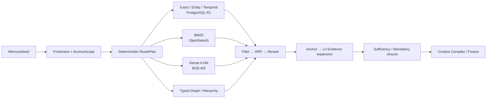
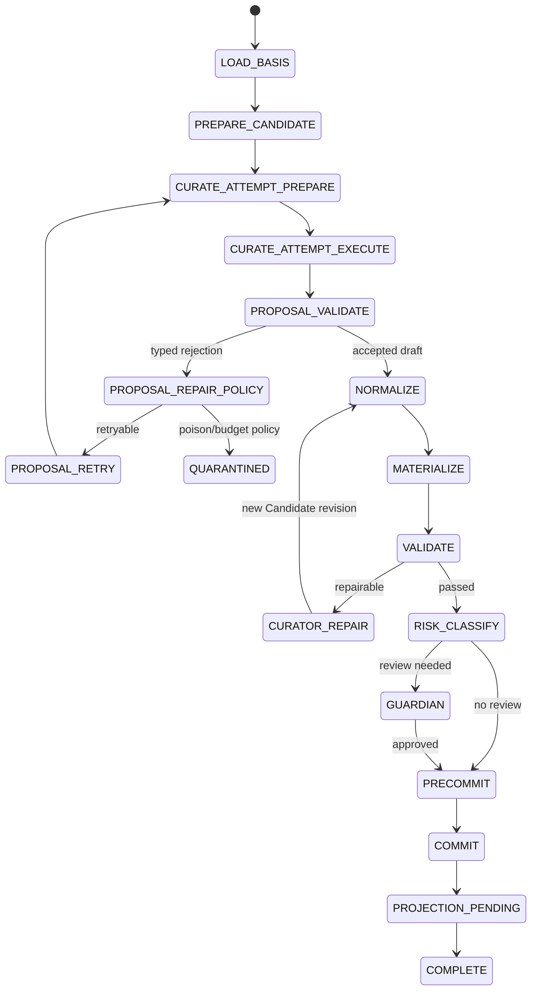
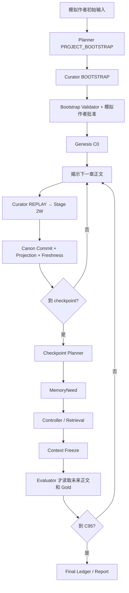
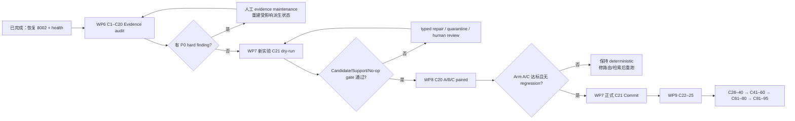

# Novel Agent 当前进度、架构与技术实施汇报

> 文档生命周期：`HISTORICAL`
> 已被 `docs/project_status.md` 取代为当前进度来源
> 汇报日期：2026-07-27
> 当前代码基线：`7c9c1258317a632bf747e0f4cb5550324deab598`
> 当前分支：`main`
> 当前业务状态：C20 已接受，C21 尚未正式提交
> 当前结论：安全内核与 P0 质量修复已落地；真实模型质量晋升链尚未完成
> 适用范围：Stage 0、Stage 1、Stage 2A/2R、Stage 2W、Controller/Curator 质量修复

---

## 1. 执行摘要

项目当前已经完成从“基础运行时、Canonical Memory Kernel、真实混合检索、Agent
Harness、可恢复写回工作流”到“Controller/Curator P0 质量修复”的主要工程闭环。最新代码
质量门禁为：

| 门禁 | 最新结果 |
|---|---:|
| `pytest tests/unit tests/contract` | 1,103 passed，0 failed |
| 分支覆盖率 | 100.00%（15,136 statements / 4,044 branches） |
| Ruff | All checks passed |
| Mypy | 129 个源文件无错误 |
| Stage 1 / Stage 2 Schema export | 成功 |
| `git diff --check` | 通过 |

不过，工程门禁通过不等于真实质量门禁通过。当前最准确的总体判断是：

```text
安全性：已证明
  非法/不完整模型输出不会污染 Canon；
  budget、typed pause、dry-run refusal、CAS commit、projection/freshness 边界已建立。

检索质量：尚未证明
  旧 C20 Agentic Gold recall 仅 4.55%，mandatory coverage 为 0%；
  修复后的三臂 C20 真实模型 paired 复跑尚未完成。

写回质量：尚未证明
  Evidence Candidate v2、Support Gate、空 delta fail-closed 已实现；
  最新 C21 真实 dry-run 当时因 8002 模型端点不可用而暂停，未获得新语义结果；
  8002 已于 2026-07-27 恢复并通过 strict JSON Schema 生成探针，已具备重新运行条件。

Canon 状态：安全
  数据库仍停在 C20；
  Genesis + C1–C20 共 21 个 Canonical commits；
  C21 没有正式 Commit、没有半提交、没有 Projection 污染。

生产默认：保守
  controller_mode 仍为 deterministic；
  ADR-0002 继续有效；
  Agentic Controller 未晋升为默认检索路径。
```

因此，当前里程碑应标记为：

> **P0 代码修复完成，Stage 2R/2W 真实质量验收进行中，系统处于安全的 C20 恢复点。**

---

## 2. 汇报依据与事实优先级

本报告按以下优先级判断“当前事实”：

1. 当前 `7c9c125` 源代码和导出 Schema；
2. 当前代码对应的单元/合同质量门禁；
3. 真实模型运行产物、数据库计数和 Canon commit；
4. 已接受 ADR；
5. 执行设计文档中的目标状态；
6. 更早 scripted 或历史版本运行，仅作为能力和编排证据，不作为当前质量证明。

主要设计依据：

- `docs/adr/0001-stage1-memory-kernel-baseline.md`
- `docs/adr/0002-stage2-memory-controller-promotion.md`
- `docs/stage2_memory_agents_development.md`
- `docs/stage2_hybrid_retrieval_execution.md`
- `docs/stage2_memory_write_workflow_execution.md`
- `docs/stage2w_pre_candidate_repair_supplement.md`
- `docs/stage2_teacher_forced_real_model_handoff.md`
- `docs/stage2r_stage2w_controller_curator_quality_repair_execution.md`
- `docs/retrieval_model_runtime.md`

关键运行证据：

- C20/C21 事故 paired report：
  `reports/stage2a/teacher_forced_real/author_plan_conditioned_qwen36_stage2w_recovery_8ca7e1c_from_c20_20260724/e2e_paired_report.json`
- C21 事故 pause trace：
  `reports/stage2a/teacher_forced_real/author_plan_conditioned_qwen36_stage2w_recovery_8ca7e1c_from_c20_20260724/memory_write_pause_trace.json`
- 修复后 dry-run：
  `reports/stage2a/teacher_forced_real/author_plan_conditioned_qwen36_quality_repair_c21_dryrun_b850232_20260725/memory_write_pause_trace.json`
- 最新 no-op gate 重跑：
  `reports/stage2a/teacher_forced_real/author_plan_conditioned_qwen36_quality_repair_c21_noop_gate_7c9c125_20260727/memory_write_pause_trace.json`
- C20 稳定恢复源：
  `reports/stage2a/teacher_forced_real/author_plan_conditioned_qwen36_stage2w_recovery_e810159_from_c17_20260724/progress_manifest.json`

---

## 3. 项目目标和设计边界

### 3.1 项目目标

Novel Agent 不是一个单次提示词应用，而是一个可重放、可审计、可恢复的长篇小说状态运行时。
核心目标包括：

1. 以版本化 Canonical Roots 保存正文、计划、世界状态、参考资料和项目策略；
2. 让检索严格绑定某一 Canon commit 与派生 snapshot；
3. 让 Planner、Controller、Curator、Guardian 只产出不受信 proposal 或 adjudication；
4. 让可信服务负责权限、校验、事务、Commit、Projection 和 Freshness；
5. 用逐章 teacher-forced replay 重建真实创作状态，而不是用静态 QA 冒充长程记忆；
6. 在真实模型出错、超时、重复失败或服务中断时安全停止并保留恢复证据；
7. 只有在同 basis、同预算、无安全回退的 paired 证据充分时，才晋升 Agentic 路径。

### 3.2 明确非目标

当前阶段不宣称：

- Agentic Controller 已优于 deterministic；
- Curator 的语义抽取质量已经在 C21–C95 证明；
- CPU 环境的延迟数据代表生产容量；
- 更早空 delta scripted C95 可作为真实语义质量证明；
- Agent 可以直接写 Canon、切换索引 alias 或扩大 access scope；
- 未来正文、Gold 或后验总结可以进入 Context Freeze 之前的决策链。

---

## 4. 当前阶段与完成度总览

### 4.1 分阶段状态

| 阶段 | 当前状态 | 已完成 | 未完成/限制 |
|---|---|---|---|
| Stage 0 运行时 | 已通过 | Python 3.12、内容寻址、Commit/事件/checkpoint、PostgreSQL/MinIO/OpenSearch/OTel、故障恢复 | 生产容量不在本阶段证明范围 |
| Stage 1 Memory Kernel | 工程闭环通过 | R1、Anchor/Grounded、BM25/k-NN、BGE、RRF、Evidence、Overlay、Validation、Outbox、Freshness | 正式真实质量 Gate 仍需真实长程 Gold |
| Stage 2A Agent Harness | 工程完成、晋升延期 | Planner/Controller/Curator/Guardian 合同、权限和审计链 | ADR-0002 禁止默认启用 BOUNDED_R2 |
| Stage 2R 检索 | 生产接线完成、质量待复验 | real_hybrid、RoutePlan、paired runner、三臂 Arm C、真实成本计数 | 修复后 C20 三臂真实复跑未完成 |
| Stage 2W 写回 | 状态机和恢复闭环完成 | proposal retry、Candidate revision、Guardian、CAS commit、projection/freshness、typed terminal | 最新代码尚未完成真实 C21 Commit |
| 质量修复 WP0–WP5 | 完成 | flags、预算、合法动作、batch plan、Evidence v2、Support Gate | 需要运行证据确认质量收益 |
| WP6 Evidence audit | 部分完成 | 只读审计器和报告脚手架 | C1–C20 正式审计和人工复核未执行 |
| WP7 C21 隔离恢复 | 部分完成/可继续 | dry-run refusal、typed pause、8002 structured smoke 已验证 | 需创建新实验重跑，再正式提交 |
| WP8 C20 三臂复跑 | 代码完成、运行未完成 | A/B/C 集合级实现及测试完成 | 缺当前代码真实 paired report |
| WP9 C22–C95 | 未开始 | 分段方案已设计 | 依赖 WP6–WP8 与正式 C21 |

### 4.2 质量修复工作包状态

| WP | 内容 | 代码状态 | 真实运行状态 |
|---|---|---|---|
| WP0 | Feature flags、事故 manifest、实验隔离 | 完成 | manifest 能力可用 |
| WP1 | Controller 全局预算与 typed terminal | 完成 | 需在新 paired 中核对每次 receipt |
| WP2 | LegalActionProvider 唯一合法动作源 | 完成 | 需真实路由 conformant report |
| WP3 | 压缩 prompt、batch plan、最多两次模型决策 | 完成 | 需真实调用/时延数据 |
| WP4 | EvidenceCandidate、Draft v2、可信 offset 绑定 | 完成 | b850 已证明模型不再直接提供 offset |
| WP5 | Support Gate、字段级 rejection、稳定 finding signature | 完成 | PARTIAL/CONTRADICTS/空 delta 均 fail-closed |
| WP6 | C1–C20 EvidenceRef 审计 | 脚手架完成 | 未执行正式审计 |
| WP7 | C21 隔离 dry-run 与正式提交 | dry-run 接线完成 | 最新尝试被模型服务不可用阻塞 |
| WP8 | C20 A/B/C 三臂复跑 | Arm C 实现完成 | 未跑真实模型 |
| WP9 | C22–C95 分段续跑 | Runner 支持分段/恢复 | 未开始 |

---

## 5. 总体架构

### 5.1 分层架构

```mermaid
flowchart TB
    subgraph Inputs["输入与评测边界"]
        AI["模拟作者初始输入"]
        CT["逐章已揭示正文"]
        FUT["未来正文 / Gold / 后验总结<br/>Evaluator-only"]
    end

    subgraph Agents["Agent 层：只产出 Proposal / Decision"]
        PL["Planner"]
        MC["Memory Controller"]
        CU["Memory Curator"]
        GU["Memory Guardian"]
    end

    subgraph Trusted["可信运行时与应用服务"]
        IB["Information Boundary"]
        RP["Route Planner / LegalActionProvider"]
        RET["Retrieval / Fusion / Context Compiler"]
        EC["EvidenceCandidate Generator"]
        SG["Evidence Support Gate"]
        WF["Memory Write Workflow"]
        VA["Normalizer / Validator / Risk / Gate"]
        CS["Commit Service"]
        PJ["Projection / Freshness"]
    end

    subgraph Canon["Canonical Authority"]
        TR["TextRoot"]
        PR["PlanRoot"]
        WR["WorldRoot"]
        RR["ReferenceRoot"]
        PP["ProjectProfileRoot"]
        CM["Project Commit / RootManifest"]
    end

    subgraph Derived["可重建派生层"]
        PG["PostgreSQL R1"]
        OS["OpenSearch Anchor / Grounded"]
        DS["DerivedSnapshot"]
        EV["Evaluation Ledger / RunEventLog"]
    end

    AI --> IB
    CT --> IB
    FUT -. "仅 Context Freeze 后" .-> EV
    IB --> PL
    IB --> CU
    IB --> MC
    PL --> PR
    MC --> RP --> RET
    CU --> EC --> SG --> WF
    GU --> WF
    WF --> VA --> CS
    CS --> CM
    CM --> TR
    CM --> PR
    CM --> WR
    CM --> RR
    CM --> PP
    CS --> PJ
    PJ --> PG
    PJ --> OS
    PJ --> DS
    RET --> PG
    RET --> OS
    RET --> DS
    MC --> EV
    WF --> EV
```



### 5.2 核心权威原则

系统使用“Agent 不持有权威，可信服务持有权威”的设计：

| 能力 | Agent | 可信服务 |
|---|---|---|
| 生成计划、检索建议、变更提案 | 可以 | 校验并约束 |
| 读取未来 Gold | 禁止 | 仅 Evaluator 在 Freeze 后可读 |
| 计算/绑定 Evidence offset | 禁止 | EvidenceCandidateGenerator 负责 |
| 判断 access scope | 禁止 | InformationBoundary/ToolBinding 负责 |
| 修改 Canonical Root | 禁止 | CommitService 负责 |
| 决定事务原子性和 CAS | 禁止 | Commit Port/数据库负责 |
| 切换索引 alias | 禁止 | Projection 服务负责 |
| 覆盖确定性 Validation failure | 禁止 | 任何模型/人工均不可覆盖硬失败 |

---

## 6. Canonical 数据架构

### 6.1 五 Root

| Root | 含义 | 允许内容 | 不允许混入 |
|---|---|---|---|
| TextRoot | 已接受正文时间线 | 已揭示章节/场景/文本块 | 未来正文、评测 Gold |
| PlanRoot | 创作意图和章节目标 | 初始大纲、Planner 计划、未履行义务 | 已发生事实的伪装 |
| WorldRoot | 已发生或显式声明的世界状态 | Entity/Event/State/Relation/Obligation | 未发生的计划、未来事实 |
| ReferenceRoot | 外部参考材料 | 世界观参考、背景资料 | 未经 provenance 的 Canon 事实 |
| ProjectProfileRoot | 项目策略与执行配置 | prompt/tool/evaluator/profile 版本 | 小说事实 |

同一段内容可以以不同身份被引用，但只能有一个权威语义。例如，粗略大纲在
`AUTHOR_PLAN_CONDITIONED` 中可以进入 PlanRoot，但仍是 `PLAN/INTENT`，不能由 Curator
提升为 World Fact。

### 6.2 Commit 与派生状态分离

```text
Canonical Commit
  = parent commit
  + RootManifest
  + immutable content-addressed artifacts
  + idempotency/CAS receipt

Derived State
  = PostgreSQL R1
  + OpenSearch indexes/aliases
  + DerivedSnapshot
  + embedding/reranker cache
```

派生层可以重建，不能反向成为 Canonical truth。每个 accepted commit 在同一事务中产生
projection outbox；Freshness Gate 必须核对：

```text
request base commit
= Canonical commit
= R1 basis
= search alias source
= DerivedSnapshot source commit
```

不一致时只能 `WAIT/DEGRADED/BLOCK/MANUAL`，不能静默读取 stale snapshot。

---

## 7. Stage 2R 读侧架构

### 7.1 表示层与执行层

表示层：

- L0：原始 Evidence；
- L1：细粒度 Grounded/Anchor retrieval units；
- L2：较高层 summary、hierarchy、graph 或 arc 表示。

执行层：

- R0：确定性直取/缓存/简单 exact；
- R1：数据库和索引驱动的确定性检索；
- R2：有界 Agentic Controller 对复杂任务做额外决策。

两者不能混为一谈：L0/L1/L2 描述数据表示，R0/R1/R2 描述执行路径。

### 7.2 真实混合检索链



实现原则：

1. Exact/current state 不强行走 RRF；
2. semantic history 优先从 Anchor 检索，再展开 L0 evidence；
3. BM25、dense、typed graph、temporal、hierarchy 均有显式 capability；
4. 权限和未来信息过滤早于语义裁决；
5. 多通道只在应用层做一次可解释 RRF；
6. mandatory context 不能被 optional token budget 静默裁剪；
7. 每个 selected unit 可追溯到 commit、snapshot、channel、rank 和 Evidence。

### 7.3 Controller 当前三种模式

`QualityRepairFeatureFlags.controller_mode` 提供：

| 模式 | 用途 | 当前默认 |
|---|---|---|
| `deterministic` | 生产安全基线 | 是 |
| `standalone_agentic_diagnostic` | 独立诊断 Agentic 能力 | 否 |
| `deterministic_plus_agentic_delta` | A 为确定性底座，B 只提供经接受的增量 | 否 |

三臂定义：

```text
Arm A = deterministic
Arm B = standalone agentic diagnostic
Arm C = selected(A) ∪ accepted_delta(B)
```

`accepted_delta(B)` 当前采用保守策略：

- 只取 B 选中但 A 未选中的 unit；
- 按 `unit_id` 去重；
- B 只要存在 arm-level future leakage，全部 delta 丢弃；
- C 的 safety regression 比较 C 与 A，而不是 B 与 A；
- C 的 `retrieval_call_count = calls(A) + calls(B)`，表示 paired 评测真实付出的成本上界。

当前基础设施还没有 per-candidate tool-call receipt，因此无法把某个 delta candidate 精确归因到
某次调用。A+B 是正确维度的保守成本，不再错误地用“候选数量”代替“调用数量”。

### 7.4 Controller P0 修复

#### 统一预算

`ControllerBudgetState` 统一持有：

- wall-clock deadline；
- decision model calls；
- tool calls；
- tool successes/failures；
- backend search count；
- typed terminal failure。

决策前、工具调用前和结果后都检查预算。当前终端类别包括：

- `BUDGET_EXCEEDED` / `TIMEOUT` → `budget_exhausted`；
- `BASE_COMMIT_MISMATCH` / `SNAPSHOT_STALE` → `freshness_blocked`；
- `ACCESS_DENIED` / `SCOPE_MISMATCH` → `access_blocked`。

#### 唯一合法动作来源

`LegalActionProvider` 同时服务于：

- 模型 prompt 中的 `available_actions`；
- policy adapter 的 action ID 绑定；
- ToolAdapter 执行前校验；
- 审计 receipt。

合法动作由 `ToolPolicy ∩ MemoryNeed candidate pools ∩ RoutePlan` 生成。Fallback
动作只在 primary 阶段耗尽且条件成立后暴露，避免“prompt 说合法、adapter 又拒绝”的双重权威。

#### 批量计划

模型不再每次工具调用后重发完整历史。`ControllerRetrievalPlanDraft` 只返回不透明 action IDs，
Controller 以 `EXECUTE_PLAN` 批量执行。默认限制：

```text
max_controller_decision_model_calls = 2
max_agentic_actions = 8
```

目标是把原 O(N²) 增长的迭代 prompt 改为有界的两次决策，并让工具预算和模型预算可比较。

---

## 8. Stage 2W 写侧架构

### 8.1 唯一写侧入口

所有正文揭示、World mutation、Plan change、人工修复最终都必须进入
`MemoryWriteWorkflowPort`。Teacher-forced runner 不直接调用 CommitService。



### 8.2 Proposal、Candidate 与 Canon 的边界

```text
untrusted model response
→ ChapterChangeDraftV2
→ trusted proposal validation
→ accepted ObservedChangeSet
→ immutable Candidate revision
→ normalize/materialize/validate/risk/guardian
→ precommit gate
→ CAS Canonical Commit
```

关键性质：

- rejected proposal 不产生 Candidate ID；
- Candidate 的每个 revision 都必须重新走完整链；
- model transport retry、structured retry、proposal semantic retry、Candidate repair 四层预算分离；
- Commit conflict 只返回 `REPLAN_REQUIRED`，不在同一 request 中自动 rebase；
- Commit 接受后的 projection failure 不可伪装成 precommit failure；
- checkpoint 明确区分 `PRECOMMIT`、`CANON_COMMITTED`、`PROJECTION_PENDING`、`COMPLETE`；
- exact idempotency 和 commit receipt 防止恢复时二次提交。

### 8.3 写回预算与终态

默认 `MemoryWriteBudget`：

| 项目 | 默认值 |
|---|---:|
| Curator proposal attempts | 3 |
| Curator proposal rejections | 3 |
| Candidate revisions | 3 |
| Curator repairs | 2 |
| Normalization passes | 3 |
| Guardian reviews | 2 |
| Context refreshes | 1 |
| Total model calls | 4 |
| Token budget | 24,000 |
| Wall clock | 180,000 ms |
| Same content hash limit | 2 |
| Same finding signature limit | 2 |

正式结果使用强类型终态：

- `COMMITTED`
- `NOOP`
- `QUARANTINED`
- `SUSPENDED`
- `HUMAN_REQUIRED`
- `REPLAN_REQUIRED`
- `BUDGET_EXHAUSTED`
- `FATAL`

并显式返回：

- `canonical_commit_accepted`；
- `workflow_phase`；
- `continuation_decision`；
- `terminal_codes`；
- budget usage；
- Candidate/Validation/Guardian/Commit/Projection/Freshness receipts。

---

## 9. Curator Evidence v2 与语义门禁

### 9.1 C21 事故前的失败设计

旧 `ChapterChangeDraft` 要求模型直接给出：

```text
block_id + Unicode start + Unicode end
```

模型没有字符计数器、offset map 或可信工具，实际产生的是估计值。C21 连续三次给出
`3200–3300`，而对应 block 长度为 `3240`；其余合法区间也不能语义支持声称事实。

问题不是“尾端多了 60 个字符”，而是让生成模型承担确定性 offset 计算这一职责本身错误。
因此不能通过裁剪 `3300 → 3240` 修复。

### 9.2 Candidate ID v2

当前流程：


`EvidenceCandidateGenerator`：

- 由系统按句子/对话边界切分已揭示正文；
- 单候选最多 240 chars；
- 目标窗口 40–160 chars；
- 每章最多 128 个 candidates；
- start/end 和 content hash 由可信代码计算；
- model view 不暴露需要模型计算的 offset；
- 模型只能引用当前 catalog 中的 candidate ID。

### 9.3 Support Gate

当前 disposition：

| 结果 | 含义 | 行为 |
|---|---|---|
| `SUPPORTS` | 干净词法命中或无风险锚点 | 可继续 |
| `PARTIAL` | 无命中或部分命中 | 必须 narrow semantic verifier；无 verifier fail-closed |
| `CONTRADICTS` | primary 附近存在显式否定 | 硬拒绝 |
| `UNRELATED` | 语义无关 | 硬拒绝 |

`ModelCurator.extract_reported_v2` 当前策略：

- `CONTRADICTS/UNRELATED` → `CURATOR_PROPOSAL_EVIDENCE_UNSUPPORTED`；
- `PARTIAL + verifier=SUPPORTS` → 允许；
- `PARTIAL + verifier!=SUPPORTS` → 拒绝；
- verifier 不存在或抛异常 → `CURATOR_PROPOSAL_EVIDENCE_UNRESOLVED`；
- support gate 的生产默认值为 `ENFORCE_PRE_CANDIDATE`。

### 9.4 空 delta 的最新修复

`b850232` dry-run 暴露了新问题：模型返回空 `operations`，但：

- coverage 只有 `0.85`；
- unresolved 有 4 项；
- declared/observed diff 有 4 项；
- 仍进入 Candidate 和 precommit dry-run refusal。

`7c9c125` 已将空 delta 改为 fail-closed。现在空 `operations` 只有在同时满足以下条件时才可被
视为合法 no-op：

1. `operations` 字段必须显式存在；
2. `coverage == 1.0`；
3. `unresolved` 为空；
4. `declared_vs_observed_diff` 为空；
5. 有 `no_durable_delta_reason`；
6. 有合法的 `no_op_evidence_candidate_ids`；
7. 可信 `no_op_verifier` 明确接受。

生产默认没有注入 no-op verifier，因此完整空 delta 也会 fail-closed，而不是用模型自我声明
替代事实核验。拒绝码为：

```text
CURATOR_PROPOSAL_EMPTY_DELTA_UNVERIFIED
kind = INCOMPLETE_DELTA
```

### 9.5 字段级 repair 与 poison-loop

Proposal rejection 现在携带：

- `reason_code`；
- `operation_indexes`；
- JSON pointers；
- `violation_rule`；
- 有界 safe feedback；
- field-level rejection metadata。

finding signature 不再包含每次输出都会变化的 `output_hash`。因此“措辞变化但领域错误相同”会
命中同一个 poison signature，达到默认阈值 2 后停止盲目重试。

---

## 10. Agent 与服务职责

| 组件 | 输入 | 输出 | 不拥有 |
|---|---|---|---|
| Planner | 当前 Plan/World/Text 安全视图、作者输入 | 计划 proposal | World Fact、Commit |
| Memory Controller | MemoryNeed、合法 actions、只读工具 | plan/stop decision | 权限、工具实现、Canon write |
| Curator Bootstrap | 初始设定和 provenance | 初始 World proposal | 作者批准、Genesis Commit |
| Curator Replay | 当前揭示章节、当前 World、candidate views | ChapterChangeDraftV2 | offset、EvidenceRef、Commit |
| Guardian | 风险 Candidate 和 receipts | adjudication | 覆盖 deterministic hard fail |
| InformationBoundary | source receipts、profile、base commit | allow/deny | 模型判断 |
| Retrieval Service | RoutePlan、snapshot、scope | typed candidates/traces | Canon |
| MemoryWriteWorkflow | request、ports、budget、checkpoint | typed terminal result | Agent 自由重写权限 |
| CommitService | verified manifest/update、CAS basis | commit receipt | 派生索引质量 |
| Projection/Freshness | accepted commit/outbox | R1/index/snapshot receipts | Canon truth |

---

## 11. Teacher-Forced 连续评测架构

### 11.1 正确场景

Benchmark 不是预先伪造 C20/C40/C60/C80/C95 的完整 WorldRoot，而是逐章重建：



### 11.2 信息边界

两个 profile：

- `VISIBLE_AT_CUTOFF`：只能看到截止点前已经发生的信息；
- `AUTHOR_PLAN_CONDITIONED`：可以看到作者在故事开始前已经拥有的粗略未来意图，但仍是 Plan。

无论 profile：

- 未来正文、Replay Gold、后验总结都只能由 Evaluator 在 Context Freeze 后读取；
- `cases/*/input.yaml` 中的精确 target plan 不能被 checkpoint Planner 当作额外作者输入；
- 尚未到达正文是 evaluator-only；
- 已到达正文是 Writer 替身，不是 Gold；
- 真实模型失败禁止 scripted fallback。

### 11.3 实验隔离和恢复

每次正式实验必须有独立：

- output directory；
- experiment ID；
- PostgreSQL database；
- OpenSearch aliases/index namespace；
- object/project directory 或经过验证的只读 resume source；
- configuration fingerprint；
- source state manifest；
- incident/experiment manifest。

被模型调用或运行失败消费过的 experiment 不应重用。恢复必须从已验证的 C20 commit 克隆出新的
隔离实验，避免 checkpoint、receipt 或 alias 的混合身份。

---

## 12. 基础设施与技术栈

### 12.1 应用栈

| 类别 | 技术 |
|---|---|
| 语言 | Python `>=3.12,<3.13` |
| Domain/Schema | Pydantic 2.12+，strict/frozen/extra-forbid 领域模型 |
| API | FastAPI、Uvicorn |
| Workflow | 应用自有可移植状态机；Stage 0 另有 LangGraph checkpoint 演示 |
| 数据库 | PostgreSQL 17.10、SQLAlchemy 2、Psycopg 3、Alembic |
| 对象存储 | Filesystem adapter / MinIO |
| 搜索 | OpenSearch 3.7，BM25 + filtered k-NN |
| 模型 HTTP | HTTPX、OpenAI-compatible `/chat/completions` |
| 可观测性 | OpenTelemetry OTLP、RunEventLog、ModelCall Ledger |
| 评测导出 | PyArrow/Parquet、append-only Evaluation Ledger |
| 工程门禁 | Pytest 9、pytest-cov、Hypothesis、Ruff、strict Mypy |

### 12.2 模型栈

生成模型：

```text
endpoint: http://127.0.0.1:8002/v1
model: qwen36-27b-nvfp4
context: 131072
serial concurrency: 1
enable_thinking: false
structured output: strict JSON Schema
```

2026-07-27 当前运行配置：

```text
GPU: 空闲 3 号卡
tmux: qwen36_native
MTP: 2 speculative tokens
KV cache: FP8
KV token capacity: 143,621
VRAM: 约 29 GB
```

其中运行配置由本机启动操作记录提供；本报告已独立验证 `/v1/models` 返回
`qwen36-27b-nvfp4`、`max_model_len=131072`，并完成一次 strict JSON Schema
`/chat/completions` 探针：`finish_reason=stop`、`reasoning=null`、19 prompt tokens、
12 completion tokens、输出 `{"status":"ok"}`。

检索模型：

| 角色 | 模型 | revision | 运行方式 |
|---|---|---|---|
| embedding | `BAAI/bge-m3` | `5617a9f...181` | CPU float32、1024 维、normalize |
| reranker | `BAAI/bge-reranker-v2-m3` | `953dc6f...d41e` | CPU float32、sigmoid relevance |

端口：

```text
PostgreSQL       127.0.0.1:5432
OpenSearch       127.0.0.1:9200
MinIO            127.0.0.1:9000
OTel gRPC/HTTP   127.0.0.1:4317 / 4318
Embedding        127.0.0.1:8081
Reranker         127.0.0.1:8082
Qwen/vLLM        127.0.0.1:8002
```

所有开发服务只绑定 loopback。检索模型固定 revision、文件 SHA-256 和 runtime fingerprint；
模型调用记录 role、purpose、revision、tokens、latency 和 failure type。

### 12.3 关键代码映射

| 架构职责 | 主要文件 |
|---|---|
| Controller budget/tool binding | `src/novel_agent/tools/contracts.py` |
| Controller graph | `src/novel_agent/runtime/memory_controller.py` |
| Agentic policy/plan | `src/novel_agent/agents/controller.py` |
| 合法动作单源 | `src/novel_agent/services/controller_legal_actions.py` |
| 三臂 paired runner | `src/novel_agent/services/stage2_paired_pilot.py` |
| EvidenceCandidate | `src/novel_agent/domain/changes.py` |
| Candidate 生成与可信 offset | `src/novel_agent/services/evidence_candidates.py` |
| Support Gate | `src/novel_agent/services/evidence_support.py` |
| Model Curator | `src/novel_agent/services/model_curation.py` |
| Evidence 审计 | `src/novel_agent/services/evidence_audit.py` |
| 写回领域合同 | `src/novel_agent/domain/memory_write.py` |
| 写回状态机 | `src/novel_agent/services/memory_write_workflow.py` |
| Teacher-forced adapters | `src/novel_agent/adapters/memory_write/teacher_forced.py` |
| E2E runner | `src/novel_agent/services/teacher_forced_benchmark_e2e.py` |
| CLI | `scripts/run_stage2_teacher_forced_e2e.py` |
| 事故 manifest | `scripts/build_quality_repair_incident_manifest.py` |

---

## 13. 真实运行结果与问题闭环

### 13.1 旧 C20 paired 事故

| 指标 | Deterministic | Agentic |
|---|---:|---:|
| Gold Evidence Recall | 86.36% | 4.55% |
| Mandatory Constraint Coverage | 90% | 0% |
| Operational Constraint Coverage | 80% | 20% |
| Plan Obligation Coverage | 100% | 0% |
| Evidence Traceability | 75.73% | 100% |
| Selected Unit Count | 61 | 2 |
| Retrieval Call Count | 73 | 74 |
| Future Leakage | 0 | 0 |
| Stop Reason | `sufficient` | `mandatory_gap_unresolved` |

判断：

- `future leakage=0` 说明信息边界没有失控；
- Agentic 比 deterministic 多一次调用，却只选中 2 个 unit；
- mandatory coverage 从 90% 降到 0%，构成 safety regression；
- 该结果证明“不会越权”已经解决，但“检索决策质量”没有解决；
- 旧 report 还没有真实 Arm C `delta_metrics`，不能用于验证修复后的组合策略。

### 13.2 旧 C21 Curator 事故

```text
proposal attempts       3
proposal rejections     3
model/provider calls    3
tokens                  64,307
elapsed                 130,959 ms
candidate revisions     0
normalization passes    0
guardian reviews        0
commits                 0
terminal                budget_exhausted
```

安全结论：

- 三次非法 evidence 都在 pre-Candidate 阶段被拒绝；
- 未进入 Candidate/Guardian/Commit；
- `continuation_decision=block_next_chapter`；
- Canon 安全停在 C20。

质量结论：

- 模型重复同一非法 offset，字段反馈没有形成稳定修复；
- 即便裁剪为合法边界，语义仍不支持声称事实；
- 这直接推动了 EvidenceCandidate v2、Support Gate 和稳定 finding signature。

### 13.3 `b850232` C21 dry-run

结果：

```text
status                  suspended
terminal code           DRY_RUN_COMMIT_REFUSED
proposal attempts       1
model calls             1
tokens                  26,045
elapsed                 12,579 ms
candidate revisions     1
normalization passes    1
canonical commit        false
```

证明：

- V2 contract、单次真实 Qwen structured call、Candidate/Validation、生产 refusing commit port
  已接通；
- dry-run 能以 typed suspension 停在 precommit；
- 数据库仍停在 C20。

同时暴露：

- `operations=[]`；
- coverage 0.85；
- unresolved/diff 各 4 项；
- 当时仍能进入 Candidate。

这个问题已由 `7c9c125` 的 empty-delta proof + trusted no-op verifier 门禁修复，因此
`b850232` 的结果不能作为 C21 语义通过证据。

### 13.4 `7c9c125` 最新 C21 尝试

结果：

```text
status                  suspended
terminal codes          CURATOR_PROPOSAL_TRANSPORT_UNAVAILABLE
                        OpenAIChatEndpointError
proposal attempts       1
model calls             1
tokens                  0
elapsed                 15 ms
candidate               none
canonical commit        false
```

该次运行时的基础设施状态：

- embedding 8081：可用；
- reranker 8082：可用；
- Qwen 8002：connection refused。

该运行证明 transport failure 已被正确转换为 typed pause，未证明 no-op gate 对真实模型输出的
实际效果。Qwen 8002 已于 2026-07-27 恢复并通过 structured generation smoke；下一次仍必须
使用新的实验目录和数据库从 C20 重跑，不能复用已消费的 experiment。

### 13.5 历史 C95 与当前证据的区别

早期 `author_plan_conditioned_qwen36_20260722_run5` 曾到达 C95、形成 96 commits、报告
future leakage 为 0。该结果可以证明当时版本的：

- teacher-forced 编排；
- commit/projection/freeze/evaluate 顺序；
- 长链运行能力。

它不能证明当前 `7c9c125`：

- C21 Evidence v2 语义质量；
- Support Gate/no-op gate；
- Controller 三臂质量；
- C21–C95 当前配置连续 receipt chain。

因此历史 C95 只能标记为“历史编排成功”，不能标记为“当前质量验收完成”。

---

## 14. 事故根因与修复对照

| 根因 | 旧症状 | 当前修复 | 尚需验证 |
|---|---|---|---|
| Controller deadline 未覆盖完整决策链 | 74 calls 但只有 2 units | `ControllerBudgetState` 统一模型/工具 deadline | 新 paired receipt |
| Tool failure 未形成一致终态 | 失败后继续枚举 | budget/freshness/access typed terminal | 故障注入与真实 trace |
| 合法动作双重来源 | prompt 合法、adapter 拒绝 | `LegalActionProvider` 单源 | forbidden route rate=0 |
| 每工具一次完整模型 prompt | O(N²)、慢、昂贵 | batch `EXECUTE_PLAN`，最多 2 次模型决策 | 实际 token/latency |
| Agentic 替换 deterministic | mandatory 归零 | deterministic floor + accepted delta | Arm C 真实指标 |
| 模型计算 offset | 3200–3300 重复 | Candidate ID v2、系统计算 offset | C21 新 proposal |
| 只验 range 不验 support | 合法区间也语义错误 | SUPPORTS/PARTIAL/CONTRADICTS/UNRELATED | verifier 生产效果 |
| PARTIAL 可误放行 | 证据不充分进入 Candidate | verifier-only；无 verifier fail-closed | 真实 PARTIAL 分布 |
| 空 delta 可自称 no-op | coverage .85 仍进入 Candidate | 完整 proof + trusted verifier | 最新真实 C21 |
| repair 整份 proposal | 同类字段重复出错 | operation index + JSON pointer + rule | poison-loop trace |
| signature 含 output hash | 内容变化绕过重复检测 | finding signature 排除 output hash | 重复缺陷实跑 |
| Arm C 成本按候选数 | 成本维度错误 | `calls(A)+calls(B)` | per-candidate receipt 后可精化 |

---

## 15. 当前安全属性

已经由代码、测试和真实失败路径共同证明的属性：

1. Future/evaluator-only source 不会在 Context Freeze 前进入 Agent 输入；
2. Agent 无 Canonical write、alias switch 或 access-scope expansion 权限；
3. rejected Curator proposal 不产生 Candidate；
4. Candidate revision 必须重新走完整校验链；
5. deterministic hard failure 不能被模型或 Guardian 覆盖；
6. budget exhaustion 返回 typed result，而不是半提交；
7. dry-run 使用生产 refusing port，永不接受 Commit；
8. model transport unavailable 返回 `SUSPENDED`，不 silent fallback；
9. Commit 使用 base CAS 和 idempotency；
10. Commit/Projection/Freshness 阶段分离，恢复时不会把 post-commit 失败误当成未提交；
11. C21 当前所有失败均未修改 C20；
12. controller 生产默认仍是 deterministic。

尚未由当前真实运行证明：

1. C1–C20 所有 EvidenceRef 都语义正确；
2. 修复后 deterministic C20 达到目标阈值；
3. Arm C 在不降低 mandatory coverage 的前提下有净收益；
4. 当前 Curator 能在最多 2 次模型调用内完成 C21；
5. C21–C95 没有长期语义漂移和 Canon pollution；
6. 当前配置能形成连续 C20/C40/C60/C80/C95 receipt chain。

---

## 16. 当前风险与技术债务

### P0：阻断正式续跑

1. **C21 必须用新实验重跑**
   上一次实验已在 Qwen connection refused 时被消费。8002 已恢复并通过 models/JSON Schema
   smoke，但必须从已验证 C20 创建新的 output/database/alias namespace，不能续用失败实验。

2. **C1–C20 Evidence 审计未完成**
   `EvidenceRefAuditor` 只读脚手架已存在，但没有正式审计目录、summary、mandatory findings 和
   human review 结论。按设计，WP6 应先于正式 C21 Commit。

3. **C20 三臂真实复跑未完成**
   Arm C 代码和测试已完成，但旧 report 无 `delta_metrics`，不能证明修复后质量。

4. **C21 当前语义结果未知**
   b850 是已被后续 no-op 修复判定为不充分的结果；7c9 因端点不可用没有模型输出。

### P1：进入 C22–C95 前关闭

1. Support Gate 的 lexical PARTIAL 比例和 verifier 成本缺真实分布；
2. 生产默认无 semantic/no-op verifier，安全但可能高拒绝率；
3. Controller per-candidate tool-call attribution 不存在，Arm C 使用 A+B 成本上界；
4. Stage 2W 原设计文档中的 checkbox 尚未按当前代码重新逐项签署；
5. 当前实验证据分散在多个日期目录，需要生成统一 acceptance manifest。

### P2：后续优化

1. 为 candidate 增加 tool-call receipt lineage，计算真实 Agentic 增量成本；
2. Evidence audit 从启发式 summary token 扩展为受控 semantic verifier；
3. 把质量修复执行文档从“待评审冻结”更新为 current as-built ADR/acceptance；
4. 增加持续运行 dashboard，区分 code gate、infra gate、semantic gate 和 promotion gate。

---

## 17. 下一阶段执行计划

### 17.1 执行顺序



### 17.2 Step 0：恢复并验证基础设施

```bash
make infra-health
make models-health
curl --fail http://127.0.0.1:8002/v1/models
```

然后用不读取 benchmark future 数据的最小 JSON Schema 请求确认：

- HTTP 200；
- `enable_thinking=false`；
- `finish_reason=stop`；
- `content` 非空；
- strict schema 可解析；
- model identity 为 `qwen36-27b-nvfp4`。

该检查已于 2026-07-27 通过。后续每次正式实验仍须在启动前重复 health/smoke；若失败，保持
任务为 external dependency blocked，不要消费新的正式 experiment。

### 17.3 Step 1：执行 WP6 C1–C20 EvidenceRef 审计

审计必须是只读的，至少输出：

```text
summary.json
evidence_findings.jsonl
mandatory_findings.json
human_review_queue.json
audit_manifest.json
```

检查：

- block/chapter identity；
- `0 <= start < end <= len(block)`；
- object/quote hash；
- round-50/round-100 风险 offset；
- unusually wide span；
- predicate/value 与 selected text 的 SUPPORTS/PARTIAL/UNRELATED；
- high/medium finding 的人工复核。

准入：

```text
hard failure = 0
high severity unresolved = 0
mandatory finding = 0
medium findings 已抽样并有签署记录
```

任何 P0 finding 都先修维护链，不得直接继续正式 C21 Commit。

### 17.4 Step 2：创建新的 C21 隔离 dry-run

必须从稳定 C20：

```text
base commit =
sha256:76cbd4c41b51cf155331640abfe8936d1812cc0ae84ad99041135325b7c6e3d3
```

创建新的：

- output directory；
- experiment ID；
- database clone；
- OpenSearch namespace；
- configuration fingerprint。

配置必须显式固定：

```json
{
  "controller_mode": "deterministic",
  "curator_evidence_contract": "candidate_id_v2",
  "evidence_support_gate": "enforce_pre_candidate",
  "max_controller_decision_model_calls": 2,
  "max_agentic_actions": 8
}
```

运行入口：

```bash
.conda-env/bin/python scripts/run_stage2_teacher_forced_e2e.py \
  --source benchmarks/private/ztj_memory_pilot_v0.1 \
  --output-directory /ABSOLUTE/NEW/C21_DRYRUN \
  --resume-project /ABSOLUTE/VERIFIED/C20_PROJECT \
  --database-url postgresql+psycopg://.../NEW_C21_DATABASE \
  --experiment-id NEW_UNIQUE_EXPERIMENT_ID \
  --information-profile author_plan_conditioned \
  --semantic-backend local_openai \
  --retrieval-backend real_hybrid \
  --model-base-url http://127.0.0.1:8002/v1 \
  --model qwen36-27b-nvfp4 \
  --quality-repair-config /ABSOLUTE/quality_repair_flags.json \
  --memory-write-dry-run \
  --max-chapter 21
```

dry-run 验收：

- 不接受 Canon commit；
- proposal full extraction 最多 1 次；
- narrow verifier 最多 1 次；
- 总模型调用最多 2 次；
- tokens 目标不超过 32k；
- 不得出现 unknown candidate、PARTIAL 未决放行、未验证空 delta；
- accepted Candidate 的每个 operation 都有 canonical EvidenceRef；
- Validation/Guardian/Gate receipts 完整；
- terminal 为预期 `DRY_RUN_COMMIT_REFUSED`，或明确的 typed rejection；
- C20 数据计数不变。

### 17.5 Step 3：执行 WP8 C20 三臂 paired

使用同一：

- base commit；
- DerivedSnapshot；
- MemoryNeed；
- backend；
- access scope；
- token/tool/wall budget。

验收目标：

| 指标 | Arm A deterministic | Arm C production candidate |
|---|---:|---:|
| Gold Evidence Recall | ≥ 90% | 不低于 A |
| Mandatory Coverage | 100% | 不低于 A |
| Operational Coverage | ≥ 95% | 不低于 A |
| Plan Obligation Coverage | 100% | 不低于 A |
| Future Leakage | 0 | 0 |
| Forbidden route | 0 | 0 |
| Safety regression | N/A | false |

Arm B 继续作为 diagnostic，不因单次结果自动晋升。

### 17.6 Step 4：正式 C21 Commit

只有 WP6、C21 dry-run、C20 三臂复跑均通过后：

1. 创建新的 formal experiment，不复用 dry-run；
2. 关闭 `--memory-write-dry-run`；
3. 运行到 C21；
4. 读取并核验 Commit receipt；
5. 核对 project commits 从 21 增为 22；
6. 核对 memory-write receipts；
7. 核对 Projection snapshot source commit；
8. 核对 Freshness 为可继续状态；
9. 生成 source state/experiment/acceptance manifest；
10. 冻结 C21 evidence 和运行日志。

### 17.7 Step 5：WP9 分段续跑

建议分段：

```text
C22–C25
C26–C40
C41–C60
C61–C80
C81–C95
```

每段结束必须检查：

- last accepted chapter/commit；
- commit、receipt、checkpoint 计数；
- no Canon pollution；
- projection/freshness；
- proposal rejection/repair 分布；
- Evidence support disposition 分布；
- model calls/tokens/latency；
- poison-loop/quarantine/human-required；
- checkpoint paired metrics；
- future isolation；
- configuration fingerprint 未变化。

不得在存在未解释的 typed pause、high evidence finding 或 safety regression 时进入下一段。

---

## 18. 晋升和回退策略

### 18.1 Controller 晋升

ADR-0002 当前继续有效。Agentic Controller 只有同时满足以下条件才可考虑晋升：

1. author-approved Genesis proposal/validation/approval 证据完整；
2. 预声明 held-out complex query class 有稳定 paired gain；
3. 同 basis、同 budget；
4. mandatory coverage 不下降；
5. future leakage 为 0；
6. 50+ 章连续 Curator replay；
7. C20/C40/C60/C80/C95 连续 receipt chain；
8. independent Evaluation Ledger 为 PASS 或 CONDITIONAL PASS。

在此之前：

```text
production default = deterministic
standalone agentic = diagnostic only
Arm C = explicitly gated experimental candidate
```

### 18.2 Curator 回退

可以回退配置，但不能回退安全边界：

- 可以关闭某个实验 verifier 并让 PARTIAL fail-closed；
- 可以将某一章 quarantine/human-required；
- 可以继续使用 deterministic Controller；
- 不能回退到模型直接计算 offset；
- 不能允许未验证空 delta；
- 不能 silent scripted fallback；
- 不能修改旧 accepted C1–C20 commit；
- 不能复用旧 configuration fingerprint 冒充新实验。

---

## 19. 验收定义

### 19.1 当前已经达到

- P0 Controller/Curator 核心代码落地；
- 1,103 unit/contract tests 通过；
- 100% branch coverage；
- Ruff/Mypy/Schema 门禁通过；
- dry-run refusing port 真实接线；
- typed budget/transport suspension；
- EvidenceCandidate v2；
- Support Gate fail-closed；
- empty delta fail-closed；
- Arm C 真实集合构造及成本维度修复；
- Canon 安全停在 C20。

### 19.2 Stage 2R/2W 当前仍需达到

- C1–C20 Evidence audit 完成；
- 最新代码 C21 dry-run 通过；
- 最新代码 C20 A/B/C paired 通过；
- 正式 C21 Commit 和 projection/freshness 完成；
- C22–C95 分段连续运行；
- C20/C40/C60/C80/C95 receipt/evaluation chain 完整；
- 没有 future leakage、Canon pollution、silent stale read；
- Controller promotion Gate 有正式 ADR 更新。

### 19.3 项目当前状态标签

```text
Stage 0              PASS
Stage 1 engineering  PASS
Stage 1 formal quality / freeze
                     INCOMPLETE
Stage 2A harness     IMPLEMENTED
BOUNDED_R2 promotion DEFER
Stage 2R P0 repair   IMPLEMENTED, REAL REVALIDATION PENDING
Stage 2W P0 repair   IMPLEMENTED, C21 FORMAL COMMIT PENDING
Overall              SAFE AT C20 / QUALITY PROMOTION INCOMPLETE
```

---

## 20. 建议的项目管理视图

接下来不再只使用“测试通过/未通过”一个状态，而应维护四个相互独立的 Gate：

| Gate | 当前值 | 说明 |
|---|---|---|
| Code Gate | PASS | 1,113 tests、100% coverage、ruff、mypy、schema |
| Infrastructure Gate | PASS | PostgreSQL/OpenSearch/MinIO/OTel、BGE/reranker、Qwen 8002 和 strict structured generation 均已验证 |
| Semantic Gate | INCOMPLETE | 最新 C21 和 C20 三臂未完成 |
| Promotion Gate | DEFER | deterministic 仍为生产默认 |

这四个状态可以避免再次出现“代码全部通过，因此真实质量已完成”的误判。

---

## 21. 最终结论

本轮修复已经把系统从“模型可以低质量决策，但安全停止”推进到：

```text
Controller：
  确定性底座
  + 单一合法动作源
  + 统一预算
  + 有界 batch agentic delta
  + 三臂独立评测

Curator：
  可信 EvidenceCandidate
  + 模型只选 candidate ID
  + hard scope/identity
  + semantic support
  + 空 delta trusted verification
  + typed field-level repair
  + poison-loop stop

Write Workflow：
  proposal/Candidate/Canon 三层隔离
  + typed terminal
  + dry-run refusal
  + CAS/idempotency
  + projection/freshness recovery
```

目前最大的剩余工作已经不是继续补单元测试，而是按隔离、审计、dry-run、paired、正式 Commit、
分段 replay 的顺序生成新运行证据。

在新证据完成前，正确的生产决策是：

> **保持 deterministic 为默认；保持 Canon 在 C20；先完成 Evidence audit 和最新 C21/C20
> 真实复验，再进入 C22–C95。**

---

## 附录 A：关键提交时间线

| Commit | 内容 |
|---|---|
| `61d451a` | 对齐 backfill embedding purpose |
| `d4755b1` | 提升 Stage 2 retrieval/curation accuracy |
| `20c34d2` | 隔离 Stage 2 retrieval experiments |
| `0116710` | search alias attestation |
| `47a316b` | Stage 2W resilient memory-write workflow |
| `98ad0d3` | Curator proposal feedback 接入真实模型 |
| `e810159` | bounded evidence feedback |
| `bd2cbc2` | malformed controller routing decision 修复 |
| `8ca7e1c` | Controller budget trusted graph |
| `12b6880` | Controller/Curator P0 质量内核 |
| `b850232` | dry-run typed pause、配置解析修复 |
| `7c9c125` | 拒绝未验证空 Curator delta |

## 附录 B：当前稳定 C20 标识

```text
last accepted chapter:
  20

last accepted commit:
  sha256:76cbd4c41b51cf155331640abfe8936d1812cc0ae84ad99041135325b7c6e3d3

genesis commit:
  sha256:68a038378ad897cdc130117d26163c2a7d9277e6ab55678b6a38e3c783b3e243

canonical project commits:
  21

accepted chapter receipts:
  20
```

## 附录 C：当前默认质量修复配置

```json
{
  "controller_mode": "deterministic",
  "curator_evidence_contract": "candidate_id_v2",
  "evidence_support_gate": "enforce_pre_candidate",
  "max_controller_decision_model_calls": 2,
  "max_agentic_actions": 8
}
```

## 附录 D：2026-07-27 真实 C21 续测结果

### D.1 最终代码门禁

```text
pytest tests/unit tests/contract:
  1113 passed

coverage:
  15191 statements / 4056 branches
  100.00%

ruff:
  All checks passed

mypy:
  129 source files, no issues

schema export:
  passed

git diff --check:
  passed
```

### D.2 C1–C20 EvidenceRef 审计

审计器已修正为按每条 EvidenceRef 自身的历史 TextRoot 解析证据，而不是错误地统一使用 C20
TextRoot。修复后：

```text
finding_count: 37
hard_failures: 0
high_severity: 37
lexical unrelated: 37
```

`hard_failures=0` 表示 hash、span、quote、历史 root 解析均未发现完整性损坏。37 条
`unrelated` 不能直接作为语义结论：旧启发式把英文 predicate/value 与中文正文做词法匹配，
会系统性产生跨语言误报。正式 C21 Commit 前仍需模型语义核验或人工抽样关闭这些 finding。

审计输出：

```text
reports/stage2a/evidence_audit/c1_c20_7c9c125_20260727
```

### D.3 C21 r3：语义门禁正确拒绝虚构事实

```text
elapsed_ms: 91099
proposal attempts: 1
proposal rejections: 1
candidate revisions: 0
reported model calls: 1
reported tokens: 26798
terminal: budget_exhausted
canonical commit accepted: false
```

语义 verifier 正确拒绝：

```text
state.chen-changsheng-reading-method
value = read_49_books_100_times
```

正文只说明“书读百遍”是一般洗髓规则，陈长生对自己的估算是二三十遍；不能把
“49 本×100 遍”写成他的既成读书方法。

r3 同时暴露：`.semantic-verifier` 子调用未被 `list_for_prefix` 收入 receipt，导致第二次
调用未进入 call/token 统计。现已修复为归集同一 request namespace 下的全部子调用，并增加
adapter 集成测试。

### D.4 C21 r4：结构契约拒绝互斥 no-op 字段

```text
elapsed_ms: 56640
provider calls: 1
tokens: 27084
reason: CURATOR_PROPOSAL_SCHEMA_REJECTED
canonical commit accepted: false
```

模型同时输出非空 operations 与仅允许空 delta 使用的
`no_durable_delta_reason/no_op_evidence_candidate_ids`。系统保持 fail-closed。为降低长上下文
下的规则遗忘，现已在不可信 CURATOR_INPUT 之后追加精简可信输出契约，明确互斥规则。

### D.5 C21 r6：Information Boundary 拒绝跨章 candidate

```text
elapsed_ms: 41478
provider calls: 1
tokens: 26922
reason: CURATOR_PROPOSAL_INFORMATION_BOUNDARY
unknown candidate ids: 3
canonical commit accepted: false
```

模型除一个 C21 candidate 外，还生成了 3 个不属于当前 catalog 的 candidate ID，并试图回填
C18–C20 的已有事实。Information Boundary 将其作为不可重试 fatal 拒绝。外层 runner 因 fatal
返回非零退出；相关 rejection、attempt receipt 和 checkpoints 已保存在 r6 object store。

尾部可信契约现进一步要求：

- candidate ID 必须逐字复制自当前 `EVIDENCE_CANDIDATES`；
- 禁止发明、重算、复用其他章节的 candidate ID；
- 禁止复述已经存在于 WORLD 的事实。

### D.6 本轮新增基础设施修复

1. `ModelCallLedger.list_for_prefix` 归集 `.semantic-verifier` 等同 namespace 子调用；
2. proposal receipt 使用实际发送给模型的主提取 prompt fingerprint，不再使用外层占位 prompt；
3. CLI 拒绝超过 PostgreSQL 63 UTF-8 bytes 的数据库名，避免服务器截断造成实验隔离名碰撞；
4. 主提取 prompt 在长不可信输入之后重复 durable-only、精确证据、candidate ID 和 no-op
   互斥约束；
5. teacher-forced runner 对 typed fatal 先持久化 `memory_write_failure_trace.json` 和
   `flow_summary.json`，再保持非零异常语义。

### D.7 Canon 安全性终检

```text
stable C20:
  project_commit / commit_receipt / run_checkpoint = 21 / 20 / 0

r4:
  project_commit / commit_receipt / run_checkpoint = 21 / 20 / 0

r6:
  project_commit / commit_receipt / run_checkpoint = 21 / 20 / 0
```

所有续测均未进入 Candidate/Guardian/Commit，当前 Canon 仍安全停在 C20。

### D.8 当前准入结论

```text
Code Gate: PASS
Infrastructure Gate: PASS
Semantic Gate: BLOCKED
Promotion Gate: DEFER
```

真实 C21 尚未通过 dry-run，因此禁止正式 Commit。下一次运行必须满足：

1. 当前补丁形成可追溯 Git commit，禁止用脏工作树伪装正式实验；
2. 使用不超过 63 bytes 的新数据库名和全新实验目录；
3. 从稳定 C20 克隆，不复用 r3/r4/r6 checkpoint；
4. 只执行一次主提取和至多一次批量语义 verifier；
5. dry-run 必须生成合法 Candidate，并在 refusing commit port 受控停止；
6. 人工核对最多 4 个 durable operations 及其逐条证据；
7. 关闭 C1–C20 的跨语言语义审计 finding 后，才允许真实 C21 Commit。
