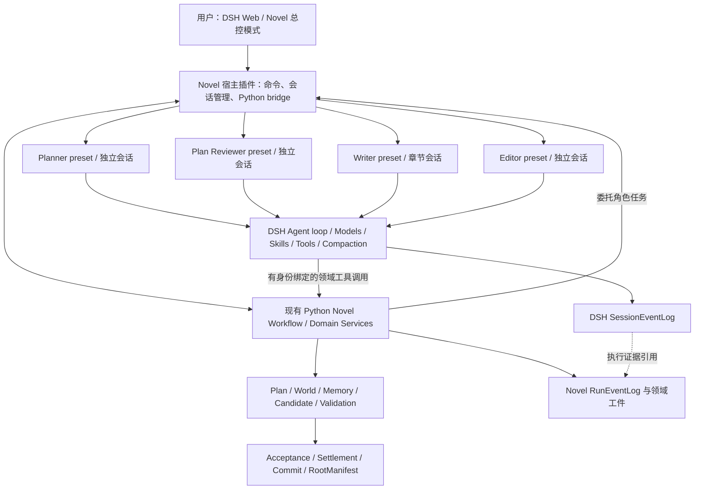
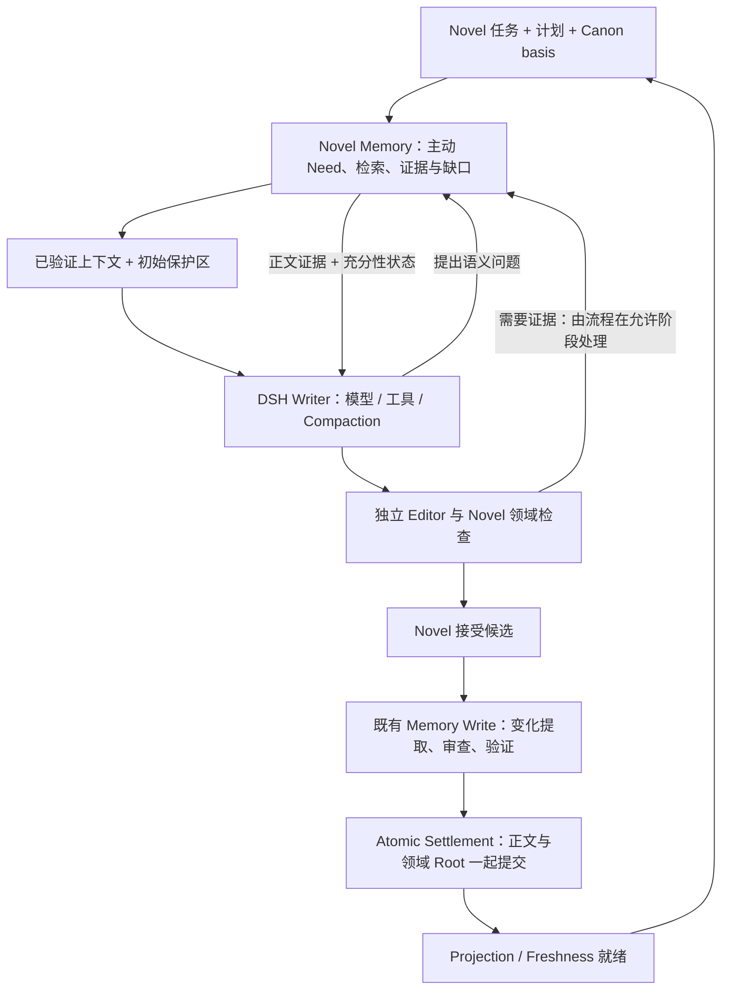

# T7：以 DSH 自定义模式承载 Novel 系统

> Lifecycle：`PROPOSED / SOURCE_REVIEW`。更新：2026-09-12，按“DSH 作为外壳，Novel 提供整体流程、Skill 和工具”修订。
>
> 本文是接入设计，尚未实现插件、启动 runtime 或验收运行效果；生产装配未切换。
> 关联：[ADR-0011](adr/0011-deepseek-harness-execution-spike.md)。

## 1. 推荐决定

**采用 DSH 原生自定义模式：一个 Novel 应用 profile，一个 Novel 扩展 bundle，多个角色 preset。DSH 承担应用外壳和通用 Agent 执行；Novel 提供确定的创作流程、领域上下文、Skill、工具以及验收规则。**

用户提到的现成入口也找到了：DSH 内置 **“创造模式”**，内部 preset ID 为 `cordis`，显示说明明确写它用于创建自定义 Agent preset。它在标准能力上增加运行时检查、插件实验和组合编写指导，并自带 `editing-cordis-compositions` 与 `cordis-plugin-development` 两个 Skill。[D18][D19]

DSH 已有 `@deepseek-ai/dsh-agent-presets`。模式目录中的 `agent.cordis.yml` 决定该会话加载的角色提示词、工具、Skill provider 和压缩组件；`preset.yml` 提供模式名称等显示信息。`profile` 则配置整个应用，包括 UI、模型路由、持久化和宿主服务。这两层可以一起使用。[D1][D2]

上版方案过于偏向“Python 通过 SDK 发起几个模型调用”。它适合协议探测，但不足以实现本次要求的运行外壳。本版以 **DSH 原生宿主插件 + 角色 preset** 为主路径；Python SDK 为可选客户端，SDK 尚未暴露的恢复接口不再是这条路径的首要阻断。宿主插件直接使用 DSH 已公开的 `agents.create/resume`、preset mount、session persistence 等服务。

核心流程保留指的是保留业务语义与状态转换：分层规划、记忆需求、起草、独立审查、修复、接受和原子提交。现有通用会话实现可以替换；若同时保留完整旧 Agent loop，再外包一层 DSH，反而难以得到预期收益。

### 1.1 Python SDK 与原生插件方案的选择

两者处于不同层次：Python SDK 是启动/调用 DSH 的客户端；profile、preset 和 Cordis plugin 是
DSH 的组成方式。SDK 也能选择 profile、patch 和安装的外部 bundle，因此不能说“用 SDK 就无法
接 Memory 或保留 compaction”。但当前 SDK 服务端创建会话时没有挂载 preset，公开请求面也没有
完整的角色选择、resume、cancel、flush/history 控制；要满足本方案仍需做宿主适配。[D16][D20]

| 判断项 | Python SDK 为主入口 | 原生 Novel profile/presets + 薄桥 |
|---|---|---|
| 快速从现有 Python 发起一个任务 | 启动成本较低 | 需要先构建少量 TS 集成 |
| 保留 Python Memory 实现 | 可以 | 可以 |
| 多角色模式、Web 与生命周期整合 | 需补齐对应服务端组合和控制 | 直接使用宿主公开服务，适合本次外壳目标 |
| Memory 回调与阶段规则 | 仍需工具/桥接；SDK 不会自动连接 Python 函数 | 由角色工具连接同一 Python Memory 服务 |
| DSH 压缩 | 取决于实际 composition；sdk-minimal 默认不含压缩 | 在各 Novel preset 中显式装配 |
| 小说质量与记忆收益 | 取决于领域闭环、输入与模型，没有天然质量劣势 | 同样需要对照验证，没有天然质量优势 |

本次推荐原生方案作为长期形态，因为目标包括完整外壳、自定义角色与持续执行。首次实现仍以
Python 为领域中心，先完成一个 Writer 角色的真实 Memory 往返与压缩，不先迁移整个系统。
SDK 可留作脚本、实验或后续外部客户端；支持完整控制需要复用/适配同一宿主协议，不建立第二套
Memory 和调度实现。若当前目的仅是从 Python 验证模型文本生成，SDK 的投入更小。

## 2. 依据与本轮范围

| 对象 | 本轮源码依据 |
|---|---|
| Novel | `D:\agent\Novel-System`；HEAD `1856153298856bdcb6eb7a8c6ad62f0727ac9683` 加当前未提交工作区 |
| DSH clone | `D:\agent\deepseek-harness`；`c291e7961a515f6d7af9304e7fd1d257929aef26` |
| DSH 版本 | 提交时间 `2026-09-10T22:17:09+08:00`；根 package 版本 `0.1.5-rc.2` |
| 证据等级 | 源码调用链、配置与官方文档核验；无安装、编译、真实模型或 crash 实测 |

Novel 工作区另有正在进行的生产内容链修复。本文按读取时的函数和职责描述，不把旧行号或上一轮文件 hash 当作当前源码不变的证明。此次只维护本设计、ADR 和文档索引。

DSH README 仍标为 Developer Preview。因此可以选它作为外壳，但“当前版本已经适用于 Novel 的长期生产运行”仍需验证。原型必须锁定 runtime、bundle、preset、Skill 和输出 schema 的版本。[D3]

## 3. 应用形态与唯一责任人



这里的“Novel 插件”逻辑上包含流程和领域能力，物理上可以由少量 TypeScript 插件和现有 Python 服务共同组成。Python 不必改写成 TypeScript；桥接也不意味着再造一个状态机。

| 职责 | 唯一 owner | 落地方式 |
|---|---|---|
| Web、模式选择、会话展示、执行过程展示 | DSH | 复用 Web profile 的已有组件；Novel 增加 run 状态投影 |
| Agent 的模型／工具轮转、会话历史与压缩 | DSH | 每个角色使用完整的 DSH 会话，启用 compaction |
| 小说业务步骤、修复分支、接受等待、任务 attempt/fence | Novel | 复用当前 Python Runtime 与领域服务；宿主插件做代理 |
| Plan authority、World obligation、知识可见性、Memory 正文选择 | Novel | 生成可信任务上下文，并通过受限领域工具增量补充 |
| 角色方法与创作技巧 | Novel Skill | 导出到 DSH Skill provider，按角色和任务模式加载 |
| 候选、报告的结构和领域合法性 | Novel | 工具参数 schema + Python 完整校验 |
| 总预算、消费归属、语义重试 | Novel | 对 DSH 的每次实际模型调用记账和准入 |
| 模型连接、流式响应、执行历史落盘 | DSH | provider/LLM 生命周期接入预算与审计桥 |
| 接受与 Canon 提交 | Novel | 仅由可信流程调用既有 Acceptance / Settlement 服务 |

DSH 的通用 `workflow` 组件主要提供模型编写脚本的执行与扇出，不能直接当作已经实现 Novel 业务状态机的 durable workflow。首版不让模型生成脚本来决定章节提交或调度规则。[D14]

当前以 PostgreSQL Runtime 为业务调度基线。未来的 Temporal 迁移是外层 durable lifecycle 的决定；不能同时让 PG、Temporal 与 DSH jobs 各自推进同一个章节任务。

## 4. 自定义模式怎么配置

### 4.0 从现成的“创造模式”开始

开发 Novel 角色时，可以在独立开发 home/profile 中保留内置 `cordis` 模式及用户 preset 根，在新会话选择“创造模式”，让它创建并试验 Novel preset。该模式的 `tool-cordis` 能检查运行时、挂载临时插件并卸载；随模式附带的两个 Skill 指导 host/preset 分层与插件开发。它提供配置开发入口，Novel 的现有领域接口仍需要实现和验证。[D19]

推荐开发路径：

```text
DSH 创造模式（cordis）
  -> 创建 novel-planner / novel-writer / novel-editor 的实验 preset
  -> 编写领域工具插件，连接现有 Python 服务
  -> 验证工具流程、Skill、compaction 和恢复
  -> 将通过验证的文件收敛到版本化 dsh-novel bundle
  -> 在 novel 运行 profile 中使用固定的 Novel presets
```

下面运行 profile 的 `includeShippedRoot: false / includeUserRoot: false` 是固定生产模式清单的配置；开发 profile 保留相应根，才能继续使用创造模式与复制 preset 的入口。创建器和运行角色采用各自需要的配置，Writer/Editor 只加载创作和审查能力。

### 4.1 两级配置

应用 profile 建议命名为 `novel`，从 `web` 模板建立。其 bundle 栈为：

```text
@deepseek-ai/dsh-base
@deepseek-ai/dsh-web-app
dsh-novel                         # 拟新增的本地 Novel bundle
```

`dsh-novel` 的 host patch 负责：

- 注册一个 `novel-host` 宿主服务：管理 Python 进程、双向 RPC、会话绑定、领域命令和执行对账。
- 将 agent preset roster 指向受版本控制的 Novel 模式。
- 保留模型、token meter、session persistence、checkpoint policy 和 Web 会话服务。
- 审计最终工具和 prompt 清单，避免把编码工具、代码仓库指令、任意工作流入口带入小说角色。

DSH 的 Web bundle 已把大部分模型可见工具移到 preset 中，同时保留宿主 registry 与持久化服务。Novel 可以沿用这一分工。[D4]

下面是拟新增 bundle 的 **host patch 片段**；包名和 Novel 路径为设计值，相关实现尚不存在：

```yaml
- id: agent-presets
  config:
    default: novel-director
    includeShippedRoot: false
    includeUserRoot: false
    roots:
      - path: D:/agent/Novel-System/integrations/dsh-novel/presets
        trust: system

- insert:
    - id: novel-host
      name: dsh-novel/host
```

长跑环境显式使用 `patchReload: startup`，绑定最终组合 hash；开发环境另开 profile 才使用 live reload。配置 patch 会替换对应 row 的整个 `config`，不能当作递归合并。[D2]

### 4.2 五个角色模式

| Preset | 职责 | 主要领域工具 | 会话粒度 |
|---|---|---|---|
| `novel-director` | 接收用户意图，启动、暂停、恢复、查看 run | `novel_run_start/status/pause/resume` | 一个用户操作会话；不保存领域权威状态 |
| `novel-planner` | 指定层级的计划构造和补充 Memory | `novel_memory_query`、`novel_submit_plan` | 一个 planning task/attempt；首轮 ARC_VOLUME |
| `novel-plan-reviewer` | 独立检查父计划、范围与义务 | `novel_read_evidence`、`novel_submit_plan_review` | 一次计划审查，显式受限的审查上下文 |
| `novel-writer` | WorkPlan、检索、起草及授权修订 | `novel_submit_work_plan`、`novel_memory_query`、`novel_submit_draft` | 一个章节创作任务的多轮会话 |
| `novel-editor` | 依据计划和正文审稿，提出修复或重规划建议 | `novel_read_evidence`、`novel_submit_editor_review` | 一个候选的审查任务 |

以上工具均为拟议接口，具体参数从当前领域契约生成；不是 DSH 已内置的小说工具。Candidate Observation、Curator 等可在后续按同样方式迁移，首轮明确记录它们仍用原执行器，不能声称三角色迁移就覆盖了全部模型调用。

`ARC_VOLUME / CHAPTER / SCENE` 是 Planner 的业务任务模式；`DRAFT / CONTINUE / MAJOR_REWRITE` 是 Writer 的业务模式。它们继续由 Novel 下发的任务描述和权限控制，不等同于 DSH 的编码 `plan-mode`。

**角色切换用新会话。** DSH 只允许空会话切换 preset。Planner 产生内容后不能原地切成 Writer；Editor 也不应继承 Writer 的私人完整历史。通用 subagent 的 spawn/fork 默认继承父 preset；“让 Writer 开一个子代理”不会自动得到独立 Editor 配置。[D1][D5]

同一个 Writer 内可以多轮补充记忆、推进草稿、接收允许的修复反馈，让 DSH compaction 实际发挥作用。不要每次模型调用都新建会话。跨章则开启新 Writer 会话，从 Novel 的已提交领域状态生成 seed，避免整本小说依赖一条不断摘要的聊天历史。

### 4.3 Writer preset 的核心片段

下面为配置骨架，不是可直接运行的完整文件。Skill 路径中的 `<manifest-sha>` 由 exporter 生成；`dsh-novel/*` 模块待实现。

```yaml
- id: persona
  name: '@deepseek-ai/dsh-persona'
  config:
    prefix: |
      你是 Novel 系统的 Writer。依照当前任务、获准的计划和世界事实创作。
      缺失信息通过领域工具请求；候选和自我判断不能成为独立事实证据。
      依照宿主当前阶段契约提交结果。
    complete: false
    includeRuntimeContext: false

- id: novel-context
  name: dsh-novel/context

- id: novel-writer-tools
  name: dsh-novel/writer-tools

- id: skill-filesystem
  name: '@deepseek-ai/dsh-skill-filesystem'
  config:
    providerName: novel-writer-skills
    includeDefaultRoots: false
    customSkillDirs:
      - D:/agent/Novel-System/tmp/t7-dsh/skill-snapshots/<manifest-sha>/writer
    watch: false

- id: tool-skill
  name: '@deepseek-ai/dsh-tool-skill'

- id: compaction
  name: cordis:group
  group: true
  isolate:
    compaction: true
    toolResultPruner: true
  config:
    - id: compaction-basic
      name: '@deepseek-ai/dsh-compaction-basic'

    - id: command-compact
      name: '@deepseek-ai/dsh-command-compact'

    - id: tool-result-pruner
      name: '@deepseek-ai/dsh-compaction-tool-result-pruner'
      config:
        thresholdChars: 8192
        headChars: 4096
        tailChars: 1024
```

压缩分组沿用标准 preset 的实际结构；token meter 留在 host。领域工具与 context 模块只注册 scoped 行为，不在 preset 里泄漏全局服务；需要独立服务时放入对应 `isolate` 分组。一个 preset 的插件实例会服务多个会话，可变数据必须按 session/agent 保存，不能放进“当前章节”这种共享字段。[D5]

`complete: false` 很关键：设成 true 会让 persona 替代其他 system prompt section，可能把领域保护区或 Skill 指引一并遮掉。`includeRuntimeContext: false` 用于禁止自动混入工作目录等动态 context；Novel 自己提供所需的任务内容。[D6]

**不能拿 minimal preset 当作完整起点。** 它没有上述默认 compaction 配置。Novel 应使用专用 preset，并显式保留标准模式中的压缩分组、宿主 token meter 与持久化配套。

## 5. 核心流程如何保留并接入

### 5.1 保留业务状态机，替换会话执行部分

当前生产装配与调用点如下：[N1][N2][N3][N4]

```text
CreativeRuntimeService.advance()
  -> Stage4PlanningLeafAdapter
     -> PlanningContextLoopService
        -> PlannerAgent / PlanReviewerAgent -> StructuredAgentRunner

  -> Stage3WritingLeafAdapter
     -> WriterContextLoopService
        -> WriterCognitionService.create_work_plan()
        -> WriterCognitionService.take_turn()
        -> EditorialService -> EditorAgent -> StructuredAgentRunner
        -> CandidateObservationAgent
        -> WriterCandidateMaterializer / reconciliation

  -> Plan/Draft Acceptance
  -> Settlement / Commit
```

Writer 不是只经过 `StructuredAgentRunner`；`WriterCognitionService` 当前直接调用 `ModelGateway`。因此只换 Runner 会漏掉主 Writer，还会把每次 cognition 调用包装成一个短 DSH 会话，无法形成所需的长期角色执行。

推荐以 `PlanningLoopRequest / PlanningLoopResult`、`WritingLoopRequest / WritingLoopResult` 为粗粒度边界。新增 DSH planning/writing leaf，由同一个运行时配置选择旧或新执行器。新 leaf 调用既有领域准备、Memory、materialization 和审查服务；真正的模型／工具 turn 由 DSH 执行。

需要从现有 ContextLoop 中提取可复用的领域步骤，不能另写一套近似流程：

| 现有模块 | 保留 | 对 DSH 路径的改造 |
|---|---|---|
| `services/creative_runtime.py`、runtime commands | Task/Attempt/fence、业务状态转移、接受等待、预算与恢复 | 把角色执行委托给可选择的 DSH leaf，保存执行引用 |
| `planning_context_loop.py` | 层级与父计划约束、Need 准入、独立评审、重规划条件 | 从逐轮 JSON action 驱动拆出领域操作，供 DSH tool 调用 |
| `writer_context_loop.py` | WorkPlan 顺序、Memory 条件、草稿物化、Editor、修复与结算前置规则 | 去掉同一 DSH 会话上的重复历史拼装和旧压缩调用 |
| `writer_cognition.py` | 输入契约、技能选择政策、WorkPlan/Turn 语义与输出校验 | 原先模型发出的业务动作转换为 DSH 原生工具调用 |
| `services/editorial.py` 与 Editor / PlanReviewer | 审查资料准备、独立性、报告校验和后续领域处理 | 新建独立 reviewer preset 会话；用报告提交工具返回结构化结果 |
| Context assembler、MemoryGateway | 选择正确的正文证据、父计划范围、World 义务、来源映射 | 输出有限的 seed/保护区和有预算的工具结果，不输出完整聊天历史 |
| ContextCompactor / AgentContextRuntime | 旧路径继续使用；领域 receipt/provenance 语义保留 | 已迁移角色的会话历史压缩由 DSH 独占 |
| ModelGateway | 未迁移角色继续使用；成本、准入、错误分类语义保留 | 将通用审计/预算逻辑抽成可复用服务，接 DSH LLM 生命周期 |
| CandidateMaterializer / Acceptance / Commit | 继续作为小说工件、接受与 Canon 的唯一负责模块 | 消费验证过的角色候选；不暴露直接 Canon 写入给模型 |

这是有范围的重构。可以保留旧路径做对照与回退，但同一任务只能选一个执行器，不能同时跑两个有权提交结果的 leaf。

### 5.2 一次自动流程

```text
用户在 Novel 总控模式请求推进某卷／某章
  -> novel_run_start 保存 Novel 业务命令并返回 run 引用
  -> Python Runtime 决定当前需要规划还是创作
  -> 宿主按指定 preset 创建 Planner 会话
  -> Planner 请求 Memory、提交计划候选
  -> 独立 Plan Reviewer 会话完成审查
  -> Novel 执行计划接受规则
  -> 创建 Writer 会话，先提交 WorkPlan，再检索／起草
  -> Writer 提交完整候选，Novel 物化并验证
  -> 独立 Editor 会话提交报告
  -> Novel 决定局部修复、重大重写、重新规划或进入接受
  -> 接受后由既有 Settlement 完成正式 Commit
```

Director 提出的操作经 Novel 命令服务校验后才生效；步骤推进不依赖它“记住计划”。Writer 的 work plan 提交和候选提交也是不同阶段，服务端拒绝跳过前置条件。Editor 提议重规划，是否触发由领域流程及预算判定。

**第一轮 PoC 到候选与报告为止，不连接正式 Canon mutation。** 后续接通正式链路时，Commit 仍是可信宿主调用，不添加 `novel_commit` 这种模型可调用工具。

### 5.3 TypeScript 与 Python 的连接

建议一个 DSH Node 进程托管一个 Novel Python domain worker，用本地双向 JSON-RPC over stdio 通信。该 RPC 是拟新增的 Novel 协议，不是复用或宣称扩展了现有 Python SDK 协议。首次部署复用项目实际可用的 Python 环境。

| 方向 | 拟议请求 | 用途 |
|---|---|---|
| TS → Python | `domain.command` | start/pause/resume、查询业务状态 |
| Python → TS | `role.execute / role.resume / role.cancel` | 让 DSH 承接一个角色任务 |
| TS → Python | `domain.invoke` | 领域读取、Need、候选/报告提交与验证 |
| TS → Python | `execution.reconcile` | 模型消费、持久结果与执行状态对账 |

两端必须一直消费 RPC 输入，支持执行中回调：Python 等 Writer 时，Writer 的 Memory 工具仍需调用 Python。不能采用“等待 role.execute 返回期间暂停读管道”的单线程请求循环。标准输出只用于 RPC，日志走标准错误；启动路径和环境由宿主明确配置。

宿主使用公开 API 的骨架可以参考 DSH 自带 webhook 的创建方式：[D7]

```typescript
// 示意：省略项目类型、幂等登记、异常回滚、权限与恢复实现。
const preset = await ctx.agentPresets.resolve(request.presetId)
await ctx.agentPresets.standingKeyFor(preset.id)
const workspace = await ctx.workspaceRegistry.create(request.workspacePath)

const handle = await ctx.agents.create({
  sessionId: request.sessionId,
  signal,
  meta: { cwd: workspace.path, agentPreset: preset.id },
  setup: async (agentCtx) => {
    await ctx.agentPresets.mount(agentCtx, preset.id)
    // 在发出第一条消息前绑定可信 Novel 身份、context snapshot 和模型选择。
  },
})
await workspace.attachSession(request.sessionId)
// 持久化 binding 后，再通过 handle.agent.followup(...) 发送首条任务消息。
```

恢复必须走 `ctx.agents.resume({ resumeSessionId, ... })`，并恢复同版本 preset、模型策略、权限、workspace 关联和 Novel binding。创建后把 session 挂入 workspace，才形成完整的 Web 工作区接入；业务 run 的聚合状态展示仍需 Novel 提供。

## 6. Skill、工具与结构化结果

### 6.1 Skill 沿用现有方法库

当前 Novel Skill 是 `src/novel_agent/skills/*.md` 与 `registry.py` 管理的方法正文，已经存在角色和阶段差异；例如 scene composition 明确把输出协议与权限交给宿主。迁移时保留这些方法，避免把调度、输出 JSON 协议或提交权限重新写回 Skill。[N5]

新增 exporter，从 Novel registry 生成 DSH 可读的只读快照：

```text
Novel Skill source + version/hash + role allowlist
  -> 自动导出 writer/novel-scene-composition/SKILL.md
  -> DSH catalog 展示名称与适用说明
  -> 当前角色按需加载正文
  -> Novel receipt 记录实际加载的版本与 hash
```

DSH Skill 名称使用 kebab-case，目录正文为带所需 frontmatter 的 `SKILL.md`。例如 Novel 的 `skill.scene-composition` 映射为 `novel-scene-composition`；映射、原始内容 hash 与导出 hash 写入 manifest。不要靠复制后人工维护两份正文。[D8]

`includeDefaultRoots: false`、`watch: false` 和按角色导出的目录只解决扫描范围与热更新问题；正式 loader 还需验证 manifest、任务允许列表和加载 hash，不能把这些字段当成权限校验。相同角色在不同业务模式下，也只能加载当前任务允许的方法。

模式实例共享和 Skill 变更是两个问题：preset generation 目前主要根据组合文件的 mtime/size 判定，不能保证只改 Skill 后仍恢复到旧内容。因此正式 run 绑定不可变快照目录及内容 hash，不依赖修改文件时间来锁版本。[D5]

### 6.2 工具是真正的接入点

`novel_memory_query` 接收业务 Need，调用现有 MemoryGateway；不让模型选择索引、数据库或底层检索通道。返回有限的证据正文、来源、可见范围和 artifact 引用，不能只返回 hash 让模型“自行理解”。

提交工具从现有输出契约生成参数 schema，例如 WorkPlan、Plan candidate、完整 Writer candidate、Editor review。JSON Schema 需要适配 DSH 支持的 schema 子集，Python Pydantic/domain validator 仍做完整验证。DSH 工具的 output schema 约束工具返回，不等于自动保证模型生成正确的小说结果。[D9]

非法结构、缺正文、引用不成立、过期 basis 都返回可诊断的拒绝；有界修复机会和预算由 Novel 政策决定。候选语义成功以“有效提交已被领域服务登记”为准，不能从聊天最后一条 assistant 文本、`idle` 或“我完成了”推断。

提交成功后，宿主需要一个明确的结束协议：先记录提交与工具结果，关闭后续提交/模型调用入口，等待执行边界与持久 flush，再确认完成。对提交后的额外工具批次也需做 guard，不能只靠 prompt 要求停止。失败或中断时通过幂等提交记录恢复。

### 6.3 身份由宿主绑定

每次执行至少绑定：

```text
project_id / run_id / task_id / attempt_id / fence
role / business_mode / execution_id / session_id / operation_id
basis_commit_id / context_snapshot_hash
preset_hash / skill_manifest_hash / schema_version / model_policy_hash
```

这里的 `basis_commit_id` 是已有小说状态的基准；未来 `result_commit_id` 只有正式接受并提交后才产生。不能预先把 DSH session 完成绑定成新 commit。

模型参数不携带可以自行改写的 role、fence 或权限。工具根据调用会话查可信 binding，Python 再验证。会话 metadata 便于展示，但仅有 meta 不构成授权。

DSH `tools.restrict` 主要屏蔽继承的全局工具，不能当作对所有 scoped 注册的绝对 allowlist。因此角色 preset 只注册需要的领域工具，并用 DSH 工具 guard 与 Python 阶段校验共同拒绝越权。首版采用 native tools；不要求启用模型编写代码的 PTC 才能集成。[D9]

## 7. 保留 DSH 上下文压缩

### 7.0 Memory 是必须经过的领域服务

本系统以 Memory 为核心能力，集成应保留“任务驱动需求 → 检索与证据充分性 → 正文交付 →
创作消费 → 审稿反馈 → 接受后的记忆更新”的完整闭环。Memory 服务是 Novel 宿主依赖，不能仅作为
一个由模型自行决定是否使用的搜索 Skill。`novel_memory_query` 只是它的一个模型入口。

本轮工作区中可以定位到这些实际能力：

| 记忆能力 | 现有负责模块 | DSH 接入必须保留 |
|---|---|---|
| 从任务、计划和世界状态产生 Need | `TaskPlanConditionedNeedGenerator` | 角色开工前主动生成需求和初始上下文；不等 Writer 自己发现全部历史约束 |
| 从语义问题到可执行检索 | `WriterReactiveNeedAdapter` | grounding → validation → query compilation → MemoryGateway；继续受 basis、范围和预算约束 |
| 结构化锚点、时序/图/文本渠道和原文证据 | `memory_pipeline`、`NeedQueryCompiler`、`PairedMemoryControllerRunner` | 复用现有路由、实体/关系/时间语义和 L0 证据展开，不重写成单个向量搜索函数 |
| 回答充分性与缺口 | `MemoryGateway`、`NeedEvidenceSemanticJudge`、`NeedCompletionEvaluator` | 保留逐 Need/facet 状态，区分已命中、部分回答、充分、未评估和失败 |
| 正文交付及来源 | Context compiler、`writer_reactive_memory` | 模型实际看到证据正文；保留 source/basis/visibility、mandatory 标记与冻结引用 |
| 审稿反馈 | `EditorialService` | 独立判断 Memory gap；只用可信来源支持事实；触发补检索、避写、修复或阻塞 |
| 持久记忆形成 | `LocalMemoryWriteWorkflow`、`AtomicChapterSettlementAdapter` | 基于已接受正文提出变化，验证后原子提交，投影就绪才向下一任务宣称新快照可用 |

代码依据见 [N6]～[N13]。这些是源码已存在的职责，不是本轮文学质量或长跑验收结论。
当前 production bootstrap 已将语义 judge 接入 implementation 模型路径；不能继续套用旧审查中
“仅 BATCH_TEST 才创建 judge”的结论。该接线仍不等于真实语义判断质量已经验证。[N1]

完整生命周期建议如下：



图中审稿触发补记忆是拟保留/补齐的业务能力，并不意味着当前每个修复阶段已经允许检索。
当前不同 Writer 模式的权限继续检查；若 MAJOR_REWRITE 等阶段不支持 Memory 交互，流程应先
退回获准的补记忆步骤、冻结新的输入，再进入该阶段，或返回明确阻塞，不能靠 DSH 工具绕过。
T7 首轮只走图中的候选与审查路径，后半段正式写入仍不启用。

为避免退化，接入有五项硬要求：

1. **主动准备**：必要事实、父计划范围、知识边界和高风险 Need 由宿主准备，不能全依赖模型调用工具。
2. **工具完整转发领域请求**：保留 question、purpose、blocked_action、known_context_item_ids、
   requested_evidence_type 和 scene_or_draft_checkpoint 等语义，不简化为任意 query 字符串。
3. **不足必须有后果**：高风险缺口可补检索、避开相关断言、重规划或阻塞；不能将“有命中”直接等同
   “可以写”。普通可选背景按领域政策处理，不要求所有细节都检索到才允许创作。
4. **压缩后可重建**：必要约束进入日志化保护区，证据正文有固定来源可重读。需要逐字审稿的候选
   与证据不能只剩摘要；重新交付时记录新的曝光/请求位置，不伪造“模型始终记得”。
5. **写入遵循接受与结算**：DSH summary、Writer 自述或工具成功均不能直接生成 Canon 事实。
   下一章 Memory 必须绑定已提交且投影就绪的 basis，不能读取尚未确认的候选状态。

DSH 的外层工具循环调用一次 `novel_memory_query`，内部可以继续执行 Novel 多步 Need/检索
controller。该领域搜索算法有自己的目标与状态，不能因为它也使用 graph 或 agentic controller，
就误判为重复的 Writer Agent loop 并删除。服务端的 Memory 版本、预算、模型消费和恢复引用须随
执行绑定记录；迁移 DSH 会话不意味着迁移或改写 Memory 算法。

一个具体适配点是 `WriterReactiveNeedAdapter.resolve()` 目前接收 `AgentContextView`。DSH 路径
仍须从冻结 seed、已记录的 Memory delta/receipt 和当前领域指令构造它所需的语义投影，保留 basis、
已知 context item 和去重状态；不能直接删除这个输入，也不能把 DSH 摘要文本冒充它。会话完整历史
继续由 DSH 维护，领域投影只重建 Memory 决策需要的信息，二者通过持久引用关联。

例如第 50 章要让甲乙合作：Memory 可以根据第 8 章的背叛、第 42 章有条件和解的原文以及各人物
当前知识状态，交付这场合作的前提。即使 DSH 已压缩掉早期讨论，这些证据仍可由领域存储重新取得。
此例仅说明设计作用，不是现有小说产物或实验结果。

### 7.1 压缩的三种内容

| 内容 | 存储与处理 |
|---|---|
| 已接受计划、Canon、世界义务、领域 Need 状态 | Novel 领域存储与工件是权威；DSH summary 无权修改 |
| 当前任务必须遵循的有限内容 | Novel 编译成有版本的保护区，由 DSH 日志化 prompt/context 机制注入 |
| 历史讨论、已处理工具结果、旧草稿与探索 | DSH 保留原始日志，用安全区间压缩和近期 tail 控制模型窗口 |

保护区包含当前任务和章号、有效父计划的适用要求、到期 obligation、知识/揭示边界、未解决 Need、当前修复指令及 provenance 引用。要求模型使用的事实应包含必要正文，不能只有工件编号。

这不是将全部世界设定永久塞入 system prompt。保护区需要明确上限；按领域规则筛选后仍放不下时，拆分任务或 typed suspend。历史草稿可以外存，编辑当前候选时按需重载完整相关正文。

### 7.2 注入使用 DSH 正常日志链

`dsh-novel/context` 通过 scoped `systemPrompt.section` 等正常组装机制提供当前约束。DSH 将系统提示词变更写入会话，后续请求从日志推导。不能在 provider hook 中偷偷拼接另一套未记录的 messages。[D10]

section 的 `text` 回调是同步接口。Python 读取、权限验证和内容组装应在任务开始或领域状态更新时完成，再持久化版本、写入会话绑定并更新按 session 缓存的快照。组装回调只渲染已验证的快照；恢复时须从日志绑定和对应 immutable artifact 重建。领域内容变化与下一次请求的顺序需要集成验证。

保护区的“不可丢失”是本接入要实现并测试的合同，不是只命名为 protected 就自动成立。验收应直接检查 compaction 后的 provider 输入，包括 overflow retry，再检查模型对约束的执行效果。

### 7.3 复用压缩机制，定制摘要内容

标准 `compaction-basic` 已提供区间选择、工具单元边界、近期 tail、summary replacement、并发校验和 overflow 恢复；这些机制继续使用。默认摘要提示词写的是英文软件工程摘要，不适合直接作为最终小说摘要。[D11][D12]

首个原型就装配并开启 DSH compaction。在同一验证阶段增加 `dsh-novel/compaction`，继承 `BasicCompactionEngine`，只覆盖公开的 protected `summarize(input, agent, signal)` 扩展点；保留原来的压缩发布流程、调用 envelope、取消和 token 计量。当前 YAML 没有一个现成的“小说摘要模板”字段，不能假设仅填配置就完成这个定制。

建议摘要记录：当前目标与阶段、已完成动作、候选工件、讨论中的决定及其来源、未解决阻塞、下一步、需重新读取的证据。不能把 Writer 提议写成既定世界事实，也不能把摘要用于更新 Canon。候选稿原文放在 artifact 中，摘要指向它；再次精修时按任务预算加载。

默认的 tool-result pruner 可能省略大工具结果正文。所以仍然需要的证据必须可通过 Novel 工具重载；mandatory 正文由当前保护区保证，不能指望旧工具输出经过裁剪仍完整。

当前 Novel 的 `ContextCompactor` 不再处理同一个 DSH 会话历史。Memory 选择、上下文编译和领域预算继续属于 Novel；DSH 负责该会话的机械窗口管理和历史摘要，防止双重压缩造成来源和内容丢失。

### 7.4 成本与复现

compaction 会额外调用 `ctx.llm.stream`，带 `purpose: compaction`，不经过普通 Agent request hook。因此预算与审计必须接到所有 LLM/provider 调用的共同生命周期，覆盖摘要、失败尝试和修复调用。不能把一个 DSH 多轮执行伪装成 Novel 的一条单次模型请求。[D12]

保留 DSH 实际发送的 messages/tools、模型选择、参数、usage、调用状态与原始响应引用；Novel ModelCallLedger 按实际调用逐条关联。调用前的预算预留与超额拒绝需要适配，不能事后写总 token 就视为保留了 admission。不能把“禁用压缩”作为预算桥未完成时的生产方案。

## 8. 恢复、日志和领域提交

```text
DSH SessionEventLog = 该角色怎样执行
Novel RunEventLog   = 创作流程发生了什么
Novel Commit        = 哪些领域结果已被接受并原子发布
```

宿主创建/恢复会话时使用 Novel 的持久执行绑定和 operation ID。已有会话必须打开原日志，不能无条件再次 create。新 attempt 的 fence 变化后，先停止或隔离旧执行，再决定恢复原角色上下文或基于已确认 checkpoint 新开会话；旧权限不能随 session 名称继续有效。

DSH 的 JSONL 单写者、尾部修复、checkpoint policy 和核心 resume 可以复用，但不存在两个进程之间自动原子完成的领域事务。[D13][D15]

| 故障位置 | 接入需要保证的行为 |
|---|---|
| Python/TS 断连，prompt 是否接受未知 | 依 operation ID 和持久状态对账；禁止盲目重复 enqueue |
| provider 已处理请求但响应未落盘 | 标记 unknown；允许有记录的重试，不能保证模型零重复计费 |
| 候选已写入 Novel，DSH 尚未写完工具结果 | 相同幂等提交返回同一 candidate receipt，补齐执行记录 |
| DSH 写入完成，Python 尚未记录 leaf 结果 | 从有效 receipt 和日志对账，不重新生成已确认候选 |
| compaction 中断或文件尾部损坏 | 复用 DSH 恢复机制；重建保护区，验证旧历史仍可读 |
| preset/Skill/schema 已升级 | 查找固定版本；缺少必需旧版本时明确拒绝自动续跑 |
| stale fence / basis / 角色绑定错误 | 工具调用与最终接受都拒绝，不因 DSH 完成绕过领域校验 |

live event 是进度，不等于持久化确认。最终结果协议必须等待必要日志 flush 与 Novel 候选 receipt；DSH 导出日志时也需要确定导出边界。Novel 只保存 DSH session/事件位置/trace artifact 引用和领域摘要，不把整份大日志重复嵌套到每个 RunEvent。

用户可查看角色 session，业务面板由 Novel run 状态投影出“待计划审查／待修复／待接受”等状态；不要将 DSH 的 idle 直接显示为“章节已提交”。

原 SDK 的 `getOrCreateSession` 只查进程内缓存、对未知 ID 走 create，且未提供完整 history/flush/cancel RPC，是上一版发现的接口限制。这些结论仍是所锁定版本的源码事实，但本方案使用宿主公开服务来完成相应动作，无需先 fork 或替换 SDK server。[D16]

## 9. 文件组织与启动形态

建议只新增一个集成包，避免为每项服务建立独立仓库：

```text
integrations/dsh-novel/
  package.json                    # dsh.bundle.patch + host/tools/context 等 exports
  cordis.patch.yml                 # host composition patch
  src/host.ts                     # Python bridge、DSH 会话和 Novel 命令
  src/context.ts                  # 已验证领域快照的 scoped prompt
  src/compaction.ts               # 复用 BasicCompactionEngine，定制摘要
  src/tools/                      # 各角色领域工具及阶段 guard
  presets/
    novel-director/{preset.yml,agent.cordis.yml}
    novel-planner/{preset.yml,agent.cordis.yml}
    novel-plan-reviewer/{preset.yml,agent.cordis.yml}
    novel-writer/{preset.yml,agent.cordis.yml}
    novel-editor/{preset.yml,agent.cordis.yml}

src/novel_agent/adapters/harness/
  dsh_bridge.py                   # 双向协议与领域服务适配
  dsh_planning.py                 # PlanningLoopRequest/Result 边界
  dsh_writing.py                  # WritingLoopRequest/Result 边界

scripts/export_dsh_skills.py      # 从原 registry 生成只读 Skill 快照
scripts/run_t7_dsh_spike.py       # 单一试验与故障验证入口
tmp/t7-dsh/                      # ignored：home、快照、候选、日志、报告
```

这是预期实施目录，本轮没有创建上述代码。公共 port、schema 与 service 提取随实际 caller 一起设计，不先制造第二套通用框架。

以下是 **已构建固定版本 DSH 和 Novel bundle 之后** 的 PowerShell 命令形态，本轮未执行，也不表示集成现在可以启动：

```powershell
$env:DSH_HOME = 'D:\agent\Novel-System\tmp\t7-dsh\home'

# 只在首次创建 novel profile 时执行；dump 不启动应用。
dsh --profile novel --from-default-profile web --dump-default-config | Out-Null

# 集成包完成并构建后安装进新 profile。
dsh plugin --profile novel add D:/agent/Novel-System/integrations/dsh-novel

# 先检查组合结果，再启动；重启时不重复 --from-default-profile。
dsh --profile novel --dump-config
dsh --profile novel --no-open
```

实际部署需将新 profile 的 `dsh.profile.patchReload` 设为 `startup`，配置固定模型与预算桥，检查生效的 preset/工具清单。DSH 内置的 profile 创建、plugin add 和 dump 命令已由 CLI 源码/文档确认；上面假设 `dsh` 是锁定构建的 launcher。[D2][D17]

首轮使用独立 DSH_HOME 和授权的合成工作区，模型会话 cwd 不设为 Novel 代码仓库；Python worker 仍可通过明确路径加载项目代码。这样角色能力由领域工具和固定 Skill 决定。无需为这个架构启动另一套自制 Web 外壳。

## 10. 实施顺序与验收

### G0：自定义应用和模式真正加载

构建固定 DSH 版本，安装 Novel bundle，看到五个模式；验证 Planner/Writer/Editor 分别拥有预期 persona、tools、Skill catalog 和 compaction 服务。核验 profile reload 策略、checkpoint policy、token meter、session workspace 关联与模型预算 bridge。

必须进行隔离验证：两个同模式会话的章节数据不串流，不同角色只能加载各自获准的工具与 Skill。不能只看到 UI 模式名称就判通过。

### G1：真实领域接口形成多轮流程

先跑 ARC_VOLUME + 独立计划审查，以及 Writer WorkPlan → Memory → 完整候选 → 独立 Editor → 一轮领域决定的修复。接真实准备/校验/物化调用方，fake provider 用于协议与状态验证；真实模型质量另行记录。

从这一阶段起启用 DSH compaction，构造能触发实际压缩的多轮会话。必须在压缩后的最终 provider 请求中看到当前计划要求、揭示边界、未解决 Need 和必要正文，并验新稿是否遵守。旧 Novel compactor 不能同时介入该会话。

本阶段零正式 Canon 写入。输出至少包括角色结果、实际 Skill 加载记录、request/response、压缩前后输入、领域校验结果和关联日志。

### G2：恢复与失败协议

验证进程 kill/restart、RPC 丢失确认、候选提交重放、最终 flush、compaction 中断、budget exhaustion、同名 Skill 改动、stale fence/basis 和错误角色访问。每个故障要有期望领域状态与下一步恢复动作，不能只要求 DSH “还能聊天”。

验证超大初始上下文和不可分割工具单元：无安全压缩方案时明确阻塞。工具超时必须实际传播取消；仅填写 DSH tool definition 的 `timeoutMs` 不保证执行超时，需要对应 timeout policy 或宿主执行控制。[D9]

### G3：生产接线与收益判断

以相同冻结输入、模型和领域政策比较旧执行器与 DSH 模式，统计结构首次通过率、领域约束、含压缩的全部 token、耗时、真实调用数、trace 大小和恢复结果。需要时增加“DSH 关闭压缩”的对照组归因，但主方案始终保留压缩。

在隔离数据上验证完整 Acceptance → Settlement 链后，再讨论正式 canary。推广时明确退休哪些旧会话/压缩/通用重试代码；没有减少重复执行职责，就不能宣称已经完成架构迁移。文学质量、连续多章与长期无人干预效果需用真实成品和长跑另验，不能用 schema PASS 代替。

考虑 Memory 是核心研究目标，G3 增加独立归因对照，而非只比较 SDK 与插件的接入速度：

| 条件 | 目的 |
|---|---|
| A：现有 Novel executor + 完整 Memory | 检查迁移前后的领域行为与质量回归 |
| B：DSH + 完整 Novel Memory + DSH compaction | 推荐架构的主实验 |
| C：同一 DSH + 普通检索基线 + 同样 compaction | 识别 Novel 的 Need、证据充分性与领域检索带来的增益 |
| D：同一 DSH + 固定 seed/近期上下文 + 同样 compaction | 测量动态长期记忆的作用；只在离线隔离条件使用 |

各条件固定模型、任务、已提交可见语料、计划、共同必要约束、预算上限和评估口径；Gold、
未来正文和评分信息不可注入。Memory 能力差异要明示，不能宣称各组每个 token 输入完全一致。
模型调用有随机性，应做重复与盲评，并报告达到相同质量所需的成本。

指标至少分为：Need/facet 充分性、provider 实际收到的有效证据、跨章事实/因果/人物知识边界、
计划义务/伏笔兑现、Editor 修复效果、正文质量，以及全部 token/延迟。成本包括仍在 Python 中
执行的 Need planner、语义 judge 和 Memory 写入模型，不能只统计 DSH Writer 与摘要。
引用数量或模型自报“使用了记忆”不证明记忆产生作用，需要正文依据和对照差异。

先用同一冻结 Memory 输出做 A/B 输入交付等价检查，再做各组允许主动 Memory 行为的完整流程对照，
可以区分“接入丢了证据”与“模型没有正确使用证据”。本轮仅提出实验设计，尚无收益数值。

## 11. 与现有 ADR 的关系及本轮结论

本版 [ADR-0011](adr/0011-deepseek-harness-execution-spike.md) 提议对以下技术所有权作有范围的修订：

- ADR-0007 的来源、保护区、恢复与安全压缩不变量保留；DSH 路径的具体会话投影与机械压缩由 DSH 负责，Novel 保留领域 seed/projection 与 provenance。不能再要求 Novel 自己生成同一份聊天历史。
- ADR-0010 的外层 durable lifecycle 与业务边界保持独立；已迁移角色采用 DSH Agent loop 后，就不再为同一角色保留一个只负责相同轮转/压缩的 LangGraph loop。其他确有领域图价值的流程独立评估。
- 上述是新的 proposed 技术选择，不在本轮悄悄修改已经 accepted 的旧 ADR 或默认生产装配。

本轮完成的是自定义模式能力核验与可实施方案，未运行 PoC。下一步应该实现 G0/G1 所述 **Novel profile + 原生角色模式 + 领域工具 + 启用的 DSH compaction**，而不是继续把集成收缩成三次 SDK 文本调用。

## 源码索引

DSH 链接固定于上述 clone SHA；Novel 链接指向正在变化的工作区，以函数名和职责作为查找依据。

[D1]: https://github.com/deepseek-ai/deepseek-harness/blob/c291e7961a515f6d7af9304e7fd1d257929aef26/packages/preset/agent-presets/README.md
[D2]: https://github.com/deepseek-ai/deepseek-harness/blob/c291e7961a515f6d7af9304e7fd1d257929aef26/packages/boot/app-boot/README.md
[D3]: https://github.com/deepseek-ai/deepseek-harness/blob/c291e7961a515f6d7af9304e7fd1d257929aef26/README.md
[D4]: https://github.com/deepseek-ai/deepseek-harness/blob/c291e7961a515f6d7af9304e7fd1d257929aef26/packages/bundle/web-app/cordis.patch.yml
[D5]: https://github.com/deepseek-ai/deepseek-harness/blob/c291e7961a515f6d7af9304e7fd1d257929aef26/packages/preset/agent-presets/src/index.ts
[D6]: https://github.com/deepseek-ai/deepseek-harness/blob/c291e7961a515f6d7af9304e7fd1d257929aef26/packages/preset/persona/src/index.ts
[D7]: https://github.com/deepseek-ai/deepseek-harness/blob/c291e7961a515f6d7af9304e7fd1d257929aef26/packages/webhook/webhook/src/session.ts
[D8]: https://github.com/deepseek-ai/deepseek-harness/blob/c291e7961a515f6d7af9304e7fd1d257929aef26/packages/skill/skill-filesystem/src/index.ts
[D9]: https://github.com/deepseek-ai/deepseek-harness/blob/c291e7961a515f6d7af9304e7fd1d257929aef26/packages/core/tools/README.md
[D10]: https://github.com/deepseek-ai/deepseek-harness/blob/c291e7961a515f6d7af9304e7fd1d257929aef26/packages/core/system-prompt/src/index.ts
[D11]: https://github.com/deepseek-ai/deepseek-harness/blob/c291e7961a515f6d7af9304e7fd1d257929aef26/packages/compaction/compaction-basic/src/index.ts
[D12]: https://github.com/deepseek-ai/deepseek-harness/blob/c291e7961a515f6d7af9304e7fd1d257929aef26/packages/compaction/compaction-basic/src/summarizer.ts
[D13]: https://github.com/deepseek-ai/deepseek-harness/blob/c291e7961a515f6d7af9304e7fd1d257929aef26/packages/core/agent-loop/src/index.ts
[D14]: https://github.com/deepseek-ai/deepseek-harness/blob/c291e7961a515f6d7af9304e7fd1d257929aef26/packages/workflow/README.md
[D15]: https://github.com/deepseek-ai/deepseek-harness/blob/c291e7961a515f6d7af9304e7fd1d257929aef26/packages/session/session-checkpoint-policy/README.md
[D16]: https://github.com/deepseek-ai/deepseek-harness/blob/c291e7961a515f6d7af9304e7fd1d257929aef26/packages/sdk/server/src/server.ts
[D17]: https://github.com/deepseek-ai/deepseek-harness/blob/c291e7961a515f6d7af9304e7fd1d257929aef26/apps/cli/reference/README.md
[D18]: https://github.com/deepseek-ai/deepseek-harness/blob/c291e7961a515f6d7af9304e7fd1d257929aef26/packages/preset/agent-presets/presets/cordis/preset.yml
[D19]: https://github.com/deepseek-ai/deepseek-harness/blob/c291e7961a515f6d7af9304e7fd1d257929aef26/packages/preset/agent-presets/presets/cordis/agent.cordis.yml
[D20]: https://github.com/deepseek-ai/deepseek-harness/blob/c291e7961a515f6d7af9304e7fd1d257929aef26/docs/user/guide/python-sdk.md
[N1]: ../src/novel_agent/runtime/production_bootstrap.py
[N2]: ../src/novel_agent/services/creative_runtime.py
[N3]: ../src/novel_agent/services/writer_cognition.py
[N4]: ../src/novel_agent/services/writer_context_loop.py
[N5]: ../src/novel_agent/skills/scene_composition_v1.md
[N6]: ../src/novel_agent/services/task_conditioned_need_generation.py
[N7]: ../src/novel_agent/services/writer_reactive_memory.py
[N8]: ../src/novel_agent/services/memory_gateway.py
[N9]: ../src/novel_agent/services/memory_pipeline.py
[N10]: ../src/novel_agent/services/need_completion.py
[N11]: ../src/novel_agent/services/editorial.py
[N12]: ../src/novel_agent/services/memory_write_workflow.py
[N13]: ../src/novel_agent/adapters/runtime/chapter_settlement.py
