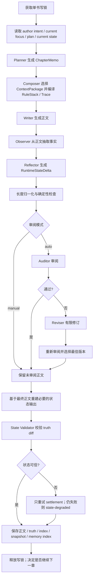
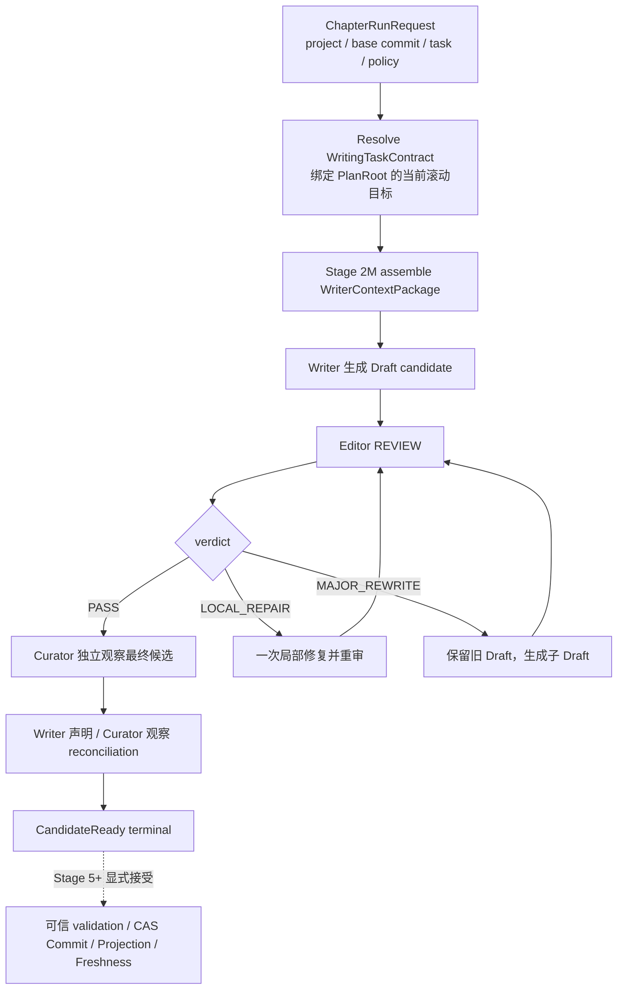
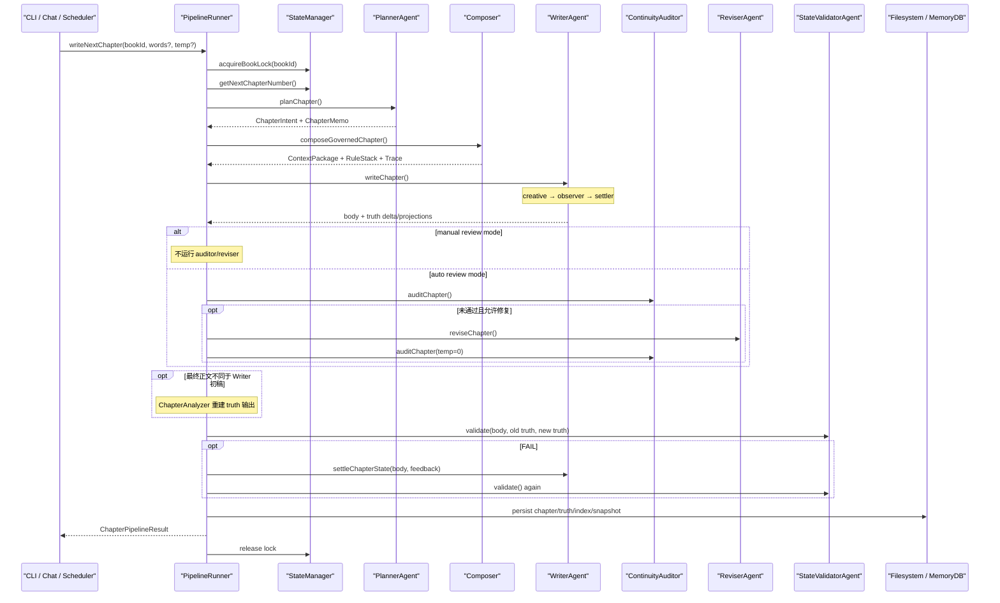

# InkOS 长篇小说 Agent 设计与实现调研

> 文档生命周期：`TECHNICAL_REFERENCE / NON_AUTHORITATIVE`
>
> 日期：2026-08-09
>
> 研究对象：`Narcooo/inkos` v1.7.2
>
> 源码快照：commit `a6e05d4d4567df0efd5825e9b0037146a16e4f3e`（2026-08-03）
>
> 本地源码：`inkos_lab/ref/inkos/`
>
> 本文职责：解释 InkOS 如何规划、生成、审阅、修订、结算并连续推进长篇小说，提炼可供
> Novel Agent 后续调度与执行设计参考的机制
>
> 本文不承担：修改本项目既有上位架构、批准新的 Stage 实现、证明 InkOS 的真实生成质量，或
> 把 InkOS 的代码/Schema 直接移植进本项目
>
> 2026-08-10 正式吸收映射：本文的滚动规划、protected/compressible Context、章节事务、有界修订和
> 局部恢复结论已进入 ADR-0006/0007、总体架构 U14 及 Stage 3/4 设计。InkOS 的章节 Planner 只能
> 作为规划目标优先级与材料筛选参考；NS Stage 4 必须先产生 PlanningInquiry/GoalProposal，再生成
> Planner MemoryNeed，不能复用 Stage 2M 已给定未来章节规划的 Writer Need 生成方式。

---

## 0. 调研方法与结论边界

本次调研以本地固定 commit 的源码静态追踪为主，交叉阅读了：

- InkOS README、三张架构图和 CLI 使用说明；
- `PipelineRunner` 的建书、逐章生成、审阅、修订、状态结算、持久化和恢复路径；
- Planner、Composer、Writer、Observer/Reflector、Auditor、Reviser、State Validator；
- 结构化状态、Markdown 投影、SQLite 记忆索引和卷级 consolidation；
- `auto` 连写命令、后台 Scheduler、会话自动化模式和 Agent tool surface；
- 与这些路径直接对应的测试代码。

本文没有运行 InkOS 的真实模型生成，也没有把 README 的产品宣传当作质量证据。因此：

1. “代码具备某机制”是源码事实；
2. “该机制值得本项目借鉴”是基于当前项目约束的技术判断；
3. “InkOS 已经稳定写出高质量长篇”不属于本次可证明结论；
4. 对可疑失败语义的判断会明确标为“需真实运行复核”，不写成已证实事故。

---

## 1. 执行摘要

### 1.1 最重要的结论

InkOS 的长篇生成本质上不是一个让多个 Agent 自由协商、动态决定流程的系统，而是一个
**固定拓扑、章节级提交、有限修复的顺序事务管线**：

```text
宏观基础设定
  → 为下一章生成滚动 memo
  → 按 memo 选择上下文和编译规则
  → 生成正文
  → 从正文观察并结算状态
  → 独立审阅
  → 最多有限次修订并复审
  → 校验最终正文与状态变更
  → 持久化章节、状态、索引和快照
  → 下一章
```

虽然代码里有 Architect、Planner、Composer、Writer、Observer、Reflector、Auditor、Reviser、
StateValidator 等角色，但“下一步做什么”主要由 `PipelineRunner` 的普通程序控制流决定。Agent
负责完成一个窄任务，不能自由改写流程、扩大权限或创建任意新阶段。

这对本项目的直接启示是：

> 完整长篇执行不必先建设通用 TaskGraph、动态多 Agent 调度器或自治工作流平台。可以先把
> “一章”定义为最小执行与恢复单位，用一个应用服务串起已实现或上位设计已指定的 Plan、
> WriterContextPackage、Writer、Editor、Curator 和可信 Commit 边界；只有真实运行证明固定拓扑
> 不够时，再增加动态性。

### 1.2 InkOS 真正解决长篇问题的四个抓手

1. **宏观计划静态化，微观计划滚动化**
   建书时生成故事框架、卷图和角色卡；每章开始再基于最近正文、当前状态、伏笔债务和作者当前
   指令生成章节 memo。它没有每章重算整本书的全局 DAG。

2. **按任务取上下文，不把全书历史塞进 Prompt**
   Composer 只选当前章相关的事实、摘要、伏笔、卷纲片段、最近章尾和作者控制文档，并区分
   protected 与 compressible 上下文。

3. **正文生成与事实结算分开**
   Writer 先写正文；Observer 再从正文抽取事实；Reflector 输出状态 delta；确定性 reducer、Schema
   和 Validator 再处理状态。正文不是通过写状态表间接生成的。

4. **章节是进度、恢复和串行一致性的单位**
   同一本书加写锁、逐章写、逐章快照；重写从上一章快照恢复；状态结算降级时阻止继续写下一章。

### 1.3 对当前项目的总判断

本项目当前“重”的主要部分集中在 Canon 权威、检索证据、信息边界、写回验证和评测闭环。这些
复杂度有真实安全与评测需求支撑，不应因为 InkOS 较轻就整体删除。真正应避免的是在这些能力
上面再加一套通用工作流平台。

建议采用下面的分工：

```text
已有复杂度继续负责“内容是否可信、可见、可提交”
一个很薄的章节运行服务负责“现在按什么顺序调用这些能力”
已有 endpoint-global admission controller 负责“模型请求何时获准执行”
```

工作流调度、模型容量调度和 Canon 权威必须保持为三个不同责任，不合并成一个“大脑”。

---

## 2. 与本项目当前架构的对照基线

本项目的长期目标是可重放、可审计、可恢复的通用长篇小说状态运行时。当前核心设计包括：

- TextRoot、PlanRoot、WorldRoot、ReferenceRoot、ProjectProfileRoot 五类 Canonical Root；
- Canon Commit 与 PostgreSQL/OpenSearch/DerivedSnapshot 等派生状态分离；
- Agent 只产出 proposal，可信服务负责权限、验证、CAS Commit、Projection 和 Freshness；
- `WriterContextPackage` 是 Memory 读侧交给 Writer 的产品；
- Stage 3 设计为 Writer candidate → Editor → repair/rewrite → Curator observation → reconciliation；
- 完整章节/卷 TaskGraph、生产调度和 Canon 接线统一后置到当前 Stage 5。

这与 InkOS 的关键差异如下：

| 维度 | 本项目当前设计 | InkOS 当前实现 |
|---|---|---|
| 权威模型 | 内容寻址五 Root + Commit + 派生投影 | `story/state/*.json` 权威运行态 + Markdown 投影 + SQLite 加速索引 |
| Writer 输入 | 有证据、basis、lineage、预算的 `WriterContextPackage` | `ChapterMemo + ContextPackage + RuleStack` |
| 章节正文 | Stage 3 candidate-only，不直接写 Canon | 默认管线最终会直接保存章节文件和 truth files |
| 变化观察 | Writer 声明与 Curator 独立观察对账 | Observer/Reflector 从正文生成状态 delta，另有 State Validator |
| 流程拓扑 | Writer 最小链已设计，完整生产调度未定 | 固定章节流水线，代码顺序驱动 |
| 恢复 | Canon commit/checkpoint/typed terminal | 每章文件快照 + 写锁 + rollback/repair 命令 |
| 长期检索 | BM25、k-NN、RRF、Evidence、claim support | SQLite/结构化文件 + 词项、时效和规则评分 |
| 自动化 | 暂未定义完整产品策略 | manual/semi/auto、CLI 连写、cron daemon |
| 模型容量调度 | 已有 endpoint-global request + KV 双限流 | 书内串行；跨书直接 `Promise.all`，无同等级 endpoint admission |

因此不能把 InkOS 当作本项目的替代架构。它更适合作为以下两个问题的参考答案：

1. 已经有可靠上下文和状态能力后，一章正文怎样用最小固定流程跑起来？
2. 不引入通用 DAG Runtime 时，长篇连写、暂停、重写和恢复怎样落地？

---

## 3. InkOS 的长篇分层

### 3.1 产品入口层

InkOS 同时提供 Studio、Chat/TUI、CLI 和 daemon，但这些入口最终收敛到少数原子能力：

- 建书或修订基础架构；
- 写下一章或连续写 N 章；
- 单独 plan、compose、draft、audit、revise；
- 更新作者意图、当前焦点或 truth 文件；
- 回滚、重写、修复/重同步状态；
- 导出作品。

Chat 中的“sub-agent”不是独立进程级 Agent 团队，而是一个工具路由：`architect`、`writer`、
`auditor`、`reviser`、`exporter` 分支最终调用同一个 `PipelineRunner` 的不同方法。重动作先确认，
再进入明确的 production surface。

### 3.2 应用编排层

`packages/core/src/pipeline/runner.ts` 中的 `PipelineRunner` 是主要执行所有者。它包含建书、规划、
编排、写章、审稿、修订、导入、恢复、持久化和索引同步等操作。当前文件约 3,799 行，说明
InkOS 的“轻调度”不等于实现很小，而是**控制拓扑简单、责任集中**。

`PipelineRunner.writeNextChapter()` 的核心语义是：

1. 获取单书写锁；
2. 确定下一章编号；
3. 构造 governed 写作输入；
4. Writer 生成并结算；
5. 自动或手动审阅；
6. 验证最终 truth 变更；
7. 保存正文、状态、索引和快照；
8. 释放锁。

### 3.3 Agent/模型任务层

Agent 的责任相对窄：

| 角色 | 实际任务 | 是否拥有流程控制 |
|---|---|---|
| Architect | 建书时生成故事框架、卷图、角色、规则和初始伏笔 | 否 |
| Planner | 为下一章生成结构化 Markdown memo | 否 |
| Composer | 选择上下文、规则栈、trace；超预算时做语义压缩 | 否 |
| Writer | 生成正文；随后执行状态结算 | 否 |
| Observer | 从正文抽取事实观察 | 否 |
| Reflector/Settler | 把观察结果转换为状态 delta | 否 |
| Auditor | 审查计划完成度、连续性和结构 | 否 |
| Reviser | 按审查问题修订正文 | 否 |
| State Validator | 检查正文与 truth diff 是否矛盾 | 否 |
| Consolidator | 手动把已完成卷的逐章摘要压成卷级摘要 | 否 |

角色数量看似很多，但不构成动态多 Agent 社会。它更接近一组有独立 Prompt 和模型路由的函数。

### 3.4 状态与存储层

InkOS 把每本书放在一个本地目录下，主要包含：

```text
books/<book-id>/
  book.json
  chapters/
    0001_<title>.md
    index.json
  story/
    author_intent.md
    current_focus.md
    outline/story_frame.md
    outline/volume_map.md
    roles/**
    book_rules.md
    current_state.md
    pending_hooks.md
    chapter_summaries.md
    volume_summaries.md
    state/*.json
    memory.db
    runtime/chapter-XXXX.*
    snapshots/<chapter>/**
```

这个目录本身既是人类工作区，也是恢复边界。它没有为单机长篇生产先建设远程对象存储、搜索集群、
工作流数据库和分布式队列。

---

## 4. 建书：一次生成宏观骨架，不在每章重建全局计划

### 4.1 Architect 的输出

建书时 Architect 基于创作 brief、题材 profile、目标章数和每章长度生成五组内容：

1. `story_frame`：主题、核心冲突、世界铁律/质感、终局；
2. `volume_map`：卷/章节方向和节奏原则；
3. `roles`：一人一卡，主角卡持有完整角色弧线；
4. `book_rules`：不可违背的书级规则；
5. `pending_hooks`：初始伏笔池。

源码还刻意消除了若干重复所有权：

- 主角弧线只写在角色卡，不在 story frame 重复；
- 世界铁律只在 story frame，不在 book rules 再复制；
- 节奏原则放在 volume map 末段，不另建同义文件；
- 初始角色状态在角色卡，运行时 `current_state` 由正文结算生成。

这与本项目“一个责任一个 owner”的原则一致，值得借鉴的不是具体文件名，而是宏观内容避免重复。

### 4.2 基础设定先审后落盘

`PipelineRunner.initBook()` 不是把 Architect 第一次输出直接保存：它调用 Foundation Reviewer，
允许有限反馈重试，随后写到临时 book directory，创建 chapter 0 快照，最后原子 rename 到正式目录。

因此建书是一个独立事务：

```text
brief
→ Architect foundation candidate
→ Foundation Reviewer
→ 必要时再生成
→ 临时目录完整落盘
→ snapshot 0
→ rename 为正式书目录
```

### 4.3 对本项目的意义

本项目已有 PlanRoot、WorldRoot、ReferenceRoot 和 ProjectProfileRoot，不应再复制一套 InkOS
foundation 文件结构。可借鉴的是生命周期：

- 全书/卷级 Plan 是粗粒度长期意图；
- 它只在建书、显式重规划或用户修订时改变；
- 每章只派生滚动任务，不重写整个 PlanRoot；
- 计划仍是 intent，不应自动变成已发生 World fact。

---

## 5. 每章默认执行链

### 5.1 总链路



这条链有两个关键属性：

- **拓扑固定**：不存在 Agent 自由选择“是否再叫另一个 Agent”；
- **修复有界**：审稿循环和状态结算循环都有明确上限，不允许无限自我修复。

### 5.2 阶段一：滚动章节计划

Planner 读取的重点不是整本书全文，而是：

- 用户创作 brief 和本章临时指令；
- 上一章末尾原文；
- 最近三章摘要；
- 当前 arc；
- 主角、对手和协作者当前状态；
- 可能涉及的伏笔与支线；
- 已长期未推进、必须本章处理的 stale hooks；
- book rules 和黄金开篇等题材规则。

它输出一个严格 Markdown `ChapterMemo`，核心内容包括：

- 本章目标和当前具体动作；
- 读者现在等待什么；
- 哪些内容本章兑现、哪些继续隐藏；
- 过渡段承担什么叙事功能；
- 关键人物选择是否符合利益与人设；
- 章尾必须发生的状态变化；
- hook 的 open/advance/resolve/defer 账；
- 本章明确禁止事项。

Planner 最多尝试三次解析修复。三次仍失败时不会直接中止整条管线，而是生成一个带 warning 的
合法 fallback memo。

值得借鉴的是“章节任务显式化”；不宜直接借鉴的是其具体创作方法。InkOS Prompt 内置移动网文、
黄金三章、爽点密度和“揭 1 埋 2”等强风格规则，不能作为通用小说 Agent 的默认方法论。

### 5.3 阶段二：上下文编排

Composer 产出三个运行时产品：

1. `ContextPackage`：本章实际可见的上下文条目；
2. `RuleStack`：hard/soft/diagnostic 规则以及允许的覆盖关系；
3. `ChapterTrace`：Planner 输入、选中来源、token 预算和压缩记录。

默认连续写章路径的上下文选择主要是确定性的。它综合：

- chapter memo；
- `current_focus`、`author_intent`、上一章审计漂移提示；
- 当前状态；
- story frame 和 volume map 的相关片段；
- 最近标题、情绪/章节类型轨迹和最近章尾；
- 相关逐章/卷级摘要；
- 当前事实；
- 相关伏笔和 memo 指定的 hook debt；
- 同人/父作品 Canon（若适用）。

记忆选择是小而直接的：最近性 + 词项匹配 + 明确优先级，通常只取少量摘要、事实、伏笔和卷摘要。
没有先引入通用向量检索编排。

#### protected / compressible

InkOS 把以下内容视为 protected：章节 memo、作者意图、当前焦点、story frame、volume map、当前
状态、明确伏笔证据和 parent/fanfic canon 等。其他较低优先级历史可压缩。

当总输入超过模型预算时：

1. protected 内容原样保留；
2. 只让模型编译 compressible 内容；
3. protected 自身超过预算则明确失败；
4. 没有 compiler 时不静默截断；
5. trace 记录原始来源、预算和压缩结果。

这一原则与本项目 `WriterContextItem.mandatory`、EvidenceLedger 和预算报告高度相容。后续若采用，
应从现有 mandatory/optional 语义派生压缩策略，不再新增一套平行 Context 合同。

### 5.4 阶段三：正文生成与状态结算分离

Writer 的主要路径不是一次 Prompt 同时产出“正文 + 所有状态文件”。它分为：

1. **Creative writing**：较高温度生成标题、正文和 pre-write self-check；
2. **Observer**：读取已经生成的正文，抽取人物、地点、资源、关系、情感、信息、伏笔、时间和
   物理状态等观察；
3. **Reflector/Settler**：把观察与旧 truth state 合并，优先输出 `RuntimeStateDelta`；
4. **Reducer/Projection**：Zod 校验 delta，由代码合并状态并生成 Markdown 投影。

这个顺序的重要价值是：

> 已发生事实由正文派生，而不是让正文为了迎合一个同时生成的状态表而自证。

不过 InkOS 当前默认在初稿产生后就先做一次 settlement；若后续审稿导致正文改变，
`buildPersistenceOutput()` 会再调用 Chapter Analyzer 依据最终正文重建状态输出。这虽然修复了
“修订后状态过期”，但会增加模型成本和路径复杂度。

本项目 Stage 3 已经设计为 Editor 之后由 Curator 独立观察最终正文，因此可以采用更干净的顺序：

```text
Writer candidate
→ Editor / repair / rewrite 得到最终候选
→ Curator 只观察最终候选
→ reconciliation
```

不需要先对初稿结算一次再补偿性重算。

### 5.5 阶段四：审稿与有限修订

自动模式下，`runChapterReviewCycle()` 执行：

```text
长度 hard-range 检查
→ Auditor + AI 痕迹 + 敏感词 + 确定性 post-write checks
→ 未通过时 Reviser 修订
→ 重新审阅
→ 只有显著净提升才继续
→ 从所有 snapshot 中选择最佳版本
```

默认自动修订次数是 1，项目配置可以提高。主要门禁包括：

- Auditor verdict；
- 总分默认至少 85；
- 字数在 hard range；
- 没有 block 级敏感词；
- 没有确定性 critical post-write issue；
- 修订相对上一版至少有可测净提升，否则停止；
- 修订变差时回退到较好版本。

这比“直到模型说通过为止”的循环可靠，值得直接吸收的是：**有界、重审、保留旧候选、无净收益
即停止**。

### 5.6 阶段五：truth 校验与落盘

最终候选确定后，State Validator 对比：

- 正文；
- old/new current state diff；
- old/new hooks diff；
- story frame、book rules、recent summaries 等 authority context。

它检查无正文支持的变更、遗漏状态、时间不可能、伏笔异常、追溯修改和跨 truth 冲突。只有硬矛盾
返回 FAIL；较弱问题保留 warning。

若状态验证失败，只重试 settlement，不重写正文。再次失败则：

- 正文仍可保存；
- truth files 不前进，继续使用旧状态；
- chapter 标为 `state-degraded`；
- 下一章写作被明确阻断，要求先 `repair-state` 或 rewrite。

随后 `persistChapterArtifacts()` 依次保存：正文、truth files、chapter index、审计漂移提示、
章节快照和历史事实/记忆索引。

---

## 6. 长期记忆：三层职责，而不是三份平等真相

### 6.1 三层结构

| 层 | InkOS 定位 | 典型内容 |
|---|---|---|
| `story/state/*.json` | 权威结构化运行态 | manifest、current facts、hooks、chapter summaries |
| `story/*.md` | 人类可读投影和控制文档 | current_state、pending_hooks、summaries、outline、roles |
| `story/memory.db` | 可重建加速索引 | 时序 facts、summary、简化 hook 表 |

Runtime state delta 包含：

- 当前地点、主角状态、目标、限制、关系、冲突等 patch；
- hook upsert/mention/resolve/defer；
- 新 hook candidate；
- chapter summary；
- subplot/emotional/character matrix 的宽松 ops。

确定性 reducer 负责：

- 拒绝 chapter 倒退或重复 apply；
- 合并/去重 hook；
- 更新 hook 生命周期；
- 更新当前事实有效期；
- 追加或替换章摘要；
- 运行状态 Schema 与不变量校验。

### 6.2 检索策略

InkOS 的默认长篇记忆选择没有复杂 Agentic Controller。它从章节目标、outline node、must-keep
和 thread refs 提取最多一小组查询词，然后：

- 摘要：相关匹配或最近三章，排序后最多四条；
- hooks：相关/临近兑现最多六条，再补最多两个长期未推进 hook；
- facts：重点 predicate 加查询词评分，最多四条；
- volume summaries：相关或最新，最多两条；
- stale hooks：按静默章数和 core hook 阈值形成必须处理的债务。

这不是最高召回率的检索系统，但它证明了一个产品级原则：Writer 不需要看所有检索证据，只需要
看本章任务所需、数量受控、能说明来源的上下文。

本项目不应退回这套简单检索替换已经建立的 Stage 1/2M 能力；可借鉴的是**Writer-facing selection
policy**，而不是其 SQLite/词项算法。

### 6.3 卷级 consolidation

`ConsolidatorAgent` 根据 volume map 判断已完成卷，把逐章摘要压成最多 500 words 的卷级叙事摘要，
详细摘要归档，只保留当前/未完成卷的逐章行。

需要注意：当前 consolidation 是显式 CLI 操作，不在默认逐章 pipeline 或 daemon 中自动执行。
所以 InkOS 已有长期压缩能力，但“何时自动归并”仍不是一个完整自治策略。

对本项目而言，consolidation 仍应保持在后续 Stage，并以真实上下文膨胀或质量退化为触发证据；
不应因为 InkOS 有这个类就提前增加新记忆层。

---

## 7. 调度与执行：简单控制流是核心参考价值

### 7.1 单书严格串行

`StateManager.acquireBookLock()` 用 `.write.lock`、随机 token、PID、heartbeat 和 lease 避免同一本书
被两个写任务同时修改。进程内的不同 `StateManager` 实例共享锁表，跨进程则依赖排他创建锁文件。
陈旧锁可在 PID 消失或 lease 超时后恢复。

`PipelineRunner.writeChapters()` 在同一把书锁内循环，最多一次请求连续写 20 章；一旦某章不是
`ready-for-review` 就停止。

这形成最简单的正确并发边界：

```text
同一本书：严格按 chapter N → N+1 串行
不同书：允许并行，但共享模型端点仍需容量控制
```

### 7.2 三种连续写方式

#### CLI `write next --count N`

前台顺序写 N 章，每章完整跑 pipeline，遇到 `state-degraded` 停止。

#### CLI `auto <target-chapter>`

从当前下一章循环写到目标章，强制内联 auto review；任何异常或 state-degraded 都中止本次批次。

#### daemon Scheduler

后台按近似 cron 周期运行：

- 防止 write cycle 或 radar scan 重叠；
- 选择最多 `maxConcurrentBooks` 本 active/outlining 书；
- 跨书 `Promise.all`；
- 每本书按 `chaptersPerCycle` 串行；
- 章间 cooldown；
- 全局每日章节上限；
- 连续审计失败计数、问题维度聚类和暂停；
- 通知/Webhook。

Scheduler 没有通用 DAG、优先级 DSL、分布式队列、工作窃取或自治资源控制面。它只知道“定时挑书，
每本写几章，失败几次后暂停”。

### 7.3 模型容量调度的不足

InkOS 在书内自然串行，但多书并行直接使用 `Promise.all`。从本次静态代码没有看到与本项目
endpoint-global request-count + KV-token admission controller 同等级的模型容量治理。

因此本项目不应照搬其跨书并行方式。推荐：

- 书/项目级工作流仍串行；
- 多项目可并行准备；
- 所有真实模型请求继续经过现有 endpoint-global admission；
- KV 不足只排队，不减少 WriterContext 或 token budget；
- 工作流代码不直接决定 endpoint 并发数。

### 7.4 自动、半自动、手动不是三套流程

InkOS 的 interaction runtime 用一个 `automationMode` 决定何时形成 `waiting_human`：

- `auto`：内容动作完成后不等待；
- `semi`：写作/修订等内容动作后等待；
- `manual`：内容动作和 truth edit 后都等待。

底层工具和 pipeline 不复制，只改变停点。这一点非常适合通用小说 Agent：自动化档位应是
**checkpoint policy**，而不是三套业务实现。

---

## 8. 恢复和失败语义

### 8.1 每章快照

每章成功持久化后，InkOS 复制 current state、hooks、summaries、subplot、emotional arcs、character
matrix 和结构化 state 到 `snapshots/<chapter>/`。chapter 0 保存建书初始状态。

### 8.2 重写

重写第 N 章时：

1. 检查 N-1 快照存在；
2. 删除第 N 章及其后续章节文件；
3. chapter index 截断到 N-1；
4. 恢复 N-1 truth snapshot；
5. 再运行 `writeNextChapter()` 生成第 N 章。

其语义非常明确：改动历史章节意味着后续正文失效，不尝试在原时间线中局部拼接所有未来状态。

### 8.3 state-degraded

状态验证服务异常或 settlement 重试仍矛盾时，InkOS 采用一种实用的降级：保存正文，但不推进
truth state，并阻止继续写下一章。这让用户可以保住昂贵正文，同时不会让损坏状态污染后续。

本项目已有 candidate/Canon 分离，不需要复制这种“正文已保存但 truth 未前进”的混合提交状态。
更清晰的对应关系应是：

- Draft candidate 可保存；
- Curator/validation 失败时 Canon 不变；
- 终态为 typed `REVIEW_REQUIRED`、`SUSPENDED` 或 `BLOCKED`；
- 修复后基于同一 candidate lineage 继续；
- 只有完整可信链通过才 Commit。

### 8.4 需要重点复核的 audit-failed 语义

静态调用链显示，`persistChapterArtifacts()` 对 `audit-failed` 仍会保存 truth files 和 snapshot；只有
`state-degraded` 跳过 truth 保存。`writeChapters()` 会停止批次，但单次失败章似乎已经成为 durable
progress。daemon 的“retry”随后再次调用 `writeNextChapter()`，从代码表面看可能写下一章而不是
重写失败章。

这需要真实运行和完整测试场景复核，但无论 InkOS 产品最终如何解释，本项目都不应采用这种模糊
边界：

> Editor 未通过的候选不能推进 Canon，也不能让“重试”含糊地变成下一章。

---

## 9. 模型调用拓扑与成本含义

一次正常 auto-review 章节的模型调用不是只有 Writer 一次。默认/条件路径大致为：

| 顺序 | 调用 | 条件 |
|---|---|---|
| 1 | Planner 生成 memo | 没有可复用 persisted memo；解析失败可重试至 3 次 |
| 2 | Context semantic compiler | 仅选中上下文超预算 |
| 3 | Writer creative | 必须 |
| 4 | Observer | 必须 |
| 5 | Reflector/Settler | 必须 |
| 6 | Length normalizer | 仅 hard-range 漂移 |
| 7 | Auditor | auto review 必须 |
| 8 | Reviser | 初审未通过且仍有修复预算 |
| 9 | Auditor 再审 | 有修订时 |
| 10 | Chapter Analyzer | 最终正文与初稿不同，需要重建状态输出时 |
| 11 | State Validator | truth diff 非空 |
| 12–13 | settlement retry + validator | 状态验证失败时 |

因此 InkOS 的流程拓扑简单，但单章成本并不低。它通过有界条件调用、持久化 memo、确定性过滤和
短路避免所有步骤每次都执行。

对本项目的参考：先画清真实调用 DAG，再做容量调度；不要把“Agent 个数”当作模型调用数，也
不要为了复用 Agent 名称而重复分析同一正文。

---

## 10. 值得借鉴的机制

### 10.1 章节事务，而不是全书自治循环

一章包含清楚的输入、候选、审阅、状态变化和终态。连续长篇只是重复调用章节事务，并在章间读取
已接受状态。这个模型天然支持暂停、人工干预、恢复和预算控制。

### 10.2 宏观 Plan + 1–3 章 current focus + 当前章 memo

三个时间尺度各有一个 owner：

- 全书/卷：宏观方向；
- 最近 1–3 章：作者当前焦点；
- 当前章：可执行 memo。

这比为 200 章预建精细 TaskGraph 更适应创作中的方向变化。

### 10.3 Agent 角色窄化，流程权威留在代码

Planner 只能规划，Writer 只能写，Auditor 只能审，Reviser 只能修。允许不同角色使用不同模型，
但不能让模型决定权限、提交或无限循环。

### 10.4 上下文先编译再写作

用户意图、规则、计划、当前事实和历史证据先变成可检查的 runtime artifact，再进入 Writer Prompt。
这比在 Writer 内临时读取所有底层来源更可诊断。

### 10.5 protected 内容不可为预算让路

超预算时压缩次要历史，不压缩作者意图、当前任务、硬事实和明确伏笔；protected 自身放不下就失败。

### 10.6 有界修复和版本择优

修订后必须重审，修订无净收益就停止，旧版本不原地丢失。这比无限 self-reflection 更可控。

### 10.7 只重试失败层

truth validation 失败只重试 settlement，不重新写正文。故障责任定位到最小层，避免高成本、不可控
的全链重跑。

### 10.8 自动化档位只是停点策略

auto/semi/manual 共享实现，通过 checkpoint policy 决定是否等待用户。

---

## 11. 不应直接照搬的部分

### 11.1 不复制它的存储体系

本项目已有五 Root、Commit、Projection、Freshness、PostgreSQL、OpenSearch 和 Artifact。再加
`story/state/*.json + Markdown + SQLite + snapshot copies` 会产生第二套真相和恢复机制。

### 11.2 不复制移动网文 Prompt 作为通用默认

黄金三章、爽点、hook 数量比、平台风格等应属于 Genre/Skill/Profile，而不是通用小说 Agent 的
硬编码系统规则。文学小说、推理、非线性叙事和慢节奏作品不能被同一模板强制。

### 11.3 不复制 3,799 行 PipelineRunner

固定拓扑值得借鉴，但所有能力集中在一个大类会让职责和测试边界逐渐模糊。本项目应使用一个薄
application service 调用现有 owner 或上位设计已指定的 owner，不把 Writer、Memory、Commit、评测和
运维都重新收进同一类。

### 11.4 不复制 audit-failed 的模糊提交边界

候选未通过 Editor 时不能推进 Canon；重试必须明确是“修当前章”还是“写下一章”。

### 11.5 不复制跨书裸并发

本项目已有真实长 Prompt 对本地 Qwen 并发敏感的证据。任何多项目并发都必须服从 endpoint-global
admission，不使用简单 `Promise.all` 直接冲击端点。

### 11.6 不提前复制 consolidation 和 forecast 平台

InkOS 还提供手动卷级摘要和 2–5 个非 Canon 未来分支 forecast。它们有参考价值，但不是默认写章
链的必要组件。本项目应分别等到长程上下文和多方案决策出现真实需求后再实现。

### 11.7 不把 fallback 当作成功

Planner 解析失败会产生合法 fallback memo；这提高可用性，但可能把语义失败包装成可继续的流程。
本项目若允许 fallback，必须在终态和 observability 中明确标记 degraded，不得进入正式质量证据。

---

## 12. 对本项目的最小充分参考设计

### 12.1 设计目标

在不改变五 Root、WriterContextPackage、candidate-only Writer、独立 Editor/Curator 和可信 Commit
边界的前提下，为 Stage 3 之后提供一个清楚、可恢复、可扩展但不平台化的章节执行方式。

### 12.2 推荐拓扑

下图只描述当前 Stage 3 Writer 支路：其 `WritingTaskContract` 已绑定被接受的滚动章节规划，因此可
直接调用 Stage 2M。Stage 4 Planner 支路必须先提出 PlanningInquiry/GoalProposal 并构造 Planner
Memory，不能把下图的 Writer Context 路径当成通用规划入口。



### 12.3 推荐执行所有者

只增加或扩展一个应用层 owner，例如概念上的 `ChapterRunService`：

```text
services/ChapterRunService.run_once(request) -> ChapterRunResult
```

它只负责：

- 固定步骤顺序；
- typed terminal；
- 恢复点选择；
- repair budget；
- 调用已实现或 Stage 上位设计已指定的 WriterContext、Writer、Editor、Curator、reconciliation 和
  Commit ports。

它不负责：

- 自己实现检索；
- 自己维护第二套 Artifact/日志系统；
- 自己判断 Canon 权限；
- 自己调节 endpoint 并发；
- 动态加载任意流程 DSL；
- 成为跨 Stage 通用 DAG Runtime。

### 12.4 不新建 ChapterMemo Canon 类型

InkOS 的 ChapterMemo 很有价值，但本项目已有 `WritingTaskContract`、PlanRoot 和
`WriterContextPackage.task_contract`。第一选择应是扩展或派生现有 task，使它能表达：

- 当前章目标；
- 必须履行的 plan obligations；
- must keep / must avoid；
- 期望章尾变化；
- 当前需推进/保持的长程 callback；
- 作者临时指令和优先级。

如果这些字段只用于一次运行，Chapter memo 应是运行 Artifact，不应新增第六个 Canon Root 或平行
计划系统。只有多个当前调用方确实需要独立公共合同，才新增最小 typed model。

### 12.5 使用现有 WriterContextPackage 实现上下文分层

InkOS 的 protected/compressible 可映射为：

- `mandatory=true`、Plan obligation、当前 hard state、knowledge boundary：protected；
- optional historical context：compressible/droppable；
- `ContextGap`：明确缺口，不允许模型用压缩摘要伪造填补；
- EvidenceLedger：不默认塞入 Writer Prompt，但保留为审计和 expand 来源；
- `WriterContextBudgetReport`：继续是唯一预算结果。

无需新增第二个 `ContextPackage`。

### 12.6 推荐终态

第一版不需要把每个内部步骤都建成持久状态机节点。对外只需少量能驱动恢复的 terminal：

| 终态 | 含义 | Canon 是否变化 | 下一步 |
|---|---|---|---|
| `CANDIDATE_READY` | Draft、Editor、Curator、reconciliation 已闭环 | 否 | 人工/策略接受；Stage 5+ 提交 |
| `REVIEW_REQUIRED` | 有可读候选，但自动 repair 未通过或需重大决策 | 否 | 人工指令或显式 rewrite |
| `SUSPENDED` | 模型/基础设施暂不可用，可从 artifact 恢复 | 否 | 同一 basis 恢复 |
| `BLOCKED` | 信息边界、Context、验证或 policy 硬失败 | 否 | 修责任层，不重跑全链 |
| `COMMITTED` | Stage 5+ 可信 Commit、Projection、Freshness 完成 | 是 | 下一章 |

内部事件可以记录 `context_ready`、`draft_created`、`reviewed`、`observed` 等，但不必为每个事件建
新数据库表、状态类和控制面。

### 12.7 推荐自动化档位

| 档位 | 自动运行到哪里 | 建议用途 |
|---|---|---|
| `manual` | Writer Draft 后停止 | 高干预创作、风格探索 |
| `semi` | Editor/Curator/reconciliation 后，`CANDIDATE_READY` 停止 | 默认产品模式 |
| `auto` | Stage 3 仍只到 `CANDIDATE_READY`；Stage 5+ 才按显式接受策略 Commit | 批量草稿、已验证项目 |

自动档位不能绕过信息边界、Editor、Curator、CAS 或 deterministic hard failure。

### 12.8 推荐调度边界

```text
Project/Book lock:
  同一个 base commit 上只允许一个推进 Canon 的章节运行

Workflow concurrency:
  一章内部严格按数据依赖执行；只并行无语义依赖的确定性准备

Model concurrency:
  所有 Agent 请求统一经过现有 endpoint-global admission controller

Cross-project concurrency:
  可以同时排队/准备，但实际模型并发由 endpoint lease 决定
```

在真实需求出现前，不需要 Scheduler 微服务、消息队列或通用 TaskGraph。

### 12.9 推荐修复语义

1. Writer 生成失败：保留输入 artifact，`SUSPENDED/BLOCKED`；
2. Editor 发现局部问题：最多一次 local repair，然后重审；
3. Major rewrite：产生子 Draft，父 Draft 不覆盖；
4. Curator 观察失败：只重试 Curator/validation，不重写已通过 Editor 的正文；
5. reconciliation 不一致：`REVIEW_REQUIRED`，不自动发 MemoryPatch；
6. Commit/Projection 失败：利用现有 CAS、outbox、freshness 恢复，不重新生成正文；
7. 不允许“修复失败后自动写下一章”。

### 12.10 本项目当前代码 owner 与待实现边界

为避免把设计文档中的未来组件误写成已经存在的生产代码，本文复核时的代码状态如下：

| 能力 | 当前 owner | 当前状态 / 本文建议 |
|---|---|---|
| Writer 输入合同 | `src/novel_agent/domain/writer_context.py` — `WriterContextPackage` | 已实现；复用，不再创建 InkOS `ContextPackage` 平行类型 |
| Writer 上下文组装 | `src/novel_agent/services/writer_context_assembler.py` — `WriterContextAssembler` | 已实现；protected/optional 语义应扩展这里或其输入合同 |
| 模型容量准入 | `src/novel_agent/services/model_request_admission.py` — `ModelRequestAdmissionController` | 已实现；所有后续 Writer/Editor/Curator 调用必须复用 |
| Curator/变化提取 | `src/novel_agent/services/model_curation.py` — `ModelCurator` 及 memory-write workflow | 已有记忆写侧能力；是否直接承担 Stage 3 最终正文观察由正式设计确认，不能因名称相同直接复用 |
| Canon Commit | `src/novel_agent/services/commits.py` — `CommitService` | 已实现 CAS/投影出站边界；章节运行服务不得旁路 |
| Writer / Editor 候选链 | Stage 3 上位设计 | 当前 tracked `src/novel_agent/` 中尚无对应生产 `.py` 实现；本文只给方向，不伪称已有实现 |
| `ChapterRunService` | 无 | 建议中的最小未来 owner；只有进入正式 Stage 计划并明确 caller、invariant、acceptance 后才创建 |

这张表也限定了“借鉴 InkOS”的落点：当前可直接借鉴的是控制流、停点、重试身份和测试断言；不能
现在就新增 Scheduler、ChapterMemo Canon、第二个 ContextPackage 或新状态数据库。

---

## 13. 后续设计决策建议

| 待决问题 | 推荐默认值 | 依据 |
|---|---|---|
| 最小调度单位 | 一章 | 与 Canon 进度、上下文和恢复天然对齐 |
| 全书计划粒度 | 粗粒度 book/volume PlanRoot | 避免 200 章 TaskGraph 过早失效 |
| 近期规划粒度 | 1–3 章 rolling focus + 当前章 task | 支持作者随时改方向 |
| 默认交互模式 | `semi` | 自动完成候选闭环，但不自动推进 Canon |
| 自动修订预算 | 一次 local repair；major rewrite 单独计次 | 避免无限 Judge/Reviser 循环 |
| 状态观察时机 | Editor 后的最终候选 | 避免 InkOS 式初稿结算后再重算 |
| 同书并发 | 禁止 | chapter N+1 依赖 N 的 accepted state |
| 跨书并发 | 允许排队，统一 endpoint admission | 保持容量安全和语义 parity |
| 审稿失败 | 候选保留，Canon 不变 | 消除 audit-failed durable ambiguity |
| 长程 consolidation | 延后到真实上下文/质量证据触发 | 当前没有必要新增记忆层 |
| 多分支 forecast | 显式用户动作，永不自动变 Canon | 适合后续规划工具，不属于默认写章链 |
| 通用 DAG Runtime | 暂不建设 | 固定章节拓扑已经覆盖当前需求 |

---

## 14. 可验证的阶段性采用路径

本文不直接授权实现。按 ADR-0006，Stage 3/4 可以并行，Stage 5 在二者完成后集成：

### A. 先闭合 Stage 3 候选链

```text
WritingTaskContract + WriterContextPackage
→ Writer
→ Editor
→ Curator observation
→ reconciliation
→ typed candidate terminal
```

验收重点：候选 lineage、独立审阅、无 Canon 写入、有限 repair、真实模型生成质量。

### B. 并行闭合 Stage 4 Planner 候选链

```text
Author Intent + Planning Scope
→ PlanningInquiry / GoalProposal
→ Planner Memory / PlannerContextPackage
→ PlanProposal
→ independent Plan Review / bounded revision
→ typed plan candidate terminal
```

InkOS 的 current focus、goal priority、rolling plan 和 memo 验证可作为参考；NS 不复用 Stage 2M
Writer 的 plan-conditioned Need 生成，也不新增 ChapterMemo Canon。

### C. Stage 5 增加薄章节运行 owner

把已经通过的 Planner/Writer 候选能力按固定顺序接起来，证明：

- 相同输入可重放；
- 每个失败层可局部恢复；
- manual/semi/auto 只改变停点；
- endpoint scheduling 不改变上下文和语义；
- 固定拓扑足够时不建设通用 TaskGraph。

### D. 在 Stage 5 接可信提交

只在 candidate 链稳定后接入：

```text
acceptance policy
→ Curator proposal / trusted validation
→ CAS Commit
→ Projection
→ Freshness
```

正式证明 audit/editor failure、Curator failure、Commit failure 和 Projection failure 都不会污染
上一章 accepted Canon。

### E. 只有证据要求时扩展

- 上下文膨胀且消融证明卷摘要有净收益，再做 consolidation；
- 用户确有多方案决策需求，再做 non-canonical forecast；
- 固定拓扑无法表达真实分支，才讨论 TaskGraph；
- 单机/进程内调度无法满足真实容量，才讨论外部队列或分布式 scheduler。

---

## 15. InkOS 关键源码索引

### 长篇主链

| 主题 | 路径 / 符号 |
|---|---|
| 总编排 | `inkos_lab/ref/inkos/packages/core/src/pipeline/runner.ts` — `PipelineRunner` |
| 单章完整运行 | 同上 — `writeNextChapter()`、`_writeNextChapterLocked()` |
| 连续写章 | 同上 — `writeChapters()` |
| governed 输入 | 同上 — `prepareWriteInput()`、`createGovernedArtifacts()` |
| Agent 模型路由 | 同上 — `resolveOverride()`、`agentCtxFor()`；`packages/core/src/agents/base.ts` |
| 审稿修订循环 | `packages/core/src/pipeline/chapter-review-cycle.ts` — `runChapterReviewCycle()` |
| truth 验证 | `packages/core/src/pipeline/chapter-truth-validation.ts` |
| settlement 恢复 | `packages/core/src/pipeline/chapter-state-recovery.ts` |
| 持久化顺序 | `packages/core/src/pipeline/chapter-persistence.ts` |
| 核心文件集原子提交 | `packages/core/src/utils/atomic-file-set.ts` — `commitAtomicFileSet()` |

### 规划、上下文和生成

| 主题 | 路径 / 符号 |
|---|---|
| 章节 Planner | `packages/core/src/agents/planner.ts` |
| Planner memo Prompt | `packages/core/src/agents/planner-prompts.ts` |
| Memo 严格解析 | `packages/core/src/utils/chapter-memo-parser.ts` — `parseMemo()` |
| 跨 plan/compose/write 复用 | `packages/core/src/pipeline/persisted-governed-plan.ts` |
| Composer | `packages/core/src/agents/composer.ts` — `composeGovernedChapter()` |
| 规则栈/trace | `packages/core/src/utils/context-assembly.ts` |
| Context/Rule/Trace Schema | `packages/core/src/models/input-governance.ts` |
| Writer 两阶段生成 | `packages/core/src/agents/writer.ts` — `writeChapter()`、`settle()` |
| Creative / Settler 解析 | `packages/core/src/agents/writer-parser.ts`、`settler-delta-parser.ts`、`settler-parser.ts` |
| 最终正文重分析 | `packages/core/src/agents/chapter-analyzer.ts` |
| 连续性审稿 | `packages/core/src/agents/continuity.ts` |
| 修订 | `packages/core/src/agents/reviser.ts` |
| 状态一致性验证 | `packages/core/src/agents/state-validator.ts` |

### 长期状态、记忆和调度

| 主题 | 路径 / 符号 |
|---|---|
| Runtime delta Schema | `packages/core/src/models/runtime-state.ts` |
| 确定性 reducer | `packages/core/src/state/state-reducer.ts` |
| 状态存储/投影 | `packages/core/src/state/runtime-state-store.ts` |
| legacy bootstrap / durable progress | `packages/core/src/state/state-bootstrap.ts` |
| SQLite 时序索引 | `packages/core/src/state/memory-db.ts` |
| 任务相关记忆选择 | `packages/core/src/utils/memory-retrieval.ts` |
| 写锁、快照、回滚 | `packages/core/src/state/manager.ts` |
| daemon 调度 | `packages/core/src/pipeline/scheduler.ts` |
| 前台目标章连写 | `packages/cli/src/commands/auto.ts` |
| 自动/半自动/手动停点 | `packages/core/src/interaction/runtime.ts` |
| 卷级摘要 | `packages/core/src/agents/consolidator.ts` |
| 非 Canon 多分支预测 | `packages/core/src/forecast/runner.ts` |

---

## 16. 代码级入口、配置与真实调用栈

本节开始从“模块职责”下钻到“调用哪个函数、传什么对象、在哪个条件分支停下”。所有行号均针对
本文固定的 InkOS commit；伪代码是对源码控制流的等价压缩，不是可直接复制的实现。

### 16.1 四类写作入口最终汇聚到同一方法

| 入口 | 入口代码 | 对 `PipelineRunner` 的调用 | 批量停止条件 |
|---|---|---|---|
| CLI 单次/批量写 | `packages/cli/src/commands/write.ts:22-128` | 循环调用 `writeNextChapter(bookId, wordCount)` | 只显式检查 `state-degraded` |
| CLI 写到目标章 | `packages/cli/src/commands/auto.ts:18-153` | 强制 `chapterReviewMode: "auto"` 后循环调用 `writeNextChapter()` | 异常或 `state-degraded` |
| Chat Agent tool | `packages/core/src/agent/agent-tools.ts:557-835` | 1 章调 `writeNextChapter()`；2–20 章调 `writeChapters()` | `writeChapters()` 遇到任意非 `ready-for-review` |
| daemon Scheduler | `packages/core/src/pipeline/scheduler.ts:172-259` | 每本书逐章调用 `writeNextChapter()` | 失败计数、重试预算、暂停阈值、日上限 |

交互运行时 `packages/core/src/interaction/runtime.ts:585-632` 只负责把 `write_next` 和
`continue_book` 路由到注入的 `tools.writeNextChapter(bookId)`。它在执行完成后根据 `auto / semi /
manual` 决定是否产生 `pendingDecision`，没有改变底层章节算法。

这说明 InkOS 的“多入口”不是多套生成实现，而是多个适配层共享一个应用服务。后续如果本项目增加
CLI、API、Chat 和后台任务，也应保持这一点：入口只解析意图、选择停点和显示进度，不各自复制写章链。

### 16.2 `PipelineConfig` 中真正影响写章的配置

`packages/core/src/pipeline/runner.ts:275-304` 定义的关键字段如下：

```text
client / model                    默认模型客户端和模型
defaultLLMConfig                  创建 agent 专属客户端时的基础配置
modelOverrides[agent]             按 planner/writer/auditor/... 覆盖模型或 endpoint
writingReviewRetries              自动 review→revise 最大循环次数
chapterReviewMode                 auto 或 manual
revisionGate                      手动 reviseDraft 的 strict/lenient/always 门
externalContext                   本次 PipelineRunner 共享的用户临时指令
inputGovernanceMode               v2 或 legacy
onStreamProgress                  模型流式进度回调
onContextCompression              上下文压缩生命周期回调
notifyChannels                    完成、审计、错误类通知
```

这里容易混淆两个配置：

- `chapterReviewMode` 控制 `writeNextChapter()` 是否内联执行审稿修订；
- `revisionGate` 控制用户显式调用 `reviseDraft()` 时是否接受修订结果。

它们不是同一个门，也不应在本项目里折叠成一个含义模糊的 `auto=true/false`。

### 16.3 Agent 模型路由和取消传播

所有 Agent 都继承 `packages/core/src/agents/base.ts:17-110` 的 `BaseAgent`。核心调用只有：

```ts
chat(messages, options)
  -> chatCompletion(ctx.client, ctx.model, messages, {
       temperature,
       maxTokens,
       onStreamProgress: ctx.onStreamProgress,
       signal: ctx.signal,
     })
```

`PipelineRunner.agentCtxFor(agent, bookId)`（`runner.ts:694-704`）先经 `resolveOverride(agent)` 选择
客户端和模型，再注入 project root、book id、子 logger、流式回调和当前 abort signal。专属客户端按
provider、base URL、凭证来源、stream、API format 组成的 key 缓存在 `agentClients` 中。

Chat tool 会用 `runPipelineWithAbortSignal()` 包住 `writeNextChapter()` / `writeChapters()`；Runner 用
`AsyncLocalStorage` 保存 signal，并在单章入口、锁内主链、Writer 返回后、审稿后和持久化前多次执行
`throwIfOperationAborted()`。这属于协作式取消：能在阶段边界停止，但不能把已完成的模型输出和已经成功
落盘的前序步骤神奇地回滚。

### 16.4 单章真实调用栈



对应的顶层符号是：

```text
PipelineRunner.writeNextChapter()                 runner.ts:1730
  StateManager.acquireBookLock()                  manager.ts:136
  PipelineRunner._writeNextChapterLocked()        runner.ts:1789
    assertNoPendingStateRepair()
    StateManager.getNextChapterNumber()
    prepareWriteInput()
      createGovernedArtifacts()
        resolveGovernedPlan()
        composeGovernedChapter()
    WriterAgent.writeChapter()
    runChapterReviewCycle()        [auto]
    buildPersistenceOutput()       [正文发生变化时]
    validateChapterTruthPersistence()
    persistChapterArtifacts()
    emit notification / webhook
```

### 16.5 返回值是调用方唯一应依赖的章节终态

`ChapterPipelineResult`（`runner.ts:312-322`）包含：

```text
chapterNumber, title, wordCount,
auditResult, revised,
status: ready-for-review | audit-failed | state-degraded,
lengthWarnings?, lengthTelemetry?, tokenUsage?
```

状态的代码语义是：

- `ready-for-review`：审稿门通过，truth 已推进并完成快照；名称仍表示“可供最终人工审阅”，不是
  本项目意义上的 Canon accepted；
- `audit-failed`：审稿未通过，但正文、truth、索引和快照仍会推进；
- `state-degraded`：正文保存，但 truth 冻结在旧版本，不做快照，并阻止下一章。

因此，不能仅凭名字把 `ready-for-review` 映射成“已接受 Canon”，也不能把 `audit-failed` 映射成
“什么都没写”。

---

## 17. `PipelineRunner` 的近源码控制流

### 17.1 单章锁与连写锁

`writeNextChapter()` 的近源码逻辑是：

```ts
abortIfNeeded()
release = await state.acquireBookLock(bookId)
try {
  return await _writeNextChapterLocked(bookId, words, temperature, config.externalContext)
} finally {
  await release()
}
```

`writeChapters(bookId, chapterCount, options)` 先强制 `chapterCount` 为 1–20 的整数，然后只获取一次
同书锁，在锁内顺序执行：

```ts
for i in 0..<chapterCount:
  result = await _writeNextChapterLocked(...)
  results.push(result)
  onChapterComplete?.(result, completed, total)
  if result.status !== "ready-for-review": break
```

因此 `writeChapters()` 比 CLI `write next --count` 更严格：前者遇到 `audit-failed` 会停，后者源码只在
`state-degraded` 停。这是入口层语义不完全一致，不是 Runner 的不同生成算法。

### 17.2 锁内主流程的逐分支伪代码

下面的伪代码对应 `runner.ts:1789-2193`：

```ts
ensureControlDocuments(bookId)
book = loadBookConfig(bookId)
assertNoPendingStateRepair(bookId)
chapter = getNextChapterNumber(bookId)

writeInput = prepareWriteInput(book, bookDir, chapter, externalContext)
control = writeInput has intent+context+rules ? reducedControlInput : undefined
lengthSpec = buildLengthSpec(overrideWords ?? book.chapterWordCount, language)
bookRules = readBookRules(bookDir)

output = WriterAgent.writeChapter({
  book, bookDir, chapterNumber: chapter,
  ...writeInput, lengthSpec, overrides
})

if chapterReviewMode === "manual":
  finalContent = normalizeSurface(output.content)
  auditResult = { passed: false, issues: [], summary: "not reviewed" }
else:
  review = runChapterReviewCycle({
    initialOutput: output,
    control,
    lengthSpec,
    auditor,
    createReviser,
    deterministicChecks
  })
  finalContent = review.finalContent
  auditResult = review.auditResult

runDeterministicHookPromotionPass()

if finalContent === output.content:
  persistenceOutput = output
else:
  persistenceOutput = ChapterAnalyzer.analyzeChapter(finalContent)
  persistenceOutput.content = finalContent

deduplicateTitle()
appendLongSpanFatigueAndHookHealthIssues()
collectLengthTelemetry()

oldTruth = read current_state + pending_hooks + particle_ledger
authority = read story_frame + book_rules + chapter_summaries
truthValidation = validateChapterTruthPersistence({
  body: finalContent,
  proposedTruth: persistenceOutput,
  oldTruth,
  authority
})

status = truthValidation.chapterStatus
      ?? (auditResult.passed ? "ready-for-review" : "audit-failed")

appendFinalParagraphShapeWarnings()
persistChapterArtifacts(status, final output, truth, index, snapshot)
notify()
return ChapterPipelineResult
```

注意顺序：hook promotion 在最终持久化前运行，但 State Validator 的旧 hooks 是 promotion 后从磁盘读取
的版本；最终段落形态警告在 truth validation 后追加，只影响审稿 issues，不触发新一轮修订。

### 17.3 `prepareWriteInput()` 的 v2 / legacy 分叉

`runner.ts:3058-3083`：

```ts
if inputGovernanceMode === "legacy":
  return { externalContext }

{ plan, composed } = createGovernedArtifacts(..., {
  reuseExistingIntentWhenContextMissing: true
})

return {
  externalContext,
  chapterIntent: plan.intentMarkdown,
  chapterMemo: plan.memo,
  chapterIntentData: plan.intent,
  contextPackage: composed.contextPackage,
  ruleStack: composed.ruleStack,
}
```

Writer 用 `chapterMemo && contextPackage && ruleStack` 判断是否进入 governed creative prompt；settlement
则用 `chapterIntent && contextPackage && ruleStack` 判断是否使用受控 working set。这里的“治理模式”是由
对象是否齐全决定的，不是只传一个枚举后让每层自行猜测。

### 17.4 为什么最终正文变化后要重跑 Analyzer

Writer 在初稿阶段已经基于初稿完成 Observer/Settler。如果长度归一化或 Reviser 改了正文，原来的
`updatedState`、`updatedHooks` 和 `chapterSummary` 可能不再与最终正文一致。

`buildPersistenceOutput()`（`runner.ts:3001-3040`）因此执行：

```ts
if finalContent === writerOutput.content:
  return writerOutput

analyzed = ChapterAnalyzerAgent.analyzeChapter(finalContent, control)
return {
  ...analyzed,
  content: finalContent,
  wordCount: recount(finalContent),
  hookHealthIssues: writerOutput.hookHealthIssues,
  tokenUsage: writerOutput.tokenUsage,
}
```

这避免直接持久化针对旧正文生成的 truth，但代价是多一次模型分析，而且 `tokenUsage` 保留的是 Writer
输出里的 usage，源码此处没有把 Analyzer usage 显式累加进总计。对本项目更合适的方式仍是只对 Editor
通过的最终候选做一次 Curator observation，从源头避免重复结算。

### 17.5 手动模式实际停在哪里

`chapterReviewMode === "manual"` 只跳过 Auditor/Reviser：

1. Writer 的 creative、Observer、Settler 仍已全部执行；
2. 正文仍做表面归一化；
3. truth 仍做 State Validator；
4. 正文和 truth 仍落盘并形成进度；
5. 返回一个人为构造的 `auditResult.passed = false`，最后通常成为 `audit-failed`。

所以它不是本项目应采用的“候选生成后暂停、Canon 不动”。借鉴交互停点概念时，必须换掉其持久化
语义。

---

## 18. Planner、Composer、Writer、Review 的函数级实现

### 18.1 Planner 输入、输出和目标优先级

`PlanChapterInput`：

```text
book: BookConfig
bookDir: string
chapterNumber: number
externalContext?: string
```

`PlanChapterOutput`：

```text
intent: ChapterIntent
memo: ChapterMemo
intentMarkdown: string
plannerInputs: string[]
runtimePath: string
```

`PlannerAgent.planChapter()`（`planner.ts:76-177`）先并行读取：

- `story/author_intent.md`；
- `story/current_focus.md`；
- `story/outline/story_frame.md`，缺失时兼容 `story_bible.md`；
- `story/outline/volume_map.md`，缺失时兼容 `volume_outline.md`；
- `story/chapter_summaries.md`；
- `story/book_rules.md`；
- `story/current_state.md`，占位时从角色/伏笔种子推导；
- `story/brief.md`；
- 上一章正文尾部最多 320 字符。

`deriveGoal()`（`planner.ts:368` 附近）的优先级是硬编码的：

```text
1. externalContext 的第一条非标题、非列表、非占位指令
2. current_focus 的 local/explicit/chapter override 小节
3. 当前卷纲节点的第一条指令
4. current_focus 的 active focus / focus 小节
5. author_intent 的第一条指令
6. "Advance chapter N with clear narrative focus."
```

这使“用户本次指令”天然覆盖滚动聚焦和卷纲，但不会改写全局文件。`mustKeep` 从 current state 和 story
bible 各取最多两项并总计截到四项；`mustAvoid` 合并 current focus 的 avoid 小节和权威 book rules 的
prohibitions，最多六项；`styleEmphasis` 合并 current focus 的风格条目和 author intent，最多四项。

### 18.2 Planner 的记忆检索不是向量检索

`gatherPlanningMaterials()` 调用 `retrieveMemorySelection()`，查询词由 goal、outline node、mustKeep 中的
英文词和中文 2–4 字片段提取；否定式后半句会先剥离，避免“不要走商会路线”把商会噪声检索回来。

确定性选择上限为：

```text
chapter summaries: 最多 4 条
  - 与查询词命中，或属于最近 3 章
  - score = recency + term match

hooks: primary 最多 6 条 + stale 最多 2 条
  - primary 为命中或在 5 章窗口内
  - stale 从未解决且非未来伏笔中取最久未推进者

current facts: 最多 4 条
  - 当前冲突、目标、主角状态、限制、位置、关系有基础优先级
  - 再叠加 term match

volume summaries: 最多 2 条
  - 命中项，或至少保留最后一个卷摘要
```

伏笔还有独立 `recyclableHooks`：progressing / near-payoff 静默 5 章、core hook 静默 8 章、普通 open
hook 静默 10 章后进入 Planner 必须处理的债务列表；resolved、deferred 和未来才开始的 hook 排除。

SQLite 只加速 summaries 和 facts。hooks 优先取结构化 JSON/Markdown，因为 SQLite hook 表缺少
promoted、core、dependency 等治理字段；只有权威路径没有 active hook 时才回退 SQLite。

### 18.3 Chapter memo 的模型协议和解析失败策略

`planChapterMemo()` 还会读取 character matrix、subplot board、emotional arcs、pending hooks 和 book
rules，构造 system + user 两条消息，以 `temperature: 0.7` 调 Planner 模型。

Parser 要求 goal、thread refs 和八个正文小节：

```text
当前任务
读者此刻在等什么
该兑现的 / 暂不掀的
日常/过渡承担什么任务
关键抉择过三连问
章尾必须发生的改变
本章 hook 账
不要做
```

前七个正文小节至少 20 个字符；“不要做”至少 1 个字符。Parser 会：

- 去掉外围 Markdown code fence；
- 丢掉第一个合法标题前的客套话；
- 从 thread refs 中只抽取符合字母开头且包含数字的 id；
- 将超过 50 字符的 goal 缩成 display goal，同时把完整目标保留在 memo body；
- 使用 host 传入的 chapter number 和 golden-opening 标志，不信任模型自报值。

解析失败时最多调用模型三次。每次都把上次 `PlannerParseError` 追加为纠错反馈；三次全失败不终止章节，
而由 host 生成一份结构合法、带 `Planner warning` 的降级 memo。中文第 1–3 章、英文第 1–5 章会标为
golden opening。

这是一种“规划可降级、状态不可静默降级”的策略。是否适合本项目要由质量门决定；至少不能把 fallback
memo 伪装成正常高置信计划。

### 18.4 计划缓存及其失效条件

`savePersistedPlan()` 把 authoritative cache 写到：

```text
story/runtime/chapter-NNNN.plan.md
```

同级 `chapter-NNNN.intent.md` 只是人类可读投影。加载缓存时：

1. `.plan.md` 不存在则尝试兼容旧 `.intent.md`；
2. 旧 YAML frontmatter 开头的缓存直接返回 `null`；
3. memo block 必须重新通过同一个严格 parser；
4. intent 必须重新通过 `ChapterIntentSchema`；
5. 任一解析失败返回 `null`，由 Runner 重新规划，不做部分恢复。

`resolveGovernedPlan()` 仅在以下条件全部成立时复用缓存：

```text
reuseExistingIntentWhenContextMissing === true
AND externalContext 为空
AND persisted plan 可完整解析
```

`planChapter()` 原子操作明确传 `reuse=false`；`composeChapter()` 和正常写章传 `reuse=true`。只要用户传入
新的临时 context，就一定重新跑 Planner 并覆盖 plan cache。

### 18.5 Composer 的输入输出合同

`composeGovernedChapter()` 的输入核心是 `book + bookDir + chapterNumber + plan`，可选注入：

```text
contextBudget
compressibleContextCompiler
outlineSectionSelector
onContextCompression
```

输出为：

```text
ContextPackage
RuleStack
ChapterTrace
contextPath / ruleStackPath / tracePath
```

并行写入：

```text
story/runtime/chapter-NNNN.context.json
story/runtime/chapter-NNNN.rule-stack.yaml
story/runtime/chapter-NNNN.trace.json
```

### 18.6 Composer 的上下文收集顺序

`collectSelectedContext()`（`composer.ts:442-573`）按以下顺序拼装 entry：

1. `runtime/chapter_memo`，包含 goal、golden-opening 和完整 memo body；
2. `current_focus.md`；
3. `author_intent.md`；
4. `audit_drift.md`；
5. `current_state.md`；
6. story frame 的相关 section；
7. volume map 的相关 section；
8. `parent_canon.md` / `fanfic_canon.md`；
9. 最近章节 title、mood/type、最近三章章尾句 trail；
10. memo 指定 hook 的 debt brief；
11. 检索出的 current facts；
12. 最多四条 chapter summaries；
13. 最多两条 volume summaries；
14. primary + stale hooks。

每个 entry 都有 `source`、`reason`、可选 `excerpt`。它不是把一份大字符串直接交给 Writer，而是保留
来源粒度，以便 rule stack、trace、预算和 prompt renderer 继续处理。

### 18.7 大纲选段算法，以及生产主链的一个关键差异

Markdown 大纲先按任意层级 heading 切 section。确定性筛选规则是：

- story frame 中世界观、底色、铁律、规则、核心冲突、终局等标题永远相关；
- volume map 中标题明确提到当前章节号的 section 相关；
- 其他 section 若对某条 hint 至少命中 `min(2, termCount)` 个 term 则相关；
- 无命中时，volume map 优先取章节号命中，否则取第一节；story frame 取第一节。

`ComposerAgent.composeChapter()` 默认注入 `selectOutlineSections()`，可用一次 `temperature: 0.1`、最多
1024 tokens 的 LLM 调用覆盖关键词结果，且只接受候选列表内的精确 source id。模型异常、JSON 无效或
返回空选择时退回确定性结果。

但是正常连续写作的真实主链 `PipelineRunner.createGovernedArtifacts()` 直接调用纯函数
`composeGovernedChapter()`，只注入 context budget 和 compressible compiler，**没有传
`outlineSectionSelector`**。因此：

> `ComposerAgent` 类具备语义选段能力，但 `writeNextChapter()` 默认生产路径实际使用确定性大纲选段；
> Composer 在该路径上只可能因为上下文超预算而发生模型调用。

独立的 `composeChapter()` 路径是否经过类方法也要看调用点，不能只看 `ComposerAgent` 的能力声明。

### 18.8 protected / compressible 预算算法

`contextBudgetFromClient()` 读取客户端模型元数据：

```text
availableInputTokens = model.contextWindow - client.defaults.maxTokens
```

受保护来源包括 memo、current focus、author intent、audit drift、story frame/volume map 选段、parent/fanfic
canon、current state、选中 hooks 和 hook debt。recent title/mood/ending trail、普通 summaries、volume
summaries 等未列入保护集合的 entry 可压缩。

`applyContextBudgetIfNeeded()` 等价算法：

```ts
if 无模型窗口信息 or total <= available:
  原样返回

protected = entries.filter(isProtected)
compressible = entries.filter(!isProtected)

if tokens(protected) > available:
  emit compression:error
  throw  // 不压缩作者意图、硬状态和 active hook evidence

if compressible.length === 0:
  原样返回并在 trace 记 over-budget-no-compressible

if compiler 不存在:
  throw

compileBudget = available - tokens(protected)
compiled = await compiler({ protected, compressible, maxInputTokens: compileBudget })
if compiled 为空:
  throw

return protected + one("runtime/compiled-compressible-context", compiled)
```

压缩模型温度为 0.2，`maxTokens = min(8192, max(512, compileBudget))`。这里的 `maxInputTokens` 被同时
近似用作模型输出上限，最终并没有再次验证 compiled 文本实际 token 数一定小于预算；trace 记录的是
压缩前 protected/compressible token 和目标 budget。因此它是尽力式预算，不是严格 token admission。

### 18.9 RuleStack 与 Trace

Rule stack 固定四层：

```text
L1 hard_facts      precedence 100, global
L2 author_intent   precedence 80,  book
L3 planning        precedence 60,  arc
L4 current_task    precedence 70,  local
```

L4 可以在当前章覆盖 L3，不能覆盖 L2/L1。`mustAvoid` 和 `styleEmphasis` 各自变成一条 L4→L3
`activeOverride`，reason 折叠空白后最长 80 字符。

Trace 保存 planner inputs、composer inputs、selected source ids、prompt packs、protected/compressible
来源、估算 tokens、压缩前来源、压缩目标和 notes。它的作用是解释“本章为什么看到了这些”，不是生成
时的权威状态。

### 18.10 Writer 的读取、两套 Prompt 与三次模型调用

`WriterAgent.writeChapter()`（`writer.ts:153-455`）开头仍并行读取大量材料：story frame、volume map、
style guide、current state、particle ledger、hooks、summaries、subplot board、emotional arcs、character
matrix、style profile、parent canon、fanfic canon；另外读取最近一章正文和最近五章作为对话/重复指纹。

随后按输入是否齐全走两套 creative user prompt：

```text
governed:
  chapterMemo + ChapterIntent + ContextPackage + RuleStack
  + externalContext + lengthSpec + selected evidence

legacy:
  对 hooks/summaries/subplots/arcs/matrix 做启发式过滤
  + POV knowledge filtering
  + 最近正文、story bible、state、ledger 等
```

Writer 的固定模型阶段是：

```text
Phase 1 Creative   temperature = override ?? 0.7
Phase 2a Observer  temperature = 0.5
Phase 2b Settler   temperature = 0.3
```

也就是说 `WriterAgent` 名义上是一个 Agent 类，内部实际执行三次模型调用。它返回的 token usage 是
Creative usage 与 Observer/Settler settlement usage 的合计；`settle()` 返回 usage 时只带 Settler response
usage，Observer usage 没有被纳入该返回值，因此 Writer 总 usage 也会漏计 Observer。这是代码级计量
限制，不能把返回的 `tokenUsage` 当作严格账单。

### 18.11 Creative 输出 parser 的容错边界

首选协议是：

```text
=== PRE_WRITE_CHECK ===
...
=== CHAPTER_TITLE ===
...
=== CHAPTER_CONTENT ===
...
```

`parseCreativeOutput()` 用正则取 tag。正文 tag 缺失时按顺序尝试：

1. `# 第N章` / `# Chapter N` Markdown heading 后的正文；
2. `正文:` / `内容:` / `chapter content:` 标签；
3. 删除 tag/元数据行后的剩余文本，且必须超过 100 字符。

标题缺失时尝试 Markdown heading、裸 `章节标题:` / `CHAPTER_TITLE:`，最后回退“第N章”或
“Chapter N”。PRE_WRITE_CHECK 缺失只得到空字符串，memo 对齐检查仅告警，不阻止生成。Runner 在
后续明确调用 `assertChapterContentNotEmpty()`，因此短且无结构的模型输出最终会失败，而不是保存空章。

### 18.12 Settlement：delta 优先、全量 Markdown 兼容

Observer 只拿章节号、标题和正文抽取事实。Settler 拿旧 truth、Observer observations、选中 evidence、
governed control 和可选 validation feedback，输出状态变更。

Settler parser 优先读取：

```text
=== POST_SETTLEMENT ===
...
=== RUNTIME_STATE_DELTA ===
{ JSON }
```

JSON 会先去掉控制字符和 object/array 尾逗号，再通过 `RuntimeStateDeltaSchema`。任一失败就回退旧协议：

```text
UPDATED_STATE
UPDATED_LEDGER
UPDATED_HOOKS
CHAPTER_SUMMARY
UPDATED_SUBPLOTS
UPDATED_EMOTIONAL_ARCS
UPDATED_CHARACTER_MATRIX
```

在 governed fallback 下，hooks、subplots、emotional arcs、character matrix 会按 key 合并回原表，避免
只因模型 working set 被裁剪就删除未选中的全局行。delta 路径则通过 reducer 操作完整结构状态。

模型若把 delta.chapter、summary.chapter 或 hook 的 start/lastAdvanced 写到未来章节，Writer 会把它们
归一化到 host 的 authoritative chapter number，再交 reducer；这项行为有 pipeline tests 覆盖。

### 18.13 Review/Revise 的精确评分循环

`runChapterReviewCycle()` 的常量：

```text
DEFAULT_MAX_REVIEW_ITERATIONS = 1
PASS_SCORE_THRESHOLD = 85
NET_IMPROVEMENT_EPSILON = 3
```

进入审稿前，只在字数越过 hard range 时调用 LengthNormalizer 一次；soft range 漂移不触发。每次
`assess(content)` 都执行：

```text
ContinuityAuditor.auditChapter()
+ AI-tell deterministic analysis
+ sensitive-word deterministic analysis
+ current content 的 post-write deterministic checks
```

只有以下三项同时成立才通过：

```text
auditResult.passed
overallScore >= 85
length inside hard range
```

若 Auditor 输出解析失败，直接跳过自动修订，以免依据不可靠审稿改写正文。否则每轮：

1. Reviser 接当前所有 issues，以 `mode="auto"` 生成新正文；
2. 空输出或与当前正文完全相同则停止；
3. 对新正文做表面归一化；
4. 以审稿温度 0 重新 assess；
5. 达到通过线立即接受；
6. 未通过但分数至少净增 3 才继续；否则停止。

最终 snapshot 选择先比较 hard-range 合规性，再比较至少 3 分的净优势。这意味着一个更高分但字数硬
越界的修订不会替换一个区间内初稿。默认只修一次，所以通常是 `audit → revise → re-audit`。

### 18.14 State Validator 的协议

State Validator 比较旧/新 current state 和 hooks 的逐行 diff；两者都没变化时零模型成本直接 PASS。
有变化时用 `temperature: 0.1` 请求：

```text
第一行严格 PASS 或 FAIL
后续每行可选 [category] warning
```

它检查无正文依据的变更、遗漏状态、时序不可能、hook 异常、回改历史和跨 truth 关键设定冲突。传入的
authority 优先级在 prompt 中明确写成：当前章节正文 > runtime truth/current summaries >
story_frame/book_rules > 旧 story bible/营销式引言。

Parser 也兼容纯 JSON或文本中一个平衡的 JSON object；空响应、无合法 verdict 会抛异常。Runner 将
Validator 异常视作 `state-degraded`，而不是“验证器挂了所以默认通过”。

---

## 19. 结构化状态、持久化、锁、恢复与调度细节

### 19.1 Runtime state 的字段级合同

`packages/core/src/models/runtime-state.ts` 的核心 Schema：

| 对象 | 关键字段 | 约束 |
|---|---|---|
| `StateManifest` | `schemaVersion=2`, language, lastAppliedChapter, projectionVersion, warnings | 章节不得小于 0 |
| `CurrentStateState` | chapter, facts[] | 每个 fact 有 subject/predicate/object 和有效期 |
| `HookRecord` | hookId, startChapter, type, status, lastAdvancedChapter, payoff, timing, notes | status 为 open/progressing/deferred/resolved |
| `ChapterSummaryRow` | chapter, title, characters, events, stateChanges, hookActivity, mood, chapterType | chapter 至少 1，title 非空 |
| `RuntimeStateDelta` | chapter, currentStatePatch?, hookOps, newHookCandidates, chapterSummary?, subplotOps, emotionalArcOps, characterMatrixOps, notes | 通过 Zod 严格解析已定义字段 |

`currentStatePatch` 只覆盖六个 host 定义槽：位置、主角状态、当前目标、当前限制、当前关系/敌我、当前
冲突。它不是任意 JSON Patch。

### 19.2 reducer 的不可变条件

`applyRuntimeStateDelta()`（`state-reducer.ts:25-79`）先重新解析 snapshot 和 delta，然后检查：

```text
正常：delta.chapter 必须 > lastAppliedChapter
allowReapply：delta.chapter 可以 == lastAppliedChapter，但不能更小
summary.chapter 必须 == delta.chapter
正常模式禁止同章 summary 重复
```

hook reducer 的行为：

- `upsert` 命中同 id 时保留最早 start、最晚 advance、较丰富文本；
- 已 resolved 的 hook 不会被后续 open 重生；
- 已 progressing 的 hook 不会被无进展 open 降级；
- 新 hook 若与 active hook 属于重复 family，就合并进旧 hook；
- `resolve` / `defer` 未知 id 时安静跳过；
- `mention` 本身不推进 `lastAdvancedChapter`；
- `newHookCandidates` 先由 `arbitrateRuntimeStateDeltaHooks()` 仲裁成 resolved delta，再进 reducer。

current state patch 会删除同一语义槽的中英文旧 predicate，再写入以当前章为 valid-from/source 的新
fact。summary 在 reapply 模式下先删除同章旧行再插入。组装完成后还要跑确定性
`validateRuntimeState()`；任一 issue 转成异常。

### 19.3 权威层、投影层和加速层的实际关系

`buildRuntimeStateArtifacts()`：

```ts
snapshot = loadRuntimeStateSnapshot(bookDir)
resolvedDelta = arbitrateHooks(snapshot.hooks, modelDelta)
next = applyRuntimeStateDelta(snapshot, resolvedDelta, allowReapply)
return {
  snapshot: next,
  currentStateMarkdown: renderCurrentStateProjection(next),
  hooksMarkdown: renderHooksProjection(next),
  chapterSummariesMarkdown: renderChapterSummariesProjection(next)
}
```

加载 snapshot 前会从 legacy Markdown bootstrap 缺失 JSON。正常运行后，`story/state/*.json` 是结构化
运行状态，Markdown 是人类可读投影；SQLite `memory.db` 是可重建的查询加速。`loadNarrativeMemorySeed()`
优先结构化 state，测试明确验证它会忽略陈旧 Markdown 投影。

SQLite 使用 Node 22 的 `node:sqlite`、同步 `DatabaseSync` 和 WAL。若运行时不支持 SQLite，检索回退
Markdown；若出现 `SQLITE_BUSY/LOCKED`，Runner 以 0、25、75ms 共三次机会重试索引操作。SQLite
失败只影响加速/历史同步，不应成为 Canon 真相。

### 19.4 原子提交的准确边界

`WriterAgent.saveChapter()`（`writer.ts:693-772`）构造同一文件集：

```text
chapters/NNNN_title.md
story/current_state.md
story/pending_hooks.md
story/chapter_summaries.md       [delta snapshot 存在时]
story/state/manifest.json        [structured snapshot]
story/state/current_state.json
story/state/hooks.json
story/state/chapter_summaries.json
story/particle_ledger.md         [数值体系启用时]
```

`commitAtomicFileSet()` 的实现是：

1. 校验所有相对路径不能逃出 book root，且 write/delete 不重叠；
2. 在 book root 下创建 `.inkos-file-txn-*` 临时目录；
3. 先把所有新内容写入 staged；
4. 把所有旧 target rename 到 backup；
5. 将 staged 逐个 rename 到 target；
6. 任一步失败，删除已提交新 target，并把 backup 反向恢复；
7. rollback 也失败则抛 `AggregateError`；最后删除 txn dir。

所以“正文 + 核心 current/hook/summary structured state”是可回滚的文件集。但完整
`persistChapterArtifacts()` 后续还有：

```text
saveNewTruthFiles()  -> subplot_board / emotional_arcs / character_matrix
saveChapterIndex()
markBookActiveIfNeeded()
persistAuditDriftGuidance()
snapshotState()
syncCurrentStateFactHistory()
```

这些不在同一个 `commitAtomicFileSet()` 中。也就是说 InkOS 有核心文件集原子性，但没有覆盖章节索引、
所有 truth 文件、快照和 SQLite 的单一全局事务。崩溃恢复依赖可重建索引、durable artifact 推进算法和
快照，而非真正的全局 commit record。

### 19.5 三种 status 的落盘顺序

`persistChapterArtifacts()` 始终先执行 `saveChapter()`：

```ts
await saveChapter()
if status !== "state-degraded":
  await saveTruthFiles()
save/update chapter index
mark active
persist audit drift   // degraded 时写空 issues
if status !== "state-degraded":
  snapshot
  sync fact history
```

`state-degraded` 前会用 `buildStateDegradedPersistenceOutput()` 清掉 runtime delta/snapshot，并把
state/hooks/ledger 替换回旧内容。因此其 `saveChapter()` 仍原子写入正文，但核心 truth 写回旧值；随后
不写附加 truth、不快照。index 的 `reviewNote` 保存原本应有的 `ready-for-review` 或 `audit-failed`
base status 和注入的 state issues，供后续 repair 恢复。

`audit-failed` 不走这个冻结分支：它和 `ready-for-review` 一样推进 truth、index、snapshot，只是 status
不同。这正是本文前面指出的 durable ambiguity。

### 19.6 State settlement 的局部恢复

第一次 State Validator 返回 FAIL 时，`retrySettlementAfterValidationFailure()`：

1. 不重写正文；
2. 把 validator warnings 转成中/英文 validation feedback；
3. 调 `WriterAgent.settleChapterState(... allowReapply=true)`；
4. 再跑一次 State Validator；
5. PASS 则采用 retry output；仍 FAIL 则 `state-degraded`。

如果第一次 Validator 自身抛异常，`validateChapterTruthPersistence()` 直接降级，不尝试假装 PASS。若第二
次 Validator 抛异常，helper 会继续抛出异常而不是转换成 degraded result；这是两个路径的失败语义差异。

后续显式 `repairChapterState()` 只允许最新且 status 为 `state-degraded` 的章节，从已保存正文重新结算，
可再次 validation；成功后恢复 review note 里记录的 base status，并补 truth、索引、快照。下一章入口
`assertNoPendingStateRepair()` 会检查 index 最新项，一旦是 `state-degraded` 就拒绝继续。

### 19.7 下一章号是如何计算的

`StateManager.getNextChapterNumber()` 不信任 manifest 的 `lastAppliedChapter`，而调用：

```text
resolveDurableStoryProgress()
  -> 同时读取 chapters/index.json 中的 number
     和 chapters/ 下以数字开头的 Markdown 文件名
  -> 合并成 chapter number set
  -> 从 1 开始寻找连续前缀
  -> durable + 1
```

该算法不读取 index entry 的 status。于是只要第 N 章正文文件和 index number 已存在，它就把 N 当作
durable progress，即使 status 是 `audit-failed` 或 `state-degraded`。`state-degraded` 另有
`assertNoPendingStateRepair()` 阻断；`audit-failed` 没有。

这进一步确认 Scheduler 的“审稿失败后重试”并不是重试第 N 章：它再次调用 `writeNextChapter()` 时，
很可能计算为 N+1。本文把它列为高置信源码风险，但没有真实 daemon run，因此仍标记为“需运行复核”。

### 19.8 写锁的实现不是普通内存 mutex

`StateManager.acquireBookLock()` 同时使用：

- 进程内 `processBookLocks` map，防止同进程不同 `StateManager` 实例竞态；
- 书目录下 `.write.lock`，用 `open(..., "wx")` 排他创建；
- JSON 元数据：version、pid、随机 token、startedAt、heartbeatAt；
- heartbeat 定时续租；
- stale 判断和最多四次争用尝试；
- release 时只删除 token 仍属于自己的 lock file。

因此同一本书的写章、修状态和重同步被串行化；不同书的锁路径独立。测试覆盖并发 claimant、同进程
不同 manager、陈旧锁回收、PID 复用和 heartbeat。

### 19.9 Scheduler 的两级并发与重试漏洞

`runWriteCycle()`：

```ts
if dailyCapReached: return
books = active/outlining and not paused
books = books.slice(0, maxConcurrentBooks)
await Promise.all(books.map(processBook))
```

`processBook()` 对同一本书按 `chaptersPerCycle` 顺序执行，章节间可 cooldown。`writeOneChapter()`：

```ts
temperature = failures > 0
  ? min(1.2, 0.7 + failures * retryTemperatureStep)
  : undefined
result = pipeline.writeNextChapter(bookId, undefined, temperature)
if ready-for-review:
  reset failures; increment daily count; optional detection; return true
else:
  handleAuditFailure(); return false
```

失败后 `processBook()` 等待 `retryDelayMs`，再调用一次 `writeOneChapter()`。它没有传失败章节号，也没有
先 rollback/revise 该章节。对 `state-degraded`，下一次会被 Runner 阻止；对 `audit-failed`，下一次可能
写新章。当前 `scheduler.test.ts` 只有两项：防重叠 tick，以及 state-degraded 被视为 failure；没有覆盖
audit-failed 后的章节号和正文文件变化。

### 19.10 快照、重写与回滚

每章成功推进 truth 后，snapshot 目录 `story/snapshots/N/` 复制：

```text
current_state.md
particle_ledger.md
pending_hooks.md
chapter_summaries.md
subplot_board.md
emotional_arcs.md
character_matrix.md
state/* JSON
```

恢复要求 current state 和 hooks 必须存在，其他 Markdown 可选；snapshot 中没有的可选 live truth 会被
删除，防止未来状态残留。若 snapshot 没有 structured state，live `story/state/` 会被整体移除，随后可
从 Markdown 重建。

CLI `write rewrite chapter` 的流程先验证 N-1 快照，再删除 N 及之后正文、裁剪 index、恢复 N-1
snapshot、确认 nextChapter==N，最后重新调用 `writeNextChapter()`。`rollbackToChapter()` 也会清理后续
正文、snapshot、runtime artifacts 和 SQLite 文件。它是破坏性重写工作流，不是生成链中的自动修复。

---

## 20. 测试证据矩阵与尚未证明的行为

### 20.1 已有测试直接锁住的核心行为

| 能力 | 直接测试文件 | 已证明的代表行为 |
|---|---|---|
| Planner memo | `planner.test.ts`, `chapter-memo-parser.test.ts` | 合法输出、三次重试、降级 memo、英文 prompt、严格小节、长 goal 保留 |
| Plan cache | `persisted-governed-plan.test.ts` | save/load 等价、缺文件/坏 memo/章号不一致时失效 |
| Composer | `composer.test.ts` | 来源选择、完整 author/canon 约束、预算压缩、protected 超限 fail、语义 selector、stale hook、volume memory |
| Writer | `writer.test.ts`, `writer-parser.test.ts`, `settler-delta-parser.test.ts` | governed prompt、legacy cap、delta 路径、legacy fallback、章号修正、arbiter delta、空/缺 tag 容错 |
| 审稿修订 | `chapter-review-cycle.test.ts` | parse failure 不修、一次默认修复、best snapshot、hard range 优先、重复 deterministic checks |
| truth 验证 | `chapter-truth-validation.test.ts`, `chapter-state-recovery.test.ts` | settlement-only retry、Validator 异常降级、持续矛盾冻结 truth、review note round-trip |
| reducer | `state-reducer.test.ts` | 单章 delta、重复 summary 拒绝、显式 reapply、resolved 不复活、duplicate hook family 合并 |
| 状态权威 | `runtime-state-store.test.ts`, `memory-retrieval.test.ts` | structured 优先、Markdown bootstrap、SQLite/Markdown parity、future hook 排除、stale debt |
| 原子文件集 | `atomic-file-set.test.ts` | 完整替换和中途 rename 失败后的全量恢复 |
| Pipeline 主链 | `pipeline-runner.test.ts` | v2 路由、control 传播、修订后 truth 重建、state-degraded 保存/阻断/repair、标题/长度/漂移检查 |
| 锁和恢复 | `state-manager.test.ts` | durable prefix、index 落后恢复、锁争用/续租/陈旧回收、snapshot restore、rollback |
| Scheduler | `scheduler.test.ts` | tick 不重入、state-degraded 计为 failure |

### 20.2 源码存在但测试证据不足的关键点

1. **Scheduler 对 `audit-failed` 的 retry 是否写成下一章**
   源码组合强烈表明会，但没有定向测试，也未做真实 daemon run。

2. **整章跨文件崩溃一致性**
   原子文件集有测试；原子集提交成功后、index/snapshot/SQLite 任一阶段崩溃的恢复矩阵没有作为一个完整
   transaction test 被锁住。

3. **上下文压缩后的实际 token 硬上限**
   测试证明 compiler 被正确传 protected/compressible 和 budget，也证明空返回失败；未证明模型输出
   重新计数后必然小于 budget。

4. **返回 token usage 的完整账单准确性**
   代码可见 Observer、可能的 ChapterAnalyzer 等 usage 未完整汇总；测试主要验证字段传播，不等于完整
   成本核算。

5. **固定 prompt 和启发式检索的长期质量**
   单元测试证明选择规则和边界，不证明 100+ 章后的剧情质量、人物一致性或伏笔回收质量。

6. **manual 模式的人类工作流安全性**
   代码说明 manual 仍推进 truth；没有证明用户未审稿时继续写不会把低质量状态放大。

7. **并发模型容量治理**
   Scheduler 限制并行书数，写锁限制同书并发，但没有本项目现有 endpoint-global admission 那样对所有
   Agent/入口统一建模模型端 KV/cache 压力。

### 20.3 阅读源码时必须区分的三类结论

```text
有类/有方法
  ≠ 主生产调用链一定调用

有单元测试
  ≠ 真实模型质量和长时间运行已经证明

写入多个文件
  ≠ 所有文件处在同一个原子事务
```

本次最典型的三个例子分别是：Composer 的语义 outline selector、Planner/Writer 的模型输出质量、以及
核心 atomic file set 与后续 index/snapshot 的分离。

### 20.4 对本项目实现时可直接转成验收测试的断言

后续正式设计本项目的章节运行服务时，建议把以下断言写入现有 Stage 测试体系，而不是复制 InkOS 的
测试目录结构：

```text
1. 所有入口调用同一个 ChapterRunService；输入相同则语义相同。
2. 同 project/book 的 chapter N+1 不得在 N accepted 前启动。
3. Writer 只能读取 WriterContextPackage，不能旁路直读底层 retrieval/CAS。
4. Editor failure 只产生 candidate terminal，不推进 Canon progress。
5. local repair 有明确次数预算；major rewrite 创建新 lineage。
6. Curator/validation failure 只重试观察层，不重新生成已通过正文。
7. Commit 使用现有 CAS expected-head；冲突不得 last-write-wins。
8. Projection/SQLite/索引失败可从 Canon commit 重建，不反向成为权威。
9. manual/semi/auto 只改变停点，不改变写作上下文和验证语义。
10. 每次模型调用都有完整 usage、agent、model、input artifact 和 output lineage。
11. endpoint-global admission 覆盖 CLI/API/Chat/后台任务的所有模型调用。
12. 任何状态下的 retry 必须显式携带 chapter/draft identity，不允许用“write next”冒充 retry。
```

这些断言比照搬 InkOS 的 Agent 类名更重要，因为它们保留了长篇执行真正需要的边界，同时修掉其
`audit-failed` 持久推进和计量不完整等缺陷。

---

## 21. 最终参考结论

InkOS 对本项目最有价值的答案不是“再增加十个 Agent”，而是下面这组更克制的工程判断：

1. 长篇创作可以由固定章节事务连续推进，不必先有通用自治调度器；
2. 全书计划保持粗粒度，每章根据当前状态滚动规划；
3. Writer 只接收编译后的任务相关上下文，不直接面对底层检索和所有历史；
4. 正文、审稿、修订、事实观察和可信提交必须按责任拆开；
5. 修复循环必须有界，并只重试失败层；
6. 同书串行，多书/多项目共享统一模型 admission；
7. auto/semi/manual 是停点策略，不是三套工作流；
8. 一切未通过审阅或验证的内容都应停留在 candidate，不推进 Canon。

结合本项目现状，推荐的方向不是削弱已经证明必要的信息边界、证据链和 Canon 安全，而是：

> 用一个最小的章节运行服务把现有能力串成固定链；把动态 TaskGraph、自治调度、consolidation、
> 多分支 forecast 和分布式执行继续留在真实需求出现之后。

---

## 22. 真实模型复现：本地 Qwen 3.6、128K 与《余烬九序》

本节记录 2026-08-10 的真实 CLI 运行。它与前文源码阅读结论分开：前文回答“代码设计成什么”，
本节回答“在当前机器、当前模型和一份真实长篇大纲上实际发生了什么”。结论是：InkOS 的工程主链
可以运行并落盘，但 v1.7.2 与当前 Qwen OpenAI-compatible 服务的协议、输出纪律和失败提交语义不能
直接用于长期自动生成。

### 22.1 复现环境与边界

| 项 | 实际值 |
|---|---|
| InkOS | `1.7.2`, commit `a6e05d4d4567df0efd5825e9b0037146a16e4f3e` |
| Node / pnpm | `v25.8.2` / `10.34.5` |
| 安装方式 | 仓库内 `pnpm install --frozen-lockfile`，使用工作区本地 store；未批准被 pnpm 拦截的第三方 build scripts |
| 构建 | core、studio client/server、CLI 均成功；后续兼容补丁只重建 core/CLI |
| 模型端点 | `http://127.0.0.1:8005/v1`，模型 `qwen36-27b-nvfp4` |
| 服务能力 | 128K context，MTP 2，FP8 KV cache；健康检查 200 |
| 输入 | 《余烬九序》完整大纲，19,054 bytes，203 行；原始目标 800 章、每章 3,000–5,000 中文字 |
| 运行项目 | `inkos_lab/runs/yujin-jiuxu`；属于忽略的实验数据，不进入产品代码 |

没有安装或启动新的模型环境。唯一下载动作是用户明确授权后的本地 pnpm 依赖安装。所有模型调用都
使用现有 8005 服务。

### 22.2 OpenAI-compatible 传输的三个实测坑

第一，项目 `.env` 中 API key 必须是显式空值。使用非空 dummy key 会让 InkOS 进入 pi-ai 路径；在本次
服务组合里，项目 `llm.extra` 没有按预期进入请求。空 key + localhost 则进入
`chatCompletionViaCustomOpenAICompatible()` 原生传输。

第二，`packages/core/src/utils/fetch-with-proxy.ts` 的代理选择没有按本次环境中的 `NO_PROXY` 绕开
localhost。因此 CLI 必须在调用时清除大小写两套 `HTTP_PROXY/HTTPS_PROXY/ALL_PROXY`。Codex 的隔离
网络也看不到宿主机 localhost，真实调用必须在宿主机网络执行。否则 InkOS 报“无法连接 API”，但
宿主机 `/health` 仍是 200。

第三，本服务实际接受的硬思考预算字段是顶层 `thinking_token_budget`；
`chat_template_kwargs.thinking_budget` 不是同一语义。InkOS v1.7.2 的流解析只识别
`reasoning_content` / `reasoning_details`，而当前 Qwen 流返回 `delta.reasoning`，非流返回
`message.reasoning`。因此即使服务端产生了 reasoning，InkOS 也不能可靠观测它。

### 22.3 为什么最终测试关闭 thinking

这不是为了减少计算而主观关闭。四组真实探针都没有得到可用于自动写作的有界行为：

1. `thinking_token_budget=64`：达到预算后没有干净终止，思考内容从半句开始泄入 `content`；
2. `reasoning_effort=medium`：小提示中重复同一选项直到逼近输出上限；
3. `reasoning_effort=low`：极短提示可返回，但真实 Architect 长提示运行约 90 秒、生成约 4,700 tokens
   后仍没有可见正文；
4. 无上限 thinking：Architect 曾自然结束并产出约 4,720 字符，但 Foundation Reviewer 超过 10 分钟
   仍没有 InkOS 可识别的正文。

所以当前部署不存在“设一个思考上限即可”的安全配置：硬预算造成 reasoning→content 污染，soft
effort 对长提示不构成上限，无限 thinking 又使阶段延迟不可预测。实际 CLI 链使用
`chat_template_kwargs.enable_thinking=false`；这只是为继续验证 InkOS 工作流，不代表通用小说 Agent
应永久关闭推理。正确设计是把 reasoning 协议适配、预算、正文通道隔离和超限终止作为 provider
capability，而不是项目级一个布尔开关。

### 22.4 800 章初始化：单次 Foundation 设计在 128K 下不可扩展

原始命令按 800 章、4,000 字/章运行，Architect 稳定流式约 2,340 秒，产生约 102,600 字符，其中约
95,328 个中文字符，随后命中 65,536 输出 token 上限。紧接着的请求返回 HTTP 400，书籍目录没有
落盘。

根因不是 GPU 崩溃，而是一次请求的任务规模：Architect 被要求输出包含章级地图的完整 Foundation，
800 章内容本身已吃满输出；下一次 repair/review 又把约 100K 字符 Foundation 当输入，并预留 65K
输出，输入与输出之和超过 131,072 context。当前 provider guard 只按模型卡中 unknown-model 默认
24,576 tokens 预留，而 `llm.extra.max_completion_tokens=65536` 没进入 guard 计算，所以越界在服务端
才暴露为 400。

因此“上下文 128K 拉满，同时输出也设 65K”在同一个调用中不成立。context window 是输入、输出和
协议开销的共同预算，不是两份独立额度。800 章 Foundation 必须按卷或大纲层级分块生成、分块验证、
再合并；不能以单次超长 completion 作为初始化事务。

### 22.5 100 章 stock 诊断：Reviewer 过生成

为了分离“800 章任务过大”和“基本链不可运行”，使用同一完整 brief 做 100 章诊断。未加兼容补丁时：

- 首次 Foundation 约 1,170 秒、40,055 字符；
- 缺段修复约 180 秒、6,042 字符；
- 正式 Foundation Review 超过 1,200 秒、50,301 字符；
- parser 得到 `19/100 REJECTED`，随后默认进入整套 Foundation 重生成。

`generateAndReviewFoundation()` 位于 `packages/core/src/pipeline/runner.ts`。其语义是先生成，再执行
`maxRetries` 轮 review/re-generate，循环后还会执行一次 final review。特别要注意：
`foundation.reviewRetries=0` **不等于跳过审核**，仍会运行一次 final review，然后无论分数是否通过都
返回 Foundation。默认值 2 的最坏调用数是三次完整生成加三次审核。

Reviewer prompt 明确要求五个维度和 1–2 段总评，正常输出只需约 1–2K tokens；当前 Qwen 却生成
50K 字符。项目级 32K/65K completion 上限把一个短结构化任务放大成了 20 分钟任务，证明输出预算
必须按 Agent/阶段设置，不能“写作任务统一给大上限”。

### 22.6 为完成链路验证使用的最小实验补丁

补丁只存在于忽略的 InkOS 参考副本，不是对 NS 产品代码的实现：

1. `FoundationReviewerAgent.review()` 增加 `maxTokens: 4096`；
2. `WriterAgent` 的 creative 调用增加按 `LengthSpec.hardMax` 推导的上限；Observer 4,096，Settler
   8,192；
3. `chatCompletion()` 在调用方显式提供 `maxTokens` 时，把同值写入
   `extra.max_completion_tokens`，避免项目级 32K compatibility 字段反向覆盖 Agent 单次上限；
4. `foundation.reviewRetries=0`，保留一次短审核但不再整套重生成；
5. `writing.reviewMode=manual`，先验证草稿与状态结算，不启动自动 audit/revise。

这里暴露了 `provider.ts` 的具体优先级问题：OpenAI-compatible payload 先写
`max_tokens: resolved.maxTokens`，随后 spread `extra`。虽然 `RESERVED_KEYS` 禁止 extra 覆盖
`max_tokens`，却没有禁止或协调 `max_completion_tokens`；当前 vLLM 以后者为准，所以 Agent 的
per-call `maxTokens` 在补丁前事实上失效。

### 22.7 100 章补丁后：能落盘，但 Foundation 已语义失败

补丁后初始化约 6.5 分钟完成，短审核约 30 秒、604 字符，结果为
`Foundation final review: 50/100 ACCEPTED (max retries)`。CLI 创建了书籍和快照，但内容检查显示：

- `story/outline/volume_map.md` 是 Architect 的“段 1/段 2/OKR/节奏原则”提示模板，不是卷纲；
- `story/pending_hooks.md` 把 brief 和提示语重复转换成 H001–H080，全部标为核心终局伏笔；
- `story/story_bible.md` 混入“本段末尾必须……”之类未执行的模板指令；
- 角色文件也保留“只写角色个人处境”等生成指令；
- reviewer 给 50 分，但 `reviewRetries=0` 的 final-review 分支仍无条件返回并保存。

这说明 InkOS 的“创建成功”只代表文件协议和控制流完成，不代表 Foundation 可用于写作。当前 parser
允许模板回显以非空字符串通过，保存前也没有语义 validator，例如：卷数覆盖、目标章数覆盖、占位
符/指令残留、hook 唯一性与密度、角色卡字段完整度。

### 22.8 第 1 章真实调用链与最终产物

`write next` 真实执行了以下阶段：

```text
prepareWriteInput
  -> Planner（首轮 memo 缺“日常/过渡”≥20字，触发内置格式重试）
  -> 持久化 intent / plan / context / rule-stack / trace
  -> Writer creative
  -> Observer
  -> Settler
  -> manual checkpoint
  -> chapter persistence
  -> truth projection / validation
  -> SQLite memory sync
  -> index + snapshot
```

第一次 Writer 在 32K 全局上限下运行 6 分钟已超过 9,223 中文字符且不停，被人工中断；没有章节
半成品落盘，第二次调用复用了已持久化 plan。这证明 plan cache 对恢复有价值。

第二次使用约 7K creative token cap 后完成整条链，结果如下：

| 指标 | 实际结果 |
|---|---|
| 标题 | `残星纹初显微光` |
| 目标 | 4,000 中文字 |
| hard range | 2,910–5,090 |
| 最终长度 | 7,625，超 hard max 49.8% |
| token usage | prompt 51,803；completion 15,579；total 67,382 |
| status | `audit-failed` |
| AI-tell | 段落长度变异系数 0.037，低于 0.15 阈值 |

更严重的是正文语义：133 个非空行只有 4 个唯一行，同一句“陆沉舟的灰铁短刀……”重复 130 次，
最后一句被 token cap 截断。InkOS 的 AI-tell 只报告“段落等长”，没有检测 exact/near-exact paragraph
repetition，因此仍继续提交。

Planner memo 同样被模板污染：它把占位问题原样保留，把 H001/H002 同时放入 advance、resolve 和
defer，并把坏 `volume_map` 的提示句当作 Outline Node。格式 parser 的“每节非空”条件被满足，但
语义合同没有满足。

### 22.9 最危险的实测失败：Settler 失败仍推进权威状态

Settler 没有产出可解析 delta/full settlement。`parseCreativeOutput()` / settlement fallback 提供默认
占位符，最终 live truth 被改为：

```text
current_state.md   -> (状态卡未更新)
pending_hooks.md   -> (伏笔池未更新)
particle_ledger.md -> (账本未更新)
state/current_state.json -> chapter=1, facts=[]
state/hooks.json         -> hooks=[]
state/chapter_summaries.json -> rows=[]
state/manifest.json      -> lastAppliedChapter=1
```

与此同时，snapshot 0 仍保存 14,709-byte 的旧 pending hooks，snapshot 1 保存的却是 20-byte 占位符；
chapter index 也已经登记第 1 章完成。即：系统同时声明“第 1 章已应用”和“没有任何事实、伏笔、摘要”。

这是前文对 `audit-failed` 提交边界的风险在真实模型上的直接复现。`manual` 模式并不是安全的
candidate-only 模式：它只是跳过自动审稿，Writer 内部 Observer/Settler 仍先运行，随后章节和 truth
都会落盘。若继续第 2 章，坏状态会成为新的 protected context，错误会单调放大。

### 22.10 对通用小说 Agent 的代码级硬要求

本次实测把以下约束从“建议”提升为必须验收的 invariant：

1. **每阶段独立预算**：Architect、Foundation Reviewer、Planner、Writer、Observer、Settler、Auditor、
   Reviser 分别配置 input/output/reasoning/time budget；provider 必须报告最终生效值。
2. **context 是联合预算**：提交前用 `estimated_input + effective_output + reasoning_reserve <= context_window`
   fail closed；extra 字段不能旁路 guard。
3. **reasoning/content 强隔离**：适配 `reasoning`、`reasoning_content` 等协议；预算耗尽时不得把 reasoning
   尾部拼进正文。
4. **结构解析后做语义验证**：非空不等于有效。Foundation 必须检查章/卷覆盖、占位指令残留、重复率、
   hook 密度和互斥状态；memo 必须检查同一 hook 不可同时 advance/resolve/defer。
5. **重复退化检测 fail closed**：正文 exact paragraph repetition、n-gram entropy、连续相同事件和截断
   终止符必须在 commit 前拦截；本次 130 次重复必须被判为 generation failure，而不是 AI-tell warning。
6. **candidate 与 Canon 分离**：Writer 输出、Reviewer 结果和 Settler delta 都只写 run artifact；只有正文
   质量与 truth validation 同时通过后，才以一个 CAS/事务推进 chapter head。
7. **默认占位符不可提交**：`(状态卡未更新)` 等值只能作为 parser diagnostic，不能覆盖 live truth；
   settlement parse failure 应保持上一版 truth 并返回 `state-degraded`/failed。
8. **manual 是停在 commit 前**：人工未接受时不得写 Canon truth、不得增加 `lastAppliedChapter`，也不得让
   `write next` 计算到下一章。
9. **Foundation 分块**：800 章先产出 book objective 和 8 卷 map，再逐卷生成 chapter horizon；Reviewer
   审核同一粒度的块，不把全书 Foundation 每轮完整回传。
10. **失败层局部重试**：Planner 格式失败只修 memo，Settler 失败只重做 settlement，Reviewer 过生成只
    缩短 review；不能重新调用已经成功且昂贵的 Architect/Writer。
11. **服务端 finish reason 是合同字段**：`length`、reasoning 泄漏、stream 无 terminal event 都不得进入
    parser-success 分支。
12. **长跑准入门槛**：至少连续通过 Foundation、10 章候选生成、10 次 truth delta、重启恢复、失败注入
    和 context 增长测试后，才允许 unattended daemon；“成功生成一章文件”不构成长跑能力证明。

### 22.11 本次复现的最终判定

当前机器和现有环境足以安装、构建和运行 InkOS；本地 Qwen 服务也能稳定承载 20–40 分钟的流式请求。
所以问题不在“环境能不能跑”，而在模型协议适配和工作流的可信提交边界。

对当前组合的准确结论是：

```text
CLI 可运行：是
长请求稳定流式：是
文件可落盘：是
800 章 Foundation 可在单次 128K 调用完成：否
thinking 可用一个上限安全约束：否
100 章 Foundation 语义有效：否
第 1 章正文可用：否
失败后 truth 保持一致：否
可无人值守长期生成：否
```

InkOS 仍然适合作为代码级反例和组件参考：它的固定章节事务、plan cache、context trace、snapshot 和
分层 Agent 值得借鉴；但不能把“文件落盘成功”当成可直接复用的成熟长篇 Agent。对本项目最重要的
新增证据，是必须把模型输出质量门和 Canon commit gate 做成同一个不可绕过的事务边界。

### 22.12 API 直连质量门禁：默认 top-k 与长输出退化

在用户要求继续做“数百章初始化 + 连续几十章”前，先绕过 InkOS，直接向同一 `/chat/completions`
端点发送短小说正文请求，以区分模型服务质量和 Agent 编排问题。所有请求关闭 thinking，temperature
0.7，top-p 0.9。

第一组 1,200 字目标对照：

| 配置 | finish | 中文字 | 结果 |
|---|---:|---:|---|
| 无 repetition penalty | length/2048 | 1,203 | 前四段正常，随后“息、灭、终、绝、亡、死”循环 |
| repetition penalty 1.10 | stop/648 | 739 | 短样本连贯，无重复 |

继续扫 1.03/1.05/1.08/1.10 后发现，惩罚值与质量不单调：1.08 在尾部循环“非有无”，1.10 循环
生僻 token“鿫魄”，且部分输出出现 Unicode replacement character。1.05 的五个固定 seed 只有 2/5
通过门禁；其余表现为 474–487 字过早结束，或 max 12-gram 重复 416 次。

服务日志随后解释了一个主要诱因：模型 `generation_config.json` 把 vLLM 默认采样覆盖为
`temperature=1.0, top_k=20, top_p=0.95`。InkOS 传 temperature，但没有显式覆盖 top-k，因此仍使用
极窄的 top-20 候选集。请求加入 `top_k=-1` 后，同样五个 seed 的循环、乱码和 n-gram 重复全部消失，
说明 top-k=20 是重要退化因素；但五次只生成 551–1,189 中文字，长度仍严重不足。

长文本门禁进一步比较 `top_k=-1` 下的 repetition penalty：

| repetition penalty | finish | 中文字 | 实际质量 |
|---:|---:|---:|---|
| 1.00 | stop/995 | 1,402 | 不重复，但未达到至少 2,600 字要求 |
| 1.02 | length/6144 | 7,884 | 66 段仅 10 段唯一，某段重复 57 次 |
| 1.05 | stop/3565 | 4,358 | 表面段落唯一，段内循环四组伪玄学短语并出现 `�` |

这证明当前服务没有稳定的长正文采样窗口：极小的 penalty 变化即可在过早 EOS 和循环至 token 上限
之间跳变；只做 paragraph equality 检测还会漏掉单段内部的短周期循环。

宿主机 8005 的只读启动参数与日志还给出以下部署风险信号：

```text
quantization=modelopt / NVFP4（日志标记 experimental）
kv-cache-dtype=fp8_e4m3
checkpoint 无 q scale；k/v scale 实际使用 1.0，并有明确 warning
Qwen3_5 hybrid GDN：vLLM 会禁用动态 calculate_kv_scales
MTP speculative tokens=2：日志警告同一 MTP layer 多次 forward 会降低 acceptance rate
max-num-batched-tokens=2048：日志警告 speculative slots 下可能不足
模型 generation config：temperature=1.0, top_k=20, top_p=0.95
```

这些信号不能仅靠现有运行证明哪一个是唯一根因，但已经足以否决数百章长跑。正确的下一步应在独立
端口做服务 A/B，而不是修改 8005 后直接写书：至少比较关闭 MTP、禁用模型 generation config 的
top-k 覆盖、非 FP8 KV（或具有有效 scale 的 FP8 KV）以及非 NVFP4/BF16 基准。相同 seed 的 3K–4K
中文正文需要连续多次通过 stop、长度、乱码、段内周期、段落重复和人工语义门禁后，才允许重新启动
InkOS 200–300 章初始化。

因此本轮没有继续创建数百章书，也没有生成几十章正文。这是 fail-closed 质量门的预期行为，不是执行
中断：直接 API 已在远小于 InkOS 工作流的测试上证明不满足长篇生成前置条件。
