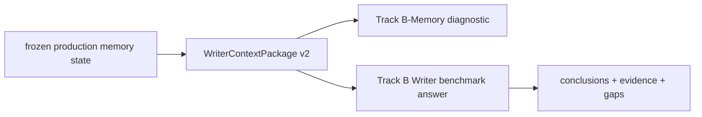
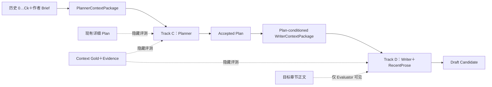

# NovelMemEval V0.5：Memory / Plan / Write 分层评测扩展设计（Track B 双层定义修正 + Track C/D 构造与实现 rubric）

> 文档生命周期：`ACTIVE_CANARY_EXECUTION`
>
> 修订日期：2026-08-19 +08:00
>
> 设计状态：`ACCEPTED_FOR_CANARY_EXECUTION`（R1 评审结论 `REPAIR_REQUIRED` 已修订；本文件进入 canary 执行，不改变正式 Stage Gate）
>
> 开发状态：`P0_TRACK_B_WIRING_AND_CASE_CONSTRUCTION`
>
> 阶段：Stage 2M 基准扩展；Stage 3 Writer；Stage 4 Planner
>
> 当前 Gate：V0.5 `0.5-seed.2 / seed_not_formal_release`；先执行 Track B 接线、C-ROLL、D-SHORT canary
>
> 上位文档（优先级按 `docs/README.md`）：`docs/stage2_to_stage5_unified_long_running_agent_integration_execution_20260818.md`（当前跨 Stage 权威）、`docs/project_status.md`、`docs/adr/0006-three-product-stage-topology.md`、`docs/adr/0008-evidence-first-writer-context-product.md`、`docs/adr/0009-need-evidence-semantic-closure.md`、`docs/stage3_writer_core_overall_design.md`、`docs/stage4_planner_core_overall_design.md`、`docs/stage4_planner_context_loop_execution.md`
>
> 后继文档：R1 修订评审通过后拆为 `novelmem_track_b_writer_response_execution`、`novelmem_track_c_roll_construction_execution`、`novelmem_track_d_short_canary_execution`

## 0. 修订记录

| 版本 | 变更 |
|---|---|
| v0.1 | 初稿：Track B 边界、Track C/D 拓扑、四臂实验、案例规模与 rubric |
| v0.2 | 按 R1 `REPAIR_REQUIRED` 修订：Track B 改为 WCP diagnostic + `context_writer_response` 双层；50/100 章 Planner 改 `ARC_VOLUME / STORY` 输出合同；Oracle Context 改为截止 N−1 的 per-case Oracle；四臂改语义化四条件 ID 并重定义归因量；收紧 author_constraints、重复选章、D-MID/D-LONG 标题、Judge 校准阈值四项定义；执行顺序改为先 Track B 接线、C-ROLL、D-SHORT canary |
| v0.3 | 与统一计划的 Writer-readout 语义对齐：benchmark adapter 命名为 `WriterContextReadoutProbe`，保留已有 `ContextWriterResponse` 合同，明确它复用 Writer 模型角色/ModelGateway 但不是生产正文 loop |
| v0.4 | 与统一计划 U4-L0 对齐：四条件 canary 冻结 effective model budget、Controller C-level、Memory Planner P-level 和 thinking/output policy；渐进上下文改造使用独立对照，不混入 Memory/Plan 四条件归因 |

---

## 1. 结论摘要

### 1.1 Track B 修正后的准确表述（R1 阻断项一）

Track B 不是“纯 Memory-only”，也不是“生成目标窗正文”。当前 ACTIVE 跨 Stage 权威规定的产品面是：

```text
frozen production memory state
  -> retrieved/assembled WriterContextPackage v2
  -> Writer benchmark answer (frozen before Gold reveal)
  -> Answer / semantic support / evidence support evaluation
```

因此 Track B 必须拆成两个观察层：

| 层 | 产品 | 评分内容 | 定位 |
|---|---|---|---|
| Track B-Memory diagnostic | `WriterContextPackage`（v2） | semantic / grounded / mandatory / weighted recall | Memory 中间诊断，不是最终产品分 |
| Track B-Writer response | `context_writer_response` | Writer 主动整理的历史结论、历史证据、显式 gap | Track B 产品主结果 |

真实 Writer 不生成目标窗正文，而是返回：

```yaml
conclusions:
  - ...
evidence:
  - ...
gaps:
  - ...
```

WCP 只是中间 Memory 诊断，Writer 的 `context_writer_response` 才是 Track B 产品主结果。
调用该合同的 benchmark adapter 命名为 `WriterContextReadoutProbe`：它复用真实 Writer 模型角色与
production ModelGateway，但不运行生产正文 Writer/Editor/acceptance/Settlement loop。输出仍是
现行 `ContextWriterResponse`，不新建语义重复的 readout DTO。[统一执行规划](/home/cuihengjia/agent/novel/NS/docs/stage2_to_stage5_unified_long_running_agent_integration_execution_20260818.md:295)

边界结论修正为：

- Track B-Memory diagnostic：评价 WCP 的 semantic / grounded / mandatory recall；
- Track B-Writer response：Writer 根据 WCP 主动整理历史结论、证据、gap；
- **仍然不生成小说正文**；
- **Track D 才生成目标章节候选正文**。

上一版“Track B 是 Memory-only”与“M0 要求 Track A/B 使用真实 Writer answers”之间确有矛盾；本版以跨 Stage 权威为准，把两层分开报告，不再用 Memory 自评代替 Writer 可用性。

### 1.2 下一步

主体拓扑、防循环、teacher-forced Writer、证据化 Judge 和四条件实验保留。修订后的优先执行顺序是：

1. Track B production wiring：WCP diagnostic + `context_writer_response`；
2. C-ROLL 20 个生产对齐 Planner case；
3. D-SHORT 20 个唯一章节 case；
4. 四条件 canary；
5. Judge 校准；
6. 再决定是否建设 20 / 50 / 100 章宏观 Planner 和更多 Writer horizon ablation。

---

## 2. Track 拓扑与防泄漏边界

### 2.1 Track B 产品流



Track B 的 WCP 继续由 Memory/Context Assembler 生成给 Writer 使用；它本身不是 Writer 的返回结果，但 Writer 在 Track B 中还有一层 benchmark answer。WCP 合同要点：

- 当前 `WriterContextPackage` 包含连续性、当前状态、关系、因果历史、知识边界、未决义务、长程回调等栏目；每条非 `UNCERTAIN` 结论必须绑定 Evidence Ledger；同时有独立的 `gaps` 字段。
  - `WriterContextItem` 及其 grounding 校验：[writer_context.py:212](/home/cuihengjia/agent/novel/NS/src/novel_agent/domain/writer_context.py:212)
  - `WriterContextPackage`：[writer_context.py:321](/home/cuihengjia/agent/novel/NS/src/novel_agent/domain/writer_context.py:321)
  - 当前 production read-side 产品 `WriterContextPackageV2` 与固定 `arm`：[writer_context.py:577](/home/cuihengjia/agent/novel/NS/src/novel_agent/domain/writer_context.py:577)
- V0.5 任务明确要求“不生成正文、不读取未来正文”。[C100 任务](/home/cuihengjia/agent/novel/NS/benchmarks/private/ztj_novelmem_v0.5/private/context_tasks/C100/author_plan_conditioned.json:13)

### 2.2 Track C / D 拓扑

不要把 Planner、Writer 的正文生成混进 Track B。Track C / D 在 Track B 之上：



### 2.3 各 Track 的输入 / 产品 / 隐藏评测

| Track | 公开输入 | SUT 产品 | 隐藏评测材料 |
|---|---|---|---|
| B | 截止章历史、`history_only` 或 `author_plan_conditioned` 任务合同 | 两层：WCP v2（Memory diagnostic）＋ `context_writer_response`（主结果） | Track B Context Gold、accepted evidence sets、target_support |
| C | `PlannerBrief`、经 Planner inquiry 生成的 `PlannerContextPackage` | `PlanningTurnOutput / PlanProposal` 的 benchmark 投影 | 原著详细 Plan 派生的隐藏参考（随 mode 变粒度）、Context Gold + Evidence |
| D | Accepted Plan、`WriterContextPackage`、截至 N−1 的 RecentProse | Draft candidate + trace sidecar | 目标章节正文（仅 Evaluator）、N−1 一致性约束与 Oracle annotations |

### 2.4 防循环原则

- Planner **不能**直接拿 Track B 的 plan-conditioned WCP。这个 Package 本身是根据详细 Plan 检索出来的；再让 Planner 预测这个 Plan，会形成答案泄漏。
- Planner 应使用独立的 `PlannerContextPackage`：根据作者 Brief 和 Planner 自己提出的 inquiry 检索历史。
- Writer 才使用已接受 Plan 条件下生成的 plan-conditioned WCP。
- Track B 的 `author_plan_conditioned` profile 是合法的：它的任务是把已知 Plan 当作 Memory 检索条件来产出 WCP / Writer answer，而不是预测 Plan。

仓库现有边界：

- Planner 使用独立 `PlannerContextPackage`：[stage4_planner_context_loop_execution.md:319](/home/cuihengjia/agent/novel/NS/docs/stage4_planner_context_loop_execution.md:319)
- Writer 消费 accepted plan、Writer Memory 和最近正文：[stage3_writer_core_overall_design.md:15](/home/cuihengjia/agent/novel/NS/docs/stage3_writer_core_overall_design.md:15)

---

## 3. Track C：NovelMemEval-Plan

### 3.1 案例构造规模与 Stage 4 mode 边界（R1 阻断项二）

Track C 的案例必须按 Stage 4 现有 mode 构造；不能因为窗口变长就统一要求 `stages + chapter_goals`：

| 子集 | 规划窗口 | mode | 输出粒度 | 执行阶段 |
|---|---|---|---|---|
| C-ROLL | 与 D-SHORT 所选章节 N 对齐，`[N, min(N+2, W_end)]`，checkpoint=N−1 | `CHAPTER_SET` | 滚动 1–3 章 focus、每章目标、跨章 hook/payoff | **先执行** |
| C-SHORT-20 | 现有 10 个 20 章窗口 | 中程 arc / window planning（`ARC_VOLUME` 的 benchmark 投影） | 4 个阶段 + 逐章目标可以保留在 20 章粒度 | 视 canary 结果再定 |
| C-MID-50 | `[151, 200]`，checkpoint=150 | `ARC_VOLUME` | 阶段、人物弧、turning point、义务与回收计划；**不要求 50 个逐章目标** | 视 canary 结果再定 |
| C-LONG-100 | `[201, 300]`，checkpoint=200 | `ARC_VOLUME` 或 `STORY`（按卷/故事边界选择，默认 `ARC_VOLUME`） | 卷/arc 目标、turning point、核心人物弧、obligation schedule；**不要求 100 个逐章目标** | 视 canary 结果再定 |

依据：[Stage 4 七种 mode 定义](/home/cuihengjia/agent/novel/NS/docs/stage4_planner_context_loop_execution.md:389)

说明：

- `CHAPTER_SET` 是滚动规划，不冻结整书超长 TaskGraph；C-ROLL 是唯一与生产 rolling 语义完全对齐的短周期 case。
- 50 / 100 章若继续要求逐章目标，测的就是“一次冻结超长 TaskGraph”，而不是生产设计要的滚动规划；因此 C-MID / C-LONG 不把 `chapter_goals` 作为输出或主评分项。
- 50 章窗口选 `[151, 200]`、100 章窗口选 `[201, 300]`，与既有 20 章详细 Plan 边界对齐：前者是 B140 末 10 章 + B160 + B180；后者是五个完整 B 窗口。合并后的详细 Plan 只用于构造隐藏参考和派生 D 的 accepted plan；不要求 Planner 复现逐章目标。
- 同一章区可以在不同 mode / 粒度下出现，这是层级规划消融；C-ROLL 与 D-SHORT 对齐，C-SHORT / C-MID / C-LONG 是宏观层，不在 canary 阶段执行。

### 3.2 Planner 看到什么：`PlannerBrief`

不能只给一句“完成大朝试”，但也不能把当前完整的四阶段、逐章目标全部给它。从现有 Plan 派生一个中等详细度的 `PlannerBrief`。

短窗示例（C100）：

```yaml
checkpoint: 100
horizon: [101, 120]

window_objective: 在大朝试前完成四条并行推进：接触皇宫核心人物并承受婚约舆论，履行对落落的教师责任，让国教学院获得新的公开定位，并把长期停滞的修行与黑龙线重新接通。

threads_to_advance:
  - 皇宫人物与婚约压力
  - 落落的师徒责任
  - 国教学院公开地位
  - 修行困境与黑龙义务

desired_end_state:
  - 大朝试目标成为公开压力
  - 修行问题进入新的验证阶段
  - 黑龙承诺得到推进

author_constraints:
  - source: AUTHOR_EXPLICIT
    text: 不把婚约动机写成既定爱情
  - source: AUTHOR_EXPLICIT
    text: 不让无权知情角色提前知道寿命秘密
```

派生规则：

> 上例中的第二条约束如果实际来自隐藏 Gold 而不是作者显式声明，构造时必须删除，或取得作者确认后改标 `AUTHOR_EXPLICIT`；即使公开，也必须执行第 5 条 denominator 剔除。

1. `window_objective` 可直接复用或轻度压缩既有 `author_plan.window_objective`。
2. `threads_to_advance` 从各 stage 的 objective / progression 中抽象主题，不复制 stage 顺序和 turn。
3. `desired_end_state` 从窗口末状态抽象 2–5 条，不写章节目录。
4. `author_constraints` 必须显式标记来源：
   - `AUTHOR_EXPLICIT`：作者明确给出的约束，可公开；
   - `DERIVED_FROM_GOLD`：从隐藏 Memory Gold 抽象出的约束，**禁止进入公开 Brief**，除非先取得作者显式确认并改标 `AUTHOR_EXPLICIT`。
5. 若某条公开约束已经直接披露了某条 Memory Gold 要测的事实，该 Gold 必须从 Memory-grounded / recall 的 **denominator** 中剔除，并在 manifest 里标记 `excluded_reason=public_author_constraint`。不能一边公开“角色不该知道寿命秘密”，一边仍把该知识边界计为 Planner 应当从 Memory 中找回的分数。
6. 禁止出现在公开 Brief 中的字段：`stages`、`progression`、`turn`、`chapter_goals`，以及任何只存在于目标窗口正文中的事实。

中窗 / 长窗的 `PlannerBrief` 按同一规则在 50 / 100 章粒度上重新抽象。现有详细 Plan 作为隐藏参考；C-MID / C-LONG 的隐藏参考应预先生成 arc-level 期望结构（阶段、人物弧、turning point、义务与回收计划），而不是把 50 / 100 个 `chapter_goals` 当成评分必需项。

C-ROLL 的公开 `PlannerBrief` 在所属窗口级 Brief 之外只追加 `current_position: N−1` 和 `rolling_horizon: [N, min(N+2, W_end)]`；不提供该滚动窗口的 `chapter_goals`、`progression` 或 `turn`。

### 3.3 Planner 输入与 inquiry Memory

- Planner 公开输入 = `PlannerBrief` + 独立 `PlannerContextPackage`。
- `PlannerContextPackage` 由 Planner 提出的 inquiry 驱动生成：Planner 先根据 Brief 提出 `PlanningInquiry`，系统经 inquiry review 和 `PlanningInquiryConditionedNeedGenerator` 检索历史，再返回 package。
- Planner 不直接调用 retrieval，也不消费 Track B 的 plan-conditioned WCP。
- 每个 planning case 允许有界 inquiry Memory 往返；重复 fingerprint、无新增证据或预算耗尽必须 typed terminal。
- `PlannerContextPackage` 仍要求 basis commit / snapshot / profile、Evidence provenance、budget report 和 lineage 可审计，与 Stage 4 合同一致。

### 3.4 Planner 输出合同：`PlanningTurnOutput / PlanProposal` 的 benchmark 投影

Track C 输出不另建生产合同；它是现有 `PlanningTurnOutput / PlanProposal` 的 benchmark 投影，并按 mode 改变粒度。

`CHAPTER_SET`（C-ROLL）输出：

```yaml
mode: CHAPTER_SET
chapters: [N, N+2]
focus: ...
chapter_goals:
  N:
    goal: ...
    required_beats: [...]
    end_state: ...
    memory_bindings: [context-item-...]
  N+1: { ... }
  N+2: { ... }
assumptions: []
unresolved_gaps: []
```

`ARC_VOLUME / STORY`（C-MID-50 / C-LONG-100）输出：

```yaml
mode: ARC_VOLUME            # 或 STORY
horizon: [151, 200]        # 或 [201, 300]
arc_objective: ...
stages:
  - stage_id: ...
    chapters: [151, 165]
    objective: ...
    turning_point: ...
    exit_state: ...
    memory_bindings: [context-item-...]
character_arcs:
  - character: 陈长生
    arc: ...
    turning_points: [...]
    memory_bindings: [...]
obligation_schedule:
  - obligation: ...
    planned_chapter_range: [...]
    payoff: ...
    memory_bindings: [...]
assumptions: []
unresolved_gaps: []
```

硬性要求：

- C-ROLL 只要求滚动 1–3 章；不得输出整个 20 章窗口的冻结 TaskGraph。
- C-MID-50 / C-LONG-100 **不评分逐章目标**；评分对象是阶段、turning point、人物弧、义务与回收计划。
- `memory_bindings` 必须引用 `PlannerContextPackage` 中真实存在的 context-item；每个“关键计划决定”（阶段排序、turning point、跨章依赖、回调、exit_state）至少绑定一个 context-item 或显式 assumption。
- `assumptions` 与 `unresolved_gaps` 必须是独立字段，不能混在 objective 里。
- 输出不得包含目标窗口正文引文或未来章节事实；引用只允许来自 planner context 的 Evidence refs。
- `memory_bindings` 的作用是区分三类错误：
  1. Planner 根本没拿到相关记忆；
  2. 记忆拿到了，但没有用于规划；
  3. 规划引用了记忆，却理解错误。

### 3.5 Planner 评分 rubric

不要计算与原计划的文本相似度。原著计划只是一个有效实现，不是唯一正确规划。

| 维度 | 判分问题 | 必须给出的证据 |
|---|---|---|
| Author-intent coverage | 是否覆盖公开 Brief 的必要目标、threads 和 desired_end_state | 缺失的 Brief 条目；对应 plan span |
| Historical consistency | 是否违反截止点前状态、关系、角色知识 | 冲突历史 context-item 或 Evidence ref |
| Memory-grounded planning | 关键计划决定是否绑定相关 Context / Evidence | 未绑定的关键决定；错误绑定位置。分母剔除已由公开 Brief / author_constraints 披露的项 |
| Executability | 是否有明确阶段、变化、冲突、转折和结束状态 | 缺项定位；不可执行的计划节点 |
| Temporal / hierarchical validity | 事件顺序、跨章依赖、阶段粒度是否成立 | 违反的章对 / 阶段对 |
| Gap handling | 缺信息时是否声明假设或请求 Memory，而不是补造事实 | 补造事实的 plan span；本应存在的 request |
| Unsupported factualization / future leakage | 是否出现非历史、非 Brief、非 context 的“新事实”，或来自目标窗口的事实 | 泄漏事实与污染来源 |

粒度规则：

- C-ROLL 额外检查 1–3 章 rolling focus、hook/payoff 与生产 `CHAPTER_SET` 合同一致性；
- C-SHORT-20 检查 20 章 arc/window 的阶段与逐章目标；
- C-MID-50 / C-LONG-100 只检查 arc-level 结构、turning point、人物弧与 obligation schedule，不检查逐章目标。

建议每维度 0–2 三级：`0 = 违反且影响可执行性`，`1 = 局部问题但不阻断`，`2 = 通过`。任何 0 分项必须在报告中带 plan span + 历史 evidence；不允许只给总分。主指标为上述七个维度分项，不合并成单一文本相似度分数。

---

## 4. Track D：NovelMemEval-Write

Writer 轨中，当前完整详细 Plan 可以作为公开输入，因为 Writer 的职责就是实现已接受规划。

### 4.1 案例构造规模与统计口径（R1 收紧项二、三）

**标题必须准确**：D-SHORT 是“20 章 plan horizon 下的单章 teacher-forced”；D-MID / D-LONG 是“50 / 100 章长历史、长 plan horizon 条件下的稀疏单章 teacher-forced”。它们测试的不是“连续写 50 / 100 章”。目前真正的连续写作只有 `5×3` E2E 辅助集。

| 条件集 | plan horizon | 选章规则 | 条件单元数 | 与 D-SHORT 重复章节 |
|---|---|---|---|---|
| D-SHORT | 10 个 20 章窗口，每窗 2 章 | `target_support` 密度 + 类型覆盖 | 20 | — |
| D-MID | 50 章 `[151, 200]` | 密度 6 + 子带覆盖 4 | 10 | 候选集内 5 章 |
| D-LONG | 100 章 `[201, 300]` | 每 5 章骨架 + 高密度替换 | 20 | 候选集内 9 章 |

**统计口径**：

- D-SHORT、D-MID、D-LONG 重复选择同一章节时，它们不是独立 case，而是同一 `base_chapter_case` 的不同 `plan_horizon` 条件。
- 当前候选集下的唯一 `base_chapter_case` 数为 **36**（20 D-SHORT 唯一章 + 5 个 D-MID 新增章 + 11 个 D-LONG 新增章）；50 个“条件单元”不能重复计数，也不能与 36 个 base case 混在一起做显著性统计。
- 统计模型把 `base_chapter_case` 作为 cluster / repeated measure，`plan_horizon` 作为 within-case 条件；不做 50 个独立样本假设。
- 构造 manifest 必须给同一章节跨 horizon 的单元共享 `base_chapter_case_id`。
- canary 阶段只跑 D-SHORT 20 个唯一 base case；D-MID / D-LONG 是后续 horizon ablation，不进入 canary 的独立 N。

#### D-SHORT-20 候选集（构造脚本冻结前允许微调）

| 窗口 | 第 1 章 | 第 2 章 |
|---|---|---|
| B100 `[101,120]` | 101（LONG_RANGE_PAYOFF） | 120（UNRESOLVED_OBLIGATION） |
| B120 `[121,140]` | 121（LONG_RANGE_PAYOFF） | 123（CURRENT_STATE / MOTIVATION_AND_RISK） |
| B140 `[141,160]` | 149（STATE_UPDATE） | 153（RELATIONSHIP_INTENT） |
| B160 `[161,180]` | 168（CONTRACT） | 174（BODY_RESOURCE_STATE / SECRET_GOAL） |
| B180 `[181,200]` | 182（STATE_UPDATE / UNRESOLVED_CONTRACT） | 191（LONG_RANGE_GOAL / MORTALITY_CONSTRAINT / OBJECT_CONTINUITY） |
| B200 `[201,220]` | 203（WORLD_RULE / UNRESOLVED_CONTRACT / CAPABILITY） | 209（CURRENT_STATE / MOTIVATION_STATE） |
| B220 `[221,240]` | 224（PREDECESSOR_EVIDENCE / LONG_RANGE_CONCEPT） | 234（UNRESOLVED_OBLIGATION / ROLE_KNOWLEDGE_BOUNDARY） |
| B240 `[241,260]` | 242（SECRET_CONTRACT / ROLE_STATE） | 243（RELATIONSHIP_KNOWLEDGE_BOUNDARY） |
| B260 `[261,280]` | 261（SECRET_ALLY_STATE / ACTIVE_CONFLICT_STATE） | 263（RELATIONSHIP_AND_RISK / OBJECT_STATE / KNOWLEDGE_BOUNDARY） |
| B280 `[281,300]` | 282（BODY_AND_INJURY_STATE / IDENTITY_KNOWLEDGE_BOUNDARY / XU_CAPABILITY_AND_COST） | 299（IDENTITY_KNOWLEDGE_BOUNDARY） |

#### D-MID-50 候选集（`[151,200]` 10 个 horizon 单元）

```text
153, 158, 161, 167, 168, 174, 182, 183, 191, 197
```

其中 `153 / 168 / 174 / 182 / 191` 与 D-SHORT 重复：它们是同一 base case 的 `plan_horizon=50` 条件，不是 5 个新 case。

#### D-LONG-100 候选集（`[201,300]` 20 个 horizon 单元）

```text
201, 202, 203, 209,        # 201–220
221, 224, 231, 234, 238,   # 221–240
241, 242, 249, 253, 257,   # 241–260
261, 263, 280,             # 261–280
282, 290, 299              # 281–300
```

其中 `203 / 209 / 224 / 234 / 242 / 261 / 263 / 282 / 299`（9 章）与 D-SHORT 重复：它们是同一 base case 的 `plan_horizon=100` 条件；其余 11 章是 D-LONG 新增 base case。最终以脚本输出为准。

所有候选集必须在构造时由脚本重新验证：`target_support` 密度的输入只有 Track B Gold；不得读取未来正文来决定选章。

### 4.2 Writer case 输入组装（单章 teacher-forced）

首次不生成完整 20 章，先做单章 teacher-forced 隔离评测。写第 N 章时：

- Track D 允许把完整详细 accepted Plan 作为公开输入；单章 teacher-forced 默认也允许给窗口完整 accepted plan，并在 case 中显式标注 `current_chapter_goal[N]` 作为主实现目标；
- 历史记忆：截至第 N−1 章的 accepted 文本；
- 最近正文：第 N−1 章全文 + 更早近章摘要（`RecentProseContext` 机械投影）；
- Accepted Plan 的最小相关投影：窗口 / 阶段 objective、progression、turn、第 N 章 chapter_goal；case 同时记录实际暴露的 plan projection（full-window 或 chapter-slice），作为消融变量；
- `WriterContextPackage`：plan-conditioned Memory 产物，含对应 evidence / gaps；
- 第 N 章及之后正文全部隐藏；hidden future text 泄漏检测与 accepted plan 的已知未来计划项分开判定；
- Writer 每次只生成一章或一个有明确边界的场景。

示例（写第 104 章）：

```text
历史记忆：截至第 103 章
最近正文：第 103 章全文＋更早近章摘要
Accepted Plan：
  - 阶段目标
  - progression
  - turn
  - 第 104 章目标
WriterContextPackage：
  - 落落师生身份
  - 妖族经脉限制
  - 陈长生当前修行研究
  - 对应 evidence/gaps
```

这样不会让前面模型生成的错误污染当前 Writer 分数。等单章能力稳定后，再增加 3–5 章 free-running 微型弧线，评测误差累积。

E2E 辅助集：选 5 个代表窗口，各连续生成 3 章。预选候选为 `116–118`（C100）、`181–183`（C180）、`201–203`（C200）、`221–223`（C220）、`261–263`（C260）；最终按类型覆盖矩阵确认。这是目前唯一的连续写作评测。

### 4.3 Writer 输出合同

正文内部不应插入证据引用。正文外另附 sidecar：

```yaml
draft: ...

trace:
  implemented_plan_items: [...]
  used_context_items: [...]
  requested_memory: [...]
  unresolved_gaps: [...]
```

- `trace` 声明只能用于错误归因，不能代替对正文的实际检查。
- sidecar 中的 `used_context_items` 必须引用真实存在的 WCP item / Evidence Ledger id。
- `requested_memory` 和 `unresolved_gaps` 为空时必须显式为空数组，不能省略。
- Draft 不得包含目标章节正文引用、证据编号或 marker。

### 4.4 Writer 评分 rubric

主指标：

| 维度 | 判分问题 | Judge 必须输出 |
|---|---|---|
| Plan realization | 必要 beat、转折和结束状态是否实现 | 未实现 plan item；对应 draft span |
| Historical consistency | 是否与历史事实冲突 | 错误类型；冲突历史 evidence |
| State-transition accuracy | 人物、物品、能力和关系状态是否正确更新 | 应更新而未更新 / 错误更新的状态 |
| Epistemic consistency | 角色有没有使用其不应知道的信息 | 角色名；信息；知识边界 evidence |
| Long-range callback grounding | 回调是否使用正确历史原因 | callback span；错误或缺失的历史依据 |
| Local continuity | 是否与上一章衔接 | 接缝矛盾；上一章引用 |
| Unsupported invention / future leakage | 是否补造历史未支持的事实，或使用目标章及以后正文 | 生成 span；污染来源；应属 hidden future 的 evidence |
| Critical omission | 必要历史约束是否完全没有进入正文 | 被忽略的 mandatory constraint |

辅助维度单列，不与事实连续性混成一个总分：POV、声音、节奏、Hook、文学质量。

评分与校准规则：

- BLEU / ROUGE 或与原著相似度**不作为主指标**。开放式小说正文存在大量合理写法；OpenMEVA 发现自动指标对篇章不连贯和因果顺序识别很弱，LitBench 中最强通用 Judge 与人工创意写作偏好也只有约 73% 一致。[OpenMEVA](https://aclanthology.org/2021.acl-long.500/) [LitBench](https://aclanthology.org/2026.eacl-long.362/)
- 一致性 Judge 应输出“错误类型 + 生成正文 span + 冲突历史 evidence”。ConStory-Bench 也采用这种带明确文本证据的长篇一致性错误检测方式，并发现事实与时间错误最突出。[ConStory-Bench](https://arxiv.org/abs/2603.05890)
- 每个主指标 0–2 三级；0 分必须附带证据；事实类维度与风格类维度分表报告。
- **校准阈值只适用于客观 Judge**：事实一致性、证据支持、知识边界、计划项实现等维度适用“至少 100 条多系统响应、双人标注、人工一致率 ≥90% 且 Cohen's kappa ≥0.8”。
- **文学质量、声音、风格不套用 90% / κ≥0.8**；创意质量采用辅助的人工评价或成对偏好（pairwise preference），单独报告，不进入客观一致性总分。

### 4.5 Writer case 构造与实现 rubric

每个 D case 至少包含以下文件 / 对象：

```text
D-{base_chapter_case_id}-{plan_horizon}-{chapter}
├── public/
│   ├── case.json                 # base_chapter_case_id、plan_horizon、checkpoint、target chapter、history prefix refs
│   ├── accepted_plan_projection.json # 当前章可见的 accepted plan 投影（full-window 或 chapter-slice）
│   ├── recent_prose_manifest.json# N-1 全文 + 早章摘要 refs
│   └── (运行时生成) writer_context_package_{condition_id}.json
├── hidden/
│   ├── target_chapter_ref.json   # 仅 Evaluator 可读
│   ├── consistency_constraints.json
│   ├── expected_beats.json       # 来自 chapter_goal / progression，不来自目标正文
│   ├── oracle_context_n_minus_1.json  # 见 5.2 的 Protocol O1
│   └── gap_annotations.json      # 仅自然成立的 gap
└── manifest.json                 # 四条件材料指纹、冻结 hash、构造 trace
```

构造验收：

1. `case.json` 的 history prefix 严格截止 N−1；任何公开文件引用 N 或以后正文即 fail。
2. `accepted_plan_projection` 只能来自已冻结的 hidden reference Plan 的允许投影，并显式记录投影类型。
3. Oracle Context 中每条非 `UNCERTAIN` 结论必须带 accepted evidence set；SUT Context 必须由 production Stage 2M 路径生成，不允许 fixture 手工拼包。
4. `expected_beats` 从 Plan 派生，不是从目标正文回译；目标正文只用于 Evaluator 和 teacher-forced 历史，不作为唯一标准答案。
5. 构造脚本可复现；同一 base chapter case 的四个条件共享同一 case_id、目标章和 Evaluator，只有 Context / Plan 来源不同。
6. 跨 horizon 的单元共享 `base_chapter_case_id`；重复章节不得生成新的 base case id。

---

## 5. 四条件归因实验（R1 阻断项三、四）

### 5.1 条件 ID 与命名

不再使用 A/B/C/D 作为四臂正式名称，因为 `WriterContextPackageV2.arm` 已经固定为 `Literal["A","B","C"]`，继续生成 `writer_context_package_arm_D` 会与现有合同冲突。[writer_context.py:590](/home/cuihengjia/agent/novel/NS/src/novel_agent/domain/writer_context.py:590)

四条件使用语义化 ID：

```text
m_oracle__p_oracle
m_sut__p_oracle
m_oracle__p_sut
m_sut__p_sut
```

其中 `m_*` 表示 Memory / Writer Context 来源，`p_*` 表示 Plan pipeline 来源。这些 ID 只写在 benchmark case / manifest / 报告里，**不写入、也不替换** `WriterContextPackageV2.arm`。

为书写方便，后文用数学别名：

| 语义化条件 ID | 数学别名 | 含义 |
|---|---|---|
| `m_oracle__p_oracle` | A | Oracle Context + Oracle Plan |
| `m_sut__p_oracle` | B | SUT Context + Oracle Plan |
| `m_oracle__p_sut` | C | Oracle Context + SUT Plan pipeline |
| `m_sut__p_sut` | D | SUT Context + SUT Plan pipeline |

### 5.2 Oracle Context 协议：必须在窗口起点和 N−1 之间二选一

写第 N 章时历史截止 N−1；若 Oracle Context 只从窗口起点 Track B Gold 选择，Oracle 反而可能比 SUT Context 少信息（例如写第 120 章时，101–119 产生的新状态、关系变化、角色知识不在 B100 Gold 中）。

本设计选定 **Protocol O1：per-case N−1 Oracle**：

```text
window-checkpoint long-range Gold（Ck 前的长程事实）
+ Ck+1…N−1 的 entry-state / knowledge / obligation annotations
+ accepted evidence（只允许引用 ≤ N−1 的 accepted 文本）
```

要求：

- 每个 Writer case 都构造独立的 `oracle_context_n_minus_1`；禁止直接复用窗口起点 Track B Gold 作为完整 Oracle。
- Ck+1…N−1 的增量 annotations 由 case 构造者从 accepted 历史文本和已知 Plan 中标注，并走双人 review；它们属于 Writer-case Gold，不混入 Track B 64 条 span-exact Gold 的统计。
- SUT Context 也必须明确其 basis：production Stage 2M 在写第 N 章时生成的 plan-conditioned WCP，其 basis snapshot 与 retrieval 范围必须 ≤ N−1，并写入 manifest；若某个 runner 实际只能冻结点为窗口起点 Ck，则必须声明为 Protocol O2 并统一切换。
- 若未来某个 runner 只支持“WCP 冻结在窗口起点 Ck、RecentProse 单独承担中间状态”的 Protocol O2，必须把 SUT 与 Oracle 同时切换到 O2，并另开报告；不允许 O1 Oracle 对 O2 SUT 或反向混用。

### 5.3 效应分解

`A−C` 不能直接叫 `PlannerLoss`。SUT Plan 已包含 PlannerContext、Planner、Reviewer 的共同影响。固定 Oracle Context、仅替换整个 Plan pipeline 时，应命名为：

```text
WriterContextEffect = A − B   # 固定 p_oracle，替换 Memory/WriterContext pipeline
PlanPipelineEffect = A − C    # 固定 m_oracle，替换 PlannerContext + Planner + Reviewer pipeline
EndToEndGap        = A − D
Interaction        = A − B − C + D
```

- `WriterContextEffect` 里仍包含 retrieval / assembly / Writer 对 context 的使用；不能称为纯 Memory recall。
- `PlanPipelineEffect` 里包含 inquiry、PlannerContext、Planner、Reviewer；不能称为单一 Planner 损失。
- Planner 内部的“记忆没拿到”和“拿到但没用”继续由 Track C 的 inquiry / context / binding 诊断分解；Track B 内部继续由 WCP diagnostic 与 `context_writer_response` 的差值定位“Memory 未交付”还是“Writer 看见但未使用”。

失败分类保持为：

```text
Memory 没找回
→ Planner pipeline 拿到了但没用好
→ Plan pipeline 正确但 Writer 没实现
→ 正文实现了事件却违反人物状态 / 知识边界
```

### 5.4 实现要求

- `m_oracle` 使用 Protocol O1 的 per-case N−1 Oracle Context。
- `m_sut` 使用接好 10 个新长窗后的 production Stage 2M 流水线；如果 production runner 尚未接入，四条件实验不得使用手工 fixture 冒充 SUT。
- `p_oracle` 使用原详细 Plan 的允许切片；`p_sut` 来自 Track C 的 `PlanningTurnOutput / PlanProposal` 投影，并在进入 D 前完成 reviewer acceptance。
- 同一 base chapter case 的模型、参数、采样配置、effective budget 和 Evaluator
  保持一致；Evaluator 盲评，不知道条件标签。effective budget 必须冻结实际
  context limit、body output、reasoning reserve、safety allowance 及来源，不能只记录一个
  可能触发 `None`/4096/8192 fallback 的表面配置。
- 四条件 canary 内的 Controller C-level、Stage 2 Memory Planner P-level 和
  thinking/output policy 必须一致。U4-L0 的 C0→C1+C2、P0→P1 或 thinking canary
  使用同一冻结 case 的独立单因素对照，不作为四条件中的第五个变量。
- 正式结果要求四条件齐全；canary 先跑 D-SHORT 20 个唯一 base case。

---

## 6. Gap 子集

- 只收自然成立的 gap，不硬凑数量。
- 每项标注：

```yaml
gap_id: D-104-GAP-01
gap_type: MISSING_HISTORY | EPISTEMIC_BOUNDARY | UNRESOLVED_OBLIGATION | CONFLICT | FUTURE_REVEAL
blocking: true | false
evidence_available: true | false
expected_action: request_memory | declare_assumption | defer_beat | ask_author
```

- `blocking=true` 表示 Writer 在获得新 evidence 或作者裁定前不应硬写；`blocking=false` 允许在 sidecar 声明 assumption 后继续。
- V0.5 中 gap 分数只作为诊断子分，不作为 Track B 主 Gate；待 gap Gold 完成双人标注并通过 Judge 校准后，才能升级为正式维度。
- 生产侧 `ContextGap` / `EvidenceFirstGap` 字段保持不变；本子集先作为 benchmark gold 标注，只有被真实评测证明必要后才改生产合同。

---

## 7. 现有材料复用矩阵

| 现有材料 | Track B | Track C | Track D | 备注 |
|---|---|---|---|---|
| `window_objective` | `author_plan_conditioned` 检索条件 | Planner 公开 Brief 的核心 | Accepted Plan 的窗口目标 | 不直接给逐章目标 |
| `stages / progression / turn / chapter_goals` | 计划条件输入 | 隐藏参考；20 章可作逐章参考，50/100 章仅派生 arc-level 参考 | Writer 公开 accepted plan | 50/100 章的逐章目标不进入 Planner 评分 |
| Track B `fact / evidence_groups` | WCP 与 Writer answer 的评测 Gold | 一致性约束、Oracle Context 基础 | Oracle Context、一致性 Judge 证据 | SUT 不得直接读 Gold |
| `target_support` | 不用于 Track B 计分 | C-ROLL 通过 D-SHORT 选章间接对齐 | 选择高价 Writer base chapter case、构造实现 rubric | 只从 Track B Gold 读取 |
| 原著目标章节正文 | 不进入 Writer answer 输入 | 不进入 Planner 输入 | 只用于 Evaluator 和 teacher-forced 历史 | 不作为唯一标准答案 |
| 目标窗口 future 文本 | 禁止 | 禁止 | 只对 Evaluator 可见 | 泄漏检测对象 |

---

## 8. 修订后的执行计划

### 8.1 立即执行（R1 通过后）

| 步骤 | 内容 | 主要产物 | 验收 / 停止条件 |
|---|---|---|---|
| P0 | Track B production wiring | production manifest 接入 10 个新长窗；WCP diagnostic + `context_writer_response` 两层报告 | 无 fixture WCP；Writer answer frozen before Gold reveal；两层分数分表，不相加 |
| P1 | C-ROLL 20 个生产对齐 Planner case | `PlannerBrief`、hidden reference、`CHAPTER_SET` 输出投影、public input validator | 公开文件泄漏扫描 = 0；Brief 不含 stages / chapter_goals；mode 合同与 Stage 4 一致 |
| P2 | D-SHORT 20 个唯一章节 case | 20 个 `base_chapter_case` 的 public / hidden / manifest；per-case N−1 Oracle annotations | 选章脚本可复现；覆盖矩阵闭合；目标章 hash 冻结；无跨 horizon 重复统计 |
| P3 | 四条件 canary | `m_oracle__p_oracle / m_sut__p_oracle / m_oracle__p_sut / m_sut__p_sut` 结果 | 条件 ID 与 WCP `arm` 无冲突；effective budget/C-level/P-level/thinking-output 冻结；效应按 WriterContextEffect / PlanPipelineEffect / Interaction 报告 |
| P4 | Judge 校准 | 客观 Judge 双人标注与锁定；风格偏好评价单独建立 | 客观维度：≥100 条多系统响应、双人标注、一致率 ≥90%、κ≥0.8；风格维度不套用该阈值 |
| G1 | 决策门 | canary 报告 | 只有 P0–P4 通过后才决定是否建设 C-SHORT-20 / C-MID-50 / C-LONG-100 与 D-MID / D-LONG horizon ablation |

### 8.2 视 G1 决策再建设

- Track C 宏观层：C-SHORT-20（20 章 arc/window）、C-MID-50（`ARC_VOLUME`）、C-LONG-100（`ARC_VOLUME / STORY`）；50/100 章不要求逐章目标。
- Track D horizon ablation：D-MID（10 个 `plan_horizon=50` 条件单元）、D-LONG（20 个 `plan_horizon=100` 条件单元）；重复章节共享 `base_chapter_case_id`，不作为独立样本。
- E2E 辅助集：5 个代表窗口各连续生成 3 章，作为唯一的连续写作证据。

### 8.3 V0.5 readiness gate 继承

Benchmark 正式验收前仍按统一执行规划关闭：

1. `R-BUNDLE`：build 与独立 validator PASS，输出计数与 manifest 一致；
2. `R-ANNOTATION`：新 64 条独立第二标注者复核，争议 adjudication 后发布新不可变版本；
3. `R-JUDGE`：Answer Judge 与 Evidence-Support Judge 分开锁定模型、prompt、版本和失败策略；阈值只适用客观维度；
4. `R-RUNNER`：全部 51 道 QA、30 个 Context 输入可由 production manifest 到达真实 Writer，freeze / reveal / discard 和 lineage 可重放。

### 8.4 明确不做 / 防范围

- 不给 Track B 增加目标窗正文生成任务；Track B 正文相关输出仍为零。
- 不给 Track C 使用 Track B 的 plan-conditioned WCP；Planner 只使用 inquiry-conditioned `PlannerContextPackage`。
- 不把原著 Plan 当作唯一正确答案，不把文本相似度当主指标。
- 不在 gap 子集硬凑数量；不用目标正文回译 `expected_beats`。
- 不新建独立评测平台；优先扩展现有 benchmark manifest、Stage 3 / 4 runner 和 Judge。
- 在 production runner 未接入新长窗前，四条件实验不得以手工 Context 冒充 SUT Context 发布正式结论。
- 不把 50 / 100 章稀疏单章 teacher-forced 说成“连续写作”；连续写作只以 E2E 5×3 为证据。

---

## 9. 风险与评审点

1. **Track B 两层口径**：WCP recall 是 Memory 诊断，Writer answer 是产品主结果；报告必须分表，不得相加或互相替代。
2. **50 / 100 章 hidden reference Plan 是合并派生品**：必须标记 `derived_from` 和版本，不能伪装成原始作者逐章意图；且只派生 arc-level 评分结构。
3. **C 与 D 共享同一批原计划**：`p_sut` 一旦被 D 使用，会造成跨 case 信息流动；实验报告必须记录 SUT Plan 的冻结 id，不允许 D 运行时再调用 Planner 修改。
4. **未来泄漏面不止正文**：`PlannerBrief` 的 `desired_end_state`、`author_constraints` 和 accepted plan 投影都可能携带未来信息；公开文件 validator 必须对计划字段与目标正文字段分别声明允许 / 禁止。author_constraints 若来自 Gold，必须退出公开或剔除对应 Gold denominator。
5. **Oracle 公平性**：四条件实验必须固定 Protocol O1；任何 O1/O2 混用都会破坏归因。
6. **重复选章统计**：同一章节不同 horizon 不是独立样本；显著性检验按 base chapter case clustering。
7. **Judge 主观性**：客观一致性维度证据绑定，阈值 ≥90% / κ≥0.8；风格与文学质量用成对偏好等辅助方法，不套同一阈值。
8. **构造成本**：先 canary 后宏观层；C-SHORT-20 / C-MID-50 / C-LONG-100 与 D-MID / D-LONG 不阻塞 P0–P4。
9. **变量混淆**：Controller C1+C2、Memory Planner P1 和 thinking/output 都可能改变结果，
   但它们不是 Memory/Plan 四条件。P0 可继续构造合同和 case；首次真实运行前若
   effective budget 仍无法显式冻结，则停止运行并切到 U4-L0，不用当前静默 fallback
   生成无法归因的 canary。

---

## 附：引用与依据

- 当前跨 Stage 权威：`docs/stage2_to_stage5_unified_long_running_agent_integration_execution_20260818.md` §3.6（Track B 三层观察与 `context_writer_response`）
- 文档优先级：`docs/README.md` L83（统一执行规划为当前跨 Stage 权威）
- 生产合同：`src/novel_agent/domain/writer_context.py`（`WriterContextItem` L212、grounding L229、`ContextGap` L237、`WriterContextPackage` L321、`WriterContextPackageV2` L577、`arm: A/B/C` L590）
- Track B 任务：`benchmarks/private/ztj_novelmem_v0.5/private/context_tasks/C100/author_plan_conditioned.json`（`future_text_visibility: forbidden` L14；任务文本 L16）
- 当前 V0.5 状态：`docs/project_status.md`（V0.5 `0.5-seed.2 / seed_not_formal_release`；10 个新 20 章窗口贡献 64 条 span-exact Gold；新长窗尚未完成 production manifest wiring）
- Planner mode 定义：`docs/stage4_planner_context_loop_execution.md` L389；Planner 边界：同文档 L319（`PlannerContextPackage`）
- Writer 边界：`docs/stage3_writer_core_overall_design.md` L15（Writer 消费 accepted plan、Writer Memory 和最近正文）
- 外部依据：DOC、DOME、OpenMEVA、LitBench、ConStory-Bench（正文中已给链接）
