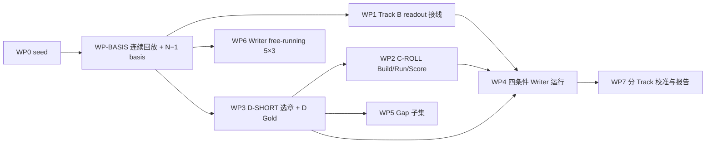

# NovelMemEval-ZTJ V0.5 Benchmark 开发计划

> 文档生命周期：`ACTIVE_DEVELOPMENT_PLAN`
>
> 修订日期：2026-08-18 +08:00
>
> 设计状态：`REPAIR_REQUIRED_R1_REVISED`（R1 审核意见已修订；本文件仍不授权跳过生产 Gate）
>
> 开发状态：`PLAN_ONLY / NOT_IMPLEMENTED`
>
> 阶段：Stage 2M benchmark；Stage 3 Writer；Stage 4 Planner
>
> 上位文档：
> - `docs/novelmem_v0.5_plan_write_extension_design.md`（Track 定义、四条件归因、评测合同）
> - `docs/stage2_to_stage5_unified_long_running_agent_integration_execution_20260818.md`（跨 Stage 权威）
> - `docs/project_status.md`
>
> 本文档回答一个问题：**如何从当前 seed 出发，把 ZTJ V0.5 开发成可运行的、带 C-ROLL / D-SHORT canary 的 benchmark。**
> 它描述开发任务、目录、脚本、生产运行链路和验收，不重复评测设计理由。

## 0. 修订记录

| 版本 | 变更 |
|---|---|
| v0.1 | 初版：WP0–WP7 数据构造计划 |
| v0.2 | 按 R1 `REPAIR_REQUIRED` 修订：新增 WP-BASIS；WP2 补真实 Planner 运行与 Track C 评分；四条件统一计划 horizon 与 Writer 输入合同；WP1 改为复用已有合同并修正 schema 路径与 profile 映射；gap recall 改为 NOT_APPLICABLE；WP7 拆为分 Track Judge；WP6 改名 Writer free-running 并收紧可复现元数据 |

---

## 1. 开发目标

按 canary 路径完成以下可交付物：

| 编号 | 交付物 | 说明 |
|---|---|---|
| D0 | 可复现的 V0.5 seed | 当前 build / validate 双 PASS，报告冻结 |
| D-BASIS | 任意 N−1 的 production basis | 连续 replay 一次 + basis manifest + 每个 basis 的 commit/snapshot/root refs |
| D1 | Track B Writer 回答层 | `context_writer_response` 任务、bundle-local schema、adapter、双表报告 |
| D2 | C-ROLL 20 的构造 + 真实 Planner 运行 + Track C 评分 | `private/plan_tasks/CROLL/` + hidden gold + 冻结 `p_sut` + 七维评分 |
| D3 | D-SHORT 20 个 Writer case | `private/write_tasks/DSHORT/` + Protocol O1 Oracle + validator |
| D4 | 四条件 canary | 统一 plan horizon 和 Writer 输入合同后的可运行 manifest + runner |
| D5 | Gap 子集 | `private/gold/gap_subset.json`；允许空集 |
| D6 | Writer free-running 5×3 | `private/write_tasks/FREERUN/` |
| D7 | 分 Track Judge 校准与评分 | Track B / C / D 分别报告 |

所有产物在 readiness gates 关闭前均标记 `seed_diagnostic`。

---

## 2. 当前资产清单

以 `benchmarks/private/ztj_novelmem_v0.5/` 为根：

```text
benchmark.json                       # 16 个公开 checkpoint / window / source / annotation_sources
annotations/
  track_a_seed.json
  track_b_long_plans.yaml
  track_b_long_gold.yaml
scripts/
  build_bundle.py                    # 物化 public/private bundle
  validate_bundle.py                 # 只读校验
  score_responses.py                 # Track A 评分
public/
  stream/000_prologue_and_frontmatter.txt, 001.txt..300.txt
  checkpoints.json
private/
  questions/Cxxx.json
  context_tasks/Cxxx/*.json
  gold/track_a.json
  gold/track_b.json
  future/Cxxx/*.txt
reports/build_report.json
```

---

## 3. 目录扩展方案

```text
benchmarks/private/ztj_novelmem_v0.5/
  annotations/
    track_c_planner_briefs.yaml
    track_d_short_selection.yaml
    gap_subset.yaml
  schemas/
    context_writer_response.schema.json   # bundle-local，由 domain model 导出且与 stage2 schema 同 hash
  private/
    basis/
      checkpoint_basis_manifest.json      # 全部 basis node -> job attachments -> root refs
      C{nnn}/basis.json                   # 每个 N−1 节点的冻结 basis
    plan_tasks/CROLL/
      ZTJ-CROLL-104.json
    write_tasks/DSHORT/
      ZTJ-DSHORT-104/
        public/case.json
        public/accepted_plan_projection.json
        public/recent_prose_manifest.json
        hidden/target_chapter_ref.json
        hidden/consistency_constraints.json
        hidden/expected_beats.json
        hidden/oracle_context_n_minus_1.json
        hidden/gap_annotations.json
        manifest.json
    write_tasks/FREERUN/
      ZTJ-FREERUN-C100-116-118.json
    gold/
      track_c_roll_gold.json
      track_d_short_gold.json
      gap_subset.json
    manifests/
      four_condition_manifest.json
  scripts/
    build_track_c_roll.py
    build_track_d_short.py
    build_four_condition_manifest.py
    build_gap_subset.py
    build_freerun_set.py
    validate_canary.py
  reports/
    build_report.json
    basis_report.json
    track_c_roll_run_report.json
    track_d_short_canary_report.json
    judge_calibration_report.json
```

---

## 4. 工作包

### WP0 — 冻结可复现 seed

目标：先让当前 V0.5 能在干净环境复现。

步骤：

1. 执行：
   ```bash
   .conda-env/bin/python benchmarks/private/ztj_novelmem_v0.5/scripts/build_bundle.py --source 择天记.txt
   .conda-env/bin/python benchmarks/private/ztj_novelmem_v0.5/scripts/validate_bundle.py --source 择天记.txt
   ```
2. 冻结 `reports/build_report.json` 的计数：
   - Track A 51 题；
   - Track B 111 条（旧 47 + 新 64）；
   - 16 个公开 checkpoint；QA 15；Context 15。
3. 确认连续回放协议、公开/私有边界、证据逐字、future 隔离全部 PASS。

验收：

- 两个命令退出码 0。
- `build_report.json` 与 README 一致。
- 不修改 `private/` 手工文件即可重复生成。

### WP-BASIS — 连续回放与 N−1 production basis

目标：为 C-ROLL / D-SHORT 的任意 `N−1` checkpoint 提供生产可用的冻结 basis。

问题边界：

- 当前 `benchmark.json` 只声明 16 个公开 checkpoint；C-ROLL / D-SHORT 需要 103、119、148 等未声明节点。
- `TeacherForcedScenarioRunner` 不接受未声明 checkpoint；`BenchmarkScenarioCompiler` 要求 checkpoint 唯一。
- production Writer 需要精确 commit、snapshot、PlanRoot、TextRoot、WorldRoot。
- `RecentProseAssembler` 要求 accepted TextRoot 恰好结束于 `N−1`。

因此必须新增 WP-BASIS，并且**一个 chapter 只允许一个 checkpoint declaration，多个 evaluation job 挂在同一个 basis 上**。

步骤：

1. 输入 `annotations/track_d_short_selection.yaml`：这是 WP3 的**选章决策**，可从现有 Track B Gold 先行冻结；WP3 的完整 case 构造晚于 WP-BASIS，二者不是循环依赖。
2. 从选章得到全部 `N−1` basis 节点集合：
   ```text
   public_checkpoints ∪ {N−1 for every selected D-SHORT chapter N}
   ```
3. 扩展连续 replay：序章到 C300 只按顺序写一次；在原 16 个 checkpoint 和全部入选 N−1 节点冻结 basis。
3. 每个 basis 记录：
   ```json
   {
     "basis_id": "basis.104",
     "checkpoint_chapter": 103,
     "commit_id": "...",
     "snapshot_id": "...",
     "plan_root_ref": "...",
     "text_root_ref": "...",
     "world_root_ref": "...",
     "profile_root_ref": "...",
     "jobs": ["croll-104", "dshort-104"],
     "release_policy": "internal_basis_only"
   }
   ```
4. 生成 `private/basis/checkpoint_basis_manifest.json`：
   - 每个 chapter 只出现一次 checkpoint declaration；
   - 同一 N−1 上可挂 C-ROLL、D-SHORT，也可与公开 Track A/B checkpoint 重合；
   - 重合时共享同一个 basis，不创建第二个 checkpoint case。
5. RecentProse：
   - 由生产 `RecentProseAssembler` 从该 basis 的 accepted TextRoot 生成；
   - 不手写章节引用清单。
6. 更新 scenario compiler / runner 的 benchmark adapter：
   - 接受 `checkpoint_basis_manifest`；
   - 支持 “一个 checkpoint → 多个 evaluator job” 的 fan-out；
   - 不为 Track C/D 创建冲突的重复 checkpoint case。

验收：

- 一次 C0→C300 replay 可冻结全部公开 checkpoint 和全部入选 N−1 basis。
- `checkpoint_basis_manifest` 中 checkpoint 唯一，job 可多挂。
- 每个 basis 的 roots 可被 `Stage3WriterLeaf` 和 `RecentProseAssembler` 直接消费。

### WP1 — Track B Writer 回答层接线

目标：把 Track B 补成“WCP diagnostic + `context_writer_response` 产品主结果”两层，并修正当前合同状态。

当前仓库状态：

- `ContextWriterResponse` / `ContextWriterConclusion` / `ContextWriterGap` 已存在于
  `src/novel_agent/domain/memory_benchmark.py`；
- `schemas/stage2/ContextWriterResponse.schema.json` 等已存在。

因此本包不是“新增”，而是“复用、校验、导出 bundle-local schema、接线”。

步骤：

1. **Schema 唯一来源**：
   - 唯一源 = domain model `ContextWriterResponse`；
   - 导出到仓库 `schemas/stage2/ContextWriterResponse.schema.json`；
   - 导出 bundle-local `benchmarks/private/ztj_novelmem_v0.5/schemas/context_writer_response.schema.json`；
   - validator 校验两个文件 content hash 一致。
2. **任务文件路径与 schema 引用**：
   ```text
   private/track_b_writer_tasks/C{checkpoint}/context_writer_response_task.json
   ```
   其中 `response_schema` 使用：
   ```json
   "../../../schemas/context_writer_response.schema.json"
   ```
   `C100/../../..` 解析到 benchmark 根目录的 `schemas/`，即唯一 bundle-local 路径。
3. **Profile 映射**：benchmark 的 `history_only` 不能直接进生产合同，必须映射：
   | Benchmark profile | Production `BenchmarkInformationProfile` |
   |---|---|
   | `history_only` | `VISIBLE_AT_CUTOFF` |
   | `author_plan_conditioned` | `AUTHOR_PLAN_CONDITIONED` |
   任务文件同时保留 `benchmark_profile` 与 `production_profile` 两字段，validator 强制映射。
4. **任务文件**：每个 Context checkpoint × 2 profiles = 30 个任务，示例：
   ```json
   {
     "case_id": "ZTJ-B100-120",
     "checkpoint": 100,
     "target_range": [101, 120],
     "benchmark_profile": "history_only",
     "production_profile": "visible_at_cutoff",
     "response_schema": "../../../schemas/context_writer_response.schema.json",
     "release": "after_checkpoint_freeze",
     "future_text_visibility": "forbidden",
     "task": "基于截至第100章的历史记忆，为第101–120章写作准备历史结论、证据和 gap；不生成正文。"
   }
   ```
5. **Adapter**：
   - 输入：WCP v2 + 任务合同；
   - 输出：`ContextWriterResponse` artifact，冻结在 Gold reveal 前；
   - 不写 Memory / Canon；
   - 不要求固定答案条数。
6. **评分**：
   - WCP diagnostic 继续走现有 evaluator；
   - `context_writer_response` 报 conclusion recall、evidence recall、declared gap 统计；
   - **gap recall 在当前版本为 `NOT_APPLICABLE`**：因为没有 Track B expected-gap Gold，不得拿 D-SHORT gap 子集冒充分母；
   - 两层分表，不相加。

验收：

- 30 个 writer task 文件可生成，schema 路径可解析且 hash 一致。
- profile 映射 validator PASS。
- 无正文、无 Gold、无 target_support 泄漏进任务文件。
- Track B 报告不包含 gap recall 数字，除非将来建立 Track B expected-gap Gold。

### WP2 — C-ROLL 20：构造 + 真实 Planner 运行 + Track C 评分

目标：不只生成数据，而是把 20 个 case 跑通并评分。

#### WP2-A Build

1. 冻结 D-SHORT 20 个唯一章节 `{window, chapter}`。
2. 为每个 chapter N 生成公开任务：
   ```yaml
   case_id: ZTJ-CROLL-104
   basis_checkpoint: 103
   horizon: [104, 106]
   mode: CHAPTER_SET
   window_objective: <所属 20 章窗口 objective>
   threads_to_advance: <窗口级 threads>
   current_position: 103
   author_constraints: []
   ```
   - 不出现 `stages`、`progression`、`turn`、`chapter_goals`；
   - `author_constraints` 若来自 Gold，必须删除或改 `AUTHOR_EXPLICIT` 并剔除对应 denominator。
3. 生成 hidden reference `private/gold/track_c_roll_gold.json`：
   - 对应 `chapter_goals[N..min(N+2,W_end)]`；
   - 所属 stage objective / progression / turn；
   - 仅 Evaluator 可见。

#### WP2-B Run

对每个 case 执行完整 Planner 链路：

```text
PlannerBrief
→ PlanningInquiry
→ inquiry review
→ PlannerContextPackage
→ PlanningTurnOutput / PlanProposal
→ reviewer acceptance
→ frozen p_sut
→ Track C evaluator
```

运行要求：

- Planner 不消费 Track B plan-conditioned WCP；
- inquiry / PlannerContext / 原始输出 / review receipt / accepted proposal 全部物化并冻结；
- 每个 case 保存以下 artifact：
  ```text
  inquiry.json
  planner_context_ref.json
  planning_turn_output.json
  plan_proposal.json
  reviewer_acceptance.json
  p_sut.json
  ```
- 同一个 `p_sut` 必须同时供 WP4 的 `m_oracle__p_sut` 与 `m_sut__p_sut` 复用，不允许 rerun 出第二份。

#### WP2-C Score

- 使用设计文档的七维 rubric：
  Author-intent coverage、Historical consistency、Memory-grounded planning、Executability、
  Temporal / hierarchical validity、Gap handling、Unsupported factualization / future leakage。
- 不计算与原计划的文本相似度。
- Evaluator 输入只包含 hidden reference + context evidence；每个 0 分必须带 plan span + 历史 evidence。

验收：

- 20 个 case 均有 Build / Run / Score 三部分产物。
- 20 个 `p_sut` 冻结且被四条件 manifest 复用。
- 无 case 使用窗口起点 Track B readout 代替独立 `PlannerContextPackage`。

### WP3 — D-SHORT 20 构造

目标：20 个唯一 `base_chapter_case` 的单章 teacher-forced Writer case。

步骤：

1. **选章（可先于 WP-BASIS 冻结）**：`scripts/build_track_d_short.py` 前半部分：
   - 输入：Track B 长窗 Gold 的 `target_support`；
   - 排序：`mandatory_support_count` + `support_count` + type 多样性；
   - 全局覆盖 `STATE_UPDATE`、知识边界、`LONG_RANGE_PAYOFF`、`UNRESOLVED_OBLIGATION`；
   - 输出 `annotations/track_d_short_selection.yaml`，人工 review 后冻结。
2. **Case 文件**：
   ```json
   {
     "case_id": "ZTJ-DSHORT-104",
     "base_chapter_case_id": "ZTJ-BASE-104",
     "basis_checkpoint": 103,
     "target_chapter": 104,
     "plan_projection": {
       "mode": "CHAPTER_SET",
       "horizon": [104, 106],
       "source": "accepted_plan_projection.json"
     }
   }
   ```
   - 不再写死 `plan_horizon: 20`；主 canary 的 plan horizon 与 `p_sut` 同为 1–3 章滚动窗口。
   - 20 章 window 只作为历史窗口和 case 归属元数据保留。
3. **Hidden 文件**：
   - `target_chapter_ref.json`：只指向 `private/future/Cxxx/NNN.txt`；
   - `consistency_constraints.json`；
   - `expected_beats.json`：来自 `chapter_goals / progression`；
   - `oracle_context_n_minus_1.json`：Protocol O1；
   - `gap_annotations.json`：允许为空。
4. **Protocol O1 Oracle**：
   ```text
   window-checkpoint long-range Gold
   + Ck+1…N−1 entry-state / knowledge / obligation annotations
   + accepted evidence（≤ N−1 正文逐字）
   ```
   - 新增 annotations 属于 Writer-case Gold，不混入 Track B 64 条统计。
5. **Build / Validate**：
   - 公开文件不得引用 N 及以后正文；
   - Oracle 不得引用 N 及以后正文；
   - evidence 逐字；
   - `base_chapter_case_id` 唯一。

验收：

- 20 个 case 生成，validator PASS。
- 每个 case 的 basis 引用来自 WP-BASIS manifest。
- RecentProse manifest 只描述由生产 assembler 从 basis 生成的 artifact；不伪造章节文本。

### WP4 — 四条件 canary：统一输入合同后运行

目标：四条件真正可运行，且 PlanPipelineEffect 不混入 horizon / 字段 / token 差异。

#### WP4-A 统一 Writer 输入合同

定义 `writer_input_contract.v1`，四个条件共享同一字段结构和预算：

```text
basis_refs
accepted_plan_projection       # CHAPTER_SET，horizon [N, min(N+2,W_end)]
writer_context_visible_items   # 统一 visible 字段，不允许 Oracle 侧多给或少给
evidence_refs
gaps
recent_prose
token_budget
```

- `p_oracle` 与 `p_sut` 使用**相同 CHAPTER_SET horizon、字段合同、输入预算**。
- `p_oracle` 从原详细 Plan 投影到 `[N, min(N+2,W_end)]`；不直接给 full-window plan。
- full-window plan 另设为 `plan_horizon` ablation，不进入主 canary 的 `PlanPipelineEffect`。
- 为 Protocol O1 Oracle 实现 benchmark-only `OracleWriterInputAdapter`，把 Oracle annotations 转成与 SUT WCP v2 相同的 visible 字段与预算；不允许直接比较两种不同 shape 的输入。

#### WP4-B SUT Context 生成

- `m_sut` 必须在每个 D case 的 N−1 basis 上，使用对应 accepted plan 重新运行 production Stage 2M。
- **禁止**把 WP1 的固定窗口 Track B readout 直接当成 D-SHORT 的 SUT Context。
- WCP v2 的 `arm` A/B/C 与四条件语义 ID 分离。

#### WP4-C Manifest 与 Runner

- `scripts/build_four_condition_manifest.py` 生成：
  ```json
  {
    "base_chapter_case_id": "ZTJ-BASE-104",
    "conditions": {
      "m_oracle__p_oracle": {"context_adapter": "oracle_o1", "plan_projection": "oracle_chapter_set"},
      "m_sut__p_oracle":    {"context_adapter": "sut_wcp_v2", "plan_projection": "oracle_chapter_set"},
      "m_oracle__p_sut":    {"context_adapter": "oracle_o1", "plan_projection": "croll_p_sut"},
      "m_sut__p_sut":       {"context_adapter": "sut_wcp_v2", "plan_projection": "croll_p_sut"}
    }
  }
  ```
- 同一 base case 四条件共享模型、参数、采样配置、预算和盲评 Evaluator。
- 报告：
  ```text
  WriterContextEffect = A − B
  PlanPipelineEffect  = A − C
  EndToEndGap         = A − D
  Interaction         = A − B − C + D
  ```

验收：

- 80 个 condition cells 全部由 manifest 生成。
- 四个条件都经过 `writer_input_contract.v1` 校验。
- `p_oracle` / `p_sut` horizon 与字段合同一致。
- `m_sut` 来自 N−1 basis 的 production Stage 2M 重跑。

### WP5 — Gap 子集

目标：只收自然成立的 gap；**允许空集**。

步骤：

1. 标注源 `annotations/gap_subset.yaml`，每条：
   ```yaml
   - gap_id: D-104-GAP-01
     gap_type: EPISTEMIC_BOUNDARY
     blocking: true
     evidence_available: false
     expected_action: request_memory
     description: ...
     related_chapter: 104
   ```
2. `scripts/build_gap_subset.py` 生成 `private/gold/gap_subset.json`。
3. 规则：
   - 不设最低条数；
   - 没有自然 gap 时输出 `{"gaps": [], "status": "NOT_APPLICABLE"}`；
   - 不与 Track B Gold 冲突；
   - gap 分数仅作诊断子分，不作为 Track B 主 Gate 或 Track B recall 分母。

验收：

- gap 子集可空。
- 有 gap 时每条必须有 related case 和 expected_action。

### WP6 — Writer free-running 5×3 辅助集

目标：单章 teacher-forced 之外的连续 Writer 生成证据。本集不叫 E2E，因为后续章只消费已生成 RecentProse，**没有**逐章重新规划、更新 WCP、acceptance / settlement 和新 basis。

步骤：

1. 冻结 5 个窗口：
   - C100: 116–118
   - C180: 181–183
   - C200: 201–203
   - C220: 221–223
   - C260: 261–263
2. 生成 `private/write_tasks/FREERUN/ZTJ-FREERUN-*.json`：
   - 起始 basis 来自 WP-BASIS；
   - 第 1 章之后使用前章生成 draft 作为 recent prose；
   - 每章 sidecar trace 单独保存。
3. 命名与报告：
   - 标题为 **Writer free-running 5×3**；
   - 报告 `continuity=teacher_forced + free_running`，不宣称 Planner–Memory–Writer E2E。
4. 若将来要做真正 E2E，必须追加逐章 acceptance / settlement / context refresh / basis 推进，另开 `FULL_E2E` 工作包。

验收：

- 5 个 free-running case 生成。
- 该集只报告 Writer 连续生成误差累积，不与 D-SHORT 单章分数混合。

### WP7 — 分 Track Judge 校准与评分

目标：每个 Track 独立校准，不合并成一个“Judge 通过”数字。

| Judge | 覆盖维度 | 样本与阈值 |
|---|---|---|
| Track B Judge | 结论匹配、Evidence-Support | 各自 ≥100 条多系统响应，双人标注，客观维度一致率 ≥90% 且 κ≥0.8 |
| Track C Planner Judge | 七维 Planner rubric | 同一客观校准标准，单独报告 |
| Track D Writer Judge | 计划实现、一致性、状态更新、知识边界、长程回调、局部连续性 | 同一客观校准标准，单独报告 |
| Creative Quality Judge | 文学质量、声音、风格 | 成对偏好 / 人工 rubric，**不套 90% / κ** |

步骤：

1. 每个 Judge 独立采样、独立双标、独立报告一致率与 κ。
2. 不得用一个合并样本覆盖数代表所有 Judge。
3. 只有客观维度达到阈值后，才允许锁定该 Judge 的 model / prompt / version。
4. 创意质量单独报告，不进入客观一致性总分。

---

## 5. 依赖顺序（R1 修订后）



- WP0 可立即执行。
- WP3 的**选章决策**（`track_d_short_selection.yaml`）必须先于 WP-BASIS 冻结；WP3 的完整 case 构造在 WP-BASIS 之后。
- WP-BASIS 是所有需要任意 N−1 production basis 工作的前置。
- WP2 必须在 WP-BASIS 和 D-SHORT 选章之后执行。
- WP4 必须等 WP1 + WP2 + WP3。
- WP5 / WP6 不阻塞 WP4，但依赖 WP-BASIS / WP3。

---

## 6. 构建与验证命令（目标态）

```bash
BENCH=benchmarks/private/ztj_novelmem_v0.5

.conda-env/bin/python $BENCH/scripts/build_bundle.py --source 择天记.txt
.conda-env/bin/python $BENCH/scripts/validate_bundle.py --source 择天记.txt

.conda-env/bin/python $BENCH/scripts/build_track_d_short.py --source 择天记.txt
.conda-env/bin/python $BENCH/scripts/build_track_c_roll.py --source 择天记.txt
.conda-env/bin/python $BENCH/scripts/build_gap_subset.py
.conda-env/bin/python $BENCH/scripts/build_four_condition_manifest.py
.conda-env/bin/python $BENCH/scripts/build_freerun_set.py --source 择天记.txt

.conda-env/bin/python $BENCH/scripts/validate_canary.py --source 择天记.txt
```

可复现元数据规则：

- case 文件只写稳定 `build_version` 和 `frozen_build_id`，不写动态 `frozen_at` 时间；
- 动态时间只出现在 run receipt / build report；
- 同一输入重新运行构造脚本必须得到 byte-identical case 文件。

---

## 7. 里程碑与退出条件

| 里程碑 | 内容 | 退出条件 |
|---|---|---|
| M0 | WP0 | build / validate 双 PASS，计数一致 |
| M1 | WP-BASIS | 一次 C0→C300 replay 冻结全部公开 checkpoint + N−1 basis；manifest checkpoint 唯一、job 多挂；roots 可被生产 Writer 消费 |
| M2 | WP1 | 30 个 Track B writer task；bundle-local schema hash 与 stage2 schema 一致；profile 映射正确；gap recall 为 NOT_APPLICABLE |
| M3 | WP3 | 20 个 D-SHORT case + Protocol O1 Oracle；basis 引用有效 |
| M4 | WP2 | 20 个 case 完成 Build/Run/Score；20 个 `p_sut` 冻结复用 |
| M5 | WP4 | 80 个 condition cells；四条件通过统一 Writer 输入合同；报告四项效应 |
| M6 | WP5 + WP6 | gap 子集可空；Writer free-running 5×3 生成 |
| M7 | WP7 canary 报告 | Track B / C / D / Creative Judge 分别校准和报告 |
| G1 | 决策门 | 决定是否建设 C-SHORT-20 / C-MID-50 / C-LONG-100 与 D-MID / D-LONG |

---

## 8. 验收红线

1. 任何公开任务文件包含目标章正文、Gold、target_support 或 hidden reference 即停止发布。
2. Oracle 与 SUT basis 协议不一致（O1/O2 混用）即停止四条件实验。
3. D-SHORT / D-MID / D-LONG 重复章节未共享 `base_chapter_case_id` 即停止统计。
4. 客观 Judge 未达双人一致率 / κ 阈值即只报 `seed_diagnostic`。
5. 文学质量、声音、风格不得套用 90% / κ 阈值。
6. `context_writer_response` 中出现目标窗正文即停止 Track B 评分。
7. `p_oracle` 与 `p_sut` horizon / 字段 / 预算不一致即停止四条件归因。
8. 任意 N−1 basis 未从一次连续 replay 冻结即不得运行对应 C/D case。

---

## 9. 后续（G1 之后）

- C-SHORT-20 / C-MID-50 / C-LONG-100：宏观 Planner 层。
- D-MID / D-LONG：长 plan horizon 稀疏单章 Writer ablation；full-window plan 投影在此作为 horizon ablation。
- 若建设真正 E2E，新增 `FULL_E2E`，补逐章 acceptance / settlement / context refresh / basis 推进。
