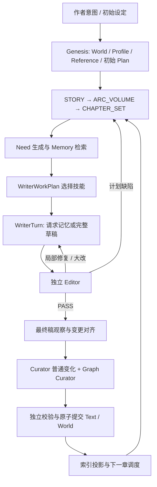

# 生产通路与运行时 Skill 二次审查（2026-09-12）

> 实施更新：以下为修复前的历史审查。用户已授权的发现现已在工作区修复；
> 逐项结果、375 项最终离线回归及真实运行边界见
> [修复记录](production_content_repair_completion_20260912.md)。下文行号对应审查时版本。

## 结论与证据边界

当前系统已经有可追溯的任务与提交链，但“检索、规划、写作、审稿、入库、恢复”之间仍有内容语义和执行状态的断点。优先级最高的工作，是统一模型实际收到的协议与证据权限，确保新计划真正取代旧计划，并保证正文中的持久变化不会在入库时系统性漏失。

本轮针对第一轮修复后的工作区进行静态审查，并读取上轮离线测试已经留下的对象工件；没有新增测试运行、真实模型调用或小说长跑。用户确认暂时无法提供之前真实跑书的产物。因此，下文不评价《余烬九序》具体章节的文学质量，也不把旧交接报告当作当前版本的运行实测。

源码基线为 `1856153298856bdcb6eb7a8c6ad62f0727ac9683` 加当前未提交修改。证据分三类：

- **代码事实**：生产装配、请求构造、投影、校验及消费者行为。
- **离线工件事实**：此前假模型端点生成的产物，只证明字段、加载与流转行为。
- **风险推断**：根据明确触发条件推导的缺陷影响，尚未用真实小说重现。

以下问题包含第一轮修复仍未闭合的部分；此前 246 项离线回归通过并不覆盖这些新发现。

## 已有工件实际说明了什么

检查了 `%LOCALAPPDATA%/Temp/pytest-of-lenovo/pytest-13/` 下两个生产装配案例：

| 案例 | Memory 与写作产物 | 能证明什么 |
|---|---|---|
| `test_production_factory_runs_o0` | 11 个 Writer context item，0 个有 evidence ledger，11 个 gap；检索 trace 为 `not_executed_no_executable_query`；最后仍得到假端点的 PASS | 该 fixture 明确注入空的 InMemory backend；它验证流程可处理缺口，不能验证检索有效。不能据此说默认生产检索也完全为空 |
| `test_production_cli_and_runner0` | 11 个 Need 都有 `executed_with_candidates`；Writer context 12 个 item，其中 11 个带证据、1 个 gap；语义状态 `UNASSESSED` | 默认 CLI 路径确实执行了检索并把证据送到 Writer；相关性、回答充分性和文学质量仍未验证 |
| 两个案例的 Writer | 实际选择均只有 `skill.scene-composition`；skill receipt 为 `planned`，完成检查点为空 | 技能选择/装载有工件，但没有“具体技能产生了合格正文效果”的验收记录 |
| CLI 案例的 Editor | 4 条 criterion assessment 每条引用整个 4040 字符假稿；1 条 gap 被假端点标成 avoided | 精确字符串检查通过，并不证明因果、人物、伏笔或任务结果真正达成 |

可复查的主要内容哈希：

- 空 backend 的 Writer context：`8126ea66489693d72ed2c8b0105b694e65b01fa608bd24c1f1a0a95644cecb3a`。
- CLI 的 Writer context：`63fb3e922f0252ad18ebfa6f837215ee8acd1ae0147ccdc3ac37de086e9e98a8`。
- 空 backend 的 WritingLoopResult：`f23ca03be1540fbed17569cfbd05d88ba4f536a7c16dae67678f591e8d1cfc30`。

这些临时目录可能被后续 pytest 清理；这里记录的是本次实际读取结果，不是新的真实运行报告。

## 实际通路

Skill 在这里主要是注入模型上下文的方法说明，并不是可独立执行、自动返回任务成功的工具。是否注册、是否注入、是否被选择、是否执行到检查点、是否产生合格结果，需要分别记录。

## 需要优先处理的问题

### P1-01：Writer 的技能库和默认生产能力不一致

**代码事实。** `runtime/production_assembly_spec.json:23-24` 的默认 Writer allowlist 只有 `skill.scene-composition`。`production_bootstrap.py:437` 原样把它传给 WritingRequestPolicy。`writer_cognition.py:225-228` 只给允许技能生成选择卡片，289-291 再拒绝越界选择。因此人物声音、对话潜台词、POV、节奏、伏笔、文风等六个方法文件实际无法在默认生产中被选择；major-rewrite 也不在默认技能范围。

另外，`production_bootstrap.py:529-546` 创建 Writer SkillTemplate 时没有填写 summary、tags 或 applicable_modes，`skills/registry.py:64-75` 的 describe 最终只输出 ID。即使扩展 allowlist，选择阶段仍不能读到用途、触发条件、代价和不适用情形。

**建议。** 先补有区分度的技能卡片，再按章节任务、人物、场景风险和修复类型选择少量技能；为 major rewrite 固定必要核心方法。不要简单每章加载全部全文。

### P1-02：正在使用的 Skill 还要求旧协议，容易抵消新能力

**代码事实。** 默认装载的 `scene_composition_v1.md` 要求返回 `WriterDraftPayload`，并禁止检索记忆。当前 `writer_turn_v1.md:3-5` 及 `writer_cognition.py:343-433` 使用的是 `WriterTurnOutput`，普通写作轮允许 `REQUEST_MEMORY` 或 `DRAFT_READY`。相同请求里同时包含这些指令。未默认启用的 `continuation_v1.md`、`major_rewrite_v1.md` 也保留旧输出类型；大改路径同样解析 `WriterTurnOutput`，但其宿主协议另行限制必须返回完整草稿，不能把普通轮的记忆请求权限直接移过去。

不是说 Writer 可以直接操作检索后端；正确边界应是“Writer 可提出语义问题，由宿主执行检索”。现有“never retrieve”与旧输出类型没有表达清楚这个边界。默认唯一选择的 scene-composition 恰好携带该冲突。

Curator 也有类似叠加：`agents/curator.py:180-190` 的前层指令要求 `ChapterChangeDraftV2` 和 evidence candidate IDs，后层 `model_curation.py:535-550` 要求语义 quotes、不允许模型生成 IDs；`memory_delta_extraction_v1.md` 又限制每条恰好 1 个 span，而组合状态的新指令允许并需要多个证据片段。

**建议。** 每个阶段只由宿主提供一个当前输出 schema 和权限协议，Skill 专注方法；明确候选、事实、语义查询、宿主工具之间的界限。更新技能与绑定版本，不继续叠加互相冲突的补充句子。

### P1-03：重规划可能留下旧 PlanNode，使新旧要求同时生效

**代码事实。** `adapters/runtime/materializers.py:244-269` 对目标窗口的旧 ChapterGoal 按章删除；但对 PlanNode 只删除同 ID 节点或被 execution.deviations 明确失效的节点。若重规划使用新 item_id 而未声明完整失效集，旧节点仍在 PlanRoot。

`services/planning_contracts.py:98-121` 根据章节区间选节点，`stage3_writer.py:155-247` 会把选中的父要求、前置条件、禁止事项及本章到期结果放入 Writer 合同。因此“同一章旧计划 A → 新计划 B”后，A 节点仍可能被再次投影进来；几轮滚动后还会积累重复上下文。

**建议。** 对已接受的同层、同作用域计划使用显式 revision/supersedes 语义，原子替换当前有效视图；历史版本留在工件和提交历史。不能依赖模型碰巧复用 ID，或仅替换 ChapterGoal。

### P1-04：新增要求还缺少阶段语义，入口条件会变成每章硬约束

**代码事实。** `stage3_writer.py:199-247` 把当前节点和全部祖先的 `preconditions` 无条件合并到本章 mandatory_constraints；父节点 dependency_ids 也被描述为本章结果之前必须完成。

**风险示例。** 卷计划“以主角被囚禁为入口，卷中越狱后追查幕后人”中的入口条件，如果作为该卷 precondition 保存，会在主角已逃出后的本卷章节中继续出现。条件、持续不变量、阶段结果、不可逆事件尚未区分。

此外，`materializers.py:579-591` 对缺失 chapter range 的子节点跳过父区间比较，只有窗口被某个卷覆盖的总检查；没有把每条 ChapterGoal 的 chapter_index 与其具体父节点和节点范围严格绑定。

**建议。** 区分 entry condition、throughout invariant、exit outcome；将依赖解析成可读取的目标与完成证据，不能只给 ID。校验每条章目标与节点、父卷、时间窗口一致，在 Planner 修订阶段反馈错误。

### P1-05：普通 Curator 每章最多 4 条变化，记忆可能从写入端丢失

**代码事实。** `domain/changes.py:285,312` 两个普通 Curator 模型都限制 operations ≤ 4；`model_curation.py:572` 明确要求最多四条。实体、状态、事件、义务共用这个名额。`unresolved` 同样最多 4 条。新增人物的实体操作还会占用变化额度。

普通主通路按章一次抽取；重试用于修复失败提案，并不是继续处理同章剩余变化。Graph Curator 另有分块/分页及完整性检查，因此这里的结论针对普通状态、事件、义务抽取，不能泛化为图关系也最多四条。

`_build_record_kind_coverage`（`model_curation.py:1885-1921`）统计模型已提出的 proposed/accepted/rejected；它没有独立统计正文中实际存在但模型未提出的变化。`coverage` 默认 1.0 并由模型报告。

**影响推断。** 长章有五个以上重要变化时，即使所有已提出操作都验证正确，也可能漏掉关键事件、能力代价或承诺；后续检索再强也找不到未入库的结构化状态。

**建议。** 按场景/事件窗口拆分普通抽取，使用去重、依赖排序与明确 remaining-work 游标；在章结算前完成合并及覆盖核对。四条可作为每次模型响应上限，不应成为整章容量上限。

### P1-06：计划义务有了存储位置，但进入 Curator 的身份映射仍未闭合

**代码事实。** 新增计划义务保存在 PlanRoot，`planning_contracts.effective_obligations` 只有在 World 中存在同 obligation_id 时才同步 observed status。`teacher_forced.py:441-486` 及 `model_curation.py:470-595` 的普通抽取输入传了正文与 current_world，没有传 accepted PlanRoot 的义务 ID/定义对照。

**风险推断。** Curator 可能给已经兑现的计划承诺生成另一个 ID，或只抽取事件/状态。对应的计划义务持续 OPEN，下一章继续被当作到期要求；若使用新 ID，按相同 ID 绑定的时间锁检查也缺乏对象匹配依据。

**建议。** 给 Curator 提供只读的“待观察计划义务目录”，要求把正文实现匹配到现有义务，引用精确正文证据，允许部分推进/兑现/放弃/未涉及。目录是意图参考，不能自身作为发生事实的证据。与独立跨章里程碑台账一起处理。

### P1-07：Editor 的“记忆得到支持”可能引用 Writer 自己的设想

**代码事实。** `writer_candidate.py:170-202` 收集整个 Context View，包括 protected、active memory、working、compacted prefix、settled tail，所有 item 统一写为 `support_status="verified"`。其中包含 WriterWorkPlan 的 creative_proposals 和未证实状态。

`editorial.py:533-545` 检查 gap disposition=supported 时，只验证 quote 是否存在于任意 context_summary.text，没有限定为 Canon/已提交正文/已经验证的检索切片。于是来自 Writer 自己工作计划的一段文字也可以满足这一字符串条件。

**澄清。** 上一章正文确实通过 active_memory_items 进入 Editor，不存在“完全没传上一章”的结论；问题是证据权限混淆。源码检查排除了之前的初步怀疑。

**建议。** Editor 使用独立 Evidence Catalog，保留来源、证据 ID、truth class、章节可见性与验证状态。Writer 提议、旧稿、自评、压缩摘要可供理解过程，不能证明事实性缺口已补齐。对 avoided 也应保留具体依赖判断，不能把关键前提统一降成“可以绕开”。

### P1-08：生产恢复先重新生成 Memory，再尝试加载冻结 checkpoint

**代码事实。** `stage3_writer.py:273-330` 无条件重新调用 Stage2M context 工厂；到构造请求末尾才从 task.terminal_artifact_refs 选择 resume_checkpoint。`writer_context_loop.py:1436-1449` 则要求恢复请求的 writer_context_ref 与旧 checkpoint 完全一致。

第一轮修复接入真实 Need planner 后，生成内容及审查/预算/Need generation 工件都可能变化；`production_components.py:505-515` 把这些工件纳入 context lineage。这使“Canon basis 未变”不再足以保证 context artifact 相等。另有相同模型 request_id 已结算后的重复生成风险：`model_gateway.py:348-416` 未在普通 generate_text 路径直接复用 completed raw response，专用 reparse API 是另一条路径。

**风险推断。** 正常 yield/restart 可能产生重复模型费用、身份冲突，或因 context ref 改变拒绝恢复。现有叶子级冻结请求恢复测试不能等同于生产工厂重新构造请求的恢复。

**建议。** 先读取并校验 checkpoint 的 Canon/task/config basis，再从冻结引用恢复 WritingTask、Memory package、recent prose 与 Need generation。明确区分 resume 与显式 rebase；已结算调用按已冻结 raw response/receipt 重放。

### P2-09：Memory Focus 仍用 ID 字符串猜章节范围

`task_focus.py:210-240,320-328` 根据 `.range.X-Y` 的 ID 后缀判断目标范围，而不是读取已有的 chapter_start/end 和 parent_id；未匹配时取其他节点的前八个。普通 `chapter.21`、`volume.2` 等合法 ID 不满足该格式。

第一轮修复只统一了 Writer 和相关 context 的节点投影，这个生产 Need 入口仍保留旧规则。节点越来越多时，早期节点可能挤占关注集；新必达结果、依赖与相关人物也不一定成为检索焦点。`stage3_writer.py:371-377` 的 Memory task_text 仍主要是摘要与 obligation IDs；Need prompt 的 chapter goal 渲染也主要读取 summary。

**建议。** 复用同一作用域/祖先投影，按 requirements 中的待证明前提生成 Need；结构化依赖应直接成为查询对象。未命中、未执行、只相关、部分回答、完整回答分别统计。

### P2-10：连续修复的历史、预算与记录还不是完整状态机

- `writer_context_loop.py:702-705` 局部修复后只更新 repair_chain，未更新 prior_repair_history；`editorial.review_repaired:251-259` 下一次仅由该字段加当前一条记录构造历史。大改新建 EditorialReviewInput 也未传此前历史。完整工件可能还在，但模型看到的修复原因不完整。
- `writer_context_loop.py:625-886` 修复循环内部不检查 `max_post_draft_model_calls`；预算检查在退出循环、进入 Observer 前。一个 slice 可以完成多轮修复后才 yield，不能保证所配置的 slice 上限。
- `_model_calls:1702-1731` 汇总只拿最新 work_plan / repaired_draft / rewritten_draft；多轮修复的中间调用不全在 WritingLoopResult 中。持久模型 ledger 是另一条更完整的事实来源，不能据此推断全局计费必然漏算。

**建议。** 把每次 repair/rewrite 的输入、输出、审稿、预算与 checkpoint 作为追加式状态保存；在每次调用前决定预算，恢复精确停点；报告从持久 ledger 汇总。

### P2-11：lookahead 分支仍未使用同一卷边界与有效性判断

`creative_runtime.py:1965-2004` 的 lookahead_horizon 仅被全书 target 限制，没有用 `_clip_to_volume`；后续重规划复用旧窗口。默认 lookahead 关闭，所以这是启用并行预规划后的条件问题。

`_revalidate_lookahead:2048-2059` 又用 Draft 的 affects_future_plan 布尔值决定晋升/重规划。该值在 `creative_runtime.py:594-596` 的生产绑定中来自 Observer 是否报告变化，而 Observer skill 限制最多四条弱观察，不是完整的计划依赖验证。

**建议。** 正常滚动、lookahead、恢复重规划统一范围计算；晋升时按实际依赖和已提交变更复核。触及卷边界时安排正确规划层，而不是等物化失败后阻塞。

### P2-12：长跑成本和上下文压力持续增长，尚未测出稳定上界

`model_curation.py:2074-2084` 把完整 World（仅移除 evidence_refs 等字段）放进每章普通抽取请求。历史事件、实体、义务累计越多，每章上下文越大。若存量随章数近似线性增长，总输入工作量可能接近二次增长；这是静态复杂度推断，不是实测耗时。

`production_bootstrap.py:780-811` 的 smoke backend 还缓存每个 commit 的整套内存索引，没有淘汰策略；它不是长期部署 backend。其他全文根的序列化、快照和索引构建，也需要按 50/100/300 章工件量测量，而不能只看一章成功。

**建议。** 让 Curator 读取本章涉及实体/邻接关系/相关义务的有界工作集，保留按需 exact lookup；制定缓存淘汰与工件保留策略。必须验证缩减后的上下文不会丢失身份、时态及功能状态冲突检测。

## Skill 的调用与内容逐项检查

读取了 `src/novel_agent/skills/` 中全部 **38 个 Markdown 文件**；其中 15 个仅有标题和一个短段落。这不是以长度衡量质量：这些文件普遍缺少输入前提、执行步骤、产物检查点及失败示例，难以把“注意节奏/依赖”变成稳定的方法。

### 装载机制的实际差异

| 路径 | 实际选择/加载 | 当前缺口 |
|---|---|---|
| Writer | WorkPlan 阶段按 allowlist 展示卡片；模型选择；take_turn 加载所选全文并校验 hash | 默认仅一个技能；卡片只有 ID；没有模式必选/互斥；完成检查点未兑现 |
| Planner | AgentSpec 每轮固定装载 inquiry + 当前层方法 + 3 个共享方法全文 | selected_skill_ids 是事后字段，未控制下一轮装载；PlanningLoopRequest.allowed_skill_ids 未被循环消费；不是完整渐进加载 |
| Plan Reviewer | 每轮固定装载核心审查 + 时间锁 + 父范围三个全文 | spec 的 plan_reviewer_skill_ids 没有真正约束这条装载；确定性范围检查主要在同一提案内部，父计划校验较晚 |
| Editor | 核心 skill 走 Registry；三个 lens 根据长度、beat 数、是否复审条件加载 | lens 直接读文件，未走 SkillRegistry.resolve，也未成为对应执行 receipt；spec.editor_skill_ids 未用于选择 |
| Curator / Guardian | 固定 Registry skill，加宿主大段协议与当前数据 | skill 与上层/底层 schema 有冲突；变化容量与证据条数写成固定常量 |
| 检索 / 压缩 | 当前生产由确定性控制器、Context runtime 执行 | 同名方法 skill 的字面注册主要在 benchmark harness，不能算生产模型在使用它 |
| Recovery / Evolution | 专用离线服务用注入的 Registry 加载 | 生产装配未创建对应服务；不能认为小说会自主修改技能或自动处理全部异常 |

`agents/runner.py:152-164` 是 Planner 固定加载的关键位置；`services/editorial.py:94-102` 是 Editor lens 绕开 Registry 的位置。`domain/production_assembly.py:36-46` 的声明字段与实际消费者应统一，避免改了配置却没有改变运行行为。

具体调用顺序如下，可据此定位模型真正收到技能的位置：

1. **Writer**：`production_bootstrap._writer_skill_registry` 注册正文和内容哈希 → `WriterCognitionService.create_work_plan` 通过 `SkillRegistry.describe` 展示允许技能的卡片 → 校验模型的 selected_skill_ids → `take_turn` 用 `resolve` 读取并验哈希 → 全文拼入实际写作请求。这里存在真正的“先卡片、后全文”，但默认选择空间和卡片内容使它基本退化。
2. **Planner / Plan Reviewer**：`build_planner_contract_bundle` 构建各模式 AgentSpec → Planner/Reviewer 调用 `StructuredAgentRunner.prepare` → 遍历 spec.skills，逐份 `resolve` 全文 → 与模式 prompt 和 task payload 一起发送。Planner 返回 selected_skill_ids 发生在装载之后，不能改变该次已发送内容，也没有控制后续装载。
3. **Editor**：`EditorialService.review/review_repaired` 计算适用 lens → `_editor_lens_instructions` 直接读 Markdown → 正文作为 review payload 的 lens_instructions 传入；核心方法另由 Registry 装载。局部修复由 `EditorialService.repair` 使用 LOCAL_REPAIR 契约。两种加载方式的哈希和执行记录目前没有统一。
4. **Curator / Guardian**：`production_bootstrap._curator_runner` 注册固定方法 → `CuratorReplayAgent._run_v2` 经 Runner 构造前层请求 → `ModelCurator.extract_reported_v2` 再附加实际输出协议和当前 World/正文；Guardian 经独立审查代理判断候选风险。Curator 的协议冲突正是前后两层叠加造成的。

### 全部 38 个 Skill 清单

表中“生产”指默认生产装配；“可选”不等于默认可选到。

| 文件 | 调用方式 / 当前状态 | 内容评价与优化方向 |
|---|---|---|
| `project_intent_modeling_v1.md` | Planner PROJECT_BOOTSTRAP 固定 | 来源分类合理；需明确作者硬约束、可商议项与可观察结束条件的输出 |
| `story_architecture_v1.md` | Planner STORY 固定 | 177 字符的单段提示；补主冲突、人物选择、代价、终局承诺及分阶段证据 |
| `arc_volume_planning_v1.md` | Planner ARC_VOLUME 固定 | 单段；补卷入口/出口、主要转折、子线窗口与不可提前兑现约束 |
| `chapter_set_planning_v1.md` | Planner CHAPTER_SET 固定 | 有滚动范围意识；缺旧计划替换、当前事实核对与逐章状态推进方法 |
| `chapter_goal_decomposition_v1.md` | Planner CHAPTER 可调用；正常调度以章集合为主 | 只列目标类别；补目标→冲突→决定→后果→验证的分解方式 |
| `scene_contract_planning_v1.md` | Planner SCENE 可调用；未单独进入默认正常调度 | 只列合同字段；补场景必要性、时空与人物意图检查 |
| `plan_deviation_replanning_v1.md` | Planner REPLAN 固定 | 应要求旧/新计划差异、明确失效节点及保留承诺，不能只重生成摘要 |
| `planning_inquiry_v1.md` | 所有 Planner 调用固定 | provenance 原则正确；宿主却把 inquiry 输出全标 planner_proposed，来源分类没有充分落实 |
| `alternative_comparison_v1.md` | Planner 每轮固定共享 | 应只在有实质分歧时使用；产物需显示代价和弃选理由，不能空列 alternatives |
| `obligation_scheduling_v1.md` | Planner 每轮固定共享 | 需要真实活动义务目录、窗口冲突及已有兑现证据作输入 |
| `character_arc_hook_payoff_planning_v1.md` | Planner 每轮固定共享 | 应分开人物动机/选择改变与伏笔阶段，给跨章依赖的检查点 |
| `plan_review_v1.md` | Plan Reviewer 固定 | 覆盖维度合理；需逐项核对 accepted parent、执行可行性与未兑现承诺 |
| `plan_review_parent_scope_v1.md` | Plan Reviewer 固定 lens | 规则具体；要与物化器同一确定性范围校验一致，覆盖现有父节点 |
| `plan_review_temporal_obligation_v1.md` | Plan Reviewer 固定 lens | 时间边界明确；嵌套 payload.obligations 与既有义务也要纳入校验 |
| `scene_composition_v1.md` | 默认 Writer 唯一允许技能 | 方法与基本约束尚可；旧 WriterDraftPayload / 禁检索协议必须先修正 |
| `continuation_v1.md` | Registry 有；默认 Writer 不允许 | 适用于冻结前缀续写；当前 WriterTurn 没有对应独立动作，不能随意开启 |
| `major_rewrite_v1.md` | Registry 有；默认 Writer 不允许 | 与大改用途吻合，但协议过时；应在大改模式强制绑定当前方法 |
| `character_voice_writing_v1.md` | Registry 有；默认 Writer 不允许 | 要补可用人物声音卡和“当前欲望→表达策略→行为代价”检查点 |
| `dialogue_subtext_writing_v1.md` | 同上 | 方向正确；需按对话目的/冲突使用，避免所有台词机械地双层解释 |
| `pov_epistemic_writing_v1.md` | 同上 | 边界合理；依赖角色知识与读者披露材料，不能仅靠一句不要泄密 |
| `pacing_transition_writing_v1.md` | 同上 | 应把场景重要性绑定篇幅和转折节奏，而不是平均铺开每个 beat |
| `hook_foreshadowing_writing_v1.md` | 同上 | setup/advance/payoff/defer 合理；需要显式义务目录和阶段证据 |
| `style_genre_writing_v1.md` | 同上 | 优先遵守事实与风格合同合理；需清晰的作者风格卡及不良示例 |
| `editor_review_v1.md` | Editor 核心固定 | “未知都 advisory”过宽；区分可绕开的背景未知与当前因果依赖缺失 |
| `editor_local_repair_v1.md` | LOCAL_REPAIR 固定 | 具体范围规则较好；补多轮已修问题、防回归与无法局部修复的显式返回 |
| `editor_chapter_length_v1.md` | 靠近字数边界或越界加载 | 越界建议 LOCAL_REPAIR 与宿主一律升级 MAJOR_REWRITE 不一致；字数事实由宿主给，无需为全局长度找局部 quote |
| `editor_plan_adherence_hook_payoff_v1.md` | 有结果/义务/禁止项时加载 | 要核对实际结果及代价，保留与上层承诺的对应关系 |
| `editor_pacing_repetition_v1.md` | >2 个 required beats 或复审时加载 | 只有1-2个 beat 也可能停滞重复；应基于文本/近期剧情风险触发，不只计数 |
| `candidate_observation_v1.md` | 最终候选 Observer 固定 | 独立观察边界合理；最多4条弱观察不适合单独承担未来计划影响判断 |
| `memory_delta_extraction_v1.md` | Genesis Curator 与逐章 Curator 固定 | 每章4条、每条1片段过硬；Genesis 也不应照用逐章约束；对齐语义 quote 契约 |
| `memory_risk_review_v1.md` | Guardian 固定 | 风险类别合理但只有一段；需输入证据和操作逐项判断，不替代确定性阻断 |
| `setting_to_world_v1.md` | 字面引用在 teacher-forced benchmark harness | 内容短；未发现它作为默认生产 Genesis 的独立技能注册，不能把存在文件等同于已接线 |
| `bootstrap_source_classification_v1.md` | 未发现生产代码按此文件名绑定 | 原则有价值；来源分类实际更多由宿主规则实现，需要明确归属，避免名义能力 |
| `iterative_retrieval_v1.md` | 字面注册在 benchmark harness；生产使用确定性路由 | 不应声称生产 Controller 已执行此模型方法；把策略约束对齐真正控制器 |
| `evidence_sufficiency_v1.md` | 同上 | 需将“命中/回答/充分”区分落实到生产语义回执，而非只留提示 |
| `context_reduction_v1.md` | 同上 | 生产由 Context runtime 负责；应核对实际压缩的保留义务，不依赖文件名 |
| `recovery_reasoning_v1.md` | 离线 RecoveryReasonerService 接受注入注册 | 选择安全候选而不直接执行的边界合理；尚不是生产异常自动恢复器 |
| `evolution_candidate_v1.md` | 离线 EvolutionCandidateGeneratorService 接受注入注册 | 候选与晋升隔离合理；仍残留 Codex–DSH 交接描述，应按已停用工具清理 |

### 方法内容应该补什么

建议为每个实际使用的方法统一最少六项：触发条件、可信输入、具体步骤、需要留下的产物、可观察检查点、失败/升级方式。具体到小说方法：

- STORY/ARC：从人物选择及其代价构造转折，不把主题词当结果；声明入口、持续边界与出口。
- CHAPTER/SCENE：说明本章为什么必须存在，谁想达成什么，遇到什么阻力，做了什么决定，留下什么后果。
- Writer：为关键场景分配篇幅和表现方式，让正文实现计划；角色声音和潜台词要有实际输入。
- Editor：逐项检验人物动机、因果、重复、节奏与伏笔作用，用精确证据和具体反例说明，不能以提到关键词视作完成。
- Memory：明确已覆盖的来源范围、未处理内容、事实/推断/计划的类别，支持分批闭合而不是截掉剩余工作。

SkillExecutionReceipt 目前保持 PLANNED 是诚实的，但系统还没有 completed_checkpoints 的后续生产回填。应由独立审稿/验证把实际产物绑定到检查点，再用失败聚类改进方法；不能由 Writer 自己勾选完成来代替验证。

## 其他应同步收敛的细节

1. `production_bootstrap.py:1170-1179` 只在配置 BATCH_TEST endpoint 时创建 NeedEvidenceSemanticJudge，judge 内部也使用 BATCH_TEST 角色/目的。正常只有 implementation endpoint 的生产仍为 UNASSESSED。应将这项生产内容判断与实验 endpoint 配置解耦，明确成本与未评估策略。
2. `agents/plan_reviewer.py:86-99` 对新增 host issue 的通用修订指令仍是修复时间锁/父范围，即使实际错误是 required_outcomes 缺失。该覆盖逻辑还需保留已有 HUMAN_REQUIRED/REJECT 的严重性，避免被较轻 host issue 改成 REVISE。
3. 默认 inquiry 限制最多3个目标/问题、自由文本<240字符，适合紧凑查询但没有按 STORY/ARC/CHAPTER_SET 的复杂度区分；方法产物要有足够内容，不能把压缩目标变成稀薄计划。
4. `evolution_candidate_v1.md:6`、`services/evolution_candidate.py:83` 仍保留已停用的 Codex–DSH 说法；它们不意味着生产会启动这些工具，但说明旧开发流程清理尚有两处遗漏。
5. 明确显示工程状态与内容状态：READY、候选已提交、Memory 有证据、Memory 已充分回答、计划结果已兑现、小说质量已审查不应合并成一个成功标记。

## 建议实施顺序

1. 先消除协议冲突、补 Writer 技能卡/allowlist/模式绑定，修复 Editor 证据权限和同章计划替换。
2. 补齐入口/不变量/出口语义、计划义务与 Curator 的身份映射、普通变化抽取分批闭环。
3. 修正生产冻结恢复、多轮修复状态与预算、所有规划窗口的边界计算。
4. 对接生产语义充分性判断，统一检索关注集与计划约束，再优化长跑工作集与成本。
5. 最后用真实产物逐章核对：计划→Memory→WorkPlan→正文→审稿→World 变化→下一章。真实验收应关注问题机制是否消失，不能仅扩大假端点 PASS 数量。

本轮交付为审查记录；未修改上述业务代码，也没有把建议视为已实现。
