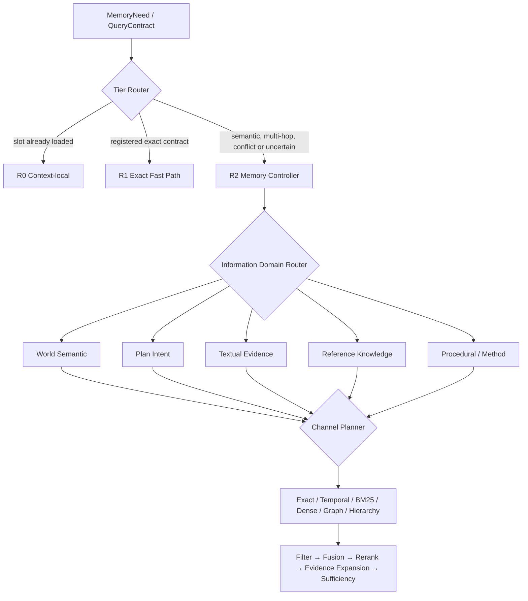
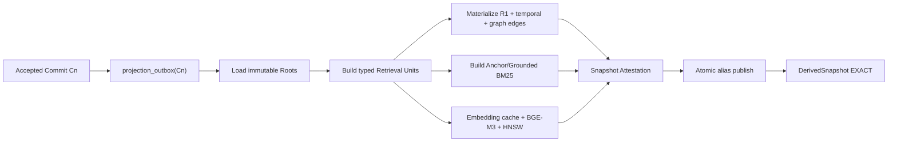
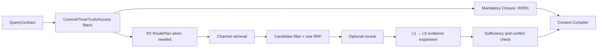

# Stage 2R：多形态记忆检索、派生投影与科学分流开发执行文档

日期：2026-07-22  
状态：`execution baseline / implementation required`  
上游依据：

- `长篇小说Agent总体架构设计_v2.2_完整合并版.md`
- `长篇小说Agent技术实施与选型设计_v0.1.md`
- `长篇小说Agent正式开发执行规划_v0.1.md`
- `docs/stage2_memory_agents_development.md`
- `docs/adr/0001-stage1-memory-kernel-baseline.md`

---

## 0. 文档定位

本文是 Stage 2A 与下一轮真实 benchmark 之间必须执行的检索专项工作，不重新设计 Canonical
Memory，也不把检索做成新的事实源。本文回答：

1. 每个 accepted chapter commit 后，TextRoot、WorldRoot、PlanRoot 如何真正物化为可查询结构；
2. R1 Exact/Temporal、BM25、Dense、Typed Graph、Hierarchy、Rerank 如何接入同一快照；
3. 面对不同信息域、Query Intent、风险和证据要求，系统如何科学分流，而不是全通道广播；
4. Memory Controller、确定性 Retrieval Orchestrator 和底层 Tool 各自拥有什么决策权；
5. 如何复用已经完成的 97 个 canonical commits 修复本轮 benchmark，而不重新调用 Curator 回放；
6. 哪些门禁通过后，新的结果才可以声称是“真实 Hybrid Retrieval”结果。

本文新增阶段名 `Stage 2R`，其中 `R` 表示 Retrieval Realization。它不是新的产品阶段，而是
Stage 1 已有真实检索能力接入 Stage 2 连续项目回放的修复工作包。执行顺序为：

```text
现有 Stage 2 canonical replay
    → Stage 2R 真实派生投影和分流接线
    → C20/P001 诊断门禁
    → C20/C40/C60/C80/C95 全量检索评测
    → 决定 deterministic gateway / bounded R2 的晋升结果
```

---

## 1. 当前事实与结论

### 1.1 已经真实完成的部分

当前《择天记》运行目录已经形成可复用的 canonical basis：

```text
97 Project Commit
97 TextRoot 版本
72 个不同的 WorldRoot 版本
6 个不同的 PlanRoot 版本
Genesis + 序章 + 第 1～95 章连续 receipt chain
```

最终 WorldRoot 至少含：

```text
17 entities
12 events
168 states
7 relations
4 obligations
```

所以以下链路已经执行：

```text
揭示新章节
→ TextRoot 更新
→ Curator 提取候选变化
→ Validator / Guardian Gate
→ WorldRoot 更新或 Noop
→ Atomic Commit
```

WorldRoot 版本少于 TextRoot 版本是允许的：某一章没有可接受的结构化语义变化时，该 commit
可以继续引用上一个 WorldRoot；但 TextRoot 仍必须产生新版本。

### 1.2 尚未真实完成的部分

当前 Stage 2 teacher-forced runner 使用 `ExactReplayProjectionBuilder` 和
`InMemoryRetrievalBackend`：

- `derived_snapshot` 有 97 条，但只包含测试型 metadata；
- `r1_record = 0`，`r1_record_entity = 0`；
- 没有为当前项目构建 OpenSearch Anchor/Grounded 物理索引；
- 没有调用 BGE-M3 生成 1024 维 embedding；
- 没有持久化 HNSW 向量；
- 没有物化可遍历 Typed Graph；
- `ANCHOR_DENSE / GROUNDED_DENSE` 实际只是 token-set Jaccard smoke；
- `ANCHOR_BM25 / GROUNDED_BM25` 实际只是词项重叠，不是真实 BM25；
- checkpoint 使用了 `snapshot.<case>.stage2-e2e`，而不是 commit 对应的真实 snapshot。

因此，上一轮结果只证明 canonical 维护、未来隔离、Controller bounded loop 和报告管线能够运行，
不能证明真实 Hybrid Retrieval。`semantic_quality_eligible` 必须同时检查生成模型和检索后端，不能
只因为 Qwen 是真实模型就置为 `true`。

### 1.3 本轮冻结的四个结论

1. **不重新回放 Canonical。** 先从已有不可变 commit/root chain 重建 derived state。
2. **不新增独立“向量真源”。** OpenSearch k-NN 是本阶段向量库，向量属于可重建 L2。
3. **不立即引入 Neo4j。** Typed Graph 先使用 PostgreSQL/R1 versioned relation edges 和 bounded CTE。
4. **禁止所有查询全通道广播。** 采用 Resolution Tier、Information Domain、Retrieval Channel
   三层路由；Controller 只能在可信 Runtime 给出的允许通道集合中决策。

---

## 2. 名称和边界：不得再混淆两套“层级”

### 2.1 表示层：L0 / L1 / L2

| 层 | 含义 | 例子 | 权威性 |
|---|---|---|---|
| L0 | 可直接核验的完整源单元 | Text block/span、完整 World record、Plan node | 由对应 Root 拥有 |
| L1 | 可寻址、可追溯的语义锚点 | Fact、Event、Scene、Chapter、Arc、Plan anchor | Derived，可重建 |
| L2 | 组合检索结构 | BM25、Dense、Graph、Temporal、Hierarchy、Exact index | Derived，可重建 |

L2 命中只意味着“召回候选”，不意味着候选为真。高风险结论必须展开回 L0/Canonical evidence。

### 2.2 执行路径：R0 / R1 / R2

| 路径 | 执行者 | 适用条件 | 是否调用 LLM Controller |
|---|---|---|---|
| R0 | Runtime | 当前 Context/Working State 已有同 basis、同 scope 的 slot | 否 |
| R1 | Runtime + Retrieval Service | 注册模板下确定、有限、精确、无冲突的读取 | 否 |
| R2 | Memory Controller | 语义、多跳、冲突、未知、证据充分性、多轮补搜 | 是 |

`R1WorldRepository` 是当前代码中的结构化读存储名称；它通常服务 R1 fast path，也可以作为 R2
内部 `exact / temporal / graph` Tool 的 backend。它与 L1 Anchor 不是同一个概念。

### 2.3 三层分流模型



Tier Router 决定是否需要 Agent；Domain Router 决定查哪类资产；Channel Planner 决定使用哪种
L2 结构。这三件事不得压成一次自由文本 Tool 选择。

---

## 3. 目标运行架构

### 3.1 写侧：每章必须形成可搜索的新 basis



每个 accepted commit 必须至少产生一条 outbox。每一章是否立即需要完整 Dense 重建由运行 Profile
决定，但任何被允许用于检索的 snapshot 都必须明确标记：

```text
exact      所需通道均与 source_commit 完全一致
partial    只有声明过的部分通道就绪
stale      source_commit 落后，只能显式降级
failed     构建失败，不得伪装为 empty success
```

### 3.2 读侧：先闭合硬约束，再竞争相关材料



`mandatory_constraints`、当前 functional state、关键 relation、访问边界和硬 Plan obligation 不进入
向量相关性竞争。它们先通过 R0/R1 闭合；闭合失败时必须 unresolved 或 blocked，不能让高相似度
材料掩盖缺失。

---

## 4. 派生数据合同

### 4.1 RetrievalUnit v0.2

当前 `RetrievalUnit` 只包含基础文本、实体和 EvidenceRef，无法完成严格过滤。新增字段应保持可选
兼容，但生产 snapshot 必须填充适用字段：

```yaml
retrieval_unit:
  unit_id: anchor.state.xxx
  unit_kind: state_anchor
  source_commit: sha256:...
  snapshot_id: snapshot....
  source_artifact: sha256:...
  source_refs: [...]
  content_hash: sha256:...
  text: "陈长生 location 国教学院"
  entity_ids: [entity.chen-changsheng]
  predicate: location
  parent_unit_ids: [anchor.chapter.20]
  worldline: main
  narrative_start: 20
  narrative_end: 20
  story_time_start: null
  story_time_end: null
  truth_class: accepted_world_fact
  support_status: text_supported
  access_scope: writer_safe
  information_label: observed
  derivation_taint: []
  evidence_refs: [...]
  mandatory: true
```

必须保证：

- `unit_id` 是稳定语义身份，`content_hash` 是本版本内容身份；
- 同一 unit 可进入 BM25、Dense、Hierarchy、Graph，但各结构只保存必要 payload；
- Plan future 使用 `information_label=plan`，不得与 observed World Fact 混合；
- Grounded unit 的原文仍由 TextRoot 拥有；OpenSearch 副本不是权威源；
- 每个搜索文档必须同时携带 `source_commit` 和 `snapshot_id`。

### 4.2 DerivedSnapshot v0.2

在 `DerivedSnapshotLite` 兼容层之上增加 manifest/attestation：

```yaml
derived_snapshot:
  snapshot_id: snapshot.<commit-hash>
  source_commit: sha256:...
  build_profile: stage2r-hybrid-v0.1
  status: exact
  available_channels:
    - r1_exact
    - r1_temporal
    - anchor_bm25
    - anchor_dense
    - grounded_bm25
    - grounded_dense
    - hierarchy
    - typed_graph
  r1:
    record_count: 208
    entity_association_count: ...
    graph_edge_count: ...
    builder_version: ...
  anchor_index:
    physical_name: ...
    alias: ...
    document_count: ...
    mapping_hash: ...
  grounded_index:
    physical_name: ...
    alias: ...
    document_count: ...
    mapping_hash: ...
  embedding:
    model: BAAI/bge-m3
    revision: 5617a9f61b028005a4858fdac845db406aefb181
    dimension: 1024
    normalized: true
    runtime_fingerprint: ...
    input_profile: narrative-bge-m3-v0.1
  reranker:
    model: BAAI/bge-reranker-v2-m3
    revision: 953dc6f6f85a1b2dbfca4c34a2796e7dde08d41e
  coverage:
    expected_units: ...
    indexed_units: ...
    failed_units: 0
  receipts: [...]
  failure_debt: []
```

Snapshot 只有在 required channels 的 coverage、basis 和 backend receipts 全部通过后才能 `EXACT`。
“表里存在 snapshot row”不再等同于“真实索引已构建”。

### 4.3 Snapshot Capability

Query 前由 Runtime 产生不可伪造的 `SnapshotCapability`：

```text
source_commit
snapshot_id
available_channels
coverage_by_channel
embedding_profile
graph_profile
freshness_status
degraded_channels
```

Memory Controller 的 ToolPolicy 必须由这个 capability 与 QueryContract 的交集生成。模型不能调用
未构建、stale、越权或被当前 Need 禁止的通道。

---

## 5. 各检索形式的物理实现

### 5.1 R1 Exact / Entity / Temporal

物理实现：PostgreSQL 正式环境；测试可使用同 Schema SQLite，但正式 benchmark 必须使用
PostgreSQL native harness。

物化对象：

```text
Entity
Event
State
Relation
Plan Obligation
Plan Node / Chapter Goal exact refs
Evidence reverse refs
Alias / stable-id mapping
```

索引：

- B-tree：`project_id, source_commit, record_kind, record_id, predicate`；
- entity association index：`source_commit, entity_id, role`；
- PostgreSQL Range/GiST：valid time；
- narrative ordinal：章节与叙述顺序；
- alias 规范化索引；
- plan/access filter。

Exact 查询必须使用完整 basis。R1 miss 只返回“未命中”；只有对应 Predicate 有 completeness
certificate 时，才可把 miss 解释为不存在。

### 5.2 BM25 / Lexical

物理实现：OpenSearch 两个逻辑候选池、两个独立 alias：

```text
<project>-stage2r-anchor
<project>-stage2r-grounded
```

首版 mapping 至少包含：

```text
text.standard       标准文本分析
text.cjk            内置 CJK 分词/双字粒度基线
exact_terms         keyword，实体名、别名、专有词、Predicate
entity_ids          keyword
unit_kind           keyword
source_commit       keyword
snapshot_id         keyword
worldline           keyword
access_scope        keyword
truth_class         keyword
narrative ordinal   integer/range
story time          range or normalized numeric fields
```

不得假定单个中文 analyzer 最优。使用当前 benchmark 建立 `standard / cjk / exact-field boost`
消融，按 rare name、exact quote、alias 和普通语义查询分别报告。IK 等外部插件只有在可锁版本、可由
普通用户安装并证明收益后再引入。

查询规则：

- Stable ID 不使用 fuzzy；
- 人名、别名、规则名走 exact keyword boost；
- 台词/稀有短语先 phrase query；
- fuzzy 只用于明确拼写噪声；
- 所有查询强制 project、snapshot/commit、worldline、access、lifecycle filters。

### 5.3 Dense Vector

物理实现：OpenSearch `knn_vector`，HNSW cosine；本阶段不再增加 Qdrant/pgvector 同步面。

模型基线：

```text
BAAI/bge-m3
locked revision: 5617a9f61b028005a4858fdac845db406aefb181
dimension: 1024
float32 CPU functional baseline
L2 normalize: true
endpoint: loopback /v1/embeddings
```

Embedding 单元：

- World fact/state/relation/event anchor；
- Scene、Chapter、Arc anchor；
- Plan anchor；
- TextRoot block 或有界 grounded chunk；
- Reference/Skill 在相应 Root 接入后使用独立 unit type。

禁止：

- 把整部或整章超长正文只编码为一个向量；
- 混用不同模型、revision、归一化或输入模板的向量；
- 把向量相似解释为事实、因果或关系；
- 在 query filter 中省略 basis/access；
- 以 deterministic hash/Jaccard 冒充 Dense 质量结果。

新增内容寻址 embedding cache：

```text
cache_key = content_hash + embedding_profile + input_profile
```

同一 Text block 或未变化 Anchor 在相邻 97 个 snapshot 中只编码一次。模型升级通过新 profile
整体失效，不覆盖旧 cache。

### 5.4 Typed Graph

MVP 继续使用 PostgreSQL/R1，不引入第二真源。至少投影以下节点：

```text
Entity, Event, State, Relation, Obligation, PlanNode,
Chapter, Scene, GroundedEvidence
```

边必须显式区分：

```text
canonical   accepted relation / participation / ownership / state subject
evidence    record or anchor SUPPORTED_BY text span/block
mention     block MENTIONS entity
hierarchy   book/volume/arc/chapter/scene/block containment
temporal    before/after/overlaps when explicitly supported
inferred    derived inference，默认不可作为事实返回
similarity  离线辅助边，默认不进入因果路径
```

在线查询首版限制：

- 最大深度默认 2，高风险批准后最多 3；
- 最大节点/边数、超时和 path count 均写入 profile；
- 必须先通过 alias/stable ID 找到 seed；
- 只沿当前 intent 允许的 predicate/edge semantics；
- 每条 path 返回 edge type、direction、source ref、evidence ref 和有效时间；
- 图结果首先返回 AnchorRef，随后按需展开 L0；
- `inferred`、`similarity` 边不得证明 canonical causal chain。

引入 Neo4j 的触发条件保持原设计：SQL 路径难维护、图通道成为延迟瓶颈、需要复杂图算法，并且
held-out graph query benchmark 证明稳定收益。单纯“有知识图谱”不是引入 Neo4j 的理由。

### 5.5 Temporal

Temporal 不是一个自由相关性通道，而是所有相关通道的过滤与排序维度。它同时使用：

```text
commit visibility
worldline
valid time interval
narrative order
story time / relative time
reader disclosure position
```

`current_state` 必须按目标 story time 选择有效记录，不允许用 OpenSearch recency score 替代时间
有效性。遇到相对时间无法解析时升级 R2，并把歧义作为 unresolved，而不是选“最新一条”。

### 5.6 Hierarchy

层级主干：

```text
Book → Volume → Arc/Storyline → Chapter → Scene → Block/Span
```

语义线程：

```text
Character Arc / Foreshadowing / Conflict / Item History / Location Thread
```

Hierarchy channel 不做普通全库文本搜索。它先召回上层 scope，再对子树执行 Anchor 或 Grounded
检索。每次下钻必须记录 parent/child path，避免 Chapter Summary 与 Text block 在同一个无类型
top-k 中直接竞争。

### 5.7 Rerank

模型基线：锁定 `BAAI/bge-reranker-v2-m3`。执行位置：

```text
每通道独立粗召回
→ 类型内去重
→ 一次应用层 RRF
→ 20～50 个 Anchor 候选
→ rerank
→ 5～15 个 Evidence Expansion 候选
```

Rerank 默认只处理 Anchor 候选。台词和文风需要连续原文时，reranker 可以对 bounded grounded
window 评分，但必须使用独立 profile 和指标，不与 Anchor pair token 混算。

### 5.8 L0 Evidence Resolver

所有高风险结果最终通过 `EvidenceRef → TextRoot/ReferenceRoot` 回读。Resolver 必须校验：

```text
artifact hash
block/span identity
quote hash
source commit visibility
access scope
future boundary
```

Anchor 命中不自动展开整章。默认顺序为 Span → Block window → Scene；只有明确的连续风格任务或
冲突调查才允许读取 Scene，整章读取默认禁止并单独记账。

---

## 6. 科学分流策略

### 6.1 分流不是让模型随意猜 Tool

首版采用“确定性 eligibility + 版本化 route profile + bounded agent adjudication”：

```text
Runtime hard filters
    决定哪些 tier/domain/channel 合法

Deterministic RouteProfile
    为明确 Query Intent 产生主路、补路、预算与停止条件

Memory Controller
    只在 R2 中判断候选用途、冲突、充分性和是否触发已允许 fallback
```

Controller 不得自行扩大 access、candidate pool、graph depth、query rewrite 或 tool-call budget。

### 6.2 路由输入特征

新增 `RetrievalRoutingFeatures`：

```yaml
routing_features:
  query_intent: related_event
  information_domains: [world_semantic, textual_evidence]
  exact_id_count: 0
  resolved_entity_count: 2
  unresolved_alias_count: 0
  predicate_count: 1
  lexical_specificity: 0.71
  quoted_phrase_length: 0
  semantic_openness: 0.64
  temporal_scope_kind: bounded
  temporal_complexity: interval
  relation_hops_requested: 1
  hierarchy_scope: chapter
  continuous_prose_required: false
  evidence_strength_required: text_supported
  mandatory: true
  risk: high
  access_sensitivity: writer_safe
  latency_budget_ms: ...
  token_budget: ...
  snapshot_capabilities: [...]
```

特征来源优先级：

1. QueryContract/MemoryNeed 中的结构化字段；
2. stable ID、alias、predicate registry 的确定性解析；
3. 版本化小分类器或 Controller 建议；
4. 无法确定时标记 ambiguity，不得伪造确定值。

### 6.3 Tier Router：R0 / R1 / R2

```text
R0 当且仅当：
    Context 中存在目标 slot
    且 context.base_commit == need.base_commit
    且 worldline/time/access/audience 均兼容
    且 slot 没有 conflict/stale 标记

R1 当且仅当：
    query template 已注册
    stable ID / predicate / time / scope 足够完整
    结果有限且确定
    权限可机械判定
    不需要语义候选选择、查询改写或全局充分性判断
    当前 snapshot/R1 basis exact

其他进入 R2：
    语义历史、开放式关系、多跳、冲突、未知、权限敏感披露、
    证据充分性、层级探索、文风样本或多轮补搜
```

R0/R1 的 miss 可以升级 R2，但必须保留 fast-path receipt 和 miss 原因。

### 6.4 Information Domain Router

| 信息域 | 权威来源 | 首选读取 | 禁止混淆 |
|---|---|---|---|
| Working | 当前 Context/Run State | R0 | 不持久化为 World Fact |
| World Semantic | WorldRoot | R1 exact/temporal，Anchor，Graph | Plan future 不能冒充 observed state |
| Plan Intent | PlanRoot | plan exact、plan/hierarchy anchor | 需要 `plan_permission` |
| Textual Evidence | TextRoot | Grounded BM25/Dense、Evidence Resolver | 原文命中不自动提升 Truth |
| Reference Knowledge | ReferenceRoot | reference BM25/Dense、citation graph | 外部知识不自动成为小说 Canon |
| Procedural | Registry + ProjectProfileRoot | skill exact/descriptor retrieval | 只用被项目 pin 的版本 |
| Operational | RunEvent/Trace | audit exact，有限 trace search | 不进入故事事实检索 |

一个复杂 Need 可以拆成多个 atomic sub-need，各自绑定不同 domain；不能把 Plan、World 和 Text
混成一句 query 后在同一个 top-k 中竞争。

### 6.5 Query Intent 到通道的注册矩阵

| Query Intent | Primary | Parallel/Fusion | Fallback | 明确禁止/说明 |
|---|---|---|---|---|
| `known_id` | R1 exact | 无 | alias resolver → R2 | 不走 fuzzy vector |
| `current_state` | R1 exact + temporal | 无 | related state anchor + evidence | mandatory，不进 RRF |
| `mandatory_constraint` | R1 exact + temporal | 无 | R2 conflict/scope investigation | 不允许相似度淘汰 |
| `plan_node` | Plan exact | 无 | Plan anchor BM25 | 无 plan permission 则拒绝 |
| `plan_obligation` | R1 obligation + Plan anchor | Anchor BM25 + Dense 可融合 | Hierarchy | 与 observed fact 分区 |
| `semantic_history` | Anchor BM25 + Dense | 并行，一次 RRF | Grounded BM25 + Dense | Anchor-first |
| `related_event` | Anchor BM25 + Dense | 并行，一次 RRF | Graph 或 Grounded BM25 | graph 仅在实体/关系信号足够时 |
| `exact_quote` | Grounded phrase BM25 | 无 | bounded fuzzy/rare-term BM25 | Dense 不能替代精确引文 |
| `rare_phrase` | Grounded BM25 | 无 | alias/exact-term expansion | 禁止全章扫描进 Prompt |
| `style_voice` | Grounded BM25 + Dense | 类型内融合 | Scene window | 最终必须给连续原文 |
| `dialogue_sample` | Grounded BM25 + Dense | 类型内融合 | speaker/scene hierarchy | 摘要不能替代台词 |
| `global_arc` | Hierarchy upper anchors | subtree Anchor BM25 + Dense | Chapter anchors | 先上层后下钻 |
| `chapter_thread` | Hierarchy chapter/scene | subtree Anchor BM25 + Dense | Grounded fallback | 保留 parent path |
| `character_arc` | entity seed + Hierarchy | Graph + Anchor ranks 可一次融合 | event anchors | 图和相似边需区分 |
| `relation_chain` | R1 seed + Typed Graph | 固定深度，无普通 RRF | relation anchors + evidence | 无 seed 时先解 alias |
| `causal_multi_hop` | event seed + Typed Graph | Graph path rank | semantic event anchors | similarity 不得证明因果 |
| `anchor_insufficient` | Grounded BM25 + Dense | 并行，一次 RRF | bounded Scene | 只由明确 insufficiency 触发 |

### 6.6 典型 RoutePlan 模板

#### 模板 A：当前物品持有者

```text
R0 slot lookup
→ miss
→ R1 exact(entity, owns, story_time)
→ if one supported result: evidence resolve and stop
→ if conflict/unknown: R2 temporal + transfer-event investigation
```

#### 模板 B：过去哪些事件解释当前选择

```text
entity/predicate seed resolution
→ Anchor BM25 and Anchor Dense in parallel
→ one application RRF
→ optional anchor rerank
→ selected event/state anchors
→ L0 evidence expansion
→ if causal gap remains and graph capability exists: bounded graph supplement
```

#### 模板 C：寻找某句台词

```text
Grounded phrase BM25
→ exact quote/hash verification
→ bounded surrounding block window
→ stop
```

#### 模板 D：人物说话风格

```text
speaker/POV/access filter
→ Grounded BM25 + Dense
→ type-aware dedupe/rerank
→ select diverse Scene windows, not isolated summaries
→ Context Compiler style_optional partition
```

#### 模板 E：人物关系/因果链

```text
R1 exact resolve seeds
→ Typed Graph with allowed predicates and depth
→ temporal/truth/access filtering per edge
→ path diversity/dedup
→ expand each accepted path to relation/event anchors and L0 evidence
→ unresolved if canonical support is absent
```

#### 模板 F：卷级伏笔或人物弧

```text
Hierarchy Arc/Volume/Character-thread anchors
→ choose subtrees
→ scoped Anchor BM25 + Dense
→ RRF/rerank inside selected scope
→ targeted Scene/Event expansion
```

### 6.7 并行与串行原则

允许并行：

- 同一 candidate pool 内的 BM25 与 Dense；
- 已有可靠 seed 后，Graph 与 scoped Anchor retrieval；
- 多个相互独立且 access scope 相同的 atomic needs。

必须串行：

- alias/ID seed resolution → Graph；
- Hierarchy 上层定位 → 子树检索；
- Anchor selection → L0 Evidence Expansion；
- Mandatory Closure → optional relevance competition；
- Freshness check → 任何 derived query。

禁止：

- 所有通道无条件 fan-out；
- 先在 OpenSearch 内融合，再与应用 Graph/Hierarchy 做第二次不可解释融合；
- 同一 top-k 混合 Anchor、Grounded、Plan、Skill 而无类型配额；
- 因并行省时而合并不兼容的 audience/access 请求。

### 6.8 可解释的通道效用模型

首版不学习在线策略，但要记录用于后续校准的效用分解。对每个合法通道 `c`：

```text
eligible(c, need, snapshot) =
    capability_available
    AND candidate_pool_allowed
    AND access_allowed
    AND freshness_satisfied
    AND intent_channel_compatible

utility(c) =
    intent_prior
  + exactness_fit
  + lexical_fit
  + semantic_fit
  + temporal_fit
  + graph_fit
  + hierarchy_fit
  + expected_evidence_gain
  - latency_cost
  - token_cost
  - redundancy_cost
  - stale_or_partial_risk
```

v0.1 的 utility 由版本化规则表产生，不用拍脑袋学习权重。Evaluator-only 环境可以运行
all-channel counterfactual，比较“路由选择”与“若调用其他通道”的边际召回/成本，但该对照不得
向 Controller 暴露 Gold。积累足够 held-out case 后，才允许训练 route classifier 或 contextual
bandit；任何学习策略都必须与规则基线 paired，对 forbidden-route rate 和 future leakage 设置硬门。

### 6.9 RoutePlan 合同

```yaml
route_plan:
  route_plan_id: route...
  need_id: mn...
  base_commit: sha256:...
  snapshot_id: snapshot...
  resolution_tier: r2
  domains: [world_semantic, textual_evidence]
  normalized_intent: related_event
  routing_features_hash: sha256:...
  mandatory_steps:
    - channel: r1_temporal
      query_template: current-state-v1
  primary_groups:
    - execution: parallel
      channels: [anchor_bm25, anchor_dense]
      per_channel_limit: 20
      fusion: application_rrf_v1
  conditional_fallbacks:
    - condition: anchor_evidence_insufficient
      channels: [grounded_bm25, grounded_dense]
  graph_policy:
    max_depth: 2
    allowed_edge_semantics: [canonical, evidence]
  evidence_policy:
    required_strength: text_supported
    max_anchor_expansions: 10
    max_scene_expansions: 2
    max_full_chapter_reads: 0
  stop_policy:
    max_rounds: 2
    max_tool_calls: 12
    stop_when: mandatory_gaps_closed_and_evidence_sufficient
  excluded_channels:
    - channel: grounded_dense
      reason: not_needed_before_anchor_fallback
  policy_version: stage2r-route-v0.1
```

RoutePlan 是 Operational Artifact，不进入五 Root。它必须进入 receipt/config fingerprint，确保
benchmark 可回放。

---

## 7. Fusion、过滤、证据和停止

### 7.1 过滤必须早于语义裁决

每个 backend 至少执行：

```text
project
source_commit / snapshot
worldline
access / audience / plan permission
truth/support policy
valid time / narrative position
unit kind / candidate pool
```

过滤后才能形成候选。Controller 不应看到本来无权读取的候选后再决定“不选”。

### 7.2 一次应用层 RRF

每个通道保留：

```text
channel_rank
raw_score
candidate_count
hit_reason
query_variant
backend latency
```

RRF 仅融合 RoutePlan 同一 fusion group 内的候选。R0/R1 mandatory 结果不参与 RRF。不同 pool
默认分开排名，Context Compiler 再按 section quota 组装。

### 7.3 类型与多样性约束

候选选择应支持：

- unit type quota；
- chapter/scene diversity；
- entity coverage；
- duplicate EvidenceRef collapse；
- 同一 canonical record 多个 anchor 合并；
- conflicting truth classes 保留并标记，不能静默只留高分项。

### 7.4 SufficiencyReport

```text
mandatory_gaps_closed
evidence_strength_satisfied
entity_coverage
temporal_coverage
plan_obligation_coverage
conflicting_evidence
unresolved_unknowns
scope/access warnings
freshness warnings
new_information_gain_by_round
recommended_fallback
stop_reason
```

停止条件不是“拿到 k 条”，而是 mandatory closure、证据强度、冲突处理和预算共同决定。默认一轮
主检索加一轮 fallback；若第二轮 `new_information_gain=0`，停止为
`NO_ADDITIONAL_EVIDENCE`，不得重复同一 Tool/query。

---

## 8. Memory Controller 与确定性 Gateway 的职责

### 8.1 Runtime / Gateway 所有权

Runtime 决定：

- trusted basis/access 注入；
- R0/R1 eligibility；
- SnapshotCapability；
- forbidden channels；
- route profile 上限；
- timeout、tool budget、graph depth；
- freshness gate；
- Context Compiler 自动调用。

### 8.2 Memory Controller 所有权

Controller 只在 R2 中决定：

- Need 是否需要拆分或澄清；
- 在 allowed RoutePlan 内先执行哪个合法 group；
- 候选是否相关、重复、冲突或证据不足；
- 是否触发已登记 fallback；
- 哪些 Anchor 展开 L0；
- 是否停止、unresolved 或请求人工检查。

### 8.3 Retrieval Service 所有权

Service 决定并机械执行：

- 具体 DB/OpenSearch query；
- filters；
- per-channel rank；
- RRF、rerank；
- graph traversal limits；
- evidence resolution；
- 完整 ToolResult/FailureCode。

### 8.4 主创作 Agent 暴露面

Planner/Writer/Editor/Curator/Guardian 只使用：

```text
memory.request_context
memory.resolve_gap
```

它们不能直接请求“用 Dense 找支持我想法的证据”，也不能指定无限 top-k。

---

## 9. Freshness、失败与降级

### 9.1 Query 前硬门

```text
canonical_commit == request.base_commit
r1_basis_commit == request.base_commit
snapshot.source_commit == request.base_commit
alias physical index == snapshot manifest
embedding/mapping/graph profile == required profile
```

### 9.2 降级矩阵

| 失败 | 可允许降级 | 不可允许行为 |
|---|---|---|
| Dense 服务不可用 | semantic optional 可退 BM25并标记 partial | 把 BM25 结果标成 Dense |
| BM25 不可用 | optional semantic 可用 Dense | exact quote 静默改用 Dense并声称精确 |
| Graph 不可用 | relation anchors + explicit unresolved | 假装单跳 anchor 是因果链 |
| R1 stale/missing | WAIT/BLOCK；低风险可 direct Canonical scan | 使用上一 commit 当前状态 |
| Evidence 无法解析 | 删除该证据资格或 block high-risk conclusion | 只凭 Anchor summary 下结论 |
| Reranker 不可用 | 保留 RRF rank并记录 degraded | 更换未登记模型 |
| Partial snapshot | 仅调用 capability 声明可用的通道 | Controller 自行尝试缺失 Tool |

每种降级都必须进入 ToolResult、RunEventLog、ContextManifest 和 Evaluation Ledger。

---

## 10. 当前代码的具体改造点

| 文件/组件 | 当前问题 | 本轮改造 |
|---|---|---|
| `domain/memory.py` | RetrievalUnit/Trace/Snapshot 字段不足 | 增加 routing features、RoutePlan、snapshot attestation 和过滤字段 |
| `services/replay.py` | ExactReplayProjectionBuilder 只写 metadata | 仅保留 scripted smoke；真实运行禁止选择 |
| `services/projection.py` | Full builder 已有但未接 Stage 2 | 接入 Artifact loader、R1、OpenSearch、BGE、coverage receipt |
| `services/search_retrieval.py` | 单文档 refresh、mapping/filters 简化 | bulk index、中文多字段、完整 scope filter、embedding cache |
| `services/r1.py` | R1/graph 能力存在但 Stage 2 未用 | 物化实际 commit，扩展 graph edge semantics 和 plan/evidence refs |
| `services/retrieval.py` | 固定 route table 可作基线 | 抽出版本化 RouteProfile、eligibility 和 typed quotas |
| `tools/retrieval.py` | Tool 绑定已具 basis 检查 | 注入 SnapshotCapability、RoutePlan step 和 coverage/failure metadata |
| `services/stage2_paired_pilot.py` | checkpoint 内重建 InMemory backend | 改为注入 commit-scoped CompositeRetrievalBackend；禁止 synthetic snapshot |
| `teacher_forced_benchmark_e2e.py` | 真实模型仍用 ExactReplay builder | 增加 `real_hybrid` backend，默认正式 benchmark fail-closed |
| `runtime/memory_controller.py` | Controller 可见 Tool 但缺正式 route artifact | 每轮绑定 RoutePlan step，审计 fallback 与收益 |
| `scripts/run_stage2_teacher_forced_e2e.py` | 只有 semantic backend 参数 | 增加 retrieval backend/profile/model/infra 参数和硬校验 |
| `scripts/run_stage2_real_staged.sh` | 会把 smoke retrieval 当质量运行 | 固定 real-hybrid；报告真实 capability；不满足即终止 |
| report/evaluator | quality eligibility 只强调模型 | 同时验证 R1、BM25、Dense、Graph、snapshot evidence |

关键接口改造：

```text
PairedPilotRunner.resolve_state_case(...,
    retrieval_backend_factory: CommitScopedRetrievalBackendFactory,
    snapshot_capability: SnapshotCapability,
)
```

不得在 `resolve_state_case()` 内部再创建 `InMemoryRetrievalBackend` 或 case-based synthetic
snapshot。Deterministic arm 和 Agentic arm 必须共享同一只读 backend、Need、预算、snapshot 和
candidate universe。

---

## 11. 构建策略与现有 97 commits 的恢复

### 11.1 正确性优先的物化策略

首轮每个需要被读取的 commit 形成独立物理 Anchor/Grounded index，并由 alias 原子切换。为避免
97 次重复 embedding：

1. RetrievalUnit 使用 `content_hash`；
2. embedding cache 按 content/profile 命中；
3. 新 index 可通过 OpenSearch bulk/reindex 复用上一 snapshot 未变化文档；
4. 只对新增或内容变化单元调用 embedding；
5. 构建完进行 count/hash/sample-query attestation；
6. alias 切换后才发布 EXACT；
7. 中间非 checkpoint index 可按 retention policy 回收，但 receipt/manifest 必须保留；
8. C0/C20/C40/C60/C80/C95 和被接受产物引用的 snapshot 必须 retention pin。

### 11.2 现有运行恢复步骤

```text
读取现有 97 commit manifests
→ 按 commit 顺序加载 Root artifacts
→ 对每个 commit 幂等执行 FullDerivedProjectionBuilder v0.2
→ 校验 R1 counts
→ 构建/复用 Anchor + Grounded indexes and embeddings
→ 物化 graph/hierarchy
→ 发布真实 snapshot receipts
→ 在 C20/C40/C60/C80/C95 固定 alias/snapshot
```

此过程只重建 Derived，不修改 Project Commit，不调用 Planner/Curator/Guardian，也不读取未来 Gold。
如旧 `derived_snapshot` 已使用相同 snapshot ID 保存 metadata-only 结果，必须通过可审计 migration
标记为 `superseded/test_only`，不能原地假装已经真实构建。

---

## 12. 工作包与执行顺序

### S2R-00：事实纠正和运行模式隔离

```text
S2R-001 定义 scripted_smoke / real_hybrid 两种 RetrievalBackendProfile
S2R-002 修改 semantic_quality_eligible，要求真实生成与真实检索同时通过
S2R-003 报告 snapshot capabilities、R1/index/vector/graph attestation
S2R-004 禁止正式 runner 静默回退 InMemoryRetrievalBackend
```

退出条件：现有 run 被明确标为 `retrieval_backend=scripted_smoke`，不能误报真实检索通过。

### S2R-01：Domain Contract 与 Schema

```text
S2R-101 RetrievalUnit v0.2
S2R-102 RetrievalRoutingFeatures / InformationDomain
S2R-103 RouteProfile / RoutePlan / RouteStep / ConditionalFallback
S2R-104 SnapshotCapability / L2IndexManifest / ProjectionAttestation
S2R-105 ChannelCoverage / ChannelFailure / CounterfactualRouteRecord
S2R-106 导出 JSON Schema 并补 strict contract tests
```

### S2R-02：真实 Projection 与 Backfill

```text
S2R-201 Stage 2 接线 FullDerivedProjectionBuilder
S2R-202 增加 content-addressed embedding cache
S2R-203 OpenSearch bulk build/reindex/refresh-once
S2R-204 Snapshot coverage/count/hash/sample-query attestation
S2R-205 metadata-only snapshot migration/supersede
S2R-206 从现有 97 commits 幂等 backfill
S2R-207 crash/retry/alias atomicity/retention tests
```

### S2R-03：R1、Temporal 与 Typed Graph

```text
S2R-301 每 commit 物化 Entity/Event/State/Relation/Obligation
S2R-302 Plan node、Evidence reverse refs 与 alias resolver
S2R-303 valid-time / narrative-order query
S2R-304 typed edge semantics 和 fixed-depth traversal
S2R-305 graph path evidence/permission/time filters
S2R-306 completeness/coverage receipt
```

### S2R-04：BM25、Dense、Hierarchy 与 Rerank

```text
S2R-401 Anchor/Grounded 独立 mapping/alias
S2R-402 standard/CJK/exact-field BM25 profile
S2R-403 BGE-M3 1024d filtered k-NN
S2R-404 Narrative hierarchy parent/path query
S2R-405 application-owned one-pass RRF + typed quotas
S2R-406 BGE reranker and bounded evidence expansion
S2R-407 channel-specific metrics and fault codes
```

### S2R-05：Tier / Domain / Channel Router

```text
S2R-501 R0 basis/scope slot resolver
S2R-502 R1 registered exact-contract eligibility
S2R-503 MemoryNeed atomic decomposition and domain routing
S2R-504 deterministic intent route table v0.1
S2R-505 channel hard mask and capability intersection
S2R-506 RoutePlan builder / validator / receipt
S2R-507 fallback, dedupe, coalescing and no-broadcast tests
```

### S2R-06：Controller 与 Paired Runner 接线

```text
S2R-601 Controller ToolPolicy 由 RoutePlan/Capability 生成
S2R-602 每轮 query/result/new-information-gain audit
S2R-603 SufficiencyReport 和 bounded fallback loop
S2R-604 Context Compiler mandatory/optional partitions
S2R-605 Paired runner 注入共享真实 backend
S2R-606 Freeze-before-Gold 和 future isolation 回归
```

### S2R-07：评测与晋升

```text
S2R-701 P001/C20 Oracle Need 单 case 诊断
S2R-702 Generated Need 与 Oracle Need 分开报告
S2R-703 per-channel/counterfactual route ablation
S2R-704 C20→C95 五 checkpoint 真实检索运行
S2R-705 deterministic-vs-agentic paired report
S2R-706 Gate/ADR：默认 deterministic、agentic 或 architecture review
```

### 12.8 依赖顺序

```text
S2R-00
→ S2R-01
→ S2R-02 + S2R-03 + S2R-04
→ S2R-05
→ S2R-06
→ S2R-07
```

S2R-02/03/04 可以在合同冻结后并行开发，但共享 migration、snapshot manifest 和 integration
harness。不得先改 Controller Prompt 来掩盖 backend 未接线。

### 12.9 计划新增的文件和命令合同

实现者应优先复用已有 adapter/service，不复制第二套 Stage 2 专用检索内核。建议新增：

```text
src/novel_agent/domain/retrieval_routing.py
    InformationDomain / RoutingFeatures / RouteProfile / RoutePlan / SnapshotCapability

src/novel_agent/services/retrieval_routing.py
    TierRouter / DomainRouter / DeterministicChannelPlanner / RoutePlanValidator

src/novel_agent/services/embedding_cache.py
    content-addressed embedding cache port/service

src/novel_agent/services/stage2_retrieval_backend.py
    commit-scoped R1/OpenSearch composite backend factory

scripts/backfill_stage2_derived_snapshots.py
    从既有 commit chain 重建 derived state

scripts/run_stage2_retrieval_gate.py
    capability、count、basis、sample-query 硬门

scripts/diagnose_stage2_retrieval_case.py
    输出 Gold 在 Canonical→L1→L2→Candidate→Selection 的首次丢失点
```

计划 CLI：

```bash
make infra-up
make models-up
make infra-health
make models-health

.conda-env/bin/python scripts/backfill_stage2_derived_snapshots.py \
  --project-directory <existing-run-directory> \
  --retrieval-backend real-hybrid \
  --build-profile stage2r-hybrid-v0.1 \
  --resume

.conda-env/bin/python scripts/run_stage2_retrieval_gate.py \
  --project-directory <existing-run-directory> \
  --checkpoints 20,40,60,80,95

.conda-env/bin/python scripts/diagnose_stage2_retrieval_case.py \
  --source <benchmark-source> \
  --project-directory <existing-run-directory> \
  --case-id ZTJ-P001 \
  --checkpoint 20 \
  --query-condition oracle

.conda-env/bin/python scripts/run_stage2_teacher_forced_e2e.py \
  --source <benchmark-source> \
  --output-directory <new-report-directory> \
  --resume-project <existing-run-directory> \
  --retrieval-backend real-hybrid \
  --retrieval-profile stage2r-route-v0.1 \
  --max-chapter 20
```

命令名可以在实现中微调，但必须保留以下语义：幂等 `--resume`、明确 `real-hybrid`、可单独运行
projection gate、可单 case 诊断、可复用已有 canonical 项目。Qwen 的 `8002` 端点只承担
Planner/Curator/Controller 的结构化生成；embedding 和 reranker 必须分别走已锁定的 `8081`、
`8082` 服务角色，不能把 chat completion endpoint 当 embedding endpoint。

### 12.10 建议提交序列

```text
Commit 1  Schema + migration + exported contracts
Commit 2  Snapshot capability/attestation + report qualification
Commit 3  Full projection backfill + embedding cache + bulk indexing
Commit 4  R1/Temporal/Graph/Hierarchy completion
Commit 5  Tier/Domain/Channel deterministic router
Commit 6  Composite backend + Tool/Controller/paired runner wiring
Commit 7  P001 diagnostic/evaluator alignment
Commit 8  Five-checkpoint runner, ablations and gate report
```

每个提交必须保持 scripted contract tests 可运行；`real_hybrid` integration 可以依赖 native
services，但不得以 service unavailable 为理由自动切到 smoke backend。

---

## 13. 测试策略

### 13.1 Unit / Property

- Route truth table 对所有 Query Intent 的主路/fallback/禁用通道进行参数化测试；
- R0 必须拒绝 basis/scope/access 不一致的 slot；
- R1 eligibility 任一条件缺失都升级 R2；
- hard mask 保证 forbidden channel 永远不会出现在 RoutePlan；
- Hypothesis 生成 risk/access/freshness 组合，验证越权和 stale 不泄漏；
- 同一 Need/tool/query 不得在一轮内重复；
- RRF 只执行一次且保留独立 rank；
- mandatory candidate 永不因相似度或 optional token budget 被删除。

### 13.2 Database / Search Integration

- `R1 expected record count == materialized count`；
- exact/temporal/current-state 查询绑定 source commit；
- graph path 深度、predicate、time、access 过滤；
- Anchor/Grounded alias 物理隔离；
- BM25 中文名字、别名、短语和 rare phrase；
- k-NN embedding 维度、归一化、profile 与 metadata filter；
- bulk build 失败时 alias 不切换；
- outbox crash/retry 幂等；
- embedding/reranker timeout、count/dimension/schema 失败必须 fail closed。

### 13.3 Route Evaluation

对每个 case 保存：

```text
Need → routing features → chosen tier/domain/channels
per-channel candidates and ranks
selected evidence
counterfactual allowed-channel result（evaluator-only）
latency/model calls/tokens
Gold hit and observed-use hit
```

指标：

```text
Tier Routing Accuracy
Intent Routing Macro F1
Wrong / Forbidden Route Rate
Unnecessary Channel Rate
All-channel Fan-out Rate
Per-channel Recall@k / MRR / nDCG
Marginal Recall Gain per Channel
Route Regret against evaluator-only oracle
Evidence Recall after Expansion
Mandatory Gap Closure
Context Utility per 1K tokens
Latency and Tool Calls
Future Leakage / Unsafe Disclosure
```

### 13.4 Benchmark 消融

```text
B3  real BM25
B4  real BM25 + Dense
K1  R1 + BM25 + Dense
K2  K1 + Hierarchy
K3  K2 + Reranker
K4  K3 + Graph + Evidence Sufficiency

A0  Grounded BM25 direct
A1  Anchor BM25 only
A2  Anchor BM25 → L0
A3  Anchor BM25 + Dense RRF → L0
A4  A3 + reranker
A5  A4 + targeted hierarchy/graph/grounded fallback
A6  evaluator-only all-channel upper bound
```

A6 只用于离线诊断路由 regret，不是生产 RoutePlan。

---

## 14. 分阶段验收门禁

### Gate R0：基础设施真实性

必须全部满足：

1. `retrieval_backend_profile = real_hybrid`；
2. R1 记录数非零且与 WorldRoot/Plan 投影 attestation 一致；
3. Anchor/Grounded 真实物理 index 和独立 alias 存在；
4. 文档数与 RetrievalUnit manifest 一致；
5. embedding 为锁定 BGE-M3、1024 维、normalized；
6. 不出现 `deterministic-test-embedding`、Jaccard Dense 或 InMemory backend；
7. Graph/Hierarchy capability 有真实 node/edge/path receipt；
8. snapshot、alias、R1 basis、request commit 完全一致；
9. 任一 required backend 缺失时正式 runner fail closed。

### Gate R1：P001/C20 诊断

先只运行 C20/P001：

1. Gold Evidence Recall 必须从 0 提升为大于 0，才能进入全量质量调参；
2. 区分 `Need miss / wrong route / backend miss / expansion miss / evaluator mismatch`；
3. Agentic arm 不得在存在 mandatory needs 时零 Tool Call 后错误声称 sufficient；
4. deterministic 与 agentic 使用同 backend、Need、budget、snapshot；
5. Future Leakage = 0，Evidence Traceability = 100%；
6. 报告每条 Gold 是否存在于 Canonical、L1、L2、candidate、selection 五个阶段。

若 Gold 本身与当前 asset schema 无法对齐，应修 evaluator/manifest，不得通过提高 top-k 掩盖。

### Gate R2：五 checkpoint 工程门禁

```text
C20/C40/C60/C80/C95 exact snapshot
0 future leakage
0 silent stale read
100% tool basis/scope audit
100% snapshot capability receipt
100% mandatory constraint retention
0 forbidden-route call
0 unconditional all-channel fan-out
```

### Gate R3：质量晋升

沿用现有 provisional 目标：

```text
P0 current-state accuracy ≥ 95%
关键 Gold Evidence Recall@20 ≥ 90%
Mandatory Constraint Coverage = 100%
Operational Constraint Coverage ≥ 95%
Future Leakage = 0
Evidence Traceability = 100%
```

新增路由目标：

```text
Oracle Intent forbidden-route rate = 0
Oracle Intent route conformance = 100%
Generated Intent macro F1 初始目标 ≥ 0.85（pilot 后校准）
Unconditional all-channel fan-out rate = 0
Agentic Controller 只有在同预算至少一个预声明复杂 query class 有稳定净增益时才晋升
```

若真实检索通过而 Agentic 无增益，采用 `CONDITIONAL PASS`：冻结 deterministic hybrid gateway，
Controller 保持实验路径。不得为了保留 Agent 而降低检索门禁。

---

## 15. 观测与报告

每次 projection：

```text
source_commit / snapshot_id
root hashes
unit counts by kind
R1/graph counts
BM25/Dense indexed counts
embedding cache hit/miss
model/revision/runtime fingerprint
build duration and failure debt
physical index and alias action
coverage attestation
```

每次 query：

```text
tier decision and reason
information domains
routing features/profile/plan hash
eligible/excluded channels and reasons
per-channel latency/candidate count/ranks
fusion/rerank/evidence expansion
new information gain by round
sufficiency/stop reason
context token report
Gold metrics only in evaluator phase
```

报告至少分四层：

1. Canonical construction quality；
2. Derived projection integrity；
3. Retrieval/routing/evidence quality；
4. Agentic decision marginal value。

不得再用一个 `semantic_quality_eligible` 掩盖四层中任一层缺失。

---

## 16. ADR 建议

| ADR | 决定 | 建议状态 |
|---|---|---|
| S2R-ADR-01 | Stage 2 正式 benchmark 必须使用 FullDerivedProjectionBuilder + real hybrid backend | proposed → implementation required |
| S2R-ADR-02 | OpenSearch 同时承担 BM25 和当前阶段 vector store；不新增 Qdrant/pgvector | proposed |
| S2R-ADR-03 | Typed Graph MVP 使用 PostgreSQL versioned edges/CTE，不引入 Neo4j | proposed |
| S2R-ADR-04 | 检索采用 Tier → Domain → Channel 三层分流 | proposed |
| S2R-ADR-05 | Route eligibility/权限/freshness 为确定性硬门，Controller 只能在其内裁决 | proposed |
| S2R-ADR-06 | Mandatory Closure 与 optional relevance retrieval 分离 | proposed |
| S2R-ADR-07 | 多通道只允许一次应用层 RRF；all-channel 仅 evaluator-only | proposed |
| S2R-ADR-08 | 现有 canonical chain 通过 derived backfill 复用，不重新生成 | proposed |
| S2R-ADR-09 | Agentic 无净增益时冻结 deterministic gateway，不默认晋升 Controller | proposed |

---

## 17. 最终执行基线

下一步不再继续调 Controller Prompt，也不直接重跑完整 benchmark。执行基线为：

```text
第一步：隔离 smoke / real-hybrid 运行模式和报告资格
第二步：冻结 RetrievalUnit、RoutePlan、SnapshotCapability 合同
第三步：把 FullDerivedProjectionBuilder 接入 Stage 2
第四步：从既有 97 commits 回填 R1、BM25、Dense、Graph、Hierarchy
第五步：把 paired runner 从 InMemory backend 改为真实 commit-scoped backend
第六步：实现 Tier → Domain → Channel 确定性路由基线
第七步：只运行 C20/P001，定位 Gold 在五阶段中的首次丢失点
第八步：P001 通过后运行五 checkpoint 和路由消融
第九步：根据同预算证据决定 deterministic / agentic 的正式站位
```

该顺序确保检索质量失败可以被精确归因到：

```text
Canonical 未写入
L1 未构建
L2 未索引
Need 未提出
Route 选错
Backend 未召回
Fusion/Rerank 淘汰
Evidence Expansion 失败
Controller 误判充分性
Evaluator/Gold 对齐错误
```

只有完成这种可分解归因，Stage 2 benchmark 才真正是在测试 Memory Kernel，而不是测试一组名字
类似 BM25/Dense/Graph 的内存占位实现。
