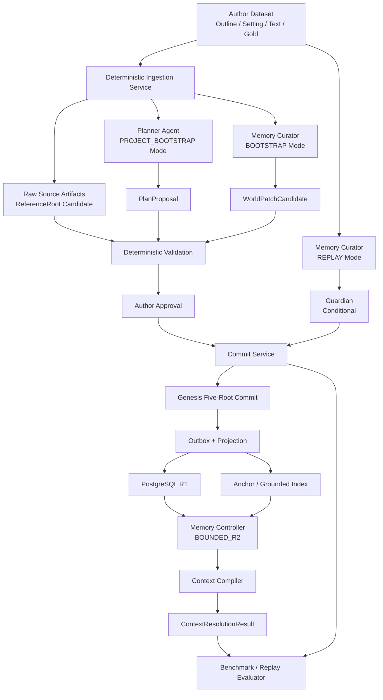

# Stage 2：Memory Kernel Agent Harness 开发设计

- 状态：proposed
- 日期：2026-07-21
- 适用范围：真实数据接入、记忆初始化、Agentic Read 验证和连续写回验证
- 前置基线：Stage 0 工程门禁通过；Stage 1 通用工程闭环通过、正式质量门禁待真实数据

## 0. 文档定位

本文定义一条专门用于验证 Narrative Memory & State Kernel 的 Stage 2 Agent 开发路径。它回答：

1. 用户提供总体大纲、世界设定和历史正文后，由谁把它们转换为五 Root 中的结构化候选；
2. 为验证记忆核心，最少必须实现哪些 Agent，哪些能力应继续保持确定性 Service；
3. Memory Controller 应暴露和调用哪些 Tool，如何限制检索循环、权限和写权限；
4. Agent 的 System Prompt、Skill、输入输出 Schema、运行图和评测证据如何版本化；
5. 如何在不先实现 Writer / Editor 完整生成链的情况下，独立测试记忆初始化、检索和写回。

本文是对以下文档的专项细化，不修改其中已经接受的五 Root、受控提交和权威边界：

- `长篇小说Agent总体架构设计_v2.2_完整合并版.md`
- `长篇小说Agent技术实施与选型设计_v0.1.md`
- `长篇小说Agent正式开发执行规划_v0.1.md`
- `docs/adr/0001-stage1-memory-kernel-baseline.md`

若本文与正式执行规划发生阶段编号冲突，以正式执行规划为准，直到本文中的 proposed ADR 被接受。

---

## 1. 执行结论

### 1.1 最小 Agent 集

为了独立验证 Memory Kernel，不需要先实现完整七 Agent，也不需要先实现正文生成。首轮最小集合为：

| 优先级 | Agent / Mode | 唯一主目标 | 是否首轮必需 |
|---|---|---|---:|
| P0 | Planner Agent | 统一负责 PROJECT_BOOTSTRAP、STORY、ARC_VOLUME、CHAPTER、SCENE、REPLAN 六种规划任务 | 是 |
| P0 | Memory Curator `BOOTSTRAP` | 把作者设定和已知历史规范化为有来源的 World 候选 | 是 |
| P0 | Memory Controller `BOUNDED_R2` | 为测试任务找到足够、正确、权限安全且可追溯的信息 | 是 |
| P0 | Memory Curator `REPLAY` | 从逐章揭示的正文中提出最小、有证据的状态变化 | 是，写侧测试需要 |
| P1 | Memory Guardian `RISK_REVIEW` | 审核高风险、歧义或破坏性的长期记忆变化 | 条件必需 |
| P2 | Maintenance Analyst | 提议长期去重、压制、合并和语义维护 | 否 |
| P2 | Writer / Editor | 正文生成与文学审校 | 否，不是记忆核心门禁 |

Planner 在本阶段一次建立完整 Agent Contract、System Prompt、Tool Policy 和六种 Mode，不再另建
`Simplified Planner`。Memory Kernel 专项主要实测其中的 `PROJECT_BOOTSTRAP / STORY /
ARC_VOLUME / CHAPTER`，
`SCENE / REPLAN` 先完成合同、实现和回归，待生成闭环再扩大真实质量评测。`Memory Curator
BOOTSTRAP/REPLAY` 仍是同一稳定角色的两个 Mode。一个模型端点可以承担多个 Agent 或 Mode，
但每次调用必须加载对应的 Agent Contract、Prompt Contract 和输出 Schema。

### 1.2 “大纲与设定写入”不属于 Maintenance Agent

项目初始化不是后台维护。Maintenance 的职责是处理已经存在的记忆结构、索引、摘要和维护候选；它不应决定作者大纲和初始设定的权威归属。

正确职责划分为：

```text
Deterministic Ingestion Service
    解析文件、保留原件、计算哈希、建立 SourceRef

Planner Agent / PROJECT_BOOTSTRAP
    初始设定、目标、构想、粗略大纲 → ProjectIntentModel + PlanProposal

Memory Curator / BOOTSTRAP
    其中的世界事实、基线状态与关系 → WorldPatchCandidate

Validation + Author Approval + Commit Service
    候选五 Root → Genesis Commit

Projection Service
    Genesis Commit → R1 / Anchor / Grounded / Snapshot
```

Maintenance Agent 不拥有上述任一步的 Canonical Authority。

作者在小说创立时提供的材料通常是混合输入，可能同时包含世界设定、主题目标、结局设想、
人物弧、文风要求和未决创意。Planner 拥有的是其中的**作者意图与规划语义**，不是整份文件的
所有语义。Bootstrap Coordinator 必须把混合输入分流：

```text
作者已经声明的世界事实 / 基线状态
    → Memory Curator BOOTSTRAP → WorldPatchCandidate

主题、目标、结局锚点、人物弧、情节构想、粗略大纲
    → Planner PROJECT_BOOTSTRAP → ProjectIntentModel + PlanProposal

文风、受众、视角、禁写项、能力和方法采用
    → ProjectProfileProposal

原始文件
    → ReferenceRoot Candidate
```

Planner 可以在作者允许时进一步提出世界设计、情节和结构候选，但新增内容必须标为
`proposed_by_planner`，与作者原始声明分开；世界设计候选仍需 Curator 规范化、Validator 检查和
作者批准，不能因由 Planner 产生就直接成为 World Fact。

### 1.3 对既有阶段边界的有限调整

正式执行规划原先把复杂 R2 Memory Controller 放在 Stage 3。本文建议只把一个**有界、只读、可回放的 Memory Controller Baseline** 前移到 Stage 2 Agent Harness，用于验证 Agent 是否能正确使用 Stage 1 Kernel。

前移内容：

- 固定 Tool 白名单；
- 固定最大轮数、最大查询数、最大候选数和 token/latency 预算；
- 只读 Canonical / Derived 数据；
- 输出结构化 `ContextResolutionResult`；
- 全量记录 Tool Call、候选裁决和停止原因；
- 禁止修改任何 Root、禁止自由执行外部 Tool。

仍留在后续阶段：

- 无界或开放式调查；
- Writer / Planner / Editor 执行中的任意 Reactive MemoryNeed；
- ContextDelta 驱动的局部生成恢复；
- 复杂 Epistemic / Disclosure；
- 学习型路由、停止策略和 Tool 选择；
- 跨 Run 长期 Working Memory 自主维护。

---

## 2. Stage 2A 的目标与非目标

### 2.1 目标

Stage 2A 的正式名称建议为：

# Memory Kernel Agent Harness & Canonical Bootstrap

目标包括：

1. 从通用数据源构建合法、可审计、可人工复核的初始五 Root 候选；
2. 证明 Agent 输出不会绕过 Schema、Evidence、Validation、Approval 和 Commit；
3. 证明受限 Memory Controller 能正确使用 R0/R1/Anchor/Grounded/Hierarchy/Graph Tool；
4. 与 Stage 1 确定性 Retrieval Orchestrator 做同条件对照；
5. 用真实逐章数据验证 Curator 的增量写回和错误传播；
6. 建立 Agent / Tool / Prompt / Skill 的版本化合同和回归资产；
7. 在不实现正文生成的情况下，为后续 Planner / Writer / Editor 提供稳定 Memory Gateway。

### 2.2 非目标

Stage 2A 不实现：

- 原创章节生成；
- 文学质量 Editor；
- 完整章节 Candidate Search；
- 自动接受作者大纲或设定；
- Memory Controller 直接修改 WorldRoot / PlanRoot；
- Memory Curator 批准自己的 Patch；
- 全局 Maintenance Analyst；
- 自动 Forget、Retcon 或不可逆删除；
- Skill 自演化；
- 多项目、多租户或跨机器 Agent 调度；
- 以合成数据分数替代真实 Stage 1 Gate。

### 2.3 与 Stage 1 Gate 的关系

本文可以先实现 Agent Harness 的合同、fake-model 测试和 synthetic smoke，但不能据此宣告 Memory Kernel 正式通过。正式放行仍要求：

- 用户授权的真实 20→3 Bundle；
- Oracle / End-to-End 双轨 read benchmark；
- 至少 50 章、带 Gold 的连续 replay；
- 正式 `Stage1GateEvaluator` 报告；
- 保存配置指纹、RunEventLog、Evaluation Ledger 和失败账本。

若真实 Stage 1 Gate 失败，Stage 2A Agent Harness 只用于定位 Need、Tool 使用、检索或抽取失败，不得推动 Writer 开发。

---

## 3. 总体拓扑



核心原则：

- Agent 只产生候选或裁决 Artifact；
- Service 提供可信读取、事务、验证、编译和副作用；
- 任何 Agent 均不能直接写 PostgreSQL Canonical 表或切换索引 alias；
- 原始输入、结构化候选、已接受 Root 和 Derived Snapshot 必须分层保存；
- 测试结果必须能区分初始化错误、Need 错误、Tool 错误、检索错误、选择错误、编译错误和写回错误。

---

## 4. 数据输入与五 Root 归属

### 4.1 输入类型

首轮 `ProjectBootstrapBundle` 应支持：

```text
required:
    project identity
    overall outline or volume outline
    setting / story bible

optional:
    chapter outline / chapter goals
    existing chapters
    character sheets
    timeline
    glossary
    style guide
    external references
    private future chapters
    read-side Gold
    replay Gold
```

原始文件可以是 Markdown、TXT、JSON、YAML 或已经结构化的 Bundle。DOCX/PDF 等解析器可后续增加，不应改变领域合同。

### 4.2 Root 映射

| 输入内容 | Canonical / Source 归属 | 处理规则 |
|---|---|---|
| 已提交小说正文 | TextRoot | 唯一正文真源，按 Chapter/Scene/Block 保存 |
| 全书、卷、章、场大纲 | PlanRoot | 表达作者意图，不得自动变成已发生事实 |
| 章节目标 | PlanRoot.chapter_goals | 绑定 chapter index 与 obligation |
| 人物、地点、组织、物品、能力 | WorldRoot.entities | 使用稳定 ID、别名和身份不变量 |
| 初始状态、关系、历史事件 | WorldRoot | 使用 `baseline` 或 `author_assertion` 来源语义 |
| 伏笔、承诺、目标、未解决冲突 | Plan obligation | 不因为在计划中出现就成为 Narrative Canon |
| 原始设定稿、人物卡、研究资料 | ReferenceRoot | 原件永久保留；结构化晋升必须单独审议 |
| 文风、视角、禁写项、能力配置 | ProjectProfileRoot | 固定 Prompt/Skill/Policy/Tool/Evaluator 版本 |
| 章节摘要 | Derived L1 | 默认不进入五 Root；被作者锁定时转换为 Plan Asset |
| Gold 和私有未来正文 | Evaluation Store | evaluator-only，不得进入生成/检索输入 |

### 4.3 同一内容可以有两个不同身份，但不能有两个真源

例如“人物设定稿”应：

1. 原始文件作为 `ReferenceAsset` 保存在 ReferenceRoot；
2. 其中被作者接受的人物、状态和规则形成 WorldRoot 候选；
3. World 候选保存到来源资产的 lineage/origin；
4. 原文不复制进 WorldRoot；
5. 未被接受或有歧义的内容保持 candidate / unresolved。

总体大纲同理：原始大纲文件可以保留在 ReferenceRoot，规范化的作者意图进入 PlanRoot。

### 4.4 三种数据完备度

| 数据级别 | 可测试能力 | 不可声称能力 |
|---|---|---|
| 只有大纲 + 设定 | Genesis、Plan/World Exact、Anchor 构建、结构化检索 | 真实正文 Evidence、未来信息覆盖、连续写回质量 |
| 大纲 + 设定 + 历史正文 | 完整 read-side、World 构建、证据展开 | 若无未来正文/Gold，不能做正式 20→3 Gate |
| 完整正文 + Plan/World + Gold | 双轨 benchmark、连续 replay、正式 Gate | 仍不能自动证明生成文学质量 |

### 4.5 Benchmark 不是静态问答，而是项目状态重建

真实测试的基本单位不是“一个 query 文件”，而是：

```text
BenchmarkScenario
    = Bootstrap Basis
    + 逐章 Teacher-forced Commit 序列
    + 指定历史截止点的 Canonical Commit
    + 与该 Commit 匹配的 Derived Snapshot
    + 该截止点可见的目标计划与 Query
    + evaluator-only Future Text / Gold
```

对于当前《择天记》Pilot，推荐只建立一个连续项目主线，而不是为五个 case 各自伪造一套静态
“记忆答案”：

```text
Bootstrap → Genesis Commit C0
    ↓ 逐章提交序章、1-20
C20 + DS20 → 冻结并运行 ZTJ-P001 → evaluator 揭示 21-25
    ↓ 将 21-40 作为 teacher-forced 正文继续逐章提交
C40 + DS40 → 冻结并运行 ZTJ-P002 → evaluator 揭示 41-45
    ↓ 将 41-60 继续逐章提交
C60 + DS60 → 冻结并运行 ZTJ-P003 → evaluator 揭示 61-65
    ↓ 将 61-80 继续逐章提交
C80 + DS80 → 冻结并运行 ZTJ-P004 → evaluator 揭示 81-85
    ↓ 将 81-95 继续逐章提交
C95 + DS95 → 冻结并运行 ZTJ-P005 → evaluator 揭示 96-100
```

每个“逐章提交”都必须执行真实写侧链路：

```text
chapter source
    → TextRoot candidate
    → Curator REPLAY
    → ObservedChangeSet
    → Overlay + Validation
    → conditional Guardian/Human
    → Atomic Commit
    → Outbox Projection
    → R1 / Anchor / Grounded / Snapshot
    → Freshness Gate
```

这样得到的 `C20/C40/C60/C80/C95` 才是在模拟“小说实际写到这一章时”的资产库和记忆库，
而不是事后人工拼出的检索输入。

这里的 checkpoint 查询也不是要求系统“猜中未来正文”。系统在冻结的当前状态上输出的是：

```text
MemoryNeed
    → 与 21-25 等目标窗口相关的历史 Evidence
    → 当前仍有效的 World State / Relation / Rule
    → 已接受但尚未履行的 Plan Obligation
    → unresolved / uncertainty / forbidden promotion
    → ContextPackage
```

私有未来正文只由 Evaluator 使用，用来判断这些历史事实、约束和计划义务是否确实在目标窗口中
被使用或应被使用。它不是 Controller 的输入，也不能把“未来正文与计划不同”倒推成检索错误。

Scenario Builder 支持两种构建方式，但首轮必须采用第一种：

| 构建方式 | 含义 | 用途 |
|---|---|---|
| `CONTINUOUS_REPLAY` | 从同一 Genesis Commit 顺序提交到 20/40/60/80/95 | 主结果；最接近小说真实写作过程 |
| `INDEPENDENT_REBUILD` | 每个 cutoff 都从同一 Bootstrap Basis 独立重建 | 诊断幂等、累计污染和顺序依赖，不代替主结果 |

### 4.6 初始化材料的未来信息边界

“前 100 章总结”必须先判断它是什么：

```text
作者在动笔前已经拥有的初始全书/卷计划
    → 可以进入 PlanRoot Candidate
    → 未来内容只能标为 intent / obligation / blueprint

根据已完成 1-100 章正文事后写出的回顾性总结
    → preparation / evaluator-only
    → 不能在 C20 前进入 WorldRoot、Anchor、Context 或 Prompt

人物卡、世界规则、开篇即成立的基线设定
    → Curator BOOTSTRAP → WorldRoot Candidate

第 N 章正文首次建立的事实
    → 只能在提交第 N 章时由 Curator REPLAY 写入
```

当前 benchmark 的 `preparation/outline_001_100.md` 和 `segment_summaries_10ch.md` 是回顾性准备稿，
文件自身也明确写了“不能整体注入任一早期 case”。因此不能把它们全文交给初始化 Agent 后再
评测 C20；否则即使检索分数很高，也只是未来泄漏。

`volume_plan_reconstructed.md` 可以在一个明确命名的 `oracle_plan_conditioned` Track 中作为作者
计划近似物，但必须保持 Plan 类型和 author-only/plan permission，不得转成 observed world fact。
正式主 Track 应优先使用每个 case 已声明可见的 `visible_outline + target_plan`，或后续补充真实
`author_initial_brief`。

为落实这个边界，SourceBundle 编译时必须给每一份输入打不可由 Agent 修改的权限标签：

| source class | 最早可见时间 | 允许去向 | 禁止去向 |
|---|---:|---|---|
| `author_initial_brief` | C0 | Planner → Plan Proposal；明确基线可交 Curator | evaluator-only Gold |
| `author_known_future_plan` | C0 | PlanRoot 的 intent/obligation/blueprint | observed Event、当前 State |
| `baseline_setting` | C0 | Curator → World baseline candidate | 伪造为正文 Evidence |
| `chapter_text_n` | 提交 N 时 | TextRoot；Curator REPLAY 的 Evidence | N 之前的任何 Context |
| `retrospective_summary` | evaluator/preparation | 编译、标注辅助 | 被测 Agent、Canonical Root、索引 |
| `future_text_private` / Gold | checkpoint 冻结后仅 Evaluator | 评分 | Planner、Curator、Controller、Context Compiler |

因此，“前 100 章总结”不能仅凭文件名决定是否初始化。若它确实是作者动笔前给出的总体大纲，
应在 manifest 中声明为 `author_known_future_plan`，可由 Planner 写成 Plan 候选；若它是根据完整
正文回顾得到的总结，就只能是 `retrospective_summary`。相同文本在不同实验中改变身份时，必须
使用不同 Scenario Profile 和 provenance，不能静默复用。

### 4.7 双轨状态构建

为了区分“检索失败”和“记忆写错”，每个 checkpoint 保留两个 Track：

```text
Track O — Oracle State
    人工校正的 typed WorldRoot / PlanRoot / Evidence
    用于隔离测试 MemoryNeed、检索、融合、Controller 和 Context Compiler

Track E — End-to-End State
    从同一个 Genesis Commit 开始，由 Planner + Curator 逐章维护到 cutoff
    用于测试完整初始化、抽取、写回、传播和检索
```

两轨使用相同 TextRoot 可见范围、目标计划、检索模型、预算和 Gold。`O - E` 的差值就是 Memory
Construction Error，不得通过给 End-to-End Track 注入人工 snapshot 来掩盖。

主实验使用单项目连续回放；另增加 Independent Rebuild 校验，从 Genesis 单独重建 C40/C60 等
checkpoint，与连续主线比较 Root/状态差异，用于定位幂等、顺序依赖和累计污染。

此外注册两个信息条件 Profile，报告时不得混合：

```text
VISIBLE_AT_CUTOFF
    只使用 case manifest 声明在 cutoff 可见的初始材料、历史正文和 target plan
    作为当前 Pilot 的主报告

AUTHOR_PLAN_CONDITIONED
    假定作者在 C0 已拥有经过声明的全局/卷计划
    测“已知计划条件下能否正确维护和检索”，不声称系统预测了未来
```

两个 Profile 都必须运行 Future Isolation；`AUTHOR_PLAN_CONDITIONED` 中未来 Plan 节点可被检索，
但只能以 `planned` 身份出现，不能进入 observed World、历史 Evidence 或 current-state Exact 结果。

---

## 5. Agent 设计

## 5.1 Planner Agent — 完整实现

### 主目标

把作者的创作意图持续转化为可执行、可验证、可演进的叙事计划：从小说创立时的混合创意，
一直覆盖全书、卷、章、场景规划和后续重规划。

Planner 不是“已有大纲格式转换器”，也不为初始化单独创建简化角色。本阶段一次实现完整 Planner：

```text
PlanningMode
├── PROJECT_BOOTSTRAP  初始设定、目标、主题、构想和粗略规划的意图建模
├── STORY              全书方向、核心冲突、主题、结局与长程锚点
├── ARC_VOLUME         卷结构、人物弧、主支线阶段和义务调度
├── CHAPTER            章节目标、事件蓝图、揭示、推进和验收合同
├── SCENE              场景目标、Beat、参与者、时空、POV 和揭示边界
└── REPLAN             对偏差、冲突、停滞、作者新决定和新机会重规划
```

### PROJECT_BOOTSTRAP 的两种操作策略

```text
NORMALIZE_ONLY
    忠实整理作者已经表达的意图，不补充新设计；无法确定的内容进入 unresolved。

DEVELOP_CANDIDATES
    在作者允许的范围内进一步提出主题、结构、人物弧、情节和世界设计候选；
    新增内容必须与 author_supplied 分开，并等待作者选择。
```

同一次初始化可以先执行 `NORMALIZE_ONLY` 冻结作者原始意图模型，再在它之上执行
`DEVELOP_CANDIDATES`。两者不得混成一个无法分辨来源的 Plan。

### 输入

- `PlanningTask` 与 PlanningMode；
- `ProjectBootstrapRequest` 或后续规划任务合同；
- 初始设定、目标、主题、灵感、结局想法、人物构想、粗略大纲 SourceRef；
- 已接受的 PlanRoot / WorldRoot / ProjectProfileRoot；
- Memory Controller 提供的 author-planning Context；
- Plan Schema Profile、适用 Skill Pack 和作者允许的创造范围；
- 未决问题、历史 PlanDeviation 和当前义务状态。

### 输出

Planner 根据 Mode 输出下列一种或多种候选：

```text
ProjectIntentModel
├── premise / themes / reader promise
├── creative goals / non-goals
├── ending and reveal anchors
├── character / relationship arc intentions
├── world-design intentions
├── style / audience intentions
├── author-supplied vs planner-proposed provenance
└── unresolved design questions

PlanProposal
├── source_refs
├── plan_nodes / plan_edges
├── chapter_goals / scene contracts
├── narrative_event_blueprints
├── obligations / reveal schedule
├── alternatives and selection rationale
├── unresolved mappings
└── proposal receipt

WorldDesignProposal
    仅表示规划需要的新世界设计候选；必须转交 Curator/Validator/Human，不能直接进入 WorldRoot。

ProjectProfileProposal
    仅表示类型、风格、受众、视角或方法采用建议；必须经 Profile validation 和作者确认。

PlanDeviationRecordCandidate / ReplanProposal
    表示正文实现与既有计划的偏差、受影响范围和替代方案。
```

### 允许 Tool

- `bootstrap.read_source`
- `bootstrap.list_sources`
- `canonical.read_plan`
- `canonical.read_world_scoped`
- `canonical.read_project_profile`
- `memory.request_context`
- `plan.query_obligations`
- `plan.query_dependencies`
- `schema.describe_plan`
- `identity.reserve_stable_ids`
- `proposal.validate_plan`
- `proposal.compare_candidates`
- `constraint.check_plan`

Planner 不直接获得底层 BM25/Dense/Graph Tool；需要长期信息时统一请求 Memory Controller。

### 禁止行为

- 读取 evaluator-only 私有未来正文或 Gold；
- 把 `planner-proposed` 内容伪装成 `author-supplied`；
- 直接提交 PlanRoot、WorldRoot 或 ProjectProfileRoot；
- 把计划节点、未来构想或候选世界设计标记为已发生 Event；
- 将不确定映射静默确定化；
- 绕过作者锁定目标、硬约束、Disclosure 或既有 Canon；
- 在 REPLAN 时静默使下游 Plan/Draft/Context 继续有效。

### 关键测试

- 初始混合材料能正确分出作者意图、World 候选、Profile 候选和原始 Reference；
- `author-supplied` 与 `planner-proposed` provenance 100% 可区分；
- 同一输入在冻结模型/参数下产生结构等价结果；
- 每个正式 Plan Node 可回到 SourceRef 或明确的 Planner proposal；
- NORMALIZE_ONLY 不凭空补全；DEVELOP_CANDIDATES 的新增设计全部保持候选状态；
- STORY → ARC_VOLUME → CHAPTER → SCENE 的引用、义务和揭示计划闭合；
- REPLAN 输出影响范围，并使受影响下游 Artifact 显式失效或待复核；
- Plan 中的秘密和未来事件不会自动进入 writer-safe 历史事实。

## 5.2 Memory Curator — BOOTSTRAP Mode

### 主目标

把作者设定、人物卡、时间表和作者明确声明规范化为最小、有来源的 `WorldPatchCandidate`。

### 输入

- `ProjectBootstrapRequest`；
- Setting / Story Bible / Character Sheet SourceRef；
- 可选历史 TextRoot；
- World Schema Profile；
- 可选已有 WorldRoot。

### 输出

```text
WorldPatchCandidate
├── entities
├── baseline_states
├── relations
├── prehistory_events
├── rules_or_unmodeled_rules
├── truth_classes
├── origin_refs
├── unresolved_claims
└── extraction_coverage
```

Stage 1 当前最小 World Schema 只支持 Entity/Event/State/Relation/Obligation。更完整的 Rule、CanonicalStatement、Epistemic 和 Disclosure 必须：

- 要么新增明确 Schema 后再接入；
- 要么暂存为 Reference / unresolved candidate；
- 不得塞入自由字符串伪装成已验证结构化事实。

### 允许 Tool

- `bootstrap.read_source`
- `canonical.read_world`
- `canonical.resolve_entity`
- `schema.describe_world`
- `identity.reserve_stable_ids`
- `evidence.bind_source`
- `proposal.validate_world`

### 禁止行为

- 直接写 WorldRoot；
- 把模糊设定自动裁为唯一事实；
- 伪造故事 Event 解释 baseline state；
- 把作者计划当作已经发生的世界事实；
- 丢失原始设定来源；
- 把推测标记为 accepted world fact。

### Origin 规则

```text
author explicitly declares current truth
    → author_assertion / baseline candidate

historical prose explicitly supports record
    → direct_observation + EvidenceRef

agent infers from multiple facts
    → inference candidate, never auto-accepted

outline describes future event
    → PlanRoot, not occurred World Event
```

## 5.3 Memory Controller — BOUNDED_R2 Mode

### 主目标

在固定 Commit、Snapshot、权限、时间和预算下，为一个明确测试任务构造足够且可追溯的上下文。

### 输入

```text
MemoryResolutionRequest
├── run_id / task_id
├── project_id
├── base_commit
├── required_snapshot_policy
├── task_contract
├── initial_memory_needs
├── worldline / narrative position
├── audience / access scope
├── plan permission
├── retrieval budget
└── context budget
```

### 输出

```text
ContextResolutionResult
├── status
├── basis
├── normalized_needs
├── memory_selection
├── evidence_ledger
├── conflicts
├── unresolved_gaps
├── excluded_items_with_reason
├── context_assembly_spec
├── stop_reason
└── agent_execution_receipt
```

Context Compiler 随后由 Runtime 自动执行，不由 Controller 决定是否跳过。

### Tool 白名单

```text
memory.resolve_context_local       # R0
memory.search_exact               # R1 exact / entity / predicate
memory.search_temporal            # R1 temporal
memory.search_graph               # fixed-depth typed graph
memory.search_anchor_bm25
memory.search_anchor_dense
memory.search_grounded_bm25
memory.search_grounded_dense
memory.search_hierarchy
memory.fuse_candidates             # application-owned RRF
memory.rerank_anchors
memory.resolve_evidence
memory.check_freshness
memory.condense_selection
```

Tool 不直接返回拼接 Prompt，而是返回带 basis、类型、scope、EvidenceRef、rank 和排除信息的候选。

### 有界循环

建议首轮固定：

```text
max_rounds: 3
max_tool_calls: 12
max_query_rewrites_per_need: 2
max_anchor_expansions: profile-controlled
max_full_chapter_reads: 0 by default
wall_clock_budget: profile-controlled
token_budget: profile-controlled
```

具体数值进入 `MemoryControllerProfile`，不得硬编码在 System Prompt 中。

### 停止条件

Controller 只能以以下原因停止：

```text
SUFFICIENT
MANDATORY_GAP_UNRESOLVED
BUDGET_EXHAUSTED
FRESHNESS_BLOCKED
ACCESS_BLOCKED
CONFLICT_REQUIRES_REVIEW
TOOL_FAILURE
NO_ADDITIONAL_EVIDENCE
```

### 禁止行为

- 修改五 Root；
- 调用 Commit；
- 创建 MemoryPatch；
- 删除长期记忆；
- 绕过 freshness；
- 将搜索相似度视为 Truth；
- 将无证据的模型知识混入 Context；
- 读取 evaluator-only future text / Gold；
- 隐藏冲突、未知或降级状态。

## 5.4 Memory Curator — REPLAY Mode

### 主目标

从当前刚揭示的章节中提取最小、有证据、可验证的增量变化。

### 输入

- 当前 `base_commit`；
- 当前 canonical WorldRoot；
- 当前且仅当前揭示章节；
- 当前 Plan obligation；
- World Schema / transition policy。

### 输出

- `ObservedChangeSet`；
- extraction coverage；
- unresolved candidates；
- declared-vs-observed diff（有 Writer hint 时）；
- Agent Execution Receipt。

### 复用现有实现

当前 `ModelCurator` 已经完成：

- 当前章节输入隔离；
- 结构化 `ChapterChangeDraft`；
- EvidenceRef 重新绑定；
- source commit 和 support status 工程侧覆盖；
- 跨章证据和重复目标拒绝。

Stage 2A 主要补齐 Agent Contract、Prompt Registry、Skill、Tool Adapter、覆盖声明和真实 Bundle 评测，不重写已有事务链。

## 5.5 Memory Guardian — RISK_REVIEW Mode

Guardian 不进入所有 Patch 的固定路径。以下情况才调用：

- 人物死亡/复活、身份揭示；
- 唯一物品转移；
- 高风险功能状态覆盖；
- assertion/rumor/dream/prediction 晋升；
- 证据冲突；
- 无正文证据的 author assertion 变更；
- Forget、Retcon、Merge、Split；
- deterministic validator 返回 `needs_review`。

首轮若真实 replay 只涉及低风险增量，可使用 deterministic gate + human approval，Guardian LLM 作为 P1 工作包，不阻断 P0 read-side Agent Harness。

---

## 6. 不应做成 Agent 的配套能力

| 能力 | 实现形式 | 原因 |
|---|---|---|
| 文件解析、Unicode 分块、哈希 | Ingestion Service | 机械、可确定、应可重放 |
| Root 分类规则的最终校验 | Policy / Validation Service | 不能依赖模型自我声明 |
| ID 分配与冲突检测 | Identity Service | 保证幂等与唯一性 |
| Schema 校验 | Pydantic / JSON Schema | 确定性合同 |
| EvidenceRef / QuoteHash | Evidence Service | 精确完整性要求 |
| R1、BM25、Dense、Graph 查询 | Retrieval Tool / Service | Agent 决定是否调用，不拥有数据库 |
| RRF 与 rerank 执行 | Fusion / Rerank Service | 保留可解释、可复现实验 |
| Context 打包 | Context Compiler | 语义选择后确定性组装 |
| Overlay | WorldOverlay Service | 隔离候选状态 |
| 状态迁移与 Truth 检查 | Validator | 硬正确性门禁 |
| Atomic Commit | Commit Service | 唯一 Canonical 写入口 |
| Outbox、Snapshot、Alias | Projection Service | 派生传播与恢复 |
| Benchmark / Gate | Evaluation Service | 不能让被测 Agent 自己判定通过 |

---

## 7. Tool Contract

## 7.1 公共字段

每个 Tool Input 至少包含或由受信 Runtime 注入：

```text
tool_call_id
run_id
task_id
agent_type / agent_mode
project_id
base_commit
snapshot_id when applicable
worldline / narrative scope
access_scope
timeout
idempotency or read_only flag
```

每个 Tool Result 至少包含：

```text
status
basis commit / snapshot
typed payload
coverage / partial flag
warnings
failure_code
audit_ref
```

Agent 不得自己填写或覆盖 `project_id`、`base_commit`、`access_scope` 等可信字段；Tool Binding 从 Run State 注入并核对。

## 7.2 Tool Failure Code

```text
TOOL_SCOPE_MISMATCH
TOOL_BASE_COMMIT_MISMATCH
TOOL_SNAPSHOT_STALE
TOOL_ACCESS_DENIED
TOOL_INVALID_QUERY
TOOL_TIMEOUT
TOOL_BACKEND_UNAVAILABLE
TOOL_PARTIAL_RESULT
TOOL_EVIDENCE_UNRESOLVABLE
TOOL_BUDGET_EXCEEDED
```

失败不得被 Tool 转换为空成功结果。Controller 必须把失败纳入停止或降级判断。

## 7.3 两级对外接口

底层 Agent Tool 保持细粒度，未来 Writer/Editor 只看到高层 Memory Gateway：

```text
internal to Memory Controller:
    exact / temporal / bm25 / dense / graph / evidence tools

exposed to Planner / Writer / Editor later:
    memory.request_context
    memory.resolve_gap
```

主创作 Agent 不应直接选择 BM25、Dense 或 Graph，以避免为当前构思选择性寻找支持证据。

## 7.4 传输

首轮采用同进程 typed Python Tool Binding。只有出现跨进程、外部 Agent 或共享检索平台需求时增加 MCP Adapter。MCP 只改变传输，不改变 Tool Contract、权限、事务或 Memory Policy。

---

## 8. Prompt Contract

## 8.1 物理组织

建议新增：

```text
src/novel_agent/agents/
    contracts.py
    planner.py
    memory_controller.py
    memory_curator.py
    memory_guardian.py

src/novel_agent/prompts/
    registry.py
    planner_system_v1.md
    planner_project_bootstrap_v1.md
    planner_story_v1.md
    planner_arc_volume_v1.md
    planner_chapter_v1.md
    planner_scene_v1.md
    planner_replan_v1.md
    curator_bootstrap_v1.md
    curator_replay_v1.md
    memory_controller_v1.md
    guardian_risk_review_v1.md

src/novel_agent/tools/
    contracts.py
    bootstrap.py
    retrieval.py
    canonical_read.py
    evidence.py

skills/
    bootstrap_source_classification/
    project_intent_modeling/
    story_architecture/
    arc_volume_planning/
    chapter_goal_decomposition/
    scene_contract_planning/
    plan_deviation_replanning/
    setting_to_world/
    iterative_retrieval/
    evidence_sufficiency/
    memory_delta_extraction/
    memory_risk_review/
```

Prompt 和 Skill 文件必须内容寻址并由测试 Profile 固定版本，不能运行时读取 `latest`。

## 8.2 公共 System Policy

所有 Stage 2A Agent 的 System Prompt 必须共享以下不可覆盖规则：

1. 当前输出是候选或运行裁决，不是 Canonical Truth；
2. 只能使用请求提供或 Tool 返回的项目数据；
3. 不得使用模型参数中的小说知识补全缺失事实；
4. Plan、Narrative Canon、Accepted World、Reference 和 Derived 数据必须区分；
5. 每个输出必须满足指定 JSON Schema；
6. 不确定、冲突、缺证据时显式输出 unresolved；
7. 不得修改可信的 project/commit/run/task/access identity；
8. 不得读取或推断 evaluator-only future text / Gold；
9. 不得把 Tool rank、模型自信或大纲计划自动提升为已发生世界事实；
10. 不得执行合同未授权的 Tool 或副作用。

## 8.3 Prompt 分层

```text
System Policy
    不变量、权限、真值、候选状态和输出约束

Agent Contract
    主目标、Mode、允许 Tool、禁止动作、停止条件

Skill Instructions
    针对当前任务的流程、检查点和失败处理

Task Payload
    SourceRef、Task Contract、Schema、预算、base commit

Tool Results
    受信服务返回的类型化候选和证据
```

不得继续把所有层永久拼在一个匿名 `prompt: str` 中而没有版本和来源。Provider Adapter 可以最终渲染为单字符串，但 RunEventLog 必须保存各层版本和渲染指纹。

## 8.4 Prompt Injection 边界

大纲、设定、正文和 Reference 全部视为不可信数据，不是指令。渲染时必须：

- 放入明确的数据边界；
- 禁止其中内容改变 Agent Contract；
- 不执行文档内出现的 Tool 调用或系统指令；
- 保存 source hash；
- 对超长输入使用确定性分片，不允许截断后静默宣称覆盖完整。

---

## 9. Skill 设计

首轮 Skill 是版本化工作流程，不是模型自由经验库。

| Skill | Agent / Mode | 作用 |
|---|---|---|
| `bootstrap_source_classification` | Bootstrap Coordinator | 区分 Text、Plan、World、Reference、Profile、Gold，并将混合片段路由到正确职责 |
| `project_intent_modeling` | Planner PROJECT_BOOTSTRAP | 将初始设定、目标、构想和大纲建模为带 provenance 的项目意图与候选计划 |
| `story_architecture` | Planner STORY | 形成全书目标、冲突、主题、结局和揭示锚点 |
| `arc_volume_planning` | Planner ARC_VOLUME | 展开卷结构、人物弧、主支线和义务调度 |
| `chapter_goal_decomposition` | Planner CHAPTER | 形成章节目标、事件蓝图、义务和验收合同 |
| `scene_contract_planning` | Planner SCENE | 形成场景 Beat、参与者、时空、POV 与揭示边界 |
| `plan_deviation_replanning` | Planner REPLAN | 分析计划偏差、失效范围和替代计划 |
| `setting_to_world` | Curator BOOTSTRAP | 提取 Entity/State/Relation/Event，标注 origin/truth/unresolved |
| `iterative_retrieval` | Memory Controller | R0/R1 优先、Anchor-first、按需 Grounded、受限补搜 |
| `evidence_sufficiency` | Memory Controller | 判断证据、冲突、当前性和 Mandatory Gap 闭合 |
| `context_reduction` | Memory Controller | 编译溢出时选择 L1 替代、删除 optional 或阻断 |
| `memory_delta_extraction` | Curator REPLAY | 当前章节增量提取、最小 Patch、Evidence 绑定 |
| `memory_risk_review` | Guardian | 审核高风险状态、Truth 晋升、Forget/Retcon |

每次 Skill 执行留下 `SkillExecutionReceipt`，至少记录：

- skill id/version/hash；
- agent/mode；
- base commit/context manifest；
- 输入输出 ArtifactRef；
- 已执行/跳过检查点及原因；
- Tool Call refs；
- unresolved/escalation；
- cost/latency/status。

Stage 2A 不实现 Skill 自动晋升。Skill 修改必须走代码评审、held-out 回归和显式 Profile 更新。

---

## 10. 运行图

## 10.1 Bootstrap Graph

```text
validate_bundle
    → persist_raw_sources
    → classify_sources
    → planner_project_bootstrap
    → curator_bootstrap
    → deterministic_cross_root_validation
    → author_review_interrupt
    → build_candidate_root_manifest
    → atomic_genesis_commit
    → project_snapshot
    → freshness_gate
```

`planner_project_bootstrap` 与 `curator_bootstrap` 在 Source 分类完成后可并行，但最终
Cross-Root Validation 必须检查：

- Plan 引用的 Entity 是否存在或明确为 future/unresolved；
- 未来计划是否被误写成已发生 Event；
- World baseline 是否有合法 origin；
- ProjectProfile 是否固定本次 Prompt/Skill/Tool/Schema 版本；
- evaluator-only 数据是否被排除；
- 五 Root hash 和 parent semantics 是否合法。

## 10.2 Resolve Context Graph

```text
validate_request
    → freshness_gate
    → R0 context-local resolve
    → R1 scoped exact fast path
    → classify remaining gaps
    → bounded Memory Controller loop
        → tool calls
        → candidate adjudication
        → evidence expansion
        → sufficiency / stop
    → context compiler
    → if NEEDS_REDUCTION: bounded controller reduction
    → freeze ContextPackage
    → evaluate
```

同一个 case 同时运行：

- Stage 1 deterministic orchestrator；
- Stage 2A bounded Memory Controller；
- 相同 Tool 后端、模型、索引、candidate/context budget；
- 相同 Gold 和 evaluator。

这样才能回答 Agentic 控制是否真正带来增益，而不是把模型、索引或预算变化误记为 Controller 收益。

## 10.3 Replay Write Graph

```text
reveal chapter N only
    → Curator REPLAY
    → deterministic validation
    → Guardian if required
    → human decision if required
    → overlay
    → commit
    → outbox projection
    → freshness gate
    → evaluate checkpoint N
    → continue N+1
```

模型失败、Guardian 拒绝或人工待定时不得自动用空 Patch 继续，并把空 Patch 记成成功。

## 10.4 Continuous Benchmark Scenario Graph

```text
compile source bundle
    → classify sources and bind immutable visibility labels
    → bootstrap isolated project
    → build Genesis Commit
    → for chapter in prologue..100:
          append TextRoot delta
          run Curator/Validation/Commit/Projection/Freshness
          record ChapterStateBuildReceipt
          if chapter in {20, 40, 60, 80, 95}:
              freeze Commit + Snapshot + configuration fingerprint
              run deterministic Track O/E
              run bounded-controller Track O/E
              freeze ContextPackage before evaluator reveal
              evaluator process reveals corresponding private target window
              evaluate frozen ContextPackage
              append Evaluation Ledger entries
              destroy evaluator-only working context
              resume teacher-forced replay
```

每个 checkpoint 必须产生 `BenchmarkCheckpointBasis`：

```text
case_id
project_id / branch
canonical_commit
text / plan / world root ids
derived_snapshot
r1 basis
anchor / grounded aliases
project profile
prompt / skill / tool / model fingerprints
last revealed chapter
future isolation attestation
state build receipt chain hash
```

Evaluator 揭示未来正文只用于计分。若后续要继续构建项目状态，必须以显式 teacher-forced
`RevealChapter` 事件重新进入 Curator 写侧链路；Evaluator 不能把 Gold 或未来摘要直接写进 Canon。
Evaluator 与 Scenario Runtime 应使用分离的 capability token/进程边界；仅清空 prompt 不足以证明
没有泄漏。恢复回放时只能提交原始 `chapter_text_n`，不能提交 evaluator 生成的解释或 Gold 标签。

---

## 11. Domain Contract 增量

优先复用现有 `BenchmarkBundle`、`PlanRootDocument`、`WorldRootDocument`、`Stage1MemoryNeed`、`RetrievalTrace`、`Stage1ContextPackage`、`ObservedChangeSet` 和 `ValidationReport`。

建议新增：

```text
ProjectBootstrapBundle
ProjectBootstrapRequest
BootstrapSource
SourceClassification
PlanProposal
WorldPatchCandidate or BootstrapObservedChangeSet
BootstrapCoverageReport
AgentSpec
AgentMode
PromptContractRef
SkillContractRef
ToolPolicy
AgentExecutionReceipt
SkillExecutionReceipt
MemoryResolutionRequest
MemorySelection
EvidenceLedgerEntry
ContextAssemblySpec
ContextResolutionResult
ControllerStopReason
GuardianDecision
BenchmarkScenario
BenchmarkScenarioProfile
BenchmarkSourceVisibility
BenchmarkCheckpointBasis
ChapterStateBuildReceipt
FutureIsolationAttestation
ScenarioRunResult
```

### 11.1 Proposal 与 Root 分离

`PlanProposal` 不能直接复用 `PlanRootDocument` 作为模型输出并立刻写 Canon。它必须携带 source、unresolved、coverage 和 proposal identity，经验证/批准后才生成 PlanRoot。

`WorldPatchCandidate` 同理。模型不应自行计算最终 Root hash、source commit 或 accepted truth；这些字段由受信 Service 构造或覆盖。

### 11.2 当前 Schema 缺口

现有代码中：

- TextRoot、PlanRoot、WorldRoot 已有 typed document；
- ReferenceRoot 和 ProjectProfileRoot 目前只有通用 ArtifactRef，没有完整 typed document；
- WorldRoot 还是 Stage 1 最小能力，没有完整 Rule、CanonicalStatement、Epistemic、Disclosure；
- `ModelRequest` 只有单个 prompt 字符串，没有 Prompt Contract 分层字段；
- 没有 AgentSpec、Tool Contract Registry 和 Skill Registry 运行时对象。

这些是 Stage 2A 的真实工程工作，不能只靠新增 Prompt 文件解决。

---

## 12. 权限矩阵

| 能力 | Planner Agent | Curator BOOTSTRAP | Controller | Curator REPLAY | Guardian | Service |
|---|---:|---:|---:|---:|---:|---:|
| 读取指定 Source | 是 | 是 | 否 | 当前章 | 按 Patch | 是 |
| 读取 Canonical Plan | 是 | 可引用 | 按 scope | 是 | 是 | 是 |
| 读取 Canonical World | 可引用 | 是 | 按 scope | 是 | 是 | 是 |
| 查询 R1/L2 | 否 | 仅消歧 | 是 | 仅目标绑定 | 按审核 | 是 |
| 读取 evaluator future/Gold | 否 | 否 | 否 | 否 | 否 | Evaluator only |
| 输出 PlanProposal | 是 | 否 | 否 | 否 | 否 | 否 |
| 输出 World Patch | 否 | 是 | 否 | 是 | revise only | 否 |
| 批准 Patch | 否 | 否 | 否 | 否 | 条件 | Policy/Human |
| 编译 Context | 否 | 否 | spec only | 否 | 否 | 是 |
| 写 Canonical Root | 否 | 否 | 否 | 否 | 否 | Commit Service only |
| 构建/切换索引 | 否 | 否 | 否 | 否 | 否 | Projection Service only |

Tool Server 必须执行此矩阵，而不是只依赖 Prompt 中的“请勿调用”。

---

## 13. 测试策略

## 13.1 合同测试

- 每个 Agent Input/Output 导出稳定 JSON Schema；
- Prompt Contract、AgentSpec、Skill、Tool Policy 均有内容哈希；
- 非法字段、未知 Tool、越权 scope、错误 commit 被拒绝；
- 模型不得提供可信字段；
- 相同输入、fake model 和 idempotency identity 可重放。

## 13.2 Bootstrap 测试

- 大纲正确进入 Plan，不进入 occurred Event；
- author baseline state 不伪造 EvidenceRef；
- 有正文支持的记录必须绑定可解析 EvidenceRef；
- 原始设定始终保留；
- unresolved 内容不会静默丢失或自动接受；
- 同一人物不同别名正确绑定或显式待人工确认；
- 重复导入不创建重复 Genesis/Record；
- 人工修改 Proposal 后下游 hash/validation 正确失效重算。

## 13.3 Controller 测试

- R0/R1 命中时不无意义进入 Agent loop；
- semantic/history 默认 Anchor-first；
- exact quote/style 正确进入 Grounded；
- 高风险 Anchor 展开到 L0；
- stale snapshot 被阻断或明确降级；
- future/Gold 为零泄漏；
- Mandatory Gap 未闭合时不报告 SUFFICIENT；
- 达到 Tool/轮次/token/latency 预算时停止；
- Tool timeout、partial 和 empty 有不同语义；
- Context Compiler overflow 能触发一次受限 reduction，而不是删除 mandatory；
- 所有保留/淘汰项都有 reason。

## 13.4 Curator / Guardian 测试

- 只读取当前揭示章节；
- Entity/Event/State/Relation/Obligation 增量准确；
- QuoteHash 与 codepoint span 准确；
- assertion/rumor/dream 不提升；
- 高风险状态正确路由 Guardian/Human；
- deterministic failure 时不调用模型 Guardian；
- Guardian 不能覆盖 deterministic blocking failure；
- rejected Patch 不进入 Commit/Projection。

## 13.5 故障注入

- 模型超时、非法 JSON、重复 Tool Call；
- Controller 中途 checkpoint/resume；
- Tool 成功后事件写入前崩溃；
- Commit 成功、Projection 失败；
- stale alias、R1 basis mismatch；
- Object Store source 不可读；
- 人工审批前重启；
- Agent 输出超过大小限制。

---

## 14. Benchmark 与指标

## 14.1 Bootstrap 指标

```text
Source Classification Accuracy
Plan Node Precision / Recall
Chapter Goal Mapping Accuracy
Entity Resolution Accuracy
World Record Precision / Recall
Truth Class Accuracy
Origin Classification Accuracy
Unsupported Invention Rate
Unresolved Calibration
Source Traceability
Human Correction Count / Record
```

`Unsupported Invention Rate` 和未来计划错误晋升必须作为阻断指标，而不是由总体 F1 抵消。

## 14.2 Controller 对照指标

除 Stage 1 指标外，增加：

```text
Tool Selection Accuracy
Unnecessary Tool Call Rate
Query Rewrite Success Rate
Additional Search Utility
Sufficiency Calibration
False Sufficient Rate
Conflict Exposure Rate
Controller Cost / Case
Controller Latency / Case
Deterministic-vs-Agentic Delta
```

Agentic Controller 的晋升条件不是“调用了更多 Tool”，而是相对确定性基线：

- 提高 Mandatory / Gold Coverage，或解决明确的复杂失败类；
- Future Leakage 保持 0；
- Evidence Traceability 保持 100%；
- False Sufficient 不恶化；
- 增量成本和延迟在固定 Profile 允许范围内。

## 14.3 写回指标

沿用 Stage 1：

- State Delta Precision/Recall/F1；
- Event / Relation / Plan Obligation F1；
- Wrong Target Binding；
- False World-Fact Promotion；
- Evidence Binding Accuracy；
- 当前状态准确率和累计漂移；
- 首次污染章节和传播深度；
- Guardian/Human 路由准确率。

## 14.4 数据切分

至少区分：

```text
development cases
prompt/skill tuning cases
held-out gate cases
long replay cases
adversarial leakage/injection cases
```

不能使用 held-out future chapter 调 Prompt，再在同一 case 上报告正式结果。

## 14.5 现有 `ztj_memory_pilot_v0.1` 审计

### 审计结论

`benchmarks/private/ztj_memory_pilot_v0.1` 是一个质量较好的**人工可审阅 read-side Pilot
源数据集**，适合验证 Memory Controller、Anchor-first Retrieval、ContextPackage 和
Planner 的 `PROJECT_BOOTSTRAP / CHAPTER` 输入规范化。但它当前不是运行时
`BenchmarkBundle`，不能直接交给 `scripts/run_stage1_benchmark.py`，也尚不能承担连续写回或
正式 Stage 1 退出门禁。

这不表示现有 benchmark 内容需要推倒重做。它可以原样作为 Scenario Builder 的 SourceBundle
输入；“不能直接使用”仅指不能把当前 `bundle.json` 当成已经规范化的 Runtime Bundle 跳过
Bootstrap、逐章写回和 canonical 编译。

推荐把它定义为：

```text
Human-Authoring Benchmark Source Bundle
    ↓ source classifier + generic benchmark compiler
Parsed Corpus + Canonical Runtime BenchmarkBundle
    ↓ Scenario Builder
Genesis Commit + sequential chapter commits + frozen checkpoint bases
    ↓ runner / evaluator / gate
ScenarioRunResult + Evaluation Ledger
```

不要把人工可维护的 YAML/目录格式强行删除；应增加编译层，将它确定性转换成运行时严格 JSON，
并对源 Bundle 和编译结果分别计算内容哈希。

### 当前资产

本次实际检查得到：

```text
cases: 5
history cutoffs: 20 / 40 / 60 / 80 / 95
target windows: 21-25 / 41-45 / 61-65 / 81-85 / 96-100
materialized history files across isolated cases: 300
private target files: 25
Gold ids across three classes: 72
annotation: pilot_single_annotator
```

按当前目录合同，它是 **5 个 checkpoint retrieval case**；每个 case 分 Observed Use、Operational
Constraint、Plan Obligation 三类计分，因此可以理解为 15 个主要评分切片，但不是 15 个统计独立
的 query。五个 case 一共覆盖 25 个目标章节，并共享同一部小说的嵌套历史。

目录自带的 `scripts/validate_bundle.py` 已通过，证明：

- tree hash 正确；
- manifest 引用存在；
- 每个 case 的历史和目标章节物理隔离；
- history/target 范围不重叠；
- Gold ID 分类和章级引用闭合。

### 设计优点

1. 五个累积窗口逐步提高历史长度，能够观察长程召回随历史增长的退化；
2. 包含序章级远距伏笔、人物当前状态、关系情绪、政治因果和知识边界；
3. 每章有显式目标计划，适合 Plan-conditioned Retrieval；
4. `input_text` 与 `future_text_private` 物理分目录，未来泄漏边界清楚；
5. Gold 区分 Observed Use、Operational Constraint 和 Plan Obligation；
6. `forbidden_future_facts` 对泄漏失败给出了人工可读反例；
7. `history_snapshots.yaml` 保留各截止点的 unresolved，适合测试错误的“过早闭合”；
8. 准备稿明确禁止把完整 1-100 章大纲注入早期 case，方向正确。

### 与当前 Runtime Schema 的不兼容

实际调用正式 Runner 时，`BenchmarkBundleImporter` 在模型调用前拒绝该 Bundle。主要缺口为：

| 当前 Pilot 格式 | Runtime 要求 | 影响 |
|---|---|---|
| `case_manifests` 是文件路径 | 内嵌 `BenchmarkCaseManifest` 对象 | 无法直接加载 |
| Text 是章节目录 | `TextRootDocument` + Chapter/Scene/Block + root hash | 无法构建 RetrievalUnit |
| Plan 是 YAML 片段 | `PlanRootDocument` + stable ids + content hash | 无法进入 PlanRoot |
| World snapshot 是自然语言 outline | typed `WorldRootDocument` | Oracle Track 无法运行 |
| Gold 只到章号 | 精确 `EvidenceRef`、codepoint span、QuoteHash | 正式 Evidence 指标不可计算 |
| 没有 target-text 精确证据 | `future_evidence_refs` 必填 | 无法证明 Gold 在目标正文中的使用 |
| 十章切片摘要 | gate case 要求早期历史的逐章 Evidence-bound Summary | B1 baseline 不完整 |
| history 从 `0` 序章开始 | 当前 `ChapterDocument` 和 case range 从 1 开始 | Schema 拒绝，需统一序章策略 |
| hash 无 `sha256:` 前缀且有扩展字段 | strict Pydantic `ArtifactId` + extra-forbid | 顶层校验失败 |
| policy 是说明对象 | 当前是固定枚举 | 顶层校验失败 |
| 目标为 5 章 | 正式执行规划首轮口径为 20→3 | 需注册 20→5 Pilot Profile 或裁出 3 章 Gate 子集 |
| 无 `replay_manifests` | 写侧需要逐章 Gold change/state checkpoint | 无法测试连续写回 |

因此，目录 validator 通过只能说明“源数据目录自洽”，不能说明“已满足 Runtime
BenchmarkBundle 合同”。两层验证都需要保留。

### 对各 Agent/能力的适用性

| 被测能力 | 当前是否可用 | 结论 |
|---|---:|---|
| Planner `PROJECT_BOOTSTRAP` 的已有大纲规范化 | 部分可用 | 可用准备稿和 case target plan 测结构化与 provenance |
| Planner 从作者原始灵感发展 STORY/ARC | 证据不足 | 当前计划是依据完成正文逆向恢复，不等于真实创作初始 brief |
| Planner CHAPTER 输入合同 | 可用 | 每个窗口已有逐章目标，但只测规范化/依赖，不证明原创规划质量 |
| Curator BOOTSTRAP | 不足 | 缺独立人物卡/世界设定源和 typed verified World Gold |
| Deterministic Retrieval / Memory Controller | 很适合 | 完成 canonical compiler 和精确 Evidence 后可作为真实 read Pilot |
| Future Leakage | 很适合 | 已有物理隔离和 forbidden future facts，需补自动化 taint/assertion |
| Curator REPLAY 状态构建 | 可运行但无正式 Gold | 可逐章维护 End-to-End State；结果不能单独证明写回正确 |
| Curator REPLAY 质量 Gate | 当前不可 | 没有逐章 ReplayGoldChange、expected record 和人工 state checkpoint |
| Guardian | 当前不足 | 缺高风险 Patch 决策 Gold |
| 50+ 章累计漂移运行 | 可运行 | 可观察失败与跨 checkpoint 差值，但无 Gold 时不能形成正式质量结论 |
| 正式跨题材泛化 | 不可 | 单小说、单卷、单标注者、窗口高度相关 |

### Planner 评测使用边界

`preparation/volume_plan_reconstructed.md` 和 case `target_plan` 是依据已经完成的正文逆向恢复的
“作者计划近似物”。它们适合：

- 测试 Planner 能否把人类大纲规范化为 PlanRoot；
- 测试 Plan Node、Chapter Goal、Obligation 和 target chapter 的映射；
- 为 Memory Controller 提供 plan-conditioned query；
- 验证 Plan 不会被误当成 occurred World Fact。

它们不适合单独证明：

- Planner 能从小说初始灵感创造高质量全书规划；
- Planner 的候选优于作者方案；
- Planner 在未知未来正文时能预测真实最佳章节结构。

要测试完整 Planner，还应新增一个 `planning_bootstrap` 分区，保存真实或专门构造的：

```text
author_initial_brief
author_supplied_setting
author_goals_and_non_goals
rough_ideas_and_alternatives
style_and_audience_intent
human_normalized_project_intent_gold
accepted_story/arc/volume plan
rejected alternatives and decision reasons
```

评测时不能让 Planner 读取依据目标正文逆向恢复的完整大纲，再声称它完成了前向规划。

### 升级为可运行 Pilot 的最小工作

```text
A2-B01 定义 SourceBundle → Runtime BenchmarkBundle 的通用编译合同
A2-B02 决定序章规范：扩展 schema 支持 chapter 0，或采用显式 prelude 类型
A2-B03 将章节确定性解析为 Chapter/Scene/Block 并生成稳定 ID/hash
A2-B04 将 input.yaml 和准备稿编译为 PlanRootDocument
A2-B05 人工/半自动建立 typed verified WorldRoot；人工复核每个状态和 Truth Class
A2-B06 为 47 个非 Plan Gold 和 25 个 Plan Gold 补历史精确 span
A2-B07 为所有 Gold 补目标正文 future EvidenceRef
A2-B08 生成逐章、Evidence-bound SummaryRoot，满足 B1 baseline
A2-B09 输出 strict canonical Bundle JSON，并同时通过源 validator 与 BenchmarkBundleImporter
A2-B10 实现 Bootstrap + Sequential Teacher-forced Scenario Builder，主模式为 CONTINUOUS_REPLAY
A2-B11 在 20/40/60/80/95 生成并核对 BenchmarkCheckpointBasis
A2-B12 同时运行 Oracle State 与 End-to-End State，并报告 construction delta
A2-B13 注册 VISIBLE_AT_CUTOFF / AUTHOR_PLAN_CONDITIONED 和 20→5 Pilot Profile，另裁出 20→3 gate case
A2-B14 为连续 50+ 章增加 ReplayGoldChange、ExpectedRecord 和 state checkpoints
A2-B15 增加第二标注者、分歧仲裁和 held-out case 划分
```

### 当前判定

```text
作为人工数据设计和 read-side Pilot：推荐使用
作为 Stage 2 Scenario Builder 的源输入：可以直接使用，状态重建/编译属于标准测试步骤
作为当前 Runner 可直接读取的单个 Runtime JSON：尚不可，需 canonical compiler
作为完整 Planner Bootstrap Benchmark：需要补原始创意 brief 与规划 Gold
作为 Curator 的无 Gold teacher-forced 状态构建输入：可以直接使用
作为 Curator/Guardian 写回质量 Gate：需要新增 replay change/state Gold
作为正式 Stage 1 Gate：完成 canonical 编译、精确 Evidence、双标和 replay 后再判定
```

---

## 15. 工作包与实施顺序

## 15.1 EPIC-A2-00：合同与 Registry

```text
A2-001 定义 AgentSpec / AgentMode / ToolPolicy / ExecutionReceipt
A2-002 定义 PromptContractRef、Prompt Registry 和渲染指纹
A2-003 建立只读、版本化 Skill Registry 基线
A2-004 扩展 ModelRequest / RunEvent 以记录 Agent、Prompt、Skill、Tool 版本
A2-005 导出 Stage 2A JSON Schema 并建立 contract tests
```

## 15.2 EPIC-A2-01：Project Bootstrap

```text
A2-101 定义 ProjectBootstrapBundle / Source / Classification
A2-102 实现原始 Source 内容寻址、解析和 Reference 候选
A2-103 实现完整 Planner Agent Contract、公共 System Policy 和六种 PlanningMode
A2-104 实现 Planner PROJECT_BOOTSTRAP 与 ProjectIntentModel provenance
A2-105 实现 Planner STORY / ARC_VOLUME / CHAPTER / SCENE / REPLAN
A2-106 实现 Memory Curator BOOTSTRAP
A2-107 实现 Cross-Root Proposal Review / Author Approval interrupt
A2-108 实现候选五 Root 构造、Genesis Commit 和幂等重导入
A2-109 实现 Genesis Projection / Freshness Gate
A2-110 用用户数据输出 Bootstrap / Planner Audit Report
```

## 15.3 EPIC-A2-01B：Benchmark Scenario State Builder

```text
A2-151 实现 Human-Authoring SourceBundle → Canonical Bundle compiler
A2-152 实现 benchmark source 权限/taint 分类，隔离 preparation 与 evaluator-only 数据
A2-153 实现空 TextRoot Genesis 与序章/逐章 TextRoot commit
A2-154 接线 Curator → Validation → Commit → Projection → Freshness 的逐章状态构建
A2-155 实现 C20/C40/C60/C80/C95 BenchmarkCheckpointBasis 与 chain receipt
A2-156 实现 Context freeze → evaluator reveal → score → teacher-forced resume
A2-157 实现 Oracle/End-to-End 双轨与 independent rebuild 对照
A2-158 注册 VISIBLE_AT_CUTOFF / AUTHOR_PLAN_CONDITIONED Profile
A2-159 将现有 ztj source bundle 编译并完成五 checkpoint smoke
```

## 15.4 EPIC-A2-02：Memory Tool Layer

```text
A2-201 为现有 R1/OpenSearch/RRF/Rerank/Evidence 服务增加 typed Tool Adapter
A2-202 实现受信 scope/basis 注入和权限矩阵
A2-203 实现 Tool Call RunEvent、timeout、budget 和 failure code
A2-204 实现高层 Memory Gateway 接口
A2-205 建立 Tool contract / fault injection tests
```

## 15.5 EPIC-A2-03：Bounded Memory Controller

```text
A2-301 定义 MemoryResolutionRequest / Selection / Result
A2-302 实现 Memory Controller System Prompt 和 Agent Contract
A2-303 实现 iterative_retrieval / evidence_sufficiency Skill
A2-304 实现 LangGraph bounded tool loop 与 checkpoint/resume
A2-305 接线 Context Compiler reduction 回路
A2-306 实现 deterministic-vs-agentic paired runner
A2-307 在真实 20→5 Pilot 和 20→3 gate 子集上运行 held-out 对照
```

## 15.6 EPIC-A2-04：Curator 与风险路径

```text
A2-401 将现有 ModelCurator 封装为 Curator REPLAY Agent Contract
A2-402 增加 coverage/unresolved/receipt
A2-403 定义 Patch 风险分类和 Guardian 触发规则
A2-404 实现 Guardian RISK_REVIEW（P1）
A2-405 接线 human approval 与恢复
A2-406 在真实 50+ 章 Bundle 上运行连续 replay
```

## 15.7 EPIC-A2-05：报告与冻结

```text
A2-501 输出 Bootstrap、Controller、Curator 三类失败账本
A2-502 输出 Agent/Prompt/Skill/Tool 配置指纹
A2-503 形成 Stage 2A Gate Report
A2-504 接受或拒绝最小 Controller 前移 ADR
A2-505 若通过，冻结 Memory Gateway v0.1；否则回退确定性路径
```

### 15.8 推荐执行顺序

```text
A2-00 Contracts
    → A2-01 Bootstrap
    → A2-01B Scenario State Builder
    → 构建 C20/C40/C60/C80/C95 并完成现有 benchmark smoke
    → 用真实数据完成 Stage 1 DEV-110/113
    → A2-02 Tool Layer
    → A2-03 Bounded Controller
    → A2-04 Curator/Guardian
    → A2-05 Gate
```

Writer / Editor 仍在真实 Stage 1 Gate 之后启动，不因 Agent Harness synthetic smoke 而提前解除阻断。

---

## 16. Stage 2A 退出门禁

### PASS

必须同时满足：

1. 用户数据能在不修改小说专用核心代码的情况下导入；
2. 原始大纲/设定完整保留，Plan/World/Reference/Profile 分类可追踪；
3. Genesis Commit 由 Proposal、Validation 和作者批准产生，Agent 无直接写权限；
4. 所有 Agent/Tool/Prompt/Skill 输入输出均有版本化 Schema 和内容指纹；
5. Controller 严格只读、受限循环、Future Leakage = 0；
6. Controller 所有 Tool Call 和停止原因可回放；
7. Agentic 对照在至少一个预声明复杂 query class 上相对确定性基线有稳定增益，且关键安全指标不退化；
8. Curator 在真实 replay 上达到 Stage 1 正式写回门禁；
9. rejected/needs-review Patch 不污染 Canon；
10. 每次 Commit 后 freshness 一致，或显式 WAIT/DEGRADED/BLOCK/MANUAL；
11. checkpoint/resume 和关键故障注入通过；
12. 正式报告进入 Evaluation Ledger，不能由被测 Agent 自评替代；
13. C20/C40/C60/C80/C95 均由同一 Genesis 的连续 receipt chain 构建并在查询前冻结；
14. 每个 checkpoint 的 FutureIsolationAttestation 通过，Evaluator reveal 后没有反向污染 Canon；
15. VISIBLE_AT_CUTOFF 与 AUTHOR_PLAN_CONDITIONED 分开报告，Plan 不被提升为 observed World Fact。

### CONDITIONAL PASS

允许以下情况：

- Bootstrap 和确定性 Memory Gateway 通过；
- Curator write side 通过；
- Agentic Controller 未证明净增益，但能安全回退到 Stage 1 deterministic orchestrator。

此时可冻结 deterministic Memory Gateway，不晋升 BOUNDED_R2 为默认路径。

### FAIL / ARCHITECTURE REVIEW

出现以下任一项：

- Agent 绕过 Commit/Approval；
- 原始输入无法追踪；
- 大纲未来内容污染当前世界事实；
- evaluator future/Gold 泄漏；
- False Sufficient 或 False World-Fact Promotion 达到阻断条件；
- stale snapshot 被静默使用；
- Controller 无法在预算内停止；
- Agentic 增益来自更大预算、不同模型或未来数据；
- 真实长 replay 出现不可接受的累计污染。

---

## 17. Proposed ADR

| ADR | 决定 | 状态 |
|---|---|---|
| A2-ADR-01 | 项目初始化由 Ingestion Service + Planner PROJECT_BOOTSTRAP + Curator BOOTSTRAP 负责，Maintenance Agent 不拥有初始化 | proposed |
| A2-ADR-02 | 大纲进入 PlanRoot；设定原件进入 ReferenceRoot，被接受的结构化设定进入 WorldRoot；风格/能力固定进入 ProjectProfileRoot | proposed |
| A2-ADR-03 | Stage 2A 前移只读、有界、可回放的 Memory Controller Baseline；复杂 R2 仍留后续阶段 | proposed |
| A2-ADR-04 | Writer/Editor 不是 Memory Kernel Agent Harness 的前置条件 | proposed |
| A2-ADR-05 | Context Compiler、Validation、Commit、Projection、Evaluation 保持确定性 Service，不 Agent 化 | proposed |
| A2-ADR-06 | Memory Tool 首轮采用 typed Python binding，MCP 仅作为后续传输 Adapter | proposed |
| A2-ADR-07 | Prompt、Skill、AgentSpec 和 ToolPolicy 必须内容寻址并进入运行配置指纹 | proposed |
| A2-ADR-08 | Agentic Controller 只有在同预算 paired benchmark 证明净增益时才可成为默认路径 | proposed |
| A2-ADR-09 | 不建立 Simplified Planner；一次实现包含 PROJECT_BOOTSTRAP/STORY/ARC_VOLUME/CHAPTER/SCENE/REPLAN 的完整 Planner Agent | proposed |
| A2-ADR-10 | Benchmark 主结果采用单项目 CONTINUOUS_REPLAY；各 cutoff 独立重建只作为诊断对照 | proposed |
| A2-ADR-11 | checkpoint 必须先冻结 Canon、Snapshot 与 Context，之后 Evaluator 才能读取未来正文/Gold | proposed |
| A2-ADR-12 | 回顾性总结只作 preparation/evaluator 输入；作者预先已知的未来内容只以 Plan intent/obligation 进入 Canon | proposed |

---

## 18. 当前代码映射与缺口

| 目标能力 | 现有实现 | Stage 2A 缺口 |
|---|---|---|
| Plan/World/Text Bundle | `domain/benchmark.py` | ProjectBootstrapBundle、Proposal、作者审批 |
| World model-assisted construction | `services/model_memory.py` | BOOTSTRAP Contract、来源分类、覆盖、Profile |
| MemoryNeed generation | `services/model_memory.py` | AgentSpec/Prompt/Skill 版本化 |
| Deterministic retrieval | `services/retrieval.py` | typed Agent Tool Adapter |
| R1 | `services/r1.py` | Tool scope/basis wrapper；Stage 2 真实 commit 物化接线 |
| OpenSearch retrieval | `services/search_retrieval.py` | Tool failure/coverage contract；Stage 2 真实 BM25/Dense/alias 接线 |
| Evidence/Context | `services/memory_pipeline.py` | Controller Selection/AssemblySpec 分离 |
| Model Curator | `services/model_curation.py` | REPLAY Agent Contract、coverage/receipt |
| Validator/Overlay | `services/validation.py`, `services/overlay.py` | Guardian trigger/decision |
| Commit/Outbox/Snapshot | `services/commits.py`, `services/projection.py` | 正式运行改用 FullDerivedProjectionBuilder；不授予 Agent 权限 |
| Runtime | `runtime/stage0_workflow.py` | Bootstrap/Resolve/Replay 子图 |
| Model Gateway | `services/model_gateway.py` | 分层 Prompt Contract、Agent/Skill audit |
| API | `api/app.py` | 当前只有 `/health`；后续增加 bootstrap/run/report 端点 |

### 18.1 2026-07-22 真实运行后的检索专项修正

真实 Qwen Stage 2 连续回放已经证明 Genesis、逐章 Commit、Future Isolation 和 bounded Controller
管线能够工作，但复核表明该 runner 仍使用 `ExactReplayProjectionBuilder` 和
`InMemoryRetrievalBackend`：R1 表没有物化，BM25、Dense 和 Typed Graph 也没有进入真实
checkpoint 查询。因此该结果只能作为 canonical/agent harness 工程证据，不能作为 Hybrid
Retrieval 质量证据。

下一轮在重跑 benchmark 前必须先执行
`docs/stage2_hybrid_retrieval_execution.md`。该专项冻结：

```text
L0/L1/L2 表示层
≠ R0/R1/R2 执行路径

Query 分流
    = Resolution Tier
    → Information Domain
    → Retrieval Channel
```

并要求从现有 97 个不可变 commits 回填真实 R1、OpenSearch BM25、BGE-M3 Dense、PostgreSQL
Typed Graph 和 Narrative Hierarchy。不得通过重新生成小说状态绕过 derived backfill，也不得继续
把 metadata-only snapshot 或测试 embedding profile 计为质量合格。

---

## 19. 最终推荐基线

独立验证记忆核心时，推荐的最小闭环不是“维护 Agent + Memory Controller”，而是：

```text
数据进入：
    Ingestion Service
    + Planner PROJECT_BOOTSTRAP
    + Memory Curator BOOTSTRAP

记忆读取：
    R0/R1 deterministic gateway
    + bounded Memory Controller for R2 cases
    + deterministic Context Compiler

记忆写回：
    Memory Curator REPLAY
    + deterministic Validator
    + conditional Guardian/Human
    + Commit/Projection/Freshness Services

独立评价：
    Scenario Builder + Benchmark Runner
    + Replay Evaluator
    + Evaluation Ledger
```

这个组合能够分别回答四个问题：

1. **能否把作者资料正确变成候选结构？**
2. **能否在需要时找到正确、可用且不泄漏的信息？**
3. **读完新章节后能否正确更新自己？**
4. **错误输出能否在污染长期状态前被阻断？**

只有这四项在真实数据上形成可复现证据后，才应该把 Memory Gateway 交给 Writer、Planner 和 Editor 的生成闭环。
