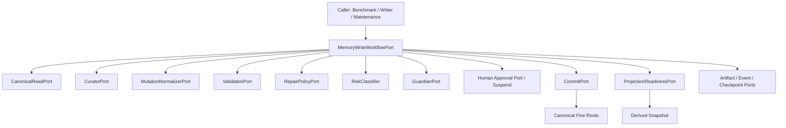
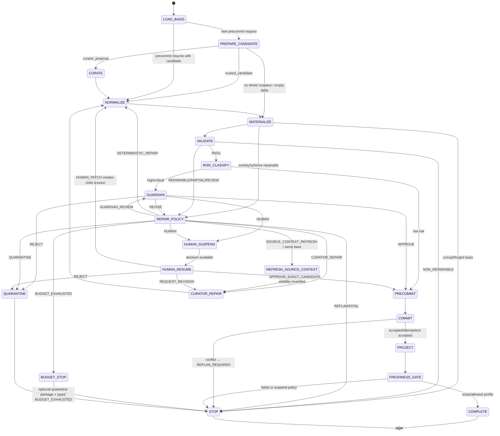
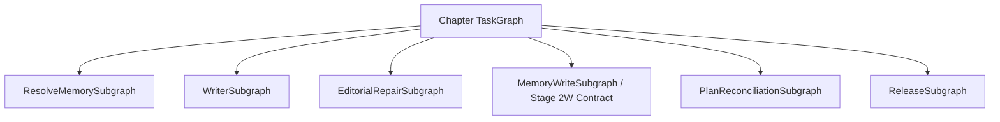

# Stage 2W：Memory Write Workflow、语义修复闭环与 Control Plane 接口开发执行文档

日期：2026-07-23

状态：`frozen execution baseline / ready for WP0-WP1 implementation`

阶段代号：`Stage 2W`，其中 `W` 表示 Write Workflow Realization

适用范围：Stage 2A / Stage 2R teacher-forced 连续回放写侧、C18 修复、未来 Agent Control Plane 接口预留

上游依据：

- `长篇小说Agent总体架构设计_v2.2_完整合并版.md`
- `长篇小说Agent技术实施与选型设计_v0.1.md`
- `长篇小说Agent正式开发执行规划_v0.1.md`
- `docs/stage2_memory_agents_development.md`
- `docs/stage2_teacher_forced_real_model_handoff.md`
- `docs/stage2_hybrid_retrieval_execution.md`
- `docs/adr/0001-stage1-memory-kernel-baseline.md`

---

## 0. 文档定位

本文是本轮 C18 暴露问题的开发执行基线。它不把问题定义为“Curator 再重试两次”，而是把当前
散落在 teacher-forced benchmark runner 中的写侧编排抽成稳定、框架无关、可恢复的
`MemoryWriteWorkflow`。

本阶段要交付的是：

```text
一次叶子 Agent 调用合同
    + 候选版本谱系
    + 确定性规范化
    + Validation v2
    + 有界语义修复策略
    + Guardian / Human 分流
    + 原子 Commit 与 Projection/Freshness 收尾
    + RunEvent / Artifact / Checkpoint 证据
    + teacher-forced Adapter
```

本阶段不交付通用分布式 Scheduler，也不提前实现完整 Writer / Editor / Planner 修复图。Stage 2
先使用普通 Python Coordinator 执行同一领域状态机；后续 LangGraph 或其他 Control Plane 只能
替换调度适配器，不能重写候选、验证、修复、提交和审计语义。

本文新增 `Stage 2W` 只是 Stage 2 内部工作包命名，不改变正式产品路线图。它与 Stage 2R 的关系为：

```text
Stage 2W
    保证 accepted candidate 能安全、可恢复地进入 Canonical Commit

Stage 2R
    保证 accepted commit 能物化为真实、可证明新鲜的 Derived Snapshot

teacher-forced benchmark
    依次调用 Stage 2W 写侧和 Stage 2R 投影/检索侧
```

### 0.1 2026-07-23 接口闭合修订

本基线已吸收首次接口评审的八项修订，后续实现不得回退：

| 级别 | 问题 | 冻结结论 |
|---|---|---|
| P0 | Commit 后恢复信息不足 | Checkpoint 增加 WorkflowPhase、accepted commit、commit/projection/freshness receipts、effect status 和 resume state；按 phase 恢复 |
| P0 | Request 无法表达多 Root 提交 | 使用 discriminated Trigger、WorldMutationInput、CommitProfile 和受信 RootUpdateIntent；Chapter 不再是通用必填字段 |
| P1 | Commit conflict 与 immutable basis 冲突 | v1 不自动 rebase；返回 REPLAN_REQUIRED，由 Caller 在新 base 上创建新 request/lineage |
| P1 | Human 审批路径不闭合 | exact approve、request revision、human patch、reject 四种 typed decision 分流 |
| P1 | 部分隔离结果不可表达 | COMMITTED + degraded、quarantine refs、operation sets、blocked capabilities 和 ContinuationDecision |
| P1 | Budget 可能异常退出 | STOP_BUDGET_EXHAUSTED + BUDGET_STOP；reservation 不足生成 typed result |
| P2 | 信息隔离只靠声明 | InformationBoundary、SourceVisibilityReceipt 和 InformationBoundaryPort 前置验证 |
| P2 | Normalizer identity 修复过宽 | 只有同一业务对象可证时才能保留 canonical identity；successor 必须有 stable ID 和旧状态结束语义 |

### 0.2 2026-07-23 正式冻结前补充修订

| 级别 | 问题 | 冻结结论 |
|---|---|---|
| P1 | 信息边界未覆盖派生链 | 新增 BoundaryPropagationReceipt DAG；RootUpdate、TrustedCandidate 和所有 revision 必须递归闭合到 visibility receipt |
| P1 | post-commit 非成功 Result 无法直接判断 Canon | Result 增加 workflow phase、canonical_commit_accepted 和派生 receipts；post-commit FATAL 不代表回滚 |
| P1 | accepted transaction/response lost 窗口 | Commit 前持久化 exact request/effect；恢复用同一 idempotency key 读回 CommitService 原结果 |
| P2 | CommitProfile 语义未冻结 | 增加三 profile 的 Trigger/Root-change/NOOP/identical-commit 矩阵和参数化测试 |

---

## 1. 当前事实、缺口与本轮结论

### 1.1 当前已有资产

当前仓库不是从零开始，以下能力必须复用：

| 现有资产 | 当前职责 | Stage 2W 用法 |
|---|---|---|
| `CuratorReplayAgent` | 生成一次 `ObservedChangeSet` 和 Agent receipt | 适配为 `CuratorPort.propose`；增加 repair 调用合同 |
| `WorldOverlay` | 在内存中构造候选 WorldRoot，不改 Canon | 作为 normalization 后的候选物化步骤 |
| `Stage1Validator` | 执行确定性 Evidence、Identity、Transition 等硬约束 | 包装成 Validation v2，不削弱现有阻断规则 |
| `ModelAssistedValidator` | 在确定性验证通过后只增加语义 finding | 保持“只能加限制，不能覆盖硬失败” |
| `PatchRiskClassifier` | 按结构化字段确定风险 | 继续作为可信确定性 Service |
| `GuardianWriteGate` | 最终安全判定 | 只做 Gate，不拥有重试或路由权 |
| `ReplayWriteCoordinator` | Guardian/Human/Commit 的初步协调 | 迁入新 Workflow 或作为过渡内部 Adapter，不保留第二套状态机 |
| `CommitService` | 幂等、CAS 式原子 Canonical Commit 和 outbox | 继续作为唯一正式写入路径 |
| `RunEventLogRepository` | append-only 运行事件 | 作为 `RunEventSink` 的默认 Adapter |
| `RunCheckpointRepository` | 事件位置绑定的恢复快照 | 作为 `WorkflowCheckpointPort` 的默认 Adapter |
| `ArtifactRepository` | 内容寻址 Artifact 保存 | 保存候选、finding、decision、checkpoint 和 quarantine |
| `FailureLedgerService` | Stage 2 失败账本 | 增加 workflow/repair 分类，或由兼容 Adapter 映射 |
| Projection/Freshness 服务 | Commit 后派生物化与新鲜度门禁 | 作为成功终态前的强制收尾步骤 |

### 1.2 C18 的直接症状

当前 `_TeacherForcedTransition.apply()` 内联执行：

```text
Curator
→ WorldOverlay
→ Stage1Validator
→ PatchRiskClassifier
→ Guardian
→ GuardianWriteGate
→ Commit
→ Projection
→ FreshnessGate
```

当 `GuardianWriteGate` 不是 `ALLOW_COMMIT` 时，runner 直接抛
`TeacherForcedBenchmarkError`。这会把以下语义混成同一种失败：

- 候选可以通过确定性转换修复；
- Curator 可以在明确 finding 和允许范围内修订；
- 需要 Guardian 决策；
- 需要 Human suspend；
- 需要刷新 Canonical basis 后重做；
- 已经耗尽本任务修复预算；
- 不可修复的硬不变量或代码错误。

### 1.3 更深层缺口

当前缺失的不是一个 `while` 循环，而是以下稳定合同：

1. Workflow 的输入、结果和终态；
2. 原始 Candidate 与每次 Revision 的不可覆盖谱系；
3. Validator 能驱动策略但不能自行调度的 finding 协议；
4. Repair Policy 对下一条边的唯一决策权；
5. 每个边界状态的 Artifact、Event、Budget 和 Checkpoint；
6. benchmark、未来 Writer runtime 和 LangGraph 可共同调用的 Port。

### 1.4 本轮冻结的八个结论

1. **Workflow 先行。** 不在 benchmark runner 中增加修复循环。
2. **Runtime 拥有闭环。** Curator、Validator、Guardian、Commit 互不直接调用。
3. **Candidate 不可覆盖。** 每次修订必须产生新 identity 和 parent lineage。
4. **三层重试分离。** 模型传输、语义修复、TaskGraph 恢复使用不同预算和状态。
5. **确定性优先。** 能由 Normalizer 安全完成的转换不消耗 Curator 模型调用。
6. **Validation fail-closed。** Model/Guardian/Human 均不能覆盖确定性硬失败，只能促成新 Candidate 重验。
7. **Commit 唯一写 Canon。** repair、normalize、validate、guardian 均不得改变正式 Root。
8. **框架无关。** 领域合同和 Policy 不导入 LangGraph；LangGraph 仅是未来调度 Adapter。

---

## 2. 目标、非目标与完成定义

### 2.1 本阶段目标

#### W-G1：建立唯一写侧入口

所有逐章 Curator 写回通过：

```python
class MemoryWriteWorkflowPort(Protocol):
    async def execute(
        self,
        request: MemoryWriteWorkflowRequest,
    ) -> MemoryWriteWorkflowResult:
        ...
```

benchmark 不再知道 Curator 后应该调用 Validator、Guardian 还是 Commit。

#### W-G2：让 C18 成为可修复、可解释的回归场景

`STATE_IDENTITY_MUTATION` 等 finding 必须被分类为明确的 retryability 和 repair scope；系统应产生
新 Candidate 修订，重新完成完整验证链，而不是覆写旧 Candidate 或自动空 delta。

#### W-G3：证明有界失败恢复

每次执行都必须满足：

- 有明确的 repair、guardian、token、wall-clock 预算；
- 有稳定终态，不依赖异常作为正常业务分支；
- 可在 Human、Replan、Projection 未就绪等边界暂停；
- 可从 checkpoint 恢复而不重复 Canonical 写入；
- 同一 `idempotency_key` 重放得到同一业务结果或明确 basis conflict。

#### W-G4：为未来 Control Plane 固定接口

后续 `MemoryWriteSubgraph` 必须能把本文状态一对一映射成 Node/Edge，且不修改 Domain Contract、
Candidate lineage、Validation v2 或 Commit 语义。

### 2.2 非目标

Stage 2W 不实现：

- 分布式任务队列、跨机器 Worker 或租约；
- 通用 Chapter TaskGraph；
- Writer/Editor 正文修复协议；
- Planner 自动重规划实现；
- 跨天 Human UI 和通知系统；
- 学习型 Repair Policy；
- 无界模型自我反思；
- 多 Candidate beam search；
- 自动 Retcon、Forget、Merge/Split；
- 将 `StructuredAgentRunner` 升级成总调度器；
- 用 benchmark Gold 或未来正文辅助修复。

### 2.3 完成定义

本阶段只有同时满足以下条件才算完成：

```text
合同已导出并通过 schema regression
+ C18 修复路径通过真实/受控模型测试
+ 所有 Candidate revision 可追溯且不可覆盖
+ repair budget 和 transport retry 分开计数
+ Human/Replan/Budget/Fatal 均返回结构化终态
+ resume 不重复 Agent side effect 或 Canon commit
+ teacher-forced runner 不再内联写侧业务编排
+ Commit 后 Projection/Freshness 结果进入 Workflow Result
+ scripted、目标单元、合同和最小真实模型门禁通过
```

---

## 3. 不得破坏的权威与依赖边界

### 3.1 唯一允许的调用关系



禁止形成：

```text
Validator → Curator
Curator → Guardian
Guardian → Commit
RepairPolicy → Canonical Store
Benchmark → Guardian/Commit
```

### 3.2 权威矩阵

| 组件 | 可以做 | 不可以做 |
|---|---|---|
| Curator | propose/repair 候选 Artifact | 修改 Canon、批准自己、决定重试次数 |
| Normalizer | 在白名单规则内确定性改写候选 | 发明新事实、放宽验证、不记录变换 |
| Validator | 输出 finding、disposition、允许修复范围 | 调 Agent、修改候选、批准 Commit |
| Repair Policy | 基于可信上下文选择下一条边 | 修改 Candidate、覆盖 Gate |
| Guardian | 审核高风险候选并 approve/revise/reject/human | 直接 Commit、覆盖确定性失败 |
| Human | 对绑定 basis 的请求作批准/拒绝 | 批准另一个 Candidate 或过期 base |
| Workflow Runtime | 持有状态机、预算、恢复和调度 | 绕过 Port 直接改 Root |
| Commit Coordinator | 原子验证 basis 并提交 | 接受未 PASS、未 Gate 的 Candidate |
| Projection Service | 构建可重建 Derived | 改变 Canonical 语义 |

### 3.3 每次新 Candidate 必须重新通过完整链

无论修订来源是 deterministic normalization、Curator repair、context refresh 还是 Human 返回，新的
Candidate 都必须重新经历：

```text
candidate materialization
→ overlay/schema checks
→ deterministic validation
→ optional model-assisted validation
→ risk classification
→ Guardian/Human gate（若需要）
→ precommit basis check
→ Commit
```

旧 Candidate 的 validation 或 Guardian receipt 不得自动继承给新 Candidate。

---

## 4. 三层失败恢复必须分开

### 4.1 模型传输重试

所有权：`ModelGateway` / Model Endpoint Adapter。

处理范围：

- HTTP 429 / 5xx；
- timeout、连接中断；
- 非 JSON、缺少 schema 字段；
- `content=null`；
- `finish_reason=length`；
- provider 短暂不可用。

建议预算字段：

```text
model_transport.max_attempts
model_transport.backoff_profile
model_transport.timeout_seconds
```

每个 attempt 都必须产生 Model Event/Call evidence。传输重试成功后仍只算一次叶子 Agent 语义调用，
但调用记录要能展开看到各次 transport attempt。

### 4.2 语义修复循环

所有权：`MemoryWriteWorkflow + RepairPolicy`。

处理范围：

- identity mutation；
- target ID 错误；
- CREATE / REPLACE 选择错误；
- EvidenceRef 不合法或支持不足；
- 状态/义务转移不成立；
- Truth Class 提升错误；
- Guardian `REVISE`；
- 上下文陈旧但允许刷新后重新提案。

预算字段：

```text
semantic_repair.max_candidate_revisions
semantic_repair.max_curator_repairs
semantic_repair.max_normalization_passes
semantic_repair.max_guardian_reviews
semantic_repair.max_context_refreshes
semantic_repair.max_total_model_calls
semantic_repair.wall_clock_budget_ms
semantic_repair.token_budget
```

任何一项耗尽都必须返回 `BUDGET_EXHAUSTED` 或按 Policy 进入 `QUARANTINED`，不得继续调用模型。

### 4.3 TaskGraph 恢复与重规划

所有权：未来顶层 Agent Control Plane；Stage 2W 只返回可接管状态。

处理范围：

- 子任务长期失败；
- repair budget 耗尽后的业务决策；
- 需要 Planner 重规划；
- 跨天 Human 审核；
- 进程/机器重启；
- 外部副作用 `UNCERTAIN`；
- poison loop、Dead Letter 和跨任务优先级。

Stage 2W 对这些情况只执行：

```text
persist artifacts
→ append terminal/suspend event
→ save checkpoint when resumable
→ return HUMAN_REQUIRED / REPLAN_REQUIRED / SUSPENDED / QUARANTINED
```

### 4.4 禁止的统一配置

禁止新增以下模糊配置：

```python
max_retries = 3
```

每个计数器必须属于明确层级，结果和事件中必须报告实际消耗。

---

## 5. 核心领域合同

建议新增 `src/novel_agent/domain/memory_write.py`，避免继续把写侧 Workflow 合同堆入已经过大的
`domain/stage2.py`。旧类型先保留兼容，待 Adapter 切换和 schema 迁移完成后再决定是否弃用。

### 5.1 Workflow Request

`MemoryWriteWorkflowRequest` 必须同时表达“为何触发写回”和“哪些 Root 更新意图参与同一次原子提交”。
章节信息不能成为所有调用者的强制字段，使用 discriminated union：

```python
class MemoryWriteTriggerKind(StrEnum):
    CHAPTER_REVEAL = "chapter_reveal"
    BOOTSTRAP = "bootstrap"
    PLAN_CHANGE = "plan_change"
    MAINTENANCE = "maintenance"
    HUMAN_CORRECTION = "human_correction"


class ChapterRevealTrigger(DomainModel):
    kind: Literal[MemoryWriteTriggerKind.CHAPTER_REVEAL]
    chapter_id: StableId
    chapter_index: int
    reveal_position: NarrativePosition


class BootstrapTrigger(DomainModel):
    kind: Literal[MemoryWriteTriggerKind.BOOTSTRAP]
    bootstrap_bundle_id: StableId


class PlanChangeTrigger(DomainModel):
    kind: Literal[MemoryWriteTriggerKind.PLAN_CHANGE]
    plan_change_id: StableId


class MaintenanceTrigger(DomainModel):
    kind: Literal[MemoryWriteTriggerKind.MAINTENANCE]
    maintenance_task_id: StableId


class HumanCorrectionTrigger(DomainModel):
    kind: Literal[MemoryWriteTriggerKind.HUMAN_CORRECTION]
    correction_request_id: StableId


MemoryWriteTrigger = Annotated[
    ChapterRevealTrigger
    | BootstrapTrigger
    | PlanChangeTrigger
    | MaintenanceTrigger
    | HumanCorrectionTrigger,
    Field(discriminator="kind"),
]


class MemoryWriteCommitProfile(StrEnum):
    CHAPTER_REVEAL_ATOMIC = "chapter_reveal_atomic"
    CHANGED_ROOTS_ONLY = "changed_roots_only"
    REQUIRE_CANONICAL_COMMIT = "require_canonical_commit"


class RootUpdateIntent(DomainModel):
    intent_id: StableId
    root_kind: RootKind
    update_kind: RootUpdateKind
    expected_base_root: ArtifactRef
    update_artifact: ArtifactRef
    producer_receipt: ArtifactRef
    builder_policy_ref: ContractRef


class SourceProvenance(StrEnum):
    AUTHOR_INPUT = "author_input"
    REVEALED_TEXT = "revealed_text"
    CANONICAL_ROOT = "canonical_root"
    TRUSTED_DERIVED = "trusted_derived"
    HUMAN_CORRECTION = "human_correction"


class InformationBoundary(DomainModel):
    boundary_id: StableId
    base_commit: CommitId
    reveal_position: NarrativePosition | None
    maximum_visible_position: NarrativePosition | None
    evaluator_sources_forbidden: bool
    policy_ref: ContractRef


class SourceVisibilityReceipt(DomainModel):
    receipt_id: StableId
    source_artifact: ArtifactRef
    boundary_id: StableId
    visible_through: NarrativePosition | None
    access_scope: AccessScope
    provenance: SourceProvenance
    issuer: StableId
    receipt_hash: ArtifactId


class BoundaryPropagationReceipt(DomainModel):
    receipt_id: StableId
    boundary_id: StableId
    base_commit: CommitId
    input_source_artifact_refs: tuple[ArtifactRef, ...]
    source_visibility_receipt_refs: tuple[ArtifactRef, ...]
    input_derivation_receipt_refs: tuple[ArtifactRef, ...]
    output_artifact_hash: ArtifactId
    builder_policy_hash: ArtifactId
    effective_visible_through: NarrativePosition | None
    effective_access_scope: AccessScope
    receipt_hash: ArtifactId


class CuratorWorldProposalInput(DomainModel):
    mode: Literal["curator_proposal"]
    curator_agent_spec: ContractRef


class TrustedWorldCandidateInput(DomainModel):
    mode: Literal["trusted_candidate"]
    candidate_artifact: ArtifactRef
    producer_receipt: ArtifactRef


class NoWorldMutationInput(DomainModel):
    mode: Literal["none"]


WorldMutationInput = Annotated[
    CuratorWorldProposalInput | TrustedWorldCandidateInput | NoWorldMutationInput,
    Field(discriminator="mode"),
]


class MemoryWriteWorkflowRequest(DomainModel):
    request_id: StableId
    run_id: RunId
    task_id: TaskId
    project_id: ProjectId
    trigger: MemoryWriteTrigger
    commit_profile: MemoryWriteCommitProfile
    base_commit: CommitId
    source_artifacts: tuple[ArtifactRef, ...]
    root_update_intents: tuple[RootUpdateIntent, ...]
    world_mutation: WorldMutationInput
    canonical_root_refs: RootManifest
    information_boundary: InformationBoundary
    source_visibility_receipts: tuple[SourceVisibilityReceipt, ...]
    access_scope: AccessScope
    source_provenance: tuple[SourceProvenance, ...]
    configuration_fingerprint: ArtifactId
    prompt_contract_refs: tuple[ContractRef, ...]
    skill_contract_refs: tuple[ContractRef, ...]
    tool_policy_ref: ContractRef
    repair_policy_ref: ContractRef
    budget: MemoryWriteBudget
    idempotency_key: StableId
    resume_checkpoint: ArtifactRef | None = None
```

约束：

1. `canonical_root_refs` 必须属于 `base_commit`；Runtime 应通过 `CanonicalReadPort` 读回核验，不能只信 Caller。
2. `source_artifacts`、`source_visibility_receipts` 和 `source_provenance` 必须一一对应；Runtime 通过
   `InformationBoundaryPort` 验证 receipt 的签发者、content hash、可见位置和 access scope，不能相信
   Caller 自报“无未来信息”。
3. `root_update_intents` 是受信 Service 已构造、但尚未进入 Canon 的更新意图。每个 intent 必须绑定
   expected base root、update artifact、producer receipt 和 builder policy；Caller 不能直接传任意
   `proposed_roots` 冒充受信更新。
   `producer_receipt` 必须是可解析的 `BoundaryPropagationReceipt`，其 boundary/base/output hash/
   builder policy 必须分别等于 Request boundary、Request base、update artifact hash 和
   `builder_policy_ref.content_hash`。
4. `CHAPTER_REVEAL_ATOMIC` 必须使用 `ChapterRevealTrigger`，且至少有一个 TextRoot update intent；
   World mutation 即使 NOOP，TextRoot 更新仍与其他 Root 在一次 Commit 中原子发布。
5. `PLAN_CHANGE` 必须有 PlanRoot intent；`MAINTENANCE` 不要求 chapter 字段；trigger、commit profile 与
   root intents 的合法组合由合同 validator 冻结。
6. `world_mutation` 决定 World 候选来源：`curator_proposal` 才要求并调用 Curator；
   `trusted_candidate` 从受信 Artifact 建立 lineage；`none` 不调用 Curator，并由 Runtime 产生含空
   `ObservedChangeSet` 的候选 bundle，使 Text/Plan-only commit 仍经过 Validation/Gate/Commit。
   Trusted candidate 若已携带 RootUpdateIntents，必须与 Request 中的 intent IDs/content hashes 完全一致；
   不一致时 fail closed。其 `producer_receipt` 同样必须是绑定 candidate artifact output hash 的
   `BoundaryPropagationReceipt`。
7. `RootUpdatePort` 负责按 builder policy 把通用 intent 物化为 proposed Root，不在 Workflow 中写入
   teacher-forced 专用 append 逻辑。
8. `configuration_fingerprint` 必须覆盖 Agent/Prompt/Skill/Tool/Repair Policy、root builder policy 和
   information-boundary policy 版本。
9. resume 时 request identity、project、task、base、sources、root intents、world mutation、boundary 和 policy
   fingerprint 必须与 checkpoint 一致。
10. `base_commit` 在一次 Workflow Request 内不可改变。若 current commit 已前移，当前请求终止；Caller
   必须以新 base commit 创建新 request 和新 idempotency key。
11. `idempotency_key` 绑定整个业务写请求，不绑定某次 Candidate revision。

### 5.1.1 派生链信息边界

`InformationBoundaryPort` 不能只验证 Request 顶层的 `source_artifacts`。它必须递归验证：

```text
Request source artifacts
RootUpdateIntent.update_artifact
TrustedWorldCandidateInput.candidate_artifact
Curator/Normalizer/Human patch 产生的每个后续 Candidate artifact
```

派生链规则：

1. 每个派生产物必须有 `BoundaryPropagationReceipt`；receipt 同时绑定 `boundary_id`、`base_commit`、
   直接输入 Artifact refs、对应 source visibility receipt refs、上游 derivation receipt refs、输出 hash 和
   builder policy hash。
2. 每个直接输入必须二选一：要么由同一 boundary 下的 `SourceVisibilityReceipt` 覆盖，要么由另一个
   `BoundaryPropagationReceipt` 覆盖。所有叶子最终必须闭合到已验证 SourceVisibilityReceipt，不能出现
   无来源叶子。
3. Port 必须校验 receipt DAG 无环、所有 artifact hash 匹配、builder policy 在当前 configuration
   fingerprint 中、base commit 一致，且不存在跨 project/boundary 拼接。
4. 派生步骤的 `effective_visible_through` 不能晚于任何输入允许的最大位置，access scope 只能保持或
   收窄，不能通过摘要、合并、重写或“受信 builder”扩大可见范围。
5. RootUpdatePort、trusted candidate loader、CandidateLineageRepository 在接受 Artifact 前都必须调用
   `InformationBoundaryPort.verify_derivation_chain()`；仅校验 producer 名称或签名不够。
6. Curator/Normalizer/Human patch 的 producer receipt 必须把其实际输入 Candidate/source receipts 纳入
   derivation chain；新 Candidate revision 的 basis hash 还必须覆盖 propagation receipt hash。
7. 任一链路缺失、hash 不符、越界、policy 未登记或 scope widening 都在 Agent/Materialize/Commit 前
   fail closed，并产生 `INFORMATION_DERIVATION_BOUNDARY_VIOLATION`。

### 5.1.2 CommitProfile 正式语义

`MemoryWriteCommitProfile` 决定“无变化”和“哪些 Root 必须改变”的处理，不授予绕过 Validation 或
制造 identical commit 的权限：

| Profile | 允许的 Trigger | 无 Root hash 变化 | World NOOP | 必须更新的 Root | identical commit |
|---|---|---|---|---|---|
| `CHAPTER_REVEAL_ATOMIC` | 仅 `ChapterReveal` | `FATAL + CHAPTER_TEXT_UPDATE_REQUIRED` | 只要 TextRoot 有真实变化，仍原子提交 Text/可选 Plan；WorldRoot 复用旧 hash | TextRoot 必须存在 intent 且 resulting hash 不同；其他 Root 可选 | 禁止 |
| `CHANGED_ROOTS_ONLY` | `PlanChange`、`Maintenance`、`HumanCorrection`；其他组合须注册 profile rule | 返回 `NOOP`，不调用 Commit | 只提交实际变化的其他 Root；若均未变化则 `NOOP` | Trigger validator 可要求特定 Root，例如 PlanChange 必须有 PlanRoot intent | 禁止 |
| `REQUIRE_CANONICAL_COMMIT` | `Bootstrap`、`HumanCorrection`、显式批准的 Maintenance | 返回 `FATAL` + `REQUIRED_ROOT_UPDATE_MISSING`，不创建空 Commit | 仅当至少一个 Trigger 要求的其他 Root 真正变化时可提交，否则同左 | 由版本化 Trigger policy 声明；至少一个 resulting Root hash 必须不同 | 禁止 |

共同规则：

1. RootUpdatePort 必须在 MATERIALIZE 时比较 base/resulting Root hashes，不能以“存在 intent”代替真实变化。
2. 所有 profile 都禁止五 Root hash 与 base 完全相同的 Commit；`REQUIRE_CANONICAL_COMMIT` 表示业务
   前置条件要求产生 Canonical 变化，不表示允许制造空 Commit。
3. `CHAPTER_REVEAL_ATOMIC` 中 World NOOP 仍返回 `COMMITTED + world_mutation_noop=true`；TextRoot
   identical 则不是提交理由。
4. `CHANGED_ROOTS_ONLY` 的 FULL NOOP 返回 `workflow_phase=COMPLETE`、
   `canonical_commit_accepted=false`、`status=NOOP`。
5. Trigger/Profile/WorldMutation/Root intents 组合必须由参数化 contract tests 冻结；未登记组合 fail
   closed，不使用默认分支猜测。

两种允许的接入形式实际统一为同一合同：上游可先由受信 Service 产生 Text/Plan `RootUpdateIntent`，
Curator/Normalizer 再在 Workflow 内产生 World 候选；最终由 `RootUpdatePort` 合并为一个
`CandidateChangeBundle`。benchmark 只负责提交 trigger、已签发的 source/intent receipt 和 policy，
不负责构造或提交最终 RootManifest。

### 5.2 Workflow Result

```python
class MemoryWriteWorkflowPhase(StrEnum):
    PRECOMMIT = "precommit"
    CANON_COMMITTED = "canon_committed"
    PROJECTION_PENDING = "projection_pending"
    COMPLETE = "complete"


class MemoryWriteWorkflowStatus(StrEnum):
    COMMITTED = "committed"
    NOOP = "noop"
    QUARANTINED = "quarantined"
    SUSPENDED = "suspended"
    HUMAN_REQUIRED = "human_required"
    REPLAN_REQUIRED = "replan_required"
    BUDGET_EXHAUSTED = "budget_exhausted"
    FATAL = "fatal"


class ContinuationDecision(StrEnum):
    SAFE_TO_CONTINUE = "safe_to_continue"
    BLOCK_NEXT_CHAPTER = "block_next_chapter"
    REVIEW_BEFORE_CHECKPOINT = "review_before_checkpoint"


class MemoryWriteWorkflowResult(DomainModel):
    request_id: StableId
    status: MemoryWriteWorkflowStatus
    workflow_phase: MemoryWriteWorkflowPhase
    canonical_commit_accepted: bool
    base_commit: CommitId
    resulting_commit: CommitId | None
    world_mutation_noop: bool
    accepted_candidate_id: StableId | None
    terminal_candidate_id: StableId | None
    validation_receipt: ArtifactRef | None
    guardian_receipt: ArtifactRef | None
    commit_receipt: ArtifactRef | None
    projection_receipt_ref: ArtifactRef | None
    freshness_receipt_ref: ArtifactRef | None
    projection_snapshot_id: StableId | None
    freshness: FreshnessDecision | None
    checkpoint_ref: ArtifactRef | None
    degraded: bool
    quarantine_refs: tuple[ArtifactRef, ...]
    committed_operation_ids: tuple[StableId, ...]
    quarantined_operation_ids: tuple[StableId, ...]
    blocked_capabilities: tuple[str, ...]
    continuation_decision: ContinuationDecision
    budget_usage: MemoryWriteBudgetUsage
    terminal_codes: tuple[str, ...]
```

结果不变量：

- `COMMITTED` 必须处于 `COMPLETE`、`canonical_commit_accepted=true`，并同时有 resulting commit、
  accepted candidate、validation、commit、snapshot 和 freshness；
- `canonical_commit_accepted=true` 时，`resulting_commit` 和 `commit_receipt` 必须存在，phase 必须是
  `CANON_COMMITTED`、`PROJECTION_PENDING` 或 committed `COMPLETE`；无论 status 是 `SUSPENDED` 还是
  `FATAL`，Caller 都必须把 resulting commit 当作已生效 Canon，禁止从旧 base 重做写回；
- `canonical_commit_accepted=false` 时不得携带 resulting commit/commit receipt；`NOOP` 必须处于
  `COMPLETE`，其他 pre-commit 阻断必须处于 `PRECOMMIT`；
- `CANON_COMMITTED/PROJECTION_PENDING` phase 必然意味着 Canon 已提交；`COMPLETE` 可以表示 committed
  success，也可以表示未提交的 FULL NOOP，必须结合 `canonical_commit_accepted` 判断；
- post-commit `FATAL` 只表示 Projection/Freshness 等派生收尾不可恢复地失败，不表示 Canon 回滚，
  `continuation_decision` 必须为 `BLOCK_NEXT_CHAPTER`；
- `PROJECTION_PENDING` 尚无 freshness receipt；committed `COMPLETE` 必须同时有 projection/freshness
  receipts，且 receipt basis 等于 resulting commit；
- `NOOP` 表示所有 Root 均不需要提交；只更新 Text/Plan、World 不变时状态仍为 `COMMITTED`，并以
  `world_mutation_noop=true` 明确报告；
- `HUMAN_REQUIRED`、`REPLAN_REQUIRED`、`SUSPENDED` 必须有可恢复 checkpoint；
- `QUARANTINED` 必须至少有一个 quarantine artifact；
- `COMMITTED + degraded=true` 表示合法 operation 已提交、其他 operation 已隔离；此时
  `committed_operation_ids`、`quarantined_operation_ids` 和 `quarantine_refs` 均不得为空，两个 operation
  集合必须互斥并完整覆盖原 Candidate；被提交的子 Candidate 必须重新完成完整 Validation/Guardian；
- `ContinuationDecision` 固定为 `SAFE_TO_CONTINUE`、`BLOCK_NEXT_CHAPTER` 或
  `REVIEW_BEFORE_CHECKPOINT`。部分提交不能默认继续，存在状态、身份、义务、Truth 或关键 Evidence
  缺口时必须阻断下一章或在 checkpoint 前复核；
- 非 degraded 的 `COMMITTED/NOOP` 默认 `SAFE_TO_CONTINUE`；`HUMAN_REQUIRED`、`REPLAN_REQUIRED`、
  `BUDGET_EXHAUSTED`、`FATAL` 默认 `BLOCK_NEXT_CHAPTER`；`QUARANTINED/SUSPENDED` 由 terminal policy
  明确给出，不能留空或由 Caller 推断；
- `BUDGET_EXHAUSTED` 的 quarantine 是否存在由 repair policy 决定；无论是否 quarantine，必须有
  `terminal_codes=("SEMANTIC_REPAIR_BUDGET_EXHAUSTED", ...)`，且不能抛预算异常；
- `FATAL` 不得伪装成 retryable；
- 正常业务阻断通过 Result 表达，异常只保留给合同损坏、I/O corruption 和编程错误。

### 5.3 Candidate Revision Envelope

现有 `ObservedChangeSet` 和 `CandidateChangeBundle` 保持业务内容；新增逻辑 payload、物化 receipt 和
revision envelope。RootUpdateIntent 从第一版候选起就是候选内容的一部分，不能在 Validation 后追加：

```python
class MemoryWriteCandidatePayload(DomainModel):
    observed_changes: ObservedChangeSet
    root_update_intents: tuple[RootUpdateIntent, ...]
    commit_profile: MemoryWriteCommitProfile


class CandidateRevision(DomainModel):
    candidate_id: StableId
    parent_candidate_id: StableId | None
    revision_no: int
    base_commit: CommitId
    basis_hash: ArtifactId
    candidate_artifact: ArtifactRef
    source_artifacts: tuple[ArtifactRef, ...]
    producer_kind: CandidateProducerKind
    producer_receipt: ArtifactRef | None
    repair_scope: RepairScope | None
    applied_directive_ids: tuple[StableId, ...]
    supersedes_candidate_id: StableId | None
    content_hash: ArtifactId
    created_at: datetime


class CandidateMaterialization(DomainModel):
    candidate_id: StableId
    candidate_content_hash: ArtifactId
    bundle_artifact: ArtifactRef
    proposed_roots_hash: ArtifactId
    materialization_receipt: ArtifactRef
    materializer_policy_ref: ContractRef
```

`candidate_artifact` 必须指向 `MemoryWriteCandidatePayload`。Curator 只产生其中的
`ObservedChangeSet`；可信 Runtime 在持久化 revision 前把 Request 中的 RootUpdateIntents 和 commit
profile 合入 payload。`MATERIALIZE` 使用 RootUpdatePort 将该不可变 payload 转成完整
`CandidateChangeBundle`，并生成 `CandidateMaterialization`；它不是一次新的语义修订。

谱系规则：

1. `revision_no=1` 的 parent 必须为空；后续 revision 必须严格加一并指向直接父版本。
2. `candidate_id` 标识一次不可变 revision；`content_hash` 标识内容，可用于发现同内容循环。
3. `basis_hash` 覆盖 base commit、canonical root refs、trigger、commit profile、world mutation input、
   全部 source artifacts、root update intents、所有 visibility/propagation receipt hashes、information
   boundary 和 configuration fingerprint。
4. repair 不得沿用父 Candidate 的 ID、validation receipt 或 Guardian decision。
5. 相同内容连续出现时仍保留 revision，但 Policy 必须计算 poison-loop signature。
6. 所有 candidate Artifact 在终态后仍需保留，不能只保存最后成功版本。
7. `CandidateMaterialization` 必须同时绑定 candidate ID/content hash 和完整 proposed roots hash；
   Validation、Gate 和 Commit receipt 都必须引用同一 materialization，防止 validation 后换 Root。

示例：

```text
candidate_v1 / curator_propose
    → validation: STATE_IDENTITY_MUTATION
candidate_v2 / deterministic_normalizer / parent=v1
    → validation: PASS, guardian: REVISE
candidate_v3 / curator_repair / parent=v2
    → validation: PASS, guardian: APPROVE
    → COMMITTED
```

### 5.4 Validation v2

为兼容现有调用，建议先新增 `ValidationFindingV2` 和 `ValidationDecision`，不原地破坏
`ValidationReport`。提供 `ValidationV1Adapter` 将现有 finding 映射到保守 v2 disposition。

```python
class ValidationDisposition(StrEnum):
    PASS = "pass"
    REPAIRABLE = "repairable"
    PARTIAL_REPAIRABLE = "partial_repairable"
    REVIEW_REQUIRED = "review_required"
    NON_REPAIRABLE = "non_repairable"


class ValidationFindingV2(DomainModel):
    finding_id: StableId
    code: str
    category: ValidationFindingCategory
    severity: ValidationSeverity
    message: str
    operation_ids: tuple[StableId, ...]
    field_paths: tuple[str, ...]
    canonical_record_refs: tuple[StableId, ...]
    evidence_refs: tuple[EvidenceRef, ...]
    retryability: FindingRetryability
    suggested_strategies: tuple[RepairStrategy, ...]
    blocking_scope: BlockingScope
    allowed_repair_scope: RepairScope
    requires_context_refresh: bool
    requires_guardian: bool
    requires_human: bool


class ValidationDecision(DomainModel):
    decision_id: StableId
    candidate_id: StableId
    candidate_content_hash: ArtifactId
    materialization_receipt: ArtifactRef
    proposed_roots_hash: ArtifactId
    base_commit: CommitId
    disposition: ValidationDisposition
    findings: tuple[ValidationFindingV2, ...]
    deterministic_profile: str
    model_profile: str | None
    validated_at: datetime
```

Validator 规则：

- Finding 必须尽量绑定 `operation_ids` 和 `field_paths`，不能只返回自然语言；
- `allowed_repair_scope` 是最大允许范围，不是自动执行指令；
- v1 无法证明可修复的 finding 默认映射为 `NON_REPAIRABLE` 或 `REVIEW_REQUIRED`，不能乐观放行；
- `PASS` 不得带 blocking finding；
- `PARTIAL_REPAIRABLE` 表示部分 operation 可隔离，但是否隔离由 Repair Policy 决定；
- Validator 不能输出下一个 Agent 名称，只能给策略候选和边界。

首批必须登记的 finding registry：

| Finding code | 默认 retryability | 首选策略 | 默认升级 |
|---|---|---|---|
| `STATE_IDENTITY_MUTATION` | repairable | successor state / correct target | Curator repair if deterministic proof不足 |
| `CREATE_TARGET_EXISTS` | repairable | CREATE→REPLACE or NOOP | quarantine on ambiguity |
| `REPLACE_TARGET_MISSING` | repairable | business-key resolve or REPLACE→CREATE | Curator repair if identity unclear |
| `OPERATION_TARGET_MISMATCH` | repairable | bind target to typed record identity | fatal on forged/cross-project ID |
| `RECORD_EVIDENCE_MISMATCH` | repairable | canonical evidence rebinding | context refresh / Curator repair |
| `INVALID_EVIDENCE_REF` | conditional | context refresh then repair | human/fatal if source unavailable |
| `ILLEGAL_STATE_TRANSITION` | conditional | successor proposal / remove unsupported op | Guardian or quarantine |
| `UNLISTED_STATE_TRANSITION` | review | Guardian review | human if critical predicate |
| `TRUTH_PROMOTION` | review | downgrade truth class / Guardian | human for critical promotion |
| `FUTURE_EVIDENCE` | non-repairable in same basis | stop fatal | benchmark invalidation |
| `BASE_COMMIT_MISMATCH` | non-repairable in same request | suspend current request | Caller creates a new request on the new base |

具体分类应由 registry/policy code 冻结并测试，不能用字符串包含判断散落在 Workflow 中。

### 5.5 Repair Context 与 Action

```python
class RepairAction(StrEnum):
    DETERMINISTIC_REPAIR = "deterministic_repair"
    CURATOR_REPAIR = "curator_repair"
    GUARDIAN_REVIEW = "guardian_review"
    QUARANTINE_OPERATION = "quarantine_operation"
    RETRY_AFTER_SOURCE_CONTEXT_REFRESH = "retry_after_source_context_refresh"
    REPLAN = "replan"
    HUMAN = "human"
    STOP_BUDGET_EXHAUSTED = "stop_budget_exhausted"
    STOP_FATAL = "stop_fatal"


class RepairContext(DomainModel):
    request_id: StableId
    candidate: CandidateRevision
    validation: ValidationDecision | None
    risk: PatchRiskAssessment | None
    guardian: GuardianDecision | None
    gate: WriteGateDecision | None
    budget_remaining: MemoryWriteBudgetRemaining
    prior_actions: tuple[RepairActionReceipt, ...]
    repeated_content_hashes: tuple[ArtifactId, ...]
    current_canonical_commit: CommitId


class RepairDirective(DomainModel):
    directive_id: StableId
    action: RepairAction
    finding_ids: tuple[StableId, ...]
    operation_ids: tuple[StableId, ...]
    allowed_scope: RepairScope
    reason_codes: tuple[str, ...]
    checkpoint_required: bool
```

`RepairPolicyPort.decide()` 是唯一把 finding/gate 转换为下一条 Workflow 边的组件。默认 Policy 必须
是确定性、版本化、表驱动的，不调用模型。

`RETRY_AFTER_SOURCE_CONTEXT_REFRESH` 只能刷新同一 `base_commit` 下缺失的 source/evidence view，不能
改变 Canonical basis。任何 current commit 前移或 `BASE_COMMIT_MISMATCH` 都不能走此 action。
`STOP_BUDGET_EXHAUSTED` 是正常业务终止动作，必须生成 typed result，而不是退化成 `STOP_FATAL`。

### 5.6 Workflow Checkpoint

```python
class MemoryWriteCheckpoint(DomainModel):
    checkpoint_id: StableId
    request_identity_hash: ArtifactId
    request_artifact_ref: ArtifactRef
    run_id: RunId
    task_id: TaskId
    project_id: ProjectId
    base_commit: CommitId
    source_artifacts: tuple[ArtifactRef, ...]
    root_update_intents: tuple[RootUpdateIntent, ...]
    world_mutation: WorldMutationInput
    information_boundary: InformationBoundary
    configuration_fingerprint: ArtifactId
    workflow_phase: MemoryWriteWorkflowPhase
    state: MemoryWriteState
    resume_state: MemoryWriteState
    current_candidate_id: StableId | None
    lineage_head_artifact: ArtifactRef | None
    materialization_artifact: ArtifactRef | None
    validation_artifact: ArtifactRef | None
    guardian_artifact: ArtifactRef | None
    gate_artifact: ArtifactRef | None
    approval_request_artifact: ArtifactRef | None
    commit_effect_id: StableId | None
    commit_request_ref: ArtifactRef | None
    commit_attempt_status: EffectStatus | None
    accepted_commit_id: CommitId | None
    commit_receipt_ref: ArtifactRef | None
    projection_effect_id: StableId | None
    projection_status: EffectStatus | None
    projection_receipt_ref: ArtifactRef | None
    freshness_receipt_ref: ArtifactRef | None
    completed_effect_ids: tuple[StableId, ...]
    budget_usage: MemoryWriteBudgetUsage
    last_event_sequence: int
    resumability_status: ResumabilityStatus
```

Checkpoint 是恢复索引，不是真相源。候选、decision、receipt 本体必须已经存在 Artifact Repository；
RunEventLog 仍是运行事实。

恢复路由必须首先检查 `workflow_phase`，不能统一从 `LOAD_BASIS` 或 `NORMALIZE` 开始：

| workflow phase | 必备字段 | 唯一允许的恢复行为 |
|---|---|---|
| `PRECOMMIT` | candidate/validation/guardian 按 state 要求完整 | 从 `resume_state` 继续，但 Commit 前重新核验 current base |
| `CANON_COMMITTED` | accepted commit + commit receipt | 直接进入 `PROJECT`，禁止再次进入 CURATE/NORMALIZE/COMMIT |
| `PROJECTION_PENDING` | accepted commit + projection effect/status | 先按 effect ID 读回状态，再进入 PROJECT 或 FRESHNESS_GATE，禁止二次 Commit |
| `COMPLETE` | commit/projection/freshness receipts | 直接重建并返回已持久化 terminal result，不执行副作用 |

跨字段 validator 必须保证：

- `PRECOMMIT` 不允许携带 accepted commit；
- `PRECOMMIT + resume_state=COMMIT` 必须有稳定 commit effect ID、完整 commit request artifact 和
  `REQUESTED/UNCERTAIN` attempt status；
- `CANON_COMMITTED` 及之后必须同时有 accepted commit 和 commit receipt；
- `PROJECTION_PENDING` 必须有 projection effect ID/status；
- `COMPLETE` 的 committed 路径必须有 projection/freshness receipt；
- `resume_state` 必须属于对应 phase 的白名单；
- Commit accepted 事件、receipt 和 post-commit checkpoint 必须在调用 Projection 前持久化完成。

#### Commit 接受但 Workflow receipt 未落盘的恢复窗口

存在一个不能靠 checkpoint phase 消除的窗口：

```text
Workflow 已持久化 commit request/effect identity
→ CommitService 在数据库事务内 accepted commit + idempotency receipt
→ 返回结果前或本地 Artifact/checkpoint 落盘前进程崩溃
```

恢复规则冻结为：

1. Commit 前先持久化完整 `CommitRequest` Artifact、`commit_effect_id`、业务 `idempotency_key` 和
   `commit_attempt_status=REQUESTED` 的 PRECOMMIT checkpoint，再调用 CommitPort。
2. `CommitService` 必须在与 Canon commit、project current pointer 相同的数据库事务中持久化以
   `project_id + idempotency_key` 唯一约束的 accepted/rejected receipt。只有本地 Workflow receipt 丢失
   不会丢失该权威结果。
3. 恢复遇到 `PRECOMMIT + resume_state=COMMIT + REQUESTED/UNCERTAIN` 时，不先比较 current commit 并
   判 conflict；必须使用完全相同的 CommitRequest hash 和 idempotency key 调用
   `CommitPort.resolve_or_replay_exact()`。
4. 若原事务已接受，CommitService 必须先返回原 accepted result，再做 current-base conflict 判断；
   Workflow 随后补写 commit Artifact/event 和 `CANON_COMMITTED` checkpoint。
5. 若没有原 receipt，CommitPort 才执行该 exact request 的正常 CAS commit；若此时 base 已被其他请求
   推进，则返回真正的 CONFLICTED → REPLAN_REQUIRED。
6. 同一 idempotency key 若对应不同 request hash/basis/materialization，必须返回 identity collision/FATAL，
   绝不能复用或创建第二个 commit。

---

## 6. Port 设计

建议新增 `src/novel_agent/ports/memory_write.py`。Port 使用领域对象，禁止引用 benchmark manifest 或
LangGraph 类型。

### 6.1 Curator Port

```python
class CuratorPort(Protocol):
    async def propose(self, request: CuratorProposalRequest) -> CuratorProposalResult: ...

    async def repair(self, request: CuratorRepairRequest) -> CuratorRepairResult: ...
```

`CuratorRepairRequest` 只能包含：

- 原 Candidate Artifact；
- Validation/Guardian 明确 finding；
- 允许的 operation/field repair scope；
- 当前 Canonical basis 的最小必要 view；
- 当前章节的合法 Evidence view；
- 已应用 directive，防止重复建议。

不得包含：

- 未来正文或 Gold；
- 可写 Canonical repository；
- “请让验证通过”式无边界指令；
- 父 Candidate 之外未经审计的自由历史对话。

新增 `AgentMode.CURATOR_REPAIR`，不要复用 `REPLAY` 造成 prompt、schema 和指标混淆。

Curator 的 AgentExecutionReceipt 只证明模型调用，不等于信息边界证明。可信 Curator facade 必须另行
生成 `BoundaryPropagationReceipt`，绑定实际输入 source/candidate receipts、boundary/base、输出 artifact
hash 和 Curator builder policy hash；`CandidateLineageRepository` 验证通过后才接受 revision。Normalizer
和 Human patch producer 遵守同一规则。

### 6.2 Mutation Normalizer Port

```python
class MutationNormalizerPort(Protocol):
    def normalize(
        self,
        candidate: CandidateRevision,
        canonical: CanonicalWriteBasis,
        directive: RepairDirective | None,
    ) -> NormalizationResult: ...
```

首批允许规则：

- record identity 与 operation target 的绑定，仅限能够由 typed business key、canonical record ref 和
  evidence 共同证明是同一业务对象的情况；
- 已存在目标的 CREATE→REPLACE，前提是业务身份唯一且 payload 表示同一记录；
- 缺失目标的 REPLACE→CREATE，前提是引用完整且不冒充既有记录；
- exact duplicate 转 NOOP；
- state update 转 successor，前提是 transition policy 可确定证明，并使用版本化 stable ID 生成规则、
  明确旧状态结束语义和 successor 对旧状态的引用；
- 重复 operation 合并；
- 只在“同一业务对象”已被证明时剥离模型重复输出的不可变字段并保留 canonical identity；
- EvidenceRef 序列规范化，但不得发明或扩大 span。

每条规则必须输出 `NormalizationTransformReceipt`，记录 before/after hash、规则 ID、finding IDs 和
affected operation IDs。无法唯一证明的转换必须返回 `UNCHANGED/AMBIGUOUS`，交给 Policy，而不是猜测。

额外限制：

1. 剥离不可变字段后若剩余变化是 exact duplicate，可以转 NOOP；
2. 若变化暗示新 subject、新 predicate、新业务对象或 successor，必须返回 `AMBIGUOUS` 或执行已证明的
   successor rule，不能把变化压回旧状态；
3. successor stable ID 必须由 `subject + predicate + effective position/evidence + predecessor` 的版本化
   deterministic policy 生成，且旧状态的结束/失效语义必须由 transition policy 明确；
4. 不得仅为了消除 Validator finding 而删除 identity 变化或业务 payload。

### 6.3 Validation Port

```python
class ValidationPort(Protocol):
    async def validate(
        self,
        candidate: CandidateRevision,
        materialization: CandidateMaterialization,
        canonical: CanonicalWriteBasis,
    ) -> ValidationDecision: ...
```

默认 Adapter 顺序：

```text
schema / overlay materialization
→ Stage1Validator deterministic pass
→ v1-to-v2 finding adapter
→ optional ModelAssistedValidator（仅在 deterministic 非 FAILED 时）
→ consolidated ValidationDecision
```

### 6.4 Guardian Port

```python
class GuardianPort(Protocol):
    async def review(self, request: GuardianReviewRequest) -> GuardianReviewResult: ...
```

Guardian 的 `REVISE` 必须输出结构化 directive 范围；自由文本 reasons 只用于解释，不能授予 Repair
额外权限。

### 6.5 Repair Policy Port

```python
class RepairPolicyPort(Protocol):
    def decide(self, context: RepairContext) -> RepairDirective: ...
```

默认实现建议命名 `BoundedMemoryRepairPolicy`。其输入必须全部来自持久化可信 Artifact 或确定性计数器，
不得读取 benchmark Gold。

### 6.6 Human Approval Port

```python
class HumanDecisionKind(StrEnum):
    APPROVE_EXACT_CANDIDATE = "approve_exact_candidate"
    REQUEST_REVISION = "request_revision"
    HUMAN_PATCH = "human_patch"
    REJECT = "reject"


class HumanApprovalPort(Protocol):
    def request(self, request: HumanApprovalRequest) -> HumanApprovalRequestReceipt: ...

    def read_decision(self, request_id: StableId) -> HumanApprovalDecision | None: ...
```

Human decision 必须绑定 request、candidate ID、candidate content hash、base commit、validation、risk、
Guardian decision 和 approval request。转移语义冻结为：

```text
APPROVE_EXACT_CANDIDATE
    basis/candidate hash 未变 → PRECOMMIT

REQUEST_REVISION
    产生结构化 RepairDirective → CURATOR_REPAIR → 新 CandidateRevision → NORMALIZE → 完整重验

HUMAN_PATCH
    Human patch 作为 producer receipt 产生新 CandidateRevision → NORMALIZE → 完整重验

REJECT
    → QUARANTINE 或 STOP（由版本化 policy 决定）
```

Exact approval 不得重新进入 Normalizer；新 Candidate 不得继承旧 Human approval。

### 6.7 Commit Port

```python
class MemoryWriteCommitPort(Protocol):
    def resolve_or_replay_exact(
        self,
        request: DurableMemoryWriteCommitRequest,
    ) -> MemoryWriteCommitResult: ...
```

`DurableMemoryWriteCommitRequest` 必须包含 candidate/materialization/validation/gate refs、base commit、
proposed roots hash、request hash、commit effect ID 和业务 idempotency key。Port 名称强调其恢复语义：
第一次调用执行 commit；响应丢失后的调用必须先按 idempotency key 读回同一结果。

默认 Adapter 包装现有 `CommitService`，并在调用前再次核验：

- candidate base 等于项目 current commit；
- validation 和 gate 都绑定 candidate ID/content hash/base commit；
- materialization、validation 和 gate 绑定同一 proposed roots hash；
- validation disposition 为 PASS；
- gate outcome 为 ALLOW_COMMIT；
- proposed roots 只以 base commit 为唯一 parent；
- idempotency identity 与 request 一致。
- Adapter 必须利用现有 `CommitService` 的 durable idempotency receipt，不能只查 project current commit
  推测上一次调用是否成功。

### 6.8 Runtime 基础 Port

至少定义：

```text
CanonicalReadPort
RootUpdatePort
InformationBoundaryPort
ArtifactRepositoryPort
CandidateLineageRepositoryPort
QuarantineRepositoryPort
WorkflowCheckpointPort
RunEventSink
BudgetPolicyPort
ProjectionReadinessPort
HumanApprovalPort
ClockPort（测试可控）
```

关键接口职责：

- `RootUpdatePort`：验证 RootUpdateIntent 的 producer/builder receipt，并在同一 base 上物化 Text/Plan/
  Profile/Reference 更新，与已规范化的 World candidate 合成 proposed RootManifest；随后由 Validation
  审核完整 materialization；
- `InformationBoundaryPort`：验证 source visibility receipt、reveal position、provenance、access scope、
  evaluator-source 禁令，以及 RootUpdate/TrustedCandidate/后续 revision 的 propagation receipt DAG；失败时
  在 PREPARE_CANDIDATE、MATERIALIZE 或 lineage persist 前 fail closed；
- `HumanApprovalPort`：只保存/读取绑定 exact basis 的审批请求和决策，不自行恢复 Workflow。

本阶段可以由同一 PostgreSQL/ObjectStore 模块实现多个 Port，但接口和依赖方向必须分开。不要为接口
拆分而提前微服务化。

---

## 7. 可移植状态机与转移规则

### 7.1 状态枚举

```text
LOAD_BASIS
PREPARE_CANDIDATE
CURATE
NORMALIZE
MATERIALIZE
VALIDATE
REPAIR_POLICY
REFRESH_SOURCE_CONTEXT
CURATOR_REPAIR
RISK_CLASSIFY
GUARDIAN
HUMAN_SUSPEND
HUMAN_RESUME
PRECOMMIT
COMMIT
PROJECT
FRESHNESS_GATE
QUARANTINE
BUDGET_STOP
COMPLETE
STOP
```

`MemoryWriteState` 属于领域/应用合同，不能直接使用 LangGraph node name 作为持久化语义。

### 7.2 状态图



### 7.3 Gate 到下一条边的转移表

| 当前结果 | 附加条件 | 下一步 | 终态候选 |
|---|---|---|---|
| Validation PASS | low risk | PRECOMMIT | — |
| Validation PASS | high/critical | GUARDIAN | — |
| BLOCK_VALIDATION | deterministic rule 唯一可证 | NORMALIZE | — |
| BLOCK_VALIDATION | Curator scope repairable | CURATOR_REPAIR | — |
| BLOCK_VALIDATION | source/evidence view 可刷新且 base 不变 | REFRESH_SOURCE_CONTEXT → CURATOR_REPAIR | — |
| BLOCK_VALIDATION | non-repairable invariant | STOP | FATAL |
| REQUIRE_GUARDIAN | guardian budget available | GUARDIAN | — |
| Guardian APPROVE | basis unchanged | PRECOMMIT | — |
| Guardian REVISE | allowed scope + budget | REPAIR_POLICY | — |
| Guardian REJECT | quarantine configured | QUARANTINE | QUARANTINED |
| REQUIRE_HUMAN | approval port unavailable/pending | HUMAN_SUSPEND | HUMAN_REQUIRED |
| Human `APPROVE_EXACT_CANDIDATE` | candidate hash/base exact match | PRECOMMIT | — |
| Human `REQUEST_REVISION` | structured scope | CURATOR_REPAIR | — |
| Human `HUMAN_PATCH` | patch 先形成 child revision | NORMALIZE | — |
| Human REJECT | — | QUARANTINE/STOP | QUARANTINED |
| Commit CONFLICTED | 任意 | STOP + checkpoint；Caller 新建 request | REPLAN_REQUIRED |
| Projection not ready | resumable | PROJECTION_PENDING checkpoint | SUSPENDED + canonical accepted |
| 任一 semantic repair budget 耗尽 | 任意 | BUDGET_STOP | BUDGET_EXHAUSTED |

`Commit CONFLICTED` 在 Stage 2W v1 中绝不自动刷新 base。旧 request、Candidate lineage 和 checkpoint
保留在旧 basis 上并以 `REPLAN_REQUIRED` 终止；Caller 在读取新 current commit 后创建新 request、
新 request attempt identity 和新 lineage。未来若引入 Workflow 内 rebase，必须另行设计
`basis_epoch`、lineage branch、旧 revision invalidation 和新 basis hash，不属于本基线。

### 7.4 NOOP 语义

`NOOP` 只能由确定性比较得出：候选所有 operation 相对 Canonical 都是 exact duplicate，或规范化后
为空。Curator 自称“没有变化”不是充分条件，仍需保存 proposal receipt 和完成最小验证。

teacher-forced 逐章路径通常仍需把新增正文写入 TextRoot，因此存在两类结果：

```text
WORLD_NOOP_WITH_TEXT_COMMIT
    status=COMMITTED，world_mutation_noop=true
    WorldRoot 不变，但 TextRoot/PlanRoot 更新并产生新 commit

FULL_NOOP
    status=NOOP，world_mutation_noop=true
    所有 Root 均不变，不产生 commit
```

本阶段 Request 必须显式声明使用哪种 commit profile，避免 `NOOP` 语义歧义。

---

## 8. Coordinator 执行算法

建议新增 `src/novel_agent/services/memory_write_workflow.py`，默认实现命名
`LocalMemoryWriteWorkflow`。它是普通 Python 应用 Service，不依赖 LangGraph。

高层伪代码：

```python
async def execute(request):
    recovered = checkpoint_port.load_if_requested(request)
    state = verify_or_initialize(request, recovered)
    state = route_by_workflow_phase(state)  # post-commit phases never route to COMMIT
    event_sink.record_started(state)

    while not state.terminal:
        if state.step == LOAD_BASIS:
            state.basis = canonical_read.load_verified(request.project_id, state.base_commit)
            information_boundary.verify_request_and_derivation_graph(request, state.basis)
            state.step = PREPARE_CANDIDATE

        elif state.step == PREPARE_CANDIDATE:
            state = prepare_candidate_from_world_mutation_input(state, request.world_mutation)

        elif state.step == CURATE:
            reservation = budget_policy.reserve(state, operation="curator.propose")
            if not reservation.granted:
                state = budget_exhausted_result_state(state, reservation)
                continue
            proposal = await curator.propose(build_proposal_request(state))
            budget_policy.settle(reservation, proposal.receipt)
            payload = build_candidate_payload(
                observed_changes=proposal.observed_changes,
                root_update_intents=request.root_update_intents,
                commit_profile=request.commit_profile,
            )
            state.candidate = lineage.persist_new(payload, proposal.receipt)

        elif state.step == NORMALIZE:
            result = normalizer.normalize(state.candidate, state.basis, state.directive)
            state.candidate = lineage.persist_revision_if_changed(result)

        elif state.step == MATERIALIZE:
            state.world_candidate = materializer.build_overlay(state.candidate, state.basis)
            state.materialization = root_updates.materialize_atomic_bundle(
                candidate=state.candidate,
                basis=state.basis,
                normalized_world_candidate=state.world_candidate,
            )

        elif state.step == VALIDATE:
            state.validation = await validator.validate(
                state.candidate,
                state.materialization,
                state.basis,
            )
            state.step = route_validation(state.validation)

        elif state.step == REPAIR_POLICY:
            state.directive = repair_policy.decide(build_repair_context(state))
            state.step = route_directive(state.directive)

        elif state.step == REFRESH_SOURCE_CONTEXT:
            state.sources = source_context.refresh_same_basis(state)
            information_boundary.verify_refreshed_sources(state.sources, request)
            state.step = CURATOR_REPAIR

        elif state.step == CURATOR_REPAIR:
            reservation = budget_policy.reserve(state, operation="curator.repair")
            if not reservation.granted:
                state = budget_exhausted_result_state(state, reservation)
                continue
            repair = await curator.repair(build_repair_request(state))
            budget_policy.settle(reservation, repair.receipt)
            state.candidate = lineage.persist_child(repair, state.candidate)
            state.step = NORMALIZE

        elif state.step == RISK_CLASSIFY:
            state.risk = risk_classifier.assess(state.candidate, state.validation)
            state.step = GUARDIAN if state.risk.requires_guardian else PRECOMMIT

        elif state.step == GUARDIAN:
            reservation = budget_policy.reserve(state, operation="guardian.review")
            if not reservation.granted:
                state = budget_exhausted_result_state(state, reservation)
                continue
            state.guardian = await guardian.review(build_guardian_request(state))
            budget_policy.settle(reservation, state.guardian.receipt)
            state.step = route_guardian(state.guardian)

        elif state.step == HUMAN_RESUME:
            decision = human_approval.read_decision(state.approval_request_id)
            state.step = route_bound_human_decision(state, decision)

        elif state.step == PRECOMMIT:
            precommit.verify_current_basis_candidate_materialization_and_receipts(state)
            state.commit_request = persist_durable_commit_request_and_effect_checkpoint(
                state,
                phase=PRECOMMIT,
                resume_state=COMMIT,
                attempt_status=REQUESTED,
            )
            state.step = COMMIT

        elif state.step == COMMIT:
            state.commit = commit_port.resolve_or_replay_exact(state.commit_request)
            if state.commit.conflicted:
                state = replan_required_on_new_basis(state)  # same request never rebases
                continue
            persist_commit_receipt_and_postcommit_checkpoint(
                state,
                phase=CANON_COMMITTED,
                resume_state=PROJECT,
            )
            state.step = PROJECT

        elif state.step == PROJECT:
            state.projection_effect = projection.request_or_read_by_effect_id(state.commit)
            persist_projection_checkpoint(
                state,
                phase=PROJECTION_PENDING,
                resume_state=FRESHNESS_GATE,
            )
            state.step = FRESHNESS_GATE

        elif state.step == FRESHNESS_GATE:
            state.freshness = projection.await_or_check(state.commit)
            state.step = COMPLETE if allowed else suspend_or_stop(state)

        elif state.step == BUDGET_STOP:
            state = persist_optional_budget_quarantine_and_typed_result(state)

        persist_events_artifacts_and_checkpoint_when_required(state)

    return build_typed_result(state)
```

实现要求：

1. `while` 只存在于独立 Workflow 内，不进入 benchmark Adapter 或 Agent facade。
2. 每次循环只有一个逻辑状态转移；转移前后写 Artifact/Event，便于 checkpoint 恢复。
3. 所有外部副作用先生成稳定 effect identity；恢复时查询 receipt，禁止盲目重复调用。
4. 预算在调用前申请 reservation；不足时直接进入 `BUDGET_STOP` 并生成
   `status=BUDGET_EXHAUSTED`，不得调用 `assert` 或抛正常预算异常。调用后按 receipt 结算。
5. `Commit ACCEPTED` 后，必须先持久化 commit receipt 和 `workflow_phase=CANON_COMMITTED` checkpoint，
   再请求 Projection；后续恢复由 phase 跳到 PROJECT/FRESHNESS_GATE，不得重做 Canon commit。
6. Commit 调用前必须持久化 exact request/effect checkpoint。若 CommitService 已接受但本地 receipt
   未落盘，恢复时以同一 idempotency key 调用 `resolve_or_replay_exact()` 读回原结果，不能把 current
   commit 已前移误判成 conflict。
7. `Commit CONFLICTED` 返回 `REPLAN_REQUIRED`；v1 不修改 `state.base_commit`，不复用旧 Candidate。
8. `InformationBoundaryPort.verify_request_and_derivation_graph()` 必须在任何 Curator/Normalizer/Validator
   调用前覆盖 Request sources、RootUpdateIntent updates 和 TrustedCandidate；每个新 revision persist 和
   MATERIALIZE 时再增量验证其 propagation receipt。失败时 fail closed 并记录 boundary failure evidence。
9. `RootUpdatePort` 在 MATERIALIZE 阶段按已验证 intents 和 World candidate 构造完整候选 bundle；
   Validation 必须审查该完整 bundle，PRECOMMIT 不得在 Validation 后再加入 Root 更新。Workflow 不包含
   ChapterReveal 的正文解析或 append 细节。

---

## 9. Artifact、Event、Checkpoint 与 Quarantine

### 9.1 必须持久化的 Artifact

每个请求至少保留：

```text
request manifest
canonical basis manifest
information boundary + source visibility receipts
boundary propagation receipt DAG
root update intents + producer/builder receipts
candidate_v1..vn
normalization receipt(s)
validation decision(s)
risk assessment(s)
guardian request/decision(s)
repair directive(s)
budget snapshots
checkpoint state(s)
commit receipt（若有）
projection/freshness receipt（若有）
quarantine package(s)（若有）
terminal workflow result
```

### 9.2 RunEvent 扩展

建议为 `RunEventType` 增加：

```text
candidate.proposed
candidate.normalized
candidate.repaired
candidate.validated
candidate.quarantined
repair.decided
repair.exhausted
guardian.requested
guardian.completed
workflow.suspended
workflow.resumed
projection.waiting
freshness.passed
information_boundary.verified
root_update.materialized
```

如果暂时不扩 enum，可在 Stage 2W 首个兼容切片中用 `ARTIFACT_PRODUCED` + 强类型 payload，但
正式 Gate 前必须完成专用事件类型，否则难以可靠统计 repair loop。

每个事件 payload 至少包含：

```text
request_id
candidate_id（适用时）
base_commit
logical_state
workflow_phase
canonical_commit_accepted
resulting_commit（若已提交）
reason_codes
budget_usage
artifact refs
configuration_fingerprint
```

### 9.3 Checkpoint 时机

必须 checkpoint：

- 调用 Human 前；
- 返回 REPLAN_REQUIRED 前；
- Projection/Freshness 需要异步等待时；
- 外部 effect 状态不确定时；
- 用户/Control Plane 请求 suspend 时。

建议 checkpoint：

- 每个 Candidate 持久化之后；
- 每次 Validation/Guardian decision 之后；
- Commit 请求之前和 Commit receipt 之后。

Stage 2 本地运行可采用“每个关键 Artifact 后保存”以换取恢复确定性，后续再按性能数据合并。

### 9.4 Quarantine Package

Quarantine 不等于删除或忽略 operation。package 必须包含：

```text
原始 source artifact
完整 candidate lineage
最后 validation/guardian/gate
所有 repair directives
预算消耗
terminal reason
推荐人工动作
base commit 和当前 project commit
configuration fingerprint
```

默认 quarantine 粒度是整个 Candidate。只有 Validation 明确给出 operation-level
`PARTIAL_REPAIRABLE` 且 Policy profile 允许时，才能隔离单个 operation；其余 operation 形成新
Candidate 后仍需完整重验。

operation-level 隔离的闭合流程必须是：

```text
原 Candidate
→ 生成 quarantine package，绑定被隔离 operation IDs
→ 其余 operation 形成新的 child CandidateRevision
→ NORMALIZE → MATERIALIZE → VALIDATE → RISK/GUARDIAN
→ Commit 后返回 COMMITTED + degraded=true
→ 根据缺失语义计算 ContinuationDecision
```

禁止从原 Candidate 直接“跳过坏 operation 后提交”。涉及当前状态、实体身份、关键 relation、
obligation、Truth promotion 或后续硬约束的隔离，默认 `BLOCK_NEXT_CHAPTER`；只有显式 continuation
policy 证明缺口不影响后续读取时才能 `SAFE_TO_CONTINUE`。

---

## 10. 当前代码改造图

### 10.1 新增文件

```text
src/novel_agent/domain/memory_write.py
    Workflow request/result/status
    CandidateRevision lineage
    Validation v2
    Repair directive/budget/checkpoint contracts

src/novel_agent/ports/memory_write.py
    Curator/Normalizer/Validation/Guardian/RepairPolicy/Commit
    Artifact/Event/Checkpoint/Quarantine/Projection ports

src/novel_agent/services/mutation_normalizer.py
    白名单确定性转换及 transform receipts

src/novel_agent/services/memory_repair_policy.py
    BoundedMemoryRepairPolicy + finding registry

src/novel_agent/services/memory_write_workflow.py
    LocalMemoryWriteWorkflow 状态机

src/novel_agent/services/memory_write_validation.py
    Stage1Validator/ModelAssistedValidator → Validation v2 Adapter

src/novel_agent/services/root_update_materializer.py
    受信 RootUpdateIntent 验证、物化和原子 RootManifest 合成

src/novel_agent/services/information_boundary.py
    source visibility receipt 与 reveal/access/provenance 的 fail-closed 验证

src/novel_agent/adapters/memory_write/
    现有 Service/Repository 的 Port Adapter（仅在确有必要时建包）
```

### 10.2 修改文件

```text
src/novel_agent/domain/stage2.py
    增加 AgentMode.CURATOR_REPAIR
    旧 ReplayWrite* 类型标注兼容关系，不立即删除

src/novel_agent/agents/curator.py
    保留 propose facade；增加 repair facade 或拆出 curator_repair.py

src/novel_agent/agents/guardian.py
    Guardian REVISE 输出绑定 operation/field 的结构化 scope

src/novel_agent/domain/runtime.py
    增加 Stage 2W 专用 RunEventType

src/novel_agent/services/replay_write_coordinator.py
    迁移为 Workflow 内部 Gate/Commit Adapter，或在切换后弃用
    禁止与 LocalMemoryWriteWorkflow 长期并存两套业务状态机

src/novel_agent/services/teacher_forced_benchmark_e2e.py
    _TeacherForcedTransition 只组装 request、调用 workflow、消费 typed result
    删除内联 Curator→Validator→Guardian→Commit 编排

src/novel_agent/services/failure_ledger.py
    接收 workflow/quarantine terminal evidence

scripts/export_stage2_schemas.py
    导出 Stage 2W 所有公共合同

scripts/run_stage2_teacher_forced_e2e.py
    增加 repair policy/budget 配置和结果报告，不暴露内部 Agent 路由开关
```

### 10.3 建议测试文件

```text
tests/unit/test_memory_write_contracts.py
tests/unit/test_mutation_normalizer.py
tests/unit/test_memory_write_validation_v2.py
tests/unit/test_memory_repair_policy.py
tests/unit/test_memory_write_workflow.py
tests/unit/test_memory_write_resume.py
tests/unit/test_root_update_materializer.py
tests/unit/test_information_boundary.py
tests/contract/test_memory_write_workflow_contract.py
tests/contract/test_stage2_teacher_forced_c18.py
```

### 10.4 依赖方向

```text
domain/memory_write.py
    ↑
ports/memory_write.py
    ↑
services/mutation_normalizer.py
services/memory_write_validation.py
services/memory_repair_policy.py
services/memory_write_workflow.py
    ↑
teacher_forced adapter / future LangGraph adapter / Writer runtime
```

Domain、Port、Policy 和 Local Workflow 不得导入 `teacher_forced_benchmark_e2e.py`。

---

## 11. 分工作包实施顺序

### WP0：冻结 C18 与现有行为基线

目标：先让缺口可重复，不在重构中丢失失败证据。

任务：

1. 从真实 C18 失败保存最小脱敏 fixture：source、base WorldRoot、原 Candidate、validation finding 和 gate。
2. 增加 characterization test，证明当前路径对该 Candidate 返回 `BLOCK_VALIDATION`。
3. 固定 scripted 正常路径的 commit 数、parent chain、projection freshness 和无未来泄漏断言。
4. 记录当前 `ReplayWriteCoordinator` 的 Guardian/Human 行为，补齐缺少的单元测试。
5. 确认工作树中已有 Stage 2R 改动不被本阶段覆盖。

验收：

```text
C18 fixture 可独立重放
现有硬验证仍会拒绝 identity mutation
正常 scripted baseline 在重构前可重复
```

### WP1：领域合同、Schema 与兼容 Adapter

目标：先冻结接口，再实现循环。

任务：

1. 新增 discriminated Trigger、WorldMutationInput、CommitProfile、RootUpdateIntent、
   InformationBoundary、BoundaryPropagationReceipt、Request、带 Canon 状态的 Result、Budget、
   CandidateRevision、Validation v2、Repair、WorkflowPhase 和 Checkpoint 合同。
2. 为每个 model 添加跨字段 validator 和负例测试。
3. 实现 Validation v1→v2 保守映射。
4. 定义 `MemoryWriteWorkflowPort`、`RootUpdatePort`、`InformationBoundaryPort`、`HumanApprovalPort` 和
   其他基础 Ports。
5. 导出 schema，并做 snapshot/contract regression。
6. 明确旧 `ReplayWriteResult` 到新 Workflow Result 的过渡映射。

验收：

- schema 可导出且稳定；
- 非法 COMMITTED/HUMAN/QUARANTINED 结果无法构造；
- resume basis 不一致被合同拒绝；
- post-commit checkpoint 缺 accepted commit/effect receipt 无法构造；
- canonical_commit_accepted 与 phase/resulting commit/commit receipt 不一致的 Result 无法构造；
- ChapterReveal 缺 TextRoot intent、Maintenance 被强制 chapter 字段、Curator mode 缺 AgentSpec 等非法
  trigger/profile/world-mutation 组合被拒绝；
- 三种 CommitProfile 的 Trigger/Root-change 组合参数化测试通过，完全 identical commit 均被禁止；
- RootUpdate/TrustedCandidate propagation receipt 无法闭合到 visibility receipt 时 fail closed；
- Domain 层不依赖 LangGraph、benchmark 或数据库。

### WP2：确定性 Normalizer 与 Finding Registry

目标：先覆盖无需模型即可安全修复的错误。

任务：

1. 建立 typed finding registry，禁止散落字符串路由。
2. 实现 target/record identity 绑定、CREATE/REPLACE、exact NOOP、duplicate merge。
3. 实现 C18 state identity mutation 的安全 successor 规则；无法唯一证明时返回 ambiguous。
4. 每个变换产出 before/after hash 和 rule receipt。
5. 对所有规则做幂等测试：`normalize(normalize(x)) == normalize(x)`。
6. 加入不越权测试：不得扩大 Evidence span、发明 record、修改 base commit。

验收：

- C18 中可确定转换的 fixture 生成新 Candidate 并通过原硬验证；
- ambiguous fixture 不被猜测性改写；
- normalizer 重复执行不会继续产生无意义 revision。

### WP3：Validation v2 与默认 Repair Policy

目标：把“为什么失败”和“下一步做什么”分离。

任务：

1. 将 Stage1Validator finding 绑定到 operation/field/canonical refs。
2. 合并可选 ModelAssistedValidator finding，但保持硬验证优先。
3. 实现表驱动 `BoundedMemoryRepairPolicy`。
4. 实现预算、重复 content hash、重复 finding signature 的 poison-loop 检查。
5. 固定 Gate→Action 转移表并做参数化测试。

验收：

- Validator 无法调用任何 Agent/Commit Port；
- 相同 finding + 相同 content 连续出现时不会无限 Curator repair；
- budget 耗尽产生确定终态；
- `FUTURE_EVIDENCE` 不能进入 repair loop。

### WP4：LocalMemoryWriteWorkflow 纵向切片

目标：先用 fake/scripted Ports 跑通完整状态机。

任务：

1. 实现 LOAD_BASIS 到 COMMIT 的普通 Python Coordinator。
2. 接入 Artifact、RunEvent、Checkpoint、Budget、Quarantine。
3. 包装现有 `CommitService`、Projection Service 和 FreshnessGate。
4. 支持 COMMITTED、WORLD_NOOP_WITH_TEXT_COMMIT、HUMAN_REQUIRED、REPLAN_REQUIRED、
   BUDGET_EXHAUSTED、QUARANTINED、FATAL。
5. 冻结 commit conflict → REPLAN_REQUIRED；同一 request 不允许 basis refresh 或 Candidate 复用。
6. 实现 Commit accepted 后 Projection suspend/resume，确认不会二次 commit。
7. 实现 root update intents 的受信物化，以及 information boundary receipt 的前置验证。
8. 支持部分隔离的 degraded result 和 continuation gate。
9. 保证 RootUpdatePort 在 VALIDATE 前形成完整 CandidateChangeBundle，禁止 PRECOMMIT 后加 Root 变化。
10. 让 post-commit SUSPENDED/FATAL Result 显式返回 workflow phase、canonical accepted、resulting commit
    和 commit receipt。

验收：

- 每个终态均有 contract test；
- 同一 idempotency key 重放不产生第二个 commit；
- 任一 revision 的 receipt 不会被下一 revision 复用；
- Commit 前所有失败均保持 Canon 不变；
- Commit 后投影失败只恢复投影收尾。
- `CANON_COMMITTED/PROJECTION_PENDING` phase 恢复不会进入 COMMIT；
- 部分提交不能在 continuation decision 阻断时推进下一章。

### WP5：Curator Repair Agent

目标：覆盖 deterministic normalizer 无法唯一处理但 scope 明确的语义错误。

任务：

1. 新增 `AgentMode.CURATOR_REPAIR`、输入输出 schema、prompt 和 AgentSpec。
2. Repair prompt 只暴露父 Candidate、finding、allowed scope、当前 Canonical 最小 view 和合法 evidence。
3. Trusted service 重新绑定 ID、Evidence 和 receipt；模型输出不能直接成为 accepted Candidate。
4. 记录 propose 与 repair 分开的成功率、token、latency 和 failure codes。
5. 禁止 scripted fallback；真实模型失败按 ModelGateway transport policy 或 Workflow terminal 处理。

验收：

- repair 超出 allowed operation/field scope 被拒绝；
- repair 输出总是新 Candidate；
- repair 后重新跑 Normalizer、Validation、Risk 和 Guardian；
- C18 真实模型路径在预算内成功，或以可解释 terminal result 结束。

### WP6：Teacher-Forced Adapter 切换

目标：benchmark 只消费稳定 Workflow Contract。

任务：

1. 将 `_TeacherForcedTransition.apply()` 改为构建 `MemoryWriteWorkflowRequest`。
2. 将当前章节的受信 TextRoot/PlanRoot update artifacts、producer receipts 和
   `CHAPTER_REVEAL_ATOMIC` profile 组装为 RootUpdateIntent；runner 不构造最终 RootManifest。
3. 用 `MemoryWriteWorkflowResult` 更新 parent commit、WorldRoot、计数器和报告。
4. 删除 runner 中 risk/guardian/gate/commit/projection 的重复编排。
5. 报告分开统计 transport attempts、candidate revisions、curator repairs、guardian reviews、suspends。
6. 将 reveal position、source provenance、visibility receipt 和 access scope 传入 Workflow，并由
   `InformationBoundaryPort` 复核；保持 Freeze 后 Evaluator 边界不变。

验收：

- runner 源码不直接实例化 `Stage1Validator`、`PatchRiskClassifier`、`GuardianWriteGate` 或
  `CommitRequest`；
- scripted 全流程与切换前 Canonical 语义等价；
- C18 不再因正常 repairable gate 结果直接抛通用异常；
- future isolation failure 和 leakage 仍为 0。
- 缺失、伪造或越界 visibility receipt 在 Curator 调用前被拒绝。

### WP7：恢复、Quarantine 与可观测性门禁

目标：证明接口可以被未来 Control Plane 接管。

任务：

1. 在 Candidate、Guardian/Human、Precommit、CommitService 事务已接受但 Workflow receipt/checkpoint
   尚未落盘、Commit receipt 已落盘、Projection effect pending 和 Freshness receipt 七个位置做故障注入。
2. kill/restart 后从 checkpoint 恢复。
3. 校验 Artifact lineage、RunEvent sequence 和 effect receipts。
4. 生成 C18 repair trace 报告和失败账本。
5. 增加 workflow 指标：
   - success/noop/quarantine/human/replan/budget/fatal 数；
   - revisions per request；
   - finding→action→outcome；
   - normalizer 命中率；
   - Curator repair 成功率；
   - poison-loop 阻断数；
   - commit conflict 和 projection resume 数。

验收：

- 每个 suspend 点恢复后结果与无故障运行等价；
- RunEvent sequence 连续；
- Candidate lineage 无断链和覆盖；
- Canon commit 最多一次；
- “CommitService accepted → response/本地 receipt 丢失”恢复使用同一 idempotency key 读回原 accepted
  result，不误报 conflict、不创建第二个 commit；
- post-commit 非成功 Result 明确暴露 Canon 已提交，Caller 测试不得从旧 base 重放；
- quarantine package 可由独立工具读回并复核。

---

## 12. 测试矩阵

### 12.1 合同与负例

| 场景 | 预期 |
|---|---|
| COMMITTED 缺 commit/freshness receipt | Pydantic 拒绝 |
| HUMAN_REQUIRED 无 checkpoint | Pydantic 拒绝 |
| CANON_COMMITTED checkpoint 缺 accepted commit/receipt | Pydantic 拒绝 |
| PROJECTION_PENDING 缺 effect ID/status | Pydantic 拒绝 |
| ChapterReveal 缺 TextRoot RootUpdateIntent | Pydantic 拒绝 |
| source 缺 visibility receipt 或越过 reveal position | boundary verification 拒绝，Agent 未调用 |
| RootUpdate output hash/builder policy 与 propagation receipt 不符 | RootUpdatePort 拒绝 |
| TrustedCandidate 的派生 DAG 存在无 receipt 叶子、环或跨 boundary 输入 | loader 拒绝 |
| 派生步骤扩大 visible-through 或 access scope | InformationBoundaryPort 拒绝 |
| Validation 后新增/替换 RootUpdateIntent | precommit 拒绝，必须产生新 Candidate 并重验 |
| child revision 没有 parent 或 revision 跳号 | lineage repository 拒绝 |
| validation receipt 绑定父 Candidate | precommit 拒绝 |
| resume source/basis/policy fingerprint 不一致 | resume 拒绝并返回 FATAL/REPLAN |
| repair directive 超出 finding scope | contract error，Canon 不变 |
| duplicate idempotency key 指向不同 request basis | conflict，不执行 |
| canonical_commit_accepted=true 但缺 resulting commit/receipt | Pydantic 拒绝 |
| post-commit FATAL 声称 canonical_commit_accepted=false | Pydantic 拒绝 |

CommitProfile 必须执行参数化组合测试：

| Profile/场景 | 预期 |
|---|---|
| ChapterReveal 无 TextRoot intent | `CHAPTER_TEXT_UPDATE_REQUIRED`，不 Commit |
| ChapterReveal TextRoot resulting hash identical | 拒绝 identical commit |
| ChapterReveal World NOOP + Text changed | COMMITTED，`world_mutation_noop=true` |
| ChangedRootsOnly 全部 identical | NOOP，`canonical_commit_accepted=false` |
| ChangedRootsOnly 仅 Plan changed | 只提交实际变化 Root |
| RequireCanonicalCommit 全部 identical | FATAL + `REQUIRED_ROOT_UPDATE_MISSING` |
| RequireCanonicalCommit 至少一个 trigger-required Root changed | 正常 Validation/Gate/Commit |

### 12.2 Normalizer

| 场景 | 预期 |
|---|---|
| state replacement 改 subject/predicate | 转 successor 或 ambiguous |
| CREATE 已存在相同记录 | NOOP |
| CREATE 已存在但值不同 | 有唯一 identity 时 REPLACE，否则 ambiguous |
| REPLACE target 缺失 | 唯一新记录时 CREATE，否则 ambiguous |
| record ID 与 target 不同 | 安全绑定或 fatal forged identity |
| identity 变化暗示新 subject/predicate | ambiguous，不得剥离成旧 identity/no-op |
| successor 转换 | stable ID、predecessor 和旧状态结束语义可复现 |
| Evidence span 越界 | 不修造，context refresh/fatal |
| 重复 operation | 合并并记录 transform |
| 二次 normalize | 无新 transform/revision |

### 12.3 Repair Policy

| Finding/Gate | 预算条件 | 预期 Action |
|---|---|---|
| `STATE_IDENTITY_MUTATION` | normalizer 可证 | DETERMINISTIC_REPAIR |
| `STATE_IDENTITY_MUTATION` | normalizer ambiguous、Curator 有预算 | CURATOR_REPAIR |
| `TRUTH_PROMOTION` | Guardian 有预算 | GUARDIAN_REVIEW |
| `INVALID_EVIDENCE_REF` | 同 base 的 source view 可刷新 | RETRY_AFTER_SOURCE_CONTEXT_REFRESH |
| `FUTURE_EVIDENCE` | 任意 | STOP_FATAL |
| Guardian REVISE | repair 有预算 | CURATOR_REPAIR |
| 相同 signature 重复达到阈值 | 任意 | QUARANTINE/STOP_FATAL |
| 任一硬预算耗尽 | 无 | STOP_BUDGET_EXHAUSTED → typed BUDGET_EXHAUSTED |

### 12.4 Workflow 状态机

必须覆盖：

1. 首次 Candidate PASS → low risk → commit → exact freshness；
2. validation fail → deterministic repair → PASS → commit；
3. validation fail → Curator repair → PASS → commit；
4. high risk → Guardian approve → commit；
5. Guardian revise → repair → revalidate → approve；
6. Guardian reject → quarantine；
7. Human required → checkpoint → exact approve 直接 PRECOMMIT；
8. Human request revision/patch → child revision → 完整重验；
9. Human reject → quarantine/stop；
10. commit conflict → REPLAN_REQUIRED，Caller 以新 base 创建新 request；
11. repair budget reservation 不足 → typed BUDGET_EXHAUSTED；
12. poison loop；
13. commit accepted 后在 Projection 前故障，按 CANON_COMMITTED phase 恢复；
14. CommitService 事务 accepted、Workflow receipt 未落盘后崩溃 → exact idempotent replay 读回原结果；
15. projection effect pending 后故障，按 effect ID 恢复；
16. projection 永久失败 → FATAL/SUSPENDED 仍返回 canonical accepted + resulting commit；
17. operation-level quarantine → degraded commit → continuation block/safe decision；
18. full/world NOOP 两种 profile；
19. Artifact repository corruption；
20. Model transport failure 与 semantic repair 计数互不污染。

### 12.5 C18 回归

C18 至少保存三类 fixture：

```text
C18-A
    可由 deterministic successor conversion 唯一修复

C18-B
    必须由 Curator 在 finding scope 内修订

C18-C
    identity/evidence 冲突无法安全修复，必须 quarantine/fatal
```

通过标准不是“都 commit”，而是三类 fixture 分别到达正确、安全、可审计的终态。

### 12.6 Teacher-forced 集成

顺序门禁：

```text
单元/合同 fake ports
→ scripted Genesis + chapter 1
→ scripted C20
→ local model C18 isolated fixture
→ local model Genesis + chapter 1
→ local model C20
→ 完整 C95（仅在前述门禁通过后）
```

完整实验继续要求：

- 未来正文和 Gold 只在 Context Freeze 后由 Evaluator 读取；
- 不允许 empty delta 或 scripted fallback 掩盖失败；
- 每个 commit 的 projection snapshot 与 commit basis 一致；
- 报告明确真实模型、repair policy 和 budget fingerprint。

---

## 13. 配置、预算与默认策略

建议 CLI 暴露业务级配置：

```text
--memory-write-policy bounded-v1
--max-candidate-revisions 3
--max-curator-repairs 2
--max-normalization-passes 3
--max-guardian-reviews 2
--max-context-refreshes 1
--memory-write-token-budget 24000
--memory-write-wall-clock-ms 180000
```

模型传输预算继续由 Model Gateway 配置，不复制到上述参数中。

首轮默认建议：

```yaml
memory_write_policy: bounded-v1
max_candidate_revisions: 3
max_curator_repairs: 2
max_normalization_passes: 3
max_guardian_reviews: 2
max_context_refreshes: 1
max_total_model_calls: 4
token_budget: 24000
wall_clock_budget_ms: 180000
poison_loop:
  same_content_hash_limit: 2
  same_finding_signature_limit: 2
on_budget_exhausted: quarantine
on_guardian_reject: quarantine
on_future_evidence: fatal
```

`max_context_refreshes` 仅统计同一 base 下的 source/evidence view refresh，不允许刷新 Canonical basis。
`on_budget_exhausted: quarantine` 表示额外保存 quarantine package；Workflow 主状态仍固定为
`BUDGET_EXHAUSTED`，不得改写为 `QUARANTINED`。无论该策略值为何，均必须记录
`SEMANTIC_REPAIR_BUDGET_EXHAUSTED` terminal code。

这些是 Stage 2 benchmark baseline，不是永久生产参数。任何调整必须进入 configuration fingerprint 和
实验报告，不能在运行中静默改变。

---

## 14. 迁移与回退策略

### 14.1 双轨只允许发生在 Adapter 层

开发期间可以保留旧 runner 路径用于对照，但必须通过显式 feature flag：

```text
legacy_inline_write
memory_write_workflow_v1
```

正式 Stage 2W Gate 后删除 `legacy_inline_write`。禁止长期对同一章节同时执行两条路径后择优提交。

### 14.2 语义等价对照

对所有无需 repair 的 scripted fixture，旧路径和新路径必须比较：

```text
ObservedChangeSet content
proposed Root hashes
Validation findings
Risk/Gate outcome
resulting Commit manifest
Projection snapshot basis
Freshness decision
```

RunEvent 和新增 lineage Artifact 可以不同；Canonical 语义必须相同。

### 14.3 回退条件

若新 Workflow 在尚未 Commit 的请求中出现实现缺陷，可以关闭 feature flag 回到旧路径继续诊断；一旦
某请求已由新 Workflow Commit，不得用旧路径对同一 idempotency identity 重做。回退必须从已接受
commit 继续，不得删除或改写 commit history。

### 14.4 数据迁移

首个切片优先使用内容寻址 Artifact + 现有 RunEvent/Checkpoint 表，不要求立即新增大量数据库表。
满足以下任一条件后再增加专用 lineage/quarantine 表：

- 需要按 candidate/finding 高频查询；
- Artifact 扫描成为明显性能瓶颈；
- Human UI 需要可靠队列视图；
- 多 Worker 需要 claim/lease。

即使增加表，Artifact 仍是不可变证据；表是可索引运行视图，不成为 Canonical World 真源。

---

## 15. Stage 2W 正式验收 Gate

### Gate W0：合同与边界

- [ ] 公共 schema 导出并纳入回归；
- [ ] Domain/Port 不依赖 LangGraph、benchmark 或具体数据库；
- [ ] Agent 之间无直接调用；
- [ ] 三层 retry budget 在配置和报告中分离；
- [ ] Trigger/WorldMutationInput/CommitProfile/RootUpdateIntent 的组合由合同约束；
- [ ] CommitProfile 正式矩阵和 identical-commit 禁令有参数化合同测试；
- [ ] InformationBoundaryPort 能拒绝缺失、伪造、越界或 evaluator-only source receipt；
- [ ] RootUpdate、TrustedCandidate 和后续 revision 的 propagation receipt DAG 可递归闭合且不能扩大 scope。

### Gate W1：候选与验证

- [ ] 每次修订形成不可变 Candidate revision；
- [ ] lineage、basis hash 和 producer receipt 完整；
- [ ] Validation v2 可绑定 operation/field/canonical/evidence；
- [ ] 确定性硬失败不能被 Model/Guardian/Human 覆盖。

### Gate W2：状态机与恢复

- [ ] 所有八种 Workflow terminal status 有测试；
- [ ] suspend/resume 不重复已完成 effect；
- [ ] poison loop 和 budget exhaustion 可终止；
- [ ] Commit accepted 后恢复不会二次提交；
- [ ] CANON_COMMITTED/PROJECTION_PENDING checkpoint 字段和 phase 路由经过故障注入验证；
- [ ] CommitService accepted 但本地 receipt 丢失的窗口通过 exact idempotency replay 恢复；
- [ ] post-commit 非成功 Result 显式报告 workflow phase 和 canonical_commit_accepted；
- [ ] Commit conflict 只返回 REPLAN_REQUIRED，同一 request 不 rebase；
- [ ] Human exact approve/revision/patch/reject 四条路径闭合；
- [ ] degraded partial commit 带 quarantine refs、operation sets 和 continuation decision。

### Gate W3：C18

- [ ] C18-A deterministic repair 通过；
- [ ] C18-B Curator repair 在 scope 内通过或安全终止；
- [ ] C18-C 无法修复时正确 quarantine/fatal；
- [ ] 原 Candidate、所有 revision 和 decision 均可读回。

### Gate W4：Benchmark 接线

- [ ] teacher-forced runner 只调用 `MemoryWriteWorkflowPort`；
- [ ] 正常 scripted 路径 Canonical 语义等价；
- [ ] Freeze/Gold/future isolation 边界未改变；
- [ ] source visibility receipt 在 Agent 调用前由 Workflow 验证；
- [ ] RootUpdate/TrustedCandidate 派生链在 materialization 前由 Workflow 验证；
- [ ] Text/Plan RootUpdateIntent 与 World candidate 在唯一入口内原子合成；
- [ ] commit→projection→freshness 全链结果进入 Workflow Result。

### Gate W5：真实模型最小门禁

- [ ] 本地模型完成 isolated C18；
- [ ] 无 scripted/empty fallback；
- [ ] propose/repair/guardian 每次调用都有 ModelCallRecord；
- [ ] 报告包含 revisions、finding/action、budget、token、latency 和 terminal status；
- [ ] 达到 C20 前没有未解释的 Canon pollution。

只有 W0～W5 全部通过，才能把本阶段标记为 implemented，并继续用完整 C95 结果评价语义质量。

---

## 16. 与未来 Agent Control Plane 的接入

未来顶层图只需要把 Stage 2W 作为一个子图：



映射关系：

| Stage 2W 合同 | LangGraph/Control Plane 映射 |
|---|---|
| `MemoryWriteState` | graph state 中的稳定业务状态 |
| Port 方法 | leaf node |
| `RepairDirective` | conditional edge decision |
| `MemoryWriteCheckpoint` | durable checkpointer payload |
| `HUMAN_REQUIRED` | interrupt + external approval task |
| `REPLAN_REQUIRED` | edge 返回 Planner subgraph |
| `QUARANTINED` | Dead Letter / review queue |
| `BudgetUsage` | task budget accounting |
| `RunEvent` | trace/event stream |
| effect identity/receipt | exactly-once/at-least-once 副作用治理依据 |

未来 Control Plane 可以负责优先级、队列、租约、跨机器恢复和跨子图 Budget，但不得改变：

- Candidate 不可覆盖；
- 新 revision 重新验证；
- Validator 不调 Agent；
- Guardian 不直接 Commit；
- Commit 是唯一 Canon 写入；
- accepted commit 后只恢复 Projection，不重做修复。

`StructuredAgentRunner` 继续只承担一次受审计的叶子模型调用。它不是 Workflow Runtime，也不持有
repair loop、checkpoint 或 TaskGraph。

---

## 17. 最终交付清单

代码交付：

- [ ] Stage 2W Domain Contract 与 schema；
- [ ] Memory Write Ports；
- [ ] Trigger/WorldMutation/RootUpdate/InformationBoundary 合同；
- [ ] BoundaryPropagationReceipt 与递归派生链验证；
- [ ] RootUpdatePort、InformationBoundaryPort 与 HumanApprovalPort；
- [ ] Mutation Normalizer；
- [ ] Validation v2 Adapter；
- [ ] Bounded Repair Policy；
- [ ] LocalMemoryWriteWorkflow；
- [ ] Curator Repair Agent mode/prompt/schema；
- [ ] Artifact/Event/Checkpoint/Quarantine Adapter；
- [ ] Commit/Projection/Freshness Adapter；
- [ ] teacher-forced Adapter 切换；
- [ ] legacy inline write 删除计划。

测试交付：

- [ ] 合同负例；
- [ ] Normalizer 规则和幂等；
- [ ] Repair Policy 转移表；
- [ ] 全终态 Workflow；
- [ ] suspend/resume 与 effect 去重；
- [ ] post-commit workflow phase 恢复故障注入；
- [ ] commit accepted/response lost 幂等恢复窗口；
- [ ] Human 四类 decision 与 partial isolation continuation；
- [ ] C18-A/B/C；
- [ ] scripted 语义等价；
- [ ] local model isolated C18 和 C20 门禁。

证据交付：

- [ ] schema artifacts；
- [ ] C18 candidate lineage；
- [ ] RunEvent trace；
- [ ] repair/budget report；
- [ ] checkpoint/resume report；
- [ ] quarantine sample；
- [ ] benchmark regression report；
- [ ] Stage 2W Gate checklist。

---

## 18. 最关键的实施结论

本阶段的成功标准不是“C18 最后成功 Commit”，而是：

```text
同一个 repairable 写回错误
→ 被可信 Validator 精确描述
→ 由版本化 Repair Policy 选择有限动作
→ 产生不可变的新 Candidate
→ 重新经过 Validation / Guardian
→ 仅由 Commit Coordinator 改变 Canon
→ 在任意失败点都能解释、暂停、恢复或安全终止
```

因此，开发者不得直接在 `_TeacherForcedTransition.apply()` 中加入 `while`、不得让 Curator 修改正式
状态、不得让 Guardian 直接提交，也不得把所有失败归入一个 `max_retries`。Stage 2W 先把
MemoryWriteSubgraph 的领域合同做实；当前 benchmark 和未来 Agent Control Plane 都只能成为它的
调用者或调度适配器。
