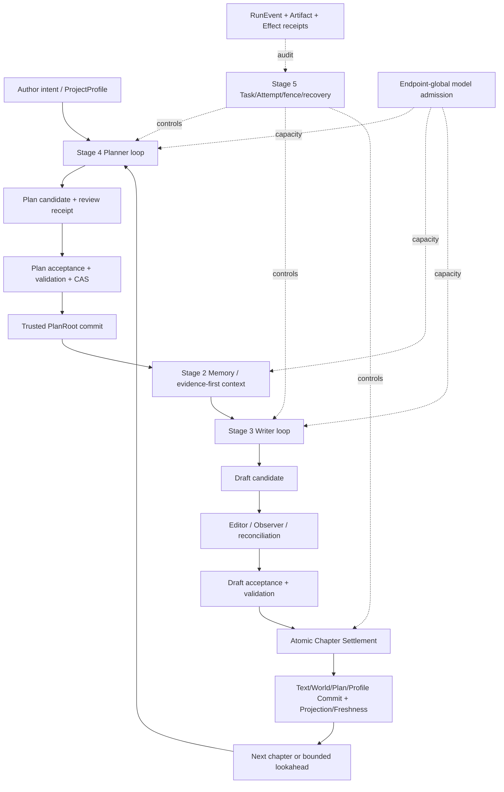
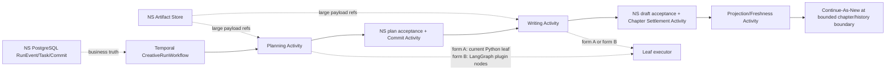

# Stage 2～5 统一长期运行 Agent 系统收敛与执行规划

> Lifecycle: `ACTIVE`
>
> Updated: 2026-09-02 +08:00
>
> Revision: `v8 / hierarchy and future-lock patch on ee8849a production baseline`
>
> Previous revision: `v6 / benchmark canary seam: shared replay, single assembly, frozen variables`
>
> Scope: Stage 2 最新闭合增量、Stage 3/4/5 未闭合能力、分支/工作树收敛、生产装配、V0.5 Writer 回答 benchmark、真实连续运行、恢复与受控自我纠错
>
> Current Gate: `INTEGRATION_WORKTREE_UNCOMMITTED / U1_LOCAL_CONVERGENCE_PRESENT / U2_U3_U4L0_GATES_PENDING / U4S0_NEXT / V0.5_SEED_NOT_STARTED`
>
> Governing authorities: `docs/README.md`、`docs/project_status.md`、ADR-0003/0006/0007/0008/0009/0010、Stage 3/4/5 总体设计与执行文档
>
> Predecessor evidence: `docs/stage2_to_stage5_real_novel_vertical_pilot_execution.md`
>
> Review input: `novel_agent_runtime_v2_langgraph_temporal_development_plan_20260817_v1.1.md`（外部附件，非仓库权威）
>
> Repair input: 2026-08-18 对本上位计划的 `REPAIR` 审核意见（已按当前代码合同取舍）
>
> Progressive-context input: 集成工作树中未跟踪的
> `docs/stage2_model_budget_runtime_policy.md`（`PROPOSED`）；U4-L0 接线已实现，但本文
> 不把未提交代码或未经真实模型验收的结果写成 Gate PASS
>
> Successor: 本文原位维护至统一系统 Gate U8；通过后由 `docs/project_status.md` 与一份不可变验收结果接管，不预建第二份路线图

## 0. 执行结论

当前仓库不是“尚未集成的四套原型”，也不需要以 Temporal 或 LangGraph 为名重写一次。主线
`c51bbeb` 已经包含 Stage 3 Writer Context Loop、Stage 4 Planner Context Loop、Stage 5
Task/Attempt/accept/commit/recovery/两路有界调度的主体；Stage 2 完成提交 `0bc7757` 是
`13b385c` 的单一线性后继，相对主线共前进五个提交。该提交让 Planner fallback 后继续 evidence
path，透传状态并标注语义状态，补齐对应回归测试和真实模型服务启动脚本。用户报告相关单测
`169 passed` 且 Ruff PASS。现在 `0bc7757` 已附着到正式本地 ref，且
`codex/unified-agent-runtime-integration` 已在独立工作树中 ff 到该 HEAD。根工作树未被修改。
但 U2/U3/U4-L0 及 V0.5 接线全部仍是该集成工作树的未提交变更，任何正式 Gate
都还没有 PASS。

在 `ee8849a` 生产基线上，另有一条不改 V0.5 语义的 hierarchy/Skill 补丁：Gate 0 → Patch A
future-lock → Patch B PlanLevel → Patch C 有限 Progressive Skill。规范已写入 Stage 4/5 设计；
审查底稿是 `docs/Novel-System_分层规划与渐进Skill_收敛版补丁执行设计_v2_ee8849a.md`。
8 个 pytest 准入场景是该补丁的 Gate，真实 0–25/0–50 长跑不插入 Patch 之间。

下一阶段的真实任务是依次关闭四类缺口：

1. **代码与文档基线收敛**：把最新 Stage 2 增量附着到正式引用，证明其与 Stage 3/4/5 兼容；
   对旧工作树逐一判定“已吸收、仅迁移断言、保留审计”，不整枝盲合并。
2. **唯一生产装配**：为已有 `ProductionRuntimeAssembly` 提供仓库自带、可重复启动的唯一 factory、
   manifest 与 preflight，使 CLI 和 vertical runner 真正运行同一组对象。
3. **Stage 3/4/5 产品闭合**：先冻结 U4-S0 campaign，再补 U2 production-path
   证据和 U3 crash/uncertain/reparse 矩阵。U4-L0 已有 effective budget、Controller C1/C2
   和 Memory Planner P1 接线，但还要修正本文§12 列出的持久预算、reasoning 默认、
   Controller 压缩和 P1 选择证据缺口，并跑真实单因素 canary；然后才是
   U4-L1/L2、U4-S、C20→25 与 20/50 章。
4. **目标 Runtime 与长期运行**：ADR-0010 固定 Temporal 外层 + LangGraph leaf 为
   长期目标，现有 PostgreSQL Runtime 是迁移生产基线。U3 后先做隔离 U3.5 Spike，
   分别验证 Activity-wrapped 与 plugin-integrated leaf；再在 PG 基线上完成 5/20/50 章和
   故障证据，U7 只决定接入形态、迁移范围和 cutover 时机，不重新表决目标。
5. **Writer 端到端证据**：V0.5 Track A/Track B 都由真实 Writer 作答；冻结 WCP 只作
   Memory 中间诊断。seed 可用于定位工程问题，但只有独立第二标注与 judge 校准通过后才能形成
   formal Gate。

本文把“真正的 Agent 系统”定义为：Planner、Memory、Writer、Editor/Reviewer、Observer/Curator
可以在有界预算内连续协作；所有候选都经 validation/acceptance/CAS/Commit 才改变可信状态；进程
中断后能从 durable state 恢复；技术失败能确定性重试或对账，语义失败能局部重取/重写/重规划；
prompt、Skill 或代码修复只能形成隔离候选，绝不在运行中热改 active 系统。

## 1. 规划依据与事实边界

### 1.1 使用的证据层级

本规划按以下顺序解释冲突：

1. accepted ADR 与不可变真实运行产物；
2. 2026-08-20 集成工作树代码、Git ref、工作树与 schema 事实；
3. `docs/project_status.md` 和当前 Stage 3/4/5 设计/执行文档；
4. 2026-08-16 实现架构评审；
5. ADR-0010 采纳的 Runtime v2 目标和 2026-08-18 `REPAIR` 审核意见；
6. 2026-08-17 LangGraph/Temporal 报告附件。

旧报告以 `6a195e0` 为代码基线，提出的方向需要逐条映射到今天的 owner。报告正确识别了生产装配、
raw-before-parse、故障恢复、分层自我修复和真实长跑的重要性；但其中若干“待建设”能力已经由
Stage 5 主线实现，若干建议会与现有 Task/Attempt、RunEvent、EffectReceipt、FailurePolicy 和
Artifact owner 重复。因此本文采用其问题定义和长期目标，不照搬其类名、目录和迁移阶段。

### 1.2 2026-08-20 代码与 Git 快照

| 对象 | 当前事实 | 对规划的含义 |
|---|---|---|
| 主线 | `main` 与 `codex/stage2m-semantic-closure` 均在 `c51bbeb` | Stage 3/4/5 集成不是待合并孤岛 |
| Stage 2 完成提交 | `codex/stage2m-need-evidence-closure` 已指向 `0bc7757`；它是 `13b385c` 的单一后继，相对主线前进五提交 | U1 ref 与 ff 动作已做；不等于 U1 整体 Gate PASS |
| Stage 3/4/5 集成 | `9fc27ac`、`e84f3b0`、`7b1f919` 等已进入主线 | 不重新合并已吸收的候选分支 |
| 当前根工作树 | 有用户的 AGENTS、文档、脚本及未跟踪修改 | 不在此树执行合并、清理或批量格式化 |
| 集成工作树 | `.worktrees/unified-agent-runtime-integration`，分支 `codex/unified-agent-runtime-integration`，HEAD=`0bc7757`；U1～U4-L0/V0.5 大量代码和 schema 未提交 | 本文后续代码级计划的唯一实现基线；不从根树拷回旧改动，不把未提交 diff 写成 accepted source |
| clean-Genesis 工作树 | HEAD=`0bc7757` detached；源码提交外仍有 `.agent/`、私有 benchmark、`.conda-env`、ADR/运行诊断文档等未提交材料 | 源码提交与审计/运行材料分开归属；不能直接删除或把后者补进源码提交 |
| 私有 benchmark bundle | `.worktrees/clean-genesis-6a195e0/benchmarks/private` 是指向根树 `benchmarks/private` 的符号链接，物理上只有一份，`.gitignore` 覆盖 | 两棵树看到同一批数据，不存在“两份 benchmark 真源”；但在任一棵树里构造都会改动同一份，删除 worktree 前必须先确认链接方向 |
| LangGraph | `langgraph 1.2.x` 与 PG checkpointer 依赖已锁定；源码已有两个 `StateGraph` | 只迁移有真实收益的 leaf loop，不建设第二业务真源 |
| Temporal | 仓库无 `temporalio` 依赖、workflow 或 worker；ADR-0010 已固定长期目标 | 从隔离 U3.5 Spike 开始；当前不存在“切换开关”，PG 是迁移基线 |
| 生产装配 | `production_bootstrap.build_production_assembly()`、spec、preflight、attestation 和 fake one-chapter test 已在未提交 diff | 不再建 factory；补 isolated production-path run、resolved identity 及无旁路证据后才可结算 U2 |
| 恢复 | `FailureClass/Policy`、Task/Attempt/fence、checkpoint、effect reconcile 已存在 | 扩展现有 owner，不新增通用 Failure 平台 |
| 模型预算 | `EffectiveBudgetResolver`已接 ModelGateway/API/admission，production spec 提供 8000 default；但 durable ledger 未保存 `EffectiveBudgetResult`，`enable_thinking=None` 与 adapter 默认开 thinking 的 reserve 语义不一致 | U4-L0 接线已完成、Gate 未过；先修可审计与 reasoning 语义，再跑真实单因素 canary |
| Controller 观察 | `ControllerObservationAssembler` 已默认组装 C1+C2，C3=`NOT_ADMITTED`；但 teacher-forced caller 仍手算 input capacity，紧张预算可把 mandatory preview 清空仍标 C1+C2 | 让 assembler 消费同一 resolved capacity；无最小 mandatory preview 时 typed stop 或如实降级，不伪报 C2 |
| Stage 2 Memory Planner 回源 | `PlannerSourceExpander` 已沿 `evidence_refs` 做 P1 cutoff/commit/root-safe L0，paired E2E 已传 TextRoot/snapshot；但当前只按 record 类型/存储顺序取前 12，还没有 high-priority 选择证据和 durable telemetry | 保留 P1，补稳定优先级、paired regression 与 receipt/report；P2 继续不做 |
| U4-S0 | `V05ReadoutCampaignManifest`、freeze CLI 和 fake campaign identity 已在 diff；尚无真实 seed manifest | 下一实现动作是用 resolved assembly/endpoint 事实冻结一份不可覆盖 seed manifest，不先看分数 |

### 1.3 不再作为当前权威的材料

下列材料可以用于 provenance 或迁移断言，但不得指导整枝合并或重新设计：

- Stage 3 A/B/C/D 旧工作流及其 `writer_shadow`、旧 integration runner；
- claim-first Stage 2M、Gold/evaluator 默认产品线和旧 M4/WP8 next action；
- 把 Stage 3/4/5 视为尚未相互接入的 2026-08-12 以前状态；
- 以固定 24 drafts、32 Needs、48 calls 充当产品完整性的旧上限；
- 把 Temporal–LangGraph 集成描述为不存在，或把它描述为稳定生产接口的材料。

这些文档不批量删除。`docs/README.md` 已标为 `SUPERSEDED/HISTORICAL` 的继续留作审计；只有在
相关分支关闭且有替代链接之后，才可由 Codex单独调整 lifecycle。

## 2. 统一目标架构

### 2.1 一条可信提交链，三层运行控制



三层 admission 必须继续分责：

- Task claim/fence 决定哪个 Attempt 有运行权；
- project single-writer lane 决定哪个 generation 能推进同一本书的 Canon；
- `ModelRequestAdmissionController` 决定哪个模型请求能占用 endpoint request/KV 容量。

Temporal 或 LangGraph 都不能把这三层合并成一个模糊的“workflow status”。

### 2.2 五类事实及唯一 owner

| 事实 | 唯一 owner | 禁止的替代真源 |
|---|---|---|
| Canon/Plan/World/Profile/Text | CommitService + 五 Root + Project Commit | Graph checkpoint、Temporal history、LLM message |
| 运行状态 | RunEvent + Task/Attempt projection | 进程内 dict、LangGraph state 单独充当业务真源 |
| 外部副作用 | EffectReceipt + reconciler | “模型已经返回所以当作成功” |
| 大对象与模型原始结果 | ArtifactRepository | checkpoint 内嵌全文、仅保存 hash 不保存内容 |
| Agent 工作上下文 | WCP/Planner package + event-derived Context View | 可变 conversation history |

### 2.3 “长期运行”的可验证含义

长期运行不是单个 Python 进程持续不退出，而是满足：

1. 每一层均有稳定 identity、basis、policy/permission pin 和 Artifact 引用；
2. 任何进程被 kill 后，新进程只读取数据库、Artifact 与 event 即可判断从哪里继续；
3. 已 settle 的模型调用、接受、Commit 与外部 Effect 不因 replay 重做；
4. 未知 Effect 先 query/reconcile，不能用 retry 猜测；
5. 章节链可跨日运行，历史增长后能做 checkpoint/history continuation，而不丢审计；
6. operator 能 pause/resume/cancel/extend budget，但不能绕过 validation/acceptance/Commit。

### 2.4 “自我纠错”的四级边界

| 级别 | 允许的动作 | 当前/未来 owner | 是否可自动改变可信状态 |
|---|---|---|---|
| L0 技术恢复 | provider transient retry、schema reparse、checkpoint resume、effect reconcile、projection rebuild | Model Gateway、RuntimeRecovery、Projection/Freshness | 否；只恢复同一意图 |
| L1 局部语义修复 | REQUEST_MEMORY、Editor local repair、Writer rewrite、Planner replan | Stage 2/3/4 现有 loop | 否；仍产生 candidate |
| L2 运行策略纠偏 | basis/freshness 失效后 supersede/replan、poison-loop 停止、budget review | Stage 5 FailurePolicy/Supervisor | 否；受 command 与 Gate 约束 |
| L3 系统演化 | prompt/Skill/policy/code 修复候选、held-out、canary、显式 promotion | 离线 Codex–DSH 开发循环 | 只有通过现有发布/接受过程后 |

不在长期运行进程中直接修改 Python、active prompt、active Skill 或数据库 schema。所谓“代码自修复”
仅指：运行证据形成可复现 incident → 隔离工作树产生候选 patch → deterministic/real gate → 人类/Codex
接受与部署。没有证据时不建设 RecoveryReasoner；确定性 `FailurePolicy` 能唯一决定动作时也不调用模型。

## 3. Stage 2～5 当前完成度与闭合项

### 3.1 Stage 2：实现与源码提交已完成，正式引用/下游集成待收敛

**正确且保留的部分**：

- deterministic real-hybrid Memory Gateway 与 Canon/future-isolation 边界；
- evidence-first WCP + exact L0 slices + Evidence Ledger；
- 真实 P001-P005 v5 运行已证明包可读取、Evidence/Ledger 非空且未恢复 Claim/Gold 默认路径；
- ADR-0009 诚实区分 `assembly_status`、`semantic_status`、`usable_with_gaps` 与未闭合 facet；
- Planner/Need generation 与 semantic judgment 采用 capacity-driven batching，不把固定条数伪装成产品能力。
- `0bc7757` 已关闭 Planner fallback 硬中止：fallback 后 evidence path 继续，状态与语义标注透传；
- 用户报告该完成提交的相关单测为 `169 passed`、Ruff PASS；这不是对 U1 下游兼容或全仓质量门的替代。

**本阶段只关闭以下收敛项**：

1. 为 `0bc7757` 建立正式分支/标签引用，保存其五个提交与 real-run provenance；
2. fast-forward 到统一集成分支，运行 Stage 2 schema、WCP v2、Stage 3 request factory 和 Stage 4
   inquiry handoff 合同测试；
3. 将 ADR-0009、最新真实运行结论和 `project_status` 对齐；
4. 证明新增状态字段对 Stage 3/4/5 是 additive/显式消费，而不是 silent default；
5. 保留 v5 与历史输出只读，新运行使用新 experiment/output root。

Stage 2 闭合不等于“每个 mandatory facet 都 SUPPORTED”。本阶段接受的产品定义是：结构安全、引用
可信、状态完整，完整则声明完整；有缺口则明确 gap 仍可用；不可判定则 `UNRESOLVED`，不伪装 READY。
除非兼容测试暴露回归，不再启动新的 Stage 2 架构改造。

2026-08-19 发现的预算/渐进式上下文问题不改变 evidence-first WCP、Need–evidence 语义或
Stage 2 验收结论。它是现有 ModelGateway、Memory Controller 和 Memory Planner 向 Stage 3/4
交付真实决策上下文时的执行缺口，统一收入 U4-L0；不把 Stage 2 重新变成开放式
平台项目。

### 3.2 Stage 3：主体已集成，关闭信任与真实语义 Gate

当前正确事实：

- exact Editor Context 已在 candidate settle 前记录，2026-08-16 评审指出的 identity 问题已修复；
- `EDITOR_PENDING`、`OBSERVER_PENDING`、`RECONCILIATION_PENDING` 均可 checkpoint/resume；
- major rewrite 已使用独立 mode/prompt；
- Writer 只能产生 candidate，不能直接 Commit。

仍需关闭：

| ID | 缺口 | 当前代码 owner | 最小修复 | 接受证据 |
|---|---|---|---|---|
| S3-1 | gateway/Attempt ledger 聚合代码已在 diff，但 reactive Memory/早期 Writer turn 与 SQL reconstruction 未经故障矩阵 | `services/writer_context_loop.py`、Model Gateway/SQL ledger | 修 SQL attempt/phase 持久差异，用 request/attempt 故障证据验证聚合 | 注入多轮 REQUEST_MEMORY 与进程重建后，report 调用数/token/cost 与 durable ledger 一致 |
| S3-2 | planned/selected/completed Skill receipt 代码与 focused test 已在 diff，尚无 production leaf 证据 | `services/writer_cognition.py`、Skill receipt contract | 保持现有语义，在 U4-L1 对照实际 Skill 输出/artifact | 未执行 Skill 无 succeeded/completed；执行后可追到 artifact/evidence |
| S3-3 | 旧分支中部分 schema/golden 断言未在主线保留 | 当前 Stage 3 contract/evaluation tests | 只迁移仍保护现行接口的断言，不恢复旧 runner/shadow 路径 | 每条迁移断言有现行 caller；无旧 production entrypoint |
| S3-4 | 真实模型/真实基础设施语义 Gate 未通过生产 assembly 运行 | Stage 3 evaluation + vertical runner | 用 C20→25 生产请求旁路生成 Stage 3 leaf report | continuity、plan obedience、evidence use、Editor repair、无未来泄漏均有 artifact |

### 3.3 Stage 4：主体已集成，关闭检索成熟化与七模式 Gate

当前正确事实：

- 独立 `PlanningInquiryConditionedNeedGenerator`，没有泛化 Writer Need；
- rolling `CHAPTER_SET` 已进入 Stage 5 production factory；
- Planner turn 支持 `PLAN_READY | REQUEST_MEMORY`，可 checkpoint/yield/resume；
- Plan candidate 经 reviewer 与 acceptance 后才 materialize/Commit。

仍需关闭：

| ID | 缺口 | 当前代码 owner | 最小修复 | 接受证据 |
|---|---|---|---|---|
| S4-1 | relation/causal route 仍固定并发 Typed Graph + Anchor BM25/Dense | `domain/retrieval_routing.py` 与现有 retrieval owner | 先 Anchor，只有未闭合 relation/causal facet 才 depth 1–2 Graph expand，再由同一 RRF 融合 | 同 corpus 消融证明质量不退化且无无效 Graph 调用 |
| S4-2 | tool boundary 返回完整 hit，未实现 compact handle→exact expand | `tools/retrieval.py`、Artifact/L0 resolver | 第一阶段返回小 handle/provenance；最终选中项才精确展开 L0 | token/latency 降低，最终 evidence、basis 与 trace 等价 |
| S4-3 | 生产路径只证明 `CHAPTER_SET`，七模式未获真实 Gate | Stage 4 evaluation/service | 先对真实 caller 需要的 CHAPTER_SET/CHAPTER/REPLAN 取证，再跑全七模式离线/受控真实套件 | 每模式有 request、Need、package、review、candidate/failure receipt |
| S4-4 | raw-before-parse/ledger/report rebuild 代码已在 diff，尚未在 Planner/Memory crash 矩阵中证明 | Model Gateway/SQL ledger + Stage 4 report | 复用阶段 C durable 证据，不再新建 Stage 4 计费器 | report 可由 ledger/artifact 重建，parse crash 不重复计费 |
| S4-5 | C1+C2/P1 调用链已在 diff；Controller capacity/最小 mandatory preview 和 P0/P1 同选择、durable telemetry 未闭合 | `controller_observation.py`、`agents/controller.py`、`plan_conditioned_need_planner.py`、`planner_source_expander.py` | 按§12 阶段 E1 修现行 owner；C3 仍 `NOT_ADMITTED` | 停止决策可见如实 bounded content；P1 与 P0 同 selection 且 cutoff/source/snapshot safe；telemetry durable |
| S4-6 | `EffectiveBudgetResolver` 已接 API/admission，spec 有 8000 default；durable ledger/reasoning-default/Controller capacity 仍未共用完整结果 | ModelGateway + provider adapter + SQL ledger + Controller caller | 持久同一 `EffectiveBudgetResult`，统一 None/default-thinking，删手算 capacity | payload/admission/ledger/report 值一致；每次有 `budget_source`；strict 无来源不发请求 |

S4-1 与 S4-2 必须用现有检索所有者完成；不新增第二个 Fusion、Graph service、向量库或通用检索 DSL。

### 3.4 Stage 5：工程闭环已在主线，关闭生产装配与真实长期运行

当前正确事实：

- 固定 Plan→Write→Accept→Commit 拓扑、Task/Attempt/fence、failure budget、两路 dispatcher 已实现；
- Stage 2W Chapter Settlement 作为 Attempt-scoped outer effect，可与 Commit 幂等 receipt 对账；
- AUTO 可从 durable `WAITING_INPUT` 恢复；
- lookahead 在 Draft Commit/Freshness 后 promote/replan/supersede，失败时不阻塞 foreground；
- `RuntimeRecoveryService` 从 settled checkpoint 恢复，并对 uncertain effect fail closed。

仍需关闭：

| ID | 缺口 | 当前代码 owner | 最小修复 | 接受证据 |
|---|---|---|---|---|
| S5-1 | repo-owned `build_production_assembly`、spec/preflight/attestation 代码已在 diff，尚无 isolated production-path Gate | `runtime/production_bootstrap.py`、CLI/vertical runner | 不再建 factory；跑阶段 B 唯一入口、identity 负例和 fake one-chapter | 对象 identity、DB/object root、manifest、model policy、roots 均可审计；fixture fail closed |
| S5-2 | `Stage5DevelopmentManifest` 仍带隔离 A-layer 语义，最新 Stage 2/3/4 identity 未冻结 | `domain/stage5_manifest.py` 与 manifest JSON | 先更新当前 production contract version/来源；只有 feature Gate 通过才改 admission | manifest load + assembly + frozen request report 对齐 |
| S5-3 | 真实 C20→25 尚未执行 | vertical runner/CLI | endpoint 资源授权后串行 AUTO 首跑；失败只修失败层 | 5 章 accepted Commit、next reads prior generated prose、零未来泄漏/半提交 |
| S5-4 | 20/50 章 crash/restart、poison/budget/effect 故障矩阵未形成真实证据 | RuntimeRecovery、commands、fault harness | 在同一 production assembly 逐项注入，不造第二 runner | settled 层不重跑、旧 fence 拒绝、effect 不重复、projection 可重建 |
| S5-5 | raw artifact/SQL ledger/reparse 代码已在 diff，尚缺进程重建和 uncertain 矩阵 | Model Gateway + ArtifactRepository + SQL ledger | 按阶段 C 修 attempt/phase 持久并注入 crash | parse crash 后不二次调用 provider；敏感数据仍按现有 artifact policy |

### 3.5 跨 Stage 的唯一未闭合链

不把以上缺口拆成彼此独立的长期项目。依赖顺序固定为：

```text
Stage 2 ref/contract convergence
  -> production assembly
  -> raw/ledger/receipt trust repairs
  -> U3.5 Temporal feasibility Spike
  -> Stage 3/4 leaf Gate + independent V0.5 seed/formal tracks
  -> C20→25 vertical Gate
  -> C0→C300 + 20/50 chapter + 2-project recovery evidence
  -> target Runtime form/scope/cutover Gate
  -> staged cutover or explicit open deferral + controlled self-evolution
```

前一层未通过时，后一层只能做不改变默认路径的 isolated spike。

### 3.6 V0.5 benchmark：贯穿整合期的产品证据面

本阶段使用 `benchmarks/private/ztj_novelmem_v0.5`，但必须如实继承它当前的生命周期：
`0.5-seed.2 / seed_not_formal_release`。构建与独立边界验证已经通过，只证明 bundle、标注边界和
运行协议内部一致，不证明新增长窗口已完成独立复核，也不证明 LLM judge 已校准，更不等于当前
production runner 已经能执行这些 case。

V0.5 的冻结事实如下；这些是实验协议，不上升为产品架构常数：

| 对象 | 冻结事实 | 规划用法 |
|---|---|---|
| 连续输入 | 序章至 C300 只顺序写入一次；16 个公开 checkpoint | U6 必须做一次连续 replay，禁止逐 checkpoint 重建索引 |
| Track C/D canary | C-ROLL 20 计划 case + D-SHORT 20 单章 Writer case + 每章四条件；构造路径见 `docs/novelmem_ztj_v0.5_benchmark_development_plan.md` | 这些 case 需要 16 个公开 checkpoint 之外的 `N−1` 断面，冻结集合是 `公开 checkpoint ∪ 入选 N−1`；仍是同一次连续 replay，不是第二条回放路径 |
| Track A | 15 个 checkpoint、51 道 QA；C300 仅 QA | 明确问题在 freeze 后揭示，真实 Writer 返回 `answer + evidence` |
| Track B | 15 个 checkpoint；5 个原 5 章窗 + 10 个 20 章窗；每点两种 profile | 无显式问题列表，由真实 Writer 回答下一窗口所需的历史约束 |
| 长窗计划 | 每窗总目标、4 个阶段、阶段推进/转折和逐章目标 | 只为 `author_plan_conditioned` 在 freeze 后释放；不是产品固定窗口算法 |
| Track B Gold | 111 条：旧 47 + 新 64；81 `span_exact` + 30 `chapter_only` | 旧条目保留精度标签；不得把 chapter-only 报成 span retrieval 命中 |
| 因果标注 | `author_plan_link -> historical_evidence -> memory_need -> target_realization` | 证明“为什么此时 Writer 应知道”，target realization 永不进入 SUT |
| 发布缺口 | 新 64 条待独立第二标注者；judge 待至少 100 条多系统回答双标校准 | 可先做 seed diagnosis；缺口关闭前不得称 formal Gate 或论文结果 |
| 运行缺口 | V0.5 尚未进入 production runner manifest | U2 只做薄 adapter，复用现有 WCP、freeze、ledger、evaluator 与 stage-loss owner |

用户对本执行阶段追加了比当前 V0.5 README 更强的产品要求：**两条 Track 最终都由真实 Writer
作答**。因此必须区分三个观察层，禁止用 Memory 自评代替 Writer 可用性：
本文将该评测调用命名为 `WriterContextReadoutProbe`：它使用真实 Writer 模型角色和
production ModelGateway 来回答，冻结现行 `qa_response` 或 `ContextWriterResponse` 评测 artifact，
但不是生产创作正文 loop，不经 Editor/acceptance/Commit。“Writer readout”是产品观测角色，
不新增第二份 response DTO。

```text
frozen production memory state
  -> retrieved/assembled WriterContextPackage v2
  -> Writer benchmark answer (frozen before Gold reveal)
  -> Answer / semantic support / evidence support evaluation
```

- Track A 沿用现有 `qa_response.schema.json`：Writer 看见 freeze 后的问题和 Writer-safe Context，返回
  答案与最多 20 个证据；问题、答案、judge 结果全部是 evaluation side channel，不写回 Memory。
- Track B 需要一个最小的 `context_writer_response` 合同：Writer 不看 Gold、target realization 或固定
  答案条数，只返回它认为目标窗需要的历史结论、相应历史证据和显式 gap。该输出是产品主结果。
- 冻结 `WriterContextPackage` 的 semantic/grounded/mandatory/weighted recall 继续保留，但降为
  Memory 诊断层；Writer answer 另报端到端结果。两层差值用来定位“Memory 未交付”还是“Writer
  看见但未使用”，不把两层分数相加成单一总分。
- 新合同不得改造创作正文 `WriterTurnOutput`，不得写入 Canon/Memory，也不得另写语义不同的 Track B
  scorer。它通过同一 ModelGateway、raw artifact、冻结 receipt、Gold matcher 和 semantic/evidence
  verifier 做薄适配；只有 response schema、prompt 和 Writer-answer artifact 是新增责任。

V0.5 的研究依据只限定设计方向，不替代本项目证据：[DOC](https://arxiv.org/abs/2212.10077)
支持细粒度层级大纲控制，[DOME](https://arxiv.org/abs/2412.13575) 支持动态层级规划与记忆结合，
[CAME-Bench](https://aclanthology.org/2026.findings-acl.584/) 支持按上下文意图抑制相似但不合意图的历史，
[ENPMR-Bench](https://aclanthology.org/2026.findings-acl.2080/) 支持
对潜在需要做主动检索。它们不证明 20 章、4 阶段或每窗 6～8 条 Gold 是普适最优；这些数字只属于
本版本冻结协议。逐项边界以 V0.5 的 `RESEARCH_ALIGNMENT.md` 为准。

benchmark 进入正式验收前必须依次关闭四个 readiness gate：

1. **R-BUNDLE**：现有 build 与独立 validator 在同一 source/version 上 PASS，输出计数与 manifest 一致；
2. **R-ANNOTATION**：独立第二标注者逐条复核新 64 条，争议完成 adjudication，发布新不可变版本；
3. **R-JUDGE**：至少 100 条多系统 Writer 回答完成双人标签，人工一致率至少 90%、Cohen's kappa
   至少 0.8；Answer Judge 与 Evidence-Support Judge 分开锁定模型、prompt、版本和失败策略；
4. **R-RUNNER**：全部 51 道 QA、30 个 Context 输入都能由 production manifest 到达真实 Writer，
   freeze/reveal/discard 边界和报告 lineage 可重放。

R-ANNOTATION/R-JUDGE 需要独立人工工作，缺失时不阻止 U1～U3 的确定性集成，也不阻止明确标为
`seed_diagnostic` 的真实模型试跑；但会阻止 U4 formal benchmark PASS、阈值冻结和对外结论。

### 3.6.1 benchmark 构造与本规划的分工

V0.5 的 Track C/D canary 有自己的开发计划（`docs/novelmem_ztj_v0.5_benchmark_development_plan.md`），
本规划不重复它的工作包。两者的接缝只有三处，必须一致：

1. **回放**：canary 需要的 `N−1` basis 由 U6-A 的同一次 C0→C300 连续 replay 冻结，
   benchmark 侧不得自建第二条 replay。
2. **装配**：canary 的真实 Writer/Planner 调用由 U2 的唯一 production factory 装配，
   benchmark 侧只提供薄 adapter（`WriterContextReadoutProbe`、`OracleWriterInputAdapter`）。
3. **变量冻结**：四条件 canary 的 effective budget、Controller C-level、Planner P-level 和
   thinking/output policy 由 U4-L0 给出并记名冻结在 canary manifest 里。

由此得到 benchmark 侧的执行线划分：本轮不在 dirty 根工作树构造或回写私有 bundle。
选章、case、Oracle 标注、manifest/validator 只在人类明确指定的 benchmark 物理目录/输出根中执行；
当前代码、schema 和运行接线只在 integration worktree 完成。任何 production replay、assembly 或
真实模型运行必须满足阶段 B/C 前置和 endpoint ownership。

canary 的 `0.5-seed.2` 数据不是 formal benchmark，也不是 U5/U6 工程证据的替代或前置：
U5/U6 的长跑与恢复证据独立成立，U4-F 的正式验收另有闸门。

## 4. 分支与工作树收敛方案

### 4.1 总原则

1. 不在当前 dirty 根工作树执行 merge、rebase、worktree remove 或 branch delete。
2. `0bc7757` 已建立可追踪 ref 并 ff 到 integration branch；任何 cleanup 仍须单独人类授权。
3. 已成为主线 ancestor 的分支不再 merge；旧分支即使 `git cherry` 显示 `+`，也必须按文件与行为
   判断是否被后续重组吸收，不能按 hash 判断功能遗漏。
4. 旧分支中仍有价值的测试只迁移断言到现行 owner；不得为了保留测试而恢复旧 runner/schema 路径。
5. 分支删除与 worktree 删除不是本文自动授权的实现动作；完成审计、确认无 dirty 文件并由人类接受
   后另行执行。

### 4.2 目标分支拓扑

```text
main@c51bbeb
  └─ attach codex/stage2m-need-evidence-closure@0bc7757
       └─ codex/unified-agent-runtime-integration
            ├─ U1 baseline/ref + benchmark protocol convergence
            ├─ U2 production assembly + V0.5 thin runner wiring
            ├─ U3 trust/raw/ledger/receipt closure
            ├─ U3.5 isolated Temporal feasibility spike
            ├─ U4-L0 budget/context closure + U4-L1/L2 Stage 3/4 leaf gate
            ├─ U4-S seed Writer readout
            ├─ U5 C20→25 pilot
            ├─ U6 continuous replay + long-run recovery + 2-project smoke
            ├─ U7 target Runtime migration/cutover gate
            └─ merge to main only after each gate evidence is reviewed
```

U3.5 在 U3 PASS 后使用新的短期隔离分支/namespace；U7 再从已通过 U6 的受审基线
开始正式对照。Temporal 依赖不进 PG production spec，也不创建长期兼容层。

### 4.3 各 ref 的处理决定

| Ref / worktree | 与 main 的关系 | 决定 | 完成条件 |
|---|---|---|---|
| `codex/stage2m-semantic-closure@c51bbeb`（当前根） | 与 main 同点，dirty | 保留用户工作；不作合并工作树 | 文档改动单独审阅后再决定提交 |
| detached `0bc7757`（clean-genesis） | `13b385c` 的单一后继；正式 ref 与 integration ff 已建立；工作树仍有未提交审计/运行材料 | 保留 provenance，不再执行 attach/ff | 源码范围与 169 tests/Ruff 证据已记；dirty 文件逐项归属后由人类决定 cleanup |
| `codex/stage2b-writer-shadow@ef44900` | 旧 docs-only 独有提交 | 不合并代码；仅保留 handoff provenance | `docs/README.md` 指向现行 Stage 3 文档后可归档 |
| `codex/stage3-context-contract@1b926f5` | main ancestor | 已吸收，不合并 | 记录 ancestor 证据 |
| `codex/stage3-writer-context-loop@bab4451` | main ancestor | 已吸收，不合并 | 现行 Stage 3 focused tests 覆盖 |
| `codex/stage4-planner-context-loop@0dcf17a` | main ancestor | 已吸收，不合并 | 现行 Stage 4 focused tests 覆盖 |
| `codex/stage5-long-running-runtime@b852df6` | main ancestor | 已吸收，不合并 | 现行 Stage 5 runtime tests 覆盖 |
| Stage 3 acceptance/editor/evaluation/writing-core/integration 旧分支 | 有旧式独有提交和 old-only schema/runner/tests | **禁止整枝合并**；做 assertion salvage audit | 每个 old-only 文件标为 obsolete 或把有效断言迁到现行 caller |
| `*-monolith` 分支 | 早期单体候选 | 不合并；仅用于 provenance diff | 证明主线当前 owner 覆盖其已接受行为 |
| detached try-ceiling / benchmark 工作树 | 诊断或资源试验 | 与产品集成隔离 | 运行材料有归属；不携带进 main |

### 4.4 可执行的收敛步骤

**B0 — 不可变盘点**

- 记录所有 worktree 的 path/ref/HEAD/dirty 状态；
- 记录 `main..ref` ahead/behind、old-only paths 与 ancestor 关系；
- 盘点输出直接返回给 Codex/人类审阅，不生成新的治理报告或 `.agent` 状态。

**B1 — 保存最新 Stage 2 identity（本地已完成，不重做）**

- `codex/stage2m-need-evidence-closure` 已指向 `0bc7757`；后续只做只读 identity 核对；
- 不把 clean-Genesis 的 `.agent/` 审计文件、私有 benchmark、`.conda-env`、未提交运行诊断文档或运行根补入 Stage 2 源码提交；
- ADR-0009 与必要的 immutable result 由 Codex 选择性纳入文档库。

**B2 — 建立干净集成工作树（初始 ff 已完成，不重做）**

- `codex/unified-agent-runtime-integration` 已从 `main@c51bbeb` ff 到 `0bc7757`；
- 该树当前 dirty 是 U1～U4-L0/V0.5 未提交实现，必须原地保留和审阅；
- 不再执行 merge/rebase/ff 或新建同名 worktree；若 HEAD 不再是 `0bc7757`，先停止解释来源。

**B3 — Stage 2→3/4/5 兼容性 Gate**

- schema export/diff：新增字段是否 additive、required/default 是否与消费者一致；
- 运行 WCP v2→WritingLoopRequest、Planner inquiry→retrieval、Stage 5 manifest/assembly 合同测试；
- 检查 `semantic_status/usable_with_gaps` 是否在 Writer 可见而不改变 acceptance/Canon 权限；
- 运行 focused tests、Ruff 和 strict MyPy。`make quality` 可跑一次作为全库诊断，但当唯一
  失败是当前约 98% 覆盖率未达全库 100% 门槛时，只记录 `COVERAGE_THRESHOLD_NOT_CLAIMED`，
  不为补行数生成无行为价值的测试。

**B4 — 旧 Stage 3 分支断言回收**

- 对 old-only `WriterDraftIntegrationRequest`、runner、golden manifest 与测试逐个回答：当前 caller 是谁？
- 无 caller 或已被 `WritingLoopRequest`/vertical runner 取代的，标记 obsolete；
- 能揭示现行 contract 失败的断言，重写到现行 test 模块；不复制旧生产代码。

**B5 — 审阅与主线合并**

- 收敛提交只包含 Stage 2 五提交、必要文档与现行 contract regression；
- 真实运行材料以 artifact ref/路径记录，不提交私有正文、`tmp/`、`volumes/` 或对象存储；
- Codex 审阅 PASS 后才合并 main；工作树/旧分支保留到 U4 通过后再请求人类清理决定。

## 5. 架构与技术选型修订

### 5.1 迁移生产基线不变

在 U1～U6 期间，默认生产候选继续是：

- Python 3.12 + Pydantic typed domain；
- PostgreSQL 作为 Commit、RunEvent、Task/Attempt、checkpoint/effect projection 的事务底座；
- ArtifactRepository/Object Store 保存正文、Context、模型原始响应和评测产物；
- OpenSearch + PostgreSQL typed edge + 唯一 Fusion owner 负责检索；
- `ModelGateway` 与 endpoint-global admission 负责全部模型调用；
- 显式 Python service 负责固定 Stage 3/4 领域循环，LangGraph 只作为可替换 leaf/subgraph adapter；
- Stage 5 Runtime 负责业务 topology、acceptance、Commit、recovery 和两路有界调度。

这套栈已经有现实调用方和大量回归证据。下一阶段先证明它能完成 5/20/50 章及 kill/restart，
为目标 Runtime 提供对照、workload 和 cutover fallback。“当前生产默认”不等于“长期目标未定”。

### 5.2 LangGraph 的准入边界

LangGraph 官方文档确认 checkpointer 可在 graph step 保存 state，支持 interrupt、pending writes、
fault tolerance 与 replay；也明确 replay 会重新执行 checkpoint 之后的 LLM/API/interrupt。因此本项目
采用以下边界：

1. 只有显式状态机复杂度已经造成重复 checkpoint/branch/recovery 代码的 loop 才迁移；
2. 首选 Writer 或 Planner 的单个 loop 做差分实验，不把顶层 Commit 链一次性图化；
3. Graph State 只保存小型 typed state 与 ArtifactRef，不保存正文、raw response 或完整 WCP；
4. 每个有副作用 node 继续使用现有稳定 effect identity 和 idempotency receipt；
5. RunEvent、Task/Attempt、Commit 仍是业务事实，Graph checkpoint 是恢复索引；
6. 迁移前后必须对同一 frozen request 产生等价 candidate/receipt/usage，不以“能运行”代替等价性。

官方依据：

- [LangGraph persistence](https://docs.langchain.com/oss/python/langgraph/persistence)
- [LangGraph subgraph persistence](https://docs.langchain.com/oss/python/langgraph/use-subgraphs)

### 5.3 Temporal–LangGraph 目标与集成形态

截至 2026-08-18，Temporal 官方 Python SDK 已提供 `temporalio.contrib.langgraph` 和官方 samples，
能把 Graph API node 或 Functional API task 放入 Temporal Workflow/Activity，并提供 retry、timeout、
crash recovery、signal/HITL、continue-as-new 等样例。这比 2026-08-17 附件中“Public Preview”描述更
具体，也使正式 POC 具有现实依据。

但官方 README 同时明确标注 **experimental release stage**，并规定：

- 每个 node/task 必须选择 `execute_in="workflow"` 或 `"activity"`；
- context 必须能由 Temporal payload converter 序列化；
- 在插件内若需要 LangGraph interrupt/checkpoint，应使用 `InMemorySaver`，由 Temporal 承担 durability，
  不再叠加 PostgreSQL/Redis 第三方 graph checkpointer；
- workflow 内执行的逻辑必须可重放且确定性，模型、数据库、文件和外部调用应落到 Activity。

官方依据：

- [Temporal Python SDK LangGraph plugin](https://github.com/temporalio/sdk-python/tree/main/temporalio/contrib/langgraph)
- [Temporal Python LangGraph samples](https://github.com/temporalio/samples-python/tree/main/langgraph_plugin)
- [Temporal Python SDK](https://github.com/temporalio/sdk-python)

插件成熟度只影响一种集成形态，不决定 Temporal 外层的采用。ADR-0010 的当前决定是：

| 时点 | 决定 |
|---|---|
| U1～U3 | PostgreSQL Runtime 保持唯一生产基线；补两种 Runtime 共需的 assembly/raw/ledger/receipt 能力 |
| U3.5 | 隔离验证 Activity-wrapped leaf 与 plugin-integrated leaf；不接管 production，不带私有正文/Gold 进 History |
| U4～U6 | PostgreSQL 继续产生真实 leaf、5/20/50 章、benchmark 和故障基线；不等待 Temporal cutover |
| U7 | 在预注册 Gate 下选择两种形态之一、缩小迁移范围或延期 cutover；不重新表决目标 |
| 对照未通过 | PG 继续生产基线，记录失败不变量并保持迁移 open；永久取消需新 ADR |

### 5.4 Temporal 的两种最小拓扑



Workflow 只持有 run/task/chapter/basis/policy/artifact refs 和小型进度，不持有正文。所有模型调用、
检索、Artifact、Commit、projection 与 effect query 都是 Activity 或现有服务调用。形态 A 的默认
恢复粒度是整个 leaf Activity，已结算 node/call 仍由现有 checkpoint/ledger/effect 防重；形态 B
可验证 node 粒度恢复。Temporal History 不替代 RunEvent；在真正 cutover 之前，Spike/POC 不接管
生产 scheduler。

### 5.5 不采用的技术动作

本阶段明确不做：

- 同时维护 PG、LangGraph PG checkpointer、Temporal 三套 durable truth；
- 为将来切换预建 `RuntimeBackend` 抽象、全局 feature flag 或双写框架；
- 为所有 leaf 预建一个通用 Runtime Port；只在当前 Python executor、LangGraph
  differential 和 Temporal Activity 已成为真实 caller 的单个 leaf 边界加窄 seam；
- 新建通用 FailureEnvelope/RecoveryAction DSL 覆盖现有 `FailureClass/FailurePolicy`；
- 以 RecoveryReasoner 重新判断所有已确定的 retry/reconcile 动作；
- 运行中自动安装 Skill、修改 prompt、提交代码或改变 schema；
- 为 100 章目标提前建设多集群、HA、通用 DAG、运维 UI、Neo4j 或新向量库。

## 6. 统一实施波次 U0～U8

每个波次都在一个现行 owner 上形成最小闭环。前一 Gate 未通过时，后一波次只能做只读设计或隔离
spike，不能改变默认路径。

### 6.0 2026-08-20 集成工作树实施状态

下表区分“代码存在”与“Gate 通过”。所有新代码仍未提交；因此不使用
`COMPLETE/PASS` 描述未经审阅的 diff。

| 波次 | 当前精确状态 | 进入下一状态所缺证据 |
|---|---|---|
| U0 | v7 已更新本文快照；其他权威文档尚未在本轮同步 | 只读对照 README/project status/ADR 没有冲突后才记 U0 PASS |
| U1 | Stage 2 ref 和 integration ff 已完成；消费者兼容代码/测试在 diff | focused contract/schema/Ruff/MyPy 证据与 old-branch assertion 归属审阅 |
| U2 | `build_production_assembly`、spec、preflight、attestation、fake one-chapter 代码在 diff | isolated DB/object root 中经唯一 production entry 跑一次，证明 CLI/runner 同 spec/attestation、无手工 root 旁路 |
| U3 | raw-before-parse、SQL ledger、receipt、durable rebuild 代码在 diff | sent/uncertain/raw/parse/restart 和 benchmark discard 故障矩阵；SQL ledger 的 attempt/phase/effective-budget 持久语义 |
| U3.5 | 未实现，且上一开发 slice 明确排除 Temporal | U3 Gate PASS、独立 namespace/task queue/DB/object root、SDK/plugin 版本与 fake/public payload 资源 |
| U4-L0 | budget/C1+C2/P1 调用链已接；C3=`NOT_ADMITTED`；无真实模型对照 | §1.2 所列代码缺口修复、单因素 lock 持久与真实 C0/C1+C2、P0/P1、thinking 对照 |
| U4-S0 | campaign domain/freeze CLI/fake identity 已存在 | 从真实 resolved assembly 事实冻结一份不可覆盖 seed manifest，预选代表任务并验证未发 model call |
| U4-L1/L2 | 未运行 | 所有 U4-L0 前置与独占/明确所有权真实 endpoint；分开 Writer/Planner leaf report |
| U4-S | 未运行 | U4-S0 manifest、U2/U3 production evidence、可用 Writer endpoint；先代表子集后 51/30 seed |
| U4-F | 未开始 | 独立第二标注、双人 judge 标签/校准和不可变 formal manifest |
| U5 | 未开始 | U2/U3/U3.5/U4-L 必要 Gate、endpoint ownership、C20 evaluation non-writeback |
| U6 | 未开始 | U5 五章 PASS；一次 C0→C300 basis replay、20 章、fault matrix、2-project、50 章按序取证 |
| U7 | 未实现 | U3.5 report + U6 20 章/2-project/fault PASS + 冻结对照 workload；不是当前代码接线任务 |
| U8 | 未开始 | U6 真实 incident corpus 和 U7 cutover/DEFER 决定；只补真实缺失 failure/repair owner |

**Temporal 未在上一轮实现的结论**：这是正确的 scope 和 Gate 结果。上一轮的人类任务边界
明确不实现 U3.5/U7；即使没有该边界，U3 也尚未用故障矩阵 PASS，所以 U3.5 不能开始。
U7 还额外缺 U3.5 report 和 U6 长跑基线，现在实现将无法冻结对照负载，只会产生第二套未经
验证的 orchestrator。U3 PASS 后，U3.5 应在隔离环境开始；它不等 U4～U6 的 PG 产品证据，
但必须在 U5 前完成并在 U7 前固结。

### U0 — 权威与现状冻结（本文）

**目标**：让所有后续实现使用同一事实基线。

**产物**：

- ADR-0009 进入主文档库；
- 本统一执行规划成为下一阶段 authority；
- `docs/project_status.md`、`docs/README.md` 和 Stage 5/技术选型文档对齐；
- 本文§12 给出唯一有序执行队列、代码 owner、验收证据和停止条件；
  不再依赖 `.agent/task.md`/`.agent/plan.md` 驱动本路线。

**Gate U0**：文档不存在互相冲突的 Stage 状态、默认 Runtime 或分支合并指令；所有新增链接存在；
没有把历史真实数字改写成新结果。

### U1 — 基线与分支收敛

**目标**：不重开已通过真实测试的 Stage 2，只证明“最新小增量 + 当前 Stage 3/4/5 +
V0.5 协议”可在一个基线上继续开发。

**入口**：U0 PASS；用户已说明最新 Stage 2 只是既有基线上的小幅修改。执行时仍要核对
ref 精确 identity，但不把这个核对扩大为架构复审。

#### U1-A：Git/ref 与工作树定界

1. B0～B2 的 attach/ff 已本地完成。后续只以只读命令记录 ref、ancestor、
   ahead/behind、worktree path 和 dirty 所有者；
2. 不再重做 attach/ff、merge/rebase；集成树现在 dirty 是未提交实现，不能因 U1 盘点而覆盖；
3. 对旧 Stage 3/4/5 分支只做 assertion-salvage 目录：现行 caller、已被替代的 owner、仍能
   保护现行不变量的断言；
4. 不删分支、worktree、私有 benchmark 或运行根，不在当前 dirty 根树 merge。

#### U1-B：Stage 2→3/4/5 消费者兼容性

按实际 caller 做 schema 与行为对照：

| 边界 | 需证明的行为 | 失败后唯一修复 owner |
|---|---|---|
| WCP v2 → Writer | `semantic_status`/gap/unresolved 对 Writer 可见，不被 `READY` 默认吞掉 | Stage 3 request/context factory |
| Planner inquiry → Memory | inquiry intent、basis、plan provenance 与 future boundary 保持 | Stage 4 inquiry handoff |
| Stage 2 → Runtime manifest | contract/source/config identity 被显式 admission | Stage 5 manifest/admission |
| schema export → 旧 artifact | additive 字段不让已有 artifact 不可读 | 定义该 schema 的 domain owner |

只有当具体 contract/regression 失败时才改代码；不为“可能有旧产物”新建 compat layer。

#### U1-C：V0.5 协议修订与运行盘点

这一子项只锁定协议，不运行 endpoint：

1. 保留 Track A `answer + evidence` 合同，明确 Writer 是回答者；
2. 将用户要求写入 V0.5 运行说明：Track B 也必须产生 Writer answer，WCP 分数是中间诊断；
3. 先定义 `context_writer_response` 的字段、证据语义、可见输入与禁止字段，不提示 Gold 数量；
4. 为 16 checkpoint 列出单一连续 schedule：C100 只有 Context，C300 只有 QA，不伪造
   301–305 或额外 QA；
5. 记录 R-BUNDLE/R-ANNOTATION/R-JUDGE/R-RUNNER 状态，保持 `seed_not_formal_release`；
6. 预注册 campaign manifest 必填项：bundle/version/source identity、Writer model/prompt/schema、
   information profile、token/evidence budget、judge version、重复次数、输出根和不写回策略。

#### U1-D：验证顺序与产物

先跑 focused schema/contract tests，再跑 Ruff 和 strict MyPy；`make quality` 仅作全库诊断，
不为现有覆盖率阈值单独扩张范围。V0.5 仅运行 build/validator 的只读复核，不调
模型。本波次产物只有：线性集成基线、兼容性报告、旧分支断言归属、V0.5 协议修订和
readiness 表。不创建空的运行报告。

**Gate U1**：

1. Stage 2 正式 ref 精确指向用户确认的最新小增量，integration history 是预期线性后继；
2. current schemas 可重导出，Stage 3/4/5 无 silent fallback，旧 artifact 读取语义可解释；
3. 旧分支没有未归属的现行 caller，也没有恢复旧 runner/schema；
4. V0.5 数量、checkpoint、profile、freeze/reveal/discard 和 seed 状态与 bundle 一致；
5. Track B Writer-answer 修订已有唯一责任层与后续 caller，但还没有第二 scorer 或写回路径；
6. focused tests、Ruff、strict MyPy PASS，diff 可按 owner 审阅；全库 coverage 只如实报告，
   未达 100% 时不宣称 `make quality` PASS，也不把补 coverage 当作本路线功能任务。

**失败动作**：定位到 ref、schema consumer、manifest 或 benchmark protocol 的精确断口。若 Stage 2
additive 假设不成立，`ELEVATE` 到 ADR-0009/Stage boundary；若 V0.5 现有 README 与用户的
Writer-answer 要求仍冲突，先修协议再写 runner，不让实现自行选择语义。

### U2 — 唯一 production composition root

**入口**：U1 PASS。

**当前 caller**：`novel_agent.cli runtime advance` 与
`scripts/run_stage5_runtime_evaluation.py` 已调用 `load_production_runtime_assembly()`。

#### U2-A：仓库自带 production factory

1. 在 `runtime/creative_assembly.py` 或其因循环依赖而必需的一个窄 bootstrap 模块中实现仓库自带
   `build_production_assembly(context)`；只在 Python direct caller、LangGraph differential caller 或
   Temporal Activity caller 已存在时为某个 leaf 抽出窄 seam，不新建全局 `RuntimeBackend`；
2. 复用现有 adapter/service constructors，禁止 lambda/fake；
3. 构造且只构造一套 session factory、ArtifactRepository、CommitService、RunEvent/checkpoint、
   Model Gateway/admission、Stage 2 gateway、Stage 3/4 leaf、materializer、settlement、dispatcher；
4. `ProductionRuntimeAssembly.__post_init__` 继续验证关键对象 identity，必要时补 task reader、gateway、
   recovery/commands 的同一实例不变量；
5. 将装配信息拆成两个不同生命周期的对象：
   - `ProductionAssemblySpec`：可版本化的 repo-owned 声明，只记录 contract/source/config
     key、model policy、prompt/skill/projection 预期 identity 和 factory locator；
   - `ResolvedProductionAssemblyAttestation`：启动时产生的事实，记录实际 migration head、
     adapter/object identity、endpoint/model 修订、provider `sequence_limit/output_limit`、reasoning
     计费口径、prompt/skill pin、reranker 可用性与 object root；
     只进 run artifact/report，不反写规格。
6. 启动 preflight 只验证连接、migration head、object root 可写、spec/adapter identity、endpoint
   model policy、provider 序列/输出/reasoning profile、reranker 声明/解析状态与所需 roots，
   然后冻结 resolved attestation；不发创作模型请求；
7. CLI 和 runner 默认示例都指向同一 factory spec，不创建两套配置。

**配置边界**：database URL、object root、project/run、policy、manifest、model endpoint/model id、
已有 prompt/skill pin 来自现有 config/Context；不新增配置语言。Secret 不进入 spec/attestation/report。

#### U2-B：V0.5 bundle 到 production runner 的薄接线

新接线不建立平行 benchmark runtime，只把 V0.5 数据翻译成现有 owner 的输入：

```text
V0.5 public stream/checkpoint task
  -> BenchmarkBundle / scenario compiler
  -> existing teacher-forced ingest + frozen Stage 2 state
  -> production WCP v2 / ledger / freeze receipt
  -> WriterContextReadoutProbe through the production ModelGateway
  -> existing Gold/evidence/semantic evaluators + report adapters
```

1. 扩展现有 `BenchmarkBundle`/scenario compiler/manifest loader 来识别 V0.5 checkpoint 和 profile，不在
   benchmark 目录里写第二个 runner；
2. 将 `history_only` 显式映射到不可见 author plan 的 profile，将
   `author_plan_conditioned` 映射到 freeze 后才带 planning context ref/hash 的 profile；
3. Track A 在 checkpoint freeze 后为每道题产生一个 ephemeral Writer request；Track B 每个
   checkpoint/profile 产生一个 proactive context request；
4. `WriterContextReadoutProbe` 必须使用与生产 Writer 相同的 ModelGateway、admission、
   raw artifact 和 usage ledger，但使用 benchmark-only prompt/schema，产出现行
   `qa_response`/`ContextWriterResponse` artifact；它是“Writer 角色的 Context 读出测量”，不调用创作 Writer loop、
   Editor、acceptance 或 Chapter Settlement，不得写成生产正文运行；
5. response artifact 绑定 run/case/checkpoint/profile/question-or-task/package/basis/model/prompt/schema；未冻结
   或身份不全时 fail closed；
6. 评估代码仅在 Writer response 和对应 package 都冻结后读取 private Gold；target realization
   仅在 evaluator process 解引用；
7. QA 问题、Writer 回答、Context 回答、judge 标签和报告使用独立 evaluation artifact
   namespace，Memory write service 拒绝这些 source class。

为了让 Writer answer 与 WCP 共用评分语义，U2 允许从现有 per-Gold evaluator 中提取一个最小
`frozen claims + evidence refs` 比较核，并保留两个已证明 caller：WCP adapter 与 Writer-response adapter。
Writer-response adapter 只能引用冻结 WCP/ledger 中可解引用的历史证据；Writer 另写的 span 必须由
Evidence-Support Judge/确定性 matcher 证明在 checkpoint 历史中。这是两个观察对象共用一个比较内核，
不是第二 scorer，也不得为适配而伪造一份 production WCP。

#### U2-C：合同与负面测试

新增的 `context_writer_response` 必须指定：

- 当前 caller：V0.5 `WriterContextReadoutProbe` 和结果 evaluator adapter；
- 负责层：benchmark service/domain，不进入 Canon domain；
- 保护不变量：回答只含 Writer 表达的历史结论、历史证据和 gap；不含 Gold id、
  `why_needed`、target support、固定条数提示或 future text；
- 验收证据：schema export，public/private taint test，freeze-before-reveal contract test，answer
  non-writeback integration test，以及错 profile/plan timing/target text 的负面测试。

还需证明 51 个 QA task 与 30 个 Context task 在 manifest 中各有且只有一个 identity；
C100 不出现 QA，C300 不出现 Context/future task。

**Gate U2**：

- isolated infra 中 factory 可启动并完成零模型 preflight；规格和 resolved attestation
  分开保存，规格不写入运行时观测值；
- fixture/第二 session factory/错误 manifest/错误 adapter identity 均 fail closed；
- CLI 与 script 解析同一 spec，resolved attestation 的关键 identity 相同；
- deterministic fake endpoint 下完成一章 Plan→Draft→Settlement→successor；
- 生产入口没有手工注入 WCP、PlanRoot 或 TextRoot 的旁路；
- V0.5 runner manifest 完整枚举 51 QA/30 Context 输入，profile 和 release timing 正确；
- fake Writer 下 Track A/Track B 响应都经新 schema 冻结，能被现有 evaluator 薄适配；
- 注入 private field、future text、未冻结问题/计划或任何 evaluation writeback 时 fail closed；
- 没有新建第二个检索、freeze、Gold matcher、semantic judge 或长期 runtime owner。

**失败动作**：对象图 identity 失败回 U2-A；manifest/task 翻译失败回 scenario compiler；
泄漏或 writeback 失败立即停止 U2；只是 evaluator 类型边界不匹配时修薄 adapter，不复制评分语义。

### U3 — 信任、原始证据与可观测性修复

**入口**：U2 PASS。该波次可以按 owner 分成三个顺序提交，但必须在一个 Gate 汇合。

#### U3-A：provider sent/partial/uncertain/raw-before-parse 闭环

在现有 `ModelGateway` 中固定顺序：

```text
request identity + REQUESTED ledger durable
  -> provider request sent marker (+ provider_request_id when available)
  -> optional partial-response evidence for a streaming provider
  -> complete raw bytes/text + provider metadata written as Artifact
  -> ModelCallLedger records raw_artifact_ref and the existing terminal status
  -> structured parse/schema validation
  -> parsed artifact/result or typed parse failure
```

要求：

- 复用现有 `REQUESTED/COMPLETED/VALIDATION_REJECTED/TRANSPORT_EXHAUSTED/UNCERTAIN`，不新建
  平行九态模型调用状态机；只在现有 ledger/receipt 上增加能改变恢复动作的
  sent/partial/raw-complete 证据和 provider request identity；
- raw artifact identity 绑定 request/attempt/model/prompt/context/policy，不靠内容 hash 代替读取；
- provider 已成功但 parse 进程崩溃时，从 raw artifact 恢复 parse，不二次计费；
- schema retry 必须区分“对同一 raw 重解析”和“新的 provider call”；
- request 已 sent 但只有 partial 或没有 complete raw 时进入现有 `UNCERTAIN`：若 provider
  支持 request-id query/cancel 则先 reconcile；不支持时停在 typed recovery 决策，不盲目重发；
- provider 未支持 streaming 时不为“partial”建虚假机制；只要求 sent 和 raw-complete 间的
  崩溃能被标为 `UNCERTAIN` 而不是“未请求”；
- 现有 access/redaction/retention policy 继续生效；不把私有正文写日志。

#### U3-B：调用账本闭合

- Stage 3/4/5 report 从 Model Gateway ledger 按 run/task/attempt 聚合；
- leaf service 可以声明 logical phase，但不能手工列一部分调用冒充全量；
- REQUEST_MEMORY 内的 Need/semantic judgement/retrieval model 调用、Writer/Planner/Editor/Reviewer/
  Observer、schema retry 都可区分；
- token、latency、cost 若 provider 无真实 cost，记录 `unknown/not_applicable` 的 typed 状态，不填 0
  假装免费。

#### U3-C：Skill receipt 语义

- planned/selected checkpoint 与 completed checkpoint 分离；
- `SUCCEEDED` 只在实际执行且输出/证据可解引用后产生；
- skipped/failed/partial 使用现有或最小扩展状态，不把 expected list 当结果；
- Stage 3/4 evaluation 报告验证 receipt 与实际调用/artifact 的双向一致性。

#### U3-D：benchmark Writer 调用的审计闭合

benchmark 不能成为账本外的特殊模型调用。对 Track A 和 Track B 各用一个 deterministic
response 和一个故意 parse 失败的 response 验证：

1. request 在 ledger 中能按 campaign/run/checkpoint/profile/question-or-task/phase 定位；
2. provider raw、parsed Writer answer、WCP/ledger freeze、judge input/output 是不同 artifact，引用链可重建；
3. parse crash 只重解析 raw artifact；新 provider retry 有新 request identity 并单独计费；
4. Answer Judge 和 Evidence-Support Judge 是两个 phase/receipt，没有 judge 时 `pending` 不被填成错误
   或 0 分；
5. 去掉 evaluation namespace 后，后续 checkpoint Memory 与去掉前精确一致；这个 differential
   直接证明问题、回答和 judge 没有写回。

#### U3-E：报告可重建性

报告不从进程内 list 拼数字。必须能从 ledger + artifact refs + freeze receipts 重建：

- 每 phase 请求数、schema retry、token/latency/cost 可用性；
- Writer Context 项、Writer 实际使用项、引用证据和 Gold 命中之间的 lineage；
- 同一 checkpoint 的 history-only/APC 使用不同 profile namespace，不共享活动 cache/state；
- failure 必须停在 transport/raw/parse/package/writer-answer/answer-judge/evidence-judge 中的精确一层。

#### U3-F：typed 前置与每轮进展语义

- 将“候选尚未就绪”“等待人工/外部输入”“basis 已变不可 promotion”这类预期业务前置
  映射为现有 typed task/candidate outcome（如 `WAITING_INPUT`、not-promotable、supersede/replan），
  不经通用 exception 漏到 supervisor；只有真实不变量破坏才是错误。
- Writer/Planner/Editor/repair 每轮结束在现有 checkpoint/receipt 上记录最小进展证据：
  input candidate/basis、本轮改变的 finding/Need/section、remaining work、artifact ref 和
  `PROGRESSED | NO_PROGRESS | WAITING | TERMINAL`；优先扩展现有 receipt，不新建通用平台。
- 同一 candidate+basis+finding 连续 `NO_PROGRESS` 进入现有 poison/budget Gate；重试次数增加、
  文本变化或模型自称“已改进”不算进展。

**Gate U3**：注入 request-sent 后 kill、partial/uncertain、provider-success/parse-crash、多轮
memory request、Skill 未执行/部分执行、judge 不可用、answer 不合 schema、预期前置未就绪和
evaluation 侧通道残留，证明：

1. provider 不重复调用，raw 可重 parse，全调用账本可重建；
2. Skill/Writer/judge receipt 都不夸大完成度，`unknown/pending/not_applicable` 不被伪装为 0；
3. benchmark side channel 完全可丢弃，不改变下一 checkpoint 的 Memory/Commit 状态；
4. 报告能从 durable evidence 重建且定位到精确失败层；
5. expected precondition 返回 typed outcome，每轮都能证明 progress/no-progress，无进展修复能在预算内停止；
6. focused crash/usage/receipt/non-writeback tests、Ruff 和 strict MyPy PASS；全库 coverage
   按实际数值报告，不用无行为价值测试追阈值。

### U3.5 — Temporal 外层早期可行性 Spike

**目标**：在投入 20/50 章长跑前，早期发现目标 Runtime 在 payload、恢复、隐私、
worker 或现有 business owner 边界上的根本不兼容。这是 ADR-0010 的可行性检查，不是
production cutover，也不依赖官方 LangGraph plugin 单一成败。

**入口**：U3 PASS。使用独立 Temporal namespace/task queue、独立 NS database/object root、
fake/public payload 和锁定 SDK/plugin 版本；不载入私有正文、V0.5 Gold 或生产 endpoint。

**必须同时验证的两种形态**：

1. **Activity-wrapped leaf**：`CreativeRunWorkflow` 调用一个粗粒度 fake/current-Python
   leaf Activity；记录恢复粒度是整个 Activity，并证明已结算 model/effect 不被重做；
2. **Plugin-integrated leaf**：只把一个小型 Writer 或 Planner fake graph 的有价值 node 映射为
   Workflow/Activity，记录 node-level recovery、checkpoint 和 history 限制。

**Spike 用例**：

- 启动→leaf→typed candidate→fake acceptance/effect→完成的单任务；
- Activity 执行前、provider/effect 已结算后、Workflow task 完成前三个 worker-kill 边界；
- Activity retry 与重复 effect identity，恢复后仍只有一个业务结果；
- pause/resume 的最小 Signal/Update 往返，命令 identity 在 History 与 RunEvent 间可对账；
- payload converter 只接受 typed identity/ref；直接传入正文/raw/private field 的负面测试必须失败；
- 证明 Temporal History 用于 Workflow replay，NS RunEvent/Commit/Artifact 仍是业务审计和内容真源。

**实现边界**：不建全局 `RuntimeBackend`、feature flag、双写或 production migration；两种
形态可有小型独立 adapter，但必须各自命名当前 caller、可删责任和恢复粒度。形态 A 如果
只在 Activity 里包住整个 PG scheduler，不算可行的外层切换证据。

**Gate U3.5**：两种形态都产生一份可重放 Spike report，报告恢复成功率、重复效应数、
History payload 类型/字节、Activity/node 数、worker 恢复时间和未支持条件。任一 hard
不变量失败则记录 `FEASIBILITY_GAP`并阻止 U7 cutover；plugin 单独失败只阻止形态 B。
U4～U6 仍可在 PG 生产基线上继续产生产品证据，但迁移缺口必须保持 open。

### U4 — 解耦的 Stage 3/4 leaf 与 V0.5 Writer-readout Gates

**目标**：分别证明 Stage 3/4 leaf 真实可用，以及 Stage 2 交付的记忆能被
Writer 角色读出为正确、有证据的回答。两者共用 production assembly/ModelGateway/
artifact/ledger，但有独立状态与准入：`U4-L` leaf 工程 Gate、`U4-S` V0.5 seed
readout、`U4-F` V0.5 formal 学术 Gate。`U4-F` 不是 U5/U6 Runtime 工程的前置。

**入口**：U3 PASS；真实 endpoint 资源可用且没有抢占 Stage 2 已用端点。资源不可用时可完成
deterministic wiring、annotation review 和人工协议准备，但不得宣称 real leaf、U4-L
或 U4-S PASS。

#### U4-L0：模型预算唯一解析与 Planner/Controller 渐进式上下文

**阶段归属**：整个 `stage2_model_budget_runtime_policy` 作为 U4-L 的前置工作包执行。U3 只提供
raw/ledger/receipt 可审计底座；U4-L0 改变真实模型请求的预算解析和决策输入，所以必须与
Stage 3/4 leaf/retrieval 语义同一 Gate 验收。它不改 Stage 2 WCP/Need/Gold 语义，也不把
Controller 或 Memory Planner 变成自由原文浏览 Agent。

**文档生命周期**：输入策略文档现在位于 integration worktree 的
`docs/stage2_model_budget_runtime_policy.md`，仍为未跟踪 `PROPOSED`，不是 `0bc7757` 或已接受 source
的一部分。阶段 E 结算前，Codex 必须二选一：审核后正式索引它，或将所有 normative
内容吸收到本文/现有权威后标记它 superseded；不允许两份活跃策略真源。

**L0-A — 唯一 effective budget**

新增一个窄 `EffectiveBudgetResolver`，是因为当前已有四类真实 caller：provider adapter、
ModelGateway admission、Writer/Planner/Controller request builder 和 ledger/report。它只解析一个请求的有效预算，
不接管 retrieval round/tool/wall-clock/invocation 等现有 owner。

```text
C = provider/model sequence limit
I = serialized input token estimate
B = body/structured output budget
R = reasoning reserve
S = safety allowance
O_effective = resolved total output reserve

available_input_tokens = C - O_effective - S
reserved_sequence_tokens = I + O_effective + S
```

`O_effective` 由 endpoint/provider policy 明确 reasoning token 是否已包在 provider
`max_tokens` 后解析，不把 `B + R` 当作跨 provider 通用公式，也不对 reasoning
重复预留。provider payload 与 admission 使用同一 `O_effective`。

解析优先级固定为 explicit request → Stage/invocation policy → registered endpoint/model default →
canary-only `model_max_auto`。每次结果至少记录 `budget_source`、context limit、estimated input、
body/reasoning/total output、safety allowance、reserved sequence 和 available input。API `max_tokens`、
admission reserve 和 ledger/report 必须消费同一 resolved result，删除 `or 4096/or 8192` 式静默回落。

- canary 允许 `model_max_auto`，但仍计算出明确上限，不是不发 `max_tokens`；
- production strict profile 没有 explicit/invocation/registered default 时返回 typed
  `ModelBudgetResolutionError` 且不发 provider request；
- `thinking_token_budget=None` 只表示不向 provider 传该字段，admission 仍用 provider policy
  的 non-zero reasoning reserve；
- 扩展现有 config/`PlanningBudgets`/provider profile，不新建第二配置语言。

**L0-B — Controller C1+C2，先不改 retrieval**

复用现有 `ToolResult.payload.hits` 和 `RetrievalUnit.text`，在 Controller prompt 前增加一个确定性
observation assembler。第一步只组装：

```text
C0 现有 task/Need/action outcome 摘要
C1 Need 契约：query_text、semantic_question、entity、required facet ids、
   mandatory/optional、unresolved/closed
C2 bounded candidate preview：unit_id、channel、rank、chapter、predicate、
   truth_class 和截断后 unit.text
```

它不改 query、route、retrieval limit、rerank、final selection 或 Writing Package 切片。Controller 只判断
是否继续、处理哪个 Need 和调用哪个已注册工具；Need/facet 是否获得支持仍由现有
Semantic Judge/FacetSupportEvaluator 决定。

上下文优先级固定为 protected identity/actions/budget → mandatory Need contract → unresolved
mandatory candidate/slice preview → optional Need summary → historical actions。超预算时先截短 candidate
text，再丢 optional，再压缩最旧 actions，最后才压 mandatory preview，并精确记录 dropped/
truncated 和 `compaction_route`；不允许静默删 mandatory 内容。
如果 protected 内容与 mandatory Need/最小可读 preview 仍超过额度，返回 typed
`ContextAssemblyBudgetExceeded` 而不发模型请求。

**L0-C — 分离变量的 Controller canary**

1. 先在 thinking/output 不变的同一冻结 case 上对比 C0 与 C1+C2；
2. 再在 context 层级不变的 case 上单独对比 thinking off/on 或 output profile；
3. 只在两个单因素结果都可重建且确有交互问题时，才做同 case 的 2×2 对照；
4. 预注册比较 stop/continue action、mandatory Need closure、unnecessary tool calls、timeout/
   length、token/latency 和 hard leakage，不以模型自评“看得更清楚”准入。

当前 P0 V0.5 contract/case construction 可继续，但不得在同一四条件 canary 中顺带修改
Controller C-level、thinking/output policy 或 Planner P-level；否则无法归因四条件差值。

**L0-D — Stage 2 Memory Planner P1 确定性回源**

这里的 Planner 是 `TaskPlanConditionedNeedGenerator` 调用的 Stage 2 Memory Planner，不是 Stage 4
创作 Plan candidate owner。保留现有 P0 WorldRoot 有界摘要，对命中的高优先级
`Event/StateRecord/RelationRecord/PlanObligation` 沿 `evidence_refs` 解析同一冻结
TextRoot 的精确 L0 片段，在 Planner request 前确定性附加：

```text
P0 current bounded WorldRoot summary
P1 high-priority world record -> evidence_refs -> cutoff-safe exact L0 preview
```

P1 必须校验 project/run、source commit、snapshot/basis、evidence ref 可解析性和
`chapter <= checkpoint_chapter`；APC 只多允许冻结 Plan，不放开未来 Text/Gold。每次记录命中记录数、
resolved/missing/stale ref、preview token、truncation 与实际 context level。
无效 ref 只对该 preview fail closed：排除其原文、保留 P0 摘要和 typed unresolved 缺口，
绝不跨 snapshot/章节回退搜索；是否停止整个请求由已有 mandatory Need policy 决定。

**L0-E — strict 接入、C3 条件准入和明确延后**

- resolver/C1+C2/P1 通过后，Stage 3/4/5 真实 Gate 使用 strict budget profile；无预算来源不发模型请求；
- 只当 C1+C2 对照表明“candidate 已找到但缺 exact span 使 Controller 过早 stop/无效 continue”
  时，才在 observation assembly 增 C3：对 unresolved mandatory Need 的 Top-K 候选调用现有
  `EvidenceSliceResolver` 做 bounded exact L0 preview；
- C3 只供停止决策，不替代最终 WCP selection/slicing。两者必须复用同一 resolver 和
  identity/receipt 语义，不复制第二切片 pipeline；
- P2 章节/场景工具化与 C4 Controller 主动展开不属于当前 U4-L0 验收。只在 P1/C3
  仍有已归因的信息不足、有真实 caller 和独立 ToolPolicy/budget/leakage 证据时新建 task-local
  准入；不预建无 caller 的 feature flag。

**Gate U4-L0**：

1. 现有显式预算回归在 resolver 切换前后行为一致；`None` 只能得到有来源的 auto/default
   或 strict typed failure，API/admission/ledger 数值一致；
2. Controller 每次请求记录 context level、input/available token、preview/slice count、truncation/
   drop 与 `compaction_route`；C1+C2 不改 retrieval/final slice 输出；
3. C0 → C1+C2 与 thinking/output 变量分开对照，结果能回答停止决策是否改善以及成本，
   无 future/Gold/access 泄漏；
4. P1 每个 preview 可追到冻结 World record/evidence ref/TextRoot/source commit/snapshot，
   `chapter > checkpoint` 和 stale/missing ref fail closed；
5. production-required Stage 3/4/5 request 已 strict；C3 如未有对照触发则明确 `NOT_ADMITTED`，
   不为了路线图完整而实现；P2/C4 继续 deferred。

**失败动作**：budget 值不一致修 resolver/current caller；C1+C2 泄漏或改变 retrieval output 停在
observation assembler；P1 cutoff/basis 错误停在 evidence resolver；停止决策仍差时先用层级失败归因，
不直接放开 P2/C4 原文权限。

#### U4-S0：冻结 Writer-readout campaign，不先看结果改规则

本小节只是 U4-S/U4-F 的入口，不是 U4-L leaf Gate 的前置。

每次 seed/calibration/formal campaign 启动前生成一份不可变 manifest，至少包含：

- bundle/version/build report/source identity，以及 R-BUNDLE/R-ANNOTATION/R-JUDGE/R-RUNNER 状态；
- Writer endpoint/model/revision，prompt/schema，temperature/seed 能力，证据/token 预算和并发；
- Track A 的 15 checkpoint/51 question 和 Track B 的 15 checkpoint × 2 profiles；
- 结构化确定性 scorer、Answer Judge、Evidence-Support Judge 版本和 unavailable 处理；
- 重复次数、资源预算、停止条件、output/object/database namespace；
- 报告维度和已冻结阈值。seed 期只报诊断，不能看完分数再补“通过线”。

Writer 与 judge 必须是独立 request/role；judge 不看 system identity，只看该 judge 合同允许的
question/task、reference rubric、Writer answer 和 Writer citations。

#### U4-L1：Stage 3 Writer leaf Gate

使用 production assembly 生成 request，以 candidate-only 运行，不做 Chapter Settlement：

1. 样本覆盖 continuity、dialogue/voice、POV/knowledge boundary、long-context memory request、
   Editor local repair 和 major rewrite；
2. 每个 request 绑定 accepted Plan、WCP v2、RecentProse、Profile、basis 和精确 Editor Context；
3. WCP 为 `usable_with_gaps` 时 Writer 明示可见 gap，不伪装 `COMPLETE`；`UNRESOLVED` 按 policy 停止或
   REQUEST_MEMORY，不自行猜测；
4. Writer/Editor 所有轮次、Skill 实际执行、memory request、raw/parsed artifact 和 usage 可从账本重建；
5. 预冻结 rubric 分开机械合同、plan obedience、evidence use、角色知识边界、叙事可读性，
   不用单一总分掩盖 future leakage 或权限失败。

#### U4-L2：Stage 4 Planner leaf 与 retrieval Gate

先在同 corpus 关闭 S4-1/S4-2，再做真实模式验收：

1. relation/causal Need 对比 unconditional triple 与 Anchor→unclosed facet→depth 1–2 Graph，同一
   Fusion owner 融合；质量不退且无效 Graph 调用减少才接受；
2. retrieval 业务边界继续以 compact handle/provenance 为主；U4-L0 C2 只从内部
   `ToolResult` 组装受预算的截断 preview，C3 只在有证据触发时预览 exact L0；最终选中项
   仍由现有 selection/slicing 精确解引用。对照最终 evidence/basis/trace 等价，token/latency
   有实测收益，不让 preview 成为第二 retrieval 产品；
3. production 必需的 `CHAPTER_SET`/`CHAPTER`/`REPLAN` 通过 reviewer reject/repair、REQUEST_MEMORY、
   checkpoint/resume；
4. 其余四种已声明模式通过 isolated real suite；未通过时必须在 production routing 显式
   不可达，不伪称七模式全闭合；
5. Plan 始终是 candidate，只经 review/acceptance/validation/CAS/Commit 进入可信 PlanRoot。

Stage 2/4 retrieval 还必须恢复能改变修复方向的观测，不只报最终 package：

- 对每个 Need/channel 记录 candidate count、top20 进包与去重前后数、每 type/chapter
  quota 使用/裁剪，以及 reranker `configured/invoked/succeeded/degraded/bypassed`、输入范围和调用次数；
- top100 只作 shadow observation：不进 Writer/Planner Context，不改变生产排名，用来区分“召回不到”
  与“top20/quota/rerank 裁掉”；只有它能改变失败 owner 时才持久化该 trace；
- 要求新 `MemoryNeed` 前，先在当前 checkpoint 冻结的 `EvidenceLedger` 中按现有
  EvidenceRef/anchor/group 做一次 local exact expand；只在本地证据仍不足时才发新 Need，
  并分报 `ledger_expand_hit` 与 `new_need_required`；
- 不因此新建第二 Fusion owner、检索 pipeline 或全局 top100 生产路径。

#### U4-S：V0.5 seed Writer-readout 诊断

先用小的代表子集证明运行路径，再执行全 seed；代表子集必须在 campaign manifest 中预先
选定，包含早/中/晚 checkpoint、至少一个 legacy 5 章窗、一个 20 章窗、一个不可回答 QA 和
一个多跳 QA。

**Track A 执行序列**：

```text
ingest through Ck once -> freeze memory -> reveal one hidden question
-> reactive retrieval/WCP without state writeback -> Writer readout + citations -> freeze response
-> deterministic answer/evidence scoring and, when required, calibrated judges
-> discard evaluation namespace -> continue ingest
```

- `history_only` 是主结果；`full_context` 仅是 reader 上界 baseline，不进入 production score；
- 41 道 `short_text` 在 judge 未锁定时保持 `pending_answer_judge`；boolean/integer/set/
  ordered-list/abstain 优先确定性评分；
- 同时报 Answer Accuracy、Evidence Group Recall@5/10/20 与 4K evidence budget、Grounded QA
  Accuracy、citation precision、future leakage 和 retrieval/reader/grounding 三段失败；
- 按 ability、checkpoint、history distance、证据数和 answerability 分层，不仅报 51 题平均。

**Track B 执行序列**：

```text
ingest through Ck once -> freeze memory
-> release generic task OR freeze-after plan -> assemble WCP v2
-> WriterContextReadoutProbe states needed historical context + citations + gaps -> freeze response
-> reveal Gold/target realization to evaluator only -> score WCP and Writer answer separately
-> discard evaluation namespace -> continue ingest
```

- 每个 checkpoint 分别运行 `history_only` 和 `author_plan_conditioned`，独立 namespace、同一 Writer
  配置、相同预算，结果分表；
- Writer 不见问题列表、Gold 数量、`why_needed`、target support 或 future text；
- WCP 报 semantic/grounded/mandatory/weighted recall 与已有 stage loss；Writer answer 报对应四项结果以及
  引用支持率；
- 错误层次扩展为 candidate retrieval → WCP selection → Writer use → citation grounding；只有当
  新分层能改变修复 owner 时才增字段，不复制整份 report。

全 seed 需求是 51 个 QA Writer 回答 + 30 个 Context Writer 回答；WCP 中间分析不计作第二
份 Writer 回答。该 campaign 在 R-ANNOTATION/R-JUDGE 未通过时必须标识
`seed_diagnostic_not_acceptance`.

#### U4-F：独立复核、judge 校准与 formal freeze

1. 独立第二标注者对新 64 条按原文核对 author-plan link、checkpoint-valid evidence、
   memory need、target realization、mandatory/weight/type；不以数量配额补回弱 Gold；
2. 争议项有单独 adjudication 结果；修改标注后重跑 build/validator，发布新不可变版本，
   不原位冒充 `0.5-seed.2`；
3. 从多系统、多 checkpoint、多题型/能力和正误等级中取至少 100 个 Writer responses，
   Answer/Evidence 分别双人标注；
4. 达到 README 冻结的 90%/kappa 0.8 后，锁定 judge model/prompt/version；未达到时修 rubric/
   prompt 并用不重叠 audit labels 复核，不放宽标准；
5. formal campaign 的阈值与系统基线必须在 candidate 运行前预注册；hard failures 依旧必须为
   零，质量指标不在看到 candidate 结果后移动。

R-ANNOTATION/R-JUDGE 是明确的人工资源 Gate。无法在当前资源下完成时，
`U4-L` 和 `U4-S` 仍可独立结算，`U4-F` 保持 `FORMAL_BENCHMARK_PENDING`，不阻断
U5/U6 Runtime 工程验收。

**Gate U4-L**：

1. U4-L0 PASS：预算唯一解析、C1+C2 分离变量对照、P1 cutoff-safe 回源和 strict
   production profile 成立；C3/P2/C4 按证据准入而不是按路线图补齐；
2. Stage 3/4 production-required modes 有真实 report + raw/parsed artifacts + ledger，hard contract、
   future/access/basis/citation/acceptance 全部通过；
3. 没有未解释 provider error、silent budget fallback、raw 残留、漏计调用或夸大 Skill receipt；
4. retrieval trace 可回答 top20/top100 shadow、quota、reranker 配置/调用/降级/输入范围，
   且 local Evidence Ledger expand 与新 MemoryNeed 的责任可分；
5. 创作 leaf rubric 未通过时只修 Stage 3/4 owner，不修 benchmark 阈值。

**Gate U4-S**：

1. 51 QA 和 30 Context 都由真实 Writer 角色的 `WriterContextReadoutProbe` 产生
   schema-valid response，失败不能用空答补齐；
2. Track A/Track B、history-only/APC、WCP/readout 分别报告，并能定位 retrieval、
   assembly、Writer use、grounding 的首个失败层；
3. QA/plan 只在 freeze 后释放，target/future/Gold 不进入 SUT，evaluation 交互不写回；
4. campaign 顶部标记 `seed_diagnostic_not_acceptance`，不发布 formal 阈值结论。

**Gate U4-F**：R-ANNOTATION/R-JUDGE/R-RUNNER 通过、formal manifest 锁定并完成一次不改规则的
重跑，才允许 `V05_WRITER_MEMORY_BENCHMARK_FORMAL_ACCEPTED`。benchmark 某层失败时只修
首个失败 owner，不调 Gold/阈值让系统通过。

### U5 — 真实 C20→25 纵向 Pilot

**入口**：U2/U3 PASS；U3.5 已完成并记录可行性结论；production 必需的
Stage 3/4 `U4-L` PASS；endpoint ownership 明确。
若 V0.5 formal readiness 仍待人工复核，不阻止纵向 Pilot，但 C20 benchmark 观察只可标记为 seed。

唯一运行入口沿用：

```bash
.conda-env/bin/python scripts/run_stage5_runtime_evaluation.py \
  --request <creative-run-request.json> \
  --manifest src/novel_agent/runtime/stage5_development_manifest.json \
  --database-url <isolated-runtime-database-url> \
  --object-store-root <isolated-object-root> \
  --assembly-factory novel_agent.runtime.creative_assembly:build_production_assembly \
  --max-tasks <bounded-task-budget> \
  --output <vertical-run-report.json>
```

具体 request、预算和 endpoint 配置遵守现有 vertical pilot 文档；示例中的 factory 路径以 U2 最终
实现为准。第一次只跑 C20→25、单项目、串行 foreground + 最多一个 lookahead。不得因为服务端
允许更高 `max-num-seqs` 就启用 4/6/8 并发。

#### U5-A：C20 冻结断面的 benchmark 隔离证明

在任何 C21 创作请求前，从同一 C20 accepted basis 派生一份只读 freeze，按 U4 已锁定的配置
执行 C20 Track A 和 C20→21–25 Track B 两种 profile：

1. 三类 Writer answer 都使用 evaluation task identity，不产生 Draft/Plan candidate；
2. 回答冻结、评分并丢弃 evaluation namespace 后，重新读取 C20 Memory/Commit 并与冻结前比较；
3. C21 production request 不含 QA question、Writer answer、judge 结果、Gold 或 target text；
4. 该检查证明 benchmark harness 能挂在真实长运行上而不污染 Canon/Memory，不用它代替
   C21–C25 的创作质量验收。

#### U5-B：五章无旁路生产运行

**逐章检查**：

- Planner basis 是上一 accepted Commit，Plan candidate 经 review/accept/Commit；
- Writer request 读取 accepted Plan 与前一章实际生成 prose，而非 fixture/outline 替代；
- WCP/RecentProse/Profile/Plan/World/Text 均为同一 exact basis；
- Editor/Observer/reconciliation 完成后 Draft 仍是 candidate；
- Chapter Settlement 原子推进可信 roots、Attempt settle 和 successor；
- lookahead 只在 freshness 后 promote，否则 replan/supersede；
- 下一章可追到上一章 TextRoot block；未来正文不可见；
- report 的 model calls、artifacts、effects、commits 与 RunEvent 可互相重建。

#### U5-C：失败归属与重跑纪律

- benchmark 回答失败不修改 C20 Canon，回到 U4 的 retrieval/assembly/Writer/judge 失败层；
- C21–C25 的 Plan/Writer/Editor/settlement 失败回到对应 Stage owner，不用 teacher-forced 正文补过；
- 每次真实重跑必须有改变代码、配置、外部资源或预先记录的随机重复目的；不以“这次
  可能更好”无限重试；
- 不手工改数据库、artifact 或评分文件让五章看起来连续。

**Gate U5**：五章均形成唯一 accepted Commit；零未来泄漏、零重复 external effect、零半提交、零
跳过 acceptance；进程最终状态与全 event replay 一致；C20 evaluation side channel 丢弃前后的
production state 一致，C21 不含任何 benchmark 私有信息。语义质量若出现局部问题，按 failure
taxonomy 进入 U4 leaf repair，不允许手工改数据库继续凑满五章。

### U6 — 当前 PostgreSQL Runtime 的长期运行与恢复闭合

**入口**：U5 PASS。

#### U6-A：V0.5 C0→C300 一次连续 teacher-forced replay

这一运行验证 Memory/Writer 在长历史下的产品能力，不生成目标正文：

1. 从序章开始，只顺序 ingest C1–C300 一次；同一 project/run 在 16 个公开 checkpoint、以及
   Track C/D canary 入选的全部 `N−1` 断面上冻结只读断面，不为每个 checkpoint 新建索引或从 C0 重放。
   一个 chapter 只允许一个 checkpoint declaration，多个 evaluation job（QA、Context、C-ROLL、D-SHORT）
   挂在同一个断面上；公开 checkpoint 与 `N−1` 重合时共享同一断面，不新建第二个 case；
2. 按 manifest 在 15 个 QA checkpoint 让 Writer 回答 51 题，在 15 个 Context checkpoint 中各跑
   history-only/APC，共 30 份 Writer Context 回答；
3. 每个 checkpoint 严格执行 freeze → question/plan release → WCP → Writer answer → response freeze →
   evaluator reveal → discard → continue；
4. C100 只执行两个 Context profile；C300 只执行 QA，不生成 future directory/task；
5. 每个 checkpoint 在丢弃 evaluation namespace 后记录 Memory state/Commit/index lineage，与一条不运行
   benchmark 交互的 control replay 做确定性身份对照；
6. 报告随 checkpoint 深度的 ingest 成本、索引/存储增长、retrieval/WCP/Writer latency、token、gap、
   evidence distance 与 stage-loss，不只报最终 C300 均值；
7. 每个冻结断面记录 commit、snapshot 与 Plan/Text/World/Profile root ref，写入 canary 的
   `checkpoint_basis_manifest`，状态从 `PENDING_REPLAY` 置为 `FROZEN`。断面缺任一 root ref 即
   视为未冻结，依赖它的 C/D case 不得运行。

若 formal readiness 已通过，这是正式连续 benchmark campaign；否则是完整 seed campaign，可用来定位
工程失败，不用于锁定产品通过线。

#### U6-B：20 章 production 连续基线

- 同一 production assembly 连续生成 20 章；
- 先保持单项目两路上限，记录每阶段 wall clock、queue、token、Artifact、DB/event 增长；
- 在自然章节边界重启 worker，证明新进程不依赖内存；
- 检查 Context compaction、checkpoint、lookahead freshness 与 projection rebuild。每份 compaction receipt
  必须报 input/output token、被覆盖 event range、protected/pending effect 保留、safe cut、语义保留
  检查和在 run manifest 预注册的 `min_reduction_ratio`；无可压缩内容时返回 `NO_OP`，
  执行但未达最小幅度时返回 `INEFFECTIVE`，不伪造成功 receipt。

20 章报告每章保留 Plan/Memory/Writer/Editor/settlement/recovery 的 phase 耗时与 usage，并报文学质量
趋势、连续性 finding 和修复次数。不因为运行完 20 章就忽略中间长时暂停、反复修复或
Context 质量恶化。

#### U6-C：故障注入矩阵

| 注入点 | 预期唯一动作 | 禁止结果 |
|---|---|---|
| provider 请求前 worker kill | 新 Attempt 从 settled checkpoint 发一次请求 | 旧 fence 写入、消耗两次 creative budget |
| provider request sent 后、complete raw 前 kill | 进入 `UNCERTAIN`，有 provider request query/cancel 则先 reconcile，否则 typed stop | 把它当作未发送而盲目重调 |
| streaming partial 已持久、complete raw 前 kill | 保留 partial evidence 并走同一 `UNCERTAIN` 对账 | 把 partial parse 成正常 candidate |
| provider 成功、raw artifact 后、parse 前 kill | 从 raw artifact 重解析 | 第二次 provider 调用 |
| parse 成功、leaf checkpoint 前 kill | 依据 ledger/artifact 恢复或同 identity settle | 新 candidate identity 无解释漂移 |
| acceptance command 前 kill | candidate 保留，恢复到同一等待点 | 自动绕过人工/策略停点 |
| Commit 成功、receipt/Attempt settle 前 kill | query/reconcile 既有 Commit/effect | 第二个 Commit 或第二次 settlement |
| Projection 失败 | 只重建 projection/freshness | 重跑 Writer/Planner |
| lease expiry | 先 `RECOVERY_PENDING`，对账后 fresh Attempt | 到期即 retry、旧 Attempt 回写 |
| basis/freshness 改变 | supersede/replan | 在 stale basis 上接受 |
| 重复 validation/semantic failure | poison/budget Gate，停在可诊断状态 | 无限自循环 |
| checkpoint freeze 后、question/plan release 前 kill | 从冻结 receipt 重新释放一次 | 重建 Memory 或提前泄漏 |
| Writer answer raw 后、parse/freeze 前 kill | 从 raw 重 parse 并继承 request identity | 再调 Writer 或产生两份 answer |
| response freeze 后、judge 前 kill | 从冻结 answer 恢复 evaluator | 重跑 Memory/Writer |
| evaluator 后、discard 前 kill | 幂等丢弃 side channel，然后继续 ingest | QA/judge 写回或跳过下个 checkpoint |

每个故障只注入能改变实现或验收结论的真实边界，不追求构造不受支持的毫秒 race、恶意本机 operator
或 exotic filesystem 情形。

fault harness 不是第二 runtime；它通过现有 hook/adapter 在预定边界停止进程，恢复仍由
production command/service 完成。每个 case 必须记录 last safe checkpoint、已结算 effect、新旧 Attempt/
fence、provider call count 和恢复后 Commit/Memory identity。

#### U6-D：两项目并发烟雾测试

在 20 章单项目基线通过后，使用两个隔离 project/run、同一 production assembly 和同一
endpoint-global admission 做最小 2-project smoke：

- 两项目各完成至少一个 Plan→Write→Settlement 链，项目内仍只有一个 Canon writer；
- 一个项目的 worker kill/WAITING_INPUT/budget stop 不会改写、领取或阻塞另一项目的 Task，
  除非两者在预期的全局 endpoint capacity 上排队；
- request/KV lease、Artifact root、RunEvent、Task/Attempt、effect 和 report 均按 project/run 隔离；
- 只验证当前已支持的两个跨项目 candidate slot，不由此准入 4/6/8 或多进程容量。

#### U6-E：50 章耐久基线

只有 20 章和故障矩阵通过后，运行 50 章。50 章目标不是证明文学质量永远稳定，而是观察：

- event/history、Task projection、Artifact 和 Context 增长是否仍可操作；
- recovery code 是否出现重复维护成本；
- external effect/人工等待是否真正超出 PG Runtime；
- 同一 failure 是否反复需要人工选择不同修复；
- 哪些数据支持 Temporal 的接入形态/迁移范围和 RecoveryReasoner 立项。

50 章期间只运行已预注册的少量健康探针，不重复使用全部 benchmark Gold 指导实时修复。
系统遇到语义失败时按冻结 policy 局部修复或停机，不在运行中改 prompt/Skill/code。

**Gate U6**：

1. C0→C300 只 ingest 一次，全部 checkpoint/task 完整，没有 C300 future 或 evaluation writeback；
2. formal campaign 只在 readiness 完整时进入产品验收；seed campaign 不被换标签为 formal；
3. Track A/Track B 的 Writer 产品结果、WCP 诊断、深度/能力/profile 分层和成本趋势可重建；
4. 20 章生产运行通过全部恢复矩阵，包括 benchmark freeze/answer/discard 新边界；
   compaction 有 token 减少、保留性和 `NO_OP/INEFFECTIVE` 证据；
5. 2-project smoke 无跨项目状态/数据/租约污染，一个项目的停点不会非预期阻断另一项目；
6. 50 章报告无不可解释重复调用/Commit、不可恢复 task、future leakage 或进程内存依赖；
7. 有真实数据回答 PG Runtime 的 history、恢复、人工等待和运维成本；痛点未出现时
   可在 U7 缩小范围或延期 cutover，但 ADR-0010 迁移项保持 open。

### U7 — 目标 Runtime 接入形态、迁移范围与 cutover

**入口**：U3.5 报告已固结；U6 至少 20 章、2-project smoke 和故障矩阵 PASS；
已冻结单章、五章和一个代表性 V0.5 checkpoint lifecycle workload。ADR-0010 已授权
目标方向；U7 不再要求“先出现两个痛点”才能开始，但 production cutover 仍只能由
本 Gate 的预注册证据触发。

#### U7-A：leaf LangGraph 差分

选择状态分支最多且收益可测的一个 loop（Writer 或 Planner），实现同 contract Graph adapter：

- node 粒度对应可恢复业务边界，不展开每个 retrieval hit；
- model/tool/DB side effect 仍经现有 ports；
- deterministic fixture 与真实小样本比较 candidate、receipt、usage、recovery；
- 无维护收益或语义漂移时撤回，不强求两个 loop 都迁移。

选择 Writer 还是 Planner 不按主观喜好：用 U4–U6 证据比较哪个 leaf 在 checkpoint/branch/repair 方面的
重复代码和恢复事件更多，只选一个。选定理由、删减的现有代码和新 adapter 的 caller 先写入
该阶段执行记录；如果只能“多一个图实现”而不能删减责任，则不实现。

#### U7-B：两种 Temporal 接入形态的正式对照

- 在隔离目录/分支新增锁定版本 `temporalio`；plugin 形态另锁定它要求的 LangGraph
  integration 版本，不让 plugin 成为 Temporal 外层的必选依赖；
- 形态 A 实现 `CreativeRunWorkflow` + 粗粒度 leaf Activities，leaf 内使用现有 Python
  executor 或已证明的独立 LangGraph adapter；
- 形态 B 将同一 selected leaf 的有价值 node 接入官方 plugin；只比较已在 U3.5 证明
  可表达的边界，不把整个 NS Runtime 图化；
- POC 使用独立 Temporal namespace/task queue 与独立 NS DB/object root；
- workflow-side 代码纯确定性；所有外部 I/O 在 Activity；
- 插件 graph 由 Temporal 承担 durability 时使用 `InMemorySaver`，不叠加 PG graph checkpointer；
- 用 official time-skipping/replay test、worker kill、activity retry、Signal/Update、Continue-As-New
  对照 NS 语义，但验收以本项目的 command/effect/Commit 不变量为准；
- RunEvent/Artifact/Commit 仍由 NS owner 写入，比较两边 identity 与重复效应。

POC 只带公开 task 与 ArtifactRef 进 workflow history。V0.5 私有问题、author plan、Gold、future text 与
Writer raw answer 都由对应 Activity 在现有权限边界中读写 artifact，workflow 只持有不可逆推内容的
identity/ref 和状态。若 plugin 要求把私有正文或 raw response 内嵌到 history，POC 直接失败，不加密包装
来绕过架构问题。

#### U7-C：同负载对照

比较的是行为和维护成本，不以框架品牌打分。在看 Temporal 结果前，先用
U3.5/U6 PG 基线冻结 `U7ComparisonManifest`：精确 workload/case 集、SDK/plugin/worker build、
fault schedule、repeat 数、`max_p95_orchestration_overhead`、`max_history_bytes_per_chapter`、
`max_activities_per_chapter`、`max_worker_recovery_seconds`、容许的总部署组件数和必须退役的
PG owner 清单。具体数值基于已测基线和资源预算，一旦冻结不得随 candidate 结果移动。

| 维度 | 必须回答的问题 |
|---|---|
| 正确性 | 同一故障后是否保持 Task/Attempt/Commit/effect 不变量？ |
| 恢复 | 哪些 NS recovery 代码可以删除，哪些仍必须保留？ |
| 重复真源 | Temporal history 与 RunEvent 是否发生无法解释的双向状态漂移？ |
| 版本升级 | 旧 History 是否能被新 Worker/build replay，in-flight run 是否通过明确 versioning 机制继续？ |
| 命令 | approve/reject/pause/resume/cancel 的重复、迟到、basis/fence 改变是否返回唯一 typed outcome？ |
| History 切分 | Continue-As-New 是否只在没有 pending acceptance/effect/repair/command 的安全点发生？ |
| 运维 | history growth、debug、local test、worker 部署和恢复是否更可操作？ |
| 性能/成本 | 额外 latency、存储、activity 调度与部署成本是否可接受？ |
| 成熟度 | experimental plugin 的 API/version 风险能否被窄 adapter 隔离？ |
| 责任退役 | 目标 slice 是否把至少一组 PG scheduler/recovery 通用责任彻底移出默认路径？ |

对照 workload 至少包含：

1. 一个无 repair 的单章，一个包含 REQUEST_MEMORY/Editor repair 的单章；
2. C20→C25 五章、worker kill/restart 与 Commit-success-before-settle 故障；
3. 一个 Track A checkpoint 从 freeze 到 answer discard，一个 20 章 Track B checkpoint 的两种 profile；
4. approve/reject/pause/resume/cancel 各自的重复命令，以及命令迟到、candidate basis 改变、
   Attempt fence 改变和 cancel 与 in-flight Activity 竞争；先复用现有 `command_id`/
   candidate/basis identity，只在真实歧义被测试证明时补 expected revision/fence；
5. 一个 old-history→new-worker/build replay 和一个 in-flight workflow upgrade，使用 SDK 支持的
   versioning/patching 机制，不修改旧 History；
6. 一个 safe Continue-As-New，并对 pending acceptance、effect、repair、command 和未完成
   Projection/Freshness 各注入一个必须拒绝切分的负面 case；
7. 一个 Activity retry 后 effect reconciliation。

两侧使用相同业务 contract、model/prompt、input artifact、budget 和故障位置。对非确定模型文本，
比较 schema/lineage/receipt/acceptance/usage 与 rubric，不要求字符串完全一样；对 Commit/effect/fence/freeze
不变量，必须精确一致。所有 hard case 要求 100% 通过，不受平均性能或文学评分抵消。

#### U7-D：决策与 cutover

Codex 根据 ADR-0010 和对照证据写 cutover 决策记录，三种合法结果：

1. **DEFER_CUTOVER**：某个 hard/cost/removal Gate 未达；PG 继续唯一生产基线，记录
   failed invariant、所需外部条件、下次准入点和未关闭 migration item。可移除默认依赖，
   但不得把本结果改写为取消 ADR-0010；
2. **ACTIVITY_WRAPPED_CUTOVER**：Temporal 承担选定的 Stage 5 长期顺序/等待/retry，
   leaf 以粗粒度 Activity 执行；明确退役相应 PG scheduler/recovery owner；
3. **PLUGIN_INTEGRATED_CUTOVER**：在形态 2 之上，只将被证明有 node-level recovery 价值的
   LangGraph leaf 交给 plugin integration，其余 leaf 仍为普通 Activity。

结果 2/3 都按 shadow/differential → isolated single-project canary → 20 章 → 50 章
切换。每一步单个 run 只有一个权威 orchestrator；shadow 不发副作用。证明旧 scheduler
责任已被替代后才移除旧默认路径，不长期双调度/双写。若目标 slice 不能退役预注册的至少
一组通用 orchestration owner，则不准切换，因为它只增加了包装层。

**Gate U7**：

- Spike/对照分支、依赖、namespace 与 production 隔离，未通过本 Gate 不进默认 spec；
- 冻结 workload 在 PG 和两个 Temporal 形态中按适用性完成；所有 correctness/recovery/
  leakage/command/upgrade/Continue-As-New hard case 100% PASS，任一失败不准 cutover；
- p95 orchestration overhead、History bytes/chapter、Activities/chapter、worker recovery seconds、
  部署组件数均不超过预注册上限，不以事后“总体可接受”替代；
- Temporal history 不含大正文、raw response 或 private Gold，也不替代 NS Commit/RunEvent；
- 决策记录必须选择三种结果之一，不留“两个都是 production default”的模糊状态；
- `DEFER_CUTOVER` 可使 U7 阶段结束，但 migration 状态必须是 open；选择 cutover 时每阶段
  都重跑 U5/U6 对应 Gate，新默认路径必须同时退役预注册旧责任。

### U8 — 受控自我纠错与演化

**入口**：U6 PASS；U7 已记录 cutover 或 `DEFER_CUTOVER` 决定。L0～L2 不等待
Temporal 切换，L3 等待真实 incident corpus。

#### U8-A：确定性 recovery policy 完整化

复用现有 `FailureClass`、`FailurePolicy`、`RetryOwner`：

- 从 U4～U7 真实失败中补遗漏 class，而不是预枚举所有异常；
- 每个 class 恰有一个 retry/reconcile/repair owner；
- provider retry、leaf semantic repair、runtime resume、acceptance/commit、projection、operator 分责；
- policy 明确是否 retryable、是否消耗 task/creative budget、从哪个 settled checkpoint 恢复；
- 未知 failure fail closed 到 `RECOVERY_PENDING` 或 `BUDGET_REVIEW`，不得默认 retry。

将 benchmark 失败与现有 owner 做一对一归属，而不发明一个“自我修复总控”：

| 首个失败层 | 允许产生的候选动作 | 不允许的快捷动作 |
|---|---|---|
| Need/route 未找到 Gold evidence | 修 Need prompt/routing/facet 候选，或承认 gap | 把 Gold 写入检索 query/Memory |
| candidate 有、WCP 未选 | 调整现有 rank/budget/assembly 候选 | 提高所有 context budget 掩盖失败 |
| WCP 有、Writer 未使用 | 修 Writer benchmark/production prompt 或 Context 表达候选 | 修 Gold/semantic judge 让它算使用 |
| 答案正确、证据不支持 | 修 citation selection/grounding 候选 | 去掉证据要求 |
| future/stale/wrong entity | 修 cutoff/state/binding owner，重跑 hard Gate | 降低阈值或让 judge 容忍 |
| judge pending/disagreement | 停在 evaluation pending，人工审计 rubric/judge | 当作 Writer 失败并修产品 |

#### U8-B：局部语义自修复

保持现有 Agent loop：

- Memory gap → bounded REQUEST_MEMORY/semantic judgement；
- Draft local issue → Editor repair；结构变化 → major rewrite；计划过期 → Planner replan；
- 每次 repair 携带原 candidate、finding、scope、basis、budget 与新 artifact lineage；
- 每轮复用 U3-F 的 durable progress receipt；只有 finding/Need/section 实际减少或 typed terminal
  改变才是 `PROGRESSED`；同一 finding+candidate+basis 的 `NO_PROGRESS` 次数有界，进入
  poison/budget Gate；
- 修复后重新经过同一 review/validation/acceptance，不能走快捷 Commit。

一次 repair 的最小 lineage 为：`incident/finding -> failed phase -> old candidate -> repair scope ->
new candidate -> validator/reviewer result -> accepted/rejected`。repair 只能修改 finding 影响的 leaf artifact；若必须
更改 accepted Plan 或更早 Canon，则转 Planner replan/新 Task，不把它伪装为 Writer local rewrite。

对运行中已知的 benchmark 问题/Gold，不启用 online 自修复：benchmark answer 冻结后只用于离线
归因，不在同一 campaign 里将 evaluator feedback 回送 Writer 重答，否则该结果只能另报为
`oracle-assisted repair` 试验，不计首次产品分。

#### U8-C：RecoveryReasoner 的严格触发

只有真实 corpus 证明以下全部成立才增加模型 reasoner：

1. 同一 typed failure 在相同安全边界下存在多种有效动作；
2. 确定性 policy 无法仅凭 receipt/state 选择；
3. 错选动作不会直接改变 Canon/active Skill，且可以由 validator 拒绝；
4. 有 held-out incident cases 可证明比固定 policy 更好；
5. reasoner 输出只是 `RecoveryProposal` candidate，runtime 再做 allowlist/budget/basis 校验。

否则继续使用 deterministic policy。Reasoner 不负责 provider transient、effect uncertain、permission、
CAS conflict 等已经有唯一安全动作的故障。

held-out incidents 必须按 incident identity 分割；同一 crash/retry 链不得一半进开发、一半进验证。
Reasoner 评估至少比较安全动作选择、无效修复数、预算、收敛/诚实停机和无越权变更，不以
自评文字的“推理质量”准入。

#### U8-D：prompt/Skill/代码候选演化

```text
immutable incidents + artifacts
  -> offline cluster/diagnosis
  -> one bounded candidate change
  -> deterministic regression + held-out real cases
  -> canary on isolated project/profile
  -> Codex review / human gate when authority changes
  -> versioned promotion or rejection
```

- prompt 与 Skill 沿用现有 content-addressed registry/pin/rollback；
- evaluator/policy 自身不在同一训练样本上自证；
- code patch 由 Codex–DSH loop 在隔离 worktree 实现，runtime 不拥有 Git/merge 权限；
- promotion 不删除旧 artifact/history；失败可回到前一 active version；
- 没有重复 incident 和 held-out 收益时，不自动生成或晋升任何候选。

#### U8-E：防 benchmark 过拟合的晋升协议

V0.5 中所有 Writer 都要回答，但不意味着每次修复都可以看全部 Gold 反复调参。在首次 formal
candidate 运行前，必须在 campaign manifest 中按**整 checkpoint**锁定以下用途，不把同一窗口的
plan、Gold 和 target realization 拆到不同用途：

1. `calibration/development`：用于 runner/judge 校准和候选诊断；
2. `sealed_acceptance`：只在 candidate 代码/prompt/Skill/policy 全部 pin 后执行一次；
3. legacy 5 章窗与新 20 章窗在两类用途中都有代表，但精确分配在第二标注完成、系统
   结果尚未查看时冻结；
4. Track A 按 checkpoint 与 ability 覆盖校验分配；不以单题拆分制造相邻章节泄漏；
5. sealed 结果未达预注册标准时，该 candidate 拒绝晋升。后续修复必须使用新的未见证据
   或新 benchmark 版本再证，不对已开封 sealed 集反复宣称 held-out。

上述分割是科学证据纪律，不是把 Gold 数量做成新产品配额。如果 V0.5 的样本量不足以同时
支持稳定校准与 sealed acceptance，应保留它为诊断集并构建后续未见版本，不伪造显著性。

**Gate U8**：

1. 用 U4–U7 真实 incident 回放证明 L0/L1/L2 能在预算内收敛或诚实停机；
2. 每个 failure 有一个 owner，repair lineage 完整，无快捷 Commit、无同 campaign evaluator feedback 写回；
3. 若启用 RecoveryReasoner，它在独立 incident 上优于确定策略且仍只能产生可拒绝 proposal；
4. 若启用 L3，有隔离 candidate、整-checkpoint sealed evidence、canary、promotion receipt 和 rollback；
5. V0.5 首次 Writer 回答与 oracle-assisted repair 分开报告，已开封 acceptance 集不被重复称为 held-out；
6. 系统从不把“持续重试”等同于“自我纠错”，也不把 benchmark 过拟合等同于产品进步。

## 7. 合同、存储与迁移纪律

### 7.1 合同演进

- Stage 2 新字段优先 additive；消费者必须显式处理 `COMPLETE/GAPS/UNRESOLVED`，不能依赖 truthy default；
- Graph/Temporal state 只引用现有 contract，不另建相同语义 DTO；
- 若 POC 需要 payload converter，先让现有 DomainModel/ArtifactRef 可序列化，不修改业务身份；
- public schema 变化更新 versioned JSON、export test、contract test 和 migration note；
- 删除旧 schema 仅在所有 current caller 消失且历史 artifact 仍可读取后进行。

### 7.2 数据库迁移

U1/U2 优先不增表。U3 raw artifact 若现有 ledger 无 `ArtifactRef` 才增加最小字段/关联；U7 POC 的
Temporal history 不落入 NS schema。每个 Alembic migration 必须：

1. 有现行读写 caller；
2. 明确旧行的合法状态与 backfill 来源；
3. upgrade 后当前服务可读写，必要时有 downgrade 或明确不可逆原因；
4. contract/integration test 覆盖空值、旧行和新行；
5. 不为未准入 feature 预建表。

### 7.3 Artifact 与保留

- 原始模型响应、parsed output、WCP/Context、candidate、receipt、report 分开保存并互相引用；
- hash 只用于现有内容身份/完整性，不新增“写 checksum 文件但没有 caller”的机制；
- report 中只保存 artifact ref 与必要摘要，不复制私有正文；
- POC/benchmark 使用独立 root，运行失败也保留可诊断 artifact；
- cleanup 必须在验收结果记录引用后由明确任务执行，本规划不授权删除。

## 8. 测试与证据策略

### 8.1 检查层级

| 层级 | 检测的具体失败 | 失败后改变的动作 |
|---|---|---|
| Unit/property | reducer、identity、budget、routing、receipt 不变量错误 | 修当前 owner，不进入 infra |
| Contract/schema | Stage 2→3/4/5 payload 或 manifest 不兼容 | 停止合并，修 schema/consumer |
| Integration | PG transaction、Artifact、OpenSearch、checkpoint/effect 对账失败 | 修 adapter/migration/事务边界 |
| Budget consistency | API max_tokens、admission reserve、ledger/report 不一致或 `None` 静默回落 | 停止 thinking/output canary，修唯一 resolver 或当前 caller |
| Context-level differential | C-level、P-level、thinking/output 中任两类同时变更导致无法归因，或 preview 改变 retrieval 产品 | 拆回单因素冻结对照，修 observation/source expander |
| Temporal feasibility | payload/history 泄露、Activity/node 恢复无法表达 | 修或缩小形态；阻止 cutover 但保留 PG 产品基线 |
| Differential | 旧/新 loop 或 PG/Temporal 语义漂移 | 撤回该迁移形态或延期 cutover，不取消 ADR-0010 |
| Real leaf | 模型返回、parse、语义修复、检索不满足真实任务 | 回到 Stage 3/4 owner |
| Writer benchmark | WCP 有信息但 Writer 答错/未用/引用不支持 | 按 retrieval→assembly→Writer→grounding 首失败层修复 |
| Continuous benchmark | checkpoint 从零重建、评测写回或深度增长导致失效 | 停止 formal 报告，修 runner/state owner |
| Vertical | accepted Plan/Draft/Commit/next-chain 不成立 | 停止长跑，修失败层 |
| Fault injection | crash 后重复调用、半提交、旧 fence 回写 | 修 recovery/effect owner |
| Two-project smoke | project/task/artifact/lease 串污或全局 admission 失效 | 修 dispatcher/namespace/admission，不扩 4/6/8 |
| Long run | history/context/maintenance 成本不可控 | 修当前 owner 并收窄 U7 迁移范围 |
| Runtime upgrade/command | 旧 History 不可 replay、重复/迟到 command 多效或取消后继续提交 | 停止 cutover，修 version/command owner |

每次运行前，执行者必须在当次 Prompt/运行回报中写清要检测的具体失败及其后续动作；
无法回答时不运行。

### 8.2 确定性命令基线

实现者根据 changed owners 先跑 focused tests，再运行：

```bash
.conda-env/bin/ruff check <changed-python-files>
.conda-env/bin/mypy --strict <changed-python-modules>
make integration
```

`make integration` 只在授权的 isolated real infrastructure 可用时运行；端点模型测试使用既有
`model_required` marker/运行脚本，不把模型 endpoint 加入 deterministic suite。`make quality`
可在每个大 Gate 末尾运行一次诊断，但当唯一失败是全库 100% coverage 阈值时，记录实际
覆盖率而不继续追数字。仅文档批次不运行模型、
数据库或全仓测试，以 `git diff --check`、链接/路径校验和文档一致性检查为充分证据。

### 8.3 V0.5 证据矩阵与统计纪律

| 观察面 | 主结果 | 必须同报的诊断 | 禁止解读 |
|---|---|---|---|
| Track A history-only | Writer Answer Accuracy + Grounded QA Accuracy | evidence group recall@5/10/20/4K、citation precision、abstention、三段失败 | 用 full-context 替代产品分 |
| Track A full-context | reader 参考上界 | 与 history-only 的配对差值 | 计入 production acceptance |
| Track B history-only | Writer semantic/grounded/mandatory/weighted recall | WCP 同指标、stage loss、Writer-use loss、gap | 与 APC 混成单分 |
| Track B APC | 同 checkpoint 的 Writer 配对结果 | plan-goal/Need/evidence 覆盖与 history-only delta | 把 plan 增益冒充通用 QA 能力 |
| 运行成本 | ingest/index/storage、retrieval/WCP/Writer/judge token/latency | 随 checkpoint depth/profile/phase 变化 | 只报总 token 不知失效层 |

统计和报告规则：

1. 不把 Track A/Track B、Memory/Writer、history-only/APC 压成一个总分；
2. 以同 checkpoint/profile 为配对单位，报分子/分母、绝对值和配对 delta；样本少时报原始
   case 结果与区间，不用不稳定 p-value 代替判断；
3. 对 111 条 Track B Gold 保留 mandatory/weight/type/evidence precision 分层；`chapter_only` 只能参与
   它能支持的粗粒度证据结论；
4. 报告新 64 条的每窗口实际分母，不把 6–8 条差异重加权为“每窗一票”也不假装配额相同；
5. 先按 Writer 首次冻结结果评分；parse/judge unavailable 使用 typed missing 状态，不从分母静默
   删除；
6. 若 campaign 有多次随机重复，重复数在看答案前冻结，同时报每次和汇总，不挑最好一次；
7. R-ANNOTATION/R-JUDGE 未闭合的报告页首显示 `seed_diagnostic_not_formal_release`，不生成
   与 formal PASS 同名的字段。

### 8.4 产品规模 Gate

| Gate | 证明什么 | 不证明什么 |
|---|---|---|
| 1 章 | 唯一 production assembly 与完整 Commit 链可运行 | 长期恢复、质量趋势 |
| 5 章 C20→25 | rolling prior prose、lookahead/freshness、连续 candidate→Commit | 跨天/大 history |
| 20 章 | kill/restart、checkpoint/effect、Context 增长可控 | 50/100 章长期成本 |
| 50 章 | 重复故障、运维成本与 Runtime 触发项有真实样本 | 自动证明 100 章质量 |
| 100 章（条件） | 只在 50 章表明值得时做 release soak | 不作为当前阶段先验工作量 |
| C0→C300 teacher-forced | Memory/Writer 在同一长历史中跨 checkpoint 保持能力 | 不证明系统能自主创作 300 章 |

### 8.5 必须为零的 hard failure

- future leakage / future-isolation violation；
- 未经 acceptance/validation 的 Canon/Plan mutation；
- 同一 effect/Commit 的不可解释重复执行；
- stale basis/fence 的成功写入；
- 半个 Chapter Settlement 或无法 replay 的 Task projection；
- fixture/lambda 冒充 production leaf；
- report 宣称 COMPLETE 但存在未列出的 mandatory gap；
- provider 已成功但因 parse/restart再次计费且无新 request identity。
- checkpoint 未 freeze 就释放 QA/author plan，或 SUT 可见 Gold/target realization/future text；
- QA/Writer answer/judge/evaluator 交互进入后续 Memory 或 Canon；
- C300 虚构 Context/future 窗口，或为凑齐数量虚构 C100 QA；
- 用 WCP 分数代替用户要求的 Writer 回答分，或将 APC/full-context 混入 history-only 主结果；
- 在 R-ANNOTATION/R-JUDGE 未闭合时宣称 V0.5 formal PASS。

文学质量、evidence completeness 和成本不是一律要求为零，而是必须按 rubric/status 如实报告并满足
该 Gate 预先定义的下限。阈值由现有 Stage 3/4 evaluation 文档或本次冻结 Pilot rubric 定义，不能在
看到结果后移动。

## 9. 资源、执行循环与停止条件

### 9.1 资源预算

| 资源 | 预算规则 |
|---|---|
| 自动修复轮次 | 每个 Gate 最多连续 3 个 `REPAIR`；仍不收敛即人类 gate |
| 模型调用 | 每次 campaign 预先冻结 endpoint/model、input/output token、request concurrency、wall-clock 与重试 owner；零隐藏重试 |
| 模型序列与上下文 | 冻结 `context_limit/body_output/reasoning_reserve/safety_allowance`、effective budget 来源、Planner P-level 和 Controller C-level；四条件 canary 内不改 thinking/output/context 策略 |
| GPU/endpoint | 不抢占、重启、重配或压测用户/Stage 2 占用的 8002；无法确认独占容量则 deferred |
| V0.5 Writer | 一次完整配置至少预算 51 QA + 30 Context Writer responses，另计 Memory/Writer/judge 调用；不用 WCP 次数代替 Writer 次数 |
| 人工标注 | 新 64 条独立第二复核；judge 校准至少 100 条多系统回答双标；无资源时 formal Gate 暂停而非降标 |
| 工作树 | 一个执行 slice 使用一个共享干净 worktree；POC 另开短期 worktree；不并行修改同一 owner |
| 数据 | 私有 benchmark、正文、object roots 不提交；每个真实运行独立 output root |
| 并发 | 产品先 1→2；4/6/8 只有真实最终 workload 标定后另行准入 |
| Temporal | U3.5 只用 fake/public workload；U7 的 namespace、worker build、repeat、fault 与成本上限在对照前冻结 |

计划不预估固定日历天数；每个 Gate 的结束由证据决定。模型 token 与 wall-clock 的具体数值由执行
前根据冻结请求和 endpoint 容量写入 campaign manifest 或当次执行回报，不能用本文的
长期路线图当无限授权。

### 9.2 本文直接驱动的执行协议

本路线不使用 `.agent/task.md`/`.agent/plan.md` 作为阶段真源。每个执行 Agent 接收
Codex/人类当次直接指令，并以§12 对应代码级执行包为 authority：

1. 只在 `/home/cuihengjia/agent/novel/NS/.worktrees/unified-agent-runtime-integration` 中工作；
   根工作树只读，不从根树复制或覆盖文件；
2. 执行 Agent 只改 Prompt 列明的代码/测试/运行配置 owner，不修改 `docs/`、`.agent/`、
   分支、commit 或 worktree；文档和最终 Git 接受由 Codex/人类单独完成；
3. 执行前声明“该检查会发现什么具体失败、失败后改哪个 owner”；没有答案的
   检查不运行；
4. 回报必须列出 changed files、执行命令、逐项结果、artifact/output path、未闭合 Gate
   和下一个唯一 owner；不用“功能已完成”代替 Gate 证据；
5. 后续阶段只在前置 Gate 通过后改默认路径。可并行的只有纯文档/注释审阅、私有数据不可见的
   isolated spike，以及不发模型请求的 manifest/fake wiring；
6. 不 merge、不提交、不 push、不删 worktree/分支/运行产物。

### 9.3 人类 Gate

只有以下决定必须暂停请求人类：

1. 已建立的 Stage 2 正式 ref/identity 与用户认知不一致；
2. 兼容性失败要求改变 ADR-0009、Stage boundary 或 Writer-visible 产品语义；
3. endpoint/GPU/数据库/Temporal server 等外部资源不可用且无授权替代；
4. U7 cutover 需要新外部资源/部署权限，或接入范围会改变 Stage/acceptance/
   Canon 边界；只在既定 ADR-0010 和现有权限内选形态不重新请求目标方向；
5. active prompt/Skill/policy 的生产晋升，或任何放宽 Canon/permission/acceptance 的决定；
6. 删除旧分支、worktree、运行产物或历史数据；
7. V0.5 独立第二标注、双人 judge 校准或 sealed evaluation 需要人工角色/资源；
8. 同一 Gate 三个连续 REPAIR 未收敛。

### 9.4 立即停止条件

- 发现两个组件同时声称拥有 Canon/Task/effect/model admission 同一语义；
- merge 目标 worktree dirty 或 Stage 2 ref 不是预期五提交线性后继；
- schema/migration 无法解释旧数据或会让旧 artifact 不可读；
- real run 出现 future leakage、越权 Commit、重复 external effect、半提交；
- raw artifact/ledger 无法判断 provider 是否已经成功；
- benchmark 问题/plan 提前释放、Gold/future 进入 SUT、评测写回或凭空补齐失败 Writer response；
- formal campaign 发现 bundle/judge/annotation version 与冻结 manifest 不一致；
- API `max_tokens`、admission reserve 和 ledger 的 effective budget 不一致，或 strict profile
  依赖无来源的静默 fallback；
- Controller 压缩时静默丢弃 mandatory Need/候选内容，或 P1 预览跨越 checkpoint、
  source commit 或 snapshot/basis；
- 同一四条件 canary 同时改动 Memory/Plan 条件与 Controller C-level、Planner P-level、
  thinking/output policy，使结果无法归因；
- 在 `checkpoint_basis_manifest` 仍为 `PENDING_REPLAY`、或 Oracle 标注仍是 seed 反填时
  运行 canary 并报告效应差值；
- 联调 smoke 产物被当作 canary 结果引用，或 Track B 的 readout DTO 被当作 Track D 的产物；
- recovery 只能通过改数据库或跳过 Gate 才继续；
- POC 要求业务正文进入 Workflow history，或要求 Temporal history 替代 NS Commit/RunEvent；
- Activity-wrapped 形态也无法表达核心不变量；plugin 单独失败只停形态 B；
- 预算耗尽、endpoint 不可用或连续三轮 REPAIR 不收敛。

停止不是失败掩盖。engine 必须保留当前 artifact、最后 safe checkpoint、未解决问题和可选方向，Codex
据此判断 REPAIR/REDIRECT/ELEVATE。

## 10. 交付物与文档生命周期

### 10.1 每个波次的最小交付

| 波次 | 代码/配置 | 证据 | 文档动作 |
|---|---|---|---|
| U1 | 最新 Stage 2 + current consumer regressions；V0.5 Writer-answer 协议 | ref/quality/compatibility/readiness inventory | 原位更新 V0.5 运行说明与 project status |
| U2 | production factory/spec/resolved attestation/preflight；V0.5 thin adapter/readout schema | offline one-chapter + 51/30 task identity/taint/non-writeback | 原位更新 vertical pilot、benchmark README 与本文 |
| U3 | sent/partial/uncertain/raw artifact、ledger、progress、Skill/readout/judge receipt 修复 | crash/usage/receipt/typed-precondition/report rebuild/non-writeback | 仅在 schema/default 变更时 ADR |
| U3.5 | isolated Temporal worker/workflow + 两种 leaf adapter | serialization/history/worker-kill/effect-reconcile Spike report | 更新 ADR-0010 feasibility 状态和 status |
| U4-L0 | EffectiveBudgetResolver/参数化；Controller C1+C2；Memory Planner P1；conditional C3 | API/admission/ledger 一致；context-vs-thinking 分离对照；cutoff/source/snapshot evidence | 审核并收敛 model-budget policy；更新 Stage 2/4 execution/status |
| U4-L1/L2 | Stage 3/4 focused repair；retrieval trace/local ledger expand | leaf real reports + top20/top100/quota/reranker evidence | 更新 Stage 3/4 execution/status |
| U4-S/U4-F | WriterContextReadoutProbe/evaluator adapter | seed campaign；独立 formal annotation/judge/runner receipts | 分别更新 V0.5 seed/formal lifecycle 和 status |
| U5 | 无旁路 vertical run | C20 benchmark isolation + immutable C20→25 report | dated result + status |
| U6 | 必需的 replay/recovery/compaction/maintenance 修复 | C0→C300（含 Track C/D 入选 `N−1` 断面冻结）、20/50 章、2-project smoke、production + benchmark fault report | Stage 5/benchmark execution/status |
| U7 | 两种 Temporal 形态与选定 leaf 迁移 | 预注册创作 + benchmark + upgrade/command/Continue-As-New differential | cutover 决策记录；取消目标才需新 ADR |
| U8 | 只实现被 incident 证明的机制 | replay/sealed/canary/promotion/rollback | Skill/policy/Stage 5 authority 原位更新 |

### 10.2 历史文档处理

- 2026-08-17 附件保留为 review input，不复制全文进仓库；其被采用的结论由本文负责；
- `docs/stage2_to_stage5_real_novel_vertical_pilot_execution.md` 保留为 U5 详细运行协议，不被废弃；
- Stage 3/4/5 各自 execution 文档继续负责 leaf 细节，本文只负责跨 Stage 顺序与统一 Gate；
- 旧 Stage 3 A/B/C/D 与 claim-first Stage 2 材料继续 `SUPERSEDED/HISTORICAL`，不参与 current Gate；
- 新的 immutable result 只在真实运行完成后创建；不预建空报告家族。

## 11. 解耦的最终验收状态

### 11.1 Runtime 工程验收

当且仅当以下全部成立，标记 `UNIFIED_RUNTIME_ENGINEERING_ACCEPTED`：

1. main 含最新 Stage 2 增量，旧工作树已审计，没有未归属的现行 caller；
2. CLI 与 vertical runner 解析同一 `ProductionAssemblySpec`，并冻结一致的
   `ResolvedProductionAssemblyAttestation`；
3. Stage 2 对 completeness/gaps/unresolved 表达诚实，Stage 3/4 显式消费；
4. provider sent/partial/uncertain/raw/parse 恢复、全调用账本、typed precondition 与每轮
   progress/no-progress receipt 通过 U3；
5. U3.5 已记录 Activity-wrapped 与 plugin-integrated 两种形态的可行性和精确
   recovery granularity，私有大对象不进 Temporal History；
6. `U4-L` 通过：effective budget 在 API/admission/ledger 一致，Controller C1+C2
   与 thinking/output 有分离变量证据，Memory Planner P1 cutoff/source/snapshot safe；
   Stage 3/4 production-required modes 通过真实 leaf Gate，retrieval 的 top20/top100
   shadow、quota、reranker 和 local ledger expand 可审计；
7. `U4-S` 完成 51 QA 和 30 Context 真实 Writer-role readout，WCP/readout、Track A/B、
   history-only/APC 分层报告，不写回、不泄漏；它可仍是 seed；
8. C20→25 真实五章闭环通过，下一章确实读取上一章已提交正文；
9. C0→C300 连续 replay 完整；20 章、故障矩阵、compaction 有效/no-op 语义、
   2-project smoke 和 50 章或等价长期 evidence 通过；
10. U7 有预注册结论：已分阶段 cutover，或 `DEFER_CUTOVER` 且精确迁移缺口保持
    open；单个 run 无双 orchestrator、双写或双业务真源；
11. 所有 Canon mutation 仍只有 acceptance/validation/CAS/Commit 一条路径；技术故障可恢复或
    诚实停机，语义修复/replan 有进展证据且次数有界；
12. prompt/Skill/code 改动只走隔离 candidate→sealed/canary→promotion，full replay、
    projection、Artifact、effect 与 report 对同一 run identity 一致；
13. `docs/project_status.md`、spec/attestation、schema、migrations、runbook 与实际默认入口一致。

U4-F 的人工学术 Gate 不是本状态的前置。Temporal cutover 暂缓也不否定 PG 基线上已证明的
长期可恢复系统，但状态页必须继续显示 ADR-0010 迁移 open，不能写成“PG 已被选为永久目标”。

### 11.2 V0.5 正式学术 benchmark 验收

仅当 R-BUNDLE/R-ANNOTATION/R-JUDGE/R-RUNNER 全部 PASS，51 QA 和 30 Context readout 在
预注册 formal manifest 下完成一次 C0→C300 不改规则的连续 campaign，并且全部泄漏/
writeback hard Gate 为零，才标记 `V05_WRITER_MEMORY_BENCHMARK_FORMAL_ACCEPTED`。

该状态独立于 Runtime 工程验收。第二标注或 judge 校准未完成时，完整 seed campaign
仍可用于定位产品失效，但不能换标签为 formal。

### 11.3 组合研究发布状态

只有前两个状态均成立，才可额外标记
`UNIFIED_LONG_RUNNING_AGENT_RESEARCH_RELEASE_ACCEPTED`。此组合标签用于对外研究/
benchmark 发布，不反向推翻已独立成立的 Runtime 工程状态。

## 12. 从当前未提交集成树出发的代码级执行包

### 12.1 唯一执行顺序与共同边界

当前顺序不是简单从 U0 重跑到 U8，而是先把已存在的未提交代码变成可验收基线，
再进入真实模型和长跑：

```text
阶段 A  当前基线收口 + U4-S0 campaign 冻结
  → 阶段 B  U2 唯一 production assembly Gate
  → 阶段 C  U3 raw/ledger/receipt/fault Gate
  → 阶段 D  U3.5 隔离 Temporal feasibility Spike
  → 阶段 E  U4-L0/L1/L2/S/F 真实模型与 benchmark Gates
  → 阶段 F  U5 C20→C25 五章纵向 Pilot
  → 阶段 G  U6 C0→C300 + 20/50 章 + fault + 2-project
  → 阶段 H  U7 Temporal 正式对照与 cutover 决定
  → 阶段 I  U8 受控自我纠错/演化
```

阶段 A 可在不调模型的前提下先完成 U4-S0“冻结机制”；但若 U2 preflight 尚不能
给出真实 attestation/endpoint/budget 事实，阶段 A 必须停在 `READY_TO_FREEZE`，进入阶段 B，
不得伪造最终 manifest。阶段 D/H 是唯一要求 Codex/人类事先供应隔离 worktree/资源的阶段；
执行 Agent 自己不建分支、不安装网络依赖、不改 production default。

以下执行包都继承§9.2：不修改 `docs/`/`.agent/`，不 commit/merge/push，不追全库
100% coverage，不抢占 8002 或任何所有权不明的 endpoint。

### 12.2 阶段 A — 基线收口与 U4-S0 campaign 冻结

#### A1 — U0/U1 基线、diff 定界与消费者兼容证据

**入口**：当前 integration worktree HEAD=`0bc7757`，diff 保持原样。

**代码 owner**：`domain/memory_benchmark.py`、`domain/writer_context.py`、
`runtime/production_bootstrap.py`、Stage 3/4 request factory 和其现有 schema exporter。本阶段默认只验证；
只在具体 contract 失败时修其当前 consumer。

**必须证明**：

- `codex/stage2m-need-evidence-closure` 与 integration HEAD 都精确是 `0bc7757`，根树无本轮写入；
- `semantic_status`/`usable_with_gaps`/unresolved mandatory facet 到 Writer/Planner 不被 READY 吞掉；
- `ContextWriterResponse` 是 benchmark readout，不是 Draft，不写 Memory/Canon；
- stage0～stage5 schema 导出与 domain 一致，旧输入的 additive 读取语义没有被破坏；
- 已有 old-branch 行为在当前 owner 有覆盖，不整枝恢复旧 runner/schema。

**定向证据**：`test_stage2_writer_consumer_compat.py`、
`test_context_writer_response.py`、`test_stage5_production_factories.py`、相关 contract tests、
schema export diff、changed-file Ruff/strict MyPy。

#### A2 — U4-S0 不可变 Writer-readout seed campaign 冻结

**当前已有**：`domain/v05_readout.py::V05ReadoutCampaignManifest`、
`services/v05_readout_manifest.py::freeze_v05_readout_campaign()`、
`scripts/freeze_v05_readout_campaign.py`、fake campaign 与 51 QA/30 Context identity 测试。

**必须修正的代码级断口**：

1. `V05RuntimeVariableFreeze` 不得独立重算 body/reasoning/safety；它必须嵌入或引用
   同一 `EffectiveBudgetResult`，并记录 provider 是否把 reasoning 算入 completion limit。
2. freeze CLI 从 `ResolvedProductionAssemblyAttestation`、registered endpoint revision 和 resolved budget
   派生 endpoint/model/revision/limits；手工 CLI 参数只能是 expected assertions，不能是第二真源。
3. Writer `output_token_budget` 明确区分 body budget 与 provider payload 的 total output reserve，
   manifest validator 与 ModelGateway 语义完全一致。
4. representative task 在冻结前验证覆盖早/中/晚 checkpoint、legacy 5 章窗、新 20 章窗、
   不可回答 QA 和多跳 QA；只冻结 task id，不把 Gold/rubric 放进 SUT manifest。
5. 冻结脚本必须证明 model-call ledger 在执行前后无新 request，输出路径已存在时
   fail closed；输出是 runtime artifact，不提交 private manifest。

**验收**：`test_v05_readout_domain.py`、`test_v05_readout_manifest.py`、
`test_v05_fake_campaign.py`、production assembly attestation tests 和一次零模型 freeze CLI。

### 12.3 阶段 B — U2 唯一 production assembly 的运行证据

**当前 owner**：`runtime/production_bootstrap.py`的 `load_production_assembly_spec()`、
`preflight_production_environment()`、`freeze_production_attestation()`、
`build_production_assembly()`；`runtime/production_components.py`；
`domain/production_assembly.py`；`runtime/production_assembly_spec.json`；CLI 与
`scripts/run_stage5_runtime_evaluation.py`。

**代码级动作**：

- 不再增加 factory；审查并修正现有 factory 中 session factory、ArtifactRepository、ModelGateway、
  MemoryGateway、Stage 3/4 adapter、materializer、settlement、dispatcher 的单例 identity。
- preflight 必须检查 migration `0010_model_call_ledger`、object root、spec/manifest/adapters、
  endpoint limits/revision 和 prompt/skill pins，且不发模型请求。
- CLI 和 vertical runner 用同一 spec locator，启动后产生内容一致的 attestation；fixture、第二
  session factory、错 migration/adapter/manifest 都 fail closed。
- 在 isolated DB/object root 上用 deterministic fake endpoint 经正常 CLI/runner 路径完成一章
  Plan→Draft→Settlement→successor；不手工塞 PlanRoot/TextRoot/WCP。
- 将 spec、resolved attestation、run request 和 result 分开保存到隔离 output root。

### 12.4 阶段 C — U3 durable raw/ledger/receipt 与故障矩阵

**当前 owner**：`services/model_gateway.py`、`services/model_call_ledger.py`、
`adapters/postgres/model_call_ledger.py`、`adapters/postgres/models.py`、
`migrations/versions/0010_model_call_ledger.py`、`services/durable_report_rebuild.py`、
`services/loop_round_progress.py`、Writer/Planner/Skill/judge receipt 现行 owner。

**先修真实持久断口**：

1. `SqlModelCallLedger.create_requested()` 必须像 in-memory owner 一样保存 `attempt_id` 和
   `logical_phase`；SQL 重建后聚合不能全变 `unknown`/None。
2. request sent 后 timeout/worker stop 持久 `UNCERTAIN`；provider 返回但 raw 未成功持久时也是
   typed uncertain，不得变成未调用。
3. raw artifact 成功、parse/checkpoint 前崩溃时，新 gateway/process 从 SQL ledger + artifact
   重 parse，provider call count 不增。
4. 当前 provider 不支持 streaming 时，partial case 标 `NOT_APPLICABLE`，不造假 partial 实现。
5. Skill `planned/selected/completed`、Writer/judge pending/unavailable、loop
   `PROGRESSED/NO_PROGRESS/WAITING/TERMINAL` 均能由 durable receipt 证明；报告只从
   ledger/artifact/receipt 重建。
6. benchmark evaluation namespace 在 answer/judge 各崩溃点可幂等 discard，后续 Memory/Commit 与
   control run 一致。

**故障证据**：复用现有 fake adapter、SQL ledger 和 ArtifactRepository 注入可达故障，
不建第二 Runtime harness。至少覆盖 sent-before-return、timeout uncertain、raw-before-parse、
reparse after gateway reconstruction、parse rejection、judge unavailable、namespace discard 和 stall Gate。

### 12.5 阶段 D — U3.5 隔离 Temporal feasibility Spike

**为什么到这里才做**：只有阶段 C 证明现有 effect/model/Commit 可对账，Temporal retry 才有
可比较的业务幂等基线。U3.5 不需要真实模型，可在等 endpoint 时完成，但必须使用
Codex/人类事先建好的隔离 worktree、Temporal namespace/task queue、DB 和 object root。

**最小代码面**：

- 隔离模块 `runtime/temporal_spike.py`（若实施时循环依赖需分文件，最多再分一个
  `runtime/temporal_langgraph_spike.py`）；不导入 production assembly spec。
- `scripts/run_temporal_runtime_spike.py`：只运行 public/fake typed identity/ref workload。
- `tests/integration/test_temporal_runtime_spike.py`：Activity-wrapped 和 plugin-integrated 两种形态、
  worker-kill、retry/effect reconcile、Signal/Update、payload 泄漏负例。
- spike report 记录 SDK/plugin/worker build、History bytes/types、Activity/node count、recovery time、
  duplicate effect count 和 unsupported condition。

**禁止**：不建 `RuntimeBackend`、feature flag、PG/Temporal 双调度/双写；不放私有正文、
raw answer、Gold 或 target text 进 History；plugin 失败不等于 Temporal 外层失败。

### 12.6 阶段 E — U4 真实模型与 V0.5 benchmark Gates

#### E1 — U4-L0 确定性接线修复与可审计化

**入口**：阶段 C/U3 Gate PASS，阶段 D 已有结论。E1 子步骤不调真实模型。

##### E1-A 预算语义和 durable identity

**当前 owner**：`domain/model_calls.py`、`services/effective_budget.py`、
`services/model_gateway.py`、`adapters/model/openai_chat.py`、SQL ledger/migration/schema、
`runtime/production_bootstrap.py`。

1. `EffectiveBudgetResult` 是唯一解析结果。ModelGateway 解析一次后，API payload、
   admission scheduling、Controller/Planner input capacity 和 durable ledger/report 都引用它。
2. `ModelCallLedgerEntry`/SQL row 持久能重建的 effective budget，至少包含 source、context
   limit、body/reasoning/total output、safety、estimated input、available input；不只藏在 request hash
   或进程内 `budget_results`。因 `0010_model_call_ledger` 尚未提交，直接修它的初始表定义，
   不再增一个过度 migration。
3. `enable_thinking=None` 必须与 provider adapter 的默认一致。按已接受策略，None 表示
   不发 provider 字段，admission 仍依 provider policy 的 default-thinking 和 non-zero
   reasoning reserve 计算；需在 `ProviderBudgetLimits`/registered endpoint 明确 default-thinking，
   不由 adapter 与 resolver 各自猜。
4. 删除 `_result_from_bound_request()` 在缺原 budget 时把 `thinking_budget=0` 的失真重建。
   跨进程恢复只从 durable budget 重建；没有它就 strict typed failure。
5. OpenAI adapter 只接收已绑定 request；production 不允许 adapter-local CANARY resolver 产生
   第二个预算。直连 adapter 的运维脚本要么改经 ModelGateway，要么显式标为非
   production diagnostic，不混进 Gate report。

##### E1-B Controller C1+C2 的真实 capacity 和如实降级

**当前 owner**：`services/controller_observation.py`、`agents/controller.py`、
`services/teacher_forced_benchmark_e2e.py`、Context/admission owner。

1. 删除 teacher-forced caller 对 `sequence-output-safety` 的手算复制；由与请求同一个
   resolved budget 提供 `available_input_tokens`。
2. `ControllerObservationAssembler` 保留 protected→mandatory Need→mandatory preview→optional→history
   顺序。有 unresolved mandatory hit 时，不得把所有 mandatory preview 清空后仍标
   `C1+C2`：要么保留每个 mandatory Need 的最小可读 preview，要么返回
   `ContextAssemblyBudgetExceeded`。若没有 hit，如实记录 `C1`/zero-preview cause。
3. telemetry 写入现有 Controller receipt/report：context level、available/input token、preview count、
   truncation/drop/compaction route、C3 admission。不只放在 `last_observation` 进程属性。
4. C3 保持 `NOT_ADMITTED`；不增 feature flag，不调 `EvidenceSliceResolver` 做 Controller 预览。

##### E1-C P1 与 P0 摘要选择完全对齐

**当前 owner**：`services/plan_conditioned_need_planner.py::PlannerWorldSummaryBuilder`、
`services/planner_source_expander.py`、`services/evidence_first_checkpoint_runner.py`。

1. 从 `PlannerWorldSummaryBuilder` 抽出其已有 relevance/cutoff/target-aware 选择结果，让 P0 摘要
   和 P1 evidence refs 共用同一 selected record id 序列；不在 `PlannerSourceExpander`
   再写一套词汇相似度或新排名器。
2. P1 只解引 P0 已选中的 state/relation/recent event/open-or-progressed obligation，
   按同一冻结 TextRoot/source commit/snapshot 获得 exact L0。
3. missing/stale/cutoff ref 对该 preview fail closed、保留 typed status，不回退跨 root 搜索。
4. 将 selected/resolved/missing/stale/cutoff/truncated/token 数写入现有 Planner artifact/receipt/report，
   不只保存 `last_source_expansion`。
5. 补 paired E2E regression：冻结 TextRoot/snapshot 实际进入 Planner prompt；未来章、stale root、
   不在 P0 摘要的 record 均不进 P1。P2 继续不做。

##### E1-D 单因素 lock 与确定性验收

`services/u4l0_canary.py::U4L0CanaryVariableLock` 必须进入实际 campaign/case manifest、request
receipt 和 report，并有 unit/contract test 证明 budget/C-level/P-level/thinking 中每次恰好只改
一项。当前该文件没有直接测试，不能只因为 class 存在就声称 canary lock 已闭合。

**E1 Gate**：focused budget/Controller/P1/canary-lock tests、paired E2E deterministic test、schema 导出、
Ruff/strict MyPy PASS；API/admission/ledger/report 可从一个 request identity 重建同一 budget；
C3/P2/C4 都仍为 `NOT_ADMITTED/DEFERRED`。此 Gate 只表示确定性接线可用，不是 U4-L0
真实模型 PASS。

#### E2 — U4-L0 真实模型单因素 canary

**入口**：阶段 A manifest 已冻结，阶段 B/C 和 E1 PASS，endpoint 所有权明确；不使用或重配
Stage 2 正在占用的 8002。

**实验合同**：在 manifest 中预先选同一冻结 case/basis/model/revision/temperature/seed、
request budget 和重复数。按顺序运行：

1. C0 vs C1+C2：P0、thinking、output/budget 不变；
2. P0 vs P0+P1：C-level、thinking、output/budget 不变；
3. thinking off vs provider-policy on：C-level、P-level、body output 不变；
4. 只在前三组都可重建且出现交互问题时，才预注册 2×2；不临时增条件。

**报告 owner**：扩展现有 paired Stage 2/U4-L0 比较产物，不新建与
`PairedContextComparison`/campaign report 重复的第二 scorer。报告至少列：Controller stop/continue 动作、
mandatory facet closure、unnecessary tool calls、Planner fallback/Need 变化、input/output/reasoning token、latency、
timeout/length、future/Gold/access leakage、每次 `EffectiveBudgetResult`、C/P telemetry 和 raw/ledger refs。

**Gate**：每一对只有一个 lock 字段改变；不得以模型自评作证据；零 leakage，无静默 budget
fallback，API/admission/ledger/report 值一致，结果足以判断 C1+C2/P1/thinking 是否改善了
实际决策和成本。若 C1+C2 还因缺 exact span 失败，只记录 C3 admission candidate，本阶段
不实现 C3。

#### E3 — U4-L1 Stage 3 Writer leaf 真实 Gate

**入口**：E2 通过且 endpoint 可用。

**现行 owner**：`adapters/runtime/stage3_writer.py`、`services/writer_context_loop.py`、
`services/writer_cognition.py`、`services/stage3_evaluation.py`、
`scripts/run_stage3_generation_evaluation.py`、Stage 3 schema/tests。

**执行内容**：

- 只运行 candidate-only leaf，不 Chapter Settlement；request 必须由阶段 B production assembly 构造。
- 预注册覆盖 continuity、dialogue/voice、POV/knowledge boundary、long-context
  REQUEST_MEMORY、Editor local repair 和 major rewrite 的小样本。
- 每个 case 绑定 accepted Plan、WCP v2、RecentProse、Profile、basis、prompt/skill pins、
  exact Editor Context 和 E1 budget。
- `usable_with_gaps` 必须把 gap 告知 Writer；`UNRESOLVED` 按 policy 停止或 REQUEST_MEMORY，
  不自行填事实。
- Writer/Editor 所有 raw/parsed/receipt/Skill/memory request/usage 从 U3 ledger 重建，不从
  loop 内存 list 拼报告。

**Gate**：机械 schema/identity/acceptance 边界全通过；future/access/basis/citation 硬失败为零；
rubric 分报 plan obedience、evidence use、knowledge boundary、readability、repair 收敛和成本；
失败只回 Stage 3 当前 owner，不改 benchmark 阈值或手工接受 Draft。

#### E4 — U4-L2 Stage 4 Planner/retrieval 真实 Gate

**现行 owner**：`adapters/runtime/stage4_planner.py`、`services/planning_context_loop.py`、
`services/planning_inquiry_need_generation.py`、`services/planner_context_assembler.py`、
`services/planning_evaluation.py`、`scripts/run_stage4_planning_evaluation.py`、现有 retrieval/Fusion/
EvidenceLedger owner。

**顺序**：

1. 在同 corpus 对 relation/causal Need 比较 unconditional Typed Graph 与 Anchor→unclosed facet→
   depth 1–2 Graph，保持同一 Fusion owner；质量不退、无效 Graph 调用下降才接受。
2. 保持 compact handle/provenance 业务边界；C2 只是 Controller 内部 preview，最终 evidence
   仍由现有 selection/slicing 解引。top100 只 shadow，不改排名/入包。
3. 先验 `CHAPTER_SET/CHAPTER/REPLAN`：REQUEST_MEMORY、reviewer reject/repair、checkpoint/resume、
   candidate-only acceptance。其他四模式隔离运行；未过时在 production routing 显式不可达。
4. 对每个 Need/channel 记 candidate count、top20 入包/去重、type/chapter quota、reranker
   configured/invoked/succeeded/degraded/bypassed 和 input range；先 local EvidenceLedger exact expand，
   仍不足才发新 Need。
5. Plan 始终是 candidate，只经 review/validation/acceptance/CAS/Commit 进 PlanRoot。

**Gate**：production-required 三模式真实 PASS；其他模式状态如实；retrieval trace 能区分
recall、top20/quota/rerank 裁掉、local-ledger-hit 与 new-Need-required；零 future/access/basis/acceptance
硬失败；不新建第二 Fusion/检索 pipeline。

#### E5 — U4-S V0.5 seed Writer-readout

**入口**：阶段 A 冻结 manifest、阶段 B/C PASS、Writer endpoint 所有权明确。U4-L1/L2 与 U4-S
为独立 Gate，但本顺序先跑 leaf 以减少大 campaign 中已知基础失败。

**现行 owner**：`services/teacher_forced_benchmark_e2e.py`、
`services/writer_context_readout.py`、`services/writer_response_evaluation.py`、
`services/writer_judge.py`、`services/v05_readout_manifest.py`、`domain/v05_readout.py`、
V0.5 bundle 现有 build/validator。

**执行**：

1. 先跑 manifest 预注册 representative subset，覆盖早/中/晚、legacy/new long window、
   unanswerable/multihop；路径稳定后再跑全 51 QA + 30 Context。
2. 同一 continuous teacher-forced stream 在 checkpoint freeze 后才释放 question/plan；回答冻结后
   evaluator 才见 Gold/target，然后幂等 discard evaluation namespace 并继续 ingest。
3. Track A/Track B、history-only/APC、WCP diagnostic/Writer answer、Answer Judge/Evidence Judge
   分开 request/receipt/report；Writer 不见 Gold 数量、why_needed、target support/future text。
4. 每个 response 绑 campaign/run/checkpoint/profile/task-or-question/package/basis/model/prompt/schema/
   effective budget；parse/freeze/judge crash 按 U3 恢复而不重调 Writer。
5. discard 后与不运行 benchmark 的 control state 比较 Memory/Commit/index lineage。

**Gate**：81 份 Writer-role response 均 schema-valid 或有 typed failure，不用空答补齐；零泄漏/写回；
retrieval→assembly→Writer-use→grounding 首失败层可定位；报告标
`seed_diagnostic_not_acceptance`，不看结果后改 manifest/阈值。

#### E6 — U4-F 独立标注、Judge 校准与 formal 冻结

**人工 Gate**：新 64 条 Gold 的独立第二标注、争议 adjudication，以及至少 100 条多系统
Writer response 的 Answer/Evidence 双人标签不能由执行 Agent 自产自审。人工资源未提供时，
该阶段停在 `FORMAL_BENCHMARK_PENDING`，不阻 U5/U6 Runtime 工程 Gate。

**代码工作**：只允许准备 blind annotation export/import、adjudication receipt、judge calibration
计算、新不可变 bundle version 与 formal manifest validator；不自动修改 Gold 数量，不用 candidate
结果调阈值。客观 Answer/Evidence 要求人工一致率≥90%、κ≥0.8；文学质量只作成对/人工
偏好，不套该阈值。

**Gate**：R-BUNDLE/R-ANNOTATION/R-JUDGE/R-RUNNER 全 PASS，formal manifest 在运行前冻结，
完成一次不改规则重跑才标 `V05_WRITER_MEMORY_BENCHMARK_FORMAL_ACCEPTED`。

### 12.7 阶段 F — U5 C20→C25 真实纵向 Pilot

**入口**：阶段 B/C/D PASS；阶段 E 的 production-required U4-L0/L1/L2 PASS；endpoint 所有权
明确。U4-F 可仍 pending，但 C20 benchmark 观察只能标 seed。

**现行 owner**：`runtime/vertical_runner.py`、`services/creative_runtime.py`、
`runtime/creative_dispatcher.py`、`adapters/runtime/stage4_planner.py`、
`adapters/runtime/stage3_writer.py`、`adapters/runtime/materializers.py`、
`adapters/runtime/chapter_settlement.py`、`services/runtime_projection.py`、
`scripts/run_stage5_runtime_evaluation.py`、现有 U5 纵向 Pilot 详细协议。

#### F1 — C20 evaluation side-channel 隔离

1. 从同一 C20 accepted basis 冻结只读 evaluation snapshot，按阶段 A/E manifest 运行 C20
   Track A 和 C20→21–25 Track B history-only/APC readout。
2. 所有 Writer answer 使用 evaluation task identity，不产生 Draft/Plan candidate，不调 settlement。
3. freeze→score→discard 后重读 C20 Memory/Commit/index identity，必须与 evaluation 前一致。
4. C21 production request 中搜索并断言不存在 question/readout/judge/Gold/target text 字段或 ref。

#### F2 — 五章无旁路生产运行

1. 使用阶段 B 唯一 spec/factory/attestation，单项目，串行 foreground + 最多一个绑定 basis
   lookahead；不开 4/6/8 并发。
2. 每章 Planner 从上一 accepted Commit 出发，Plan candidate 经 review/accept/PlanRoot Commit；
   Writer 读 accepted Plan、上章实际生成 prose、WCP/RecentProse/Profile/World/Text 同 basis。
3. Editor/Observer/reconciliation 之后 Draft 仍是 candidate；只有 Chapter Settlement 原子推进
   TextRoot/WorldRoot/Commit、Attempt settlement 和 successor。
4. lookahead 只在 exact Freshness 后 promote，否则 replan/supersede；失败不得阻断 ordinary rolling
   planning。
5. 下一章 request 必须可追到上一章 accepted TextRoot block，而不是 fixture/原著正文/手写摘要。
6. 每次真实重跑必须有代码/配置/资源变化或预注册随机重复目的；不无限抽样。

**代码修复原则**：仅修 Pilot 暴露的首个失败 owner。benchmark 失败回 retrieval/
assembly/Writer/judge；Plan/Writer/Editor/settlement/projection 失败回各自 owner。不手改 DB、artifact、
acceptance 或评分文件继续凑章。

**Gate**：C21–C25 各有唯一 accepted Commit；零 future leakage、零重复 external effect、
零半提交、零跳 acceptance；event replay 与最终 roots 一致；C20 evaluation discard 前后
production state 一致，C21 request 无 benchmark 私有信息。

### 12.8 阶段 G — U6 连续 replay、20/50 章、故障与两项目基线

**入口**：阶段 F PASS。本阶段始终使用同一 production assembly owner；故障注入只在现有
hook/adapter 边界停止进程，不新建第二 scheduler。

#### G1 — C0→C300 一次 teacher-forced replay 与 basis 冻结

**owner**：`services/teacher_forced_benchmark_e2e.py`、
`scripts/run_stage2_teacher_forced_e2e.py`、`services/evidence_first_checkpoint_runner.py`、
V0.5 manifest/build/validator 和现有 artifact/index owner。

1. 序章→C300 只 ingest 一次；16 个公开 checkpoint 与 Track C/D 入选 case 的所有 `N-1`
   断面挂在同一连续 run，重合断面共用一个 checkpoint declaration。
2. 每个断面冻结 commit/snapshot/PlanRoot/TextRoot/WorldRoot/ProfileRoot 和 RecentProse seam，
   写 `checkpoint_basis_manifest`；缺任一 root 继续 `PENDING_REPLAY`，依赖 case 不得跑。
3. 在 manifest 指定的 15 QA checkpoint/51 题、15 Context checkpoint/30 profile 执行
   freeze→release→WCP→Writer answer→freeze→evaluate→discard→continue；C100 无 QA，C300 无 Context/future。
4. 每次 discard 后与不执行 evaluation 交互的 control replay 对比 Memory/Commit/index lineage。
5. 报告随深度的 ingest/index/storage/retrieval/WCP/Writer latency/token/gap/evidence distance。

#### G2 — 20 章 production + 故障矩阵 + 2-project smoke

**owner**：`runtime/vertical_runner.py`、`runtime/creative_dispatcher.py`、
`services/creative_runtime.py`、`services/runtime_commands.py`、`services/runtime_projection.py`、
`adapters/postgres/runtime.py`、Chapter Settlement/effect/model ledger 现行 owner。

1. 先单项目连续 20 章，保持已证明两路上限，在自然章节边界重启 worker，新进程
   不依赖内存 list/cache。
2. compaction receipt 记 input/output token、event range、protected/pending effect 保留、safe cut、
   语义保留和预注册 `min_reduction_ratio`；无可压缩内容为 `NO_OP`，未达比例为
   `INEFFECTIVE`。
3. 按§U6-C 完整执行 provider-before-send/sent-uncertain/raw-before-parse/parse-before-checkpoint/
   acceptance/Commit-before-settle/projection/lease-expiry/stale-basis 以及 benchmark freeze/answer/judge/discard 故障。
4. 每个 case 记 last safe checkpoint、old/new Attempt/fence、settled effect、provider call count、
   recovery 后 roots；不通过人工改 DB 恢复。
5. 故障矩阵过后，两个隔离 project/run 各完成至少一个 Plan→Write→Settlement；
   项目内只一个 Canon writer，全局 endpoint admission 可排队，Task/Artifact/lease/effect/report 不串污。

#### G3 — 50 章耐久基线

20 章、fault 和 2-project 均 PASS 后才运行 50 章。记录 event/history、Task projection、Artifact、
Context 增长，recovery 维护成本，external effect/人工等待，及同一 failure 是否反复需要人工
选不同修复。只用预注册少量健康探针，不用全部 benchmark Gold 实时指导系统。

**Gate**：C0→C300 只 ingest 一次且无 evaluation writeback；20/50 章无不可解释重复调用/
Commit、不可恢复 Task、future leakage 或进程内存依赖；fault 矩阵每一条都得到唯一恢复动作；
2-project 无跨项目污染；有数据回答 PG history/恢复/等待/运维成本，供阶段 H 冻结对照。

### 12.9 阶段 H — U7 Temporal 接入形态、迁移范围与 cutover 决定

**入口**：阶段 D report 已固结；阶段 G 至少 20 章、2-project、fault matrix PASS；已冻结
单章、五章、一个 V0.5 checkpoint lifecycle 对照 workload。需 Codex/人类供应隔离 worktree/
Temporal 资源；执行 Agent 不自建分支或更改 production spec。

#### H1 — 只选一个有恢复价值的 LangGraph leaf

用阶段 E/G 证据比较 Writer 与 Planner 的 checkpoint/branch/repair 复杂度，只选一个。在
实现前列明现有可退役责任、新 adapter 真实 caller 和 node 粒度。若不能删减任何现有
checkpoint/recovery 责任，不实现第二个 graph。

#### H2 — Activity-wrapped 与 plugin-integrated 正式对照

1. 形态 A：`CreativeRunWorkflow` + 粗粒度 Planning/Writing/Settlement/Projection Activities，
   leaf 用当前 Python executor 或 H1 已证 LangGraph adapter。
2. 形态 B：只把 H1 leaf 的有价值 node 接 official plugin；plugin 不是 Temporal 外层必选依赖。
3. 两形态使用独立 namespace/task queue/NS DB/object root；Workflow 纯确定性，I/O 全在 Activity；
   plugin 由 Temporal durable 时不再叠 PG graph checkpointer。
4. Temporal History 只放 typed identity/ref/小进度，不放正文/raw/private Gold。NS RunEvent/Artifact/
   Commit 继续是业务审计/内容真源。

#### H3 — 预注册同负载与决策

用 PG 基线冻结 workload、SDK/plugin/worker build、fault schedule/repeat、p95 overhead、
History bytes/chapter、Activities/chapter、worker recovery seconds、部署组件上限和必须退役的
PG owner。对照覆盖单章、C20→C25、worker kill/Commit-before-settle、Track A freeze→discard、
Track B 双 profile、重复/迟到 approve/reject/pause/resume/cancel、old-history/new-worker replay、
in-flight upgrade、safe Continue-As-New 及 pending acceptance/effect/repair/command/projection 负例。

**唯一合法结果**：`DEFER_CUTOVER`、`ACTIVITY_WRAPPED_CUTOVER`、
`PLUGIN_INTEGRATED_CUTOVER`。前者保持 PG 唯一生产基线且 migration open；后两者按 shadow→
isolated one-project→20 章→50 章分阶段，每个 run 只一个 orchestrator，只在新 owner 证明后退役旧责任。

**Gate**：correctness/recovery/leakage/command/upgrade/Continue-As-New 硬 case 100% PASS；成本指标不超预注册上限；
决策只有一个 production default；形态 B 失败不否定形态 A；没有责任退役就不 cutover。

### 12.10 阶段 I — U8 受控自我纠错与演化

**入口**：阶段 G PASS，阶段 H 已有 cutover 或 `DEFER_CUTOVER` 决定。只使用阶段 E–H
真实 incident/replay 证据，不预枚举所有失败。

**现行 owner**：`FailureClass/FailurePolicy/RetryOwner`、`services/pre_candidate_repair.py`、
Writer/Planner/Editor local repair、`services/runtime_commands.py`、`services/creative_runtime.py`、
prompt/Skill registry 与现有 candidate/acceptance/promotion owner。

#### I1 — L0/L1/L2 运行内自我纠错

1. 从 incident 补实际缺失 `FailureClass`，每类恰有一个 retry/reconcile/repair owner；未知失败
   fail closed 到 `RECOVERY_PENDING/BUDGET_REVIEW`，不默认 retry。
2. deterministic L0 只做已知幂等恢复；semantic L1 只做局部 Need/retrieval/Editor/Planner repair；
   L2 仅当当前 candidate/basis 无法修复时 replan/supersede。
3. 每次 repair 记 input basis/candidate/finding、改变的 Need/section、remaining work、artifact 和
   `PROGRESSED/NO_PROGRESS/WAITING/TERMINAL`；同 stall key 连续 NO_PROGRESS 进现有 poison/budget Gate。
4. 技术 retry 不消耗 creative failure budget；semantic repair/replan 消耗对应预算；operator decision 不被
   RecoveryReasoner 替代。

#### I2 — L3 prompt/Skill/policy/code 演化

L3 只在同类真实 incident 形成可复现 corpus 后启动：isolated candidate→deterministic replay→
sealed/held-out→small canary→显式 promotion/rollback。runtime 无 Git/merge/安装权限，不在运行中热改
active prompt/Skill/code/schema。V0.5 Gold 不得用于修复同一 campaign 后再当 held-out 证明。

**Gate**：真实 incident replay 证明 L0/L1/L2 在预算内收敛或诚实停机；零无限自循环、
零越权 Commit、零运行中热改；L3 candidate 的促进、回滚和 active identity 可审计；没有真实
incident 支持的 RecoveryReasoner/自动 prompt/Skill/code evolution 保持未实现。
