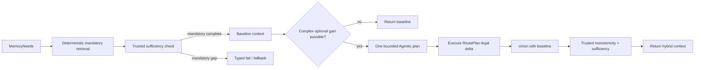
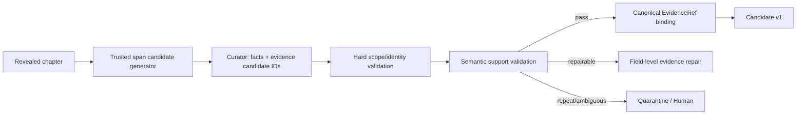

# Stage 2R / Stage 2W Controller 与 Curator 质量修复执行文档

> 状态：待评审冻结
> 文档版本：0.1
> 日期：2026-07-24
> 适用代码基线：`8ca7e1c27b3f3e6e74a316b07d732512410efa08`
> 适用运行基线：C20 checkpoint 已接受、C21 precommit controlled pause
> 关联文档：
>
> - `docs/stage2_hybrid_retrieval_execution.md`
> - `docs/stage2w_pre_candidate_repair_supplement.md`
> - `docs/stage2_memory_write_workflow_execution.md`
> - `docs/stage2_teacher_forced_real_model_handoff.md`

---

## 0. 文档定位与优先级

本文是 C20 paired retrieval 与 C21 Curator proposal 失败后的专项修复执行规范，目标不是重写
Stage 2R 或 Stage 2W，而是修复以下已被真实运行证明的问题：

1. Agentic Controller 在完整安全边界内仍然出现极低召回、mandatory coverage 归零和无收益调用；
2. Controller 的模型决策、RoutePlan、ToolBudget 和报告口径没有形成一个一致的执行闭环；
3. Curator 被要求直接计算 Unicode codepoint offset，导致系统性伪造整百证据区间；
4. proposal feedback 已传回模型，但没有形成字段级、语义稳定的修复；
5. poison-loop signature 无法识别“输出内容不同但缺陷相同”的重复错误；
6. C21 没有污染 C20，但 C1–C20 既有 EvidenceRef 的语义支持质量尚未经过系统审计。

当本文与上游文档在以下主题上冲突时，以本文为准：

- paired Controller 的 wall-clock、model-call 和 tool-call 预算语义；
- `available_actions` 与 RoutePlan 的唯一合法动作来源；
- deterministic baseline 与 Agentic 增量的组合方式；
- Curator proposal 的证据选择契约；
- invalid evidence 的字段级 repair 与 poison-loop signature；
- C20 证据审计和 C21 恢复执行顺序；
- Controller/Curator 新增验收门禁。

以下既有原则不变：

- Canonical Root、Commit 和 Projection 的职责边界不变；
- Future isolation、AccessScope 和 evaluator boundary 不得放宽；
- Agent 不拥有 Commit、Root mutation 或权限决策；
- rejected proposal 不得产生 Candidate；
- C21 失败不得回滚或修改已接受的 C1–C20 Commit；
- 新配置不得继续使用旧 configuration fingerprint；
- 任何迁移必须先在隔离数据库和独立实验目录验证。

本文冻结后的直接操作结论：

```text
禁止按当前 8ca7e1c 配置直接继续重跑 C21
禁止把 3200–3300 裁剪成 3200–3240 后提交
禁止将 Agentic Controller 晋升为默认检索路径
必须先完成 P0 内核修复和 C1–C20 证据审计
```

---

## 1. 事故基线与已确认事实

### 1.1 C20 paired retrieval

报告目录：

```text
reports/stage2a/teacher_forced_real/
  author_plan_conditioned_qwen36_stage2w_recovery_8ca7e1c_from_c20_20260724/
```

paired 指标：

| 指标 | Deterministic | Agentic |
|---|---:|---:|
| Gold Evidence Recall | 86.36% | 4.55% |
| Mandatory Constraint Coverage | 90% | 0% |
| Operational Constraint Coverage | 80% | 20% |
| Plan Obligation Coverage | 100% | 0% |
| Selected Unit Count | 61 | 2 |
| Retrieval Call Count | 73 | 74 |
| Future Leakage | 0 | 0 |
| Stop Reason | `sufficient` | `mandatory_gap_unresolved` |

本次 `safety_regression=true` 的直接原因是 mandatory coverage 低于 deterministic，而不是：

- 未来正文泄漏；
- evaluator artifact 泄漏；
- Canonical write；
- 非法 Commit；
- C21 数据污染。

冻结上下文进一步显示：

- 共 39 个 MemoryNeed；
- Agentic 共记录 74 次调用；
- 只有最前面的两个 Need 产生候选；
- 37 个 Need 被记录为 exact/temporal 调用；
- 两个 event Need 没有通道调用；
- plan Need 在 Agentic arm 中出现了 deterministic RoutePlan 未声明的 temporal 动作。

### 1.2 C21 Curator proposal

C21 共执行：

```text
3 proposal attempts
3 proposal rejections
3 provider/model calls
64,307 tokens
130,959 ms
0 candidate revisions
0 normalization passes
0 guardian reviews
0 commits
```

三次 rejection 均为：

```text
CURATOR_PROPOSAL_INVALID_EVIDENCE
block.ZTJ-P005.21.0:
require 0 <= start < end <= 3240;
received start=3200, end=3300
```

三次输出的最后一条 operation 语义发生变化：

1. `cultivation-timeline = half_year_minimum`
2. `cultivation-doubt = can_i_reach_goal`
3. `cultivation-attitude = extreme_confidence`

但证据区间始终为：

```json
{"block_id": "block.ZTJ-P005.21.0", "start": 3200, "end": 3300}
```

而且其余三个“范围合法”的区间也不支持声称事实：

| 声称事实 | 模型区间 | 区间实际内容 |
|---|---|---|
| reading method | 1200–1500 | 经脉、神魂与修行障碍 |
| 49 books plan | 2300–2400 | 修行过程的风险与希望/失望 |
| cultivation obstacle | 3000–3100 | 霜儿出现及嘲讽开场 |
| extreme confidence | 3200–3240（若裁剪） | 末尾对话与陈长生无法回答 |

因此本事故不是单个 `end` 越界，而是完整证据定位机制不可依赖。

### 1.3 已生效的安全性质

本次真实运行证明了以下防线有效：

```text
非法 Curator Draft
→ typed semantic rejection
→ proposal budget exhausted
→ precommit controlled pause
→ block_next_chapter
→ C20 Canonical Commit 保持不变
```

C21 未进入：

- Candidate lineage；
- Normalization；
- Materialization；
- Validation；
- Guardian；
- Write Gate；
- Commit；
- Projection。

数据库保持在 C20，共 21 个 Commit（Genesis + C1–C20）。

### 1.4 尚未证明的性质

以下结论不能由本次安全停止自动推出：

1. C1–C20 的每个 EvidenceRef 都语义正确；
2. deterministic 的 86.36% recall 完全没有受到宽区间或错误区间影响；
3. Agentic 的 4.55% 纯粹来自模型决策能力，而不是预算/路由/执行错误；
4. Controller 的 74 次调用全部真正到达后端；
5. proposal poison-loop 检测能够识别相同领域缺陷。

本文将这些未证明性质转换为显式审计和门禁。

---

## 2. 根因分层

## 2.1 Controller：预算语义错误

当前 `ToolPolicy.wall_clock_budget_ms` 默认值为 30,000 ms。Controller 在进入 graph 前创建
`ToolBudget`，随后模型决策发生在同一个 deadline 期间。

当前顺序近似为：

```text
start ToolBudget deadline
→ model decision 1
→ tool call 1
→ model decision 2
→ tool call 2
→ ...
```

当本地模型决策总耗时超过 30 秒后，后续 ToolBinding 返回 `BUDGET_EXCEEDED`。但当前 graph：

- 不在下一次模型决策前检查 deadline；
- 不把 `BUDGET_EXCEEDED` 视为 terminal；
- 仍继续枚举未调用 Need/tool pair；
- paired result 仍把失败 ToolResult 计入 retrieval call count；
- frozen paired artifact 不保存逐次 failure code。

这可以解释“74 calls、只有 2 units”的主要症状，但现有产物缺少逐调用账本，必须用修复后的
observability 复跑最终确认。

## 2.2 Controller：合法动作存在双重来源

当前模型看到的 `available_actions` 由以下条件生成：

```text
ToolPolicy.allowed_tools
∩ MemoryNeed.allowed_candidate_pools
∩ 尚未调用的 Need/tool pair
```

而实际 ToolAdapter 还会额外检查：

```text
allowed_channels_by_need / RoutePlan
```

因此存在：

```text
模型侧：动作合法
执行侧：SCOPE_MISMATCH / forbidden
```

这违反“available_actions 是权威合法动作列表”的 prompt 契约。

## 2.3 Controller：逐工具模型调用导致 O(N²) prompt

当前每次决策重新发送：

- 完整 `MemoryResolutionRequest`；
- 全部 39 个初始 Need；
- 全部 `available_actions`；
- 所有历史 ToolResult 的完整 payload；
- 当前 round index。

随着轮次增加：

```text
prompt_size(round n) ≈ request + actions + Σ tool_result[1..n-1]
```

这同时造成：

- 模型调用次数接近工具调用次数；
- prompt 逐轮增大；
- wall-clock 预算很快耗尽；
- 模型需要从大量历史 JSON 中重新判断同一个 sufficiency 状态；
- 运行成本和收益没有可比性。

## 2.4 Curator：把确定性 offset 计算交给模型

现有 `CuratorEvidenceSelection` 仅包含：

```text
block_id
start
end
```

模型收到整段正文，没有 offset map、sentence ID 或字符计数工具，却必须返回精确
Unicode-codepoint 下标。

C21 输出全部使用整百边界，说明模型实际执行的是“估计位置”，不是“精确定位”。

这是职责分配错误：

```text
模型应负责：事实抽取、语义判断、支持文本选择
Runtime 应负责：offset、hash、object identity、EvidenceRef canonical binding
```

## 2.5 Curator：范围校验不等于语义支持校验

当前 trusted validation 主要验证：

- block 属于当前 chapter；
- `start < end <= block_length`；
- EvidenceRef hash 与 Canonical Text 一致；
- information boundary 未越界。

它没有验证：

```text
selected_text 是否支持 operation.record
```

因此只修复 `3300 -> 3240` 会让错误证据从“范围非法”变成“形式合法”，反而更危险。

## 2.6 Curator：proposal repair 不是字段级修复

当前 invalid evidence rejection 不携带 operation index 或 JSON Pointer，导致：

```text
mutable_operation_indexes = []
require_complete_replacement_json = true
```

模型每次都重新生成整个 ChapterChangeDraft。于是：

- 正确或相对稳定的 record 语义也会漂移；
- output hash 每次变化；
- 错误证据坐标可能被原样保留；
- 每次重试都重新发送完整 World 和 Chapter；
- 约 20k input tokens 被重复消耗。

## 2.7 Curator：same finding signature 被 output hash 污染

当前 rejection signature 包含：

```text
reason_code
validation paths
output_hash
```

这使“相同缺陷”的定义退化为“相同完整输出”。只要模型改变一个 value 或 target，signature 就
变化，`same_finding_signature_limit` 无法触发。

正确设计应区分：

```text
same_content_hash  → 完整输出完全相同
same_finding_signature → 违反同一领域规则、同一路径或同一证据约束
```

---

## 3. 修复目标与非目标

### 3.1 P0 目标

1. deterministic 保持正式默认检索路径。
2. Agentic 不得降低 deterministic mandatory coverage。
3. Controller deadline 到期后不得继续调用模型或工具。
4. 模型看到的动作集合与 ToolAdapter 可执行集合必须完全一致。
5. Controller 决策模型调用数从约 74 次降到最多 2 次。
6. Curator 不再生成或计算字符 offset。
7. committed operation 的证据必须同时满足身份、范围和语义支持。
8. 相同 invalid evidence defect 达到阈值后必须停止盲目重试。
9. C21 修复验证只能基于 C20 Canonical basis，不能复用不兼容 checkpoint。
10. C1–C20 EvidenceRef 必须完成只读审计。

### 3.2 P1 目标

1. Controller paired artifact 保存逐次 decision/tool receipts。
2. Controller prompt 使用压缩状态，不携带完整历史 hit payload。
3. invalid evidence 使用字段级 repair 或确定性 resolver。
4. C21 full extraction 最多执行一次；后续只允许 narrow verification/repair。
5. `flow_summary.last_revealed_chapter` 与 progress manifest 使用同一状态源。

### 3.3 非目标

本轮不做：

- 更换 Qwen 模型；
- 引入新的外部向量数据库；
- 重新设计 World/Plan/Text Root；
- 放宽 future isolation；
- 自动修改 C1–C20 Canon；
- 自动把语义可疑 EvidenceRef 裁剪或平移；
- 为了让 Agentic 指标通过而降低 deterministic gate；
- 在原 C21 checkpoint 上强制忽略 configuration fingerprint 继续执行。

---

## 4. 目标架构

### 4.1 Controller：确定性地板 + Agentic 增量

生产候选路径调整为：



冻结不变量：

```text
hybrid.selected_units ⊇ deterministic.mandatory_selected_units
hybrid.mandatory_coverage >= deterministic.mandatory_coverage
hybrid.future_leakage = 0
```

Agentic 可以：

- 对 unresolved complex Need 选择已注册扩展；
- 在剩余预算内选择 graph/hierarchy/dense 等增量路径；
- 建议停止增量检索。

Agentic 不可以：

- 删除 deterministic mandatory unit；
- 把 mandatory Need 降级为 optional；
- 绕过 RoutePlan；
- 更改 base commit/snapshot/access scope；
- 在 deadline 后继续决策；
- 把 failed tool call 当作已完成 coverage。

### 4.2 Curator：语义选择与确定性绑定分离

目标链路：



模型不再输出：

```text
start
end
object_hash
quote_hash
evidence_id
chapter_id
scene_id
resolved_at_commit
```

模型只输出 opaque、已注册的 evidence candidate ID。

---

## 5. 执行工作包总览

| 工作包 | 优先级 | 内容 | 规模 | 前置 |
|---|---|---|---|---|
| WP0 | P0 | 冻结基线、保存事故证据、增加 feature flags | S | 无 |
| WP1 | P0 | Controller deadline 与 terminal budget semantics | M | WP0 |
| WP2 | P0 | RoutePlan 单一合法动作注册表 | M | WP0 |
| WP3 | P0 | deterministic floor、批量 Agentic plan、压缩状态 | L | WP1、WP2 |
| WP4 | P0 | Curator Evidence Candidate v2 契约 | L | WP0 |
| WP5 | P0 | semantic support、字段级 repair、poison signature | L | WP4 |
| WP6 | P0 | C1–C20 EvidenceRef 只读审计 | M | WP4、WP5 |
| WP7 | P0 | 隔离 C21 恢复验证 | M | WP1–WP6 |
| WP8 | P1 | C20 paired 三臂复跑、报告与晋升 Gate | M | WP3、WP7 |
| WP9 | P1 | C22–C95 分段继续与 checkpoint 观察 | L | WP8 |

---

## 6. WP0：冻结基线与开关

### 6.1 保存不可变事故基线

必须保留：

- `e2e_paired_report.json`
- `memory_write_pause_trace.json`
- `c20_c95.log`
- C20 frozen paired context artifact
- C21 三次 raw response
- 三次 proposal attempt receipt
- 三次 rejection artifact
- 两次 feedback artifact
- C21 pause checkpoint
- progress manifest
- experiment/source-state manifest

对上述文件生成一个只读 incident manifest，记录：

```text
relative_path
media_type
byte_length
sha256
code_commit
configuration_fingerprint
base_commit
```

### 6.2 新增显式 feature flags

建议新增：

```text
controller_mode:
  deterministic
  standalone_agentic_diagnostic
  deterministic_plus_agentic_delta

curator_evidence_contract:
  legacy_offset_v1
  candidate_id_v2

evidence_support_gate:
  disabled
  audit_only
  enforce_pre_candidate
```

正式 teacher-forced 默认值：

```yaml
controller_mode: deterministic
curator_evidence_contract: candidate_id_v2
evidence_support_gate: enforce_pre_candidate
```

`legacy_offset_v1` 仅允许读取旧 artifact 和执行离线兼容测试，不允许新建正式 C21 Candidate。

### 6.3 停止条件

WP0 未完成时，不允许：

- 启动新 C21 正式 continuation；
- 覆盖旧报告目录；
- 清理旧对象存储；
- 修改 C20 project current commit；
- 以同一 experiment ID 静默重跑。

---

## 7. WP1：Controller deadline 与预算闭环

### 7.1 统一 ControllerBudget

新增可信预算对象，至少包含：

```python
class ControllerBudgetState:
    deadline_monotonic: float
    max_decision_model_calls: int
    max_tool_calls: int
    decision_model_calls_used: int
    tool_calls_used: int
    terminal_failure: str | None
```

预算检查点：

1. graph 开始；
2. 每次模型决策前；
3. 模型决策返回后、工具调用前；
4. 工具调用返回后；
5. sufficiency check 前；
6. finalize 前。

### 7.2 wall-clock 定义

正式定义：

```text
controller wall clock
= policy decision latency
+ tool binding latency
+ backend latency
+ rerank latency
+ trusted compile/finalize latency
```

禁止继续使用“deadline 只在 ToolBinding 内生效、但模型决策可无限消耗”的隐式语义。

### 7.3 terminal failure 映射

以下 ToolFailureCode 必须终止当前 Agentic delta：

| failure | 行为 |
|---|---|
| `BUDGET_EXCEEDED` | `budget_exhausted` |
| `TIMEOUT` 且无 transport retry | `budget_exhausted` 或 `backend_unavailable` |
| `BASE_COMMIT_MISMATCH` | `freshness_blocked` |
| `SNAPSHOT_STALE` | `freshness_blocked` |
| `ACCESS_DENIED` | `access_blocked` |
| `SCOPE_MISMATCH` | `access_blocked` + route contract violation |

`BACKEND_UNAVAILABLE` 可以执行一次注册 fallback；fallback 失败后必须停止。

### 7.4 调用计数口径

报告拆分：

```text
decision_model_call_count
tool_invocation_attempt_count
tool_success_count
tool_failure_count
backend_search_count
retrieval_channel_count
```

`retrieval_call_count` 不能再同时代表：

- graph 动作数；
- ToolBinding 尝试数；
- 后端真实 search 数。

### 7.5 代码修改范围

主要文件：

- `src/novel_agent/runtime/memory_controller.py`
- `src/novel_agent/tools/contracts.py`
- `src/novel_agent/domain/stage2.py`
- `src/novel_agent/services/paired_controller.py`
- `src/novel_agent/services/tool_audit.py`

### 7.6 必须新增测试

1. fake model decision 耗时超过 deadline，断言后续工具不执行；
2. 首个工具返回 `BUDGET_EXCEEDED`，断言不再调用模型；
3. deadline 在模型返回后到期，断言不执行 pending tool；
4. terminal failure 被保存到 resolution receipt；
5. failed tool attempt 与 backend search count 分开；
6. deterministic baseline 不受 Agentic delta deadline 影响。

---

## 8. WP2：RoutePlan 单一合法动作注册表

### 8.1 新增 LegalActionProvider

从 `StructuredControllerPolicy._available_actions` 和 `RetrievalToolAdapter` 中抽取共享组件：

```python
class LegalActionProvider:
    def available_actions(
        self,
        request: MemoryResolutionRequest,
        route_plans: tuple[RoutePlan, ...],
        prior_calls: tuple[...],
        resolution_state: ...,
    ) -> tuple[RegisteredControllerAction, ...]:
        ...
```

每个 action 至少包含：

```text
need_id
route_step_id
tool_name
retrieval_channel
requirement
phase: mandatory | primary | fallback
fallback_condition
```

### 8.2 唯一来源规则

以下组件必须读取同一 `LegalActionProvider`：

- 模型 prompt 的 `available_actions`；
- trusted draft binder；
- ToolAdapter channel permission；
- duplicate call check；
- route conformance metric；
- recommended fallback；
- audit receipt。

禁止再次从 CandidatePool 单独推导工具合法性。

### 8.3 动作推进规则

对每个 Need：

1. mandatory route steps 按注册顺序执行；
2. primary group 按 RoutePlan fusion semantics 执行；
3. fallback 只有在 condition 为真时暴露；
4. 已成功且 stop condition 达成的 Need 不再暴露无收益动作；
5. 同 Need/tool/route_step 不得重复；
6. route 未声明的 temporal/dense/graph 工具不得出现在 prompt。

### 8.4 fail-closed 一致性断言

启动时验证：

```text
model_visible_actions == trusted_bindable_actions == adapter_executable_actions
```

任何不一致直接判为 configuration error，不进入模型循环。

### 8.5 必须新增测试

1. PLAN_NODE 只声明 exact 时，prompt 不出现 temporal；
2. event Need 的 anchor BM25/dense 正确暴露；
3. fallback condition 未满足时不暴露 fallback；
4. prompt action 逐个通过 ToolAdapter scope check；
5. 不存在“模型合法、adapter forbidden”的 pair；
6. route conformance 为 100%。

---

## 9. WP3：deterministic floor、批量 Agentic plan 与三臂评测

### 9.1 三种运行臂

后续报告不得只比较两个含义混杂的 arm。改为：

| Arm | 用途 | 是否可上线 |
|---|---|---|
| A: deterministic baseline | 正式安全基线 | 是 |
| B: standalone Agentic | 诊断纯模型策略能力 | 否 |
| C: deterministic + Agentic delta | 候选生产路径 | Gate 后决定 |

Arm C 的选择集合必须是：

```text
selected(C) = selected(A) ∪ accepted_delta(B)
```

### 9.2 mandatory floor

deterministic 先完成：

- 所有 mandatory current-state Need；
- 所有 mandatory plan Need；
- 所有高风险 evidence expansion；
- trusted sufficiency。

当 deterministic 本身存在 mandatory gap 时：

- Agentic 可以作为受限 fallback 诊断；
- 最终结果仍是 partial；
- 不得把 Agentic 的主观 stop 改写为 sufficient。

### 9.3 批量 plan schema

模型一次生成：

```python
class ControllerRetrievalPlanDraft:
    selected_action_ids: tuple[str, ...]
    stop_after_action_ids: tuple[str, ...]
    rationale_code: str
```

约束：

- 只能复制 opaque action ID；
- 最多选择 `max_agentic_actions`；
- 不直接输出 need/tool name；
- Runtime 按 action registry 绑定；
- Runtime 可因预算或 sufficiency 提前停止；
- 最多允许一次 narrow replan。

### 9.4 压缩模型状态

模型输入只保留：

```text
task_contract
base/snapshot fingerprints
Need summary:
  id / intent / requirement / resolved / risk / gap code
available action summaries
prior action outcomes:
  action_id / success / candidate_count / gain / failure_code
remaining budget
```

禁止发送：

- 完整 hit text；
- 完整 World JSON；
- 已在上轮发送过的完整 ToolResult payload；
- evaluator-only 信息；
- Gold。

### 9.5 模型调用上限

默认：

```yaml
max_controller_decision_model_calls: 2
max_agentic_actions: 8
```

第一次为 plan，第二次仅在：

- 部分动作失败；
- fallback condition 新满足；
- trusted sufficiency 仍认为存在可解决 gap；

时执行。

### 9.6 paired 公平性

Arm A 与 Arm B 独立比较时必须共享：

- base commit；
- snapshot；
- MemoryNeed；
- RoutePlan；
- allowed actions；
- backend；
- candidate limit；
- retrieval tool-call budget；
- wall-clock budget定义。

模型决策调用数和 tokens 单独报告，不能隐藏在 retrieval budget 外。

Arm C 作为生产候选时，额外报告：

```text
incremental_gold_gain
incremental_mandatory_gain
incremental_tool_calls
incremental_model_calls
incremental_latency
```

---

## 10. WP4：Curator Evidence Candidate v2

### 10.1 新输入类型

Runtime 在调用 Curator 前，确定性生成：

```python
class EvidenceCandidate:
    candidate_id: StableId
    block_id: StableId
    chapter_index: int
    scene_index: int
    text: str
    start: int      # trusted only
    end: int        # trusted only
    content_hash: ArtifactId
```

模型可见字段：

```text
candidate_id
block_id
text
```

`start/end/content_hash` 可以存在 trusted input artifact 中，但不要求模型复制，也不接受模型覆盖。

### 10.2 candidate 生成规则

候选以自然语义边界生成：

1. 段落；
2. 对话句；
3. 句号/问号/感叹号边界；
4. 超长句按确定性窗口切分；
5. 每个 candidate 必须映射到唯一 block/start/end；
6. candidate ID 必须 content-addressed；
7. candidate 不能跨 chapter；
8. 最小窗口优先，但不得切断关键主谓宾或引语。

建议限制：

```yaml
max_candidate_chars: 240
target_candidate_chars: 40-160
max_chapter_evidence_candidates: 128
```

### 10.3 新输出类型

`CuratedOperationDraftV2`：

```python
class CuratedOperationDraftV2:
    operation: ChangeOperationType
    record_kind: WorldRecordKind
    target_id: StableId
    record: CuratorTypedRecord
    evidence_candidate_ids: tuple[StableId, ...]
```

正式 replay 继续要求每个 operation 恰好一个最小证据 candidate；只有以下情况允许多个：

- 同一 durable fact 必须由两个不相邻句共同支持；
- relation 的 subject/object 在不同句确认；
- obligation 的 owner 与内容分离。

多证据上限仍为 4。

### 10.4 trusted binding

Runtime 根据 `candidate_id` 构建：

- `TextSpanRef`
- `EvidenceRef`
- `evidence_id`
- `object_hash`
- `quote_hash`
- `chapter_id`
- `scene_id`
- `resolved_at_commit`
- `support_status`

任何 candidate ID 不属于当前 chapter/boundary，直接：

```text
CURATOR_PROPOSAL_INFORMATION_BOUNDARY
retryable = false
```

### 10.5 exact quote fallback

为兼容某些无法预切分的文本，可以保留 fallback：

```python
class EvidenceQuoteSelection:
    block_id: StableId
    exact_quote: str
    left_context: str | None
    right_context: str | None
    occurrence: int | None
```

Runtime 仅在 quote 唯一匹配或 context 能唯一消歧时绑定。模糊、多次匹配或不存在时拒绝。

正式优先级：

```text
candidate_id > exact_quote unique match > human review
```

禁止 fallback 到模型数 offset。

### 10.6 兼容与迁移

- `ChapterChangeDraft` v1 继续用于读取历史 artifact；
- 新增 `ChapterChangeDraftV2`，不要原地改变旧 schema；
- prompt、AgentSpec、configuration fingerprint 全部升级；
- 旧 C21 checkpoint 因 schema/fingerprint 不兼容，不得直接 resume；
- export Stage 2 schemas；
- 更新 scripted fixtures；
- 新旧 contract 的 adapter 边界必须显式。

---

## 11. WP5：semantic support、字段级 repair 与 poison-loop

### 11.1 两级 evidence gate

Level 1：确定性硬校验：

- candidate 存在；
- 属于当前 chapter；
- block/hash/offset 可重建；
- exact quote 与 canonical slice 一致；
- information boundary 合法；
- operation 至少一个 evidence candidate。

Level 2：语义支持校验：

```text
selected text 是否直接支持 record 的主体、predicate、value、truth_class
```

输出建议：

```python
class EvidenceSupportDecision:
    operation_index: int
    candidate_id: StableId
    disposition: Literal["supports", "partial", "contradicts", "unrelated"]
    reason_code: str
```

正式 Candidate v1 只接受 `supports`。

`partial` 只能：

- 请求另一个已注册 candidate；
- 合并两个 candidate；
- 降级为 unresolved。

`contradicts/unrelated` 不得进入 Candidate。

### 11.2 support verifier 边界

support verifier：

- 只读取当前 operation 和候选短文本；
- 不读取未来正文或 Gold；
- 不修改 record；
- 不选择新的 World fact；
- 输出 typed decision；
- 计入独立 model-call/token budget；
- 最多一次 narrow verification；
- 失败时 fail closed。

后续可用人工标注集评估 verifier，但本轮不能仅凭 embedding 相似度宣称“supports”。

### 11.3 字段级 rejection

invalid evidence rejection 必须包含：

```text
operation_index
json_pointer
candidate_id 或 legacy block_id
violation_rule
safe_feedback
```

例如：

```json
{
  "reason_code": "CURATOR_PROPOSAL_EVIDENCE_UNRELATED",
  "operation_index": 3,
  "json_pointer": "/operations/3/evidence_candidate_ids/0",
  "violation_rule": "candidate_text_must_support_record",
  "safe_feedback": "Choose one registered candidate that directly states the confidence claim."
}
```

### 11.4 repair 类型

| 缺陷 | 修复方式 |
|---|---|
| candidate ID 拼写/复制错误，唯一兼容项存在 | deterministic bind |
| exact quote 唯一存在 | deterministic offset resolve |
| evidence 与 record 无关 | evidence-only model repair |
| record 本身不受章节支持 | drop operation / unresolved |
| candidate 多义且不能消歧 | human review |
| information boundary | fatal |
| 同一缺陷重复达到阈值 | quarantine |

### 11.5 evidence-only repair

repair prompt 只包含：

- 原 operation；
- 原 evidence candidate；
- rejection；
- 同一 chapter 的少量候选；
- exact JSON Pointer；
- remaining repair budget。

模型只能输出：

```python
class EvidenceRepairDraft:
    operation_index: int
    replacement_candidate_ids: tuple[StableId, ...]
    action: Literal["replace_evidence", "drop_operation", "mark_unresolved"]
```

禁止重写：

- target_id；
- record_kind；
- record payload；
- chapter_index；
- 其他 operation。

如果 record 语义也需要变化，原 proposal 作废，进入新的 full extraction attempt；但同一 C21 默认只允许
一次 full extraction，避免语义漂移。

### 11.6 feedback 位置

feedback 必须放在：

```text
候选正文/操作之后
response instruction 之前
```

禁止把 repair feedback 放在完整 World/Chapter 之前，再由 20k token 内容覆盖其注意力。

### 11.7 双 signature

保持：

```text
content_signature = hash(raw output)
```

新增真正的：

```text
finding_signature = hash(
  reason_code,
  rejection_stage,
  json_pointer,
  violation_rule,
  block_or_candidate_id
)
```

`finding_signature` 禁止包含：

- output hash；
- changed record value；
- attempt ID；
- timestamp；
- model request ID。

### 11.8 poison-loop 行为

默认：

```yaml
same_content_hash_limit: 2
same_finding_signature_limit: 2
```

达到任一限制：

```text
停止新模型调用
→ persist quarantine package
→ checkpoint
→ block_next_chapter
→ typed terminal result
```

如果没有 Candidate，quarantine package 仍应保存：

- proposal attempt refs；
- raw response refs；
- rejection refs；
- feedback ref；
- C20 base；
- recommended action。

Workflow 主状态可保持 `BUDGET_EXHAUSTED` 或 `QUARANTINED` 的既有约定，但必须有非空
quarantine artifact，且语义在文档和代码中一致。

---

## 12. WP6：C1–C20 EvidenceRef 只读审计

### 12.1 审计目标

C21 证明 offset 生成机制存在系统性风险，因此必须检查所有已接受的 C1–C20 World evidence，而不能
只检查 C21。

审计必须只读，不修改：

- project current commit；
- Root manifest；
- WorldRoot；
- TextRoot；
- derived snapshot；
- OpenSearch index。

### 12.2 硬完整性检查

对每个 EvidenceRef：

1. root hash 存在且匹配；
2. block 存在；
3. chapter/scene/block identity 一致；
4. `0 <= start < end <= len(block.text)`；
5. object hash 与 block text 一致；
6. quote hash 与 canonical slice 一致；
7. resolved commit 可追溯；
8. support status 合法；
9. 没有 future/evaluator source。

### 12.3 可疑模式检查

生成风险标签：

```text
ROUND_HUNDRED_OFFSET
ROUND_FIFTY_OFFSET
UNUSUALLY_WIDE_SPAN
REUSED_GENERIC_SPAN
SUBJECT_NOT_MENTIONED
PREDICATE_VALUE_LOW_SUPPORT
SELECTED_TEXT_UNRELATED
SELECTED_TEXT_CONTRADICTS_RECORD
```

整百 offset 只能作为风险线索，不能单独判错。

### 12.4 语义审计

对每个 state/relation/obligation/event：

- 展开 record；
- 展开 canonical selected text；
- 使用新的 support verifier；
- 保存 typed disposition；
- 高风险条目执行人工抽样。

至少对以下记录强制人工复核：

- 当前仍 active 的 mandatory state；
- 后续 checkpoint 会检索的 plan/obligation；
- 参与 P001 Gold 评分的 evidence；
- 被多个 record 复用的 span；
- support verifier 判 `partial/contradicts/unrelated` 的条目。

### 12.5 审计输出

新增报告：

```text
reports/stage2a/evidence_audit/<audit_id>/
  audit_manifest.json
  evidence_findings.jsonl
  summary.json
  mandatory_findings.json
  human_review_queue.json
```

每条 finding 包含：

```text
record_kind
record_id
predicate/value summary
evidence_id
chapter/block/start/end
selected_text_hash
hard_validation
semantic_disposition
severity
recommended_action
```

报告不得复制大段版权正文；只保留必要短 excerpt 或 hash。

### 12.6 修复分流

审计后：

| 发现 | 行为 |
|---|---|
| hash/identity 损坏 | P0，停止 C21 |
| evidence unrelated 但 record 正确 | 人工批准 evidence-only maintenance patch |
| record 与正文均不符 | 人工决定 retire/replace，禁止自动修 |
| 仅 span 过宽但确实支持 | 可生成收窄建议，仍需批准 |
| 无高风险 finding | 允许进入隔离 C21 |

Canonical 不可原地修改。任何修复必须是：

- 新 maintenance Candidate；
- 新 Validation/Gate；
- 新 Commit；
- 新 Projection；
- 新 configuration/source receipt。

Benchmark 还应在隔离数据库执行一次 clean replay 对照，防止 maintenance patch 掩盖历史抽取偏差。

---

## 13. WP7：C21 隔离恢复

### 13.1 不复用旧 checkpoint

旧 C21 checkpoint 绑定：

- legacy offset schema；
- 旧 prompt fingerprint；
- 旧 configuration fingerprint；
- 三次已消耗 proposal attempt。

新 evidence contract 与 repair policy 生效后，不得修改 fingerprint 校验强行 resume。

正确方式：

```text
保留旧 checkpoint 作为事故证据
→ 从 C20 accepted commit 建立新隔离实验
→ 使用新 experiment ID / database / report directory
→ 生成新的 C21 workflow request
```

### 13.2 C21 预演

先运行只读 dry-run：

1. 生成 C21 evidence candidates；
2. 检查 candidate coverage；
3. 调用 Curator full extraction 一次；
4. 执行 hard evidence validation；
5. 执行 semantic support validation；
6. 生成拟议 Candidate，但不 Commit；
7. 输出 human-readable diff。

必须人工检查：

- 最多 4 个 durable operation；
- 每个 operation 的 evidence 文本确实支持 record；
- 没有 atmosphere/transient fact；
- 没有复述已有 World unchanged state；
- 没有 future evidence；
- 没有同 target 重复 operation。

### 13.3 C21 正式隔离提交

dry-run 通过后：

```text
C20 base
→ Curator proposal v2
→ Evidence support gate
→ Candidate v1
→ Normalization
→ Materialization
→ Validation
→ Guardian（若风险要求）
→ Gate
→ Commit CAS
→ Projection
→ Freshness
```

断言：

```text
exactly one accepted Candidate lineage head
exactly one Commit receipt for C21 idempotency key
exactly one resulting Canonical Commit
projection source_commit == C21 commit
current project commit == C21 commit
```

### 13.4 C21 资源目标

目标：

```text
full Curator extraction calls <= 1
narrow evidence support/repair calls <= 1
total model calls <= 2
total tokens <= 32,000
same-finding third attempt = 0
```

若超过，返回 typed pause，不自动扩大预算。

---

## 14. WP8：C20 paired 三臂复跑

### 14.1 复跑前置

必须同时满足：

- Controller deadline tests 通过；
- LegalActionProvider 一致性 tests 通过；
- Agentic decision model calls 上限为 2；
- tool failure receipts 可持久化；
- C20 EvidenceRef 审计完成；
- P001 mandatory 高风险 finding 已处理或明确豁免；
- snapshot capability 仍为 exact。

### 14.2 报告内容

三臂报告至少包含：

```text
deterministic metrics
standalone_agentic metrics
hybrid metrics

decision_model_call_count
decision_input/output_tokens
tool_invocation_attempt_count
tool_success/failure counts
backend_search_count
failure codes
route conformance
forbidden route calls
deadline stop
incremental gain
```

### 14.3 立即通过条件

Arm A deterministic：

```text
Gold Evidence Recall >= 90%
Mandatory Constraint Coverage = 100%
Operational Constraint Coverage >= 95%
Plan Obligation Coverage = 100%
Future Leakage = 0
```

如果当前 deterministic 仍为 86.36% / 90%，说明不仅 Agentic 有问题，必须继续修 Need、R1 或
evidence quality，不能进入晋升判断。

Arm B standalone Agentic：

```text
route conformance = 100%
forbidden route calls = 0
future leakage = 0
budget-after-terminal calls = 0
decision model calls <= 2
```

其 recall 可以继续作为诊断指标，但不得因安全绑定而误称生产可用。

Arm C hybrid：

```text
mandatory coverage >= Arm A
gold recall >= Arm A
future leakage = 0
selected mandatory floor retention = 100%
no safety regression
```

Agentic 只有在预声明复杂 query class 上产生稳定净增益，且增量成本在预算内，才允许从
`experimental` 进入 `conditional candidate`。

---

## 15. WP9：C22–C95 继续策略

### 15.1 分段执行

禁止一次性从 C21 直接跑到 C95。建议：

```text
C21
→ C22–C25
→ C26–C40
→ C41–C60
→ C61–C80
→ C81–C95
```

每段结束检查：

- last accepted chapter/commit；
- Candidate/Commit 数；
- evidence support failure；
- proposal retry 分布；
- model calls/tokens；
- projection freshness；
- Controller paired metrics；
- future isolation；
- report state consistency。

### 15.2 自动暂停条件

任一条件触发 controlled pause：

- invalid evidence；
- support verifier `unrelated/contradicts`；
- same finding 达到 2；
- any future leakage；
- any forbidden route；
- any commit/projection basis mismatch；
- Agentic mandatory coverage 低于 deterministic；
- full extraction retry 超过 1；
- last revealed chapter 与 progress manifest 不一致；
- token/wall-clock/model-call budget 耗尽。

---

## 16. 测试矩阵

### 16.1 Controller unit tests

建议新增：

```text
tests/unit/test_controller_budget_semantics.py
tests/unit/test_controller_legal_actions.py
tests/unit/test_controller_batch_plan.py
tests/unit/test_controller_monotonic_floor.py
tests/unit/test_controller_receipts.py
```

覆盖：

- model latency 消耗 global deadline；
- deadline 后不调用 tool/model；
- terminal ToolFailureCode 映射；
- route-aware exact actions；
- fallback 条件；
- duplicate action；
- batch action binding；
- deterministic floor union；
- compact prompt 不含 hit payload；
- receipt 完整性。

### 16.2 Curator unit tests

建议新增：

```text
tests/unit/test_evidence_candidate_generation.py
tests/unit/test_curator_evidence_contract_v2.py
tests/unit/test_evidence_support_gate.py
tests/unit/test_evidence_only_repair.py
tests/unit/test_proposal_finding_signature.py
```

覆盖：

- 中文段落/句子 offset；
- unique candidate ID；
- quote exact resolve；
- quote 多义拒绝；
- candidate 越 chapter 拒绝；
- unrelated evidence 拒绝；
- support pass 后 canonical binding；
- evidence-only repair 不修改 record；
- finding signature 不受 output hash 影响；
- 第二次相同 defect quarantine；
- 不存在第三次 full extraction。

### 16.3 Workflow/contract tests

必须覆盖：

1. rejected V2 proposal 不产生 Candidate；
2. support rejection crash/resume 后预算不丢失；
3. evidence repair 使用新 request ID；
4.旧 V1 artifact 可读取但不能进入 V2 Commit；
5. fingerprint 不一致拒绝 resume；
6. quarantine package 在无 Candidate 时仍保存 proposal chain；
7. C21 idempotency exactly once；
8. projection 与 C21 commit 一致；
9. block_next_chapter 在 typed pause 后生效。

### 16.4 C21 characterization fixture

从真实 C21 生成脱敏/最小 fixture，至少保留：

- block length 3240；
- 与四个候选事实相关的短文本；
- 旧 3200–3300 rejection；
- 三个不同 output hash；
- 同一个 normalized finding signature 预期。

测试断言：

```text
legacy output rejected
no clipping
new candidate-id output binds exact text
all accepted evidence supports corresponding record
same defect attempt 2 stops
```

### 16.5 建议验证命令

目标测试：

```bash
pytest -q --no-cov \
  tests/unit/test_stage2_memory_controller.py \
  tests/unit/test_stage2_paired_controller.py \
  tests/unit/test_pre_candidate_repair.py \
  tests/unit/test_model_curation.py \
  tests/unit/test_stage2_curator_agent.py \
  tests/unit/test_memory_write_workflow.py \
  tests/contract/test_stage2_teacher_forced_e2e.py
```

新增文件完成后加入同一命令。随后执行：

```bash
ruff check src tests scripts
mypy src/novel_agent
```

如果仓库既有全量 coverage/mypy 债务仍存在，报告必须区分：

- 本次目标测试结果；
- 本次新增代码静态检查；
- 仓库既有非目标失败。

---

## 17. 观测与报告修复

### 17.1 Controller decision receipt

每次 decision 保存：

```text
model_request_id
round_index
input token count
output token count
available action IDs
selected action IDs
repair/binding status
started/completed timestamps
remaining wall-clock/model/tool budget
```

### 17.2 Tool receipt

每次 tool attempt 保存：

```text
action_id
need_id
route_step_id
tool/channel
status
failure_code
backend_search_executed
candidate_count
new_information_gain
latency
basis/snapshot
```

### 17.3 Curator evidence receipt

每个 operation 保存：

```text
evidence_candidate_id
canonical block/start/end
selected text hash
hard validation
semantic support disposition
binding receipt
repair ancestry
```

### 17.4 summary 一致性

以下字段必须来自同一 progress/canonical state provider：

```text
last_revealed_chapter
last_accepted_chapter
last_accepted_commit
paused_chapter
project current commit
total commit count
```

本次 continuation 中 `last_revealed_chapter=0` 与 C20 progress 不一致，必须增加报告一致性断言。

---

## 18. 配置与 fingerprint

新 fingerprint 必须至少包含：

```text
controller mode
controller budget profile
max decision model calls
LegalActionProvider version
RoutePlan version
batch decision schema hash
Curator evidence contract version
evidence candidate generator version
support verifier version
proposal finding signature version
repair policy version
prompt hashes
model/runtime fingerprint
```

任何字段变化必须：

- 产生新 configuration fingerprint；
- 产生新 experiment ID；
- 写入 manifest；
- 禁止从旧 checkpoint 静默恢复。

---

## 19. 回退策略

### 19.1 Controller 回退

如果 WP1–WP3 任一门禁失败：

```text
controller_mode = deterministic
```

保留 standalone Agentic 仅用于离线诊断。不得：

- 回退到无 RoutePlan 的开放工具调用；
- 扩大预算掩盖 deadline bug；
- 删除 safety regression gate。

### 19.2 Curator 回退

如果 candidate-id v2 无法稳定生成支持证据：

```text
C21 controlled pause
→ human evidence selection
→ typed human-approved proposal
```

不得回退到：

- 自动 offset clipping；
- legacy V1 模型数下标；
- 跳过 evidence；
- 空 delta 静默继续；
- scripted 自动接受。

### 19.3 C20 回退

C20 accepted commit 永不原地修改。审计发现问题后：

- 旧 C20 仍保留；
- 修复通过新 maintenance commit；
- benchmark 另建 clean replay 对照；
- 所有迁移可按 commit/ref 回溯。

---

## 20. 实施顺序与合并门禁

### Phase A：安全内核

```text
WP0 → WP1 → WP2
```

合并条件：

- deadline terminal tests 通过；
- legal action 一致性 100%；
- receipt 可显示失败码；
- deterministic 默认未改变。

### Phase B：Controller 质量路径

```text
WP3
```

合并条件：

- batch decision model calls <= 2；
- deterministic mandatory floor 保留 100%；
- prompt 不含完整历史 hits；
- 三臂报告 schema 通过。

### Phase C：Curator evidence v2

```text
WP4 → WP5
```

合并条件：

- 新 proposal 不含 offset；
- exact candidate binding 100%；
- unrelated evidence 无法进入 Candidate；
- same finding 第二次终止；
- schema/fingerprint 迁移测试通过。

### Phase D：历史审计

```text
WP6
```

继续条件：

- C1–C20 hard integrity 100%；
- mandatory 高风险 evidence 已人工处置；
- 无未解决 P0 finding。

### Phase E：恢复与评测

```text
WP7 → WP8 → WP9
```

继续条件：

- C21 隔离 exactly-once commit；
- C20 paired Gate 达标；
- C22–C95 分段运行不触发自动暂停。

---

## 21. Definition of Done

本专项完成必须同时满足：

### Controller

- [ ] deterministic 仍为默认正式路径；
- [ ] global deadline 覆盖模型和工具；
- [ ] deadline 后调用数为 0；
- [ ] prompt/adapter 共用 LegalActionProvider；
- [ ] forbidden-route rate 为 0；
- [ ] decision model calls 不超过 2；
- [ ] 三臂报告可区分 standalone 与 monotonic hybrid；
- [ ] hybrid mandatory floor retention 为 100%；
- [ ] Future Leakage 为 0；
- [ ] Gold Recall ≥ 90%；
- [ ] Mandatory Coverage = 100%；
- [ ] Operational Coverage ≥ 95%；
- [ ] Plan Obligation Coverage = 100%。

### Curator

- [ ] 正式 proposal 不输出 start/end；
- [ ] evidence candidate ID 全部可确定性绑定；
- [ ] committed evidence exact slice/hash 验证率 100%；
- [ ] committed evidence semantic support 率 100%；
- [ ] unrelated/contradicting evidence 无法进入 Candidate；
- [ ] evidence-only repair 不改变 record；
- [ ] same finding signature 不包含 output hash；
- [ ] 相同 defect 第二次停止；
- [ ] C21 full extraction calls ≤ 1；
- [ ] C21 total model calls ≤ 2；
- [ ] C21 exactly one Candidate lineage head；
- [ ] C21 exactly one Commit。

### 历史与恢复

- [ ] C1–C20 EvidenceRef 只读审计完成；
- [ ] 所有 P0 finding 已处置；
- [ ] 旧 C21 checkpoint 保留但未强制 resume；
- [ ] 新实验使用独立 fingerprint/目录/数据库；
- [ ] last revealed/accepted/paused 状态一致；
- [ ] C20 旧 Canon 可回溯；
- [ ] C22–C95 使用分段 checkpoint 继续。

---

## 22. 最终决策规则

修复完成后，对 Agentic Controller 只允许三种结论：

### `REJECTED`

满足任一：

- mandatory coverage 低于 deterministic；
- future leakage > 0；
- forbidden route > 0；
- deadline 后继续调用；
- 没有复杂 query class 净增益。

### `EXPERIMENTAL`

满足：

- 安全和路由门禁通过；
- standalone 质量仍无稳定净增益；
- 可继续离线改进，但不进入默认路径。

### `CONDITIONAL CANDIDATE`

必须同时满足：

- deterministic floor 保留；
- hybrid 无 safety regression；
- 至少一个预声明复杂 query class 有稳定净增益；
- 增量 tool/model/token/latency 在预算内；
- 多 checkpoint 复现；
- Gate/ADR 明确批准。

Curator evidence v2 没有实验性降级空间：只要不能证明精确绑定和语义支持，就必须暂停或转人工，
不能提交“可能正确”的 EvidenceRef。
