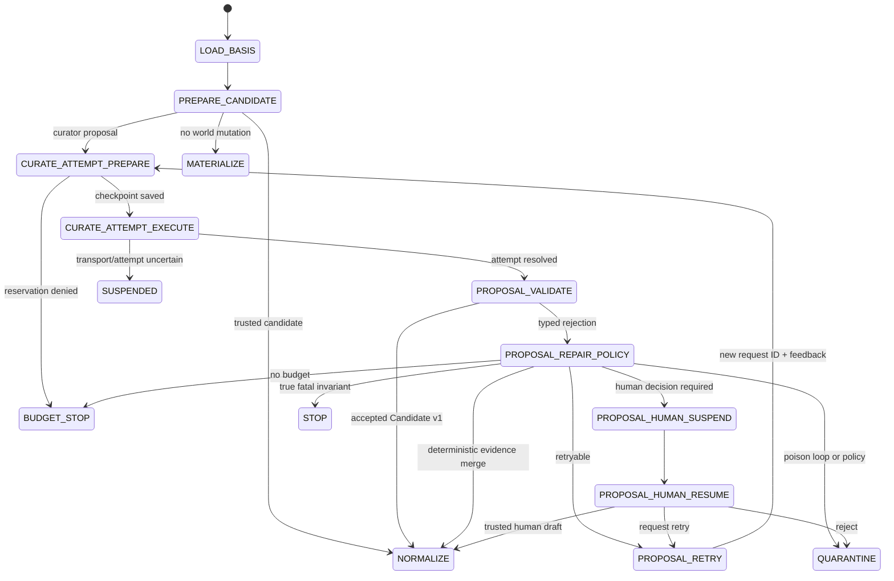

# Stage 2W Pre-Candidate Repair 补充设计与执行文档

> 文档生命周期：`HISTORICAL_EXECUTION_BASELINE`
> 实施状态：已落地并进入回归；保留用于修复语义审计
> 适用阶段：Stage 2W 增量优化（以下简称 Stage 2W-P）
> 日期：2026-07-23
> 状态更新：2026-07-31
> 关联主文档：`docs/stage2_memory_write_workflow_execution.md`

---

## 0. 文档定位与优先级

本文不是对 Stage 2W 的整体重写，而是补齐 `CURATE` 与 Candidate v1 之间的恢复盲区。

当本文与主文档在以下主题上存在冲突时，以本文为准：

1. 初始 Curator proposal 的状态机；
2. Candidate v1 产生之前的错误分类；
3. Curator proposal attempt 的预算、审计、重试和 checkpoint；
4. Pre-Candidate poison-loop、Quarantine 与 Human 路径；
5. Teacher-forced benchmark 遇到非 Commit 结果时的退出和恢复语义。

以下 Stage 2W 既有原则保持不变：

- Runtime 拥有审核、修复、重试、升级和 Commit 闭环；
- Agent 只能产出不受信 Draft 或 Candidate 建议；
- Candidate、Validation、Gate 和 Commit 必须绑定同一 base 与内容身份；
- Commit conflict 不自动 rebase；
- Canon Commit 与 Projection 重试继续分离；
- information boundary、producer receipt DAG 和 future isolation 继续 fail closed；
- C1–C7 已接受 Canon 不因 C8 失败而回滚或重建。

---

## 1. Run4 事故基线

### 1.1 已确认事实

Run4 在 C8 停止时：

- C1–C7 已正式提交；
- 最后接受的 Commit 为
  `sha256:f9a472f530355517879bca77b2c41b6eb4b91fff780a604eb6f01e4e04e84eb4`；
- `progress_manifest.json` 的 `last_accepted_chapter` 为 `7`；
- C8 未 Commit；
- Canon、Projection 和索引没有被错误 Candidate 污染；
- benchmark 进程已退出；
- 直接错误为 `Curator draft targets one record more than once`。

因此本次事故首先证明了 Stage 2W 的安全属性：

```text
非法 proposal 没有进入 Candidate lineage
→ 没有进入 materialization
→ 没有进入 Validation/Gate
→ 没有进入 Canon
```

同时也暴露了可用性缺口：

```text
可解析 Draft
→ trusted ModelCurator 发现跨 operation 冲突
→ 抛异常
→ Workflow 通用异常映射为 FATAL
→ benchmark 抛异常退出
```

### 1.2 根因

当前状态机默认：

```text
curator.propose() 成功
→ 产生 ObservedChangeSet
→ 创建 Candidate v1
```

但真实运行还存在一层：

```text
模型输出
→ ChapterChangeDraft schema
→ trusted normalization / binding
→ cross-operation semantic validation
→ 才能产生 ObservedChangeSet
```

错误发生在 `ChapterChangeDraft` 已解析、`ObservedChangeSet/Candidate v1` 尚未形成之间。
现有 Candidate Repair 无法处理不存在的 Candidate，因而形成 Pre-Candidate 恢复盲区。

### 1.3 本阶段目标

Stage 2W-P 必须建立以下闭环：

```text
CURATE_ATTEMPT
→ PROPOSAL_VALIDATE
→ 成功：创建 Candidate v1
→ 失败：持久化 attempt、Draft、receipt、usage 和 typed rejection
→ PROPOSAL_REPAIR
→ 新 request ID + 精确反馈
→ 重复输出/重复错误检测
→ 成功 / BUDGET_EXHAUSTED / QUARANTINED / HUMAN_REQUIRED
```

---

## 2. 必须冻结的系统性质

### 2.1 安全性质

1. 任何 rejected proposal 都不得产生 Candidate。
2. 没有 Candidate 时不得进入 `NORMALIZE/MATERIALIZE/VALIDATE/PRECOMMIT/COMMIT`。
3. proposal retry 不得修改 base commit、source、visibility、information boundary 或 RootUpdateIntent。
4. proposal feedback 不得包含未来正文、Gold、Evaluator artifact 或更宽 access scope。
5. Pre-Candidate deterministic merge 不得凭主观优先级保留第一条或最后一条 operation。
6. rejected Draft 是不受信 artifact，不能被当作 accepted Agent output 或 producer receipt。
7. C8 的任何失败不得修改 C1–C7 Canon。

### 2.2 活性性质

1. 已知、可修复的模型输出缺陷不得直接变成 `FATAL`。
2. 每次失败 attempt 都必须计入预算并可审计。
3. 每次语义重试必须使用新的 model request ID。
4. 相同非法输出或相同 rejection signature 达到阈值后必须停止盲目调用。
5. 进程在失败 attempt 后终止并恢复时，不得丢失 attempt 数、预算、反馈或错误谱系。
6. 任何恢复路径都不得创建第二个 Canon Commit。
7. 预算不足时必须返回 typed terminal result，而不是向 benchmark 泄漏 traceback。

### 2.3 `FATAL` 的收窄

`FATAL` 仅用于：

- Canon manifest/root 无法验证或已损坏；
- information boundary 泄漏或 receipt DAG 无法闭合；
- content hash/identity collision；
- Commit 已接受但返回违反协议的不变量；
- trusted service 产生不可能状态；
- 未注册的程序错误或 Port 协议破坏。

以下情况不是 `FATAL`：

- JSON/schema 输出错误；
- typed record 与 `record_kind` 不匹配；
- draft chapter index 错误；
- duplicate target；
- trusted normalization 后 target collision；
- evidence span、operation shape 或 proposal scope 可修复错误；
- 相同非法输出导致的 poison loop；
- proposal attempt 预算耗尽；
- 模型服务短暂不可用。

---

## 3. 四层重试所有权

Stage 2W-P 将重试明确分为四层，禁止互相吞并计数或职责。

| 层 | 所有者 | 处理范围 | 不得处理 |
|---|---|---|---|
| Transport retry | ModelGateway/Endpoint | timeout、429、5xx、连接错误 | 语义改写、Candidate repair |
| Structured retry | ModelGateway | JSON/Pydantic `ValidationError` | normalization 后领域冲突 |
| Pre-Candidate semantic retry | MemoryWriteWorkflow + proposal policy | duplicate target、normalized collision、proposal scope 错误 | 已有 Candidate 的 Validation/Guardian finding |
| Candidate repair | MemoryWriteWorkflow + RepairPolicy | Candidate normalization、Validation/Guardian rejection | 没有 Candidate 的 Draft 错误 |

关键约束：

- transport retry 可复用同一语义 attempt，但每次 transport evidence 必须保留；
- structured retry 的每次模型生成都必须有唯一 model request ID；
- structured retry 失败耗尽后，必须转换为 typed proposal rejection，不能继续抛裸
  `ValidationError`；
- Pre-Candidate retry 与 Candidate revision budget 分开；
- Candidate v1 产生后，proposal attempt loop 永久结束，不允许回用 rejected Draft。

---

## 4. 新状态机

### 4.1 状态增量

在 `MemoryWriteState` 中新增：

```text
CURATE_ATTEMPT_PREPARE
CURATE_ATTEMPT_EXECUTE
PROPOSAL_VALIDATE
PROPOSAL_REPAIR_POLICY
PROPOSAL_RETRY
PROPOSAL_HUMAN_SUSPEND
PROPOSAL_HUMAN_RESUME
```

现有 `CURATE` 作为兼容入口，仅负责跳转到 `CURATE_ATTEMPT_PREPARE`，不得直接调用模型。

### 4.2 状态图



### 4.3 Candidate 边界

`PROPOSAL_VALIDATE` 之前的对象全部属于 proposal-attempt lineage，不属于 Candidate lineage。

```text
失败 attempt:
    model response
    → untrusted Draft artifact
    → typed rejection
    → attempt receipt
    → 不产生 Candidate ID

成功 attempt:
    model response
    → Draft
    → trusted normalization/binding
    → ObservedChangeSet
    → accepted attempt receipt
    → Candidate v1
```

Candidate v1 必须记录：

- `origin_proposal_attempt_id`；
- accepted attempt receipt；
- producer receipt；
- proposal attempt chain reference；
- 原有 source/boundary/base/configuration 绑定。

Rejected attempt 不参与 Candidate content hash，但必须能从 Candidate 审计链反向找到。

---

## 5. 领域合同增量

以下为冻结形状，字段命名可在实现时按项目惯例微调，但语义不得省略。

### 5.1 Attempt 状态

```python
class CuratorProposalAttemptStatus(StrEnum):
    REQUESTED = "requested"
    RUNNING = "running"
    ACCEPTED = "accepted"
    REJECTED = "rejected"
    UNCERTAIN = "uncertain"
    ABANDONED = "abandoned"


class ProposalRejectionStage(StrEnum):
    STRUCTURED_SCHEMA = "structured_schema"
    TRUSTED_NORMALIZATION = "trusted_normalization"
    SEMANTIC_CONTRACT = "semantic_contract"
    INFORMATION_BOUNDARY = "information_boundary"


class ProposalRejectionKind(StrEnum):
    SCHEMA_REJECTED = "schema_rejected"
    CHAPTER_MISMATCH = "chapter_mismatch"
    RECORD_KIND_MISMATCH = "record_kind_mismatch"
    DUPLICATE_TARGET = "duplicate_target"
    NORMALIZED_TARGET_COLLISION = "normalized_target_collision"
    INVALID_EVIDENCE = "invalid_evidence"
    SCOPE_VIOLATION = "scope_violation"
    POISON_LOOP = "poison_loop"
```

`INFORMATION_BOUNDARY` stage 只用于审计分类，发现后仍直接走真正的 `FATAL`，不得重试模型。

### 5.2 Proposal attempt receipt

```python
class CuratorProposalAttemptReceipt(DomainModel):
    attempt_id: StableId
    workflow_request_id: StableId
    run_id: RunId
    task_id: TaskId
    attempt_no: int
    base_commit: CommitId
    boundary_id: StableId
    configuration_fingerprint: ArtifactId

    status: CuratorProposalAttemptStatus
    model_request_ids: tuple[StableId, ...]
    model_call_receipt_refs: tuple[ArtifactRef, ...]
    prompt_fingerprint: ArtifactId
    feedback_artifact_ref: ArtifactRef | None

    raw_response_refs: tuple[ArtifactRef, ...]
    parsed_draft_ref: ArtifactRef | None
    normalized_output_ref: ArtifactRef | None
    output_hashes: tuple[ArtifactId, ...]

    rejection_ref: ArtifactRef | None
    agent_execution_receipt_ref: ArtifactRef | None
    producer_receipt_ref: ArtifactRef | None

    provider_call_count: int
    transport_attempt_count: int
    input_tokens: int
    output_tokens: int
    started_at: datetime
    completed_at: datetime | None
```

跨字段约束：

- `attempt_no >= 1`；
- `REQUESTED/RUNNING/UNCERTAIN` 不得携带 accepted output；
- `ACCEPTED` 必须有 normalized output、Agent receipt 和 producer receipt；
- `REJECTED` 必须有 rejection、至少一个 model call receipt 或明确的 pre-call rejection；
- `model_request_ids` 与 call receipt 一一对应；
- 每个 model request ID 在同一 workflow request 内唯一；
- 所有 output artifact 必须绑定同一 information boundary；
- usage 不得为负，且 `provider_call_count` 不得小于模型 receipt 数。

### 5.3 Typed rejection

```python
class ProposalConflict(DomainModel):
    record_kind: WorldRecordKind
    target_id: StableId
    operation_indexes: tuple[int, ...]
    semantic_hashes: tuple[ArtifactId, ...]
    evidence_hashes: tuple[ArtifactId, ...]


class CuratorProposalRejection(DomainModel):
    rejection_id: StableId
    attempt_id: StableId
    workflow_request_id: StableId
    base_commit: CommitId
    stage: ProposalRejectionStage
    kind: ProposalRejectionKind
    reason_code: str
    retryable: bool
    rejection_signature: ArtifactId
    output_hash: ArtifactId | None
    conflicts: tuple[ProposalConflict, ...]
    validation_error_paths: tuple[str, ...]
    safe_feedback: tuple[str, ...]
    raw_draft_ref: ArtifactRef | None
    normalized_output_ref: ArtifactRef | None
    created_at: datetime
```

`safe_feedback` 必须是经过 Runtime 过滤的结构化反馈，不能直接放 traceback、完整内部对象或越界 source。

### 5.4 Attempt outcome

Curator proposal Port 不再用异常表达普通模型输出缺陷。

```python
class CuratorProposalAccepted(DomainModel):
    status: Literal["accepted"]
    observed_changes: ObservedChangeSet
    attempt_receipt: CuratorProposalAttemptReceipt


class CuratorProposalRejected(DomainModel):
    status: Literal["rejected"]
    rejection: CuratorProposalRejection
    attempt_receipt: CuratorProposalAttemptReceipt


CuratorProposalAttemptOutcome = Annotated[
    CuratorProposalAccepted | CuratorProposalRejected,
    Field(discriminator="status"),
]
```

只有真正的 infrastructure/protocol error 可以从 Port 抛异常。

### 5.5 Proposal repair directive

```python
class ProposalRepairScope(DomainModel):
    mutable_operation_indexes: tuple[int, ...] = ()
    immutable_operation_semantic_hashes: tuple[ArtifactId, ...] = ()
    allow_complete_replacement: bool = False


class CuratorProposalRepairDirective(DomainModel):
    directive_id: StableId
    workflow_request_id: StableId
    prior_attempt_id: StableId
    action: Literal[
        "retry_with_feedback",
        "deterministic_evidence_merge",
        "human_review",
        "quarantine",
        "budget_stop",
        "fatal",
    ]
    reason_codes: tuple[str, ...]
    rejection_signature: ArtifactId
    previous_output_hash: ArtifactId | None
    scope: ProposalRepairScope
    feedback_artifact_ref: ArtifactRef | None
```

对于可解析的局部冲突：

- 非冲突 operation 的 semantic hash 默认冻结；
- 模型必须返回完整 replacement Draft；
- trusted Runtime 必须验证冻结 operation 没有被偷偷改写；
- 如果 schema 错误导致无法识别 operation，才允许 `allow_complete_replacement=true`。

### 5.6 Budget 增量

```python
class MemoryWriteBudget(DomainModel):
    max_curator_proposal_attempts: int = 3
    max_curator_proposal_rejections: int = 3
    # 保留既有 total model/token/wall-clock/candidate 等预算


class MemoryWriteBudgetUsage(DomainModel):
    curator_proposal_attempts: int = 0
    curator_proposal_rejections: int = 0
    structured_generation_attempts: int = 0
    # 保留既有 total_model_calls/transport_attempts/tokens_used 等字段
```

Candidate revision budget 不得被失败 Draft 消耗；proposal attempt 和 total model call 预算必须消耗。

---

## 6. Raw Draft 与 normalization 后冲突

### 6.1 第一层：`ChapterChangeDraft` raw identity 唯一性

在 `ChapterChangeDraft` 增加 model validator：

```python
@model_validator(mode="after")
def validate_unique_targets(self):
    identities = tuple(
        (operation.record_kind, operation.target_id)
        for operation in self.operations
    )
    if len(identities) != len(set(identities)):
        raise ValueError("Curator draft targets one record more than once")
    return self
```

效果：

- 原始 JSON 中显式重复的 `(record_kind, target_id)` 进入 Pydantic `ValidationError`；
- 现有 `ModelGateway.generate_structured()` 可以生成带精确错误的 structured retry；
- `ModelCurator` 中的重复检查仍保留为 defense-in-depth，不因 schema validator 删除。

Gateway structured retry 耗尽后必须返回/抛出带 attempt receipts 的 typed exhaustion，由 Curator adapter 转换为：

```text
CURATOR_PROPOSAL_SCHEMA_REJECTED
```

不得让裸 `ValidationError` 穿过 Workflow 边界。

### 6.2 第二层：trusted normalization 后 identity collision

raw identity 不同并不意味着 normalized identity 不同。例如 alias、旧 ID、successor 绑定或 Runtime ID
规范化可能让两条 operation 指向同一 canonical target。

`ModelCurationContractError` 需要替换或包装为：

```python
class CuratorProposalSemanticRejected(Exception):
    reason_code: str
    rejection: CuratorProposalRejection
    call_receipts: tuple[ArtifactRef, ...]
```

Curator adapter 必须把它转换成 `CuratorProposalRejected`，Workflow 不得把它交给通用
`except ValueError -> FATAL`。

### 6.3 确定性 evidence merge

只有同时满足以下条件，Runtime 才能把 normalized identity collision 合并为一条 operation：

1. `base_commit` 相同；
2. `root_kind`、`operation type`、`record_kind`、normalized `target_id` 相同；
3. 除 evidence 外的 canonical payload 完全相同；
4. truth class、时间字段、predecessor/successor 语义完全相同；
5. 所有 evidence span 都通过 source visibility 和 information boundary 校验；
6. evidence 去重、排序后仍满足领域合同；
7. 合并过程产生独立 transform receipt。

语义指纹：

```text
semantic_hash = SHA256(
    operation_type
    + record_kind
    + normalized_target_id
    + canonical_payload_without_evidence
)
```

若同一 normalized identity 下存在两个不同 `semantic_hash`：

```text
不得保留第一条
不得保留最后一条
不得按置信度猜测
→ CURATOR_PROPOSAL_NORMALIZED_TARGET_COLLISION
→ proposal retry/human/quarantine
```

Raw Draft 的显式重复默认优先走 structured retry。确定性 merge 主要用于 trusted normalization 引入的
collision；即使将来允许 raw evidence-only merge，也必须复用同一严格判定器。

---

## 7. 唯一请求身份与反馈

### 7.1 三种身份不得混用

```text
workflow request ID
    一次 C8 memory-write 逻辑请求，恢复时保持稳定

model request ID
    每一次模型生成唯一

commit idempotency key
    只用于最终 Canon Commit，所有 proposal retry 保持不变
```

建议 model request ID：

```text
{base_request_id}.proposal-{proposal_attempt_no}.schema-{structured_attempt_no}
```

如果长度超过合同限制，使用稳定截断加 rejection signature 前缀，不得随机截断导致碰撞。

### 7.2 Retry feedback

反馈至少包含：

- typed reason code；
- 冲突 `(record_kind, target_id)`；
- 冲突 operation indexes；
- 上次 output hash；
- rejection signature；
- 允许修改的 operation 范围；
- 必须保持不变的 operation semantic hashes；
- 剩余 proposal/model/token 预算；
- “返回完整 replacement JSON”要求。

反馈不得包含：

- Python traceback；
- 数据库内部 ID；
- 未来章节；
- Gold/Evaluator 内容；
- 未授权 canonical view；
- 完整 prompt secret 或 provider metadata。

温度为 0 时，新的 request ID 本身不会改变模型输出；真正打破重复的是精确反馈和约束变化。
因此 poison-loop 检测仍是强制要求。

---

## 8. Port 与服务职责

### 8.1 Curator proposal Port

建议将：

```python
CuratorPort.propose(...) -> CuratorProposalResult
```

演进为：

```python
CuratorPort.propose_attempt(
    request: CuratorProposalAttemptRequest,
) -> CuratorProposalAttemptOutcome
```

兼容期可保留 `propose()`，但 Local Workflow 只能调用新接口。旧接口适配器必须把已知 schema/domain
错误转换成 rejected outcome。

### 8.2 Attempt repository

新增：

```python
class CuratorProposalAttemptRepositoryPort(Protocol):
    def create_requested(envelope) -> ArtifactRef: ...
    def mark_running(attempt_id, model_request_id) -> ArtifactRef: ...
    def settle_accepted(attempt_id, outcome) -> ArtifactRef: ...
    def settle_rejected(attempt_id, rejection) -> ArtifactRef: ...
    def mark_uncertain(attempt_id, reason) -> ArtifactRef: ...
    def load(attempt_id) -> CuratorProposalAttemptReceipt: ...
    def list_for_workflow(request_id) -> tuple[CuratorProposalAttemptReceipt, ...]: ...
```

Repository 写入必须满足 CAS/identity collision 约束：

- 同一 `attempt_id` 不得绑定不同 workflow/base/config；
- terminal attempt 不得回到 running；
- usage 只能结算一次；
- accepted/rejected outcome 不得被覆盖。

### 8.3 Model call ledger

为支持 structured retry 和崩溃恢复，ModelGateway 必须在每次 provider generation 前后写入 durable
Model call ledger：

```text
REQUESTED
→ provider call
→ COMPLETED / VALIDATION_REJECTED / TRANSPORT_EXHAUSTED / UNCERTAIN
```

`generate_structured()` 可以继续拥有 schema retry 算法，但必须：

1. 每次 retry 使用新 model request ID；
2. 每次调用前写 REQUESTED；
3. 每次调用后保存 raw response hash、ModelCallRecord 和 usage；
4. 最终成功时返回全部 structured attempt receipts；
5. 最终失败时抛 typed exhaustion，携带全部 attempt receipts；
6. 不得只把失败 attempt 留在进程内列表。

### 8.4 Runtime 所有权

只有 MemoryWriteWorkflow 可以：

- 预留/结算 proposal budget；
- 选择 retry、merge、human、quarantine 或 stop；
- 创建 Candidate v1；
- 决定 continuation；
- 进入 Commit。

Curator Agent/Adapter 不得自行循环到无限次，也不得自行创建 Candidate 或 Commit。

---

## 9. Workflow 执行算法

```python
async def run_pre_candidate_loop(state):
    while state.candidate is None:
        if state.step == CURATE_ATTEMPT_PREPARE:
            reservation = budget.reserve_proposal_attempt(
                workflow_request_id=state.request.request_id,
                max_provider_calls=remaining_structured_attempts(state),
                max_tokens=remaining_token_budget(state),
            )
            if not reservation.granted:
                return proposal_budget_terminal(state)

            attempt = attempt_repo.create_requested(
                build_attempt_envelope(
                    state,
                    reservation,
                    feedback=state.proposal_feedback,
                )
            )
            state.inflight_proposal_attempt = attempt
            checkpoint.save(
                state,
                resume_state=CURATE_ATTEMPT_EXECUTE,
                attempt_status=REQUESTED,
            )
            state.step = CURATE_ATTEMPT_EXECUTE

        elif state.step == CURATE_ATTEMPT_EXECUTE:
            outcome = await curator.propose_attempt(
                build_attempt_request(state)
            )
            settle_attempt_budget_exactly_once(state, outcome.attempt_receipt)
            state.proposal_outcome = outcome
            checkpoint.save(
                state,
                resume_state=PROPOSAL_VALIDATE,
                attempt_status=outcome.attempt_receipt.status,
            )
            state.step = PROPOSAL_VALIDATE

        elif state.step == PROPOSAL_VALIDATE:
            if isinstance(state.proposal_outcome, CuratorProposalAccepted):
                state.candidate = persist_candidate_v1(
                    state.proposal_outcome.observed_changes,
                    origin_attempt=state.proposal_outcome.attempt_receipt,
                    prior_attempt_chain=state.proposal_attempt_refs,
                )
                state.step = NORMALIZE
            else:
                state.proposal_rejections.append(
                    state.proposal_outcome.rejection
                )
                state.step = PROPOSAL_REPAIR_POLICY

        elif state.step == PROPOSAL_REPAIR_POLICY:
            directive = proposal_policy.decide(
                latest_rejection=state.proposal_rejections[-1],
                prior_attempts=state.proposal_attempt_refs,
                remaining_budget=budget.remaining(state),
            )
            persist(directive)
            route_proposal_directive(state, directive)

        elif state.step == PROPOSAL_RETRY:
            state.proposal_feedback = build_safe_feedback(
                rejection=state.proposal_rejections[-1],
                directive=state.proposal_directive,
            )
            state.step = CURATE_ATTEMPT_PREPARE
```

### 9.1 `finally` 结算

任何模型调用必须使用 `try/finally` 或等价 durable outcome：

```text
成功：按 receipt 结算实际 call/token/transport
schema/domain rejection：仍按 receipt 结算
transport exhausted：结算已有 transport evidence
结果 uncertain：保留调用前最大 reservation，不得释放为 0
进程崩溃：恢复时从 ledger 解析；无法解析则按 uncertain 保守计费
```

当前“成功返回后才 `_settle_model()`”的实现必须移除。

---

## 10. Budget 与 poison-loop

### 10.1 预算预留

调用前至少检查：

- `max_curator_proposal_attempts`；
- `max_total_model_calls`；
- `token_budget`；
- `wall_clock_budget_ms`；
- structured retry 剩余次数。

一个 outer proposal attempt 可能包含多个 structured generation。Gateway 只能获得 Runtime 明确授予的
最大 structured attempt 数，不得越过剩余总调用预算。

### 10.2 保守结算

如果调用是否到达 provider 无法确认：

- attempt 标记 `UNCERTAIN`；
- 保留预留的 provider call 数；
- token 使用保留预留上限或单独记录 `reserved_tokens_held`；
- 恢复时有 receipt 才释放未使用额度；
- 不得因为没有成功返回就把 usage 记为 0。

### 10.3 重复检测

维护两个连续计数：

```text
same_output_hash_count
same_rejection_signature_count
```

其中：

- parse 成功：output hash 使用 canonical Draft JSON；
- parse 失败：使用原始 provider text bytes hash；
- rejection signature 使用 reason code、error paths、conflict identities 和 immutable scope 的
  canonical hash；
- prompt/request ID 不参与 output hash；
- 非连续相同记录仍保留在历史中，但不增加连续阈值。

默认策略：

| 条件 | 动作 |
|---|---|
| 首次 retryable rejection，预算充足 | `PROPOSAL_RETRY` |
| evidence-only 且可严格证明等价 | deterministic merge |
| 相同 output 连续达到阈值 | `QUARANTINED` 或 `HUMAN_REQUIRED` |
| 相同 rejection signature 连续达到阈值 | `QUARANTINED` 或 `HUMAN_REQUIRED` |
| proposal/model/token/wall-clock 预算耗尽 | `BUDGET_EXHAUSTED` |
| information boundary 失败 | `FATAL` |

Poison loop 终态不得再次自动唤起相同模型调用。

---

## 11. Checkpoint 与崩溃恢复

### 11.1 Checkpoint 增量字段

`MemoryWriteCheckpoint` 增加：

```text
proposal_attempt_no
inflight_proposal_attempt_id
inflight_proposal_attempt_ref
proposal_attempt_status
proposal_attempt_refs
proposal_rejection_refs
proposal_feedback_ref
last_proposal_output_hash
last_proposal_rejection_signature
same_proposal_output_count
same_proposal_rejection_count
proposal_budget_reservation_ref
```

### 11.2 跨字段约束

- `CURATE_ATTEMPT_EXECUTE` resume 必须有 `REQUESTED/RUNNING/UNCERTAIN` attempt；
- `PROPOSAL_VALIDATE` resume 必须有 terminal accepted/rejected attempt outcome；
- `PROPOSAL_REPAIR_POLICY/PROPOSAL_RETRY` resume 必须有最新 rejection；
- Pre-Candidate checkpoint 的 `current_candidate_id` 必须为空；
- `NORMALIZE` resume 必须有 Candidate 和 accepted origin attempt；
- proposal attempt 的 base/boundary/config/source 必须与 workflow request 完全一致；
- usage 不得小于已持久化 attempt receipts 的合计；
- 同一 attempt 的 budget reservation 只能 settle 一次。

### 11.3 恢复算法

```text
加载 checkpoint
→ 校验 request identity/base/source/boundary/config
→ 加载 inflight attempt

attempt=ACCEPTED:
    读取 accepted output
    若 Candidate v1 尚未落盘，则以相同 Candidate identity 幂等创建
    → NORMALIZE

attempt=REJECTED:
    读取 rejection/usage
    → PROPOSAL_REPAIR_POLICY

attempt=REQUESTED/RUNNING/UNCERTAIN:
    按 model request ID 查询 durable Model call ledger
    有 terminal response:
        完成 schema/semantic validation并结算
    无 terminal response:
        标记 UNCERTAIN，保守占用预算
        使用新 model request ID 创建下一 attempt，或按策略 Human/Quarantine
```

模型 provider 通常不支持与 Commit 等价的 exact replay，因此不得假装拥有模型调用 exactly-once。
本设计保证：

- attempt identity 和预算不丢；
- 不会以同一 model request ID 盲目重发；
- 不重复创建 Candidate identity；
- 不重复 Canon Commit；
- 不把 uncertain 调用当成零成本。

### 11.4 Pre-Candidate terminal checkpoint

以下结果必须带 checkpoint：

- `SUSPENDED`；
- `HUMAN_REQUIRED`；
- proposal 阶段的 `BUDGET_EXHAUSTED`；
- 可恢复的 `QUARANTINED`；
- 需要外部模型恢复后继续的 transport exhaustion。

`QUARANTINED` 时允许 `candidate_ids=()`，但 quarantine package 必须包含 proposal attempt、Draft、
rejection、feedback 和 usage refs。

Pre-Candidate Human 不得复用要求 `candidate_id` 的既有 `HumanApprovalRequest`，应新增
`ProposalHumanReviewRequest`：

```text
workflow request/base
attempt chain
latest rejected Draft
typed conflicts
safe feedback
可选决策：retry / trusted replacement Draft / reject
```

---

## 12. 错误到 Result 的正式矩阵

| 错误 | Workflow 动作 | Result/后续 |
|---|---|---|
| Pydantic schema 首次失败 | structured retry | 非 terminal |
| schema retry 耗尽 | typed proposal rejection | proposal policy |
| raw duplicate target | structured retry | 非 terminal |
| normalized evidence-only duplicate | deterministic merge | Candidate v1 |
| normalized semantic conflict | proposal retry | 非 terminal |
|相同非法输出 poison loop | stop auto retry | QUARANTINED/HUMAN_REQUIRED |
| proposal budget 耗尽 |保存 checkpoint | BUDGET_EXHAUSTED |
| provider 临时不可用 |保存 checkpoint | SUSPENDED |
| provider 长期不可用且预算耗尽 |保存 checkpoint | BUDGET_EXHAUSTED/HUMAN_REQUIRED |
| future evidence/boundary violation |禁止 retry | FATAL |
| artifact hash collision |禁止 retry | FATAL |
| Canon basis 损坏 |禁止 retry | FATAL |
|未知 Port 协议破坏 |审计后停止 | FATAL |

`LocalMemoryWriteWorkflow.execute()` 不再把所有 `ValueError` 视为同一类别。每个 state boundary 必须先捕获
注册过的 proposal exception 并转换为 typed rejection，通用异常处理只接收真正未分类错误。

---

## 13. Artifact、Event 与指标

### 13.1 每次 attempt 必须保存

1. attempt request envelope；
2. prompt fingerprint 和 feedback artifact；
3. model request ID；
4. raw response artifact/hash；
5. ModelCallRecord/transport evidence；
6. parsed Draft（若存在）；
7. trusted normalized output（若存在）；
8. typed rejection（若失败）；
9. accepted Agent/producer receipt（若成功）；
10. usage settlement receipt；
11. attempt checkpoint。

失败 Draft media type 应明确标识 untrusted/rejected，例如：

```text
application/vnd.novel-agent.curator-proposal-draft-untrusted+json
application/vnd.novel-agent.curator-proposal-rejection+json
application/vnd.novel-agent.curator-proposal-attempt-receipt+json
```

### 13.2 RunEvent 增量

```text
CURATOR_PROPOSAL_ATTEMPT_REQUESTED
CURATOR_PROPOSAL_ATTEMPT_COMPLETED
CURATOR_PROPOSAL_SCHEMA_REJECTED
CURATOR_PROPOSAL_SEMANTIC_REJECTED
CURATOR_PROPOSAL_DETERMINISTICALLY_MERGED
CURATOR_PROPOSAL_RETRY_SCHEDULED
CURATOR_PROPOSAL_POISON_LOOP
CURATOR_PROPOSAL_BUDGET_EXHAUSTED
CURATOR_PROPOSAL_HUMAN_REQUIRED
```

Event 必须带：

- attempt ID/no；
- model request ID；
- output hash；
- rejection signature；
- budget before/after；
- base commit；
- checkpoint ref；
- 不得嵌入 raw Draft 全文。

### 13.3 指标

新增：

```text
curator_proposal_attempts_total
curator_proposal_rejections_total{kind}
curator_proposal_retries_total{kind}
curator_proposal_poison_loops_total
curator_proposal_deterministic_merges_total
curator_proposal_uncertain_attempts_total
curator_proposal_attempts_per_committed_chapter
curator_proposal_tokens_total
curator_proposal_transport_attempts_total
```

Candidate repair 指标与 proposal repair 指标必须分开。

---

## 14. Teacher-forced 与控制面行为

### 14.1 Benchmark 不再用通用异常表达正常 terminal

Teacher-forced adapter 必须区分：

| Workflow Result | Benchmark 行为 |
|---|---|
| COMMITTED |推进下一章 |
| NOOP（profile 允许） |按 profile 推进 |
| SUSPENDED |保存 progress/checkpoint，受控暂停 |
| HUMAN_REQUIRED |保存 review package，受控暂停 |
| BUDGET_EXHAUSTED |保存 terminal trace，受控暂停 |
| QUARANTINED |保存 quarantine/trace，受控暂停 |
| REPLAN_REQUIRED |不得从旧 base 重试，交控制面新建 request |
| FATAL |保存审计证据后失败退出 |

“受控暂停”不得打印未处理 traceback，也不得把章节标记为已完成。

由于章节 Canon 是顺序链，C8 未提交时不得跳过并执行 C9。

### 14.2 报告增量

Run summary 增加：

```text
memory_write_proposal_attempts
memory_write_proposal_rejections
memory_write_proposal_retry_counts
memory_write_proposal_poison_loops
memory_write_proposal_terminal_status
memory_write_resume_checkpoint
```

`progress_manifest.json` 继续只记录已接受 Commit。失败 attempt 信息进入独立 workflow progress/trace，
不得把 C8 写进 `completed_chapters`。

---

## 15. Run4 恢复方案

### 15.1 不做的操作

- 不删除 C1–C7；
- 不重建 Genesis；
- 不回滚最后 accepted commit；
- 不从未来章节开始；
- 不直接复用原错误 prompt 再盲跑；
- 不把旧 C8 FATAL 当成 accepted checkpoint。

### 15.2 启动前检查

1. `progress_manifest.last_accepted_chapter == 7`；
2. current project commit 等于
   `sha256:f9a472f530355517879bca77b2c41b6eb4b91fff780a604eb6f01e4e04e84eb4`；
3. 该 commit manifest/root 可 hash 验证；
4. Projection snapshot 与该 commit freshness READY；
5. C8 source visibility 只到 C8；
6. 新 Stage 2W-P configuration/prompt/policy fingerprint 已冻结；
7. 三个最低行为门禁全部通过。

### 15.3 新执行段

由于实现、prompt contract 和 configuration fingerprint 已变化，C8 应创建新的执行段和新的
workflow/model request identity：

```text
run segment: Run4-resume-stage2wp-v1
base commit: f9a472...
chapter: C8
workflow request: 新 identity，绑定新 configuration fingerprint
model request: proposal attempt 1 的新 identity
commit idempotency: 新 workflow request 下稳定，所有 proposal retry 共用
```

旧 C8 没有 Commit，因此不会与 Canon Commit identity 冲突。新 C8 Commit 的 parent 必须精确等于
`f9a472...`。

### 15.4 启动后断言

- 第一次 duplicate output 被保存为 rejected attempt；
- 如果第二次修正成功，只产生一个 Candidate v1 和一个 Canon Commit；
- 该 Commit parent 为 C7；
- C1–C7 commit IDs 不变；
- Projection/freshness 完成后才记录 C8 completed；
- 若重试仍失败，产生 typed terminal/checkpoint，不输出未处理 traceback；
- C9 只在 C8 `COMMITTED` 后开始。

---

## 16. 代码改动清单

### 16.1 Domain

`src/novel_agent/domain/changes.py`

- 为 `ChapterChangeDraft` 增加 raw target uniqueness validator；
- 增加 validator 负例和错误路径稳定性测试。

`src/novel_agent/domain/memory_write.py`

- 新增 proposal attempt/rejection/directive/human contracts；
- 新增 Pre-Candidate states；
- 扩展 Budget/Usage/Remaining；
- 扩展 Checkpoint 和 Result 审计 refs；
- 扩展 QuarantinePackage 支持无 Candidate 的 proposal quarantine；
- 增加跨字段 validators。

`src/novel_agent/domain/runtime.py`

- 新增 proposal attempt RunEventType。

### 16.2 Ports

`src/novel_agent/ports/memory_write.py`

- 新增 `propose_attempt()` typed union；
- 新增 attempt repository；
- 新增 proposal human review Port；
- 预算 Port 支持 proposal reservation/settlement。

Model call Port/ledger：

- 提供按 model request ID 查询 durable attempt 的能力；
- 提供 structured retry attempt receipts。

### 16.3 Services 与 Agent

`src/novel_agent/services/model_gateway.py`

- structured retry 每次调用前后持久化；
- 返回/异常携带全部 attempt receipts；
- unique request ID；
- 接受 Runtime 授予的最大 retry/call budget。

`src/novel_agent/services/model_curation.py`

- 保留 duplicate defense-in-depth；
- 将已知领域冲突转换为 structured rejection data；
- 实现严格 evidence-only merge 判定器和 receipt；
- 禁止 first/last wins。

`src/novel_agent/agents/curator.py`

- 初始 proposal 与 Curator Repair 对称；
- 捕获 schema exhaustion 和 `ModelCurationContractError`；
- 返回 accepted/rejected outcome；
- 失败时仍返回 Model attempt evidence。

`src/novel_agent/adapters/memory_write/teacher_forced.py`

- 为每次 retry 创建新 model request ID；
- 持久化 raw Draft、attempt receipt 和 rejection；
- 把 usage 返回 Workflow；
- 支持安全 feedback prompt。

`src/novel_agent/services/memory_write_workflow.py`

- 实现 Pre-Candidate states；
- 调用前 reservation/checkpoint；
- `finally`/durable usage settlement；
- proposal policy/poison-loop；
- typed terminal；
- 恢复 inflight attempt；
- 禁止已知 proposal rejection 落入通用 FATAL。

`src/novel_agent/services/teacher_forced_benchmark_e2e.py`

- 处理受控暂停和 checkpoint；
- 报告 proposal 指标；
- 恢复 C8 时绑定 C7 commit。

### 16.4 Schema

导出并冻结：

```text
CuratorProposalAttemptReceipt
CuratorProposalRejection
ProposalConflict
CuratorProposalRepairDirective
ProposalRepairScope
CuratorProposalAccepted
CuratorProposalRejected
ProposalHumanReviewRequest
ProposalHumanReviewDecision
```

---

## 17. 实施工作包

### WP-P0：冻结 Run4/C8 characterization

任务：

1. 保存脱敏 C8 raw Draft；
2. 保存 duplicate identity、原 call metadata、base commit 和 source refs；
3. 证明旧路径在 Candidate v1 前抛错；
4. 证明 C7 Canon/Projection 未变化。

验收：

- fixture 可离线重放；
- 旧行为稳定复现；
- fixture 不含未来章节和 Gold。

### WP-P1：Schema retry 前移

任务：

1. 给 `ChapterChangeDraft` 增加 duplicate validator；
2. 扩展 Gateway durable structured attempt ledger；
3. 每次 retry 生成新 request ID；
4. schema retry exhaustion 带全部 receipts。

验收：

- 第一次 duplicate、第二次正确时 structured retry 成功；
- 两次调用均有独立 receipt 和 usage；
- 失败输出可审计。

### WP-P2：Typed proposal rejection

任务：

1. 新增领域合同和 schema；
2. 初始 Curator 捕获 schema/domain rejection；
3. 实现 normalized collision 详情；
4. 实现 evidence-only merge 判定。

验收：

- 已知 proposal 错误不进入通用 FATAL；
- 内容冲突不被自动合并；
- 失败不产生 Candidate。

### WP-P3：Workflow loop、Budget 与 poison

任务：

1. 实现新增 states；
2. 调用前 checkpoint/reservation；
3. 无论成功失败均结算；
4. 实现 output/signature 重复检测；
5. 实现 typed terminal。

验收：

- 可修复错误在预算内继续；
- 相同输出不会无限调用；
- terminal 都有 checkpoint/artifacts。

### WP-P4：Crash resume

任务：

1. 在 attempt REQUESTED、provider returned、rejection saved、feedback saved、Candidate v1 saved
   五个位置故障注入；
2. 用新 Workflow 实例恢复；
3. 核对 usage、attempt IDs、Candidate identity 和 Commit 数。

验收：

- 恢复结果与无故障运行等价；
- 不丢 rejection/feedback；
- Canon Commit 最多一次。

### WP-P5：Teacher-forced 与 Run4 恢复

任务：

1. benchmark typed pause；
2. 新增 proposal metrics；
3. 跑 C8 scripted 行为门禁；
4. 跑真实 C8 isolated；
5. 从 C7 accepted commit 恢复 Run4。

验收：

- C8 修正后只产生一个 Commit；
- 失败 terminal 不再以通用 traceback 结束；
- C1–C7 不变；
- future isolation failure/leakage 为 0。

---

## 18. 测试矩阵

### 18.1 最低启动门禁

正式恢复 Run4 前必须通过：

1. **C8 首次 duplicate、第二次修正**
   -第一次输出两个相同 target；
   -产生 rejected attempt，无 Candidate；
   -第二次使用新 request ID 和精确反馈；
   -最终一个 Candidate、一个 Commit；
   - usage 计入两次模型生成。

2. **相同非法输出 poison loop**
   -模型持续返回相同 bytes/canonical Draft；
   -达到阈值后停止；
   -返回 `QUARANTINED/HUMAN_REQUIRED/BUDGET_EXHAUSTED`；
   -有 checkpoint；
   -无 Candidate、无 Commit。

3. **失败 attempt 后 kill/resume**
   - rejection 已保存后杀进程；
   -新 Workflow 实例加载 durable checkpoint；
   - attempt 数、budget、output hash、signature、feedback 完整；
   -恢复后不重复既有 accepted Candidate/Commit；
   -最终 Commit 最多一次。

### 18.2 Schema 与语义

| 场景 | 预期 |
|---|---|
| raw duplicate target | Pydantic ValidationError → structured retry |
| typed record kind mismatch | structured retry |
| schema retry exhaustion | typed `CURATOR_PROPOSAL_SCHEMA_REJECTED` |
| raw identities 不同、normalized identity 相同、payload 相同 |严格 evidence merge |
| normalized identity 相同、payload 不同 | semantic rejection |
| evidence span 越界 | rejection，不 merge |
|非冲突 operation 被 retry 偷改 | scope rejection |
| retry 修改 base/source/boundary | FATAL boundary/invariant |

### 18.3 Budget

| 场景 | 预期 |
|---|---|
|失败 proposal | proposal attempt/model/token usage 增加 |
| structured retry 两次 |两个 request IDs、两个 call receipts |
| provider uncertain | reservation 保守保留 |
| proposal attempt 上限 | typed BUDGET_EXHAUSTED + checkpoint |
| total model call 上限先到 |不得继续 schema/semantic retry |
| wall clock 上限 |受控 terminal |

### 18.4 Crash points

必须真实注入，而不是只改变异常字符串：

```text
attempt checkpoint committed → provider call 前
provider response/receipt committed → Draft validation 前
typed rejection committed → feedback 前
feedback/checkpoint committed →下一 retry 前
accepted attempt committed → Candidate v1 前
Candidate v1 committed → NORMALIZE 前
Candidate/Validation 完成 → Commit 前
Commit accepted → commit checkpoint 前
```

每个测试必须：

- 销毁原 Workflow 实例；
- 从持久 repository 创建新实例；
- 用原 workflow request/resume checkpoint；
- 断言 call/attempt/budget/Commit 次数；
- 禁止依赖内存对象缓存。

### 18.5 行为覆盖优先于行覆盖

100% line/branch coverage 仍是工程门禁，但不能替代以下性质测试：

```text
retryable proposal rejection 不得 FATAL
rejected proposal 不得创建 Candidate
失败调用必须计费
poison loop 必须停止
resume 不丢 attempt/feedback
Canon Commit 最多一次
```

原“任意 ValueError/未知异常映射 FATAL”测试必须拆分：

- 注册过的 proposal schema/domain error → typed retry path；
- 真正未知异常 → FATAL；
- boundary/hash/invariant → FATAL。

---

## 19. Gate 与完成定义

### Gate P0：事故证据

- C8 fixture 可重放；
- C7 commit/freshness 可验证；
- 无 future/Gold 泄漏。

### Gate P1：合同

- attempt/rejection/directive/checkpoint schema 冻结；
- 非法状态无法构造；
- rejected attempt 不可携带 Candidate；
- accepted attempt 缺 receipt 无法构造。

### Gate P2：单元与合同

- schema retry、semantic retry、merge、poison、budget 全通过；
- usage 精确结算；
- FATAL 分类收窄。

### Gate P3：持久恢复

- 真实 repository fault injection 全通过；
- 新进程恢复；
- Candidate/Commit identity 幂等。

### Gate P4：C8 isolated

- scripted bad→good；
- scripted poison；
- 真实模型 C8 在预算内成功或 typed terminal；
- 无 traceback 型普通退出。

### Gate P5：Run4 resume

- 从 C7 commit 恢复；
- C8 成功后 parent chain 正确；
- C1–C7 不变；
- Projection/freshness READY；
- future isolation/leakage 为 0。

Stage 2W-P 完成定义：

```text
安全：
    错误 proposal 不落 Candidate/Canon

可恢复：
    可修复 proposal 在预算内自动重试

有界：
    相同输出/错误不会无限调用

可审计：
    失败 Draft、receipt、usage、feedback、checkpoint 完整

可恢复执行：
    kill/restart 后不丢状态，不重复 Commit

可运营：
    benchmark 返回 typed pause/terminal，而不是普通模型错误 traceback
```

---

## 20. 冻结决策摘要

1. 增加独立 Pre-Candidate Repair 层，不把失败 Draft 伪装成 Candidate。
2. raw duplicate target 前移到 `ChapterChangeDraft` validator，触发 structured retry。
3. normalization 后冲突使用 typed proposal rejection。
4. proposal retry 使用新 model request ID，但 workflow request/base/commit idempotency 保持稳定。
5. 所有 attempt 调用前持久化，成功失败都结算 usage。
6. 重复 output/signature 进入 poison-loop terminal。
7. 只有严格证明 semantic payload 相同且仅 evidence 不同时才允许 deterministic merge。
8. 普通模型输出缺陷不得进入 `FATAL`。
9. Pre-Candidate budget/human/quarantine 必须有 checkpoint 和独立审计 package。
10. Run4 从 C7 accepted commit 恢复 C8，不删除或重放 C1–C7。
