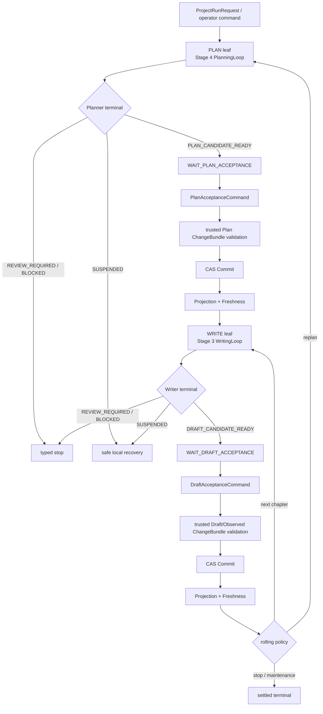

# Stage 5 Long-running Creative Runtime 总体设计

> 文档生命周期：`ACTIVE`
>
> 设计状态：`DESIGN_BASELINE_2026-08-12 / BOUNDED_CONCURRENCY_INTEGRATION`
>
> 开发状态：`STAGE345_ENGINEERING_CLOSED_LOOP_READY / REAL_MODEL_GATES_PENDING`
>
> 阶段：Stage 5 — Long-running Creative Runtime
>
> 上位决定：ADR-0006、ADR-0007
>
> 当前事实：Stage 2 `408a46f`、Stage 3 `bab4451`、Stage 4 `0dcf17a` 与 Stage 5 A 层已经收敛为
> 一个工程闭环 candidate；真实 Stage 3/4 adapter、可信 PlanRoot/TextRoot materializer、两路 dispatcher
> 和 Writer/Planner lookahead revalidation 已实现。真实模型语义 Gate 仍按各阶段独立报告。

## 1. 结论

Stage 5 可以现在开始隔离开发，但只能先开发具有当前真实调用边界的长期运行内核，不能在 Stage 4
尚未通过候选闭环 Gate 时宣称完整 Stage 5 已经成立。

当前允许隔离开发的内容是：

```text
固定 Plan / Write / Accept / Commit 拓扑
+ event-derived TaskRecord / TaskAttempt / AttemptFence
+ 候选接受命令与 manual / semi / auto 停点
+ RunEvent / EffectReceipt / settled checkpoint 恢复
+ 现有 CommitService / ProjectionOutbox / FreshnessGate 接入
+ 单项目 single-writer lane
+ operator pause / resume / cancel / retry
+ 面向现有投影、任务和 Artifact 的最小维护命令
```

当前不得提前完成或启用的内容是：

```text
跨项目自动长期运行
无真实多 Worker caller 的 heartbeat / lease / reclaim 平台
通用 DAG、消息队列、第二套 event/session/step store
无外部 caller 的 Hook ingress
无运行样本和 held-out 数据的自动 Skill 演化
Temporal 或其他分布式 workflow 平台
```

因此，Stage 5 的正确交付方式不是“等 Stage 4 完成后才思考”，也不是“现在把整个平台一次造完”，
而是先在独立 worktree 建成可由严格 fake leaf 和现有 Commit 基础验证的 Runtime Kernel；Stage 4 Gate
通过后只替换 Planner leaf adapter 的原计划已经完成；可信 PlanRoot/TextRoot materializer 也已在同一
integration candidate 中闭合。后续只补真实模型 Gate，再按实际长期运行证据启用维护和受控演化工作包。

2026-08-12 的整合决定不降低上述产品 Gate：允许把当前 Stage 3/4 工程候选和 Stage 5 A 层收敛为
一个 **integration candidate**，用真实 leaf adapter、确定性/离线 fixture 和有界并发证明组合正确性；
但在 Stage 3 三方案语义 Gate、Stage 4 七模式语义 Gate 和 Stage 5 真实多章 Gate 完成前，状态仍是
`CONDITIONAL`，不得启用生产自动运行。

实际实现采用 `runtime_parallelism=1|2`，不提供 4/6/8 并发。开发期不再通过反复源码 fingerprint/hash
比对判定正确性；准入依据是 typed version/feature、显式 basis/lineage、行为测试和最终产品 Gate。

## 2. 当前代码事实

### 2.1 已存在的运行与提交底座

当前主线已经有：

- `domain/runtime.py`：`RunEvent`、`RunCheckpoint`、`EffectReceipt`、resumability/effect 状态；
- `services/event_log.py`：按 Run 单调 sequence、幂等 identity、PostgreSQL advisory lock、checkpoint
  high-watermark 校验和 replay；
- `services/commits.py`：`CommitService` 的显式 validation、base-commit CAS、幂等 Commit receipt、
  Project current commit 推进和 projection outbox；
- `services/projection.py`：outbox claim/lease、失败重试、完整 build 后 publish、Derived Snapshot 和
  `FreshnessGate`；
- `services/model_request_admission.py`：endpoint-global request/KV 容量边界；
- Artifact Store、五 Root、ChangeBundle、validation、Memory Gateway、Projection/Freshness 既有 owner。

这些能力已经覆盖“事实、效果、检查点、可信提交、派生投影和模型容量”的基础。Stage 5 的缺口不是
再建一套工作流存储，而是给真实 Planner/Writer 候选链补上 Task/Attempt、固定拓扑、命令语义、恢复
选择和长期运维。

### 2.1.1 Hierarchy migration admission (2026-09-02)

Non-lookahead production cadence is: consume the full CHAPTER_SET horizon, then plan the next
window (`plan 1–5 → draft 1…5 → plan 6–10`). `enable_planner_lookahead=False` is required for this
migration. A `BLOCKED` plan is durable work: replacement must explicit-supersede and mint a new
task identity, never recreate the same id. Final accepted Drafts outside the trusted
`WritingTaskContract.length_policy` cannot mutate TextRoot
(`reason=draft_length_contract_rejected`).

Replan invalidates future descendants while keeping committed-prefix CHAPTER/SCENE nodes.
Genesis bootstrap PlanRoot is a seed; the first accepted STORY replaces unscoped bootstrap nodes
instead of keeping two story truths. Hierarchy schema is for fresh runs; old 1–23 production runs
are not migrated in place.

V0.5 four-condition semantics are unchanged.

### 2.2 Stage 3 的实际可用边界

独立分支 `codex/stage3-writer-context-loop` 的 `bab4451` 已实现 Writer/Editor/Observer、
`WriterWorkPlan`、反应式 `REQUEST_MEMORY`、共享 `AgentContextView`/ContextDelta/compaction、
checkpoint replay、候选 reconciliation 和 Stage 3 评价 runner。其统一确定性证据为 1893 passed、
100% coverage 和 full pre-commit。

这个事实足以让 Stage 5 以窄 Writer leaf port 开发真实 adapter，但不能被扩大解释为：

- Stage 3 已合并当前 main；
- 真实模型三方案语义 Gate 已通过；
- Stage 3 可以直接写 Canon；
- Stage 5 可以跳过候选接受和 Commit 验证。

Stage 3 对 Stage 5 的最高输出仍是 immutable Draft candidate 和 typed terminal。

### 2.3 Stage 4 的当前边界

独立分支 `codex/stage4-planner-context-loop` 已有 `PlanningInquiry`、`GoalProposal`、Planner-specific
Need、`PlannerContextPackage`、共享 Context Runtime 接入、独立 Plan Review、有界 revision 和
Stage 4 schema/evaluation 候选实现；但它仍在推进，尚无可作为正式集成基线的 Stage 4 PASS。

Stage 5 因此只能先冻结下列窄 leaf port，不能复制 Stage 4 内部实现：

```text
PlanningLeaf.run(PlanningLoopRequest)
  -> PLAN_CANDIDATE_READY
   | REVIEW_REQUIRED
   | SUSPENDED
   | BLOCKED
```

Planner 如何提出 inquiry、如何生成 MemoryNeed、如何管理 Planner Context、如何 Review 仍完全属于
Stage 4。Stage 5 只消费终态、candidate artifact 和完整 lineage。

## 3. 产品目标与非目标

### 3.1 产品目标

Stage 5 把 Stage 4 规划候选、Stage 3 正文候选、现有 Memory/Commit/Projection 组织成可跨进程、跨章、
跨天恢复的创作事务：

```text
Author / Schedule / Operator command
→ Planner candidate
→ explicit plan acceptance
→ trusted PlanRoot ChangeBundle / CAS Commit
→ exact Projection / Freshness
→ accepted rolling plan conditioned Writer Memory
→ Writer / Editor / Observer candidate loop
→ explicit draft acceptance
→ trusted Text/World/Profile ChangeBundle / CAS Commit
→ exact Projection / Freshness
→ next chapter, rolling replan or maintenance
```

最终产品应做到：

- 长任务重启后只从最新可证明的 safe boundary 恢复；
- 只重试失败层，不重新生成已通过的 Planner/Writer candidate；
- manual/semi/auto 只改变停点，不改变安全合同；
- 同一项目只有一个当前 Canon writer generation；
- 任意候选都不能因调度器判断而直接成为 Canon；
- Commit 成功而 Projection 失败时恢复 Projection，不重新规划或写作；
- 所有长期维护和 Skill 演化都可审计、可拒绝、可回滚且默认不改 Canon。

### 3.2 非目标

第一版 Stage 5 不建设：

- 任意 Agent DAG、可视化工作流语言或通用编排平台；
- 与 `RunEventLog` 平行的 Task 真源、conversation DB、StepStore 或 workflow history；
- 通过 LLM 决定权限、接受、Commit、reclaim 或 active Skill promotion；
- 同一本书并发推进多个 Canon chapter；
- 默认三路检索、第二个 Memory Gateway 或 Planner/Writer 共用 Need 生成器；
- 因“以后可能有用”而建设的外部 Hook、Viewer、向量库、Neo4j、Temporal 或 HA。

## 4. 固定创作拓扑

### 4.1 第一版拓扑



这不是通用 DAG。代码拥有固定 task kind 和固定合法转移；只有真实出现第二种无法由固定拓扑表达的
业务流程时，才重新评审 dependency 是否需要独立图合同。

### 4.1.1 有界 lookahead 扩展

固定拓扑允许在当前 `DRAFT_CANDIDATE` leaf 运行时，提前运行一个不依赖当前 Draft 内容的
`PLAN_CANDIDATE` lookahead。它不是新的 Task kind，也不产生第二套 Planner 路径：

```text
accepted plan horizon + exact basis C[N-1]
  ├─ foreground: Writer writes chapter N
  └─ lookahead: Planner proposes N+2..N+4 extension
```

lookahead task 必须携带 `purpose=LOOKAHEAD`、规划 horizon、固定 base commit/snapshot、被当前 Writer
占用的 chapter/scope 和失效策略。它只能产生 immutable candidate，不解锁 `PLAN_ACCEPTANCE` 或
`PLAN_COMMIT`。第 N 章 Draft Commit 与 exact Freshness 完成后，Runtime 以 C[N] 重新验证其 basis、
obligation、deviation 和人物/世界状态：无影响时才把候选晋升到正常 acceptance 停点；有影响时进入
Stage 4 bounded revision/replan。不得在 Runtime 内静默改写 Planner candidate。

同一本书仍不允许并行写 N 与 N+1。lookahead 的目的只是把不依赖当前章结果的未来规划计算移出下一章
关键路径，不改变一章一 Commit 和 exact-freshness-before-next-write 不变量。

### 4.2 最小持久任务单位

第一版只把跨进程恢复和人工停点需要的粗粒度动作建成 durable task：

| Task kind | 调用 owner | 成功产物 | 是否可能推进 Canon |
|---|---|---|---|
| `PLAN_CANDIDATE` | Stage 4 leaf adapter | Plan candidate + review receipt | 否 |
| `PLAN_ACCEPTANCE` | acceptance policy/operator command | accepted candidate binding | 否 |
| `PLAN_COMMIT` | trusted materializer/validator/CommitService | accepted PlanRoot commit | 是 |
| `DRAFT_CANDIDATE` | Stage 3 leaf adapter | Draft + reconciliation receipt | 否 |
| `DRAFT_ACCEPTANCE` | acceptance policy/operator command | accepted candidate binding | 否 |
| `DRAFT_COMMIT` | trusted materializer/validator/CommitService | accepted Text/World/Profile commit | 是 |
| `PROJECTION_FRESHNESS` | existing projection/freshness owners | exact snapshot/freshness receipt | 否，派生层 |
| `MAINTENANCE` | maintenance command runner | audit/rebuild/evaluation receipt | 默认否 |

Writer 内部 work-plan、memory request、Editor repair 和 compaction 继续是 leaf RunEvent/settlement，不为
每一步新增 Task 表。Planner 内部 inquiry/review/revision 同理。

## 5. Task、Attempt 与唯一状态转换 owner

### 5.1 `TaskRecord` 与 `TaskAttempt` 分离

`TaskRecord` 表达长期业务身份和依赖；`TaskAttempt` 表达一次 worker 执行。重试创建新 Attempt，不能
复活旧 Attempt 或抹掉失败历史。

建议最小合同：

```text
TaskRecord
  task_id / run_id / project_id / kind
  task_revision / status / priority / scheduled_for
  basis_commit / basis_snapshot / policy_hash / permission_hash
  input_artifact_refs / dependency_task_ids
  current_attempt_id / terminal_artifact_refs
  block_cause / failure_budget

TaskAttempt
  attempt_id / task_id / attempt_no
  worker_id / claim_token_digest / fence_generation
  claimed_at / started_at / ended_at
  source_checkpoint_id / effect_frontier
  outcome / failure_class

C1 multi-worker extension（触发后才增加）
  heartbeat_at / lease_expires_at / liveness_policy

AttemptFence
  project_id / task_id / attempt_id
  claim_token / task_revision / writer_generation
```

所有 worker-side mutate、effect settlement、checkpoint 和 completion command 都必须携带完整
`AttemptFence`。旧 Attempt 的迟到回调可以记录 reconciliation evidence，但不能推进当前 Task 或 Canon。

### 5.2 最小状态集

第一版状态用于固定拓扑，不作为通用 workflow vocabulary：

| 状态 | 精确定义 |
|---|---|
| `PENDING` | 固定前置条件尚未满足 |
| `READY` | 当前 basis、permission、dependency、schedule 均允许 claim |
| `RUNNING` | 有唯一 current Attempt/fence |
| `WAITING_INPUT` | 等待显式接受或作者/operator 决定；不持有 worker lease |
| `WAITING_RETRY` | 已知 effect terminal，且同一责任层允许在指定时间创建新 Attempt |
| `RECOVERY_PENDING` | worker/liveness/effect 仍需对账，禁止新 Attempt |
| `BLOCKED` | 需要修复输入、权限、basis 或外部状态，不能自动重试 |
| `SUCCEEDED` | 所需 artifact/receipt 已 settled，固定后继可解锁 |
| `FAILED` | 预算用尽或不可恢复失败的终态 |
| `CANCELLED` | 显式取消完成；不得作为成功依赖 |

`SUSPENDED` 是 Stage 3/4 leaf terminal；Stage 5 command service 必须按 failure class 映射到
`WAITING_RETRY`、`RECOVERY_PENDING` 或 `BLOCKED`，不能把所有异常统一重排。

### 5.3 Eligibility 只有一个定义

`evaluate_task_eligibility(snapshot, now, policy)` 是纯函数，由 recompute、claim、resume、unblock 共用。
它至少重查：

- task revision 和 current attempt；
- 固定 dependency 的终态和成功语义；
- current project commit 是否仍等于 task basis；
- required snapshot/freshness 是否满足；
- author/operator permission 是否仍有效；
- scheduled time、cancel 和 supersede 状态；
- single-writer generation；
- poison/failure budget。

Ready projection 只能作为查询优化；claim 事务内必须再次计算 eligibility。

### 5.4 Task 状态的唯一写入口

Agent、CLI、API、scheduler、Supervisor 都不能直接更新 task row。唯一写入口是 typed command service：

```text
create_run / create_task
claim_task / start_attempt
settle_effect / save_checkpoint / complete_attempt / fail_attempt
submit_acceptance / pause / resume / cancel / retry / unblock
mark_recovery_pending / reconcile_effect
```

`heartbeat_attempt/reclaim_attempt` 只有 C1 multi-worker caller 成立后才进入正式 command registry；A 层
只保留 recovery-pending/operator reconcile 语义，不预建 lease 状态机。

每条命令负责 domain validation、projection CAS 和 RunEvent append；不得让 ORM row 本身拥有业务规则。

## 6. 单一事实源、投影与事务

### 6.1 事实关系

```text
RunEventLog + immutable Artifacts + Commit chain
  ├── Task/Attempt/Effect projection       durable query / claim view
  ├── AgentContextView                    leaf context projection
  ├── DerivedSnapshot / search indexes    Canon-derived projection
  └── reports / metrics / supervisor view rebuildable operations views
```

Task/Attempt PostgreSQL 表是可查询、可 claim、可从事件审计的运行投影，不是第二真源。大 payload 进入
Artifact Store；event 只保存 typed metadata、hash/ref、basis 和结果。

### 6.2 原子命令写入

现有 `RunEventLogRepository.append()` 应最小扩展为可在现有 Session 内调用的内部 primitive。Task
command service 在一个 PostgreSQL transaction 中完成：

```text
lock task projection
→ validate revision / fence / eligibility
→ update Task/Attempt/Effect projection
→ append typed RunEvent with next monotonic sequence
→ commit
```

不引入通用 unit-of-work framework。现有 public `append()` 继续工作，内部 `_append_in_session()` 只给
可信 service/adapters 使用。

### 6.3 最小表集

隔离 Runtime Kernel 的最小新增表是：

- `runtime_task_projection`；
- `runtime_task_attempt`；
- `runtime_effect_projection`；
- 可选的 `project_writer_claim`，仅当现有 Project row CAS 不能清楚表达 writer generation 时增加。

固定依赖先从 task payload 和事件推导，不建通用 dependency graph 表。外部 Hook、Observation、Skill
candidate 也不能挤入这组三张表。

## 7. 候选接受与可信提交

### 7.1 候选与接受是两件事

`PLAN_CANDIDATE_READY` 和 `DRAFT_CANDIDATE_READY` 只说明候选链内部闭环完成。Stage 5 必须收到独立
`AcceptanceCommand`，其 identity、actor/policy、candidate hash、basis、范围和时间均持久化。

```text
AcceptanceCommand
  command_id / project_id / run_id / task_id
  candidate_id / candidate_artifact_ref / candidate_hash
  candidate_basis_commit / acceptance_policy_hash
  actor_kind / actor_id / decision / reason
  expected_project_commit / idempotency_identity
```

同一 candidate 的重复相同命令幂等；相同 identity 指向不同 candidate 必须冲突。拒绝不会删除候选，
只形成终态 receipt。

### 7.2 manual、semi、auto 只改变停点

| 模式 | 默认停点 | 仍不可绕过的门 |
|---|---|---|
| `manual` | Planner candidate、Writer draft 或每次修订后 | Review、validation、CAS、freshness |
| `semi` | Plan/Draft candidate 完整闭环后等待人类接受 | Review、validation、CAS、freshness |
| `auto` | policy 可自动产生 acceptance command | 独立 acceptance policy、Review、validation、CAS、freshness |

`auto` 不是 Agent 自我接受。自动策略必须版本化、Profile-pinned、只对明确允许的 task kind/质量门生效，
并输出与人工接受同形的 command/receipt。

### 7.3 Plan 与 Draft 的提交链

接受之后仍需可信代码完成：

```text
candidate + accepted binding
→ candidate-specific materializer
→ ChangeBundle / observed changes
→ deterministic + trusted validation
→ CommitRequest(expected base commit)
→ CommitService CAS
→ ProjectionOutbox
→ exact DerivedSnapshot
→ FreshnessGate READY
```

Stage 5 不把 Planner proposal 直接序列化成 PlanRoot，也不把 Draft 文本直接覆盖 TextRoot。Plan 和 Draft
分别有 materializer/validator，但复用现有 ChangeBundle、CommitService、outbox 和 freshness owner。

Commit 冲突进入 typed rebase/replan 决策，不自动在新 base 上重放旧候选。Commit 已接受而 Projection
失败时，Task 停在 `PROJECTION_FRESHNESS`，只恢复投影层。

## 8. 调度与并发边界

### 8.1 三种 admission 必须分开

```text
Task claim/fence       决定哪个 Attempt 拥有一个 durable task
Project writer lane    决定哪个 generation 可以推进本项目 working/Canon state
Model capacity lease   决定哪个模型请求可以占 endpoint request/KV 容量
```

不能用一把项目锁代替全部三层。现有 `ModelRequestAdmissionController` 保持模型容量 owner；Stage 5 不
复制其 request/KV scheduler。

### 8.2 项目 single-writer lane

- 同一项目同一时间最多一个可推进 PlanRoot/TextRoot/WorldRoot/ProfileRoot 的 writer generation；
- candidate leaf 可以在不持有 Canon writer claim 时执行，但其 basis 必须固定；
- Commit 前必须重新获取/验证 project writer generation 和 expected base commit；
- takeover 顺序是先 durable CAS 新 owner，再取消旧 owner；新 claim 失败时旧 owner 继续有效；
- 旧 generation 的 candidate 可保留审阅，但不能迟到 Commit。

### 8.3 隔离版与多 Worker 版

隔离版先实现单 dispatcher、fresh Attempt 和强 fence。只有真实 multi-worker/cross-process caller 成立后，
才启用 heartbeat/lease/reclaim：

- lease 到期只进入 `RECOVERY_PENDING`，不是重复执行许可；
- Supervisor 必须同时检查 worker liveness、heartbeat、provider job 和 unresolved effects；
- reclaim 前先 fence 旧 owner、对账 effect frontier，再创建新 Attempt；
- 无法确认 external effect 时保持 blocked/human-required，绝不盲重放。

### 8.4 定时任务

scheduled maintenance 的关键是 fire identity，不是 cron 表达式。每个 fire 必须有稳定
`schedule_id + scheduled_for` identity；同一 fire 只能一个 scheduler claim，推进 next schedule 与 fire
claim 原子化，并先执行 deterministic pre-check。没有投影积压、stale task、到期评价或明确维护需求时，
不调用 LLM。

### 8.5 两路有界运行并发

第一版产品并发只增加一个进程内、dependency-aware 的 bounded dispatcher，不启用 C1 multi-worker
lease/reclaim，也不新增 scheduler service。一个 run 最多同时执行两个不互相依赖的 candidate/maintenance
Attempt：

```text
foreground lane
  当前章节关键路径：Writer、Editor/repair、acceptance 后 materialize/validation/Commit blocker

lookahead/background lane
  Planner lookahead、只读取已接受 basis 的历史维护分析、可取消 prefetch、非阻断评价
```

两条 lane 的全部模型调用仍经过同一个 `ModelRequestAdmissionController`。业务任务并发度与模型实际
并发度分离：dispatcher 可以同时推进两个 leaf，而 endpoint controller 根据 request-count 和保守的
prompt+output+safety KV 预算决定实际放行 1 或 2 个请求。容量不足是 `WAITING_FOR_CAPACITY`；不得通过
删证据、缩 Context、降低输出上限或跳过 mandatory Need 换取并发。

优先级只使用现有四级语义：Commit/repair blocker 为 P0，当前 Writer/Editor/正常 Planner 为 P1，
lookahead/prefetch 为 P2，离线维护/评价为 P3。远程或不可无损暂停的模型调用只在 LLM call 边界协作式
让出；不把 vLLM 的内部 preemption 当作业务恢复。

允许的重叠：

- Writer N 与基于 C[N-1] 的 Planner lookahead；
- Writer 与只读取 C[N-1] 或更早 accepted state 的派生维护/历史分析；
- Draft settled 后的 Editor Review 与确定性 Draft checks；
- Commit 后互不依赖的 Derived build；
- 相同 basis/scope/access 下可去重的 MemoryNeed preparation/retrieval。

禁止的重叠：

- 两个可推进同一项目 Canon 的 generation/Commit；
- Writer N 与会改变其 base commit、Plan、World 或可见 Memory Canon 的后台提交；
- Writer N+1 在 N 的 Draft Commit 与 exact Freshness 前开始；
- 把未通过最终 Editor/Observer/reconciliation 的 Draft 作为正式 MemoryPatch 来源；
- 让并发改变 prompt、context hash、evidence set、sampling、budget 或 failure policy。

后台语义维护可以并行生成 `MaintenancePatchCandidate`，但只能在当前 foreground safe boundary 后由
Guardian/validation 复核并进入 single-writer Commit；如果 basis 已变化，必须重新验证或废弃。

## 9. Effect、Checkpoint 与恢复

### 9.1 Effect frontier

每个外部 effect 使用稳定 `effect_identity + request_identity`：

```text
REQUESTED
  → COMPLETED / FAILED / COMPENSATED
  → 或 UNCERTAIN / RECOVERY_PENDING
```

进程恢复时，存在 requested 而无 authoritative terminal receipt 的 effect 必须先调用 adapter
query/reconcile；adapter 不支持查询时进入显式人工处理，不能凭 exception 推断 effect 未发生。

模型 provider 的内部 retry 归 Model Gateway；leaf repair 归 Stage 3/4；Task retry 归 Stage 5 command
service。三层 retry identity 和预算必须同时出现在 receipt，禁止多层无界重试。

### 9.2 Settled checkpoint

可恢复 checkpoint 必须证明：

- 对应已有 RunEvent high-watermark；
- state artifact 可验证且 schema/fingerprint 匹配；
- provider tool batch、thinking/tool loop 和结构固定点合法；
- Context basis、permission、information/no-leak 属性合法；
- candidate/receipt/artifact lineage 完整；
- effect frontier 无未对账 effect；
- 当前 project commit/snapshot/profile 与 checkpoint basis 可重新验证。

“最新 checkpoint”不等于“最新 safe checkpoint”。默认 resume 只选择 `RESUMABLE`；更新但
`BLOCKED/INTERRUPTED` 的 checkpoint 不覆盖旧 safe checkpoint。

### 9.3 局部恢复矩阵

| 失败位置 | 恢复 owner | 禁止动作 |
|---|---|---|
| Planner model/review | Stage 4 leaf | 重跑已 accepted 的旧 Plan commit |
| Plan acceptance 等待 | operator/policy command | 自动伪造同意 |
| Plan materialize/validation | Stage 5 trusted service | 修改 Planner candidate 掩盖失败 |
| Plan Commit 冲突 | replan/rebase decision | 在新 base 盲提交旧 Plan |
| Projection/Freshness | existing projection owner | 重跑 Planner/Writer |
| Writer/Editor/Observer | Stage 3 leaf | 重跑已通过的 Plan commit |
| Draft acceptance 等待 | operator/policy command | 自动跳过 review/reconciliation |
| Draft materialize/validation | Stage 5 trusted service | 直接覆盖 Root |
| external effect uncertain | reconciler/operator | 无 receipt 重放 |
| Context compaction | shared Context Runtime | 删除原 RunEvent |

## 10. 长期维护与 Supervisor

### 10.1 Maintenance 责任

第一版 Maintenance 只封装现有系统确有的维护任务：

- projection outbox/freshness 对账与安全 rebuild；
- runtime Task/Attempt/Event projection 一致性审计；
- stale `RUNNING/RECOVERY_PENDING/WAITING_RETRY` 检测；
- Effect requested/no-terminal 对账队列；
- Artifact 引用/hash/schema 验证和孤立 derived artifact 报告；
- Context View/compaction projection rebuild；
- 延迟质量评价和成本/失败报告；
- poison-loop、failure-budget、长期停滞告警。

Maintenance 默认只产生 receipt、修复 derived projection 或提交 operator proposal。它不能直接改变
Canon、PlanRoot、active Profile 或 active Skill。

### 10.2 Supervisor 权限

Supervisor 是诊断和命令提议者，不是超级 Agent。它可以：

- 发现 stuck task、lease suspicion、poison signature、budget exhaustion；
- 发出 pause、reconcile、operator-review、safe-retry proposal；
- 在策略明确允许且 effect 已对账时调用 typed command；
- 汇总跨 run 运维指标。

它不能：

- 自己改 task row；
- 接受 Plan/Draft；
- 绕过 Commit/validation/freshness；
- 把运行 observation 写入 Canon；
- 晋升 active Skill。

## 11. 外部 Hook 与 OperationalObservation

内部 Writer、Planner、Editor、Reviewer、Tool、Model 和 Runtime 已经能直接写 `RunEvent`，不得再走
Hook/HTTP 形成重复事件。

只有真实外部 Agent、IDE、plugin 或不受 NS Runtime 控制的 Tool 出现时，才实现窄 Hook ingress：

```text
validate project/run identity
→ allowlist + redact + size limit
→ idempotent raw artifact/event persistence
→ fast response
→ async normalize / derive / index / quarantine
```

同步请求路径不得调用 LLM、embedding、OpenSearch、graph extraction、consolidation、Context injection、
Memory write 或 Commit。OperationalObservation 使用独立 namespace/channel/index，永不进入 Canon Typed
Graph，也不因被频繁访问而提升为事实。

## 12. 受控 Experience / Skill 演化

### 12.1 演化链

Stage 5 最终的受控演化链是：

```text
RunEvent / Evaluation / OperationalObservation
→ sanitized ExperienceCandidate
→ bounded consolidation
→ SkillCandidate (new immutable version)
→ held-out deterministic + semantic evaluation
→ regression / safety / cost comparison
→ explicit promotion decision
→ ProjectProfile pins new Skill version
→ canary / rollback receipt
```

任何一步都不能原地修改 active Skill。候选必须记录来源 runs、适用 task strata、变更 diff、作者/模型、
训练与 held-out 集身份、评价结果、兼容范围和回滚版本。

### 12.2 启用条件

Skill evolution 实现必须至少有：

- 足够的真实 Stage 5 成功/失败运行样本；
- 明确的重复失败或稳定改进目标；
- 与生成样本隔离的 held-out corpus；
- 可复现 evaluator、阈值和 promotion policy；
- active Skill registry 的 immutable version/pin/rollback 能力；
- 证明候选不会扩大 Tool/Memory/Canon 权限的 contract test。

在这些条件出现前，只保留设计和静态 Skill Registry；不创建自动 consolidation 平台。

## 13. Temporal 与外部 Runtime 的启用门槛

PostgreSQL Task/Attempt/RunEvent Runtime 是默认实现。以下触发项中至少两项成为真实需求，并用固定
workload 证明当前方案的恢复/运维成本明显失控后，才创建 Temporal 对照 ADR/benchmark：

1. 跨天且跨机器恢复成为常态；
2. 复杂人类等待/approval 超出当前 command/checkpoint 能力；
3. unknown external effect 对账成为主要故障源；
4. 多项目规模使 PG dispatcher/supervisor 成为瓶颈；
5. 当前恢复代码的维护成本有量化证据。

即使采用 Temporal，Task/Attempt/Commit/Canon/RunEvent 语义仍属于 NS；Temporal 只可作为 leaf activity/
workflow execution adapter，不能成为业务真源。

## 14. 隔离开发边界

### 14.1 现在可以开发

在不读取 Stage 4 内部实现的前提下，独立 worktree 可以连续实现：

- Stage 5 domain contract 和固定 topology reducer；
- typed task/attempt/effect/acceptance/control event payload；
- task/attempt/effect PostgreSQL projection 和 command service；
- 单 dispatcher claim、fresh Attempt、strong fence；
- strict `PlanningLeafPort` / `WritingLeafPort`，真实 Stage 3 adapter，以及用于故障注入的
  deterministic fake；
- candidate acceptance、现有 CommitService、Projection/Freshness adapter；
- 真实 Stage 4/Stage 3 leaf adapter 与可信 PlanRoot/TextRoot materializer；
- settled checkpoint selector、effect reconciler port；
- pause/resume/cancel/retry 和最小 maintenance command；
- end-to-end fake Planner → real Runtime → real Stage 3 Writer adapter（离线/确定性合同路径）→ real
  Commit/Projection 测试链；故障矩阵可注入 strict fake Writer。

### 14.2 已完成的 Stage 4 / B 层接入

- 真实 `PlanningContextLoopService` adapter；
- Stage 4 candidate/basis/review receipt 到 Plan materializer 的最终映射；
- real Plan candidate → accepted PlanRoot → Stage 3 Writer task 的完整 lineage；
- Stage 3 complete result/Editor/Observer/reconciliation 到 TextRoot materializer 的最终映射；
- Planner failure/revision/human-required 与 Stage 5 Task status 的最终转换表。

仍待执行的是使用真实 Planner/Writer 模型的完整 Stage 5 product Gate，不是新的工程 owner。

### 14.3 必须等运行证据触发

- multi-worker heartbeat/lease/reclaim；
- scheduled fire/cron service；
- external Hook/Operational pipeline；
- Experience/Skill candidate/promotion；
- Temporal、通用 dependency graph、HA 和运维 UI。

## 15. 安全、权限与审计不变量

1. Planner/Writer/Reviewer/Editor/Observer 只能产生 candidate/receipt，不能 Commit。
2. Acceptance command 不能替代 validation；validation 不能替代 CAS。
3. 所有 Canon mutation 只有现有 `CommitService` 一个入口。
4. Task claim、project writer lane 和 model capacity admission 分责。
5. 所有 worker mutation 必须有 current `AttemptFence`；迟到写 fail closed。
6. lease 到期不是重试授权；uncertain effect 未对账不得 replay。
7. recovery 只从 settled safe checkpoint 开始，并重验 basis/permission/freshness。
8. RunEvent、Artifact 和 Commit history 不因 compaction、retention 或 Skill evolution 被删除/改写。
9. Operational/Experience/Skill candidate 与 Canon/Plan/World graph 分 namespace、分权限、分通道。
10. manual/semi/auto 不改变 Editor/Reviewer/Curator/validation/CAS/freshness 硬门。
11. 同一项目不得并发推进两个 Canon generation。
12. 每个 fallback/degraded/retry/reclaim/promotion 都必须出现在 typed receipt 和最终报告。

## 16. Stage 5 最终验收

Stage 2～5 面向真实小说的纵向闭环、最近正文合同、已确认工程断点及首轮宽松可用性 Pilot 统一见
`docs/stage2_to_stage5_real_novel_vertical_pilot_execution.md`。其中的 checkpoint 和窗口只是测试参数；
Stage 5 产品入口仍必须支持任意合法 current chapter、target chapter 和 ProjectProfile rolling policy。

### 16.1 Runtime correctness

- 双 worker claim race 只有一个 Task/Attempt/Event 原子组成功；
- task basis/dependency 在 claim 前变化时，ready projection 不会导致错误 claim；
- 旧 Attempt 的 heartbeat/complete/checkpoint/Commit 全部被 fence 拒绝；
- provider 成功但 receipt 丢失时 query/reconcile，不发生第二次调用；
- full event replay 与增量 Task/Attempt/Context projection 等价；
- blocked/interrupted checkpoint 不覆盖旧 safe checkpoint；
- crash 矩阵中不存在半个 Task update、半个 event 或半个 Canon commit。

### 16.2 Creative product loop

- 真实 Stage 4 Plan candidate 经显式接受、validation、CAS、Projection/Freshness 后成为 accepted plan；
- Stage 3 Writer 只读取该 accepted plan 和同一 exact basis；
- Draft candidate 经 Editor/Observer/reconciliation 后仍需独立接受和 trusted Commit；
- manual/semi/auto 产生相同安全语义，只在预期停点不同；
- Planner、Writer、Commit、Projection 任一层失败都只恢复本层或明确后继，不重跑已 settled 层；
- 同一本书串行、跨项目 endpoint admission 下结果语义一致。

### 16.3 Long-running operation

- 跨进程、跨天 kill/restart 后从数据库、Artifact 和 event 恢复，不依赖 Python 内存；
- pause/resume/cancel/interrupt/late callback 有稳定 identity 和审计；
- scheduled maintenance same fire once、无工作时零 LLM；
- poison-loop、failure budget、stale task 和 uncertain effect 能被 Supervisor 正确分类；
- Projection/Freshness 可独立重建，不重新规划/写作。

### 16.4 Controlled evolution

- Experience/Skill 只产生 immutable candidate；
- held-out 未通过时 active Skill 不变；
- promotion 有显式 receipt、Profile pin、canary 和 rollback；
- 不存在从 Hook/Observation/访问热度到 Canon/Plan/active Skill 的直接写路径。

## 17. 参考结论的具体采用

| 参考 | 采用 | 明确拒绝 |
|---|---|---|
| InkOS | 固定章节事务、宏观 Plan + rolling focus、停点策略、只重试失败层、单书串行 | 巨型 PipelineRunner、第二存储、ChapterMemo Canon、audit-failed 仍提交 |
| Hermes Agent | Task/Attempt 分离、事务内 eligibility/claim、failure budget、fire identity | 巨型 SQLite Runtime、PID-only liveness、lease 到期即重试 |
| OpenHands | append-only event→View、condensation event、安全 cut、rebuild | 新 event store、用 mutable messages 作为恢复合同 |
| OpenClaw | writer lane、takeover 顺序、input/control intent、compaction boundary | 进程内 map 作为 durable truth、一把 lane 锁替代全部 admission |
| PydanticAI/Harness | settled boundary、effect frontier、未来 leaf durable adapter 形状 | 现在引入 Temporal、StepStore、workflow history 替代 RunEvent |
| agentmemory | 外部 Hook 只做 ingress、Operational/Experience 隔离、held-out Skill candidate | Hook 内同步 LLM/索引、默认 Context 注入、自动改 active Skill |

这些参考只提供已验证的不变量和反例。Stage 5 继续服从 NS 的五 Root、Memory、Context、Artifact、
RunEvent、Commit 和 Gate 所有权。
