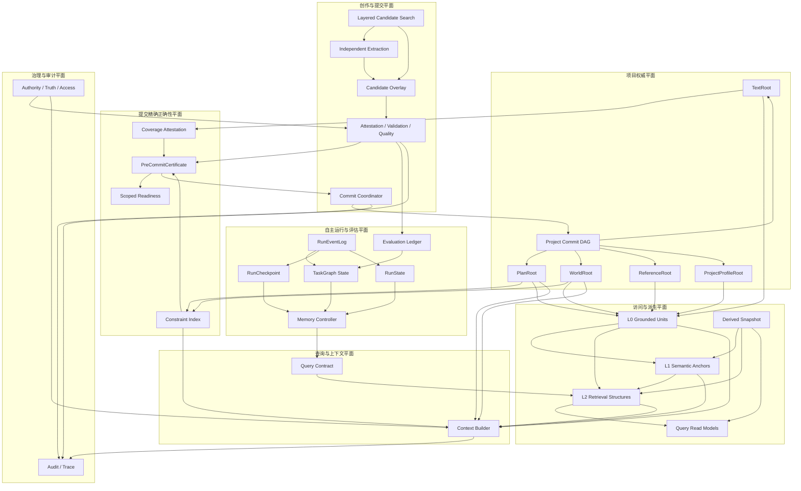
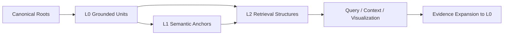
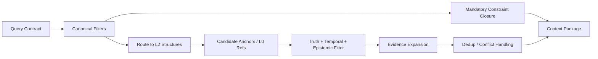
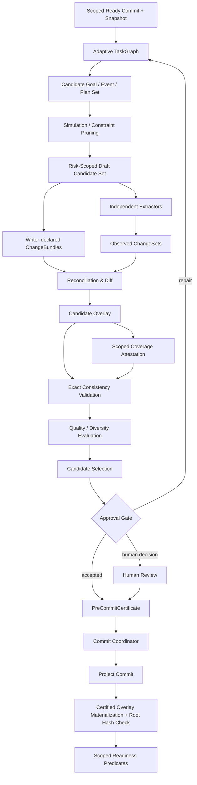
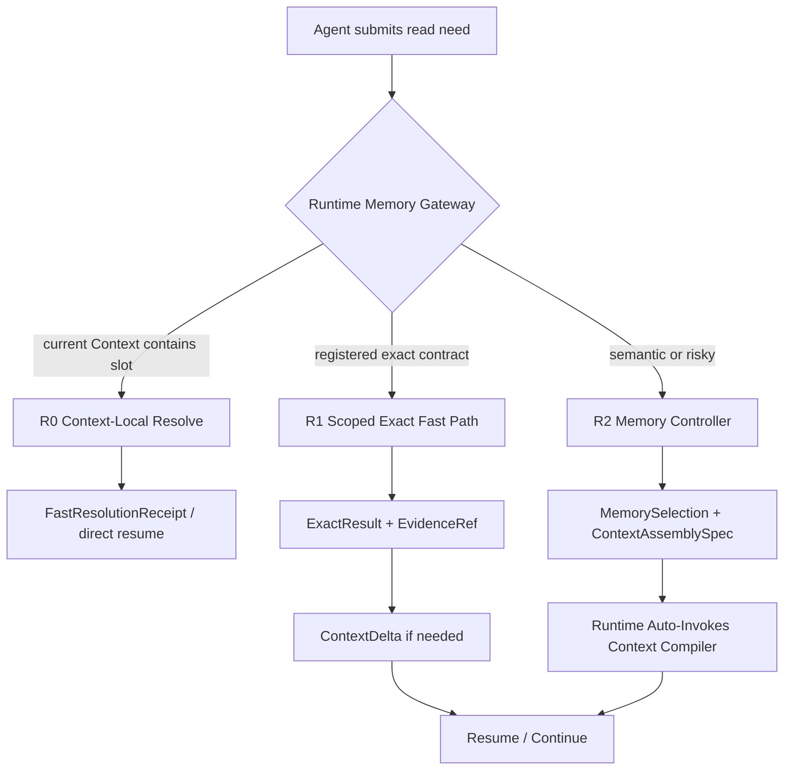
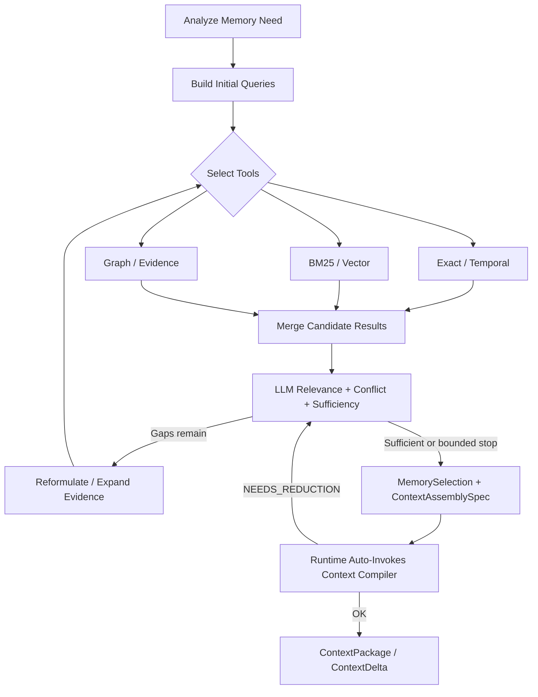
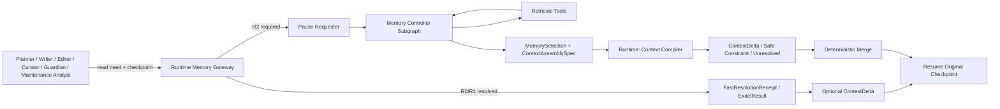
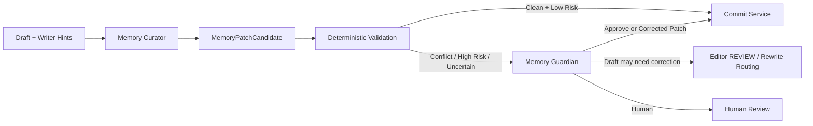
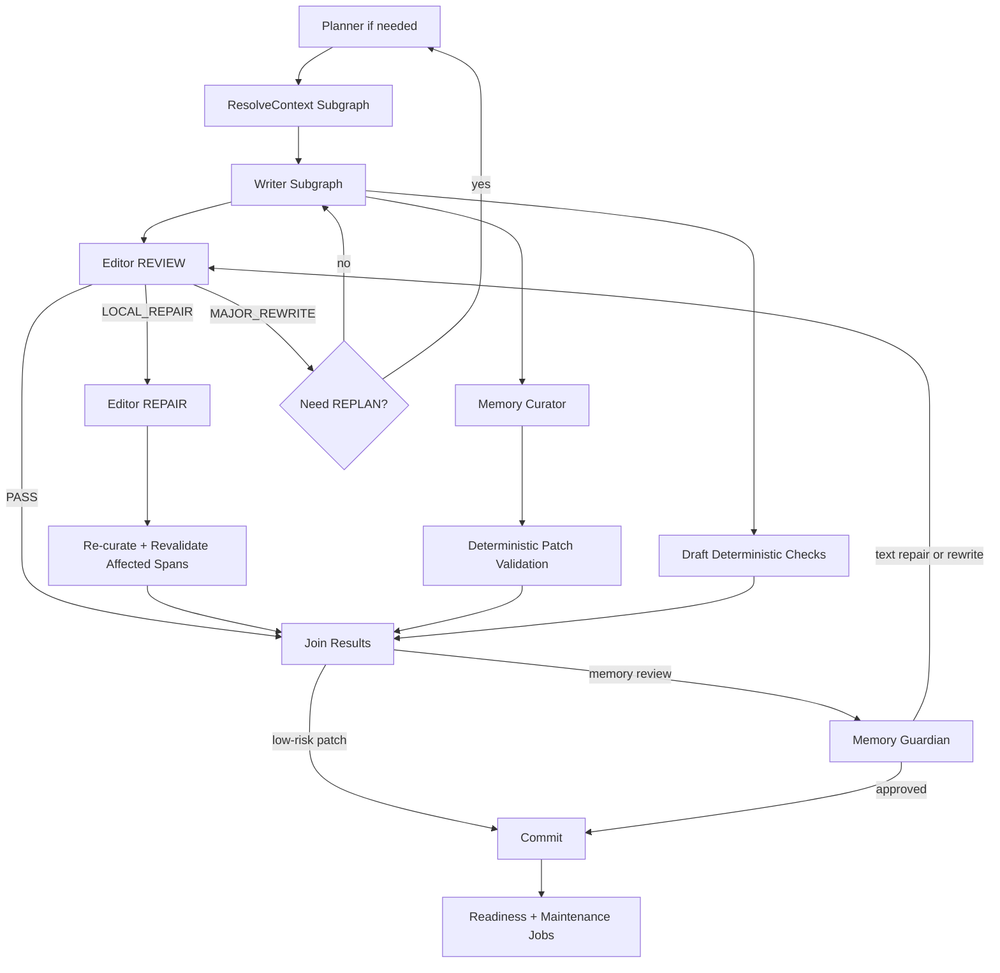

# 长篇小说 Agent 资产、世界模型、控制平面、运行与自演化总体架构设计

**版本**：v2.2（v2.1 + v0.2 完整合并讨论版）  
**状态**：高层概念架构基线候选 / Evolving Design Contract  
**合并基线**：  
- 《长篇小说 Agent 资产、世界模型、运行与提交架构设计》v2.1；
- 《长篇小说 Agent 控制平面、检索闭环与记忆维护设计》v0.2。

**适用范围**：长篇小说创作 Agent 的权威资产、结构化世界模型、规划、正文、参考资料、方法与 Skill、检索与上下文、记忆写回、质量与安全验收、任务调度、版本提交、自主运行、维护和受控演化。  
**文档层级**：总体逻辑架构与高层执行契约；不冻结具体数据库、模型、索引引擎、Agent 框架、Prompt、阈值、并发参数和部署方案。
**项目阶段命名**：以 `docs/adr/0005-stage-numbering-and-document-lifecycle.md` 为准；本文中的 `Phase` 仅表示概念落地分层，不等同于项目 `Stage` 编号。
**当前进度**：见 `docs/project_status.md`。
**最近修订**：2026-08-03（补充无损证据基线、Support Workset 与增强通路边界）。

---

## 0. 合并说明

### 0.1 合并方式

本版不是对原两份文档进行大幅重写，而是采用以下方式形成统一基线：

1. **第一部分完整保留 v2.1 的资产、世界模型、版本、提交、检索表示与治理设计**，作为权威资产和语义边界的主干；
2. **第二部分完整保留 v0.2 的 Agent、检索闭环、记忆写回、调度、维护与单章执行设计**，作为控制平面和运行职责的细化；
3. **第三部分仅对前述讨论中确认的问题进行统一补充和冲突消解**，包括：
   - 文学技巧与质量方法进入 Skill；
   - 硬安全与权威提交仍由 Constraint、Validation 和 Service 强制执行；
   - 增加产物验收、Skill 执行验收和 Skill 版本晋升的三层验收框架；
   - 补充 PlanProposal 生命周期、Artifact Lineage / Invalidation 和章节原子 ChangeBundle；
   - 补充 RunEventLog 作为 Autonomous Operation Profile 的一等运行事实记录；
   - 将 Memory Resolution 修正为 R0/R1/R2 分层路径，避免简单读取全部进入 LLM Controller；
   - 统一 v2.1 的逻辑角色与 v0.2 的运行组件名称。

除第三部分明确说明的修订外，第一、第二部分的原有架构逻辑继续保留。

### 0.2 文档解释优先级

当不同部分使用不同抽象层级描述同一职责时，按以下规则解释：

```text
权威所有权、真值、Root、Commit、Evidence、Canonical / Derived 边界
    → 第一部分 v2.1 为准

Agent 职责、MemoryNeed、检索循环、上下文编译、写回、调度与一章运行
    → 第二部分 v0.2 为准

Skill、质量与安全分层、验收、PlanProposal 生命周期、Artifact 失效规则
    → 第三部分统一补充为准
```

第三部分只覆盖明确列出的交叉点，不取消第一、第二部分未被讨论的设计。

### 0.3 本版不冻结的内容

本版仍不决定：

- 使用哪一种数据库、对象存储、图引擎、向量库或全文检索引擎；
- 使用 LangGraph、Temporal、AutoGen、自研 Runtime 或其他具体框架；
- 使用哪些具体模型、温度、采样率、上下文长度、调用次数和重试参数；
- 文学质量 Rubric、硬门禁阈值、自动批准白名单和风险分数的具体数值；
- Skill 的文件格式、检索算法、优化算法、训练算法和评测集实现；
- 两个或多个模型/API/GPU 资源的实际部署拓扑。

文中出现的具体技术、模型和参数均视为后续执行设计的候选或示例，除非被明确列为 Core Invariant。

---
# 第一部分：资产、世界模型、运行与提交架构（完整保留 v2.1）

**版本**：v2.1  
**状态**：高层概念架构基线候选（完成 v2.0 Major Revision；采用分层成熟度）  
**适用范围**：长篇小说创作 Agent 的正文、规划、结构化世界模型、参考资料、方法配置、检索表示、版本提交、自主运行、查询上下文、质量评估与治理  
**文档层级**：结构设计与高层架构；不包含具体数据库、模型、索引引擎、接口参数与部署方案

---

### 0. 文档使用说明

#### 0.1 本文档回答的问题

本文档定义：

1. 项目中哪些资产具有权威性，以及每类资产的唯一真源；
2. 正文、规划、故事事实、角色认知、外部资料和方法知识的边界；
3. L0、L1、L2 如何作为系统级访问与检索表示栈，而不是单条记录的枚举字段；
4. 命题、主张、信念、传闻、梦境、预测和世界事实如何区分；
5. 项目版本可见性、故事有效时间、叙述顺序、世界线和派生构建时间如何共同建模；
6. 草稿、候选变更、独立抽取、验证与正式提交如何形成受控闭环；
7. L1 锚点、BM25、向量、图、时间索引和查询读模型如何版本化、重建与失效；
8. Narrative Canon、Accepted World Model 与 Project Canonical State 如何区分；
9. 精确正确性结构与近似检索结构如何分离；
10. 自主运行如何检查点恢复，并在进入下一任务前满足相应范围化就绪条件；
11. 语义覆盖、叙事质量评估和方法晋升如何形成长期闭环；
12. 后续实现不得破坏的架构不变量和职责边界。

#### 0.2 本文档不回答的问题

以下内容由后续《执行规划与技术设计》确定：

- 数据库、对象存储、图引擎、向量库和全文检索引擎选型；
- JSON Schema、SQL DDL、API、事件协议和目录布局；
- Embedding 模型、分块算法、BM25 参数、图遍历与排序算法；
- Agent 数量、模型路由、Prompt、重试、超时和并发参数的具体数值；
- 校验阈值、审批规则和自动修复策略的具体数值；
- Context token 预算、检索融合权重、调用次数、成本、吞吐和延迟目标；
- Evidence 自动绑定、命题归一化、谓词发现、摘要去重和质量检测算法；
- 具体模型族之间的职责分配、独立性实现和评测基准；
- 部署拓扑、容量、性能、成本、备份和灾难恢复方案；
- 迁移脚本、回填程序、运维手册和验收测试实现。

#### 0.3 规范性用语

- **必须**：任何实现均不得违反；
- **应**：默认采用，除非有经过记录的架构决策；
- **可以**：允许的实现选择；
- **不得**：明确禁止。

#### 0.4 v2.1 审核意见取舍

v2.1 综合两份审核意见，采用“修正语义正确性 + 补齐自主运行闭环，但不提前绑定具体技术”的原则：

| 审核建议 | 决定 | v2.1 处理 |
|---|---|---|
| Narrative Canon 与结构化世界模型分离 | 采纳 | 定义 NarrativeCanon 与 AcceptedWorldModel，并声明开放世界语义 |
| 真值必须具有唯一语义拥有者 | 调整后采纳 | 使用 CanonicalStatement 统一承载可判真陈述；自由命题是其一种语义类型，Typed Payload 不另存第二套真值 |
| DAG 上废止线性 transaction interval | 采纳 | 使用 Root Membership、祖先可达性与版本谱系 |
| 当前证据与历史证据分离 | 采纳 | 增加 support status、CurrentSupportRef 与反向影响分析 |
| Semantic Coverage Manifest | 调整后采纳 | 改为范围化 Coverage Attestation，只能声明 Schema 范围内覆盖，不宣称开放文本语义完备 |
| Operational Run State 与 Generation-Ready | 采纳 | 增加 TaskGraph、RunCheckpoint，并将就绪拆分为绑定任务范围的多类判定 |
| Story 与 Process Knowledge 分根 | 修改后采纳 | 使用 WorldRoot + ProjectProfileRoot；共享方法资产归外部 Registry，项目根只固定采用版本与兼容策略 |
| Entity Alias、认知与披露拆分 | 采纳 | 使用 NameUse、Identity Proposition、EpistemicState、Disclosure |
| Access Scope 信息流追踪 | 采纳 | 增加 information label、derivation taint、scope join 与 approved redaction |
| Constraint Registry | 采纳 | 与 Predicate Registry 分工，阻断级规则优先确定性执行 |
| Narrative Control State 与 Evaluation Ledger | 采纳 | Plan 保存目标；Derived/Evaluation 保存实际质量与债务 |
| 所有生成都必须多候选 | 修改后采纳 | 高影响创作必须支持 Candidate Set；低风险机械变更可以单候选 |
| Writer 读取完整 Author View | 不原样采纳 | 由 Omniscient Planner 生成 spoiler-safe Constraint Capsule |
| 精确约束索引进入 Canonical Root | 不采纳 | 保持语义派生，但使用 exact + complete 证书并阻断不安全提交 |
| Snapshot 全部永久保存 | 不采纳 | 只对被接受产物实际引用的 Snapshot、Context 与输出执行 retention pin |

本表中的“采纳”表示该意见进入 v2.1 的架构讨论或契约，不等于相关 ADR 已达到 `accepted` 成熟度；其正式状态以第 24 节为准。

因此 v2.1 保留 v2.0 的 Text/Plan/Reference 所有权、L0/L1/L2 访问栈和受控提交思想，同时修正真值、分支、证据和身份模型，并新增正确性、运行和评估平面。

#### 0.5 架构成熟度与变更规则

本文件描述目标逻辑架构，不等于要求首个实现一次性启用全部能力。规范项按成熟度分为：

```text
Core Invariant
    已被目标与权威边界直接要求；任何兼容实现均不得破坏

Conditional / Profile Invariant
    仅在项目启用相应能力 Profile 时强制生效

Evolving Design Contract
    当前推荐的高层契约；允许根据原型证据通过 ADR 调整
```

ADR 状态定义为：

```text
accepted      已成为架构基线，修改需要替代 ADR
proposed      方向合理但尚待原型或利益相关者确认
experimental  需要实证验证，不能作为永久兼容承诺
deprecated    已退出新实现，保留迁移和历史说明
```

`proposed` 与 `experimental` 决策不得被实现文档误写成永久不变量。它们晋升为 `accepted` 时，应记录验证范围、失败边界、替代方案和主要代价；实现细节变化只要不破坏 Core Invariant，无需修改本高层架构。

#### 0.6 本次范围收敛修订

本次修订根据“本文是高层概念架构，而非具体工程设计”的边界进行收敛：

- 将原 69 条同级强制项重组为 16 条 Core Invariant、Profile 条件不变量与 Evolving Design Contract；
- 将需要实证的 ADR 调整为 `proposed / experimental`，不再全部标记为已接受；
- 增加 Capability Profile，使 Multi-Worldline、细粒度认知、方法演化、精确回放等能力可以按项目启用；
- 增加 PlanDeviationRecord、ArcTrajectory、StyleContract、Reader Target 与 Storyline 的逻辑所有权；
- 以 Assurance Class 表达概率性 Agent 的保证强度，不在本文指定模型族或算法；
- 将 token、成本、阈值、锁、租约、重试、调度和评测算法明确移交《执行规划与技术设计》。

#### 0.7 最新审核意见的采纳边界

本轮审核中，与高层语义完整性直接相关的意见进入 v2.1；涉及参数、字段、算法或基准的意见继续留给执行设计：

| 意见 | 决定 | 本版处理 |
|---|---|---|
| 区分语义原则与实现机制的 ADR 成熟度 | 采纳 | “正确性与召回分离”“提交与就绪分离”作为 accepted 语义原则；证书、闭包和具体门禁保持 proposed / experimental |
| Coverage 不应声称理解了开放文本的全部语义 | 采纳 | 使用 Coverage Attestation，并限定为 Schema Profile、风险类别与证据范围内的声明 |
| 关键语义校验不能首次发生在 Commit 后 | 采纳 | 增加 Candidate Overlay 与 PreCommitCertificate；提交后只物化已认证结果并核对 Root 身份 |
| Generation-Ready 不能是项目级全局布尔值 | 采纳 | 改为 Commit、场景生成、章节发布和卷级审计等范围化就绪谓词 |
| Proposition + Typed Record 可能导致对象膨胀 | 调整后采纳 | 引入 CanonicalStatement + Typed Payload；保留自由命题能力，但避免为每个结构化事实维护重复对象 |
| TaskGraph 应递归、异构且可动态重规划 | 调整后采纳 | 接受高层能力边界；具体节点类型、字段、调度和预算不进入本文 |
| PlanRoot 增加事件蓝图与滚动规划 | 采纳 | 增加 NarrativeEventBlueprint 与目标—事件—依赖图，保持计划不是世界事实 |
| 候选搜索优先发生在规划层 | 调整后采纳 | 采用分层候选搜索；完整正文多候选只在风险与质量策略要求时启用 |
| Memory 分类与 ContextAssemblyPlan | 调整后采纳 | 增加证据、语义、程序、工作记忆分区及上下文组装意图；不规定 token 分配算法 |
| 具体任务枚举、候选数量、优化算子、评测矩阵和阶段工期 | 不纳入本文件 | 属于《执行规划与技术设计》或实验计划，不冻结为概念架构 |

本轮未引入审核材料中的外部论文结论作为架构事实；若执行规划需要依赖具体研究结果，应另行核验原始来源并形成证据记录。

---

## 1. 执行摘要

本系统采用“**五个项目级权威根 + 一个提交精确的正确性层 + 一个可重建访问表示层 + 一个可恢复运行与评估闭环**”的总体结构。

```text
Project Commit
├── TextRoot                 已提交正文的唯一真源
├── PlanRoot                 作者意图、规划与叙事义务
├── WorldRoot                已接受的结构化世界模型
├── ReferenceRoot            外部资料、参考文本与原始来源资产
└── ProjectProfileRoot       项目的能力、Schema、方法、工具与评估器版本固定

Commit-Exact Correctness
├── Constraint Index         完整的实体、谓词、时间、权限与约束索引
├── Coverage Attestation     Schema 与风险范围内的覆盖声明及未决债务
└── Scoped Readiness         绑定具体任务范围的就绪判定

Derived Snapshot
├── L1 Semantic Anchors      可独立召回、可追溯的紧凑语义单元
├── L2 Retrieval Structures  BM25、向量、图、时间与实体检索索引
└── Read-Model Caches        可丢弃、可重建的查询与展示缓存

Controlled Commit Pipeline
Layered Candidate Search → Independent Extraction → Candidate Overlay
                         → Coverage Attestation + Exact Validation
                         → Quality Evaluation → Selection → Approval
                         → PreCommitCertificate → Atomic Commit → Scoped Readiness

Operational & Evaluation
RunEventLog → RunCheckpoint / RunState / TaskGraph State → Context/Working Memory → Evaluation Ledger
```

上图是目标能力超集，不表示 Baseline Profile 必须在首个实现中同步启用所有节点。Profile 可以关闭条件能力，但不得改变五 Root、权威边界和受控提交等 Core Invariant。

本版设计的核心结论如下：

1. **正文只能由 TextRoot 拥有。** World、Plan、摘要和索引不得保存正文副本作为第二真源，只能保存精确 `EvidenceRef`。
2. **外部原文由 ReferenceRoot 拥有。** 论文、参考小说、知识库、原始设定稿等统一进入来源资产；方法知识只保存引用及抽取后、经治理的知识。
3. **Source 不再与 Event、State、Relation 并列。** Source 是资产性质；Event、State 等是 Canonical Record 的语义类型。
4. **CanonicalStatement、Assertion Act、Epistemic State 与 Disclosure 独立。** 正文中出现一句话，不等于该陈述在故事世界中为真。
5. **L0/L1/L2 不再是每条记录的第二轴。** 它们是系统级访问表示栈：L0 为完整可核验单元，L1 为语义锚点，L2 为组合检索结构。
6. **L2 不再是 Composite View。** 时间线、关系网、因果链和物品流转通过图、时间、向量、BM25 等 L2 结构查询和展示；不再设置“Retrieval Projection”概念。
7. **L2 同时索引 L0 与 L1。** TextRoot 的原始 Block/Span、ReferenceRoot 的原始 Segment，以及 L1 锚点都可以进入 BM25、向量、图和时间索引。
8. **章节摘要可以是 L1。** “原子”表示可独立寻址、召回和追溯，不表示只能包含一个谓词或一个故事时刻。章节摘要必须标明叙述范围、一个或多个故事时间覆盖、世界线、POV 与证据覆盖。
9. **项目 Commit 固定五个权威根。** L1、L2 和展示缓存属于 Derived Snapshot；重建它们不产生项目 Commit。
10. **状态变化必须有来源，但不强制伪造 Event。** 允许 `event`、`baseline`、`author_assertion`、`retcon`、`direct_observation`、`inference`、`reconciliation`、`migration` 等来源。
11. **分离有效时间、版本可见性与叙述顺序。** 任一时态记录均同时考虑故事有效时间、DAG Commit Visibility 和叙述位置；多 Worldline 语义由条件 Profile 启用。
12. **Narrative Canon 与 Accepted World Model 分离。** 正文中已经叙述的内容不因抽取遗漏而消失；结构化世界模型采用开放世界语义。
13. **CanonicalStatement 是可判真内容的唯一语义拥有者。** 自由 Proposition、Typed Payload、Assertion 行为、角色认知和读者披露分别建模，不复制内容真值。
14. **Commit Visibility 按 DAG Root Membership 计算。** 墙钟时间和线性区间不得决定跨分支可见性。
15. **提交成功不等于任意任务都可继续。** 场景生成、章节发布和卷级审计分别通过与目标 Commit、计划节点、故事线、时空窗口、受众和风险等级绑定的就绪判定；关键精确结构不得以 stale 或 partial 状态参与提交校验。
16. **自主运行必须由运行事实支撑恢复。** RunEventLog 是 Autonomous Operation Profile 下的 Operational Source of Record；RunCheckpoint 是绑定事件位置的恢复快照，RunState 与 TaskGraph State 是可由事件和检查点物化的运行视图。
17. **生成结果不等于已接受事实或最佳候选。** Writer、Planner 或 Extractor 无权直接写 Canon；高影响创作在相应 Profile 下经过候选比较、覆盖检测、验证、质量评估和选择，所有正式变更均须经过审批门禁与原子提交。
18. **检索治理集中，执行路径分层。** R0 Context-Local Resolve 与 R1 Scoped Exact Fast Path 可由 Runtime / Retrieval Service 在预授权契约下确定性执行；语义、多跳、冲突、权限敏感和证据充分性问题进入 R2 Memory Controller Agentic Retrieval。
19. **真值关键读取必须保留无损基线。** L1/L2、摘要、compact、图和模型压缩可以改善召回、排序与导航，但不得替代可展开的 L0 精确证据，也不得成为 Writer 主张获得支持的必经真源。存储粒度不等于读取粒度；章节级 Block 必须能确定性展开为段落或连续句窗 exact slices，容量以明确 token 预算控制，不得以固定小条数取代证据充分性。任何 Writer 可见主张都必须能回到模型实际可见、范围精确且独立验证过的 L0 支持片段。

---

## 2. 架构驱动因素与质量目标

### 2.1 需要消除的结构性风险

| 结构性风险 | 直接后果 | 本设计的处理方式 |
|---|---|---|
| TextRoot 与 `source.committed_text` 双重拥有正文 | 修订、分支、合并和迁移时失同步 | TextRoot 唯一拥有正文；World 只持有 EvidenceRef |
| 外部原文散落在 ProcessMemory | 原文、抽取知识与 Skill 混杂 | 增加 ReferenceRoot；原文与知识分层 |
| L0/L1/L2 被当作记录枚举 | L2 与基础记录关系不清，摘要和 Skill 无法稳定归类 | 改为系统级访问表示栈 |
| L2 被定义为文本型聚合 View | 与图、向量、时间、BM25 重复，版本边界混乱 | L2 改为 Retrieval Structures；文本 View 退出 L2 |
| “检索投影”与 L2 重叠 | 同一派生关系被重复抽象和重复版本化 | 废止 Retrieval Projection 概念 |
| Source、Event、Method Asset 处于同一分类平面 | 分类互斥但回答的问题不同 | 先分 `asset_kind`，再分 `record_type` |
| 正文明确出现即被当作世界事实 | 谎言、传闻、梦境、不可靠叙述污染 Canon | CanonicalStatement、Assertion、Truth Assessment、Epistemic View 分离 |
| 所有状态变化强制由 Event 起始 | 制造大量人工事件，污染事件图 | 每次变化必须有 Origin；Event 仅为首选来源 |
| View 和索引进入 Canonical Root | 索引重建引发无意义项目 Commit | Project Commit 与 Derived Snapshot 分离 |
| Writer 同时写正文、声明变化并自证 | 错误变更可直接污染 Canon | 候选变更、独立抽取、验证与提交职责分离 |
| Writer 读取全局 Canon | 提前泄露秘密和角色不可能知道的信息 | POV、Reader、Narrator 与 Author 视图隔离 |
| Authority、Truth、Confidence、Importance 混成一个分数 | 无法解释事实来源、可靠性和检索优先级 | 治理维度分别表达 |
| Narrative Canon 与结构化世界模型同名 | 抽取遗漏被误判为故事中不存在 | 分为 Narrative Canon 与 Accepted World Model |
| 自由 Proposition 与 Typed Record 分别拥有真值 | 同一事实出现相互冲突的裁定 | CanonicalStatement 统一真值身份，Typed Payload 不重复拥有真值 |
| 线性 transaction interval 用于 Commit DAG | 跨分支事实泄漏 | 使用 Root Membership 与祖先可达性计算 Commit Visibility |
| 精确约束索引与近似检索混在 L2 | partial/stale 索引漏过矛盾 | 增加 Commit-Exact Constraint Index 与完备性证书 |
| Commit 后立即继续任意任务 | 目标任务的关键依赖未就绪时持续污染后文 | 区分 Commit Accepted 与范围化 Readiness |
| 只有 Draft/Trace/Checkpoint，没有运行事实序列 | 长运行崩溃后重复执行、漏记副作用或无法解释状态变化 | 持久化 RunEventLog；RunCheckpoint 只作为事件位置上的恢复快照 |

### 2.2 质量属性

本架构优先保证：

- **唯一真源**：任何权威内容都有且只有一个逻辑拥有者；
- **可追溯性**：任一事实、锚点、索引命中和上下文片段都能回到权威资产与精确证据；
- **历史可回放**：给定 Commit、Derived Snapshot 和运行参数，可重建当时可见的项目状态与检索依据；
- **一致性**：跨 Text、Plan、World、Reference、ProjectProfile 的相关变化原子可见；
- **可演进性**：Schema、模型和索引升级不要求重写项目历史；
- **可降级性**：索引缺失或过期时，系统明确退化到 L0/Canonical 查询，不静默使用旧结果；
- **认知隔离**：作者、叙述者、读者和 POV 角色的可见信息严格分离；
- **技术可替换性**：逻辑架构不绑定具体数据库、模型或 Agent 框架；
- **审计性**：高风险事实晋升、Retcon、合并、迁移和回滚均留有不可歧义的依据。
- **开放世界安全性**：结构化记录缺失只表示未知或未建模，不自动表示故事世界中不存在；
- **提交正确性**：阻断级校验只能使用与目标 Commit 精确匹配、覆盖完整的正确性结构；
- **范围化就绪性**：每次进入下一任务前，该任务依赖的关键实体、状态、关系、时间、规则、计划和认知结构必须达到对应就绪条件；
- **运行可恢复性**：进程崩溃、模型超时和局部失败后可以从最近的幂等检查点继续；
- **长程质量可控性**：系统持续度量角色弧、叙事义务、节奏、重复、揭示、风格与读者预期的漂移。

---

## 3. 核心架构原则

1. **内容所有权与物理存储分离。** 可以共享底层对象存储，但逻辑真源由 Root Manifest 决定。
2. **权威状态与派生状态分离。** Canonical Root 可提交；L1/L2/缓存可重建。
3. **证据与真值分离。** “正文出现”是证据事实，不自动等于世界事实。
4. **命题与表达分离。** 同一命题可以被不同角色相信、否认、撒谎、传播或误解。
5. **计划与事实分离。** 已提交 Plan 是正式项目资产，但不是已发生故事事实。
6. **检索与所有权分离。** BM25、向量、图或时间索引包含某段内容，不表示索引拥有该内容。
7. **原因与来源分离。** `origin` 说明记录为何产生；`cause` 说明故事世界中的因果；`evidence` 说明依据在哪里。
8. **项目分支与故事世界线正交。** 一个是创作版本，一个是虚构世界内部历史。
9. **当前状态动态计算。** 不用永久 `active=true` 代替有效时间和提交可见性判断。
10. **无静默冲突与无静默过期。** Canonical 冲突和 Derived Snapshot 过期都必须显式暴露。
11. **叙事正典与世界解释分离。** TextRoot 拥有 Narrative Canon；WorldRoot 拥有项目接受的结构化解释，后者不宣称语义完备。
12. **真值单一拥有。** TruthAssessment 只裁定 CanonicalStatement；自由 Proposition 与 Typed Payload 不得为同一内容建立第二套真值。
13. **正确性结构与召回结构分离。** 精确约束查询必须 complete + exact；近似 L2 可以 partial 或降级。
14. **硬约束不参与相关性淘汰。** Mandatory Constraint Closure 不得因上下文预算被裁剪。
15. **提交与任务就绪分离。** Canonical Commit 可以成功，但未满足目标任务 scope 的就绪谓词前不得启动该任务。
16. **运行状态与项目资产分离。** Operational Run 可恢复但不因此获得项目 Canonical Authority。
17. **任何 Agent 都不是真值 Oracle。** Writer、Extractor、Validator、Evaluator 和 Planner 的输出默认具有不确定性；权威只来自证据、规则、受控裁定与 Commit，而不来自角色名称或模型自信。
18. **保证强度按风险提升。** 高风险事实与变更必须要求更强的独立证据或审批路径，但高层架构不规定具体模型族、阈值或调用组合。
19. **最小充分工程。** 每项能力只实现关闭已证明需求或失败所需的最小机制；优先删除、合并、复用、配置或扩展现有责任主体，不因“以后可能有用”新增第二真源、平行管线、稳定 Agent、Service、存储、队列、状态机、规则 DSL、控制面或文档体系。

“最小充分”约束的是机制复杂度，不是正确性保证。任何简化都不得省略 Truth/Plan/Evidence、权限与泄漏边界、类型校验、失败语义、可恢复性、必要可观测性、迁移、回归测试、可复现证据或阶段 Gate。新增抽象必须同时说明当前用例、唯一责任层、所保护的不变量、为何现有扩展点不足及可观察验收；只有未来用途而没有当前证据的能力保持 `deferred`。若两个机制表达同一语义，应保留一个权威 owner 和一条默认路径，而不是以“可扩展”为由长期双轨运行。

---

## 4. 总体逻辑架构



六个平面的职责为：

1. **项目权威平面**：保存某个 Commit 上唯一、确定、可回放的项目资产；
2. **提交精确正确性平面**：为引用、约束、时间、权限和语义覆盖提供与 Commit 精确匹配的完备检查；
3. **访问与派生平面**：提供 L0、L1、L2 和读模型，不拥有权威语义；
4. **创作与提交平面**：生成多个候选，完成抽取、覆盖、验证、评价和选择后原子提交；
5. **自主运行与评估平面**：持久化运行事实、任务图视图、检查点、工作记忆、预算和质量信号；
6. **治理与审计平面**：控制权威、真值、权限、锁定、晋升、追踪和恢复。

---

## 5. 项目权威状态与版本模型

### 5.1 Project Canonical State

对项目提交 `C_k`，定义：

```text
PCS(C_k) = <TextRoot_k, PlanRoot_k, WorldRoot_k,
            ReferenceRoot_k, ProjectProfileRoot_k>
```

“Canonical”在这里表示：

- 这是该项目提交上唯一、确定、可回放的资产状态；
- 它不表示其中所有内容都是故事世界事实；
- Plan、Method Profile 和 Reference Asset 可以是正式项目资产，但仍不属于 Narrative Canon 或 Accepted World Model。

### 5.2 五个权威根

| Root | 唯一拥有的内容 | 明确不拥有的内容 |
|---|---|---|
| **TextRoot** | 已提交正文的 Volume、Chapter、Scene、Block、Span 及版本关系；构成 Narrative Canon | 结构化世界解释、摘要、人物卡、向量 |
| **PlanRoot** | 作者意图、全局合同、卷/章/场规划、叙事义务、揭示计划 | 已发生事件、正文原文、世界真值 |
| **WorldRoot** | 已接受的 Entity、CanonicalStatement、Event、State、Relation、Rule、认知与披露记录 | 正文原文、方法知识、L1/L2 索引 |
| **ReferenceRoot** | 外部论文、知识库文档、参考小说、风格样例、原始设定稿等来源资产 | 抽取后的正式知识、已接受故事事实 |
| **ProjectProfileRoot** | 项目启用的 Capability Profile、Schema Profile，以及采用的 Skill、Policy、Tool、Evaluator、Prompt Contract 的不可变版本引用、兼容范围与回退策略 | 故事事实、方法资产本体、共享能力注册表的可变 HEAD、运行轨迹 |

共享与项目专用的方法资产均由 **Global Capability Registry** 或等价的内容寻址资产注册域拥有。项目不得直接引用其可变名称或 latest 标签，必须由 ProjectProfileRoot 固定不可变版本、内容哈希、兼容范围和回退版本。ProjectProfileRoot 拥有“本项目采用什么”的决定，不拥有被采用资产的另一份本体。

### 5.3 物理对象与逻辑拥有者

系统可以使用统一的内容寻址 Object Store 保存不可变对象，但物理去重不得改变逻辑所有权：

- TextRoot Manifest 决定哪些对象构成已提交正文；
- WorldRoot Manifest 决定哪些结构化语义记录在该项目版本可见；
- ReferenceRoot Manifest 决定哪些对象构成项目参考资料；
- ProjectProfileRoot Manifest 决定该 Commit 启用哪些能力、Schema 和固定方法版本；
- 同一物理哈希即使被多个 Manifest 引用，也不得产生多个语义真源；
- 正文修订产生新对象和新 TextRoot，旧对象继续支持历史证据回放。

### 5.4 不进入 Project Commit 的存储域

以下内容不属于项目权威根：

```text
Draft / Working Store
RunEventLog Store
Agent Run Trace Store
Validation Report Store
Operational Run State Store
Evaluation Ledger Store
Derived Snapshot Store
Read-Model Cache
Temporary Context Package
Effect Receipt / Outbox Store
```

它们可以被 Commit、Method Asset 或 Audit 引用，但不得因存在于这些存储域而获得项目权威。

### 5.5 Narrative Canon 与 Accepted World Model

必须正式区分：

```text
ProjectCanonicalState(C)
    = C 固定的五个项目权威根

NarrativeCanon(C)
    = TextRoot(C) 中已提交正文及其叙述内容

AcceptedWorldModel(C, story_time, worldline)
    = WorldRoot(C) 中在目标 Commit 可见、
      对指定 worldline 与 story_time 有效，
      且其 CanonicalStatement 的 TruthAssessment = accepted_world_fact
      的受控结构化解释
```

三者关系为：

```text
NarrativeCanon ≠ AcceptedWorldModel
AcceptedWorldModel = 对 NarrativeCanon + Author Decisions 的受控结构化解释
结构化记录缺失 = unknown / unmodeled，而不是 false
Project Canonical State 包含 Plan、Reference 与 Method Profile
Committed Asset ≠ Accepted World Fact
Text Evidence ≠ World Truth
```

正文已经叙述的内容不因 Extractor 漏抽而从 Narrative Canon 消失。Accepted World Model 不宣称对正文语义完备；它只提供可验证、可计算的世界模型。查询不得把“WorldRoot 中没有记录”解释为“小说世界中不存在该事实”，除非对应 Predicate 明确声明 closed-world 语义。

TextRoot 为 Accepted World Model 提供证据，但查询时临时解析正文形成的新解释只能作为 Candidate，不得直接获得 accepted_world_fact。

### 5.6 Commit DAG、版本可见性与分支

推荐的项目分支语义：

```text
main          已接受的项目权威状态
draft/*       正文或规划草稿
plan-alt/*    备选剧情与结构方案
revision/*    已提交内容的局部修订
retcon/*      历史事实重解释、回写或世界线调整
experiment/*  Skill、检索或创作策略实验
```

只有 `main` 的 HEAD 默认代表当前项目权威状态。项目分支是创作版本概念，**不得与故事中的 `worldline_id` 混同**。

Commit DAG 上不得用墙钟时间、提交编号或线性的 `transaction_time.from/to` 决定记录可见性。规范可见性为：

```text
CommitVisibility(record_version, target_commit)
    = record_version 是否被 target_commit 的 WorldRoot Manifest 引用
      或 introduced_in_commit 是否位于 target_commit 的有效祖先路径，
      且未被目标 Root 中可见的 replace / retract / invalidate 记录终止
```

记录版本应保存：

```text
introduced_in_commit
replaced_by / retracted_in / invalidated_in
version_lineage
root_membership_proof or manifest_ref
wall_clock_time                 仅用于审计和展示
```

合并 Commit 必须显式构造新的五 Root Manifest；两个父分支中互相冲突的事实不得仅按时间先后自动选择。

### 5.7 Capability Profile

五 Root、权威边界和 Commit 语义构成 Baseline Profile；高级能力按项目显式启用，不要求所有小说或首个实现同时承担全部复杂度。

```text
Baseline Profile
    单一默认 worldline / timeline
    五 Root 与受控提交
    Narrative Canon / Accepted World Model 分离
    基础 Entity / Event / State / Relation / Rule
    基础 Evidence、Validation 与 Derived Retrieval

Epistemic Profile
    细粒度 Assertion Act / Epistemic State / Disclosure
    POV / Reader / Narrator 多视图

Multi-Worldline Profile
    平行世界、循环、重置和跨世界线身份关系

Parallel-Storyline Profile
    多条同时成立的叙事线、独立规划与合流约束

Advanced Narrative Control Profile
    ArcTrajectory、Reader Expectation、Style/Voice 与长程质量债务

Autonomous Operation Profile
    RunEventLog、TaskGraph State、RunCheckpoint、Scoped Readiness 与受控恢复

Method Evolution Profile
    Experience / Skill 候选、Evaluation Ledger、回归门禁与 Registry 晋升

Exact Replay Profile
    对被接受运行的 Snapshot、Context、方法和模型输出实施精确保留
```

项目启用的 Profile 及版本由 ProjectProfileRoot 固定。未启用的能力不得改变基础所有权：例如单世界线项目仍使用 `worldline_id=default` 的逻辑语义，但无需部署多世界线专用查询或校验组件。Profile 只能增加条件不变量和范围化就绪要求，不得绕过 Core Invariant。

---

## 6. 资产分类与领域对象

### 6.1 第一层：资产性质 `asset_kind`

系统先回答“这是什么性质的资产”，再回答其内部语义。

| asset_kind | 说明 | 所属位置 |
|---|---|---|
| `source_asset` | 原始正文或参考资料 | TextRoot / ReferenceRoot |
| `plan_asset` | 作者意图、规划和叙事义务 | PlanRoot |
| `canonical_record` | 对故事世界对象、陈述、认知、披露和事实的规范化记录 | WorldRoot |
| `method_asset` | 创作、评估、检索、工具和工作流方法资产 | Global Capability Registry；ProjectProfileRoot 仅固定采用版本 |
| `derived_artifact` | L1、L2、读模型缓存和派生报告 | Derived Snapshot |
| `operational_artifact` | Candidate、RunEventLog、Trace、Validation、TaskGraph State、RunCheckpoint、运行状态与外部效果回执 | Working / Trace / Operational / Audit Store |

`Source` 因此不再与 `Event`、`State`、`Relation` 竞争唯一语义类型。

### 6.2 第二层：Canonical Record 类型 `record_type`

只有 `asset_kind = canonical_record` 时使用以下顶层类型。可判真内容先使用 `canonical_statement`，再由其 `semantic_kind` 区分自由命题和 Typed Payload；这避免顶层类型与真值载体形成两套分类。

| record_type | 回答的问题 |
|---|---|
| `entity` | 可持续识别的对象是谁或是什么 |
| `canonical_statement` | 哪个可判真内容具有稳定身份；其 `semantic_kind` 为 `free_proposition / event / state / relation / rule` |
| `assertion` | 谁在何种语境、立场和模态下表达该 Statement |
| `epistemic_state` | 某主体在某段时间对 Statement 知道、相信、怀疑或否认到什么程度 |
| `disclosure` | 某 Statement 在什么叙述位置向哪个读者、角色或叙述者范围披露 |

### 6.3 Method Asset 类型

`method_asset` 与故事事实不共用 `record_type`。资产由 Global Capability Registry 版本化，项目通过 ProjectProfileRoot 固定采用版本：

| knowledge_type | 内容 |
|---|---|
| `reference_knowledge` | 从资料中抽取并验证的知识命题 |
| `narrative_strategy` | 延迟揭示、误导、节奏、人物塑造等技法 |
| `genre_style` | 类型惯例、文风和语言模式 |
| `experience` | 条件—行动—结果—教训形式的局部经验 |
| `skill` | 可复用、任务级、版本化的工作流知识 |
| `agent_policy` | Agent 角色职责、工具调用与安全边界 |
| `evaluation_knowledge` | 质量标准、失败模式、修复原则 |
| `tool_knowledge` | 工具用途、限制、失败恢复和安全要求 |

一份完整 Skill 是正式 Method Asset；项目本地拥有或从 Registry 按内容哈希解析出的完整文档属于 L0，可生成 L1 Descriptor，并进入 L2 索引。

### 6.4 支撑对象

以下对象承担跨类型连接，不作为新的一级语义分类：

- **EvidenceRef**：指向 TextRoot、ReferenceRoot、PlanRoot、WorldRoot、ProjectProfileRoot、Capability Registry 或 Trace Store 的精确证据；
- **NarrativeOccurrence**：连接叙述位置、呈现方式与语义对象；
- **OriginRef**：说明记录或变更为何产生；
- **TruthAssessment / Adjudication**：说明 CanonicalStatement 在指定时间与世界线上的真值裁定；
- **GovernanceProfile**：说明权威、置信度、生命周期、保留和访问范围；
- **ChangeBundle**：表达一次拟议的跨 Root 原子变化。
- **CoverageAttestation**：在声明的 Schema、风险类别与证据范围内说明覆盖状态、歧义和未建模债务；
- **ContextAssemblyPlan**：记录一次上下文组装的信息需求、约束闭包、检索通道和证据展开意图；
- **ConstraintCertificate**：证明精确约束索引与目标 Commit 匹配且覆盖完整；
- **CandidateOverlay / PreCommitCertificate**：表达候选应用后的隔离逻辑状态及其发布前置条件裁定；
- **TaskGraph / RunCheckpoint**：表达可恢复的自主运行状态；
- **EvaluationEntry**：表达候选或 Commit 的质量、失败分类与优化信号。

v2.0 的 `StoryMemory` 与 `ProcessMemory` 迁移为彼此独立的所有权边界：

```text
MemoryRoot.story   → WorldRoot
MemoryRoot.process → ProjectProfileRoot 的采用配置 + Global Capability Registry 的方法资产
```

---

## 7. TextRoot：正文唯一真源

### 7.1 逻辑结构

TextRoot 应提供带稳定逻辑 ID 的层次化正文结构：

```text
TextRoot
└── Book
    └── Volume
        └── Chapter
            └── Scene
                └── Block
                    └── Span
```

本架构不规定底层使用 JSON、Markdown、数据库行或对象文件；但逻辑上必须支持稳定的 Chapter、Scene、Block 和 Span 寻址。

### 7.2 所有权规则

- TextRoot 是已提交正文内容的唯一权威拥有者；
- WorldRoot 不得保存 `source.committed_text` 或等价正文副本；
- PlanRoot 不得复制已提交正文作为规划字段；
- L1 摘要和 L2 索引不得成为正文替代品；
- 导出 Markdown、排版稿和阅读缓存默认是可重建形式，除非被显式纳入 TextRoot 的权威表现层。

### 7.3 EvidenceRef 概念契约

正文证据必须可无歧义解析。概念上至少包含：

```json
{
  "evidence_type": "text_span",
  "root_kind": "text",
  "root_hash": "sha256:...",
  "object_hash": "sha256:...",
  "chapter_id": "chapter_0184",
  "scene_id": "scene_0184_03",
  "block_id": "block_014",
  "range_unit": "unicode_codepoint",
  "start": 12,
  "end": 34,
  "quote_hash": "sha256:..."
}
```

精确字段由执行设计确定，但以下语义不可删除：

- 权威 Root 版本；
- 不可变对象哈希；
- 稳定逻辑节点；
- 明确字符单位与范围；
- 引文完整性校验；
- 对目标 Commit 的支持状态与可达性。

证据引用分为两个互补层次：

```text
HistoricalEvidenceRef
    固定 root_hash / object_hash / 精确 span，永不漂移，用于历史回放

CurrentSupportRef
    固定 stable logical node，并解析到目标 Commit 当前对象的精确 span
```

`evidence_support_status` 至少包括：

```text
current_support
historical_support
superseded_support
orphaned
contradicted
```

### 7.4 修订与证据回放

- 正文修订产生新的 TextRoot；
- 旧 Text Object 保留，用于历史 Commit 和旧 EvidenceRef 回放；
- EvidenceRef 不自动漂移到新版本正文；
- 需要将事实证据迁移到新正文时，必须生成新的 EvidenceRef，并经过一致性校验；
- 分支合并不得通过模糊“章节附近”重新绑定证据；
- 正文节点发生修改或删除时，必须通过 Evidence Reverse Index 找出全部受影响 CanonicalStatement、World Record、Plan Obligation、L1 Anchor 与 Evaluation Entry；
- 对于声明“需要正文支持”的当前 accepted CanonicalStatement，至少一个证据必须为 `current_support`，否则必须具有显式 `author_assertion`、`retcon` 或其他独立权威来源；
- 仅剩历史证据的当前事实必须进入 `rebind / retain_as_author_decision / invalidate / human_decision` 流程，不得因旧对象仍可解析而静默通过。

### 7.5 L0 原文直接进入 L2

TextRoot 的原始 Block 或 Span 可以直接进入：

- BM25 / 全文索引；
- 向量索引；
- 提及图；
- Narrative Order / Temporal 索引。

该索引行为不复制正文所有权。查询命中后必须回到 TextRoot 展开原文。

---

## 8. ReferenceRoot：来源资产与原始资料

### 8.1 资产范围

ReferenceRoot 统一管理：

- 外部论文、知识库文档和事实资料；
- 参考小说、对白样例、风格样例；
- 作者原始设定稿、访谈、笔记和导入档案；
- 许可范围内的图片、表格、图谱和多模态参考；
- 其他需要在项目版本中固定的来源资产。

原始 Agent 运行轨迹默认进入 Trace Store，而不是 ReferenceRoot；只有被正式选用为项目参考资产时，才通过显式晋升进入 ReferenceRoot。

### 8.2 原文与知识分离

```text
ReferenceRoot 原文
        ↓ EvidenceRef + Extraction
Candidate Method Asset
        ↓ Validation / Promotion
Global Capability Registry + ProjectProfileRoot pin
```

因此：

- Method Asset 不复制整篇外部文档；
- 从资料中抽取的知识必须引用原始段落；
- 原始资料更新不自动改写已接受知识；
- 资料版本变化后，需要显式重新抽取、比较和晋升。

### 8.3 原始设定稿的晋升

作者原始设定稿本身是 Source Asset。其内容只有在明确接受后，才分别进入：

- PlanRoot：未来意图、叙事合同、揭示计划；
- WorldRoot：已接受 Entity、Rule、Baseline State；
- Global Capability Registry：可复用创作方法或风格规则；ProjectProfileRoot 只固定项目采用版本。

“作者写在设定稿里”不等于所有句子自动进入 Accepted World Model。

### 8.4 来源治理

Reference Asset 应具备：

- 来源与版本；
- 权利、许可和使用限制；
- 访问范围；
- trust_class、instruction_policy 与 derivation_taint；
- 完整性校验；
- 可引用的稳定 Segment / Span；
- 废止或替换关系。

具体版权、隐私和保留策略由执行设计确定。

外部文档、参考小说、网页摘录和导入笔记默认作为不可信数据，而不是 Agent 指令。Reference 内容不得覆盖 ProjectProfile、系统策略、工具权限或提交门禁；任何从来源文本识别出的“指令”只有经过显式 Promotion 和安全审查后才能成为 Method Asset。检索层必须在模型上下文中保持来源数据与控制指令的结构化隔离，并记录潜在 Prompt Injection / Data Exfiltration 风险。

---

## 9. PlanRoot：作者意图与叙事义务

### 9.1 逻辑层次

PlanRoot 应支持逐步展开，而不是要求一次性冻结全部细纲：

PlanRoot 的生命周期从项目创立时就开始。作者最初提供的世界设想、主题、目标、人物构想、
结局想法、零散情节点和粗略大纲通常不是已经可执行的 Plan，也不是同一种资产。初始化流程应
先保留原始 Source，再由 Planner 形成带来源区分的 `ProjectIntentModel` 与 `PlanProposal`；其中
作者已经表达的意图和 Planner 新提出的候选必须可区分。属于世界事实、基线状态、参考资料或
Project Profile 的内容应路由到相应 Root 候选，不得为了方便全部塞入 PlanRoot。

| 层级 | 主要内容 |
|---|---|
| P0 Global Contract | 主题、核心冲突、结局锚点、叙事原则、硬禁区 |
| P1 Arc / Volume | 卷目标、角色弧、主支线阶段、关键转折 |
| P2 Chapter / Sequence | 章节目标、事件组合、节奏与揭示安排 |
| P3 Scene / Beat | 场景目标、前置条件、预期效果、允许偏离范围 |

具体层级数量可以调整，但必须保留“宏观稳定、局部可动态展开”的能力。

### 9.2 Plan Node 的高层语义

一个 Plan Node 概念上应表达：

- 目标与叙事功能；
- 硬约束和软偏好；
- 前置条件；
- 预期参与者、地点和时间窗口；
- Intended Effects；
- Reveal Policy 与 Audience Scope；
- 父子、依赖、互斥和替代关系；
- 当前规划状态与版本依据。

具体字段和 DSL 由执行设计确定。

### 9.3 Plan 不是 Narrative Canon 或 Accepted World Model

- 计划中的死亡、背叛、关系变化和物品转移，在正文或作者裁定前都不是已发生事实；
- Writer 可以在允许范围内偏离局部 Plan；
- 偏离后应更新 Plan 或明确记录未兑现义务；
- 已提交 Plan 的权威含义是“作者当前认可的意图”，而不是“故事世界已经发生”。

### 9.4 义务边界

- 故事世界内部的承诺、契约、法律和职责属于 `Relation.deontic` 或 `Rule`；
- 作者对未来叙事的义务、伏笔回收、揭示窗口和结局约束属于 PlanRoot；
- 两者不得混用。

### 9.5 Plan Realization

“某计划是否已兑现”是查询读模型，不是 Plan 的自我声明。它应通过：

```text
Plan Intended Effects
    对比
Text Evidence + Accepted World Records
```

得到 `realized / partially_realized / deviated / obsolete / pending` 等状态。缓存可以存在，但属于 Derived Snapshot。

### 9.6 Narrative Control State

为避免百万字创作只做到“不矛盾”而失去推进力，PlanRoot 必须能够表达长期叙事控制目标与义务，而实际观测值属于 Evaluation / Derived：

```text
PlanRoot owns
    Open Narrative Loop targets
    Character Goal / Motivation targets
    Arc milestones and deadlines
    Conflict escalation targets
    Reveal / Mystery policy
    Foreshadow-Payoff obligations
    Tension / Emotional curve targets
    Style / Voice constraints

Evaluation / Derived observes
    actual arc progress
    unresolved-loop age
    payoff debt
    repetition / novelty debt
    scene-function distribution
    tension / emotion trajectory
    style / voice drift
    reader-expectation state
```

作者接受延期、放弃、替代或新增叙事义务时必须形成新的 Plan Commit；评估器不得自行改写 Plan。硬义务必须声明最迟处理窗口、保护级别和允许的替代条件，并进入 Mandatory Constraint Closure。

### 9.7 PlanDeviationRecord 与动态重规划

计划偏离不是普通错误，也不能只作为临时 Validation Warning。PlanRoot 应将经过识别的偏离表达为一等计划资产：

```text
PlanDeviationRecord
├── deviation identity
├── affected plan node / obligation
├── observed Text / World evidence refs
├── deviation kind and stated reason
├── direct and downstream impact scope
├── disposition
│   ├── absorb_locally
│   ├── replan_downstream
│   ├── accept_as_new_direction
│   ├── repair_text
│   └── human_decision
├── approval / authority
└── lifecycle and replacement refs
```

Planner、Validator 或人工可以提出 Deviation Candidate，但只有受控 Plan Commit 能接受处置结果。被影响的下游计划节点必须显式标为 `still_valid / needs_review / invalidated / replaced`；不得让旧计划在偏离后静默保持有效。

### 9.8 ArcTrajectory、StyleProfile 与 Reader Target

渐变式角色发展、关系演化和读者体验不能被压缩成单次 State Change。其目标与实际观测必须分离：

| 概念 | 权威所有者 | 说明 |
|---|---|---|
| `ArcTrajectory` Target | PlanRoot | 角色、关系、力量或主题的方向、阶段、里程碑、允许波动与目标窗口 |
| Observed Arc Progress / Gap | Evaluation / Derived | 从 Text 与 World 观察到的进展、停滞、反转和与目标差距 |
| Project `StyleProfile / StyleContract` | PlanRoot | 本项目的叙述者语气、角色 Voice、节奏、描述密度和禁止漂移方向 |
| Reusable Style Profile / Method / Rubric | Global Capability Registry；ProjectProfileRoot 固定采用版本 | 跨项目可复用的风格模板、写作方法、检查维度和评价知识 |
| Observed Style Signature / Drift | Evaluation / Derived | 对实际正文的风格观测，不反向成为风格真源 |
| Reader Expectation Target | PlanRoot | 希望读者在叙述位置形成的疑问、预期、误导和情绪方向 |
| Observed Reader State | Evaluation / Derived | 基于 Narrative Canon 与 Disclosure 的受控读者体验估计 |

这些对象描述高层语义与所有权，不规定特征表示、评分算法或阈值。

### 9.9 Storyline / Narrative Thread

同一小说中并存的 A 线、B 线等使用 `storyline_id` 或 `narrative_thread_id` 表达。Storyline 的目标、节奏、合流点和依赖属于 PlanRoot；正文呈现通过 NarrativeOccurrence 关联 Storyline；已经发生的跨线 Event、State 与 Relation 仍属于 WorldRoot。

必须保持：

```text
Storyline / Narrative Thread   小说内部并存的叙事组织
Project Branch                 作者创作版本或工作副本
Worldline                      故事世界内部互斥或分叉的历史
```

三者正交。Parallel-Storyline Profile 可以使用 `draft/storyline-*` 分支并行生产候选，但分支只是工作方式，不会使 Storyline 自动变成不同 Worldline。

### 9.10 NarrativeEventBlueprint 与滚动规划

PlanRoot 应允许把“将来可能发生什么”表达为 **NarrativeEventBlueprint**。它是作者意图中的事件蓝图，不是 WorldRoot 中已经发生的 Event。其高层语义包括：叙事目的与受影响目标、前置和依赖、预期参与者与叙事窗口、预期世界效果、揭示或隐藏意图、铺垫与回收义务、替代路径、允许偏离范围和下游影响范围。

PlanRoot 因而不仅是层级大纲，还形成“目标—事件蓝图—依赖—义务”的有向图。蓝图只有在正文、作者裁定与受控提交共同支持后，才由对应的 World Event、State 或 Relation 表达其实际实现；计划蓝图不得直接晋升为已发生事实。

规划采用滚动视野：远期保留稳定目标、关键转折和不可违背义务，近期逐步展开为可执行的章节、场景与事件蓝图。新正文、计划偏离或世界状态变化可以触发下游重评，但不得静默改写已接受目标。稳定层级、重规划窗口和展开算法由执行设计决定。

---

## 10. WorldRoot、Predicate 与 Constraint 模型

### 10.1 WorldRoot 组成

```text
WorldRoot
├── Entity
├── CanonicalStatement
│   ├── free_proposition
│   ├── event
│   ├── state
│   ├── relation
│   └── rule
├── Assertion Act
├── Epistemic State
├── Disclosure
└── Predicate / Constraint Registries
```

WorldRoot 明确不包含正文原文、外部资料原文、Method Asset、L1 锚点、L2 索引、人物卡缓存或未验证生成轨迹。WorldRoot 是 Accepted World Model 的权威结构化来源，但采用开放世界语义，不宣称覆盖 Narrative Canon 的全部含义。

### 10.2 CanonicalStatement 与 Typed Payload

所有需要被接受、否认、争议、相信、传播或撤销的内容，都通过 **CanonicalStatement** 获得一个稳定的语义身份。它是可判真内容的唯一拥有者，而不是要求每个事实同时建立一条 Proposition 和一条 Typed Record。

概念上，CanonicalStatement 应包含：

```text
statement identity
semantic_kind
normalized content or typed payload
valid_time / worldline
project_version_visibility
origin
EvidenceRefs
links and dependencies
TruthAssessment
GovernanceProfile
schema version
```

`semantic_kind` 可以是 `free_proposition / event / state / relation / rule`。结构稳定的事实直接使用 Typed Payload；难以或不宜结构化的内容使用 free proposition。Event、State、Relation 和 Rule 是 CanonicalStatement 的类型化语义视图，不再另建一套拥有独立真值的平行对象。

一个复杂 Event 可以拥有事件本身的 Statement，并引用若干 State / Relation Effect Statement；这些引用表达组成和因果，不复制效果内容。Assertion Act、Epistemic State 和 Disclosure 引用 `statement_ref`，各自只拥有表达行为、主体认知和披露边界。它们自身若需要作为故事事实被判定，也通过相应的 CanonicalStatement 表达其发生或存在。

具体 Schema、归一化策略和何时拆分 Statement 由执行设计确定。`project_version_visibility` 必须遵循 Commit DAG Root Membership；不得退化成线性 transaction interval。Canonical Record 不再保存 `representation.level`，也不得在 Typed Payload 外复制同一陈述的第二份内容真值。

### 10.3 Entity、名称与身份

Entity 只负责内部稳定身份和真正不变量：

```text
canonical_id
entity_type
internal_label
identity_invariants
```

`internal_label` 仅供 Author / System 范围解析，不自动向 Writer、Reader 或 POV 暴露。下列内容不得作为无时间、无权限的 Entity 字段：当前位置、伤势、境界、目标、情绪、持有物、当前关系、化名、称号、身份谜底和世界线对应关系。

名称与身份必须分别表达为：

```text
NameUse / Label State
    name, valid_time, used_by, audience_scope

Identity Proposition
    same_as / incarnation_of / avatar_of / controls_body / worldline_counterpart_of

Identity Assertion / Epistemic State
    谁在何时相信、怀疑或知道该身份关系
```

这样可以支持化名、夺舍、分身、称号继承、错误认人和延迟身份揭示，而不会由普通实体检索泄漏谜底。

### 10.4 Event 与 Effect

Event 表示有边界的发生、行动或过程，可以包含参与者、地点 Relation、有效时间、前因、过程、结果、Narrative Occurrence、EvidenceRefs，以及事件间因果、组成和顺序关系。

Event 的 Effects 必须是对 State / Relation ChangeOp 或结果 Record 的引用，不得内嵌第二份状态真源：

```text
Event.effect_refs → StateVersion / RelationVersion / Typed ChangeOp
```

Event 是故事变化的首选表达，但不是所有状态变化的强制起点。

### 10.5 State

State 表达单一主体的内在或标量功能属性：

```text
subject + functional predicate + value + valid interval
```

例如存活、伤势、能力等级、情绪强度和资源量。位置、持有者、组织成员和当前身份涉及多个实体，应由 Relation 拥有，再派生“当前位置”等单值读模型。

状态不原地覆盖。旧状态的有效区间结束，新状态建立新的区间。

### 10.6 Relation

Relation 表达多个对象之间在某段时间内存在的联系，例如亲属、盟友、敌对、信任、组织成员、上下级、拥有、控制、位于、因果、组成、依赖、故事世界内部义务和权限。

谓词属于 State 还是 Relation 必须由 Predicate Registry 唯一规定；`located_at`、`owned_by` 等关系不得同时复制为 Canonical State。

### 10.7 Rule、Predicate Registry 与 Constraint Registry

Rule 表达可重复适用的世界约束，包括适用范围、前置条件、结论、禁止项、例外、有效时间、世界线、作者锁定和可变性。Rule 不能仅因一次正文违反就自动失效；冲突必须进入验证和作者裁定。

Predicate Registry 定义数据词汇：

```text
owner type
domain / range
functional / multi-valued
inverse / symmetry / transitivity
open-world / closed-world policy
temporal granularity
value type and unit
```

Constraint Registry 定义合法世界状态与合法迁移：

```text
mutual exclusion
state invariants
transition guards
duration constraints
spatial reachability
resource conservation
cross-predicate implications
derived predicates
exception rules
```

阻断级约束应尽可能由确定性规则或求解器执行；LLM Critic 负责发现候选问题，不得成为唯一正确性证明。

### 10.8 Origin 模型

每个新增或变化记录必须说明来源，但来源不必总是 Event：

```text
origin_kind:
    event
    baseline
    author_assertion
    retcon
    direct_observation
    inference
    reconciliation
    migration
```

可以扩展其他明确来源，但不得使用含义不清的 `unknown` 作为已接受高权威记录的常态来源。必须区分：

- `origin`：为什么系统产生或改变这条记录；
- `cause_refs`：故事世界中什么导致了该变化；
- `evidence_refs`：系统依据在哪里；
- `derived_from`：语义或计算上由哪些记录推导。

### 10.9 ProjectProfileRoot 与能力注册表

正式 Skill、Policy、Evaluator 和 Tool Contract 由 Global Capability Registry 拥有。项目采用的方法、Schema 与 Capability Profile 必须由 ProjectProfileRoot 固定不可变版本：

```text
Reference / Trace / Evaluation Ledger
        ↓ Candidate Method Asset
        ↓ independent evaluation + promotion gate
        ↓ Human or policy approval
        ↓ Global Registry version
        ↓ ProjectProfileRoot pin Commit
```

未经验证的 Experience 和 Skill 只能存在于 Candidate、Experiment 或 Evaluation 域。方法更新必须支持 rejected-update buffer、回退版本和效果归因；修改全局 Skill 不得自动改变既有项目的 Project Commit。

---

## 11. CanonicalStatement、Assertion、真值与认知模型

### 11.1 Statement 与自由 Proposition

CanonicalStatement 是可被相信、否认、传播、预测或判真的规范化陈述。自由 Proposition 是其中用于表达开放文本命题、假设或尚未形成稳定 Typed Payload 的一种语义类型。例如：

```text
stmt_emperor_dead = “皇帝在 T 时刻已经死亡”
```

Statement 不作为 Entity 子类型。若该内容可稳定表达为 `state(subject=皇帝, predicate=alive, value=false)`，则直接由 State 类型的 CanonicalStatement 承载；无需再建立内容相同的自由 Proposition。自由文本表述、别名表达和不同语言形式可以解析到同一 Statement，也可以在歧义未解时保持多个 Candidate Statement。自动归一化的可靠范围属于演进契约，不得把不确定合并静默写入 Canon。

### 11.2 Assertion

Assertion Act 表示某个主体、叙述者、文档或群体在特定语境下对 CanonicalStatement 做出的可观察表达行为。它不等于主体内心相信该陈述，也不等于读者已经获知该陈述。

概念上至少包括：

```json
{
  "assertion_id": "assert_...",
  "statement_ref": "stmt_emperor_dead",
  "assertion_kind": "character_claim",
  "polarity": "positive",
  "modality": "claimed",
  "asserted_by": "char_x",
  "perspective": "char_x",
  "presentation_mode": "dialogue",
  "evidence_refs": ["..."]
}
```

具体字段由执行设计确定。

实现时必须区分：

```text
content_statement_ref
    被说出的内容，例如 P1 = “皇帝已经死亡”

occurrence_statement_ref
    表达行为本身，例如 P2 = “张三在 T 时刻声称 P1”
```

P2 可以是 accepted_world_fact，而 P1 同时为 disproved。EpistemicState 与 Disclosure 也可以分别由描述该状态或披露发生的 Statement 表达，使“认知或披露是否存在”仍遵守 Statement 单一真值模型。

### 11.3 Assertion 类型与呈现方式

Assertion Act 建议至少区分：

```text
character_claim
narrator_assertion
prediction
hypothesis
document_claim
denial
question
promise_or_commitment
```

`presentation_mode` 应能表达：

```text
direct_scene
dialogue
internal_monologue
flashback
flashforward
retelling
summary
dream
vision
rumor
document_quote
hypothetical
```

“world_truth”不应被设计成普通 Claim 类型，而应由 Truth Assessment 表达。

`intentional_lie` 也不应作为无需证据的基础枚举；它应由“主体表达 P”与“主体当时相信非 P”等 Epistemic State 联合推导，并保留推导依据。

### 11.3.1 Epistemic State 与 Disclosure

角色认知和信息披露不得继续作为 Assertion 的混合枚举：

```text
EpistemicState
    subject
    statement_ref
    attitude = knows / believes / doubts / denies / unaware_explicitly
    justification_refs
    valid_time
    acquisition_event / forgetting_event

Disclosure
    statement_ref
    audience_scope
    narrative_position
    disclosure_mode
    EvidenceRefs
```

“张三说皇帝死了”至少产生一个 Assertion Act 发生事实；其内容 Statement 可以为假，张三也可以不相信它。Assertion Act 是否发生、角色是否相信、内容是否为真、读者是否获知，必须分别计算。

认知模型采用开放世界语义：缺少 `knows(P)` 不自动推出 `does_not_know(P)`。只有显式负认知、可证明的未接触信息流或受控 closed-world 规则才能支持“不知道”的结论。

### 11.4 Truth Assessment

TruthAssessment 是 CanonicalStatement 的裁定组成，并与 Assertion Act、Epistemic State 和 Disclosure 的职责分离：

```text
accepted_world_fact
unknown
contested
disproved
retconned
not_applicable
```

裁定必须绑定：

- Commit 可见性；
- Story Time / Valid Time；
- Worldline；
- Evidence 与 Authority；
- 必要时的作者或编辑审批。

`text_explicit` 只能作为 Evidence Strength，不能直接等价于 `accepted_world_fact`。

Event、State、Relation 与 Rule 通过 CanonicalStatement 的 Typed Payload 提供结构化语义；自由 Proposition 通过同一 Statement Core 提供开放文本语义。两者不得为相同内容各保存一套真值。若别名表达、类型化视图与 Statement Core 不一致，必须阻断提交。

### 11.5 同一命题的并存状态

同一 CanonicalStatement 可以同时满足：

- 世界中为真，但 POV 角色不知道；
- 世界中为假，但角色深信；
- 角色声称为真，但自己并不相信；
- 读者知道，而角色不知道；
- 角色知道，但作者尚未允许读者得知；
- 叙述者明确陈述，但该叙述者不可靠。

### 11.6 受限认知视图

系统应提供以下逻辑视图：

```text
AcceptedWorldModel(commit, story_time, worldline)
NarrativeCanon(commit)
POVView(character, scene, commit)
ReaderView(narrative_position, commit)
NarratorAccessibleView(narrator_mode, scene, commit)
AuthorOmniscientView(commit)
```

这些是查询结果，不是新的事实存储。

### 11.7 Context Builder 默认规则

- Writer 生成 POV 场景时，默认使用 `POVView + ReaderView + Plan-permitted reveals + Mandatory Constraint Capsule`；
- Writer 不得默认读取原始 Author Omniscient 内容；Omniscient Planner 可以将完整真相转换为不泄密的 Constraint Capsule，告诉 Writer 哪些结果或措辞不可采用；
- L1 摘要若包含未揭示秘密，必须按 audience / epistemic scope 过滤；
- 一致性校验可以使用更高权限视图，但反馈给 Writer 时不得泄露计划外秘密；
- 跨权限信息使用必须进入 Audit；
- 检索必须先执行权限过滤，再暴露文本 Payload，不得依赖模型在输出末端自行忽略秘密。

所有派生资产必须携带 `information_label` 与 `derivation_taint`：

```text
derived_scope >= join(all source scopes)
```

只有经过明确、可验证并留有证据的 `approved_redaction`，派生结果才能降低访问范围。高风险摘要应分别构建 Author、Reader-at-position、POV-character 与 Narrator 版本，而不是先生成全知摘要再依赖 LLM 脱敏。

---

## 12. 时间、叙述顺序与世界线

### 12.1 四类时间坐标

| 坐标 | 回答的问题 | 主要所属对象 |
|---|---|---|
| `commit_visibility / project version` | 记录在哪些 Commit Root Manifest 中可见 | Commit、Record 版本 |
| `valid_time / story_time` | 事实在故事世界中何时发生或有效 | Event、State、Relation、Rule |
| `narrative_order` | 内容在正文中何时被叙述、揭示或引用 | Text、NarrativeOccurrence |
| `build_time` | L1/L2 Snapshot 何时构建 | Derived Snapshot |

`story_time` 是 `valid_time` 的领域表达，不得与 `narrative_order` 合并。

### 12.2 Valid Time 与 Project Version Visibility

每条时态化记录同时具有故事有效时间与 DAG 版本可见性：

```text
valid_time
    在故事世界中的有效区间或事件时刻

project_version_visibility
    introduced_in_commit、version_lineage、Root Membership，
    以及在哪些后继版本被 replace / retract / invalidate
```

示例：第 300 章才确认某事实自第 50 章对应的故事时间起成立：

```text
valid_time.start      = 早期故事时间
introduced_in_commit = commit_0300
```

历史查询在 `commit_0200` 不应看到该确认；只有其 Root Manifest 引用该记录或其可见版本的目标 Commit 才能看到它追溯到更早故事时间。与 `commit_0300` 不存在有效祖先关系的平行分支不得看到该确认。

### 12.3 NarrativeOccurrence

NarrativeOccurrence 建立叙述顺序与语义对象之间的多对多桥接，概念上表达：

- TextRoot 中的精确 EvidenceRef；
- 被呈现的 Event、CanonicalStatement、Assertion 或状态；
- narrative_order；
- 一个或多个 story_time 范围；
- presentation_mode；
- POV、叙述者和受众范围。

同一 Event 可以在多个章节被发生、回忆、转述、误解和重新解释；同一正文场景也可以同时涉及多个故事时刻。

### 12.4 世界线、时间线与历法

- `worldline_id`：区分平行世界、分叉历史、重置后的现实；
- `timeline_id`：区分同一世界线内的时间框架、循环或主观时间序列；
- `calendar_id`：区分帝历、现实历、角色主观计时等历法；
- Project Branch、Storyline 与 Story Worldline 是正交概念。

Baseline Profile 只要求逻辑上的 `worldline_id=default`、`timeline_id=primary` 和一个默认历法，不要求实现多世界线专用能力。只有启用 Multi-Worldline Profile 时，分叉、跨线身份、世界线合并/重置和相应条件不变量才成为强制要求。

### 12.5 不确定与相对时间

时间模型应支持：

- 年、月、日、时辰、场景级等精度；
- 上下界、候选区间和不确定度；
- before / after / overlaps / during；
- relative_to_event；
- “三天后”“此前不久”“同夜稍晚”等相对表达；
- 后续解析出更精确时间时，新增记录版本并保留旧 Version Lineage 与 Commit Visibility。

### 12.6 状态生命周期

必须区分：

| 生命周期 | 含义 |
|---|---|
| `ended` | 事实曾经为真，正常结束有效区间 |
| `superseded` | 旧记录版本被更准确的新版本替代 |
| `invalidated` | 旧记录被证明错误，不再被接受 |
| `retconned` | 作者在新 Commit 中重新解释或改写 |
| `deprecated` | 程序知识或规则不再推荐使用 |
| `archived` | 退出热访问，但历史仍存在 |

自然痊愈的旧伤势应为 `ended`，而不是 `superseded`。

系统不得持久化一个脱离时间语义的 `active=true` 作为真值。当前有效性由：

```text
valid_at(record, commit, story_time, worldline)
```

动态计算。

---

## 13. 访问与检索表示栈：L0、L1、L2

### 13.1 关键定义

L0、L1、L2 **不再是 Canonical Record 的字段，也不再与 SemanticType 做笛卡尔积**。



同一 Canonical Record：

- 有一个完整结构化形式，可作为 L0 单元；
- 可以生成零个、一个或多个 L1 锚点；
- 可以同时进入多个 L2 索引；
- 不再保存 `representation.level`；
- L1 和 L2 使用自己的 Derived ID，并通过 Source Refs 回指权威源。

#### 13.1.1 真值关键基线与增强通路

读取链分为两个职责不同、可以同时工作的通路：

```text
真值关键基线：
public MemoryNeed
  → scope / cutoff / basis / taint 预过滤
  → compact retrieval handle
  → 仅对选中 handle 解析 L0 Block
  → 按原文段落/连续句窗生成精确 EvidenceSlice
  → 内部 SupportWorkset
  → 预算内原文证据直通语义 owner + 未闭合 Need 的按需 claim 生产/验证
  → WriterContextPackage

增强通路：
L1 summary / dense / typed graph / model-derived compact
  → 候选发现、排序、路径导航与补搜建议
  → 回到同一精确 L0 展开入口
```

`SupportWorkset` 是 Memory Controller / support producer 在生成受支持主张前使用的内部工作集，
不是新的公共 Memory 产品，也不直接暴露给 Writer。已接受的 read-side 产品仍是
`WriterContextPackage`。经过可见性、真值边界和精确引用校验的 L0 slice 可以原样进入
语义 owner 的工作输入，并以原文身份记录到 `EvidenceLedger`；它不因此成为 Writer-facing
claim。当前已接受的 `writer_context.v1` 仍只编译已验证 claim。若未来要把 raw partition 直接
暴露给 Writer，必须单独修订公共产品合同与 ADR，不得在 Stage 2M 内隐式改 schema。

此边界要求：

- Canon 可以继续以章节/场景文件保存较大 `TextBlock`，但存储粒度不等于读取粒度。
  Resolver 必须优先按原文段落边界产生连续 slice；只有单段超出展开预算时，才按
  连续句子窗切分。每个 slice 保留稳定身份、精确 start/end、文本 hash 和 parent lineage；
- 检索先返回轻量 handle，再只展开被选中 Block 内的连续 exact slices；不得把整章
  top-k 或最终 Writer token 上限同时当作上游证据工作集的唯一容量；
- 较短 slice 原样保留并按 token 预算装箱，不设“最多三段”或其他固定小条数上限。
  公开 Need/facet、合法 source/chapter diversity 和稳定检索顺序只用于预算内排序，不得使用 Gold；
- 原始证据与摘要、compact、模型压缩使用不同身份并保留 derivation receipt；派生表示不得覆盖
  或删除其 L0 来源；
- parent/full-passage ref 只证明血缘。若模型实际只看到了截断或非连续 excerpt，该父引用不能把
  未显示文本提升为语义支持；支持证明必须指向精确的模型可见 span 或等价的 typed derivation
  map；
- project/profile、basis commit、snapshot、scope、cutoff、truth 与 taint 过滤在评分和展开前
  fail-closed；增强通道失败可以降级，真值边界不得降级；
- 不得为每个 slice 强制生成 atom，也不得由 host 枚举固定两/三 atom 组合。单个
  exact slice 已完整表达 Need 时，可直接生成并验证单来源 claim；仅当 Need 仍未闭合时，
  语义 owner 才对一个 token-bounded exact-slice 工作集生成候选结论，再由 whole-claim verifier
  对完整结论和全部 cited slices 独立校验。这是确定性切片/装箱与有界语义验证，
  不是 learned fusion；
- “检索结果被返回”与“消费者确认使用”是不同事实，分别记录 exposed receipt 与 use receipt，
  访问频率不得由返回动作冒充真实使用。

### 13.2 L0：Grounded Units

L0 是完整、可核验、可直接展开的源单元，不是新的复制存储：

```text
TextRoot 中的 Block / Span
ReferenceRoot 中的 Document Segment / Span
PlanRoot 中的完整 Plan Node
WorldRoot 中的完整 Canonical Record
ProjectProfileRoot 固定引用、由 Registry 解析的完整 Method Asset / Skill
Trace Store 中被明确引用的运行证据片段
```

L0 的规则：

- 内容由各自 Root 或 Trace Store 拥有；
- L0 Resolver 只提供统一寻址，不复制权威内容；
- Text Block、Reference Segment 可以直接进入 L2；
- 高风险判断必须能够从 L1/L2 展开回 L0。

### 13.3 L1：Semantic Anchor

L1 是可独立寻址、可检索、可引用、可追溯的紧凑语义单元。

旧名“Atomic Anchor”可以保留为兼容术语，但“Atomic”仅表示：

> 一个锚点是独立的检索和引用单位，而不是要求它只能包含一个谓词、一个事件或一个故事时刻。

L1 可以包括：

```text
单一 CanonicalStatement / Fact Anchor
Event / State / Relation / Rule Anchor
Assertion / Epistemic Anchor
Scene Summary
Chapter Summary
Volume / Arc Summary
Reference Knowledge Anchor
Experience 条件—行动—结果锚点
Skill Descriptor 与适用条件
```

#### 13.3.1 章节摘要作为 L1

章节摘要可以进入 L1，但必须满足：

- 以 Chapter 为独立可寻址的 narrative scope；
- 保存 Source Commit、TextRoot 和 Evidence Coverage；
- 保存 Narrative Order 范围；
- 保存一个或多个 Story Time Coverage，而不是假定整章只有一个故事时刻；
- 保存 Worldline / Timeline 覆盖；
- 标明 POV、Reader Knowledge 与 Spoiler Scope；
- 保存 information_label、derivation_taint，并对每个高风险主张提供 claim-level provenance；
- 不得获得高于来源记录的 Authority；
- 不得作为 `accepted_world_fact` 直接写入 WorldRoot。

章节摘要属于 L1，是因为它具有**边界明确、可追溯、可独立召回的语义范围**，而不是因为章节天然等于单一事件。

#### 13.3.2 L1 权威边界

- L1 用于召回、压缩、导航和上下文组织；
- 摘要可能包含压缩与解释；
- 高风险事实判断应展开到 Canonical Record 和 L0 Evidence；
- L1 不得反向覆盖 TextRoot、PlanRoot、WorldRoot、ReferenceRoot 或 ProjectProfileRoot；
- 若作者希望将某摘要作为正式约束，必须转换为 Plan Asset 或 Method Asset，并通过 Commit 晋升。

### 13.4 L2：Retrieval Structures

L2 是由 L0 与 L1 构建的组合检索和关系表示，**不是独立文本 View，也不是事实仓库**。

| L2 结构 | 主要表达能力 | 典型用途 |
|---|---|---|
| Lexical / BM25 / FTS | 关键词、短语、稀有术语、精确字面匹配 | 名称、台词、规则、专有词召回 |
| Vector Index | 语义相似、主题和情境接近 | 相似场景、相关历史、风格和经验召回 |
| Typed Graph Index | 实体、事件、关系、因果、证据和依赖拓扑 | 关系网、因果链、事件链、物品流转 |
| Temporal Index | 区间、部分序、相对时间、世界线和叙述顺序 | 时间线、有效状态、回忆与时间旅行查询 |
| Exact / Entity Retrieval Index | 稳定 ID、可见名称、Predicate 与引用 | 精确导航、过滤与候选定位；不单独构成完整性证明 |

L2 必须遵守：

1. 同一 L0 或 L1 单元可以同时进入多个 L2 结构；
2. L2 Payload 只保存 Source Refs、索引字段和必要派生特征；
3. BM25 或向量中出现一段文本，不表示索引拥有文本；
4. Graph 必须区分规范语义边、证据边、提及边、相似边和推断边；
5. Vector Similarity 不得被解释为 Causal Relation；
6. 时间线、关系网、因果图和物品流转史是 L2 查询与展示结果，不是新的事实对象；
7. 任一节点和边必须回到 Canonical Record、L1 Anchor 或 L0 Evidence。

#### 13.4.1 L2 与正确性结构的边界

L2 服务召回和导航，可以 partial、stale 或 missing；Commit-Exact Constraint Index 服务阻断级正确性检查，必须 complete、exact 且 source_commit 匹配。两者可以物理复用底层索引实现，但逻辑契约不得合并：

```text
L2 miss
    只表示没有召回，不表示事实不存在

Constraint Index miss under completeness certificate
    才可以按对应 Predicate 的 open/closed-world 规则解释
```

Referential Integrity、Functional Cardinality、时间重叠、身份约束、规则锁定和 Evidence Reverse Dependency 不得仅依赖可降级的 L2。正确性结构不可用时，阅读查询可以降级，自动提交必须阻断。

### 13.5 废止 Retrieval Projection

本设计不再设置：

```text
Retrieval Projection Store
Graph Projection
Temporal Projection
Current-State Projection
```

统一使用：

```text
L2 Retrieval Structures
Query Read Models
Derived Snapshot
```

原因是 BM25、向量、图和时间索引本身就是访问与检索结构，不需要再引入一个与 L2 重叠的“投影”层。

### 13.6 查询读模型

以下对象是查询结果或可选缓存，而不是 Canonical Asset：

```text
Character Current Card
Character History
Timeline Window
Relationship Network
Causal Chain
Item Flow History
Obligation Dashboard
Reader Knowledge Card
Plan Realization Status
```

例如：

```text
CharacterCurrentCard =
    Entity Identity
  + valid_at(...) 的当前 State
  + 当前有效 Relation
  + Epistemic / Access 过滤后的近期 Event
```

缓存读模型属于 Derived Snapshot，必须带 Source Commit 和 Freshness。

### 13.7 典型对象的层级归属

| 对象 | L0 | L1 | L2 / 查询结果 |
|---|---|---|---|
| 正文段落 | TextRoot Block / Span | 可选段落或场景锚点 | BM25、向量、提及图 |
| Canonical State | 完整结构化记录 | 状态自然语言锚点 | 图边、时间区间、实体索引 |
| 章节摘要 | 原始章节仍在 TextRoot | Chapter Summary Anchor | BM25、向量、时间覆盖索引 |
| 关系网 | Relation Records | 关系锚点可选 | Typed Graph 查询结果 |
| 因果链 | Event / causal Relation | Event / causal anchors | Graph + Temporal 查询结果 |
| 人物当前卡 | Entity / State / Relation | 可选人物摘要锚点 | 动态 Read Model |
| 完整 Skill | 固定版本的 Method Asset | Skill Descriptor | BM25、向量、依赖图 |
| 外部论文 | Reference Segment | 提取知识锚点 | BM25、向量、引用图 |

---

## 14. Derived Snapshot 与版本规则

### 14.1 概念结构

```text
DerivedSnapshot
├── snapshot_id
├── source_commit
├── optional Commit-Exact Constraint Manifest
├── optional Coverage Attestation Set
├── L1 Anchor Manifest
├── L2 Index Manifest
├── optional Read-Model Cache Manifest
├── builder / model / schema versions
├── coverage and completeness
├── build status
└── created_at / superseded_by
```

### 14.2 版本语义

- 同一 Project Commit 可以有多个 Derived Snapshot；
- Builder、模型或索引 Schema 升级只产生新 Snapshot，不产生 Project Commit；
- Snapshot 可以删除，并从 Source Commit 重建；
- Project Commit 不包含 L1/L2 Root；
- Query Run 应记录实际使用的 Snapshot ID，以支持回放；
- Snapshot 落后于请求 Commit 时，不得静默当作最新状态使用。

“可以删除并重建”只适用于未被接受产物引用的普通派生结果。凡被已接受正文、Plan 决策、Validation Report、Evaluation Entry 或 Human Override 实际使用的 Snapshot、Context Package 和模型生成输出，必须按内容哈希获得 retention pin。对于 LLM 生成的 L1，重新运行只保证逻辑重建，不保证字节级精确回放；精确回放必须保留原始不可变输出、Prompt/Method 版本、模型标识、参数和输入哈希。

### 14.3 Freshness

查询层必须明确：

```text
exact       Snapshot 与目标 Commit 完全匹配
partial     部分 L1/L2 已构建
stale       Snapshot 的 Source Commit 落后
missing     无可用 Snapshot
```

在 `stale` 或 `missing` 时，系统可以：

- 降级为 Canonical Record / L0 直接查询；
- 暂停高阶图或语义召回；
- 明确向调用方报告退化；
- 触发异步或同步重建。

不得在未标记的情况下使用旧索引。

### 14.3.1 Commit Accepted 与范围化就绪

必须区分：

```text
CommitReady(candidate_overlay)
    候选叠加状态已满足原子发布前置条件

Commit Accepted
    五个权威根已经原子发布

SceneGenerationReady(scope)
    指定场景生成所需的依赖闭包与权限安全上下文已经就绪

ChapterReleaseReady(scope)
    指定章节达到发布所需的一致性、叙事义务和审核条件

VolumeAuditReady(scope)
    指定卷级范围具备长程一致性、弧线、风格和债务审计条件
```

就绪不是项目级全局布尔值。每次判定必须至少绑定目标 Commit、目标 Plan Node、Storyline 范围、依赖闭包、故事时间窗口、Narrative Position / Audience Scope 和风险等级；同一 Commit 可以对场景 A 就绪、对场景 B 未就绪，也可以允许继续创作但尚未达到章节发布或卷级审计条件。

具体任务的最低闭包可以从以下概念域选择，并对该 scope 声明 `exact / sufficient / unresolved / not_applicable`：

- Entity 内部解析与权限安全的 NameUse；
- 当前 Functional State；
- critical Relation；
- Temporal interval / partial-order constraints；
- Rule 与 Constraint Registry；
- Epistemic State、Disclosure 与 Reveal Policy；
- Evidence Reverse Dependency；
- 活跃硬性 Plan Obligation；
- 适用于该任务的 Coverage Attestation 没有未决高风险债务。

向量索引、卷级摘要、风格相似检索、主题聚类和非关键读模型可以为 partial，只要不属于目标任务的必要依赖。Commit 后的物化或核验失败不回滚 Canonical Commit，但必须使受影响 scope 的相应就绪谓词为否；它不得把其他已满足闭包的 scope 一并冻结。就绪谓词的最小闭包和证书实现属于 proposed 契约，不在本文假定为已经实证完备。

### 14.4 Promotion

派生资产只有经过审议后才能进入项目权威状态：

```text
L1 Chapter Summary
    仅用于召回 → 保持 Derived
    被作者锁定为后续约束 → 转换为 Plan Asset 并提交

Candidate Experience
    未验证 → Draft / Derived
    验证通过 → Registry experience + ProjectProfile adoption，并提交

Candidate Skill
    实验态 → Draft / Experiment
    正式采用 → Registry version + ProjectProfile pin 并提交
```

Promotion 是语义转换和正式 Commit，不是把 Derived Snapshot 整体搬入 WorldRoot 或 ProjectProfileRoot。

---

## 15. 查询、检索与上下文组装

### 15.1 Query Contract

每次高层查询应明确：

- 目标 Project Commit；
- Worldline / Timeline；
- Story Time 或 Narrative Position；
- 调用者身份与 Access Scope；
- POV、Reader、Narrator 或 Author 视图；
- 任务意图；
- 允许使用的 Plan 范围；
- 上下文预算与证据展开要求；
- 可接受的 Snapshot Freshness。
- Mandatory Constraint Closure 的范围与完备性要求；
- 当前任务 scope 对应的就绪谓词及未决依赖。

### 15.2 查询流程



Canonical Filters 至少包括：

- Commit Visibility；
- Worldline；
- Valid Time；
- Truth / Adjudication；
- Access Scope；
- Lifecycle；
- Plan Permission。

### 15.3 结果契约

Context Package 应能表达：

- 使用的 Commit 与 Snapshot；
- 命中的 L1、L2 和 L0 来源；
- 事实、计划、参考知识和程序知识的明确分区；
- POV / Reader / Narrator 可见性；
- 冲突、未知、过期和降级警告；
- 每个高风险陈述对应的 EvidenceRefs；
- 被排除内容的主要原因。
- Constraint Certificate、Coverage Attestation 与范围化就绪状态；
- `mandatory_constraints` 与 `relevance_context` 的明确分区。

Mandatory Constraint Closure 包含目标场景依赖闭包中的作者锁定规则、当前功能状态、关键关系、时空可达性、POV/Reader 边界、活跃硬性 Plan Obligation 和禁止项。它不得参与向量相关性竞争，也不得因 token 预算直接淘汰；预算不足时应压缩表达、拆分任务或阻断生成。

### 15.4 查询不得改变 Canon

- 检索相似、图遍历和时间聚合不得自动写入 WorldRoot；
- Query Read Model 不得反向覆盖基础记录；
- 查询中形成的新推断若需长期保存，必须成为 Candidate Record，并经过验证与 Commit；
- 检索热度和使用次数只影响后续排序，不改变 Truth 或 Authority。

### 15.5 Memory Controller

自主运行中的 Memory Controller 在 Query Contract 之上动态管理工作上下文：

```text
Retrieval actions
Evidence expansion
Query reformulation
Context compression
Working-memory retention
Context eviction
Method / Skill selection
Stop-or-continue decision
```

Memory Controller 可以改变当前 Run 的工作上下文，但不得直接改变任何 Canonical Root。其每次语义决策必须记录输入范围、权限标签、预算、所用方法版本、保留/淘汰理由和结果引用，进入 RunEventLog，并按需要物化到 RunCheckpoint、Trace 与 Evaluation Ledger。硬约束、审批要求和权限标签不受 Controller 自由淘汰。

Memory Controller 不需要参与每一次读操作。当前 Context 中已有的确定性 Slot 可由 Runtime 做 R0 Context-Local Resolve；已注册、预授权、Scope 完整且无语义裁决需求的精确查询可由 Runtime / Retrieval Service 走 R1 Scoped Exact Fast Path。只有自然语言语义检索、多跳关系、冲突解读、证据充分性判断、权限敏感披露或多轮补搜进入 R2 Memory Controller Agentic Retrieval。

为避免把所有长期信息都称为同一种“记忆”，控制器使用四个逻辑分区，但不要求四套物理存储：

| 记忆分区 | 主要来源与职责 |
|---|---|
| Evidence / Episodic Memory | TextRoot、ReferenceRoot 与历史 Trace 中可回放的原始发生和证据 |
| Semantic Memory | WorldRoot、CanonicalStatement、Plan 语义与 L1 Anchors 中可查询的结构化理解 |
| Procedural Memory | Global Capability Registry 中的方法资产及 ProjectProfileRoot 固定的采用版本 |
| Working Memory | 当前 Run 的 Context Package、候选、假设、未决问题和临时推理状态 |

每次重要上下文构建应形成 **ContextAssemblyPlan**。它记录任务的信息需求、视图与权限、必须闭合的依赖、计划使用的检索通道、证据展开意图、允许降级项、排除原因和基线指纹。它是可审计的 Operational Artifact，不是新的 Canonical Root，也不规定具体 token 比例、排序公式或加载算法。

---

## 16. 受控变更与原子提交架构

### 16.1 三个必须分离的状态

```text
Generation Result
    模型或人工产生的正文、规划或知识候选

Candidate ChangeBundle
    对项目权威状态的拟议变更

Accepted Commit
    通过验证、审批和并发控制后正式进入项目历史的变更
```

三者不得混同。

### 16.2 端到端提交链路

下图描述 Autonomous Operation + Candidate Selection + Advanced Narrative Control Profile 的目标完整链路。候选搜索优先在目标、事件蓝图和章节结构层分叉，再按风险与质量策略决定是否生成多个完整正文候选。Baseline Profile 可以省略未启用的候选比较、质量学习或方法演化节点，但不能绕过“对候选合成后状态进行提交前验证”这一语义要求、证据、审批与 Commit Coordinator。Candidate Overlay 与 PreCommitCertificate 是当前 proposed 的实现契约。



### 16.3 Candidate ChangeBundle

概念上至少包含：

```text
bundle identity
base_commit
idempotency key
read set / write set
preconditions
text changes
plan changes
reference changes
method profile changes
candidate world records
origin refs
EvidenceRefs
validation report refs
coverage manifest refs
evaluation entry refs
candidate set / selection rationale
candidate overlay ref
pre-commit certificate ref
```

字段和传输格式由执行设计确定，但这些语义不可删除。

### 16.4 独立抽取与差异检测

Writer 声明的变化必须与独立 Extractor 从 Draft 中重新抽取的变化比较，至少识别：

- Writer 声明但正文无证据；
- 正文明显发生但 Writer 未声明；
- Entity、Predicate、值、时间或 Worldline 不一致；
- 对话、传闻、梦境被错误提升为 World Fact；
- Intended Plan Effect 与 Actual Text Effect 不一致；
- EvidenceRef 无法解析或 Quote Hash 不匹配。

“独立”是逻辑职责和证据多样性要求，不由某个 Agent 名称或模型自信自动成立。架构只定义保证等级，不规定具体模型族或实现组合：

```text
declared
    仅由生成者声明

independently_observed
    由与生成职责分离的观察路径确认

corroborated
    由异质证据、规则或多个独立路径交叉支持

author_confirmed
    由具备相应 Authority 的人工或作者裁定
```

项目策略应按事实和变更风险规定最低 Assurance Class。任何路径都可能产生相关错误；高层架构要求记录保证来源、分歧和未决风险，但将模型选择、抽取算法与具体阈值留给执行设计。

### 16.4.1 Coverage Attestation

开放文本无法证明“所有语义都已被理解”。因此系统不得发布无范围的 complete 声明，也不得因为 experimental 的抽取机制尚未成熟就把 Baseline Profile 的每个 Text Block 一律阻断。

在 ProjectProfileRoot 启用相应 Coverage / Autonomous Operation 策略，或风险规则要求时，Scene、Text Block 或 Candidate Overlay 应生成范围化 **Coverage Attestation**。它必须绑定 source scope、Schema Profile、适用的关键类别、观察路径、未决候选、证据范围和 Assurance Class，并只允许以下结论：

```text
schema_complete
    对声明的结构化 Schema 与注册谓词范围，没有已知未处理候选

critical_sufficient
    对当前风险类别和任务 scope 足以继续，但不宣称语义完备

unknown
    覆盖能力、证据或歧义不足，不能作充分声明

not_applicable
    该 Schema 类别不适用于当前 source scope
```

项目可以把生死、位置、持有、身份、认知获得、世界规则、能力或伤势、时间锚点和重要承诺等定义为高风险类别，但类别集合由 Schema Profile 和作品类型决定。`schema_complete` 只适用于结构化 Root、注册谓词与声明范围；它不得被解释为 Narrative Canon 的语义完整性证明。是否阻断由风险策略、当前任务和未决候选共同决定，而不是由一个全局覆盖枚举决定。

若后续发现历史抽取遗漏或错误，受影响记录必须沿 `derived_from`、Evidence Reverse Dependency、Plan Dependency 和后继 Commit 传播 `validated → suspect → requires_revalidation`，而不是伪装成普通 Retcon。

### 16.5 Validation Suite

| 校验域 | 主要检查 |
|---|---|
| Schema Validation | 类型、必填语义、版本兼容 |
| Evidence Integrity | Root、对象哈希、Span、Quote Hash、证据存在性 |
| Referential Integrity | Entity、Plan、CanonicalStatement、Record 与 Evidence 引用存在 |
| Predicate / Cardinality | Owner Type、Functional、唯一值和多值规则 |
| Temporal Validation | Valid Time、Transaction Time、相对时间、重叠和 Worldline |
| Assertion / Truth Validation | Claim、Belief、Rumor、Dream 不被自动提升为事实 |
| Epistemic / POV Validation | 角色与读者可见性、秘密泄露、叙述权限 |
| Rule Validation | 世界规则、例外、前置条件和锁定约束 |
| Plan Realization | 计划目标、允许偏离、叙事义务与实际正文 |
| Consistency Validation | 人物、位置、物品、关系、因果和历史冲突 |
| Governance Validation | 权限、人工锁、Promotion 条件和风险级别 |
| Coverage Validation | 核对 Attestation 的声明范围、关键类别、歧义、未解析引用和未建模债务；不证明开放文本语义完备 |
| Constraint Validation | 跨谓词不变量、状态迁移、空间可达性、资源守恒与例外 |

校验输出必须区分：

```text
pass
warning
repairable_failure
blocking_failure
human_decision_required
```

阻断级校验必须针对 `base_commit + candidate delta` 合成后的候选状态执行，并绑定与该状态精确匹配的提交前裁定；stale、partial 或 missing 的召回索引不得为提交提供通过证明。Candidate Overlay 与证书是实现该语义的当前 proposed 方案。

### 16.5.1 Narrative Quality Evaluation 与候选选择

Validation 回答“是否允许提交”，Evaluation 回答“质量如何”，Selection 回答“哪个候选最值得提交”，三者不得混用。质量评估至少覆盖场景功能、剧情增量、角色主动性、节奏、冲突升级、重复、叙事义务、悬念/揭示、人物声音、风格漂移和候选间多样性。

单一总分不得覆盖 blocking consistency failure。选中候选必须保存各评估器版本、分项分数、证据、分歧、选择理由和人工覆盖；被拒候选进入有保留期限的 Evaluation / Failure Buffer，可用于经验蒸馏，但不得污染 WorldRoot。

候选策略是分层的：目标、事件蓝图、因果路径和章节结构可先形成多个轻量候选；通过约束和叙事评价后，再展开一个或多个正文候选。多份完整正文不是普遍不变量，是否启用由 Candidate Selection Profile、变更风险和质量价值决定。候选数量、采样方式与成本边界属于执行设计。

### 16.5.2 Candidate Overlay 与 PreCommitCertificate（proposed）

Candidate Overlay 是在 `base_commit` 的五个 Root 上应用候选 delta 后形成的隔离逻辑状态。它不是 Canonical Commit，但必须能够被验证器当作“若提交后的完整候选世界”查询，从而在发布前发现跨 Root、时间、认知、约束和计划依赖错误。

PreCommitCertificate 绑定 base commit、候选 Root 身份、验证 scope、适用的 Coverage Attestation、必要依赖闭包、审批依据和未决风险处置。它证明“该候选在声明范围内满足发布前置条件”，不证明开放文本的全部语义正确，也不把 Agent 输出变成真值 Oracle。证书结构和完备性机制属于 proposed 实现契约。

任何会阻断提交的关键语义校验必须在原子发布前、针对候选合成后状态完成。采用本 proposed 方案时，该状态由 Candidate Overlay 表达。提交后的工作只允许物化已认证结果、核对最终 Root 身份，并构建非阻断或特定后续任务需要的派生结构；不得把 Post-Commit Build 当作首次发现核心一致性错误的正常位置。

### 16.6 Atomic Commit

Commit Coordinator 是改变五个权威 Root 的唯一入口：

1. 接收绑定 `base_commit`、候选合成后状态和候选 Root 身份的提交前裁定；当前 proposed 形式为 PreCommitCertificate；
2. 执行最终前置条件、Read Set、Write Set 和裁定身份检查；
3. 使用可防止 Lost Update 的条件提交语义；
4. 成功后一次性发布包含 Text、Plan、World、Reference、ProjectProfile 的新 Project Commit；
5. 任一 Root 准备失败均不得暴露半提交状态；
6. 基线变化后，原 Bundle 必须重新基线化和验证；
7. 相同 Idempotency Key 不得产生重复语义变更。

Commit 后可以生成 Derived Snapshot、物化证书所引用的正确性结构，并核对发布 Root 与 Candidate Overlay 的身份一致性。这些工作不属于 Canonical 原子事务。若身份核对失败，属于提交完整性事故；若某个非提交关键派生构建失败，只使依赖它的 SceneGenerationReady、ChapterReleaseReady 或 VolumeAuditReady scope 为否，不回滚已发布 Commit，也不应冻结无关 scope。

### 16.7 职责分离

| 逻辑角色 | 可产生候选 | 可验证 | 可写 Canonical Root |
|---|---:|---:|---:|
| Writer / Planner | 是 | 否 | 否 |
| Independent Extractor | 是 | 局部 | 否 |
| Validator / Critic | 否 | 是 | 否 |
| Narrative Quality Evaluator | 否 | 质量评价 | 否 |
| Candidate Selector | 否 | 选择门禁 | 否 |
| Human Reviewer | 可提出修订 | 是 | 通过批准间接影响 |
| Commit Coordinator | 否 | 最终门禁 | 是 |
| Constraint / Coverage Builder | 否 | 构建完整性 | 只能写 Correctness / Derived Store |
| Anchor / Index Builder | 否 | 构建完整性 | 只能写 Derived Snapshot |
| Runtime Orchestrator / Memory Controller | 否 | 运行前置条件 | 只能写 Operational Store |

---

## 17. 分支、合并、Retcon、迁移与回滚

### 17.1 语义合并

合并必须分别处理：

- Text Tree Merge；
- Plan Graph Merge；
- World Semantic Merge；
- Reference Manifest Merge；
- ProjectProfile Manifest Merge；
- EvidenceRef 重绑定校验；
- Constraint / Coverage Attestation 重新认证；
- Derived Snapshot 全量或增量重建。

不得使用“最后写入者胜出”静默处理 Canonical 语义冲突。

### 17.2 Project Branch 与 Worldline

- Project Branch 表示作者工作副本或版本方案；
- Worldline 表示故事世界中的不同历史；
- 合并两个项目分支不会自动合并或创建 Worldline；
- 将冲突内容保留为平行世界必须是显式创作决策。

### 17.3 Retcon

Retcon 使用新 Commit 表达，并应：

- 指明受影响的事实、有效时间和世界线；
- 区分改写正文、重解释正文和仅修改世界事实；
- 标记旧记录为 `retconned` 或结束其 Transaction Visibility；
- 保留历史查询能力；
- 重建受影响的 L1、L2 和读模型；
- 触发下游 Plan、伏笔、角色弧和一致性影响分析。
- 若变化源于迟发现的抽取错误而非作者改写，应标记为 `reconciliation/correction`，并传播 `requires_revalidation`，不得伪装为 Retcon。

### 17.4 Migration

Schema 或存储迁移使用 `origin_kind=migration`：

- 迁移不得改变故事语义，除非同时产生明确的 Reconciliation 或 Retcon；
- 新旧 Schema 需要可追踪映射；
- 迁移后重建 Constraint Certificate、Coverage Attestation 与 Derived Snapshot；
- 迁移依据和报告进入 Audit，并由 Commit 引用。

### 17.5 Rollback

Rollback 通过新 Commit 恢复旧 Root 或应用反向 ChangeBundle；不得删除已经发布的 Commit。

Rollback 到旧 Canonical Root 后必须重新核对证书物化、Root 身份和相关 scope 的 Readiness；恢复旧 Root 不自动表示当前 ProjectProfile 与旧 Snapshot 兼容。

---

## 18. 治理、生命周期与检索重要性

### 18.1 Governance Profile

治理不得压缩成一个 `importance_score`。

| 维度 | 回答的问题 |
|---|---|
| Authority | 谁或什么流程有资格使资产被项目接受 |
| Truth / Adjudication | 命题在指定世界线和时间上是否被接受为真 |
| Evidence Strength | 依据是作者决定、直接正文、间接正文、外部资料还是推断 |
| Confidence | 来源、抽取和解释分别有多可靠 |
| Mutability | immutable、append-only、interval-versioned、versioned、rebuildable |
| Lifecycle | proposed、validated、ended、superseded、invalidated、deprecated、archived |
| Retention | permanent、durable、local、archiveable |
| Salience | 对当前任务的重要性和激活条件 |
| Access Scope | 作者、叙述者、读者、POV 角色和一般 Agent 谁可见 |

### 18.2 Authority 与 Truth

推荐区分：

```text
Authority Basis
    author_locked
    author_approved
    editorially_accepted
    system_verified
    derived
    speculative

Truth / Adjudication
    accepted_world_fact
    unknown
    contested
    disproved
    retconned
    not_applicable
```

`direct_text` 只是一种 Evidence Strength。角色直接说出一句话，不会自动得到 `accepted_world_fact`。

### 18.3 Confidence

至少拆分：

```text
source_reliability
extraction_confidence
interpretation_confidence
```

高 Confidence 的摘要仍无权覆盖 Canonical Record；长期未使用的 Author-Locked Rule 仍保持最高 Authority。

### 18.4 Salience 与 Retrieval Heat

项目可以持久保存：

- Intrinsic Importance；
- Scope；
- Activation Triggers；
- Expected Narrative Window；
- Protection Flags；
- Decay Policy。

动态计算：

- Query Relevance；
- Recency；
- Retrieval Heat；
- Context Utility；
- Token Cost。

时间衰减只能降低默认检索优先级，不得降低事实权威、改变真值或删除历史。

### 18.5 锁定与晋升

高风险对象应支持：

- Author Lock；
- Editorial Lock；
- No-Auto-Retcon；
- Human-Approval-Required；
- Spoiler / Confidential Scope；
- Promotion Gate；
- Deprecation and Replacement。

---

## 19. 在线、离线维护与自主运行边界

### 19.1 在线路径

在线创作和提交路径只承担保证正确性与立即可用所需的最小工作：

```text
Layered Candidate Goal / Event / Plan / Draft Sets
Candidate ChangeBundles
Evidence binding
Independent extraction
Candidate Overlay + Coverage Attestation
Pre-commit exact validation + quality evaluation + selection
PreCommitCertificate
Atomic Project Commit
Certified overlay materialization + Root identity check
Scoped readiness evaluation
```

在线阶段不得为了追求完整聚合而阻塞 Canonical Commit，但发布前必须完成与候选风险相称的 Overlay 校验。进入下一轮自动创作只等待目标场景依赖的 SceneGenerationReady；与该场景无关的卷级聚合和非关键检索优化可以异步进行。

### 19.2 离线路径

离线维护可以处理：

- L1 摘要生成与更新；
- 锚点去重和覆盖评估；
- BM25、向量、图和时间索引重建；
- 事件聚类与图结构优化；
- 人物弧、卷级主题和关系展示缓存；
- Experience 蒸馏；
- Skill 候选整理；
- 低价值数据归档；
- Snapshot 质量评估。

离线维护只能写 Derived Snapshot、Candidate Method、Evaluation Ledger 或 Audit。它不得无证据改写 Canonical Root。

### 19.3 不产生维护 Commit 的情况

以下操作不产生 Project Commit：

- 更换 Embedding 模型；
- 重建 BM25；
- 重新生成章节摘要；
- 重建关系图或时间索引；
- 更新读模型缓存；
- 修复 Derived Snapshot 构建缺口。

只有当派生内容经过 Promotion 转换为 Plan Asset、World Canonical Record，或项目通过 ProjectProfileRoot 采用新的正式 Method Asset 时，才形成新的 Project Commit；共享能力注册表发布新版本本身不改变既有项目。

### 19.4 Operational Run State

自主运行不应只依赖 checkpoint-oriented recovery。Autonomous Operation Profile 下必须维护追加式 `RunEventLog`，用于回答“运行过程中究竟发生过什么”。`RunCheckpoint` 是绑定事件位置的恢复快照和加速索引；`RunState` 与 `TaskGraph State` 是从事件和最新检查点物化出的当前视图：

```text
RunEventLog
├── run_started / run_ended
├── task_created / task_activated / task_suspended / task_resumed
├── task_completed / task_failed / task_superseded
├── model_call_requested / model_call_completed / model_call_failed / model_call_canceled
├── tool_effect_requested / tool_effect_completed / tool_effect_failed / tool_effect_uncertain
├── artifact_produced / artifact_invalidated / artifact_superseded
├── context_compiled / context_version_changed
├── approval_requested / approval_granted / approval_rejected
├── interrupt / resume
├── commit_requested / commit_accepted / commit_rejected / commit_conflicted
├── checkpoint_created
└── external_effect_identity / receipt_recorded

RunCheckpoint
├── event_position / high_watermark
├── logical stage identity
├── input / output identity
├── completed-effect boundary
├── resumability status
└── failure / cancellation reason

RunState
├── run identity and pinned project basis
├── TaskGraph and progress state
├── Working Memory / Context / Candidate refs
├── unresolved gaps, ambiguity and decisions
├── resource and governance envelope
├── selected ProjectProfile / method pins
└── recovery intent

TaskGraph State
├── materialized task status and dependencies
├── active / suspended / blocked / completed / failed views
├── replanning and supersession relations
└── runnable frontier
```

RunEventLog 是 Operational Source of Record，但不是第六个 Canonical Root。它可以记录某个 MemoryPatch 被提出、某次 Commit 被接受或某个外部效果完成；只有正式 Commit 引用的五 Root 变化才进入 Project Canonical State。运行事实和故事事实不得混淆。

EventLog 与 Trace 也不得混成一个对象。RunEventLog 保留恢复、审计和重放所必需的有序事实、身份、哈希与 ArtifactRef；大型正文、模型输出、ContextPackage、Tool Result 和诊断细节由相应 Artifact Store / Trace Store 拥有。Trace 可以压缩、抽样或归档，RunEventLog 中用于恢复的关键事件不能随意删除。

这一边界与 Managed Agents 将 session 定义为可独立于 harness 恢复的事件日志、以及 Durable Execution 依赖 Event History 恢复执行的外部经验一致。[R15][R16]

所有不可安全重复的外部副作用必须具备稳定 `effect_id / idempotency_key / external_system / request_identity / completion_receipt / result_artifact_ref / effect_status`。如果系统崩溃发生在“外部系统已执行成功，但本地尚未记录 completed”之间，恢复流程必须先查询或核对效果状态，再决定重试、补记、标记 uncertain 或升级人工处理。

为防止 EventLog 无限增长，顶层只规定事件保存小型事实和不可变引用；实现应提供 Run Segmentation / Continuation、Checkpoint Compaction、Retention Pin 与 Archive Policy。具体事件 Schema、存储引擎、分段大小、保留周期、Outbox 或事务消息方案由执行设计确定。

长历史运行可以参考 Continue-As-New / Workflow Execution limits 一类机制：通过分段和状态承接限制单段事件历史，而不是把无限 Payload 永久堆入同一个运行日志。[R17]

RunState 可恢复但不具有项目权威。恢复时必须重新验证 pinned Commit、Snapshot、ProjectProfile 和当前任务的范围化就绪谓词；任一基线已变化时，不得沿用旧 Candidate 直接提交。锁、租约、心跳、预算计量和幂等实现由执行设计确定。

### 19.5 TaskGraph 调度与故障恢复

TaskGraph 是可递归展开的异构任务图，而不是固定流水线。`TaskGraph State` 是由任务定义、RunEventLog 和当前 RunState 物化出的调度视图。一个长期目标可以被分解为规划、取证、生成、抽取、校验、评估、修复、审批或维护等不同职责的子图；运行中新证据、偏离、失败或风险升级可以暂停受影响子图，生成重规划任务，再从已确认检查点恢复未失效部分。

TaskGraph 至少区分 Active、Suspended、Blocked、Completed 和 Failed，并表达任务依赖、可恢复边界、重规划关系与升级方向。自主运行必须在概念上支持重复执行保护、有界失败恢复、循环修复识别、人工或政策升级，以及从已确认检查点继续。具体任务类型枚举、节点字段、调度状态机、重试算法、租约协议、预算熔断和 Dead-Letter 实现由执行设计确定。

### 19.6 Evaluation Ledger

Validation Report 决定候选能否提交；Evaluation Ledger 保存质量与学习信号：

```text
EvaluationEntry
├── candidate / commit / run refs
├── evaluator + model + rubric versions
├── consistency findings
├── narrative quality dimensions
├── failure taxonomy and evidence
├── evaluator disagreement
├── repair outcome
├── human feedback / override
├── selected / rejected decision
└── downstream outcome when available
```

Evaluation Ledger 是 append-only Operational/Audit 资产，不属于 Narrative Canon 或 Accepted World Model。其条目可以产生 Candidate Experience，但不能直接改变 ProjectProfile。

### 19.7 方法晋升与回归门禁

仅在启用 Method Evolution Profile 时，Experience、Skill、Policy 或 Evaluator 的晋升才进入正式治理链路。高层上至少需要：

```text
development evidence
independent evaluation evidence
success and failure cases
improvement / non-regression decision
versioned adoption
rollback reference
```

单次成功不得成为正式方法晋升的充分条件。方法变更在高层上必须有界、可评审、可归因、可逆并固定版本，但本文不规定文本编辑算子、训练方式、留出集或灰度策略。何谓独立评价、改进或非退化由执行设计结合叙事任务和人工判断确定；更新共享 Registry 后，项目只有显式提交新的 ProjectProfile pin 才采用新版本。

### 19.8 长程质量状态

系统应在章、卷、角色弧和全书尺度持续计算质量状态，包括 Narrative Loop Age、Arc Progress、Conflict Escalation、Payoff Debt、Repetition/Novelty Debt、Scene Function Distribution、Style/Voice Drift 和 Reader Expectation。评估状态属于 Derived/Evaluation；只有作者接受的目标、阈值调整、延期、放弃或替代进入 PlanRoot。

---

## 20. 宏观运行流程

### 20.1 项目初始化

```text
作者初始设定、目标、灵感、主题、结局想法和粗略大纲
        ↓
Ingestion Service 保留原始 Source → ReferenceRoot Candidate
        ↓
Bootstrap Coordinator 按语义分流混合输入
        ├── Planner PROJECT_BOOTSTRAP
        │       → ProjectIntentModel + Global Contract / Story / Arc PlanProposal
        │       → 可选 WorldDesignProposal / ProjectProfileProposal
        ├── Memory Curator BOOTSTRAP
        │       → 核心 Entity、Rule、Relation、Baseline State 候选
        └── Profile Builder / Policy
                → Capability / Schema / Skill / Tool / Evaluator 固定候选
        ↓
Cross-Root Reconciliation + Initial Candidate Overlay
        ↓
验证、范围化覆盖声明、候选比较与作者批准
        ↓
PreCommitCertificate → Initial Project Commit
        ↓
构建 L1 / L2 与初始范围化就绪状态
```

Baseline State 使用 `origin_kind=baseline` 或 `author_assertion`，不得伪造为故事 Event。作者明确
提供的内容、Planner 新发展的候选和从历史正文抽取的观察必须保留不同 provenance；项目初始化
不得用一次模型输出同时完成“发明、确认真值和提交”三个动作。

### 20.2 单章创作

```text
固定满足目标场景 SceneGenerationReady 的 base commit + snapshot + ProjectProfile
        ↓
恢复或建立 TaskGraph / RunCheckpoint
        ↓
构建 Mandatory Constraints + POV / Reader / Plan Context
        ↓
生成 Candidate Goal / Event Blueprint / Plan Set → 模拟与约束裁剪
        ↓
生成 Candidate Draft Set 与声明变化
        ↓
Independent Extraction + Candidate Overlay + Coverage Attestation
        ↓
Pre-commit Exact Validation + Quality Evaluation
        ↓
选择 / 修复 / 人工裁定
        ↓
PreCommitCertificate → Text、Plan、World、Reference、ProjectProfile 五 Root 原子提交
        ↓
Root 身份核对 + 相关 scope 的 Readiness 评估
```

### 20.3 局部修订

```text
选择 revision branch 与 base commit
        ↓
修改 Text / Plan / World 候选
        ↓
Evidence Reverse Impact → rebind / retain / invalidate / decision
        ↓
构建 Candidate Overlay，运行 Coverage Attestation、Constraint 与后继污染范围分析
        ↓
PreCommitCertificate → 提交新 Commit
        ↓
重建受影响的 Snapshot，并恢复相关 scope 的就绪谓词
```

### 20.4 Retcon

```text
提出历史事实变更
        ↓
明确 affected records / valid time / worldline
        ↓
评估正文、计划、认知与伏笔影响
        ↓
必要时修改 TextRoot 与 PlanRoot
        ↓
提交新的 Truth / Record 版本
        ↓
保留旧历史并重建派生层
```

### 20.5 Method Asset 晋升

```text
Trace / Evaluation / Reference
        ↓
Candidate Experience or Skill
        ↓
开发证据、失败分析与独立评价
        ↓
审批
        ↓
Registry 新版本或项目本地 Method Asset
        ↓
项目显式更新 ProjectProfile pin
        ↓
L1 Descriptor + L2 Index + rollback target
```

---

## 21. 失败模式与降级策略

### 21.1 Canonical 失败

以下情况必须阻断提交：

- EvidenceRef 不可解析；
- 需要当前正文支持的 accepted CanonicalStatement 仅剩 historical / orphaned Evidence；
- 跨 Root 变更无法原子准备；
- Functional Predicate 发生未裁定冲突；
- Claim、Dream、Rumor 被错误提升为世界事实；
- Worldline 或 Valid Time 不明确且会改变核心事实；
- 作者锁定 Rule 被违反；
- 无法形成或验证五 Root 的候选合成后状态，或关键校验未在原子发布前完成；
- 采用证书机制时，PreCommitCertificate 与 base_commit、候选 Root 身份或审批 scope 不匹配；
- Coverage Attestation 对当前高风险类别为 `unknown`，且没有经批准的风险处置；
- Read Set 基线已变化；
- 权限不足或人工审批缺失。

### 21.2 Derived 失败

L1/L2 构建失败不得回滚已成功的 Project Commit，但必须：

- 将 Snapshot 标为 `partial` 或 `missing`；
- 保留失败报告；
- 允许查询退化到 Canonical / L0；
- 禁止把旧 Snapshot 静默标成 Exact；
- 支持安全重建。

普通 L1/L2 失败可以按上述方式降级。若目标任务所依赖的精确约束、证书物化或上下文闭包不可用，不得以未声明的 L0 全扫描长期替代；应把对应的 SceneGenerationReady、ChapterReleaseReady 或 VolumeAuditReady 判为未就绪，同时允许不依赖该结构的审计、阅读和修复继续进行。

### 21.3 查询冲突

查询遇到多个冲突记录时，应返回：

- 各记录的 Commit、Valid Time、Worldline；
- Truth / Lifecycle；
- Evidence 与 Authority；
- 冲突类型；
- 是否需要人工裁定。

不得在无规则情况下静默选择最后写入值。

### 21.4 Operational Run 失败

运行时模型、工具、进程、资源或外部依赖失败时，系统必须在逻辑上：

- 保留可恢复的 RunCheckpoint 与已完成效果边界；
- 防止恢复过程重复发布已经完成的语义变更；
- 区分可恢复、需修复、循环失败、资源受限和需要裁定等失败类别；
- 恢复前重新核对 pinned Commit、Snapshot、ProjectProfile 与当前任务的范围化就绪谓词；
- 无法安全自动继续时进入 Suspended 或升级路径，而不是无限循环。

具体重试、锁、租约、超时、预算和 Dead-Letter 机制由执行设计确定。

### 21.5 迟发现抽取错误

若旧章节存在抽取遗漏或误判，系统必须保留 Narrative Canon，标记受影响 World Records 与下游派生结论为 `suspect / requires_revalidation`，沿依赖图计算污染范围。修复通过 Reconciliation Commit 表达；只有作者改变故事含义时才使用 Retcon。

---

## 22. 架构不变量、条件不变量与演进契约

### 22.1 Core Invariants

以下边界从第一个兼容实现起即必须成立：

1. TextRoot 必须是已提交正文和 Narrative Canon 的唯一逻辑真源；ReferenceRoot 必须是外部原文与原始参考资产的唯一逻辑真源。
2. Project Commit 必须固定 Text、Plan、World、Reference、ProjectProfile 五个逻辑 Root；相关变化必须在一个 Commit 中原子可见。
3. Project Canonical State、Narrative Canon 与 Accepted World Model 必须分离；Accepted World Model 采用开放世界语义，记录缺失不得自动解释为事实为假。
4. Plan、Reference、Method Asset 与 Derived Artifact 即使已提交或持久化，也不得自动成为 Narrative Canon 或 Accepted World Fact。
5. CanonicalStatement 是可判真内容的唯一语义拥有者；自由 Proposition 与 Typed Payload 不得为同一内容建立平行真值，Assertion Act、Epistemic State 与 Disclosure 的职责不得混同。
6. 每类权威语义必须具有唯一逻辑 Owner；Entity、State、Relation、Event Effect、Source 与 Method Asset 不得以不同结构重复拥有同一内容。
7. Commit Visibility 必须按 DAG Root Membership 与版本谱系计算；Valid Time、Narrative Order、Project Branch 和 Story Worldline 不得互相替代。
8. Canonical 历史必须通过新版本、结束、撤销、Retcon、Reconciliation 或 Migration 演进，不得原地覆盖或删除已发布历史。
9. `origin`、`cause`、`evidence` 与 `derived_from` 必须分离；正文出现只构成 Evidence，不自动构成 Accepted World Fact。
10. Canonical 与 Derived 必须分离；L0/L1/L2 是访问表示栈，不是 Canonical Record 的第二分类轴，索引和读模型不得成为事实真源。
11. 任一高风险事实、上下文结论和提交决定必须能够追踪到权威记录、Evidence 或明确裁定；相似检索、摘要或图推断不得单独晋升事实。
12. Writer、Planner、Extractor、Validator、Evaluator 和 Memory Controller 均不得直接写 Canonical Root；关键提交校验必须针对候选合成后状态于发布前完成，Commit Coordinator 只接受通过相应前置裁定的候选并作为发布 Canonical 变更的唯一入口。
13. Canonical 冲突不得以无审计的最后写入者胜出处理；Retcon、Merge、Migration、权限越界和 Human Override 必须可审计。
14. Access Scope、information label 与 derivation taint 必须随派生传播；只有经过可审计的 approved redaction 才能降低访问范围。
15. Authority、Truth、Evidence Strength、Confidence、Salience 与 Retrieval Heat 必须分别表达；检索衰减不得改变真值、权威或历史。
16. Commit Accepted 与任务范围化 Readiness 必须区分；就绪判定必须绑定目标 Commit 与任务 scope，任一自主任务不得建立在该 scope 已知缺失关键正确性前置条件的状态上。

### 22.2 Conditional / Profile Invariants

以下约束只在 ProjectProfileRoot 启用对应 Capability Profile 时强制生效：

- **Epistemic Profile**：POV、Reader、Narrator、Author 视图必须分离；Assertion Act、Epistemic State、Disclosure、秘密约束和多受众摘要遵守认知与信息流边界。
- **Multi-Worldline Profile**：所有相关 Record、TruthAssessment、时间约束和身份映射必须携带明确 Worldline；不同 Worldline 不得因 Project Branch 或时间排序而静默合并。
- **Parallel-Storyline Profile**：Storyline、Project Branch 与 Worldline 必须正交；跨线合流必须验证时间、依赖、披露和共同世界状态。
- **Advanced Narrative Control Profile**：ArcTrajectory、PlanDeviation、StyleProfile / StyleContract、Reader Expectation 与叙事义务的目标归 PlanRoot，实际观测归 Evaluation / Derived。
- **Autonomous Operation Profile**：Operational Run 必须维护 append-only RunEventLog；RunCheckpoint 作为事件位置上的恢复快照；高风险 Candidate 必须生成范围化 Coverage Attestation，并在恢复时重新验证 pinned Commit、Snapshot、ProjectProfile 与当前任务的范围化就绪谓词。
- **Method Evolution Profile**：共享方法必须版本化，项目只采用 ProjectProfileRoot 固定的版本；候选经验和 Skill 不得因单次成功直接晋升。
- **Exact Replay Profile**：被接受运行实际使用的 Snapshot、Context、方法和模型输出必须获得足以支持声明级精确回放的保留保护。
- **Candidate Selection Profile**：高影响创作必须支持候选比较、质量/多样性评价和可审计选择理由；低风险机械变更可以使用单候选路径。

### 22.3 Evolving Design Contracts

以下为当前推荐但需要原型与执行设计验证的高层契约。它们可以通过 `proposed / experimental` ADR 调整，只要不破坏 Core Invariants：

- Evidence 使用历史固定引用与当前支持引用，并支持修订反向影响分析；具体粒度和重绑定算法不在本文规定。
- Predicate Registry、Constraint Registry 和 Event Effect 引用维持唯一语义所有权；Registry 分片、发现和审核机制由执行设计确定。
- L1 保持可寻址、可追溯和带信息标签；Anchor 身份、摘要粒度、去重和质量策略允许演进。
- L2 仅承担召回与关系表达；Commit-Exact Correctness 是语义原则，ConstraintCertificate、PreCommitCertificate、依赖闭包和范围化就绪谓词的具体实现允许演进。
- Mandatory Constraint Closure 不得静默遗漏硬约束；上下文预算、压缩、融合和加载策略由执行设计验证。
- Coverage Attestation 只在声明的 Schema、风险类别和证据范围内暴露遗漏、歧义和未建模债务，不得声称开放文本语义完备；覆盖类别、门禁和抽取方法允许演进。
- Independent Extraction 使用风险对应的 Assurance Class；具体模型、规则、人工路径和组合策略不在本文锁定。
- Candidate Search、Validation、Narrative Quality Evaluation 与 Optimization Signal 保持职责分离；规划层先行、完整正文多候选的适用范围、候选数量、评价维度和采样策略允许演进。
- RunEventLog、TaskGraph State、RunCheckpoint、预算、租约、重试、poison-loop 与升级路径构成递归、异构、可重规划的恢复契约；具体事件 Schema、任务类型、状态机和调度算法允许演进。
- Evaluation Ledger 保留质量、失败、人工反馈和方法效果信号；评价算法、基准和晋升门槛允许演进。
- PlanDeviationRecord、NarrativeEventBlueprint、ArcTrajectory、Style/Voice、Reader Expectation 与 Storyline 的逻辑所有权保持稳定；Schema、指标和检测方法允许演进。
- Evidence / Semantic / Procedural / Working Memory 的职责边界和 ContextAssemblyPlan 的可审计性保持稳定；物理存储、上下文预算和组装算法允许演进。
- Memory Resolution 采用 R0/R1/R2 分层路径；Runtime / Retrieval Service 可在预授权契约下处理确定性读取，Memory Controller 保留复杂语义裁决、证据充分性与安全披露。
- Derived Snapshot 必须显式表达来源、版本、Freshness 与覆盖；增量构建、保留和垃圾回收策略由执行设计确定。

---

## 23. 旧设计到新设计的迁移映射

| 旧概念 | 新概念 | 处理 |
|---|---|---|
| `source.committed_text` | TextRoot + EvidenceRef | 删除正文副本，保留精确引用 |
| 外部原文保存在 ProcessMemory Source | ReferenceRoot | 原文与抽取知识分离 |
| Source 作为一级语义类型 | `asset_kind=source_asset` | 从 Canonical Record 类型移除 |
| `Entity.proposition` | 独立 CanonicalStatement；必要时使用 free proposition | 支持多角色相信、否认和传播 |
| `text_explicit` 即事实 Authority | Evidence Strength + Truth Assessment | 解耦呈现与真值 |
| `StoryCanon` 同时指正文与世界事实 | NarrativeCanon + AcceptedWorldModel | 明确叙事正典与结构化解释，采用开放世界语义 |
| Event/State/Relation 与 Proposition 都有 truth | CanonicalStatement + Typed Payload | 消除内容真值双真源与重复对象 |
| Assertion 混合表达、相信和披露 | AssertionAct + EpistemicState + Disclosure | 分离行为、认知、受众与内容真值 |
| 线性 `transaction_time.from/to` | DAG Commit Visibility | 按 Root Membership、祖先关系和版本谱系计算可见性 |
| `representation.level` | 删除 | Canonical Record 不再标 L0/L1/L2 |
| L0 Grounded Asset 存于 Memory | L0 Resolver 读取各自权威 Root | 不复制原文和完整资产 |
| L1 Atomic Anchor | L1 Semantic Anchor | “原子”改为独立可寻址；允许章节摘要 |
| L2 Composite View | L2 Retrieval Structures | 改为 BM25、向量、图、时间与精确索引 |
| Retrieval Projection Store | 废止 | 与 L2 重叠，不再单设 |
| Character View / Timeline View | Query Read Model / Cache | 从 Canonical Root 移出 |
| Chapter / Volume Summary 属于 L2 | L1 Summary Anchor | 带 Scope、Coverage、Time、Worldline 与 Audience |
| 完整 Skill 属于 L2 | Registry 完整资产 + ProjectProfile pin | L1 为 Descriptor，L2 为索引 |
| MemoryRoot.story | WorldRoot | 世界模型与方法生命周期解耦 |
| MemoryRoot.process | ProjectProfileRoot + Global Capability Registry | 项目固定采用配置，共享能力独立演化 |
| MemoryRoot 包含 View / Index | WorldRoot 只含结构化世界记录 | L1/L2 移入 Derived Snapshot |
| 索引重建但 WorldRoot 不变 | Derived Snapshot 重建 | 消除版本矛盾 |
| L2 Exact Index 参与阻断校验 | Commit-Exact Constraint Index | 正确性完备证明与可降级召回分离 |
| EvidenceRef 只保证历史可解析 | HistoricalEvidenceRef + CurrentSupportRef | 防止当前事实依赖已删除正文 |
| 无条件 `Entity.aliases` | NameUse + Identity Proposition | 支持时间、权限与身份谜底 |
| 所有 State/Relation 变化必须 `origin_event` | 必须有 `origin_kind` | Event 仅为故事变化首选 |
| 痊愈后旧伤势 `superseded` | `ended` | 保留过去真实有效性 |
| 持久化 `active` | `valid_at(...)` | 动态计算当前有效性 |
| Writer 直接输出 CHANGES 并自证 | Layered Candidate Search + Independent Extraction + Candidate Overlay + PreCommitCertificate | 增加职责分离，并在提交前验证候选后状态 |
| 只有 Draft / Trace | TaskGraph + RunCheckpoint | 支持长时间运行、崩溃恢复和有界重试 |
| Commit 成功即可继续任意任务 | Commit Accepted + Scoped Readiness | 防止用不完整依赖连续创作，又避免全局布尔值冻结无关范围 |
| Validation 同时承担质量评分 | Validation + Evaluation Ledger + Selection | 分开可提交性、质量和优化信号 |
| 维护摘要形成 Memory Commit | 同 Commit 的新 Derived Snapshot | 消除模型升级造成的维护提交 |

---

## 24. 关键架构决策记录

ADR 状态遵循 0.5 节定义。`proposed / experimental` 表示已进入目标架构候选，但其具体契约仍可被原型证据修正；不得仅因出现在本表中就视为永久冻结。

| ADR | 决策 | 状态 | 主要理由 | 主要代价 |
|---|---|---|---|---|
| ADR-001 | TextRoot 是正文唯一真源 | accepted | 消除修订、分支与迁移失同步 | 所有证据必须可解析 |
| ADR-002 | 增加 ReferenceRoot | accepted | 统一外部原文与项目来源 | Project Commit 增加一个 Root |
| ADR-003 | Source、World Record、Method Asset 分层 | accepted | 避免本体分类和生命周期混乱 | 旧记录需要重分类 |
| ADR-004 | CanonicalStatement、Assertion Act、Epistemic State、Disclosure 独立 | accepted | 支持谎言、传闻、信念、不可靠叙述和信息流 | 真值与认知查询更复杂 |
| ADR-005 | Narrative Canon 与 Accepted World Model 分离 | accepted | 抽取遗漏不抹除正文含义，保持开放世界语义 | 查询必须表达 unknown / unmodeled |
| ADR-006 | Valid Time、DAG Commit Visibility 与 Narrative Order 分离；多 Worldline 条件启用 | accepted | 支持后确认、分支、Retcon，并避免普通项目承担不必要复杂度 | Profile 与时间查询需明确 |
| ADR-007 | L0/L1/L2 改为访问表示栈 | accepted | 解决每记录“表示层级”矛盾 | 旧 Schema 需要迁移 |
| ADR-008 | L2 定义为 Retrieval Structures | accepted | 统一检索与关系表示边界 | 文本型 View 需移出 L2 |
| ADR-009 | 废止 Retrieval Projection | accepted | 消除与 L2 重复概念 | 旧命名和存储需要迁移 |
| ADR-010 | Derived Snapshot 不进入 Project Commit | accepted | 索引可重建，避免维护 Commit | 查询必须管理 Freshness |
| ADR-011 | 章节摘要允许作为 L1 | proposed | 支持跨章检索和上下文压缩 | 摘要粒度与质量需验证 |
| ADR-012 | 状态变化使用通用 Origin | accepted | 避免人工 Event 污染 | 来源校验更细 |
| ADR-013 | Writer 不得直接写 Canon | accepted | 降低错误和自证风险 | 提交流程增加门禁 |
| ADR-014 | Epistemic Profile 下 Context 按受限认知视图构建 | proposed | 防止角色越权和剧透 | 多视图收益与复杂度需验证 |
| ADR-015 | 物理对象存储与逻辑所有权分离 | accepted | 支持去重和技术替换 | Manifest 语义必须严格 |
| ADR-016 | Project Commit 使用五 Root，并分离 WorldRoot 与 ProjectProfileRoot | accepted | 故事世界、项目能力配置和方法资产独立演化 | Commit Manifest 与迁移复杂度增加 |
| ADR-017 | 可判真内容必须具有唯一 Statement 身份 | accepted | 消除自由命题与类型化事实的真值冲突 | 需要归一化与视图一致性检查 |
| ADR-018 | Commit Visibility 按 DAG Root Membership 计算 | accepted | 避免跨分支事实泄漏 | 查询不能只用线性时间区间 |
| ADR-019 | 当前证据支持与历史证据回放分离 | proposed | 修订后不让事实静默依赖旧正文 | 引用粒度和迁移策略需验证 |
| ADR-020 | 使用范围化 Coverage Attestation，不声明开放文本语义完备 | experimental | 暴露抽取遗漏、歧义和语义债务，同时避免伪完备承诺 | 类别、门禁与收益需实证 |
| ADR-021 | Commit-Exact Correctness 与近似 L2 召回在语义上分离 | accepted | 阻断级正确性不能依赖近似或不完整召回 | 精确结构的实现仍需验证 |
| ADR-022 | Commit Accepted 与任务范围化 Readiness 在语义上分离 | accepted | 防止缺失关键依赖时继续任务，也避免全局就绪布尔值 | 最小依赖闭包仍需验证 |
| ADR-023 | 持久化 RunEventLog、TaskGraph State 与 RunCheckpoint | proposed | 支持长期自主运行、崩溃恢复、审计和效果核对 | 事件版本、分段、保留和运行状态物化需验证 |
| ADR-024 | 高影响创作使用 Candidate Set、质量评价与选择 | experimental | 优化故事质量而非只修复单稿 | 成本收益与适用范围需实证 |
| ADR-025 | Evaluation Ledger 与 Validation 分离 | proposed | 建立可审计学习信号和方法演化依据 | 评价校准与保留边界需验证 |
| ADR-026 | Mandatory Constraint Closure 不受相关性裁剪 | proposed | 防止低相似度硬约束被遗漏 | 闭包范围与表达方式需验证 |
| ADR-027 | 派生内容执行权限 taint 与 scope join | accepted | 防止摘要和索引间接泄密 | 多视图构建与权限计算更复杂 |
| ADR-028 | 使用 Core / Profile / Evolving 三层成熟度 | accepted | 避免研究型系统过早冻结全部设计 | 需要持续维护状态与晋升依据 |
| ADR-029 | PlanDeviation、NarrativeEventBlueprint、ArcTrajectory、StyleProfile、Reader Target 与 Storyline 具有明确所有权 | proposed | 补足事件级规划、长弧、动态重规划和叙事质量边界 | Schema 与实际价值需验证 |
| ADR-030 | Agent 保证采用风险分级 Assurance Class | proposed | 不把任何 Agent 或模型视为真值 Oracle | 风险分类和保证路径需验证 |
| ADR-031 | ProjectProfileRoot 只拥有项目采用配置，方法资产由 Registry 拥有 | accepted | 避免项目配置与可复用资产形成双重所有权 | Registry 与项目版本协调更明确 |
| ADR-032 | 使用 Candidate Overlay 与 PreCommitCertificate 实现提交前候选后状态校验 | proposed | 关键错误必须在原子发布前发现 | Overlay 完备性和证书结构需验证 |
| ADR-033 | 范围化 Readiness 由任务依赖闭包和风险 scope 判定 | proposed | 同一 Commit 对不同任务可具有不同就绪状态 | scope 推导和最小集合需验证 |
| ADR-034 | CanonicalStatement 采用 Statement Core + 可选 Typed Payload | proposed | 保持单一真值身份并减少 Proposition / Typed Record 对象膨胀 | 归一化粒度和迁移成本需验证 |
| ADR-035 | PlanRoot 使用目标—事件蓝图—依赖图与滚动视野 | proposed | 兼顾长期稳定方向和近期动态展开 | 重规划边界与价值需验证 |
| ADR-036 | TaskGraph 支持递归异构分解、暂停、重规划和恢复 | proposed | 长时间自主运行不能依赖固定线性流水线 | 任务本体与调度语义需验证 |
| ADR-037 | 候选搜索优先发生在规划层，完整正文多候选按风险启用 | experimental | 以较低代价扩大叙事搜索空间 | 成本收益和适用范围需实证 |
| ADR-038 | 区分四类记忆职责，并以 ContextAssemblyPlan 记录组装意图 | proposed | 提升上下文可解释性并避免记忆概念混用 | 分区边界和实际收益需验证 |
| ADR-039 | RunEventLog 是 Autonomous Operation Profile 的一等 Operational Source of Record | proposed | 从 checkpoint-oriented recovery 升级为 event-backed durable execution | 事件版本、保留、分段、兼容性和 Effect Identity 治理需验证 |
| ADR-040 | 检索治理集中、执行路径分层：R0/R1 低风险读取快速化，R2 语义检索 Agent 化 | proposed | 消除简单状态读取全部经过 LLM Controller 的关键路径瓶颈 | Fast-Path Eligibility、升级规则、权限和审计边界需压测 |

---

## 25. 执行规划交接要求

后续《执行规划与技术设计》至少应产出：

- Baseline Profile、拟启用 Capability Profile、对应条件不变量与分阶段启用边界；
- ADR 成熟度矩阵，列出每个 proposed / experimental 决策的验证假设、反例、晋升条件和回退方案；
- 五个 Root、Commit Manifest、Global Capability Registry 和对象寻址方案；
- CanonicalStatement、Typed Payload、TruthAssessment、AssertionAct、EpistemicState、Disclosure、EvidenceRef、NarrativeOccurrence、PlanDeviationRecord、NarrativeEventBlueprint、ArcTrajectory、StyleProfile / StyleContract、Storyline、ChangeBundle、CoverageAttestation、CandidateOverlay、PreCommitCertificate、ConstraintCertificate、ContextAssemblyPlan、RunEventLog、RunCheckpoint、EffectReceipt、FastResolutionReceipt、EvaluationEntry、Snapshot Manifest 的正式 Schema；
- Text、Plan、World、Reference、ProjectProfile、Query、Commit、Operational Run、Evaluation、Audit 服务接口；
- L0 Resolver、L1 Builder、L2 Builder 与 Read-Model Builder 设计；
- Predicate Registry、Constraint Registry、确定性验证器与 Typed Change DSL；
- 文本规范化、Unicode Codepoint、Quote Hash 与证据迁移协议；
- CanonicalStatement、自由 Proposition、Typed Payload、Assertion Act、Epistemic State、Disclosure、Truth Assessment 与 Epistemic View 查询规则；
- Valid Time、DAG Commit Visibility、Narrative Order 与相对时间模型；启用 Multi-Worldline Profile 时再产出 Worldline、Timeline 与多历法扩展；
- 提交事务、幂等、并发冲突、Read/Write Set 与重放机制；
- 风险等级、Assurance Class 与 Writer / Extractor / Validator / Human 的保证路径；
- 分层 Candidate Goal/Event/Plan/Draft Search、模拟、差异化评价与选择策略；
- Coverage Attestation、Schema Profile、Critical Category、歧义债务和迟发现抽取错误传播协议；
- Validation Gate 的确定性规则、模型评审和人工升级机制；
- Candidate Overlay 查询语义、Commit-Exact Constraint Index、PreCommitCertificate，以及 Scene / Chapter / Volume 范围化 Readiness 谓词；
- Mandatory Constraint Closure、spoiler-safe Constraint Capsule 与信息流 taint；
- L1 Summary 的生成、去重、覆盖评估、漂移检测和保留策略；
- L2 Graph 中规范边、提及边、相似边和推断边的隔离；
- BM25、向量、图和时间检索的路由、融合、预算和降级策略；
- Derived Snapshot 的增量构建、retention pin、逻辑重建、精确回放、垃圾回收和质量评估；
- 分支语义合并、Retcon 影响分析与 EvidenceRef 重绑定；
- 递归异构 TaskGraph、RunEventLog、RunState、RunCheckpoint、暂停—重规划—恢复，以及租约、心跳、幂等、预算、poison-loop、Dead-Letter、Effect Identity 与 R0/R1/R2 Memory Resolution 策略；
- Evaluation Ledger、质量 Rubric、评估器分歧、长程质量指标和人工反馈协议；
- Global Capability Registry 与 ProjectProfile 的独立评价、Promotion、固定版本、回退和弃用策略；
- 现有 Source、L2 View、Projection、`active/superseded` 数据的迁移方案；
- 安全、版权、隐私、剧透隔离、审计、容量、成本与灾难恢复方案；
- 端到端测试和验收矩阵。

进入执行规划前，应确认：

- 五个 Root 与 Global Capability Registry 的所有权无歧义；
- Narrative Canon、Accepted World Model、Project Canonical State 和 Derived Snapshot 的边界已接受；
- L0/L1/L2 新定义已接受；
- “L2 直接索引 L0 与 L1”已接受；
- Retrieval Projection 已正式废止；
- CanonicalStatement / Assertion Act / Epistemic State / Disclosure / Truth 的所有权边界已接受；Statement Core + Typed Payload、自动归一化和覆盖范围仍可演进；
- Valid Time / DAG Commit Visibility / Narrative Order 的正交边界已接受；Multi-Worldline 为条件 Profile；
- 所有 `accepted` ADR 与 Core Invariant 已得到利益相关者确认；
- 所有 `proposed / experimental` ADR 均有明确验证计划，不被误当作永久兼容承诺；
- 当前实施阶段启用哪些 Capability Profile 已明确；未启用 Profile 不应成为 MVP 阻塞项；
- Constraint、Coverage Attestation、Candidate Overlay、PreCommitCertificate、Scoped Readiness、Candidate Selection、Operational Run 与 Evaluation Ledger 的逻辑边界已接受，但具体机制由执行设计验证；
- 没有需要回退到正文双真源、Canonical 索引根或文本型 L2 View 的开放要求。

---

## 26. 结论

本架构将长篇小说 Agent 的资产体系收敛为：

```text
权威内容
    TextRoot / PlanRoot / WorldRoot / ReferenceRoot / ProjectProfileRoot

叙事与世界解释
    Narrative Canon / Accepted World Model

提交精确正确性
    Candidate Overlay / Constraint Index / Coverage Attestation / PreCommitCertificate

完整可核验访问
    L0 Grounded Units

紧凑语义访问
    L1 Semantic Anchors

组合关系与检索
    L2 BM25 / Vector / Graph / Temporal / Exact Retrieval Structures

展示与上下文
    Query Read Models / ContextAssemblyPlan / Context Packages

变更治理
    Layered Candidate Search → Candidate Overlay → Attestation / Validation
    → Evaluation → PreCommitCertificate → Atomic Commit → Scoped Readiness

自主运行与学习
    Adaptive TaskGraph / RunCheckpoint / Memory Controller / Evaluation Ledger
```

其核心不是保存更多副本，而是让每一类信息都拥有：

- 明确且唯一的权威拥有者；
- 可验证、不可歧义的证据；
- 正确的时间、世界线和叙述位置；
- 与主张、信念和真值分离的语义；
- 受限的认知可见性；
- 可重建且显式版本化的检索结构；
- 一条不能被 Agent 绕过的受控提交路径；
- 在原子发布前验证完整候选后状态的隔离叠加层；
- 不伪称开放文本语义完备的范围化覆盖声明；
- 与具体任务依赖闭包绑定、不会冻结无关范围的就绪判定；
- 可恢复、可熔断、可检查点继续的运行状态；
- 从场景到全书的质量评估与受控方法演化。
- 明确的 Core / Profile / Evolving 成熟度，使概念边界稳定而实现机制能够由证据演进。

后续实现可以自由选择模型、数据库和索引技术，但不得改变 Core Invariant。Profile Invariant 只约束已启用能力，Evolving Design Contract 则应由原型证据持续校准。v2.1 因而不只是版本化资产数据库，而是“版本化叙事世界模型 + 可恢复自主任务系统 + 动态上下文控制器 + 质量评测与受控演化闭环”的高层概念实施基线候选。

---

# 第二部分：控制平面、检索闭环与记忆维护（完整保留 v0.2）

**版本**：v0.2  
**状态**：讨论基线 / Evolving Design Contract  
**前置基线**：《长篇小说 Agent 资产、世界模型、运行与提交架构设计》v2.1  
**替代文档**：《长篇小说 Agent 控制平面、任务调度与记忆生命周期设计》v0.1  
**适用范围**：Agent 职责、Tool/Skill 暴露、动态调度、异构模型资源、记忆检索、上下文组装、记忆写回、在线/离线维护、检查点恢复与一章生成主流程  
**文档层级**：执行架构初稿；不冻结数据库、知识图谱、向量库、具体模型、Prompt、阈值与部署参数

---

### 0. 本轮修订结论

v0.2 对 v0.1 做六项核心收敛。本文件仍为 `v0.2`，以下内容是讨论基线内的修订，不代表版本升级。

第一，稳定 Agent 不再仅按任务步骤或尺度重复拆分，而按**单一主责任与目标函数**划分。宏观规划、卷规划、章节规划和场景规划合并为一个 `Planner Agent`，通过不同的任务合同、Planning Mode、Skill Pack 与输出 Schema 切换；但正文创作与正式审校的主目标、采样策略、输出合同和成功标准不同，因此拆分为 `Writer Agent` 与 `Editor Agent`。Writer 负责 Draft、Continue 和 Major Rewrite；Editor 通过两个独立调用完成 Review 与 Local Repair。

第二，记忆控制被拆成读侧、写侧和保护侧三个相互制衡的角色：

```text
Memory Controller     读侧策略：何时搜、搜什么、是否充分、何时停止
Memory Curator        写侧策略：从正文/计划/轨迹中提议写回什么
Memory Guardian       保护侧裁定：这项持久变更是否安全、正确、必要
```

Memory Controller 不负责正式写回；Memory Curator 不负责批准自己的写回；Memory Guardian 不负责正文文学质量。这样可避免一个 Agent 同时追求“尽量找到信息”“尽量提炼信息”和“尽量少污染长期记忆”三种相互冲突的目标。

第三，信息缺口发现采用**分布式发现、集中式裁决**。Memory Controller 根据任务合同主动预判缺口；Planner、Writer、Editor、Memory Curator、Memory Guardian 与 Maintenance Analyst 都可以在执行中提交统一的 `MemoryNeed`。只有 Memory Controller 有权决定请求是否成立、调用哪些 Retrieval Tool、检索到什么程度以及向请求者暴露哪些结果。

第四，`Retrieval Service` 仍是工具和执行服务，但检索执行路径需要分层。Runtime 可以在已注册 Policy 和 Scoped Query Contract 下处理 R0 Context-Local Resolve 与 R1 Scoped Exact Fast Path；只有语义、多跳、冲突、未知、权限敏感、证据充分性或多轮补搜进入 R2，由 Memory Controller Agent 驱动。TaskGraph 初始阶段仍可调度较粗粒度的 `ResolveContext`；执行中的 R2 `MemoryNeed` 才暂停当前 Agent、进入检索子图，并在返回 `ContextDelta` 后从检查点恢复。每一次关键读取、Tool Call 和上下文变更记录为 RunEventLog 事件或 Trace 子事件，不强制提升为顶层 TaskNode。

第五，`Context Compiler` 保持确定性 Service / Graph Node。它在 Memory Controller 输出 `MemorySelection + ContextAssemblySpec` 后由 Runtime 沿固定边自动触发，不作为 Memory Controller 可以选择“调或不调”的 LLM Tool。它只验证和执行组装方案；若超预算且需要语义取舍，则返回 `NEEDS_REDUCTION`，由 Memory Controller 决定删除、降级或调用 `condense_context` 后重试。

第六，主流程改为风险自适应的快慢双路径。普通章节默认执行一次独立 Editor Review，但不再无条件经过多个重复的 LLM Judge、证书 Agent。默认快速路径为：

```text
Resolve Context
    → Writer 生成正文 + 变化提示
    → Editor Review、Memory Curator + Patch Validation、正文确定性检查并行
    → Editor PASS 且 Patch 低风险无冲突：由 Commit Service 原子应用

只有高风险、低置信度、冲突、删除、重大更新或反复失败时：
    → Memory Guardian 审核
    → Editor 局部修复、Writer 重大重写、Planner 重规划或人工介入
```

这使每章默认模型调用可以控制在约 4 次核心调用；Planner、Guardian、独立二次质量 Judge 和人工审核按需进入，而不是固定进入。Editor 与 Curator 并行，因此新增延迟接近两者中较慢者，而不是两者之和。

---

## 1. 总体原则

### 1.1 系统的核心不是“很多 Agent”，而是可控的记忆闭环

本项目的主目标应表述为：

> 让长篇小说的规划、正文和结构化世界状态在持续生成中保持可检索、可验证、可演化、可修订，并且任何 Agent 的一次输出都不能直接污染长期权威状态。

因此 Agent Control Plane 的中心不是角色数量，而是四个闭环：

```text
规划闭环：目标 → 规划 → 实现 → 偏差 → 重规划
检索闭环：缺口 → 检索 → 判断 → 补搜/停止 → 上下文
写回闭环：观察 → 提议 → 校验 → 应用 → 影响分析
维护闭环：监测 → 整理 → 压缩/衰减/反思 → 审核 → 发布
```

### 1.2 每个稳定 Agent 只保留一个主目标

| Agent | 唯一主目标 |
|---|---|
| Planner | 把创作目标变成可执行、可验证的叙事计划 |
| Writer | 把场景合同和上下文实现为高质量正文 |
| Editor | 让已有正文以尽量小的改动满足创作合同，并识别必须重写的结构问题 |
| Memory Controller | 为当前任务找到足够、正确、权限安全的信息 |
| Memory Curator | 把新内容解释为有证据的候选记忆变更 |
| Memory Guardian | 阻止错误、危险、无证据或不必要的长期记忆变更 |
| Maintenance Analyst | 在后台发现记忆结构、索引、摘要和方法资产的维护机会 |

当一个角色同时承担两个相互冲突的主目标时，应优先拆分；当两个角色仅仅因目标层级、Prompt 或 Skill 不同而拆分时，应优先合并为 Profile/Mode。

### 1.3 Agent、Service、Tool、Skill 的边界

```text
Agent
    对不确定问题作判断，决定下一步动作，输出类型化 Artifact

Service
    提供可信状态、事务、权限、调度、索引和副作用管理

Tool
    Agent 可调用的原子能力，具有类型化输入输出

Skill
    针对某类任务，指导 Agent 如何组合推理步骤与 Tool

Artifact
    Agent、Service 和 Task 之间交换的可审计产物
```

Agent 不因“拥有一个 Tool”而获得该 Tool 背后数据库的任意权限。Tool Server 必须按 Agent Contract、项目 Scope、Commit、Worldline、故事时间与 Audience View 执行访问控制。

### 1.4 控制平面的最小充分边界

稳定 Agent、Service、Tool、Skill 和 Artifact 不是越多越完整。新增稳定角色或控制组件前，必须证明现有 owner 无法在不混淆主目标的前提下承担该职责，并由当前场景、基准或失败证据给出准入信号。优先使用已有 Agent 的 Profile/Mode、已有 Service 的窄接口和已有 Artifact 的版本化扩展；不预建通用插件平台、动态规则引擎、分布式调度面或第二套工作流 Runtime。必要的安全、事务、审计和恢复契约不能因追求“轻量”而下沉为隐式约定。

---

## 2. 收敛后的稳定 Agent 拓扑

### 2.1 三个主创作 Agent

#### 2.1.1 Planner Agent

Planner 合并原 Story Director、Macro Planner、Chapter Planner 和 Scene Planner。它不是四个角色，也
不是只把现有大纲换成 Schema 的导入器，而是贯穿“项目创立意图建模 → 全书/卷/章/场规划 →
实现偏差与重规划”的完整规划执行者：

```text
PlanningMode
├── PROJECT_BOOTSTRAP  初始设定、目标、主题、灵感和粗略规划的意图建模
├── STORY              全书方向、核心冲突、主题、结局与长程锚点
├── ARC_VOLUME         卷、人物弧、主支线阶段与义务调度
├── CHAPTER            本章目标、事件蓝图、揭示与章节义务
├── SCENE              场景、Beat、参与者、时空、POV 与揭示边界
└── REPLAN             对偏差、冲突、停滞、作者新决定和新机会重规划
```

`PROJECT_BOOTSTRAP` 必须支持两种显式策略：`NORMALIZE_ONLY` 忠实整理作者原始意图，不能
补写；`DEVELOP_CANDIDATES` 可以在作者授权范围内继续提出结构、人物弧、情节和世界设计
候选。后者的新增内容必须标为 `planner_proposed`，不能伪装成 `author_supplied`。Planner 对
混合初始材料拥有的是作者意图与规划语义，不独占世界事实：作者明确声明的 Entity、Rule、
Baseline State 和 Relation 由 Memory Curator 形成 World 候选；风格、受众、视角和方法采用形成
ProjectProfile 候选；原始文件进入 Reference 候选。

Planner 的差异由以下内容表达，而不是通过复制 Agent 角色表达：

```yaml
planning_task:
  mode: CHAPTER
  goal_scope: chapter_184
  allowed_skills:
    - chapter_goal_decomposition
    - narrative_obligation_check
    - foreshadowing_schedule
  context_view: author_planning_view
  output_schema: ChapterPlanProposal
```

Planner 可以调用：

- `REQUEST_MEMORY`（接口别名可为 `ask_memory_controller`）：以 `MemoryNeed` 获取计划所需的长期目标、人物弧、历史节奏与状态；
- 计划查询 Tool；
- 约束与义务检查 Tool；
- 候选比较 Skill。

Planner 可以输出 `ProjectIntentModel`、`PlanProposal`、`PlanDeviationRecordCandidate`、
`NarrativeEventBlueprintCandidate`，以及需要交给其他职责继续规范化的 `WorldDesignProposal` /
`ProjectProfileProposal`。这些都只是候选：Planner 不能直接写 PlanRoot、WorldRoot 或
ProjectProfileRoot，也不能把未来计划或世界设计候选标记为已经发生的世界事实。

#### 2.1.2 Writer Agent

Writer 只负责创作与创作级重写。运行模式为：

```text
WriterMode
├── DRAFT           初次生成
├── CONTINUE        续写已存在候选
└── MAJOR_REWRITE   按冻结后的目标与结构要求重写场景或整章
```

Writer 的一次标准输出建议包含：

```yaml
writer_result:
  draft_text: ...
  declared_memory_hints:
    - entity: linyuan
      suspected_operation: UPDATE
      field: injury
      evidence_span: block_18
  unresolved_questions:
    - current_owner_of_jade_token
  self_observation:
    - pacing_may_be_slow_in_scene_3
```

`self_observation` 只是调试和后续审校的弱信号，不是正式 `EditorialReport`，不能作为正文通过审核的依据。Writer 不负责对自己的输出作正式裁定，也不执行受限局部修复。

Writer 不直接获得 Exact/BM25/Vector/Graph 等原始检索工具。Writer 只暴露统一的 `REQUEST_MEMORY`（接口别名可为 `ask_memory_controller`）；当出现关键未知时，Writer 提交 `MemoryNeed`，由 Memory Controller 接管裁决和检索。这样可以防止 Writer 为了完成正文而自行选择支持其当前构思的证据。

#### 2.1.3 Editor Agent

Editor 的唯一主目标是：

> 对照创作合同稳定地诊断正文，并在尽量小的范围内修复局部问题；结构性失败必须退回 Writer 或 Planner。

Editor 使用低温、强结构化配置，包含两个 Mode：

```text
EditorMode
├── REVIEW     只诊断并冻结 EditorialReport，不修改正文
└── REPAIR     只按已冻结的 RepairScope 执行局部修复
```

REVIEW 的输入至少包括 `Draft`、Chapter/Scene Contract、Context Manifest、Mandatory Constraints、Style Contract 与 Prior Repair History，输出：

```yaml
editorial_report:
  verdict: PASS | LOCAL_REPAIR | MAJOR_REWRITE
  issues:
    - type: pacing
      severity: medium
      scope: scene_3
      evidence_span: block_4:block_9
      instruction: tighten_without_changing_event_order
  preserve_ranges:
    - scene_1
    - scene_2
  repair_scope:
    - scene_3/block_4:block_9
  memory_needs: []
```

REPAIR 必须是 REVIEW 之后的独立调用，读取冻结的 `EditorialReport`、原文、`RepairScope`、`preserve_ranges` 与明确修复指令，输出 `RepairedDraft + RepairReceipt`。不允许在一次调用中边审边改，否则无法审计原始诊断，也难以判断修复是否越界。

问题按以下边界分流：

- 句式重复、节奏拖沓、称谓错误、局部人物声音漂移、局部泄露过早、缺少短过渡等，判为 `LOCAL_REPAIR`，由 Editor 修复；
- 核心冲突无效、人物动机不成立、章节无剧情增量、场景方向错误、必须新增关键事件等，判为 `MAJOR_REWRITE`，退回 Writer；
- 若失败源于目标或计划前置条件不可实现，则先由 Planner `REPLAN`，再由 Writer 重写。

Editor 可以提交 `MemoryNeed` 来核实旧情节、人物声音、揭示边界或历史事实，但不能直接调用底层 Retrieval Tool。Editor 审核正文质量；Memory Curator 抽取正文造成的记忆变化；Memory Guardian 审核 MemoryPatch；Constraint Service 检查硬状态约束，四者不可互相替代。

### 2.2 三个核心记忆 Agent

#### 2.2.1 Memory Controller Agent：读侧策略所有者

Memory Controller 的目标函数是：

> 在任务风险、权限、延迟和 token 预算下，为当前任务构造足够且不失真的上下文。

它负责：

- 根据任务合同、风险与当前 Working Memory 主动预判信息缺口；
- 接收并裁决其他 Agent 在执行中提交的 `MemoryNeed`；
- 把缺口分解为实体、谓词、时间、关系、计划、证据与方法需求；
- 决定调用哪些检索 Tool；
- 阅读 Tool 返回的候选条目；
- 判断哪些条目相关、重复、冲突、过期或证据不足；
- 决定是否需要展开 L0 原文；
- 决定是否继续搜索、改写查询或停止；
- 产生 `MemorySelection` 和 `ContextAssemblySpec`；
- 管理当前 Run 的 Working Memory 保留、压缩与淘汰。

它不是系统中唯一能“发现缺口”的角色。缺口检测分布在最接近任务现场的 Agent；Memory Controller 独占的是请求裁决、检索策略、证据充分性判断与安全披露。

它不负责：

- 生成长期 MemoryPatch；
- 批准 remember/update/forget；
- 修改 WorldRoot、PlanRoot 或 ProjectProfileRoot；
- 维护全局索引与摘要；
- 判断正文文学质量。

这是一种明确的 **read-side controller**。AgeMem 将检索、存储、总结和删除建模为 Agent 可选的工具动作，说明固定触发并非唯一方案；但本项目不把所有读写动作交给同一个策略，而是基于 Canon 安全进一步拆分读侧和写侧。[R7]

#### 2.2.2 Memory Curator Agent：抽取与写回提议所有者

Memory Curator 合并原 Independent Extractor 与 Write-back Planner。它的目标是：

> 从新正文、计划变化、人工输入和运行轨迹中，产生最小、可追溯、可验证的候选记忆变更。

它负责：

- 独立阅读 Draft，不依赖 Writer 自述作为唯一依据；
- 抽取 Event、State、Relation、Assertion、Epistemic State、Disclosure 和 Plan Realization；
- 对照 Writer 的 `declared_memory_hints`，发现漏报、误报和错误真值提升；
- 查询当前目标记录，判断操作是 Remember、Update、Forget、Reflect、Compose 还是 Noop；
- 绑定 EvidenceRef、Scope、Valid Time、Narrative Position 与 Access Label；
- 输出结构化 `MemoryPatchCandidate` 和 `ExtractionCoverage`。

它不负责批准自己的 Patch，也不直接应用持久状态。

标准输出：

```yaml
memory_patch_candidate:
  base_commit: C183
  source_artifact: draft_184_b
  operations:
    - operation: UPDATE
      target: state.linyuan.injury
      scope:
        worldline: default
        valid_time_start: day_184_evening
      transition:
        from: healthy
        to: right_arm_puncture
      supporting_evidence:
        - text_span: chapter_184/scene_3/block_18/12:38
      confidence: 0.94
      risk: medium
    - operation: REMEMBER
      target: assertion.linyuan.jade_destroyed
      semantic_type: assertion_act
      truth_status: unconfirmed_content
      supporting_evidence: [...]
  unresolved:
    - reader_disclosure_status_of_fake_jade
```

Memory-R1 将“Memory Manager 的结构化写操作”和“Answer Agent 对检索结果的过滤与推理”分离，支持了读写职责不必由同一个 Agent 承担的方向。[R8]

#### 2.2.3 Memory Guardian Agent：长期状态保护者

Memory Guardian 不是通用文学 Critic，而是**持久记忆变化的语义安全门**。它的目标是：

> 只让证据充分、目标正确、Scope 正确、状态转移合法且风险可接受的 MemoryPatch 进入正式系统。

它负责：

- 审核高风险和不确定 Patch；
- 检查目标绑定是否正确；
- 判断记忆操作是否必要，是否应为 Noop 或更小范围变更；
- 识别谎言、传闻、梦境、预测和世界事实之间的错误提升；
- 审核 Forget、重大 Update、Retcon、身份揭示、角色死亡/复活、唯一物品转移等操作；
- 审核 Maintenance Analyst 提出的语义合并、衰减、压制和删除；
- 输出 `APPROVE / REVISE_PATCH / REJECT / HUMAN_REQUIRED`。

Memory Guardian 不负责：

- 每章固定做文学质量打分；
- 直接修改正文；
- 直接执行 Commit；
- 重建向量、BM25 或图索引。

Guardian 采用“确定性先行、LLM 按需介入”：

```text
Schema / EvidenceRef / Base Commit / 唯一约束 / 时间互斥
    → Constraint Service 确定性检查

只有以下情况调用 Guardian LLM：
    语义歧义
    低置信度
    高风险 remember/update/forget
    多条证据冲突
    角色认知与读者披露问题
    Maintenance 提出破坏性操作
```

这使 Guardian 成为条件路径，而不是每章固定一次模型调用。

### 2.3 Maintenance Analyst 与 Maintenance Service

维护职责拆成 Agent 和 Service 两层，避免“Maintenance Agent 包揽整个记忆库”。

#### Maintenance Service：无歧义的机械维护

负责：

- 增量更新 BM25、向量、图和时间索引；
- 重建 Derived Snapshot；
- 检查 Manifest、Freshness 和 Coverage；
- 删除可重建缓存；
- 应用确定性保留策略；
- 归档 Operational Trace；
- 执行已批准的压制、衰减或删除操作。

这些任务不需要 LLM Agent，也不需要 Memory Guardian，前提是它们不改变 Canonical 语义。

#### Maintenance Analyst Agent：需要语义判断的后台维护

负责：

- 发现重复或近似的 L1 锚点；
- 发现长期矛盾、过期候选、孤立证据和错误摘要；
- 提议记忆合并、主题聚类、Experience 和 Skill Candidate；
- 提议 retrieval suppression、冷层迁移和遗忘候选；
- 形成 `MaintenancePatchCandidate`。

任何改变 Canon、Accepted Semantic Memory、作者锁定计划或不可逆删除的提议，都必须交给 Memory Guardian。纯派生重建直接交给 Maintenance Service。

LightMem 的 sleep-time update 表明，将昂贵的去重、抽象和冲突整理从在线推理中移到离线阶段，可以显著降低在线延迟；本设计采用相同的在线/离线分离，但不允许后台 Agent 静默重写 Canon。[R9]

### 2.4 不再作为稳定 Agent 的角色

#### Narrative Quality Evaluator

默认不作为常驻辅助 Agent。质量能力分为三层：

```text
第一层：Editor Agent（每章默认）
    REVIEW 独立诊断；LOCAL_REPAIR 在冻结 RepairScope 后独立执行

第二层：确定性/小模型 Quality Tool
    重复度、长度、句式分布、违禁表达、章节目标覆盖

第三层：Independent Quality Judge（按需 Agent Profile）
    多候选选择、卷末、重大高潮、发布前、反复修复失败时启用
```

Writer 可以输出轻量 `self_observation`，但它不属于正式质量层。质量评价不能批准或否决 MemoryPatch；Memory Guardian 也不因正文“精彩”而放过硬冲突。

#### Experience / Skill Curator

第一阶段不设独立常驻 Agent，由 Maintenance Analyst 使用 `experience_reflection` 和 `skill_candidate` Skill 完成。只有经验库规模、评测集和 Skill 演化频率足以证明独立角色有价值时再拆分。

---

## 3. Agent、Tool、Skill 与服务接口

### 3.1 最小稳定 Agent 集

```text
主创作：
    Planner
    Writer
    Editor

记忆控制：
    Memory Controller
    Memory Curator
    Memory Guardian

后台语义维护：
    Maintenance Analyst
```

这七个是逻辑角色，不等于七个常驻进程或七个固定模型。一个模型实例可以在不同任务中加载不同 Agent Contract；同一角色也可以根据风险路由到本地小模型或供应商大模型。Editor 的 REVIEW 与 REPAIR 是同一稳定角色的两个独立调用，不是两个稳定 Agent。

### 3.2 Agent Contract 必备字段

```yaml
agent_spec:
  agent_type: memory_controller
  version: 0.2
  primary_objective: construct_sufficient_context

  accepted_tasks:
    - resolve_context
    - investigate_memory_gap
    - refresh_working_memory

  allowed_tools:
    - memory.search_exact
    - memory.search_temporal
    - memory.search_graph
    - memory.search_bm25
    - memory.search_vector
    - memory.resolve_evidence
    - memory.condense_selection

  allowed_skills:
    - iterative_retrieval
    - conflict_aware_retrieval
    - evidence_sufficiency

  forbidden_actions:
    - propose_canonical_memory_patch
    - commit
    - delete_persistent_memory

  input_schema: MemoryResolutionRequest
  output_schema: ContextResolutionResult

  model_requirements:
    structured_output: true
    tool_calling: true
    minimum_reasoning_tier: medium
```

### 3.3 Retrieval Tool Contract

检索 Tool 返回的是候选条目，而不是“已经适合直接塞进 Prompt 的最终答案”。

```yaml
retrieval_result:
  query_id: q_184_07
  channel: temporal
  basis:
    commit: C183
    snapshot: DS183.4
  items:
    - item_id: state_linyuan_location_27
      content_preview: 北境山道
      semantic_type: relation
      valid_time: ...
      support_status: current
      relevance_score: 0.88
      evidence_refs: [...]
      access_label: writer_safe
      stale: false
  coverage:
    searched_scope: ...
    partial: false
  continuation:
    cursor: null
```

Tool 可以使用数据库排序、BM25 分数、向量相似度、图距离或时间过滤；但最终相关性、冲突解释和“证据是否足够”由 Memory Controller 判断。

### 3.4 Retrieval Skill

Tool 是能力，Skill 是流程。Memory Controller 应加载一个可演化的 `iterative_retrieval` Skill：

```text
1. 固定 Commit、时间、Worldline、POV、Reader 和 Access Scope
2. 提取 Mandatory Gaps 与 Relevance Gaps
3. 先 Exact/Temporal，再按需要并行调用 BM25/Vector/Graph
4. 检查候选条目的当前性、证据、冲突和重复
5. 对高风险结论展开 L0 原文
6. 更新 Evidence Ledger 和 Open Gaps
7. 若 Mandatory Gap 未闭合，改写查询并继续
8. 达到充分性或预算边界后停止
9. 输出 MemorySelection，不输出无标签拼接文本
```

Memory Controller 的推理循环可以通过 Skill 版本演化，而 Tool 接口保持稳定。

### 3.5 MCP 的使用边界

MCP 可以统一暴露 Tools、Resources 和 Prompts。[R3]

推荐采用同一 Tool Contract 的双适配：

```text
同进程、单项目 MVP：
    直接 Python/HTTP Tool Binding
    优点：低延迟、易调试、少一层序列化

跨进程、共享检索平台、第三方 Agent：
    MCP Server
    优点：发现、类型、隔离、复用和多客户端接入
```

因此“是否使用 MCP”是传输和集成选择，不改变 Memory Controller 调用 Tool 的逻辑。不要为了形式统一，让同进程每一次 Exact 查询都强制绕一层远程 MCP。

### 3.6 Context Compiler 不是独立 Agent

Context Builder 在 v0.2 中改名为 `Context Compiler Service`。它不承担语义决策，只执行 Memory Controller 已给出的 `ContextAssemblySpec`：

- Scope 和 Access 二次检查；
- 去重；
- 分区；
- 保留 EvidenceRef；
- 按明确优先级和预算规则打包；
- 必选项保护；
- 执行 Spec 已指定的确定性裁剪或替换；
- 输出 Context Manifest。

Context Compiler 在代码层面具有 `compile_context(...)` 接口，但在 Agent 决策层面不是可选 Tool。Memory Controller 一旦停止检索并输出 `MemorySelection + ContextAssemblySpec`，ResolveContext Runtime 必须沿固定 Edge 自动进入 Context Compiler。Memory Controller 不需要、也不能再次决定“是否调用 Compiler”。

若组装成功，Compiler 返回 `ContextPackage + ContextManifest`；若必选项与候选项超出预算，而 Spec 没有给出足够的确定性缩减规则，它只能返回：

```yaml
compilation_result:
  status: NEEDS_REDUCTION
  mandatory_tokens: 9000
  optional_tokens: 13000
  overflow_tokens: 6000
  reducible_items: [item_a, item_b]
  non_reducible_items: [hard_constraint_1, pov_constraint_2]
```

控制流随后回到 Memory Controller，由它决定删除低价值候选、用 L1 替代 L0、调用 `condense_context`，或在策略允许时提高预算，再由 Runtime 自动重试 Compiler。Compiler 不能自行判断人物关系、证据或原文“较不重要”而删除。

若单独设置 Context Builder Agent，它与 Memory Controller 都要判断相关性、冲突和取舍，容易重复调用并产生责任不清。语义选择归 Memory Controller；确定性验证和打包归 Context Compiler；需要语义压缩时，`condense_context` 才是 Memory Controller 可调用的 Tool。

---

## 4. Memory Resolution 与 Memory Controller 检索子图

### 4.1 缺口发现分布式，检索控制集中式

系统存在两类触发：

```text
Proactive Retrieval
    Memory Controller 在任务开始前，根据任务合同、风险和已有状态主动预判缺口

Reactive Retrieval
    Planner / Writer / Editor / Memory Curator / Memory Guardian /
    Maintenance Analyst 在执行中发现未预料的信息缺口
```

所有执行 Agent 共享逻辑动作 `REQUEST_MEMORY`，但它只允许表达“缺什么、为什么需要、不解决会影响什么、当前知道什么”。请求者不能决定使用 BM25、Vector 或 Graph，不能指定无上限 top-k，也不能自行展开越权原文。

Runtime 在请求进入 Memory Controller 之前，先按已注册 Policy 和 Query Contract 判断它是否能被 R0/R1 确定性满足。只有当请求需要语义裁决、证据充分性判断、冲突解释、安全披露或多轮补搜时，才进入 R2。进入 R2 后，Memory Controller 负责：

```text
判定 Need 是否成立
选择 Retrieval Tool 与查询策略
检查 Scope、POV、Reader、Audience 和 Access
判断相关性、冲突与证据充分性
决定补搜、停止、拒绝或安全降级披露
```

因此准确边界是：

```text
Gap Detection                     distributed across execution agents
Context-Local Resolve             Runtime, from current Context / Working State
Scoped Exact Fast Path            Runtime / Retrieval Service, under registered Query Contract
Agentic Retrieval Adjudication    Memory Controller
Retrieval Tool Execution          Retrieval Tools / Services
Context Compilation               Context Compiler Service
```

### 4.2 Memory Resolution 的 R0/R1/R2 路径

为避免与第一部分的 `L0/L1/L2` 访问表示栈冲突，检索路径不使用 L0/L1/L2 命名，而采用 `R0/R1/R2`：

```text
R0 Context-Local Resolve
    从当前 ContextPackage、ContextManifest、Mandatory Constraint Capsule
    和已物化 Working State 中确定性读取。

R1 Scoped Exact Fast Path
    由 Runtime / Retrieval Service 在预授权 Query Contract 下执行，
    只处理确定性、有限范围、可审计的精确读取。

R2 Agentic Retrieval Slow Path
    进入 Memory Controller，处理语义检索、冲突、多跳、未知、
    权限敏感披露、证据充分性和多轮补搜。
```

R0 不产生新的检索，不调用 LLM，不改变 Context Scope，也不增加新的信息披露。例如当前 ContextPackage 中的人物位置、本章计划节点、已加载 Style Contract、当前 Mandatory Constraint 或已加载 EvidenceRef，都应先由 Runtime 直接寻址。若请求在 R0 被满足，不必形成一次完整 Memory Controller 往返。

R1 也不向 Writer、Editor 或 Curator 开放任意数据库接口。请求者仍只表达需要的 Slot，例如 `current_owner_of_jade_token`。Runtime 根据注册的 Retrieval Contract 判定它是否满足快速路径条件，再执行对应 Exact Resolver。典型 R1 查询包括：

```text
get_current_functional_state(entity_id, predicate, commit, story_time)
get_current_relation(subject, predicate, commit, story_time)
resolve_evidence_ref(evidence_id)
get_plan_node(plan_node_id)
get_mandatory_constraints(task_scope)
resolve_stable_id(alias, allowed_scope)
```

R1 必须同时满足以下条件：查询模板已注册；输入 ID 与 Scope 完整；结果在目标 Predicate 上具有确定性语义；范围有限；访问权限可确定性判定；不需要改写查询；不需要跨候选作语义选择；不存在已知冲突或 stale 状态；结果能保留 Evidence / Provenance；不要求判断全局证据是否充分。任一条件不满足即升级到 R2。

这一路径分层不是削弱 Memory Controller，而是避免把高频、确定性、低风险读取全部 Agent 化。多 Agent 与多轮语义调查适合高价值、可并行、开放式问题；共享上下文密集且依赖强的简单查询应尽量保持确定性和低延迟。[R18]



R0/R1 可以返回轻量 `FastResolutionReceipt`，记录 query contract、basis、scope、resolver、result ref 和审计哈希；它不占用 Memory Controller 的五类语义裁决。只有进入 R2 的请求才使用完整 `MemoryNeed` 裁决流程。

### 4.3 统一的 MemoryNeed 与裁决结果

执行中请求必须形成结构化 Artifact，而不是只发送一条关键词或自然语言：

```yaml
memory_need:
  need_id: mn_ch184_writer_07
  requester:
    agent: writer
    run_id: chapter_184_run
    task_id: write_scene_3
  gap_type: missing_current_state
  question: 当前真正的玄玉令由谁持有？
  purpose:
    action_blocked: write_character_uses_item
    consequence_if_unresolved: possible_possession_conflict
  scope:
    base_commit: C183
    worldline: main
    story_time: day_184_evening
    narrative_position: chapter_184
    pov: linyuan
    audience: reader_after_chapter_183
  known_context:
    - 黑衣人上一章获得了一枚玉佩
    - 林渊此前持有真正的玄玉令
  requested_evidence:
    types: [current_relation, latest_transfer_event, supporting_text]
    minimum_strength: text_supported
  risk: high
  urgency: blocking
  continuation:
    checkpoint_id: writer_scene_3_block_5
```

进入 R2 的 MemoryNeed 由 Memory Controller 返回五类裁决：

| 状态 | 含义 | Runtime 动作 |
|---|---|---|
| `SATISFIED_FROM_WORKING_MEMORY` | 现有 Context 已有充分答案 | 编译最小 Delta 或直接恢复 |
| `RETRIEVED` | 已检索到新的充分证据 | 编译并合并 ContextDelta |
| `NEED_REFORMULATED` | 问题或 Scope 太模糊 | 恢复请求者澄清，不盲目扩搜 |
| `UNRESOLVED` | 允许范围内未找到充分证据 | 注入显式未知与安全约束后恢复或阻断 |
| `REJECTED` | 越权、不必要或与当前任务无关 | 返回原因与可执行的最小约束 |

`REQUEST_MEMORY` 不等于承诺执行昂贵检索。若请求者无权知道全知真相，Memory Controller 可以只返回 `ConstraintCapsule`，例如“不得让 POV 角色确认幕后真凶，但可描写其异常熟悉感”，而不暴露原始答案。

### 4.4 顶层 TaskGraph 与可重入 ResolveContext

不建议把每一次 BM25、Vector、Graph 查询都写成顶层 TaskNode。顶层只需要：

```text
ResolveContextTask
    initial input:
        task contract + scope + current working memory
    reactive input:
        MemoryNeed + current ContextPackage + checkpoint
    output:
        initial ContextPackage or ContextDelta
        + EvidenceLedger
        + unresolved gaps
        + adjudication result
```

R2 路径内部由 Memory Controller 的 LangGraph 子图完成：



Context Compiler 的 `NEEDS_REDUCTION` 不代表它自己完成语义删减；该边返回 Memory Controller，后者修改 Selection/Spec 后再由 Runtime 自动编译。

执行中动态请求采用统一的可重入路径：



LangGraph 的 ToolNode 能执行模型发起的工具调用，Persistence 和 Interrupt 支持长运行状态、暂停与恢复，因此适合承载这个内部检索循环。[R1][R2] “恢复”指继续原 Agent Run 的逻辑检查点，而不是创建一个丢失原中间状态的新 Agent。

### 4.5 ContextDelta、完整重编译与并发请求

初始 ResolveContext 生成完整 `ContextPackage`。执行中的补充请求通常只生成：

```yaml
context_delta:
  based_on_context: ctx_ch184_v1
  source_need_ids: [mn_ch184_writer_07]
  added_items:
    - current_owner_of_jade_token
    - transfer_event_chapter_181
  superseded_items:
    - old_owner_summary
  new_constraints:
    - only_fake_token_is_with_black_cloaked_man
  unresolved_gaps: []
  token_delta: 620
```

Context Compiler 对 `原 ContextPackage + ContextDelta` 做确定性合并并产生新 ContextManifest。出现以下任一情况时，不再做局部合并，而是重建完整 Context：

- Base Commit、Worldline 或关键 Snapshot 已改变；
- POV、Reader/Audience Scope 或目标 Agent Profile 改变；
- 新证据推翻多个旧条目，增量覆盖链已难以审计；
- 合并后接近或超过预算极限；
- 任务从 Writing/Review 切换为 Replanning；
- Access Policy 发生变化。

Runtime 对动态请求还必须执行：

```text
去重：
    dedupe_key = normalized_question + scope + base_commit + requester_access
    同一 Context 版本中已满足的 Need 直接复用结果

合并：
    多个 Agent 对同一事实和兼容 Scope 的并发请求可合并为一次检索
    各请求仍保留独立 need_id、披露范围和 continuation

隔离：
    Scope、Audience 或 Access 不兼容的请求不得为了省调用而合并披露

恢复：
    每个请求保存 checkpoint_id、context_version 和 expected_artifact
    合并后分别生成最小可见 Delta，再恢复各自检查点
```

### 4.6 Tool Call 是子事件，不必都是 TaskNode

每次 R1 Fast Path、R2 Tool Call 和上下文版本变化仍需记录可恢复的最小事实；诊断细节可进入 Trace：

```text
task_id
agent_run_id
tool_name
query
scope
latency
result_count
result_ids
scores
coverage
error
```

这些记录中与恢复、审计和上下文版本相关的最小事实进入 RunEventLog；排序分数、Prompt、长 Tool Result 和诊断细节进入 Trace / MemoryEvent Ledger。它们不进入全局 Scheduler 的任务图。只有出现下列情况时，内部检索才升级为独立 Task：

- 需要长时间索引重建；
- 需要人工解歧；
- 需要高成本外部资料研究；
- 需要跨 Agent 并行调查；
- 当前 Agent 预算耗尽，需要异步恢复；
- 检索失败阻断主流程。

### 4.7 结果排序分三层

```text
第一层：Retrieval Service 粗召回与机械排序
    时间、实体、关键词、向量、图距离、支持状态

第二层：轻量 Ranker / Filter
    本地 cross-encoder、小模型、规则去重、stale 过滤

第三层：Memory Controller 语义判断
    与当前目标的实际用途、矛盾、证据充分性、是否继续搜索
```

这样既保留 Agent 的判断能力，又避免把几十或几百条原始候选全部交给高成本大模型。

AnchorMem 将检索锚点与生成上下文分开：用原子事实定位，再展开关联原始上下文；这与本设计“Tool 返回检索锚点，Memory Controller 决定哪些证据展开，Context Compiler 保留原文”的分层一致。[R10]

PlugMem 强调决策相关信息应被组织为知识单元而不是原始轨迹，并在检索后进一步推理和压缩；这支持在 Retrieval Service 和 Writer 之间设置 Memory Controller，而不是把 top-k 直接交给主 Agent。[R11]

### 4.8 检索停止条件

Memory Controller 的停止不是“已经拿到 k 条”，而是：

```text
Mandatory Gaps 已闭合，或被明确标记为无法闭合
高风险结论具备要求等级的支持证据
当前状态冲突已解释，或已触发阻断
POV、Reader、Plan 和 Access 过滤完成
上下文中保留了所有不可裁剪约束
继续检索的预期收益低于预算成本
达到最大轮次后输出显式 unresolved gaps
```

默认检索轮次建议为 1 次主检索 + 最多 1 次补搜。第三轮及以后应由高风险、冲突或人工要求触发，防止 Agent 陷入无止境调查。

---

## 5. 记忆写回：Curator 提议，Guardian 审核，Service 应用

### 5.1 Memory Controller 不控制正式写回

读侧和写侧拥有不同的目标：

```text
Memory Controller
    倾向于扩大召回、补足上下文、保留可能相关信息

Memory Curator
    倾向于将新内容压缩为最小、结构化、可追溯的变更

Memory Guardian
    倾向于阻止不必要、无证据、高风险和错误 Scope 的持久变化
```

若由 Memory Controller 同时决定检索和写回，它容易把检索阶段的临时假设、摘要或为完成任务而形成的推断写入长期记忆，也难以在一个 System Prompt 中同时优化召回率和写入精度。因此 v0.2 明确采用 CQRS 式的读写分离：Controller 管读，Curator 管写提议，Guardian 管批准。

Controller 在检索中发现陈旧或冲突时，可以输出：

```yaml
memory_observation_hint:
  type: possible_stale_memory
  target: relation.linyuan.location
  evidence_refs: [...]
```

该 Hint 交给 Curator 或 Maintenance Analyst，不能直接触发 Update/Forget。

### 5.2 MemoryEvent 操作集合

```text
REMEMBER
    新增尚不存在的可判真内容、事件、状态、关系、断言或方法候选

UPDATE
    对已有目标形成新的有效状态；原则上结束旧有效区间并新增新版本，不原地覆盖历史

FORGET
    需要进一步指定语义，不能等同于数据库 DELETE

REFLECT
    从多条证据或经验中形成候选推断、摘要、原则或策略

COMPOSE
    有顺序依赖的一组操作

NOOP
    明确判断无需改变长期记忆
```

### 5.3 MemoryEvent Schema

每个事件至少包含用户提出的五个核心字段，并补充版本和治理信息：

```yaml
memory_event:
  event_id: me_184_003
  operation: UPDATE

  trigger:
    source_type: committed_draft
    source_id: draft_184_b
    detected_by: memory_curator_v2
    reason: explicit_state_change

  target:
    canonical_id: state.linyuan.injury
    target_type: state
    binding_confidence: 0.97

  scope:
    project: novel_x
    base_commit: C183
    worldline: default
    valid_time: day_184_evening
    narrative_position: chapter_184
    access_scope: author_and_writer_safe

  state_transition:
    pre_state: healthy
    proposed_state: right_arm_puncture
    transition_type: close_and_open_interval

  supporting_evidence:
    - ref: text://CANDIDATE/draft_184_b/scene_3/block_18#12-38
      quote_hash: ...

  counter_evidence: []
  dependencies: []
  risk_class: medium
  confidence: 0.94
  idempotency_key: ...
  status: CANDIDATE
```

MemOps 以 trigger、target、scope、state transition 和 supporting evidence 记录 remember、update、forget、reflect 及其组合，并发现最终回答正确可能掩盖内部记忆状态错误；本设计直接采用这一操作级诊断思想。[R6]

### 5.4 Forget 的五种语义

| Forget 类型 | Owner | 是否需要 Guardian | 是否改 Canon |
|---|---|---:|---:|
| Working Context Eviction | Memory Controller | 否 | 否 |
| Retrieval Suppression / Decay | Maintenance Analyst/Service | 风险高时需要 | 否 |
| Semantic Invalidation / End | Memory Curator | 是或确定性高置信路径 | 是 |
| Privacy / Legal Erasure | Governance/Human | 必须 | 可能物理删除 |
| Character Forgetting | Memory Curator | 是 | 是，作为故事状态 |

删除向量缓存和让某角色忘记秘密不是同一操作，不能由一个通用 `delete_memory` Tool 处理。

### 5.5 快速写回路径

普通低风险章节采用：



`PreCommitCertificate` 不再是一个单独 Agent 阶段，而是 Commit Service 根据已完成的确定性检查、Guardian Decision、base commit 和 read/write set 自动生成的机器收据。

### 5.6 需要 Guardian 的条件

```text
FORGET 或不可逆删除
UPDATE 影响生死、身份、阵营、世界规则、唯一物品、重大认知或披露
多个候选目标绑定不明确
supporting evidence 与 counter evidence 冲突
Curator confidence 低于策略阈值
State Transition 不满足确定性约束
Patch 修改作者锁定计划
Maintenance 提议合并、压制或删除 Accepted Memory
同一类错误连续发生
```

低风险、证据明确、确定性约束全部通过的事件，可由 Policy 自动批准，Guardian 不必固定调用。

### 5.7 应用与版本管理的轻量化

版本管理是必要的，但运行时不应把它表现为多个昂贵步骤。建议将以下动作合并进一个事务型 `Commit Service`：

```text
检查 base commit 是否仍有效
检查 MemoryPatch 的 read/write set
检查 idempotency key
生成提交收据
写入五 Root 中实际变化的 Root
发布新 Commit
产生最小 Derived Update Job
```

对 Agent 来说只存在一个 `apply_approved_patch` 服务调用，而且该 Tool 不直接暴露给普通 LLM Agent；只有 Control Plane 在批准条件满足后调用。

---

## 6. Editor、Quality 与 Maintenance 的边界

### 6.1 Memory Guardian 只评估长期状态安全

Memory Guardian 回答：

```text
目标是不是正确对象？
这项变化是不是正文真实表达的？
它是事实、断言、信念、传闻还是计划？
Scope、Valid Time、Worldline、Audience 是否正确？
是否与当前权威状态冲突？
是否需要 Remember、Update、Forget，还是 Noop？
改变它是否危险或不必要？
```

### 6.2 Editor 正式评估正文质量

Editor REVIEW 回答：

```text
节奏是否拖沓？
场景是否推进目标？
人物声音是否漂移？
重复、空泛和说明性文字是否过多？
悬念和情绪是否有效？
问题是否可局部修复？
哪些范围必须保持不变？
失败是否已经上升为结构性重写或目标级重规划？
```

Writer 的 `self_observation` 只能作为 Editor 的附加弱信号，不能替代独立审校。EditorialReport 不能修改 MemoryPatch；MemoryPatch 合法也不代表正文足够精彩。

### 6.3 Independent Quality Judge 是按需二次评估

启用条件：

- 多候选正文选择；
- 卷末或高潮；
- 发布前；
- Editor Review 与 Repair 多次失败；
- 作者要求严格模式；
- Evaluation Ledger 需要高可信基准。

它是一个按需 Agent Profile，不占据常驻辅助 Agent 名额，也不替代每章默认的 Editor Review。

### 6.4 Editor、Curator、Guardian 与 Constraint Service 的审核对象

| 组件 | 审核对象 | 回答的问题 |
|---|---|---|
| Editor Agent | 正文 | 是否符合章节合同，写作质量如何，局部修复还是重大重写 |
| Memory Curator | 正文产生的变化 | 正文新增或改变了哪些候选记忆 |
| Memory Guardian | MemoryPatch | 这些长期记忆变化能否安全进入 Canon |
| Constraint Service | 结构化状态 | 时间、位置、唯一物品、Schema 等硬约束是否满足 |

四者可以针对同一段正文给出不同结论，但不能相互替代。Editor 发现事实依据不足时提交 `MemoryNeed`；它不能直接批准 Patch。Guardian 发现 Patch 与正文或 Canon 冲突时也可以提交 `MemoryNeed`；它不能用文学偏好否决正文。

### 6.5 Maintenance 不拥有删除权

Maintenance Analyst 可以提出：

```text
这组摘要重复，应合并
这个向量索引条目已失效，应重建
这条 Experience 长期无效，应降权
这些候选记录长期未被支持，应归档
这条 Accepted 记忆可能已过期，应审查
```

但执行规则是：

```text
Derived / Cache / Index
    → Maintenance Service 可直接重建或删除

Retrieval Suppression / Decay
    → Policy 自动或 Guardian 按风险审核

Canonical Semantic Invalidation / Delete
    → Memory Curator 形成 Patch
    → Memory Guardian 审核
    → Commit Service 应用
```

---

## 7. TaskGraph、LangGraph 与知识图谱

### 7.1 删除独立的 Narrative Dependency Graph 概念

v0.1 中单列 `Narrative Dependency Graph` 容易造成新的重叠。故事内容中的因果、时间、人物关系、状态转移、伏笔和计划依赖，本来就应存在于：

```text
WorldRoot 的 CanonicalStatement / Event / State / Relation
PlanRoot 的目标—事件—依赖结构
L2 的 Graph / Temporal / Constraint Index
```

因此 v0.2 不再将 Narrative Dependency Graph 作为 Agent Control Plane 中的新图或新真源。

可以保留一个**派生的 Narrative Semantic Graph / Knowledge Graph**，用于：

- 多跳检索；
- 因果和关系展示；
- 时间、位置、持有和认知查询；
- 约束闭包计算。

它属于记忆表示和 Retrieval Service 的后端之一，不是 Task 调度图，也不拥有第二套真值。

### 7.2 唯一需要的运行图是 Execution TaskGraph

Execution TaskGraph 描述：

```text
Plan
ResolveContext
Write
EditorReview
CurateMemoryPatch
ValidatePatch
GuardianReview（条件）
EditorRepair（局部问题）
MajorRewrite / Replan（结构问题）
Commit
Readiness
EnqueueMaintenance
```

在 MVP 中，可以直接用 LangGraph 实现，不需要同时开发一套完整自研 DAG 引擎和一套 LangGraph 状态机。

### 7.3 “TaskGraph 是 LangGraph 吗”的精确回答

```text
概念上：不是。
    TaskGraph 是项目对执行任务、依赖和状态的逻辑模型。

第一版实现上：可以基本等同映射。
    LangGraph 的 StateGraph、Node、Edge、ToolNode、Persistence 和 Interrupt
    可以直接承载本项目的 Execution TaskGraph。
```

为了避免过度设计，MVP 只需要额外定义一个最小 `TaskRecord`/`RunManifest`：

```yaml
run_manifest:
  run_id: chapter_184_run_27
  base_commit: C183
  project_profile: PP12
  current_node: resolve_context
  priority_class: foreground
  model_budget: ...
  artifacts: ...
  checkpoint_thread_id: ...
```

未来若需要跨机器、跨项目和大量并发，再把外层调度迁移到 Temporal 或自定义 Task Scheduler；LangGraph 仍可作为 Memory Controller、Writer 等单 Agent 子图。LangGraph 官方定位就是低层、长运行、有状态 Agent 编排 Runtime，并提供持久化和动态 Interrupt。[R1][R2]

### 7.4 粗粒度节点，细粒度 Agent 内循环

推荐 LangGraph 顶层：



Memory Controller 内部 Tool Loop、Writer 的生成循环和 Editor 的 REVIEW/REPAIR 可以分别作为子图。Writer 完成后，Editor Review、Memory Curator 和只依赖 Draft 的确定性检查并行运行；Patch 的确定性验证必须等待 Curator 输出。若发生局部修复，只重新抽取受影响 Span 并重跑相关校验。这样既保留独立审校，也不会把调用成本全部串到关键路径上。

---

## 8. 两个 API 资源与异构模型调度

### 8.1 统一 ModelEndpoint 抽象

系统不能假定两个资源都是同一家供应商或同一种模型。每个 Endpoint 注册：

```yaml
model_endpoint:
  endpoint_id: local_gemma_vllm_01
  transport: openai_compatible
  provider_type: local_vllm
  model_family: gemma
  quality_tier: small_fast
  context_window: ...
  capabilities:
    tool_calling: true
    structured_output: true
    vision: false
    priority_queue: true
    cancel_request: true
    resumable_generation: false
  runtime:
    max_concurrency: 1
    expected_ttft_ms: ...
    expected_tokens_per_second: ...
  cost:
    input_per_million: 0
    output_per_million: 0
```

供应商 API 使用相同抽象，只是能力字段不同。

vLLM 提供 OpenAI-compatible Server，并支持 FCFS 或 priority scheduling；在 KV Cache 不足时，vLLM 可能内部 preempt 并重计算请求。但这种 Serving 层 preemption 不等于应用能够保存 Agent 推理中间状态并从任意 token 恢复，因此 Control Plane 仍应以 LLM Call 边界作为主要安全点。[R4]

### 8.2 任务需求与端点匹配

```yaml
task_model_requirement:
  task_type: curate_memory_patch
  minimum_quality: medium
  tool_calling: false
  structured_output: true
  max_latency_class: short
  preferred_endpoint_tier: small_fast
  escalation_endpoint_tier: frontier
```

初步路由：

| 任务 | 默认端点 | 升级条件 |
|---|---|---|
| Planner | 高质量供应商模型 | 无 |
| Writer | 高质量供应商模型 | 无 |
| Editor | 本地中型或高质量供应商模型 | 高潮、复杂结构问题、反复 Repair 失败 |
| Memory Controller | 本地小模型或中型模型 | 多轮冲突、复杂认知/披露 |
| Memory Curator | 本地小模型 | 低置信度、复杂隐含变化 |
| Memory Guardian | 确定性服务 + 本地模型 | 高风险或难例使用强模型 |
| Maintenance Analyst | 本地模型 | Skill Promotion 等高价值任务 |
| Independent Quality Judge | 强模型 | 仅严格模式 |

Planner 研究表明，向规划器显式提供 Worker 能力信息有助于资源分配；因此 Scheduler 和 Capability Router 必须读取 Endpoint 能力、历史成功率和预估成本，而不能只按 Agent 名称固定模型。[R5]

### 8.3 双通道但不静态锁槽

```text
Foreground Lane
    ResolveContext、Planner、Writer、Editor Review、Curator、Guardian、Editor Repair、Commit Blocker

Background Lane
    索引、摘要、聚类、Reflect、Experience、预取、质量统计
```

两个 Permit 组成共享池：

- 前台任务优先；
- 无前台任务时，后台可使用两个 Permit；
- 前台到来时，后台在安全点让出；
- 不把 API-1 永久分给主 Agent、API-2 永久分给辅助 Agent；
- 通过端点能力和任务要求选择实际资源。

### 8.4 抢占必须是协作式的

#### 供应商远程 API

通常不能无损暂停正在生成的请求。所谓抢占应定义为：

```text
不再发起下一次 LLM Call
在当前 Call 返回后保存 Agent/Graph State
将后台 Task 标为 SUSPENDED/READY
优先执行新到达的前台任务
```

长后台任务必须切成可中断单元，例如每 20 章一批摘要、每 100 条 MemoryEvent 一批去重，而不是发起一个持续十分钟的大调用。

#### 本地 vLLM

可以利用请求优先级、队列控制和 Serving 内部 preemption，但应用层仍应在：

```text
Agent Step 边界
Tool Call 边界
章节/场景/批次边界
结构化输出完成边界
```

保存检查点。不要将 vLLM 的 KV Cache 重计算机制当作业务状态恢复。

### 8.5 调度评分

在只有两个资源的情况下，不必一开始使用复杂强化学习。采用确定性评分：

```text
priority_score =
    base_priority
  + critical_path_weight
  + blocked_successor_weight
  + memory_risk_weight
  + deadline_weight
  + aging_weight
  - expected_service_cost
  - non_preemptible_penalty
```

优先级建议只有四级：

| 级别 | 任务 |
|---|---|
| P0 | 阻断主流程的检索、Guardian、Editor Repair 决策、Commit 前检查 |
| P1 | Planner、Writer、Editor Review、Memory Curator |
| P2 | Readiness、最小在线索引、Lookahead Prefetch |
| P3 | 离线维护、Reflect、Experience、全局重建 |

SAGA 将完整 Agent Workflow 而非单次 LLM Request 作为调度单位，并利用执行图和会话亲和性降低端到端延迟；本项目应同样以“一章运行的关键路径”而非单次调用等待时间作为主要优化目标。[R12]

### 8.6 后台任务的准入控制

由于远程 API 调用无法真正抢占，不能在主流程即将需要资源时启动长后台调用。Scheduler 应估计：

```text
next_foreground_ready_time
background_expected_duration
endpoint_preemptibility
```

规则示例：

```text
若预计 15 秒内 Writer 将完成并触发 Editor Review 与 Curator：
    不在唯一可用的强模型 Endpoint 上启动预计 90 秒的后台 Reflect

若本地 vLLM 空闲：
    可继续运行可分块 Maintenance
```

这比“后台先占满，前台来了就中断”更符合供应商 API 的技术现实。

---

## 9. 风险自适应的一章执行流程

### 9.1 FAST Profile：默认普通章节

适用：当前计划清楚、无重大身份揭示、无世界规则改变、无 Retcon、无核心人物死亡。

```text
0. 读取已有 Chapter Plan；无计划时才调用 Planner
1. Runtime Memory Gateway：先执行 R0/R1；仅 R2 缺口调用 Memory Controller
2. Context Compiler：Runtime 自动编译初始 ContextPackage
3. Writer：正文 + Memory Hints + Self Observation
4. 并行：
       Editor REVIEW
       Memory Curator 抽取并形成 Patch → Deterministic Patch Validation
       Draft Deterministic Checks
5. Editor PASS，且 Patch 低风险无冲突：Commit Service 原子应用
6. 异步增量索引与后台维护
```

默认核心 LLM 调用：

```text
已有计划且 R0/R1 足够：约 3 次（Writer、Editor、Curator）
需要 R2 Memory Controller：约 4 次
需要 Planner：在上述基础上 +1 次
```

Context Compiler 和 Deterministic Checks 不计入 LLM 调用。Editor 与 Curator 并行，普通章节的串行关键路径近似为：

```text
Memory Resolution(R0/R1 或 R2 Controller) → Writer → max(Editor Review, Curator + Patch Validation, Draft Checks) → Commit
```

### 9.2 STANDARD Profile：有冲突或局部修复

新增：

```text
Memory Guardian 1 次
必要时 Editor REPAIR 1 次
必要时 Curator 重新抽取局部 Patch 1 次
结构性失败时 Writer MAJOR_REWRITE；目标级失败时 Planner REPLAN
```

局部修复通常控制在 5–7 次调用；Major Rewrite / Replan 不承诺落在该上限内，应记录为独立返工轮次。

### 9.3 STRICT Profile：重大章节

适用：

- 高潮、卷末、结局；
- 核心身份揭示；
- 世界规则改变；
- 重大 Retcon；
- 多候选比较；
- 发布前审稿。

可能启用：

```text
多候选 Planner/Writer
Independent Quality Judge
强模型 Memory Guardian
完整 L0 证据展开
Human Approval
卷级影响分析
```

严格路径成本高，但不应成为每章默认路径。

### 9.4 Planner 调用摊销

Planner 不必每章都调用。采用滚动规划窗口：

```text
一次规划未来 3–5 章的目标与义务
当前章只在以下情况重规划：
    实际正文偏离
    Memory Guardian 发现计划不可实现
    关键人物状态改变
    作者修改方向
    章节质量长期停滞
```

这样 Planner 是稳定角色，但不是每章固定成本。

### 9.5 调用融合

可安全合并：

```text
Writer：正文 + 变化提示 + 轻量 Self Observation
Curator：独立抽取 + Writer 提示核对 + MemoryPatch
Guardian：风险审核 + 可接受的 Patch 小修正
```

不应合并：

```text
Writer 与独立 Memory Curator
    否则 Writer 自证其变化

Writer 与 Editor
    创作发散与保守审校的目标、采样策略和成功标准不同

Editor REVIEW 与 REPAIR
    必须冻结 EditorialReport 后再执行局部修复，不能一次调用边审边改

Curator 与 Guardian
    否则提议者批准自己

文学质量与硬状态合法性
    目标不同，评分不能相互覆盖
```

### 9.6 并行机会

```text
Memory Controller 可并行调用多种 Retrieval Tool
Writer 完成后，Editor Review、Memory Curator 与 Draft Deterministic Checks 并行
Writer 运行时，本地端点可执行后台 Maintenance
长章节可在场景边界进行实验性增量抽取
Commit 后，多个 Derived Build 并行
下一章已知 Scope 可进行可取消 Prefetch
```

Editor 若返回 `LOCAL_REPAIR`，Repair 后只重新运行受影响 Span 的 Curator 抽取与确定性校验；若返回 `MAJOR_REWRITE`，则废弃依赖旧 Draft 的并行产物，从 Writer 或 Planner 检查点重启。

增量抽取属于后续优化：Writer 完成一个 Scene 后即生成只读 Chunk Artifact，Curator 可以提前抽取；整章结束后再做一次轻量跨场景协调。它能降低尾部延迟，但会增加流式状态和重算复杂度，第一版不强制。

---

## 10. 在线与离线记忆维护

### 10.1 在线最小闭环

在线路径只承担下一步创作安全所必需的状态：

```text
保存 Draft 和 Trace
完成 Editor Review；若局部修复，则冻结范围并验证 RepairReceipt
形成 MemoryPatch
完成风险范围内的确定性/Guardian 校验
原子 Commit
更新受影响实体的 Exact State
构建下一章 SceneGenerationReady 所需的最小索引
```

不阻塞于：

```text
全卷摘要
全局人物关系聚类
所有向量重嵌入
Experience 归纳
Skill 演化
低价值 Trace 压缩
```

### 10.2 离线维护

Maintenance Service/Analyst 在后台执行：

```text
L1 摘要和锚点重建
BM25/Vector/Graph/Temporal 增量或全量重建
重复、孤儿和失效条目检测
长期冲突和 stale support 检查
主题、人物弧和伏笔债务分析
Retrieval Suppression / Decay Candidate
Experience / Skill Candidate
Operational Retention
```

### 10.3 记忆库不是由单一 Agent “构建”

记忆库的形成是分工结果：

```text
Text/Reference Ingestion Service
    保存原始证据

Memory Curator
    提取候选语义记忆

Memory Guardian + Constraint Service
    保护 Accepted Memory

Commit Service
    发布权威版本

Maintenance Service
    构建 L1/L2 和读模型

Maintenance Analyst
    发现长期整理和反思机会
```

因此 Maintenance Agent 不是“整个 Memory 的 Owner”；Memory 的 Owner 仍是各 Root、Registry 和 Operational Store。

### 10.4 Reflect 与 Experience

Reflect 默认不进入 WorldRoot。它进入：

```text
Candidate Experience
Evaluation Ledger
Maintenance Workspace
```

只有当 Reflect 产生的是故事事实推断，且具备充分证据、明确 Scope 并通过 Guardian，才可成为 WorldRoot Candidate。若产生的是写作或运行方法，则进入 Experience/Skill Promotion 流程。

ReasoningBank 从成功和失败经验中蒸馏可迁移策略，说明维护系统不应只保留“成功模板”，还应保留失败条件和防错原则。[R13]

---

## 11. Memory Operation 的诊断与观测

### 11.1 操作阶段

```text
TRIGGER_DETECTION
TARGET_BINDING
SCOPE_RESOLUTION
PRE_STATE_RETRIEVAL
TRANSITION_CONSTRUCTION
EVIDENCE_BINDING
VALIDATION
APPROVAL
APPLY_COMMIT
DERIVED_PROPAGATION
FUTURE_RETRIEVAL
```

### 11.2 失败代码

| 失败 | 含义 |
|---|---|
| memory_need_missed | 执行 Agent 遇到阻断性缺口但未提交 MemoryNeed |
| memory_need_duplicated | 同 Scope、Commit 和问题的请求未去重，造成重复检索 |
| unsafe_memory_disclosure | 返回内容超出请求 Agent 的 POV、Audience 或 Access Scope |
| invalid_resume_checkpoint | Context 更新后无法从原 Agent 的声明检查点安全恢复 |
| context_delta_base_mismatch | ContextDelta 的 based_on_context 与当前 Context 版本不一致 |
| compiler_semantic_overreach | Context Compiler 越权进行了未写入 Spec 的语义取舍 |
| fast_path_ineligible | 不满足 R1 条件的请求被错误放入快速路径 |
| fast_path_stale_read | R1 返回了与 base_commit、story_time 或 Snapshot 不一致的旧值 |
| fast_path_scope_violation | R0/R1 在未进入 R2 的情况下泄露了越权信息 |
| run_event_missing | 影响恢复、审计或上下文版本的关键运行事实未写入 RunEventLog |
| effect_identity_missing | 不可安全重复的外部副作用缺少稳定 Effect Identity 或回执 |
| event_checkpoint_divergence | RunCheckpoint 指向的 Event Position 与物化 RunState 不一致 |
| trigger_missed | 未识别应 Remember/Update/Forget 的事件 |
| false_trigger | 对无需写回的内容提出操作 |
| wrong_target | 绑定到错误人物、物品、状态或计划节点 |
| wrong_scope | 时间、Worldline、Audience、项目分支错误 |
| stale_pre_state | 使用了已经过期的旧值 |
| invalid_transition | 状态转移不合法 |
| missing_evidence | 没有足够支持证据 |
| truth_promotion | 将说法、梦境、预测错误提升为世界事实 |
| over_forget | 删除/压制范围过大 |
| under_forget | 旧值仍能被默认召回 |
| commit_conflict | base commit 或 read/write set 已变化 |
| derived_stale | Canon 已更新但索引仍返回旧结果 |
| retrieval_consumption_error | 后续 Agent 取到了记忆但错误使用 |

MemOps 的主要价值就是将“最终答案错了”拆成具体操作阶段；本项目应对每一章、每个 MemoryEvent 保留同样的可诊断链。[R6]

### 11.3 关键指标

#### 检索

```text
Mandatory Gap Closure Rate
Evidence Precision / Recall
Additional Search Rate
Average Retrieval Rounds
Context Utility per Token
Stale / Conflict Exposure Rate
R0 Hit Rate
R1 Fast-Path Hit Rate
R1 Escalation Rate
Fast-Path Stale / Scope Error Rate
MemoryNeed Outcome Distribution
MemoryNeed Deduplication / Coalescing Rate
Reactive Retrieval Pause Time
Checkpoint Resume Success Rate
ContextDelta Rebuild Rate
Unsafe Disclosure Rate
```

#### 运行事实与恢复

```text
RunEventLog Append Success Rate
RunEventLog Replay Success Rate
Checkpoint Event-Position Match Rate
Uncertain Effect Recovery Rate
Effect Identity Coverage Rate
Event Payload / ArtifactRef Ratio
Run Segmentation / Continuation Rate
Trace-to-Event Correlation Coverage
```

#### 正文审校

```text
Editor PASS / LOCAL_REPAIR / MAJOR_REWRITE Rate
False PASS Rate
Repair Scope Violation Rate
Post-Repair Issue Closure Rate
Repair Loop Count
Curator Partial Re-extraction Rate
```

#### 写回

```text
MemoryPatch Precision
Missed Change Rate
Wrong Truth-Type Rate
Guardian Escalation Rate
Auto-Approval Error Rate
Write Amplification
```

#### 维护

```text
Derived Freshness Lag
Index Rebuild Debt
Duplicate Anchor Rate
Orphan Evidence Rate
Suppressed Memory Reactivation Error
Maintenance Queue Age
```

#### 调度

```text
Chapter End-to-End Latency
Critical Path Idle Time
Foreground Wait Time
Background Utilization
Preemption Waste
Endpoint Utilization
Cost per Accepted Chapter
```

---

## 12. 权限和工具暴露矩阵

| 组件 | 原始 Retrieval Tools | Ask Memory Controller | 提议 MemoryPatch | 审核 MemoryPatch | Commit | Derived Maintenance |
|---|---:|---:|---:|---:|---:|---:|
| Planner | 否 | 是 | PlanProposal | 否 | 否 | 否 |
| Writer | 否 | 是 | 仅 Memory Hints | 否 | 否 | 否 |
| Editor | 否 | 是 | 否 | 否 | 否 | 否 |
| Memory Controller | 是 | 不适用 | 否 | 否 | 否 | Working Context |
| Memory Curator | 目标查询/证据工具 | 可选 | 是 | 否 | 否 | 否 |
| Memory Guardian | Exact/Constraint/Evidence | 可选 | 可返回修正版 | 是 | 否 | 否 |
| Maintenance Analyst | 分析与查询 | 可选 | MaintenancePatch | 否 | 否 | Candidate |
| Maintenance Service | 后端接口 | 否 | 否 | 否 | 否 | 是 |
| Commit Service | 否 | 否 | 否 | 检查批准收据 | 是 | 触发任务 |

普通 Agent 不暴露 `commit`、`delete_canonical_memory`、`overwrite_world_state` 等 Tool。

`Ask Memory Controller` 表示提交 `MemoryNeed`，不表示获得检索策略控制权。Planner、Writer、Editor、Curator、Guardian 与 Maintenance Analyst 都可发现缺口；只有 Memory Controller 可直接选择和迭代底层 Retrieval Tool。

R0/R1 Fast Path 是 Runtime / Retrieval Service 在注册 Query Contract 下的预授权执行权，不是普通 Agent 的底层工具权限。请求 Agent 仍只表达需要的 Slot；Runtime 若无法确定性满足 R0/R1 条件，必须升级为 R2 MemoryNeed。

---

## 13. 初步实现映射

### 13.1 MVP

```text
LangGraph
    顶层 Execution Graph
    Memory Controller Tool Loop 子图
    Writer 子图
    Editor REVIEW/REPAIR 子图
    Checkpointer、Interrupt、Resume

Model Gateway
    两个 Endpoint 的统一 OpenAI-compatible Adapter
    Priority Queue
    Permit、预算、超时、重试、指标

Retrieval Service
    初期可直接 Python/HTTP Tool
    稳定后或跨进程时提供 MCP Adapter

PostgreSQL / Object Store
    Root、Artifact、Run、MemoryEvent、Evaluation

Maintenance Worker
    定时和事件触发的后台任务
```

LangGraph 的并行 super-step 可以支持多个无依赖节点同时执行，但全局两个模型 Permit、跨 Run 优先级和供应商/本地端点路由仍应由 Model Gateway/Scheduler 管理，而不是仅依赖 Graph Edge。[R1]

### 13.2 后续扩展

当出现以下需求时，再考虑 Temporal 或独立 Task Scheduler：

- 多项目并发；
- 数十个 Agent Run；
- 跨机器 Worker；
- 小时级/天级任务；
- 复杂 SLA、租户公平和资源配额；
- 大量人工等待和恢复。

Temporal Task Queue 已提供 Priority 与 Fairness 概念，可作为后期调度参考；但第一版使用它并不能替代 Memory Policy 和 Agent Contract。

---

## 14. 分阶段落地

### Phase 1：最小快速闭环

实现：

```text
Planner Agent
Writer Agent
Editor Agent
Memory Controller + Retrieval Tools
Memory Curator
Deterministic Gate
Commit Service
LangGraph 主流程
单项目两个 Model Endpoint/Permit
```

暂不实现：独立 Guardian LLM、复杂 Forget、全局 Maintenance Analyst、Skill 演化。

### Phase 2：风险路径和后台维护

增加：

```text
Memory Guardian
Maintenance Service/Analyst
Remember/Update/Forget/Reflect Ledger
在线/离线分离
异构 Endpoint Router
可取消 Prefetch
```

### Phase 3：调度优化

实验：

```text
Critical Path + Aging
任务时长预测
供应商 API 准入控制
本地 vLLM priority queue
会话/前缀亲和
场景级流式抽取
FAST/STANDARD/STRICT 路由
```

### Phase 4：学习型策略

在积累足够日志后再学习：

```text
Retrieval Tool Router
Sufficiency Classifier
MemoryPatch Risk Classifier
Endpoint Router
Maintenance Trigger
Experience/Skill Evolution
```

不建议一开始用 RL 同时训练 Memory Controller 的读取、写入、维护和删除；先通过角色分离获得可诊断数据，再决定哪些局部策略值得学习。

---

## 15. v0.2 初步 ADR

| ADR | 决定 | 状态 |
|---|---|---|
| ADR-01 | Project Bootstrap/Story/Arc/Chapter/Scene/Replan 合并为一个完整 Planner Agent，以 Mode/Skill 区分；作者原始意图与 Planner 新提候选保留不同 provenance | proposed |
| ADR-02 | Writer 与 Editor 拆分：Writer 负责 Draft/Continue/Major Rewrite，Editor 负责独立 Review/Local Repair | proposed |
| ADR-03 | Memory Controller 只拥有读侧检索与 Working Memory 策略 | proposed |
| ADR-04 | Independent Extractor 与写回规划合并为 Memory Curator | proposed |
| ADR-05 | Memory Guardian 只保护持久记忆变化，不负责正文文学质量 | proposed |
| ADR-06 | Editor Review 作为默认正式质量检查；Writer 只保留弱 Self Observation；独立二次 Judge 按需运行 | proposed |
| ADR-07 | Context Builder 改为确定性 Context Compiler Service，并由 Runtime 在 Controller 输出 Spec 后自动调用 | proposed |
| ADR-08 | R2 检索 Tool 由 Memory Controller 在内部 LangGraph 子图中动态调用 | proposed |
| ADR-09 | 顶层 TaskGraph 不展开每一次检索 Tool Call | proposed |
| ADR-10 | 删除独立 Narrative Dependency Graph；故事关系归 Root 与派生 KG | proposed |
| ADR-11 | MVP 的 Execution TaskGraph 直接用 LangGraph 实现，保留最小 RunManifest | proposed |
| ADR-12 | 两个 LLM 资源采用共享池和异构 Endpoint Routing，不静态一槽一类 | proposed |
| ADR-13 | 供应商 API 只在调用边界协作式抢占；后台工作必须分块 | proposed |
| ADR-14 | 低风险 Patch 走确定性快速路径，高风险才调用 Guardian | proposed |
| ADR-15 | PreCommitCertificate 由 Commit Service 自动生成，不作为额外 Agent | proposed |
| ADR-16 | 记忆在线获取与离线整理分离；后台不得静默修改 Canon | proposed |
| ADR-17 | MemoryEvent 必须记录 trigger、target、scope、transition、evidence 和失败阶段 | proposed |
| ADR-18 | MCP 是 Tool 传输适配，不是内部调用的强制条件 | proposed |
| ADR-19 | Memory Gap 由所有执行 Agent 分布式发现，MemoryNeed 由 Memory Controller 集中裁决 | proposed |
| ADR-20 | 执行中检索默认返回 ContextDelta，并通过检查点恢复；仅在 Scope/Commit/预算等关键变化时完整重编译 | proposed |
| ADR-21 | Memory Resolution 采用 R0/R1/R2：确定性读取快速化，复杂语义检索 Agent 化 | proposed |
| ADR-22 | RunEventLog 记录运行事实；RunCheckpoint 是事件位置上的恢复快照 | proposed |

---

## 16. 下一轮需要讨论的关键问题

1. Memory Controller 默认使用本地小模型还是供应商中型模型？复杂冲突的升级阈值如何定义？
2. Memory Curator 是否能够稳定地在一次调用中完成抽取、目标绑定和 Patch 生成，还是需要按语义类型分 Extractor Profile？
3. 哪些 MemoryEvent 可进入低风险自动批准白名单？
4. Fast Profile 每章允许的 R0/R1 快速读取次数、R2 最大检索轮次、核心调用数和延迟目标是什么？
5. Planner 的滚动窗口是 3 章、5 章还是按故事事件动态决定？
6. 本地 vLLM Endpoint 与供应商 Endpoint 的质量/成本路由如何做离线标定？
7. Knowledge Graph、Temporal Index、BM25 和 Vector 的具体存储与融合方案，留待下一份《记忆表示与检索技术设计》。
8. Maintenance 的 retrieval suppression、decay 与真正 Forget 的治理策略如何量化？
9. Editor 的 `LOCAL_REPAIR` 与 `MAJOR_REWRITE` 分类器、最大 Repair 次数和升级阈值如何标定？
10. 并发 MemoryNeed 的规范化、去重 TTL、跨 Agent 合并与 Access 隔离如何实现和压测？
11. RunEventLog 的事件版本、分段、保留、压缩、Effect Identity 与外部回执核对策略如何定义？
12. R1 Fast-Path Eligibility、升级规则、访问审计和 stale 冲突检测如何形成可测试契约？

---

## 17. 研究与技术依据

- **[R1] LangGraph Overview / Graph API / ToolNode**：LangGraph 是低层、长运行、有状态 Agent 编排 Runtime，支持图节点、工具执行、并行 super-step 和持久化。  
  https://docs.langchain.com/oss/python/langgraph/overview  
  https://docs.langchain.com/oss/python/langgraph/graph-api  
  https://reference.langchain.com/python/langgraph.prebuilt/tool_node/ToolNode

- **[R2] LangGraph Persistence and Interrupts**：支持 Checkpointer、暂停、恢复和 Human-in-the-loop；中断需要持久化状态。  
  https://docs.langchain.com/oss/python/langgraph/persistence  
  https://docs.langchain.com/oss/python/langgraph/interrupts

- **[R3] Model Context Protocol Architecture**：MCP Server 可暴露 Tools、Resources 和 Prompts，适合作为跨进程 Tool 统一边界。  
  https://modelcontextprotocol.io/docs/learn/architecture  
  https://modelcontextprotocol.io/docs/learn/server-concepts

- **[R4] vLLM OpenAI-Compatible Serving and Scheduling**：支持 OpenAI-compatible API、FCFS/priority scheduling，并在 KV Cache 压力下进行内部 preemption/recompute。  
  https://docs.vllm.ai/en/stable/cli/serve/  
  https://docs.vllm.ai/en/stable/configuration/optimization/

- **[R5] Self-Resource Allocation in Multi-Agent LLM Systems, arXiv:2504.02051**：显式提供 Worker 能力有助于 Planner 分配并发任务。  
  https://arxiv.org/abs/2504.02051

- **[R6] MemOps: Benchmarking Lifecycle Memory Operations in Long-Horizon Conversations, arXiv:2607.12893**：将记忆建模为 remember、update、forget、reflect 的操作轨迹，并以 trigger、target、scope、state transition 和 evidence 诊断失败。  
  https://arxiv.org/abs/2607.12893

- **[R7] Agentic Memory / AgeMem, arXiv:2601.01885**：把长期和短期记忆操作暴露为 Agent 工具动作，支持学习何时检索、存储、更新、总结和丢弃。  
  https://arxiv.org/abs/2601.01885

- **[R8] Memory-R1, arXiv:2508.19828**：区分执行 ADD/UPDATE/DELETE/NOOP 的 Memory Manager 与过滤检索记忆并回答的 Answer Agent。  
  https://arxiv.org/abs/2508.19828

- **[R9] LightMem, arXiv:2510.18866**：以 sensory/STM/LTM 分层，并用 sleep-time update 将长期整理从在线推理中解耦。  
  https://arxiv.org/abs/2510.18866

- **[R10] AnchorMem, arXiv:2604.17377**：以原子事实作为检索锚点，保留不可变原始上下文，并通过关联事件图重建生成上下文。  
  https://arxiv.org/abs/2604.17377

- **[R11] PlugMem, arXiv:2603.03296**：将 episodic memory 抽象为命题和程序知识单元，并在检索后进行任务相关推理与压缩。  
  https://arxiv.org/abs/2603.03296

- **[R12] SAGA: Workflow-Atomic Scheduling for AI Agent Inference, arXiv:2605.00528**：将整个 Agent Workflow 作为调度单位，使用执行图、会话亲和和公平机制优化端到端完成时间。  
  https://arxiv.org/abs/2605.00528

- **[R13] ReasoningBank, arXiv:2509.25140**：从成功和失败轨迹中提炼可迁移的推理策略，形成持续经验闭环。  
  https://arxiv.org/abs/2509.25140

- **[R14] Rethinking Memory in LLM-based Agents, arXiv:2505.00675**：将 Agent Memory 归纳为 Consolidation、Updating、Indexing、Forgetting、Retrieval 和 Condensation 等核心操作。  
  https://arxiv.org/abs/2505.00675

- **[R15] Anthropic Managed Agents**：将 session、harness 与 sandbox 解耦，并把 session 作为可由新 harness 读取和恢复的事件日志。  
  https://www.anthropic.com/engineering/managed-agents

- **[R16] Temporal Events and Event History**：Event History 记录 Workflow Execution 的进展，并用于 Durable Execution 的崩溃恢复。  
  https://docs.temporal.io/workflow-execution/event

- **[R17] Temporal Continue-As-New and Workflow Execution Limits**：通过 Continue-As-New 和事件历史限制处理长运行历史增长问题。  
  https://docs.temporal.io/workflow-execution/continue-as-new  
  https://docs.temporal.io/workflow-execution/limits

- **[R18] Anthropic Multi-Agent Research System**：多 Agent 适合高价值、强并行、开放式研究；共享上下文密集和依赖强的任务需要谨慎控制协调成本。  
  https://www.anthropic.com/engineering/multi-agent-research-system

---

## 18. 当前推荐基线

```text
稳定 Agent：
    Planner
    Writer
    Editor
    Memory Controller
    Memory Curator
    Memory Guardian
    Maintenance Analyst

可信 Service：
    Retrieval Service
    Context Compiler
    Constraint Service
    Commit Service
    Maintenance Service
    Model Gateway / Scheduler

执行 Runtime：
    LangGraph 顶层图 + Agent 子图

运行事实：
    RunEventLog 为 Operational Source of Record；RunCheckpoint / RunState / TaskGraph State 为可恢复物化视图

Tool 暴露：
    同进程优先直接绑定；跨进程/共享场景提供 MCP Adapter

默认一章：
    Memory Resolution(R0/R1 fast path；R2 ResolveContext as needed)
    → Writer → parallel(Editor Review, Curator + Patch Validation, Draft Checks) → Commit

条件路径：
    Editor Local Repair
    Writer Major Rewrite / Planner Replan
    Memory Guardian → Text Repair / Patch Decision / Human

质量：
    Editor Review 默认；Writer Self Observation 仅为弱信号；Independent Judge 按需

调度：
    两个共享 Permit，异构 Endpoint Routing，前台优先，后台分块协作式让出

记忆：
    各执行 Agent 发现 Gap；Runtime / Retrieval Service 管 R0/R1 确定性读取；Controller 管 R2 裁决与语义读；Curator 管写提议；Guardian 管批准；Maintenance 管结构健康
```

该基线在不牺牲 Canon 安全和操作可诊断性的前提下，将常规章节的固定 Agent 调用数压缩到可控范围，并保留未来增加专门 Agent、学习型 Memory Policy、复杂知识图谱和分布式调度的扩展接口。

---

# 第三部分：合并后的统一补充与有限修订

> 本部分是 v2.2 相对于原 v2.1 与 v0.2 的增量修订。未被本部分明确修改的内容继续按前两部分执行。

## U1. 两份文档的逻辑角色与运行组件映射

第一部分描述的是逻辑职责和资产边界，第二部分进一步收敛为可运行的 Agent / Service 拓扑。统一映射如下：

| 第一部分中的逻辑职责 | 第二部分中的运行组件 | 统一解释 |
|---|---|---|
| Context Builder | Memory Controller + Context Compiler Service | Controller 做语义选择与充分性判断；Compiler 只做确定性验证、去重、预算和打包 |
| Independent Extractor | Memory Curator Agent | 独立观察正文并提出 MemoryPatch，不批准自己的提议 |
| Narrative Quality Evaluator | Editor Agent；严格路径下的 Independent Quality Judge | Editor 是每章默认正式质量检查；二次 Judge 按风险启用，不设为常驻角色 |
| Candidate Selector | Planner / Control Plane 的候选比较与选择策略 | 规划层优先比较候选；完整正文多候选仅在高价值或高风险路径启用 |
| Commit Coordinator | Commit Service | 唯一发布五 Root 变更的可信入口 |
| Maintenance Agent | Maintenance Analyst + Maintenance Service | Analyst 做语义判断和提议；Service 做机械、可重建维护 |
| Experience / Skill Curator | 第一阶段由 Maintenance Analyst 加载相应 Skill | 规模和频率证明必要后再拆为稳定 Agent |

上述映射不是删除第一部分的逻辑职责，而是避免为同一职责重复创建 Agent。

## U2. 文学质量、合同验收与硬安全的三层边界

质量和安全不能全部硬编码，也不能全部交给 Skill。统一划分为三层。

### U2.1 第一层：不可绕过的硬安全与正确性门禁

这一层回答“候选是否具备进入长期权威状态的最低合法性”。典型内容包括：

- Schema、类型与引用完整性；
- EvidenceRef、Quote Hash、Root、对象和 Commit 可解析性；
- Base Commit、Read Set、Write Set、幂等与并发冲突；
- 时间区间、位置互斥、唯一持有、身份和世界线冲突；
- Assertion、Rumor、Dream、Prediction 与 World Fact 的错误提升；
- Access Scope、POV、Reader、Narrator 和保密边界；
- 作者锁定 Rule、硬 Plan Obligation 和不可自动 Retcon 条件；
- MemoryPatch 的目标、Scope、状态转移与证据最低要求；
- 五 Root 原子可见性与 Commit Service 权限。

这一层由 Constraint Service、确定性 Validation、Policy、Memory Guardian、Human Approval 和 Commit Service 共同保证。Skill 可以指导 Agent 如何检查，但不能成为这些门禁的唯一执行者；任何文学质量评分都不得覆盖 blocking failure。

### U2.2 第二层：任务合同与叙事义务验收

这一层回答“产物是否完成了当前任务合同”。典型内容包括：

- Chapter / Scene Goal 是否实现；
- Mandatory Narrative Obligation 是否处理；
- Intended Effect 与实际正文效果是否一致；
- Reveal Policy、Audience Boundary 和 POV 合同是否满足；
- 章节是否具有必要的剧情增量；
- Plan 偏离是否仍在允许范围内；
- 局部问题是否可修复，还是必须 Major Rewrite / Replan。

这一层可以由结构化规则、Editor、Planner、Independent Judge 和人工共同完成。它可以阻断当前流程或触发修复，但其具体 Rubric、阈值和模型属于后续设计。

### U2.3 第三层：文学技巧与创作方法

以下内容原则上作为可加载、可组合、可版本化的 Skill，而不是写死成全局状态机：

- 如何调动读者情绪；
- 起笔、铺垫、发展、升级、高潮、回落与收束；
- Hook、悬念、误导、延迟揭示和伏笔回收；
- 场景张力、情绪曲线和冲突升级；
- 对话设计、角色声音、人物心理与关系推进；
- 节奏、信息密度、场景切换和章节收尾；
- 类型小说惯例、文风、叙述视角和语言策略；
- 候选生成、比较、局部改写和读者体验修复。

这些方法可以影响 Planner、Writer 和 Editor 的执行流程，也可以被 Evaluation 观察，但不能因为某种文学结构没有被采用，就默认判定为系统不安全。不同作品、类型和章节阶段可以采用不同 Skill Pack；“起—承—转—合”或“起笔—发展—高潮”等只是可选方法，不是所有小说的统一硬约束。

统一原则为：

> Skill 决定“如何做得更好”；Task Contract 决定“这次必须做到什么”；Constraint 与 Commit Gate 决定“是否允许进入长期权威状态”。

## U3. Skill 作为正式 Method Asset

### U3.1 Skill 的定位

Skill 是面向一类任务的程序性方法资产，向 Agent 提供可复用的流程、启发式、工具组合、检查步骤、输出要求和失败处理。Skill 不等于 Agent，不拥有数据库权限，也不因被加载而获得 Canonical Authority。

主要 Skill 类别包括：

```text
Planning Skills
    全书 / 卷 / 章节 / 场景规划、滚动展开、冲突升级、伏笔安排、候选比较

Writing Skills
    情绪调动、起笔、发展、高潮、对话、节奏、视角、场景与章节实现

Editorial Skills
    章节合同审核、人物声音、节奏、重复、情绪、悬念、局部修复与重写诊断

Retrieval Skills
    缺口分析、迭代检索、冲突感知、证据充分性和上下文缩减

Memory Curation Skills
    Event / State / Relation / Assertion / Disclosure 抽取、目标绑定和最小 Patch 生成

Guardian Skills
    高风险语义审核、真值类型、状态转移、Forget、Retcon 和证据冲突判断

Maintenance / Reflection Skills
    重复检测、经验归纳、失败模式、Skill Candidate 和长期质量分析
```

### U3.2 Skill Contract 的最低语义

具体文件格式以后确定，但逻辑上一个 Skill 应表达：

```text
identity / version / content hash
purpose and target task class
applicability / trigger conditions
compatible agent types and modes
required context and authority view
workflow / checkpoints
allowed tool patterns
expected output artifacts
must-check items
stop conditions
failure and escalation paths
forbidden actions and safety constraints
evaluation references and known failure modes
compatibility / supersession / rollback refs
```

Skill 可以组成 Skill Pack。Planner、Writer、Editor 等稳定 Agent 通过任务合同、Mode 和 Skill Pack 切换能力，而不是为每一种技法复制一个新 Agent。

### U3.3 ProjectProfile 的固定

正式采用的 Skill 版本仍由 Global Capability Registry 或等价方法资产域拥有，ProjectProfileRoot 只固定本项目采用的不可变版本和回退引用。Registry 发布新版本不会自动改变既有项目；项目必须形成新的 ProjectProfile Commit 才采用新 Skill。

## U4. 三层验收框架

系统需要同时验收“产物”“本次 Skill 执行”和“Skill 版本本身”，三者不得混为一个分数。

### U4.1 产物验收：当前输出能否继续流程

| 产物 | 主要验收者 | 核心问题 |
|---|---|---|
| PlanProposal | Planner 自检弱信号 + Constraint / Obligation Check + 按需独立评价 | 是否可执行、是否满足前置与义务、是否需要 Replan |
| Draft / RepairedDraft | Editor + Draft Deterministic Checks | 是否满足合同、是否 PASS / LOCAL_REPAIR / MAJOR_REWRITE |
| MemoryPatchCandidate | Constraint Service + 按风险 Memory Guardian | 是否证据充分、Scope 正确、转移合法、可安全写回 |
| MaintenancePatchCandidate | Maintenance Service / Guardian / Human | 是纯派生维护还是语义破坏性变更 |
| Candidate ChangeBundle | Commit Service | 所有组成产物是否同基线、同候选、同版本且原子可提交 |

统一验收结果可以使用：

```text
PASS
LOCAL_REPAIR
REWRITE
REPLAN
REVISE_PATCH
REJECT
HUMAN_REQUIRED
```

各结果的数值阈值和自动路由策略不在本文冻结。

### U4.2 Skill Execution Receipt：本次是否按方法执行

每次重要 Skill 执行应留下轻量、可审计的外部收据，而不是保存或要求暴露完整内部推理。收据可记录：

```text
skill identity and version
agent / mode / task scope
base commit and context manifest
input and output artifact refs
completed checkpoints
skipped checkpoints and stated reason
tool calls and observable actions
issues / uncertainties / escalation
execution status and cost summary
```

例如 Editor 使用章节质量审校 Skill 时，正式证据是 Issue、Evidence Span、Severity、RepairScope、PreserveRange 和 Verdict，而不是 Editor 声称“已认真检查”。

### U4.3 Skill 版本验收：候选方法能否晋升

Skill 生命周期统一为：

```text
Draft
  → Candidate
  → Experiment / Shadow Use
  → Independent Evaluation + Regression
  → Adopted Registry Version
  → ProjectProfile Pin
  → Deprecated / Replaced / Rollback
```

正式晋升至少需要：

- 多个成功与失败案例，而不是单次偶然成功；
- 与当前正式版本的对比或消融；
- 目标维度改善，并检查安全、一致性和其他维度是否退化；
- 独立评价证据和必要的人工抽样；
- 适用条件、反例、失败模式和成本变化；
- 有界修改、版本化采用和明确回滚目标。

Experience Candidate、失败教训或某一章的成功写法不能直接覆盖正式 Skill。

## U5. 即时验收与延迟验收

小说质量具有延迟效应，因此不能只在单章提交前做一次评价。

### U5.1 即时验收

决定当前 Plan、Draft 或 Patch 是否可以继续：

- 硬一致性和权限是否满足；
- 当前章节合同是否完成；
- 文学质量是否达到本 Profile 的最低要求；
- 是否需要局部修复、重大重写或重规划；
- 是否能够形成安全的 Candidate ChangeBundle。

### U5.2 延迟验收

在若干章、角色弧、卷或全书尺度观察：

```text
Arc Progress
Narrative Loop Age
Conflict Escalation
Payoff Debt
Repetition / Novelty Debt
Scene Function Distribution
Style / Voice Drift
Reader Expectation / Emotional Trajectory
主线与支线资源分配
```

延迟评价属于 Evaluation / Derived。它可以触发 REPLAN、Experience Candidate、Skill Candidate 或修订提议，但不得静默修改已经提交的 TextRoot、PlanRoot 或 WorldRoot。

## U6. PlanProposal 的接受与生命周期

Planner 仍然只能产生候选，不直接修改 PlanRoot。为避免“临时计划”和“正式长期计划”混用，统一区分：

```text
Project Intent Candidate
    项目创立时对作者原始设定、目标、灵感和粗略规划的结构化解释；
    author_supplied 与 planner_proposed 必须分开，尚未获得跨 Run 权威

Operational Plan Candidate
    服务当前 Run 或当前 Candidate Overlay；未获得跨 Run 权威

Accepted Plan
    经过相应约束、义务和审批后进入 PlanRoot；可成为后续任务的正式依赖

Plan Amendment / Replan
    修改已接受计划；必须形成新的 Plan Candidate、影响分析和 Plan Commit
```

规则如下：

1. `PROJECT_BOOTSTRAP` 先形成 ProjectIntentModel 和跨 Root Proposal，经作者选择、分流和验证后，只有计划语义进入 Accepted Plan；
2. 单章的局部 Chapter / Scene Plan 可以与 Draft 位于同一 Candidate Overlay，在同一 Candidate ChangeBundle 中共同提交；
3. 跨多章的滚动计划、卷计划和长期义务原则上应先进入 Accepted Plan，再被后续多个章节依赖；
4. Writer 可以在当前 Run 内使用未提交的 Operational Plan Candidate，但其输出仍属于同一候选事务，不得把该计划当作其他 Run 已接受的真源；
5. REPLAN 后，受影响的下游 Plan Node、Context、Draft、Evaluation 和 Patch 必须显式标记为 `still_valid / needs_review / invalidated / replaced`；
6. Planner 不能以“计划质量较好”为理由绕过 World、Evidence、Disclosure 或作者锁定约束。

## U7. Artifact Lineage 与失效重算

并行执行和局部修复要求所有产物明确说明自己基于什么生成。重要 Artifact 应携带等价于以下的 Basis：

```yaml
artifact_basis:
  base_commit: C183
  candidate_id: candidate_ch184_b
  plan_version: plan_ch184_v3
  draft_hash: sha256:...
  context_manifest: ctx_ch184_v2
  project_profile: PP12
  skill_versions:
    writer: scene_composition_v5
    editor: chapter_review_v3
    curator: narrative_delta_extract_v2
  source_artifacts: [...]
```

当 Draft `D0` 经 Editor 修复为 `D1` 时：

- 基于 `D0` 的 MemoryPatch、Draft Checks、EditorialReport 后续结论和 Candidate Overlay 默认失效；
- 只有能够证明修改范围与依赖范围不相交时，才允许保留未受影响结果；
- 局部重算必须记录受影响 Span、保留范围和复用依据；
- 无法证明局部复用安全时，必须全量重跑相关步骤；
- Commit Service 只能组合基于同一 `base_commit + accepted draft hash + plan version + profile` 的产物。

该规则不要求本版确定具体依赖图算法，但要求实现不得静默混合不同候选或不同 Draft 版本的结果。

## U8. 章节提交使用完整 Candidate ChangeBundle

一次章节完成不是单独保存正文后再独立更新“记忆”。正式提交的候选事务至少可能包括：

```text
TextRoot delta
    接受的正文或局部修订

PlanRoot delta
    计划兑现、偏离处置、滚动计划或义务变化

WorldRoot delta
    Event / State / Relation / Assertion / Epistemic / Disclosure 等变化

ReferenceRoot delta
    当前章节引入并正式采用的新来源；普通章节通常为空

ProjectProfileRoot delta
    经正式采用的方法或配置版本变化；普通章节通常为空
```

MemoryPatchCandidate 是 Candidate ChangeBundle 中 World / Semantic 变化的一部分，不代表完整章节事务。Commit Service 必须对五 Root 的实际变化做原子发布；正文、计划和世界状态不得形成彼此不可见的半提交状态。

## U9. 更新后的风险自适应单章逻辑

在保留第二部分 FAST / STANDARD / STRICT Profile 的基础上，统一理解为：

```text
固定 base commit、ProjectProfile、Task Contract 和适用 Skill Pack
        ↓
读取或产生 Operational / Accepted Plan
        ↓
Memory Gateway 先执行 R0/R1，R2 缺口进入 Memory Controller
        ↓
Context Compiler 形成 ContextPackage
        ↓
Writer + Writing Skills 产生 Draft 与弱变化提示
        ↓
并行：
    Editor + Editorial Skills 执行正式 Review
    Memory Curator + Curation Skills 形成 MemoryPatchCandidate
    Constraint / Draft Checks 执行硬检查
        ↓
按验收结果：
    PASS
    Editor Local Repair
    Writer Major Rewrite
    Planner Replan
    Memory Guardian / Human
        ↓
汇总同一 Basis 的 Candidate ChangeBundle
        ↓
Commit Service 原子提交实际变化的五 Root
        ↓
范围化 Readiness + 异步维护 + 延迟质量评价
```

情绪、起笔、发展、高潮、悬念和节奏等方法由适用 Skill Pack 进入 Planner、Writer 和 Editor；它们不是新 Agent，也不要求所有章节使用相同结构。硬安全门禁、验收者独立性和原子提交边界保持不可绕过。

## U10. 本次局部修订：RunEventLog 与分层 Memory Resolution

本次修订不推翻前两部分，而是补齐两个顶层缺口。

第一，`RunEventLog` 进入 Autonomous Operation Profile，作为运行事实的追加式权威序列。`RunCheckpoint` 不再被理解为唯一恢复事实源，而是绑定某个 Event Position 的恢复快照和加速索引；`RunState` 与 `TaskGraph State` 是可由 `RunEventLog + 最新 Checkpoint` 物化出的运行视图。RunEventLog 不是第六个 Canonical Root，不得把运行事实直接提升为故事事实；只有正式 Commit 引用的五 Root 变化才进入 Project Canonical State。

第二，Memory Resolution 从“所有读取都进入 Memory Controller”修正为 R0/R1/R2 三路径。`R0 Context-Local Resolve` 由 Runtime 从当前 Context / Working State 中确定性读取；`R1 Scoped Exact Fast Path` 由 Runtime / Retrieval Service 在预授权 Query Contract 下执行有限范围的精确查询；`R2 Agentic Retrieval Slow Path` 才进入 Memory Controller，处理语义、多跳、冲突、未知、权限敏感、证据充分性和多轮补搜。统一原则为：

> 检索治理集中，执行路径分层；确定性读取快速化，语义调查 Agent 化。

这两项修订的共同边界是：策略、权限和证据充分性仍集中治理；低风险确定性读取不必消耗一次 LLM Controller 往返；所有可影响恢复、审计和上下文版本的运行事实必须进入 RunEventLog 或由它引用。

## U11. 本轮新增 ADR

| ADR | 决定 | 状态 |
|---|---|---|
| ADR-U01 | 文学技巧、情绪、起笔—发展—高潮、节奏和风格方法主要作为版本化 Skill，而非全局硬编码流程 | proposed |
| ADR-U02 | 硬正确性、安全、权限和 Canonical Commit 门禁不得只依赖 Skill | accepted semantic boundary |
| ADR-U03 | 采用产物验收、Skill Execution Receipt、Skill 版本晋升三层验收 | proposed |
| ADR-U04 | Skill 版本必须经多案例、独立评价、非退化检查和可回滚晋升 | proposed |
| ADR-U05 | Operational Plan Candidate 与 Accepted Plan 分离，跨 Run 依赖必须来自受控 PlanRoot | proposed |
| ADR-U06 | 重要 Artifact 必须携带 Basis；修复和重规划后按依赖范围失效与重算 | proposed |
| ADR-U07 | 章节提交使用完整 Candidate ChangeBundle，MemoryPatch 只是其中的语义子集 | accepted semantic boundary |
| ADR-U08 | 即时质量评价与延迟长程评价分离；延迟评价不得静默改写 Canon | proposed |
| ADR-U09 | RunEventLog 是一等 Operational Source of Record；Checkpoint 是事件位置上的恢复快照 | proposed |
| ADR-U10 | Memory Resolution 采用 R0/R1/R2，保留集中治理并分层执行读取 | proposed |

## U12. 合并后的当前推荐基线

```text
权威资产：
    TextRoot / PlanRoot / WorldRoot / ReferenceRoot / ProjectProfileRoot

稳定 Agent：
    Planner
    Writer
    Editor
    Memory Controller
    Memory Curator
    Memory Guardian
    Maintenance Analyst

可信 Service：
    Retrieval Service
    Context Compiler
    Constraint / Validation Service
    Commit Service
    Maintenance Service
    Model Gateway / Scheduler

方法资产：
    Planning / Writing / Editorial / Retrieval /
    Curation / Guardian / Maintenance Skills

运行事实：
    RunEventLog 为 Operational Source of Record；
    RunCheckpoint / RunState / TaskGraph State 为可恢复物化视图

质量与安全：
    文学技巧 → Skill
    任务合同 → Acceptance Policy + Editor / Planner
    硬正确性与安全 → Constraint / Guardian / Commit Gate

运行：
    Plan → Memory Resolution(R0/R1 fast path；R2 Controller as needed) → Write → Review / Curate / Validate
    → Repair / Rewrite / Replan / Guardian → Candidate ChangeBundle
    → Atomic Commit → Scoped Readiness → Maintenance / Delayed Evaluation

记忆：
    各执行 Agent 发现 Gap；Runtime / Retrieval Service 执行 R0/R1；
    Memory Controller 裁决 R2；Curator 提议写回；Guardian 批准；Maintenance 维护结构健康
```

## U13. Writer 导向的记忆、修复与评测原则

本节补充长期记忆系统的产品目标、Agentic 能力晋升、自主修复、证据支持和
Benchmark 治理原则。它们是跨阶段设计约束，不依赖某个模型、某次事故、固定候选数量或具体
实验窗口。

### U13.1 Writer Context 是记忆系统的正式产品

记忆系统的首要目标不是维护更多数据库记录，也不是单独提高某个离线 Recall，而是：

> 在执行当前创作任务前，从长期记忆中找回正确、必要、可追溯的历史信息，并形成可直接交给
> Writer 使用的 ContextPackage。

正式 Writer Context 至少应按任务需要表达：

```text
Mandatory Constraints
Current World State
Relationship and Emotion
Relevant Historical Events
Truth and Knowledge Boundaries
Active Plan Obligations
Evidence Ledger
Unresolved Gaps
```

数据库、Anchor、检索索引、Controller Trace 和聚合指标都是支撑该产品的内部结构，不能替代
Writer 实际收到的上下文。任何声称记忆模块有效的评测，都必须保存并展示最终 Writer Context；
Recall、Coverage、调用次数、Token 和延迟只能作为附加指标。

### U13.2 检索需求必须由当前创作任务和计划推导

长期记忆检索必须从当前创作任务出发，结合目标章节或场景计划、当前涉及的人物与关系、场景
条件、未解决义务和伏笔，推导本次需要回忆什么：

```text
Current Writing Task
    + Target Plan
    + Current Characters / Relations / Scene
    + Open Obligations / Foreshadowing
    → Memory Needs
    → Near- and Long-range Retrieval
    → Evidence Expansion
    → Writer Context
```

系统不得把“遍历全部 World State”“读取全部历史”“按章号或关键词机械命中”当作默认的充分
检索策略，也不得通过堆砌无关信息换取表面 Recall。精确状态读取可以走 R0/R1；语义历史、多跳
关系、冲突、未知和证据充分性问题可以进入 R2，但所有路径都必须服务同一个 Task Contract。

### U13.3 上下文质量不能由固定条目数定义

固定的上下文条目数不是语义正确性约束。系统不得因为达到任意条目上限而静默删除必要记忆，
也不得把“条目较少”本身解释为质量较高。

上下文控制应采用：

- 必要性、当前有效性和任务相关性排序；
- 同义、重复、过期和被替代状态的合并；
- 结论层与 Evidence Ledger 分离；
- 面向 Writer 的压缩表达和按需证据展开；
- 独立的 Token、工具调用、延迟和展开预算；
- 对重复率、无关率、Token、展开成本和未解决缺口的显式报告。

当必要信息在当前资源预算下仍无法安全容纳时，系统必须返回结构化的预算不足或未解决状态，
而不是伪造“充分”、静默截断，或让上下文无限超出声明预算。

### U13.4 Benchmark 的公开输入和私有答案必须物理隔离

被测系统在 Context Freeze 前只能访问本 case 明确公开的：

- 截止点以前的历史正文和 Canonical State；
- 当前可见的局部大纲、目标计划和 Task Contract；
- 允许的作者初始化输入；
- 与截止 Commit 精确绑定的 Derived Snapshot。

只有 Evaluator 可以在 Context Freeze 后访问：

- 目标章节或后续正文；
- Observed Use Gold；
- Operational Constraint Gold；
- Plan Obligation Gold；
- 禁止提前泄漏的未来事实和私有评分材料。

未来正文和 Gold 必须在存储、索引、缓存、Prompt、Tool Scope 和运行上下文中物理隔离，不能只
依赖提示词要求模型“不读取”。Evaluator 揭示不得产生 Canonical 写入，也不得改变已冻结的
ContextPackage。

Benchmark 的正式结果应包含：

```text
Frozen Writer Context for every evaluated arm
Per-Gold expected vs. retrieved comparison
HIT / PARTIAL / MISS / CONTRADICTS / UNTRACEABLE
Matched Context Items and EvidenceRefs
Mandatory and weighted scores
Future leakage and contradiction details
Cost, budget, stop reason and failure receipts
```

字符串逐字相同不是唯一正确性标准；等义表达可以通过有证据约束的语义复核获得信用。但缺少
历史证据的合理猜测不得因此获得正式得分。

### U13.5 初始化事实、作者意图和设计假设必须分层

作者初始化输入可以来自真实作者，也可以在实验中由完成稿逆向模拟。逆向材料必须明确记录
provenance 和 experiment role。

信息进入 Canon 时遵守：

```text
World fact already true at story open
    → eligible WorldRoot candidate

Future plot, character design intent, target effect
    → PlanRoot / Intent only

Uncertain idea or reconstruction
    → Hypothesis

Committed chapter with supporting text evidence
    → eligible observed World change
```

作者知道未来准备写什么，不等于故事世界中该事件已经发生。计划只能在对应情节实际提交并取得
正文证据后，按受控写回流程晋升为已发生事实。

### U13.6 Agentic Controller 的安全性和决策质量必须分别证明

有界调用、合法动作注册表、权限隔离、Typed Failure 和事务保护只能证明 Agentic Controller
不会无界失控或污染 Canon，不能证明其检索决策质量。

在 Agentic 路径成为默认 Memory Gateway 前，必须通过预先声明、同 Basis、同预算的真实
Benchmark 证明：

- 找回更多必要信息或以更低成本获得同等有效 Writer Context；
- 不降低 deterministic 基线的 Mandatory Coverage；
- 不增加未来泄漏、矛盾或不可追溯结论；
- 结果在多个代表性长距和复杂查询窗口上稳定；
- 最终改善体现在 Writer Context，而不只是内部工具轨迹或代理指标。

证明不足或结果不可比较时，deterministic 路径继续作为安全默认。

### U13.7 A/B/C 实验必须构造真实输出

三臂评测统一定义为：

```text
Arm A = deterministic baseline
Arm B = independent bounded Agentic result
Arm C = Arm A ∪ accepted safe delta from Arm B
```

Arm C 必须在 Retrieval Unit 层构造真实集合，按稳定身份去重，并对 Agentic 增量重新执行范围、
证据、未来泄漏和安全检查。若 Arm B 存在未来泄漏或无法确定增量来源，Runtime 可以保守拒绝
全部或相关增量。

禁止通过对 A/B 聚合指标取最大值、求和或其他数值拼接伪造 Arm C。每个 Arm 都必须：

- 保存实际 Writer Context；
- 独立计算 Gold 和安全指标；
- 记录真实工具调用、模型调用、Token、延迟和 Stop Reason；
- 将 Arm C 的 Safety Regression 与 Arm A 比较。

候选数量不等于工具调用次数；实验同时执行 A/B 所付出的成本，与未来生产 Arm C 的精确增量
成本也必须分开报告。

### U13.8 自主修复必须让模型修正自己的候选输出

确定性验证、Typed Rejection、隔离和预算终止负责保护系统，但它们本身不是自主修复。可恢复的
模型输出错误应进入有界自修复循环：

```text
Model Proposal
    → Deterministic / Semantic Validation
    → Typed Field-level Findings
    → Near-output Repair Directive
    → Model Revises Its Proposal
    → Full Revalidation
```

Repair Directive 至少应包含：

- 错误字段和错误值；
- 合法值域、候选身份或可引用范围；
- 必须重新检查的关联字段；
- 原始局部输出和最小必要上下文；
- 允许局部修复还是允许完整替换 Draft；
- 禁止原样重复同一非法 proposal；
- 提交前必须完成的引用和一致性自检。

系统不能把 Unicode offset、内容哈希、稳定 ID、合法动作集合等可确定计算继续交给模型猜测。
Trusted Service 应提供 Evidence Candidate、合法动作或其他确定性材料；模型负责语义选择和修正。

### U13.9 修复反馈必须短、近、明确且可执行

修复上下文应尽量靠近待修输出，不重新发送与当前 finding 无关的完整历史。反馈应围绕一个稳定
finding signature 组织，明确说明：

```text
what is wrong
where it is wrong
what values are legal
what must change
what may be preserved
what must be revalidated
```

Poison-loop 判断应识别“输出文本不同但缺陷相同”的重复失败，不应被随机 output hash 绕过。
重复尝试次数、模型调用、Token 和时间必须有界；达到阈值后进入 Typed Pause、Quarantine 或
Human Required，而不是无限消耗资源。

### U13.10 Typed Budget Exhaustion 是安全暂停，不是成功

`budget_exhausted`、`timeout` 或等价 Typed Failure 表示当前有界执行未能完成。此时系统必须：

- 停止后续 Candidate、Guardian 和 Commit；
- 保持最后接受的 Canon Commit 不变；
- 不留下半提交、未授权 Root mutation 或污染投影；
- 保存 proposal attempts、findings、预算使用和恢复 checkpoint；
- 允许后续从明确父 Commit 和运行位置恢复。

报告不得把安全终止解释为语义修复成功、检索充分或质量 Gate 通过。

### U13.11 Evidence 的可解析性和支持性必须分别验证

EvidenceRef 能解析到合法 Root、Block 和 Span，只证明引用结构有效，不证明引用支持 proposal。
Evidence Support 至少区分：

```text
SUPPORTS
PARTIAL
CONTRADICTS
UNRELATED
```

`CONTRADICTS` 和 `UNRELATED` 必须拒绝。`PARTIAL` 必须进入受约束的语义复核；没有可用 verifier、
verifier 异常或复核仍不充分时应 fail closed。高风险结论不能因为引用格式合法而提交。

### U13.12 安全提交保持完整事务边界

无论 Controller、Curator、Verifier 或模型端点如何失败，都必须保持：

- Proposal 未修复完成，不产生 Candidate；
- Candidate 未通过完整 Validation，不进入 Guardian/Commit；
- Guardian 未批准的高风险变化不能 Commit；
- Base Commit、Snapshot、Read Set 或 Artifact Basis 不匹配时终止；
- Resume 必须以最后接受 Commit 为父节点；
- 分段运行和后台运行必须保持 checkpoint chain、幂等身份和投影一致性；
- Canon Commit 与 Projection 重试继续分离。

安全机制负责保护 Canon；它不能替代模型对可恢复语义错误的真正修复。

### U13.13 可恢复错误与终端错误必须分层

局部工具、候选或 proposal 错误，在不破坏全局 Basis 和安全边界时，应允许 Runtime 换合法动作、
换 Tool、重写查询或要求模型修订。例如：

```text
single-tool ACCESS_DENIED
need-level SCOPE_MISMATCH
unknown candidate id
dangling EvidenceRef
dangling entity reference
field-level schema or support rejection
```

以下错误通常影响整个执行 Basis 或资源上限，应终止当前尝试并产生 Typed Failure：

```text
BUDGET_EXCEEDED
TIMEOUT
BASE_COMMIT_MISMATCH
SNAPSHOT_STALE
```

局部可恢复错误不得被错误提升为整个 Controller 的 terminal failure；终端错误也不得通过局部
重试掩盖。

### U13.14 测试必须验证设计目标，而不只是代码路径

工程质量门禁继续覆盖单元、合同、静态类型、Lint、Schema、迁移和覆盖率。但“所有现有测试
通过”只证明当前测试定义被满足，不能自动证明测试定义覆盖了真实产品目标。

记忆与 Benchmark 验收还必须验证：

- 真实 Task Contract 是否进入 Need Generation 和 Controller；
- Writer Context 是否被正式保存和展示；
- 每条 Gold 是否具有可审阅的预期—检索对照；
- Mandatory、Weight、Evidence 和未来泄漏是否按协议评分；
- Agentic 增量和 Arm C 是否来自真实集合；
- 声明的 Token、工具调用和时间预算是否真实生效；
- 所有预声明 checkpoint 是否形成统一、同配置的正式报告；
- 代表性长距、关系、状态和知情边界案例能否召回必要历史。

测试和评测资产必须能够区分“流程可运行”“安全不污染”“检索有证据”“Writer Context 有用”
四种不同结论。

### U13.15 长任务必须可分段、可恢复、可审计

长篇回放和模型实验可以按章节或 checkpoint 分段并在后台运行，不要求调用方持续阻塞监视。
每段必须保存：

- 起始父 Commit 和最后接受 Commit；
- Progress Manifest；
- 完整运行日志和结构化事件；
- Pause/Failure Trace；
- 模型、Prompt、Skill、ToolPolicy 和配置 Fingerprint；
- Token、调用、耗时和重试统计；
- 下一段恢复所需的明确 checkpoint。

分段执行不得改变实验的信息边界、污染不可变 checkpoint，或用不同配置结果组成未声明的同质
比较。

### U13.16 结果必须足以判断模块是否真正有效

正式运行和 Benchmark 报告应允许开发者或评审者追踪：

```text
Task / Plan
    → Generated Memory Needs
    → Controller Decisions
    → Tool Calls and Candidates
    → Selected Retrieval Units
    → Writer Context
    → Per-Gold Evaluation
    → Safety / Cost / Failure Result
```

报告至少应回答：

- 每个模块收到什么、输出什么；
- 为什么选择某个检索动作和候选；
- 哪些候选最终进入 Writer Context；
- 每条 Gold 命中、部分命中、遗漏或矛盾在哪里；
- 使用了哪些 EvidenceRef，支持性如何；
- 是否出现未来泄漏；
- A/B/C 的真实输出差异是什么；
- Token、调用数、延迟和停止原因是什么；
- Writer 最终实际拿到什么上下文。

最终判断标准不是“系统是否报错”或“数据库是否保持安全”，而是：

> 记忆架构是否在保持 Canon 安全的同时，真正帮助 Writer 找回正确、必要、当前有效且可追溯的
> 长程信息。

本版至此形成完整的高层总体架构。具体数据库、模型、技术框架、Skill 文件结构、评分公式、阈值、资源调度参数和实验方案继续留给后续专项设计。
