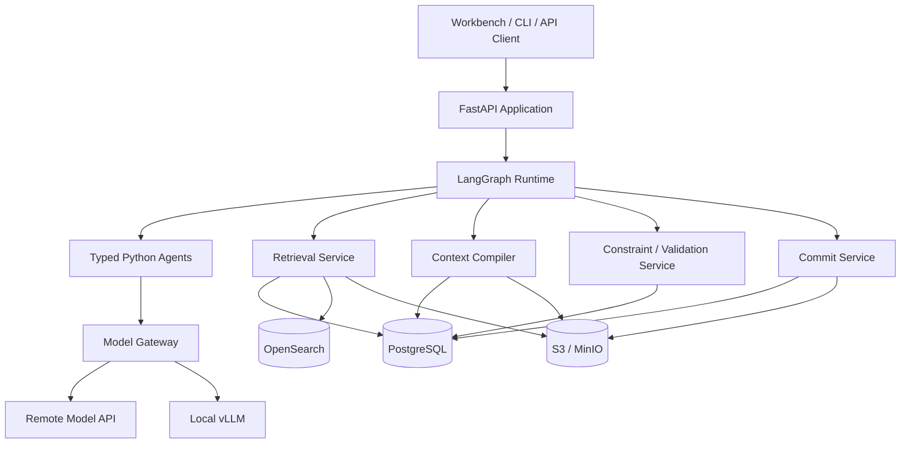
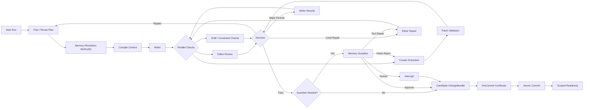
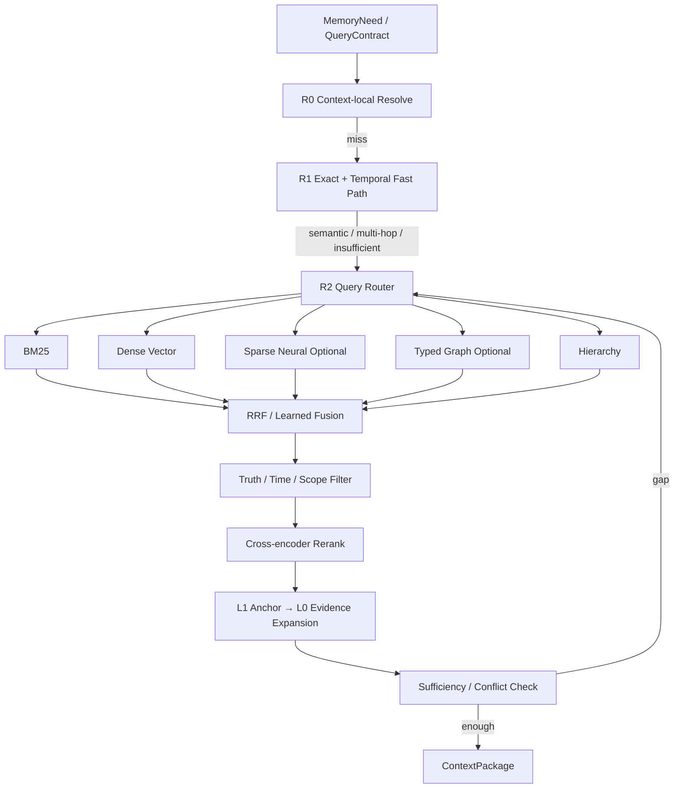

# 长篇小说 Agent 技术实施与选型设计

**版本**：v0.1  
**状态**：初步执行基线 / Evolving Implementation Contract  
**日期**：2026-07-20  
**最近修订**：2026-08-03（校正大 Block 读取粒度，补充 exact slice 直通与按需 claim 合同）
**配套文档**：《长篇小说 Agent 资产、世界模型、控制平面、运行与自演化总体架构设计》v2.2  
**文档层级**：总体架构之下的技术实现、工程边界与候选选型；不替代总体架构中的权威语义与 Core Invariant。
**项目阶段命名**：以 `docs/adr/0005-stage-numbering-and-document-lifecycle.md` 为准；本文第 22 节的 `Phase` 为技术能力分层，不作为项目 `Stage` 编号。
**当前进度**：见 `docs/project_status.md`。

---

## 0. 文档定位

### 0.1 本文回答的问题

总体架构已经定义了五个权威 Root、Canonical / Derived 边界、L0/L1/L2、R0/R1/R2 Memory Resolution、七类稳定 Agent、可信 Service、RunEventLog、Candidate ChangeBundle、Atomic Commit、Scoped Readiness 与 Skill 演化等逻辑契约。本文进一步回答：

1. 每一类逻辑对象当前准备使用什么语言、框架、数据库和索引实现；
2. LangChain、LangGraph、Temporal、PostgreSQL、OpenSearch、对象存储和图数据库分别位于哪一层；
3. Exact、Temporal、BM25、Dense Vector、Sparse Neural、Typed Graph、Hierarchical Retrieval 如何组成统一检索系统；
4. 当前首选方案、可替换方案和未来切换条件是什么；
5. 如何避免早期技术选型反向污染领域模型；
6. MVP 应实现到什么程度，哪些能力必须通过 benchmark 后才能晋升。

### 0.2 本文不冻结的内容

本文不永久冻结：

- 任何依赖包的精确版本号；
- 模型名称、采样参数、上下文长度和并发数；
- OpenSearch、PostgreSQL、Neo4j 等产品的具体大版本；
- 检索 top-k、RRF 权重、reranker 阈值和 token 预算；
- 具体云厂商与部署平台；
- 未来是否将某个自研模块替换为成熟开源实现。

精确版本应由 `uv.lock` / `poetry.lock`、原生发行包 checksum 或容器镜像 digest、数据库 migration 和 ProjectProfileRoot 中的兼容信息固定，而不是写死在本设计中。

### 0.3 技术决策状态

本文使用四种状态：

| 状态 | 含义 |
|---|---|
| **selected-mvp** | 当前实现优先采用；更换前需 ADR |
| **candidate** | 已进入候选池，需要原型或 benchmark |
| **deferred** | 方向合理，但当前阶段不引入 |
| **not-core** | 可以辅助实验，但不得拥有领域真值或主控制权 |

### 0.4 实施总原则

1. **领域优先于框架**：`PlanProposal`、`MemoryNeed`、`ContextPackage`、`DraftArtifact`、`MemoryPatch`、`ValidationReport`、`CandidateChangeBundle` 等必须是项目自己的类型，而不是 LangChain、LangGraph、AutoGen 或数据库 SDK 的类型。
2. **权威状态与检索索引分离**：PostgreSQL / Object Store 保存权威或可回放资产；OpenSearch、向量、图和摘要索引均可重建。
3. **正确性路径与召回路径分离**：阻断级 Constraint Index 不依赖可降级的 RAG top-k。
4. **先简单实现，保留替换端口**：MVP 只部署能形成完整闭环的最少基础设施，但所有主要服务均通过 Port / Adapter 隔离。
5. **先建立 benchmark，再优化算法**：Sparse Neural、Neo4j、Qdrant、Temporal 和学习型 Memory Policy 的引入必须有可量化收益。

---

# 1. 当前推荐技术基线

## 1.1 MVP 主栈

| 层次 | 当前推荐实现 | 状态 | 核心理由 |
|---|---|---|---|
| 语言 | Python 3.12+ | selected-mvp | LLM、Agent、检索和数据生态完整 |
| 领域 Schema | Pydantic v2 | selected-mvp | 类型校验、序列化、JSON Schema、Structured Output 契约 |
| Agent 模型/Tool 集成 | LangChain Core 与 provider integrations | selected-mvp | 统一模型、Tool、Structured Output 接口；不拥有领域状态 |
| Agent / Workflow 编排 | LangGraph | selected-mvp | 显式 State、Node、Edge、子图、Checkpoint、Interrupt |
| API | FastAPI | selected-mvp | 与 Pydantic、异步 Python 和 OpenAPI 配合良好 |
| ORM / DB 驱动 | SQLAlchemy 2 + psycopg 3 + Alembic | selected-mvp | Schema migration 与复杂 SQL 可并存 |
| 权威元数据与事务 | PostgreSQL | selected-mvp | 五 Root Manifest、Commit DAG、World/Plan、RunEventLog、事务与时间查询 |
| 大文本 / Artifact | S3-compatible Object Store；本地优先 MinIO 或兼容实现 | selected-mvp | 正文、参考资料、Trace、Context、模型原始输出可按内容哈希存储 |
| Lexical + Dense Retrieval | OpenSearch | selected-mvp | BM25、k-NN、Hybrid Query、RRF、过滤与搜索管线统一 |
| Embedding 基线 | BGE-M3 | candidate-baseline | 中文/多语言、支持 dense/sparse，便于统一消融 |
| Reranker 基线 | BGE-reranker-v2-m3 | candidate-baseline | 中文/多语言 cross-encoder，可本地部署 |
| Exact / Temporal | PostgreSQL B-tree、GIN、GiST、Range | selected-mvp | 确定性 R1 Fast Path 与时间有效性 |
| Typed Graph | PostgreSQL 节点/边表 + recursive CTE | selected-mvp | 先保证 Truth、Commit、Time、Evidence 语义正确，再决定独立图库 |
| 独立 GraphDB | Neo4j | deferred | 多跳、可视化或图算法成为瓶颈后引入 |
| Model Gateway | 自研稳定接口；本地 vLLM OpenAI-compatible，远程 provider adapter | selected-mvp | 保持模型路由、预算、权限和运行事件可控 |
| 多供应商统一网关 | LiteLLM Proxy | candidate | 供应商数量、租户、成本治理复杂后采用 |
| 运行观测 | OpenTelemetry + 项目 RunEventLog | selected-mvp | 技术遥测与业务运行事实分离并关联 |
| 本地开发部署 | Linux 用户态原生服务；Docker Compose 保留为可选兼容路径 | selected-mvp | 当前宿主机无可用容器运行时；普通用户进程、loopback 绑定和版本锁仍可形成可重复闭环 |
| 生产编排 | Kubernetes | deferred | 多项目、多节点和弹性需求出现后引入 |
| 跨天 Durable Workflow | Temporal | deferred | 跨机器、跨天等待、复杂副作用恢复出现后引入 |

## 1.2 MVP 物理拓扑



MVP 首先控制在三个持久系统：

```text
PostgreSQL + OpenSearch + S3-compatible Object Store
```

Redis、Neo4j、Qdrant、Temporal、Kafka 不进入首个强制部署组合。

---

# 2. 代码架构与依赖边界

## 2.1 采用 Ports and Adapters

建议使用单仓库、模块化单体起步：

```text
src/novel_agent/
├── domain/                 # 不依赖框架和数据库 SDK
│   ├── ids.py
│   ├── roots.py
│   ├── statements.py
│   ├── time.py
│   ├── evidence.py
│   ├── plans.py
│   ├── artifacts.py
│   ├── memory.py
│   ├── skills.py
│   └── events.py
├── application/            # Use Cases / Commands / Queries
│   ├── chapter_generation.py
│   ├── commit_candidate.py
│   ├── resolve_context.py
│   ├── retcon.py
│   └── maintenance.py
├── agents/                 # 七个稳定 Agent 的实现
│   ├── planner.py
│   ├── writer.py
│   ├── editor.py
│   ├── memory_controller.py
│   ├── memory_curator.py
│   ├── memory_guardian.py
│   └── maintenance_analyst.py
├── runtime/
│   ├── graphs/
│   ├── checkpoints/
│   ├── scheduler/
│   └── event_log/
├── services/
│   ├── retrieval/
│   ├── context_compiler/
│   ├── constraints/
│   ├── commit/
│   ├── maintenance/
│   ├── evaluation/
│   └── model_gateway/
├── ports/                  # 抽象接口
│   ├── repositories.py
│   ├── object_store.py
│   ├── search_index.py
│   ├── model_endpoint.py
│   └── telemetry.py
├── adapters/
│   ├── postgres/
│   ├── opensearch/
│   ├── s3/
│   ├── langchain/
│   ├── vllm/
│   └── mcp/
├── api/
├── workers/
└── tests/
```

## 2.2 依赖方向

```text
adapters / api / runtime
          ↓
application / agents / services
          ↓
domain / ports
```

`domain` 不得导入：

- `langchain`；
- `langgraph`；
- `sqlalchemy`；
- `opensearchpy`；
- `neo4j`；
- 供应商模型 SDK。

这保证未来替换框架时，五 Root、Truth、Time、Evidence 与 Commit 语义不变。

---

# 3. 领域 Schema 与数据契约

## 3.1 当前实现

使用 Pydantic v2 定义：

- Agent Contract；
- Tool Contract；
- Query Contract；
- Artifact Contract；
- RunEvent；
- MemoryEvent；
- ChangeBundle；
- API Request / Response；
- 配置与 ProjectProfile。

关键模型建议使用：

```python
from pydantic import BaseModel, ConfigDict

class DomainModel(BaseModel):
    model_config = ConfigDict(
        extra="forbid",
        strict=True,
        frozen=True,
    )
```

说明：

- `extra="forbid"` 防止模型输出静默增加未知字段；
- `strict=True` 减少隐式类型转换；
- `frozen=True` 使领域对象按值语义使用；
- 持久化变更通过新对象和 Domain Event 表达，而不是原地修改。

## 3.2 ID 与内容身份

建议：

| 对象 | ID 形式 |
|---|---|
| Project / Run / Task / Candidate | UUIDv7 或 ULID |
| Commit | 内容 Manifest 哈希 + 可读短 ID |
| Artifact | SHA-256 内容哈希 |
| Entity / Statement / Event | 稳定 UUIDv7 |
| Derived Snapshot | `source_commit + build_profile + build_id` |
| External Effect | 稳定 `effect_identity` |

内容哈希用于证明内容身份，不替代业务主键。

## 3.3 备选方案

| 方案 | 适用条件 | 当前决定 |
|---|---|---|
| `msgspec` | 极高序列化吞吐成为瓶颈 | candidate |
| Protobuf | 跨语言服务大量增加，需要强二进制协议 | deferred |
| Python dataclass | 内部简单值对象 | 可局部使用 |
| PydanticAI models | Agent Harness 改用 PydanticAI 时 | candidate |

---

# 4. Agent 实现与 LangChain 使用边界

## 4.1 为什么使用 LangChain，但不让 LangChain 成为领域内核

LangChain 适合提供：

- 统一 Chat Model 接口；
- provider integrations；
- Tool schema 与调用适配；
- Structured Output；
- streaming、callbacks 与 middleware；
- 某些标准 tool loop。

本项目不让 LangChain 拥有：

- Canonical State；
- Conversation Memory 作为项目长期记忆；
- Project Commit；
- Truth / Epistemic / Access Scope；
- TextRoot / PlanRoot / WorldRoot；
- 检索结果的最终领域契约。

因此当前采用：

```text
原生 Python Agent Class
    + Pydantic 输入输出
    + LangChain Model / Tool Adapter
    + LangGraph 调度
```

而不是：

```text
一个 create_agent + 一组通用 Tool + 无限自由循环
```

## 4.2 七个稳定 Agent 的实现映射

| Agent | 当前执行形式 | 主要 Tool / Service | 输出 |
|---|---|---|---|
| Planner | typed model call；必要时小型 LangGraph 子图 | Retrieval、Skill Registry | PlanProposal / ReplanProposal |
| Writer | typed composition call；支持 Continue / Rewrite | Context Delta 请求、Artifact Writer | DraftArtifact |
| Editor | REVIEW 与 LOCAL_REPAIR 两个显式模式 | Retrieval、Constraint Read | EditorialReport / RepairPatch |
| Memory Controller | LangGraph 内部 tool loop；仅 R2 | Retrieval Tool、Evidence Expansion | RetrievalDecision / ContextAssemblyPlan |
| Memory Curator | typed extraction + diff | L0 Resolver、Canonical Read | MemoryPatchCandidate |
| Memory Guardian | typed risk review | Constraint、Evidence、Canonical Read | ApprovalDecision |
| Maintenance Analyst | 后台批任务 | Maintenance Query、Evaluation | MaintenanceProposal |

## 4.3 Agent 的模型调用封装

所有 Agent 通过内部接口调用模型：

```python
class ModelGatewayPort(Protocol):
    async def generate_structured(
        self,
        request: ModelRequest,
        output_type: type[BaseModel],
    ) -> BaseModel: ...

    async def generate_text(
        self,
        request: ModelRequest,
    ) -> ModelTextResult: ...
```

Agent 不直接保存 API Key，不直接决定供应商，不直接写数据库。

## 4.4 备选 Agent Harness

| 方案 | 优点 | 风险 | 切换条件 |
|---|---|---|---|
| PydanticAI | 结构化输出与依赖注入自然 | 与 LangGraph 的组合需额外适配 | LangChain structured output / retry 复杂度持续偏高 |
| OpenAI Agents SDK | agents-as-tools、handoff、guardrail、trace 轻量 | 供应商与领域抽象耦合需评估 | 主要模型端点集中于兼容生态，且局部 Agent 协作收益明显 |
| AutoGen | 多 Agent 对话、仿真、Actor 模型强 | 自由消息流不适合主提交链 | Character Simulation / Debate 实验子系统 |
| CrewAI | Role/Task/Flow 原型快 | 领域状态与恢复控制较弱 | 仅原型，不作为主 Runtime |
| 全自研 Harness | 控制最强 | 开发成本高 | 现有 Harness 无法满足契约、重试或可观测性时逐步替换 |

---

# 5. TaskGraph、LangGraph 与多 Agent 编排

## 5.1 当前选择：LangGraph

顶层 `Execution TaskGraph` 映射为 LangGraph `StateGraph`：

- **State**：只保存小型结构化状态与 ArtifactRef，不保存百万字正文；
- **Node**：Agent Step、Service Step 或明确的业务判断；
- **Edge**：确定性条件、风险路径、重试与人工中断；
- **Subgraph**：Memory Controller 检索循环、Writer 生成循环、Editor 修复循环；
- **Checkpoint**：保存可恢复 Graph State；
- **Interrupt**：人工审批、重大 Retcon、不可自动裁决冲突。

## 5.2 顶层章节图



## 5.3 粗粒度节点原则

顶层图不展开：

- 每一次 BM25 query；
- 每一次 embedding 调用；
- 每一条图遍历；
- 每个 LLM 内部 reasoning step。

这些作为 Tool Call 或子事件写入 RunEventLog / Trace。只有影响业务恢复、并行依赖、审批或 Artifact 生命周期的步骤才成为 TaskNode。

## 5.4 LangGraph Checkpoint 与 RunEventLog 的区别

| 对象 | 用途 | 权威性 |
|---|---|---|
| LangGraph Checkpoint | 某个 super-step 的状态快照，用于恢复 | 运行恢复索引 |
| RunEventLog | 模型调用、Tool、Artifact、状态迁移、审批和 Effect 的有序事实 | Operational Source of Record |
| Trace | 调试细节、Prompt、Token、Span、模型返回 | 审计和诊断证据 |

Checkpoint 不替代 EventLog；EventLog 也不要求每次恢复都从零全量重放。

## 5.5 备选 Runtime

| 技术 | 适用阶段 | 决定 |
|---|---|---|
| Temporal 外层 + LangGraph 内层 | 跨天、跨机器、多 Worker、长期人工等待、复杂副作用 | deferred |
| Temporal 单独实现全部流程 | 确定性业务编排多、Agent 内循环少 | candidate，但当前不优先 |
| Prefect / Dagster | 离线数据和索引流水线 | candidate for maintenance |
| Celery / Dramatiq | 简单后台队列 | candidate |
| 自研 Actor Runtime | 超大规模 Agent 并发 | deferred |

### 引入 Temporal 的触发条件

满足任意两项时立项验证：

- 一个 Run 持续超过数小时或跨天；
- 大量 Workflow 等待人工数天；
- Worker 跨机器且故障恢复频繁；
- 外部 Effect 的重试、补偿和幂等逻辑明显复杂；
- 同时运行数十个小说项目；
- LangGraph Checkpoint + 自研 Scheduler 维护成本显著上升。

---

# 6. RunEventLog、Effect Journal 与后台任务

## 6.1 RunEventLog 实现

PostgreSQL 追加式表：

```text
run_event
├── event_id
├── run_id
├── sequence_no
├── event_type
├── task_id
├── agent_id / service_id
├── occurred_at
├── source_commit
├── context_version
├── payload_json
├── artifact_refs
├── trace_id
├── effect_identity
└── schema_version
```

约束：

- `(run_id, sequence_no)` 唯一；
- 已写入事件默认不可修改，只能追加纠正事件；
- 大型内容只保存 ArtifactRef；
- 运行事件与 OpenTelemetry trace/span ID 双向关联。

## 6.2 Effect Journal

对不可安全重复的操作记录：

```text
external_effect
├── effect_identity
├── requested_event_id
├── status: requested / completed / uncertain / compensated
├── provider_request_id
├── response_artifact_ref
├── attempt_no
└── completed_at
```

适用：

- 模型 API 调用；
- 对象写入；
- Commit；
- 人工通知；
- 外部 MCP Tool；
- 未来的发布操作。

## 6.3 MVP 后台队列

初期采用 PostgreSQL Job 表 + `FOR UPDATE SKIP LOCKED` Worker：

- 依赖少；
- 与 Commit / Outbox 同事务；
- 适合索引传播、摘要构建和小批维护。

当吞吐、延迟或跨语言 Worker 成为瓶颈时，再比较：

- Dramatiq / Celery；
- NATS JetStream；
- Kafka / Redpanda；
- Temporal Task Queue。

---

# 7. Model Gateway 与异构模型调度

## 7.1 内部抽象

`ModelEndpoint` 建议字段：

```text
endpoint_id
provider
base_url
model_name
capabilities
context_limit
supports_tools
supports_structured_output
supports_streaming
supports_cancel
estimated_latency
estimated_cost
max_concurrency
quality_profile
health
```

## 7.2 当前实现

- 远程模型：LangChain provider integration 或供应商 SDK Adapter；
- 本地模型：vLLM OpenAI-compatible Server；
- Gateway：项目自研路由、预算、Permit、重试和记录层；
- 供应商多于 2–3 个时，评估 LiteLLM Proxy 作为下层统一网关；
- LangGraph 只描述任务依赖，不负责全局 Endpoint 公平调度。

## 7.3 调度策略

MVP 采用确定性评分：

```text
endpoint_score =
    capability_match
  + quality_fit
  + critical_path_weight
  + cache_affinity
  - expected_latency
  - expected_cost
  - queue_penalty
  - non_preemptible_penalty
```

优先级：

| 级别 | 任务 |
|---|---|
| P0 | Commit 前阻断检索、Guardian、Repair 决策 |
| P1 | Planner、Writer、Editor、Curator |
| P2 | 在线最小索引、Readiness、预取 |
| P3 | 离线维护、Reflect、全局重建 |

## 7.4 备选

| 方案 | 适用条件 |
|---|---|
| LiteLLM Proxy | 多供应商、Virtual Key、租户、成本和限流治理需要集中化 |
| Ray Serve | 大量本地模型、多副本和弹性服务 |
| Kubernetes-native Gateway | 集群化后统一流量治理 |
| 供应商 SDK 直连 | 端点很少且需要最新特性 |

---

# 8. 五个权威 Root 与 Project Commit 的存储

## 8.1 PostgreSQL 作为权威元数据与事务系统

建议采用“规范化核心字段 + JSONB 扩展字段”，而不是把所有对象塞入一个 JSON 文档。

```text
project
project_commit
commit_parent
root_manifest
text_manifest
plan_node
world_entity
canonical_statement
assertion
truth_assessment
epistemic_state
disclosure
world_event
world_state
world_relation
rule
constraint_definition
reference_asset
project_profile
method_pin
```

## 8.2 五 Root 的物理实现

| Root | 权威元数据 | 大内容 | 说明 |
|---|---|---|---|
| TextRoot | PostgreSQL Manifest / Block metadata | Object Store | 正文唯一真源，按 Block / Span 寻址 |
| PlanRoot | PostgreSQL | 可选 Object Store | Plan Node、Obligation、Blueprint、Deviation |
| WorldRoot | PostgreSQL | 少量附件 Object Store | Statement、Entity、Event、State、Relation、Rule |
| ReferenceRoot | PostgreSQL provenance | Object Store | 论文、参考小说、知识库原文 |
| ProjectProfileRoot | PostgreSQL pin / compatibility | Object Store 或 Git registry | Schema、Skill、Evaluator、Tool 和模型配置固定 |

## 8.3 Project Commit

`project_commit` 保存：

- 五个 Root Manifest hash；
- parent commit；
- branch；
- ChangeBundle hash；
- actor / run；
- schema/profile version；
- PreCommitCertificate；
- commit time。

正文和大型 Artifact 不复制进入 Commit 表，只保存内容地址。

## 8.4 为什么不直接用 Git 作为运行数据库

Git 适合：

- Skill、Prompt、Schema、代码和配置 Registry；
- 人工可读 Markdown 资产；
- 离线审阅与发布。

Git 不适合直接承担：

- 高频状态查询；
- valid-time interval；
- Truth / Epistemic 过滤；
- RunEventLog；
- 多表事务；
- R1 Fast Path。

因此采用 Git-like 内容寻址与 Commit DAG 语义，但运行时权威实现为 PostgreSQL + Object Store。

## 8.5 数据库备选

| 方案 | 价值 | 主要代价 | 当前状态 |
|---|---|---|---|
| MongoDB | 文档 Schema 灵活 | 关系、时间约束和跨对象事务表达较弱 | candidate only |
| EventStoreDB | 原生 Event Sourcing | 仍需大量查询 Projection | candidate for runtime events |
| CockroachDB / YugabyteDB | 分布式 SQL | 当前规模不需要，运维成本高 | deferred |
| SQLite | 本地单用户原型 | 并发、搜索和长期服务限制 | dev adapter |

---

# 9. TextRoot、ReferenceRoot 与 Artifact Store

## 9.1 内容寻址

对象 key 建议：

```text
sha256/ab/cd/<full_hash>
```

PostgreSQL 保存：

```text
artifact_id
content_hash
media_type
byte_size
encoding
created_at
retention_class
storage_location
```

## 9.2 TextRoot Block

正文切分不应按 embedding chunk 反向决定。权威层先按叙事结构保存：

```text
Book → Volume → Chapter → Scene → Block
```

Block 保存稳定 ID；EvidenceRef 使用：

- `text_root`；
- `text_object_hash`；
- `scene_id`；
- `block_id`；
- codepoint range；
- quote hash。

检索 chunk 是 Derived Build，可以跨 Block 组合，但必须回指 Block / Span。

## 9.3 ReferenceRoot 解析

采用可插拔 parser：

- Markdown / TXT：原生解析；
- PDF：PyMuPDF / pypdf 等提取，视觉表格另行处理；
- HTML：trafilatura / BeautifulSoup；
- DOCX：python-docx；
- 代码或结构化文件：专用 parser。

解析产物：

```text
ReferenceDocument
ReferenceSegment
SourceMetadata
ExtractionWarning
```

原文始终保留；摘要和知识锚点作为 L1 派生物。

## 9.4 Object Store 备选

- 本地开发：Filesystem adapter；
- 单机 / 私有部署：MinIO 或其他 S3-compatible store；
- 云：AWS S3、GCS S3-compatible gateway 等；
- 大规模分析：后续可增加 Parquet / Iceberg，不进入 Canonical Root。

---

# 10. WorldRoot、PlanRoot 与时间模型

## 10.1 CanonicalStatement 实现

建议将“真值身份”与 Typed Payload 分开：

```text
canonical_statement
├── statement_id
├── proposition_type
├── normalized_key
├── lifecycle
├── authority
└── schema_version

statement_payload_*  # event/state/relation/rule 等类型表
truth_assessment
statement_evidence
```

避免自由命题和 Typed Record 各自保存一份真值。

## 10.2 Entity / Alias / Identity

```text
entity
entity_type
name_use
alias
identity_statement
entity_merge_record
```

别名检索使用 PostgreSQL GIN 与 OpenSearch keyword/text 双字段；实体消歧由 R1 Exact 与必要的 R2 语义流程完成。

## 10.3 Valid Time

PostgreSQL Range + GiST：

- `story_valid_range`；
- `knowledge_valid_range`；
- `plan_active_range`；
- `relation_valid_range`。

对功能性唯一状态使用 exclusion constraint，避免同一实体在同一世界线、同一 Predicate 上出现非法重叠。

## 10.4 不确定与相对时间

除绝对 Range 外增加：

```text
temporal_relation
├── subject_event
├── relation: before / after / overlaps / during / relative_to
├── object_event
├── confidence
└── evidence
```

复杂 partial order 查询初期使用 recursive CTE；成为热点后再研究专用 temporal graph/index。

## 10.5 PlanRoot

Plan 节点采用关系表：

```text
plan_node
plan_edge
plan_obligation
narrative_event_blueprint
arc_trajectory
storyline
style_contract
reader_target
plan_deviation
plan_realization
```

Plan DAG 与 Execution TaskGraph 分开：前者是叙事意图，后者是运行任务。

---

# 11. L0、L1、L2 与 Derived Snapshot 实现

## 11.1 L0 Resolver

L0 不新建一套内容副本。`L0Resolver` 根据统一 `SourceRef` 读取：

- TextRoot Block / Span；
- Reference Segment；
- Plan Node；
- World Record；
- Method Asset；
- Trace Evidence。

## 11.2 L1 Anchor Store

L1 Anchor 的权威边界是“派生、可重建、可追溯”。元数据放 PostgreSQL，检索副本放 OpenSearch：

```text
semantic_anchor
├── anchor_id
├── anchor_type
├── source_commit
├── source_refs
├── story_time_coverage
├── narrative_range
├── worldline
├── pov_scope
├── access_scope
├── truth_class
├── support_status
├── summary_text
├── embedding_profile
└── build_id
```

## 11.3 L2 Derived Snapshot

```text
derived_snapshot
├── snapshot_id
├── source_commit
├── build_profile
├── build_started_at
├── build_completed_at
├── freshness
├── coverage
├── index_versions
└── failure_debt
```

OpenSearch index alias 指向当前 snapshot；重建完成后原子切换 alias，避免半构建索引被主流程读取。

## 11.4 Outbox 投影

Atomic Commit 与 Derived 更新之间使用 Transactional Outbox：

```text
Atomic Commit
   └── 同事务写 projection_outbox
            ├── build L1 anchors
            ├── update OpenSearch
            ├── update graph edges
            ├── refresh read models
            └── update readiness
```

Derived 更新失败不回滚已接受 Commit，但对应 Scoped Readiness 可保持 blocked / degraded。

---

# 12. 统一检索系统：Commit-scoped Narrative Hybrid Retrieval

## 12.1 总体定位

本项目不采用“query → vector top-k → prompt”的 Naive RAG，而采用：

> **提交范围化、时间感知、认知受限、层级化、证据可展开的 Hybrid Retrieval。**



## 12.2 QueryContract

```text
query_text / structured_need
project_id
base_commit
worldline
story_time / narrative_position
caller_identity
pov / reader / narrator / author view
allowed_plan_scope
truth_policy
access_scope
freshness_requirement
mandatory_constraint_scope
evidence_requirement
token_budget
latency_budget
```

所有检索通道必须接收同一 QueryContract，不允许某一向量库绕过 Commit、Time 或 Access Filter。

---

## 12.3 R0：Context-local Resolve

### 实现

当前 `ContextPackage` 和 Working Memory 中维护结构化 Slot：

```text
current_characters
current_location
active_obligations
mandatory_constraints
recent_events
known_gaps
```

由普通 Python / 字典索引确定性读取，无模型调用、无外部搜索。

### 目标

- 减少重复检索；
- 保证反应式补搜后的 Resume；
- 形成 R0 Hit Rate 指标。

---

## 12.4 R1：Exact / Entity Retrieval

### 当前技术

PostgreSQL：

- B-tree：ID、Commit、章节号、Predicate、单值字段；
- GIN：JSONB、数组、alias、participants、标签；
- GiST：Range、overlaps、containment；
- recursive CTE：初期有限图路径；
- materialized read model：热点人物当前卡。

### 适用

- 人物当前位置；
- 物品当前持有者；
- 指定 Plan Node / EvidenceRef；
- 当前有效 State / Relation；
- 已知 ID、名称与 Predicate；
- Mandatory Constraint Closure。

### 原则

R1 miss 不自动解释为世界中不存在；只有在完整性证书和对应 open/closed-world policy 下才能形成否定结论。

---

## 12.5 BM25 / Lexical Retrieval

### 当前选择：OpenSearch BM25

索引对象：

- L0 Text / Reference chunks；
- L1 Fact / Event / Summary / Skill anchors；
- 可见别名与专有词字段。

建议多字段：

```text
content.standard_cn
content.cjk
entity_terms.keyword
aliases.keyword
chapter_id.keyword
anchor_type.keyword
```

查询组合：

- exact term / keyword boost；
- phrase query；
- title / name / alias field boost；
- fuzzy query 只用于可能拼写错误，不用于 ID；
- common filter 限定 project、commit/snapshot、worldline、scope、lifecycle。

### 备选

| 技术 | 使用条件 |
|---|---|
| Elasticsearch | 组织已有 ES 运维能力 |
| PostgreSQL FTS | 极简原型、中文要求不高 |
| Tantivy / Lucene | 需要内嵌或自研搜索服务 |
| Meilisearch | 简单产品搜索，复杂 RAG/Hybrid 能力要求较低 |

---

## 12.6 Dense Vector Retrieval

### 当前选择：OpenSearch k-NN

理由：

- 与 BM25 共用 Derived Index；
- 支持 metadata filter；
- Hybrid Query 与 RRF 在同一搜索平台完成；
- 减少 pgvector + OpenSearch 双检索存储的同步面。

### Embedding 基线

BGE-M3 作为第一轮中文/多语言 baseline：

- Scene / Chapter / Fact / Experience / Skill 分别嵌入；
- 不直接把超长章节只压为一个向量；
- embedding profile 进入 Derived Snapshot；
- 模型升级必须重建 snapshot，不能混用不同向量空间。

### 备选后端

| 后端 | 优势 | 何时切换 |
|---|---|---|
| pgvector | 元数据与向量同库，运维简单，精确/ANN 都可用 | OpenSearch vector 资源过重；规模中小；过滤高度关系化 |
| Qdrant | dense/sparse、多阶段查询、RRF/DBSF、payload filter 强 | 向量成为独立高并发服务，OpenSearch k-NN 成为瓶颈 |
| Milvus | 大规模分布式向量 | 向量数量和吞吐远超单机/小集群 |
| Vespa | 搜索、向量、ranking expression 一体化 | 需要复杂学习排序与大规模在线 serving |
| Neo4j Vector | 图内语义召回方便 | 图成为主检索入口且数据已稳定投影 |

---

## 12.7 Sparse Neural Retrieval

### 作用

在词项结构上引入语义扩展，介于 BM25 与 Dense 之间；适合：

- 同义表达；
- 专有词与语义同时保留；
- Dense 主题过宽、BM25 措辞过窄的查询。

### 当前决定

`deferred / experiment`：MVP 固定路径先使用 BM25 + Dense。Phase 2 评测：

- BGE-M3 sparse；
- OpenSearch neural sparse；
- BM25 + Dense + Sparse 三路融合。

只有在 held-out retrieval benchmark 上稳定提高 Recall@k / nDCG 且延迟可接受，才进入默认通道。

---

## 12.8 Typed Graph Retrieval

### MVP：PostgreSQL Typed Edge

```text
graph_node
├── node_id
├── node_kind
├── source_ref
└── source_commit

graph_edge
├── edge_id
├── subject_node
├── predicate
├── object_node
├── edge_semantics: canonical / evidence / mention / inferred / similarity
├── valid_time
├── worldline
├── access_scope
├── truth_status
├── evidence_ref
└── source_commit
```

用 recursive CTE 支持：

- 1–3 跳人物关系；
- 事件因果链；
- 物品流转；
- 信息传播 / 角色认知；
- 伏笔—兑现依赖。

### 何时引入 Neo4j

- 多跳查询 SQL 明显难维护；
- 图路径查询成为主要延迟瓶颈；
- 需要 PageRank、社区发现、路径解释和图可视化；
- 图通道消融证明对一致性或召回有稳定增益；
- Derived Graph Schema 已稳定，投影重建流程成熟。

### 其他备选

- Kùzu：嵌入式分析型图，适合本地研究；
- Memgraph：实时图与 Cypher；
- Apache AGE：PostgreSQL 内图扩展；
- ArangoDB：多模型；
- RDF/SPARQL：本体推理和开放语义互操作成为核心时；
- NetworkX：离线算法和验证，不作为在线持久图库。

---

## 12.9 Temporal Retrieval

### 当前实现

PostgreSQL：

- Range + GiST：valid-time interval；
- B-tree：narrative order；
- Event Order Edge：before / after / overlaps / relative-to；
- Commit DAG：版本可见性；
- worldline 字段与分支过滤；
- current-state read model：热点查询。

### 不采用的简化

- 只给每条边一个 timestamp；
- 将 narrative order 当 story time；
- 用 OpenSearch recency score 决定真值；
- 让 Temporal KG 成为第二真源。

### 备选

Neo4j 时间属性用于图投影查询；自研 interval tree 只在 PostgreSQL 性能不足时评估。

---

## 12.10 Hierarchical Retrieval

### 当前选择：Narrative-native Hierarchy

主小说天然层级：

```text
Book
→ Volume
→ Arc / Storyline
→ Chapter
→ Scene
→ Block / Span
```

并增加语义线程：

```text
Character Arc
Foreshadowing Thread
Conflict Thread
Item History
Location Thread
```

检索策略：

1. 对全局问题先召回 Arc / Volume / Chapter Anchor；
2. 展开相关 Scene；
3. 再展开 Fact/Event Anchor；
4. 最后读取 L0 原文 Evidence。

### RAPTOR 的位置

RAPTOR 类无监督摘要树主要作为：

- 外部论文、参考小说、无天然结构资料；
- 对 Narrative-native hierarchy 的补充主题聚类；
- benchmark 备选。

不让 RAPTOR 自动生成的摘要树覆盖人工/系统已有卷章场景结构。

---

## 12.11 Fusion 与 Rerank

### MVP Fusion：RRF

OpenSearch Hybrid Query：

- BM25；
- Dense k-NN；
- 可选 hierarchy / graph 结果由应用层转为独立 ranking；
- RRF 初始等权；
- 有评测集后再学习或调权。

RRF 适合作为初始方案，因为不同检索器的原始分数尺度不可直接比较。

### Reranker

第一轮 baseline：BGE-reranker-v2-m3。

两阶段：

```text
每通道粗召回 20–100
→ 去重与 RRF 形成较小候选集
→ cross-encoder rerank 20–50 条
→ Evidence Expansion 5–15 条
```

不得对全库运行 cross-encoder。

### 备选

- OpenSearch 内置 rerank processor；
- 独立 GPU reranker 服务；
- 更强 LLM pairwise rerank，仅用于高风险任务；
- ColBERT / late interaction，若细粒度长文召回 benchmark 显著收益。

---

## 12.12 Evidence Expansion 与 Sufficiency

检索优先命中 L1 Anchor，不直接把所有原文送入模型：

```text
Anchor → SourceRef → L0 Resolver → surrounding context
```

`SufficiencyReport` 至少表达：

```text
mandatory_gaps_closed
supporting_evidence_count
conflicting_evidence
unresolved_unknowns
scope_warnings
freshness_warnings
recommended_next_queries
stop_reason
```

默认：一轮主检索 + 最多一轮补搜；重大章或严格 Profile 可以提高预算。

## 12.13 Compact Handle、精确展开与 SupportWorkset

正式读取不直接把搜索返回项当作语义证据。检索接口先返回轻量 handle，再由统一 resolver 对被
选中的 handle 做精确展开：

```text
CompactRetrievalHandle
├── retrieval_unit_id / representation_kind
├── project / profile / basis / snapshot / cutoff
├── source locator / path summary / score
└── expandable L0 locator

EvidenceSlice
├── slice_id / parent_retrieval_unit_id
├── exact source_ref + start/end
├── visible_text + text_hash
├── parent_lineage_ref（可选，只作血缘）
└── scope / basis / snapshot / cutoff / taint attestation

SupportWorkset
├── task_id / target_need_id / public facet ids
├── ordered exact EvidenceSlice[]
├── bounded counter-evidence
└── segmentation / expansion / token / rejection report
```

这些是内部 typed view，不要求立即新增公共领域 Schema。具体实现可以先使用 service-local
dataclass/Pydantic model；只有跨进程或版本化消费者确实需要时才晋升公共合同。

实现规则：

1. Canon/导入器可以继续保存大 `TextBlock`；resolver 必须把存储粒度与读取粒度分开。
   默认按原文段落边界生成连续 slice；单段过大时才按连续句窗切分。切片身份由
   `parent block + start/end + text hash` 稳定派生。whole chapter 只能是经过预算证明的显式选择。
2. L1 anchor、summary、style compact 和 graph path 可以提供导航与排序信号，但进入语义提取前
   必须解析到准确的模型可见 L0 slice。
3. 非连续 excerpt 不得继承 parent full passage 的语义覆盖范围。parent ref 保留为 lineage，
   每个可主张 clause 必须由精确 span 或 typed segment derivation 支持。
4. `SupportWorkset` 不是 `WriterContextPackage`。通过 project/profile/basis/snapshot/scope/
   cutoff/taint 和 exact-span 校验的 slice，可以按 token 预算原样进入 support producer/
   semantic owner 的工作输入，并保存到 `EvidenceLedger`；它们不因此成为已验证 claim。
5. 原始 slice 与 derived preview 分 ID 保存。确定性或模型压缩只能生成可丢弃派生物，不得覆盖
   raw 主记录或成为 exact evidence 的唯一入口。
6. 较短 slices 原样保留，容量只由明确 token 预算控制，不按固定证据条数截断。当预算不能
   容纳全部 slices 时，仅使用 public Need/facet、合法 source/chapter diversity 和原检索稳定顺序
   选择；deep-rank slice 在预算用尽前仍有资格进入，不得使用 Gold。

支持生产不再强制“每 slice 一 atom”作为所有证据的必经层。正式路径是：

```text
target MemoryNeed
  → exact paragraph / contiguous sentence-window slices
  → token-bounded raw-evidence packing
  → single-slice claim when one slice is semantically sufficient
  → otherwise on-demand multi-slice claim synthesis for the still-open Need
  → independent whole-claim verification
  → existing support group / receipt / variant / spec
```

单 slice 已完整表达目标时，语义 owner 产生一条只引用该 slice 的 claim 并独立验证。
只有 public Need 仍未闭合时，才对一个按 token 有界、包含多个 exact slices 的工作集请求语义
合成；模型必须返回 cited slice IDs，host 只验证身份、安全证明和引用精确集，不枚举“哪三个
atom”、不改写或补桥。whole verifier 以完整 claim、全部 cited slices 和有界反证重新判定；
最终 receipt/evidence refs 必须是该 claim 实际 cited slices 的精确并集。

`ClaimAtom` 可作为单 slice 命题或调试中间件保留，但不得全量生成、不得被固定取前三条，
也不得通过组合枚举把 benchmark 的两/三段 Gold 形状固化为通用架构。这一路径没有训练
权重、在线学习或黑盒选组，不属于 learned fusion。

当前 Stage 2M 已接受的 `writer_context.v1` 只向 Writer 渲染 receipt-bound verified claims，
源文材料位于独立 `EvidenceLedger`。上述“raw 直通”指不经全量 atom 就进入内部语义输入
与 Ledger，不是新增 Writer raw section。若要向 Writer 直接暴露 raw spans，必须先单独修订
ADR-0004、公共 domain/schema 和对应预算/渲染合同；当前 Stage 2M 实现不得隐式越过该边界。

---

# 13. Context Compiler

## 13.1 当前实现：确定性 Python Service

Memory Controller 输出 `ContextAssemblyPlan`，Compiler 负责机械执行：

- 根据 SourceRef 取数；
- 去重；
- 按权限删除不可见内容；
- 按分区与优先级分配 token；
- 渲染为模型输入；
- 生成 ContextPackage 与 ContextManifest。

Compiler 不自行判断：

- 哪个事实是真的；
- 哪条冲突应采信；
- 是否泄露秘密；
- 哪个文学方案更好。

这些决策必须已由 Canonical Filter、Memory Controller 或 Policy 给出。

## 13.2 ContextPackage 分区

```text
Task Contract
Mandatory Constraints
Plan / Obligations
Current World State
POV / Epistemic State
Relevant Events
Evidence / Raw Spans
Reference Knowledge
Procedural Skills
Style / Reader Target
Unresolved Gaps
Output Contract
```

上述是通用 Context Compiler 分区超集；具体产品只能使用其已版本化合同允许的分区。当前
Stage 2M `writer_context.v1` 不含 Writer-facing raw-spans 分区，源文保存在 `EvidenceLedger`。

`mandatory_constraints` 不参与相关性淘汰；预算不足时压缩表达、分割任务或阻断，而不是删除。

## 13.3 技术组件

- Pydantic：ContextAssemblyPlan / ContextPackage；
- 模型 tokenizer：准确计数；
- Jinja2 或纯 Python renderer：Prompt 模板；
- 内容去重：hash + normalized text；
- 可选 extractive compressor：只处理 relevance context；
- LLMLingua 类压缩：deferred，必须验证不破坏 Evidence 与约束。

## 13.4 ContextDelta

执行中补搜默认生成：

```text
ContextDelta
├── based_on_context_version
├── added_sections
├── invalidated_sections
├── new_warnings
└── resume_checkpoint
```

只有 Commit、Scope、POV、预算策略或 Mandatory Closure 发生关键改变时完整重编译。

## 13.5 独立预算与失败域

以下预算分别计量，不相互冒充或隐式借用：

| 预算域 | 控制对象 | 失败时的正确行为 |
|---|---|---|
| Retrieval handle budget | 各通道候选数、去重和多样性 | 缩小候选或产生 typed gap |
| Per-Need expansion budget | 精确 L0 slice 数、跨度和 token | 对目标 Need 报 insufficient，不先挤占 Writer 产品预算 |
| Semantic-call budget | 按需单/多 slice claim proposal 与 whole verifier | 对受影响 Need/claim fail-closed |
| Product budget | Writer Context 与 Evidence Ledger | Writer 只装配已验证 claims，Ledger 保存已校验证据；Mandatory 无法容纳则 typed overflow |

Writer Context 与 Ledger 的具体上限由当前 Stage/Profile 配置冻结；技术设计不把某个实验数字永久
写死为架构常量。最终产品预算不能反向成为 support producer 唯一的原始证据容量。

模型批处理只是 transport 优化。单个 transport 不得绑定多个大 Need 的完整工作集；请求按
Need 和 token-bounded slice chunk 隔离。只要结构化响应整体可解析，就按 Need、claim 和 verifier
decision 独立校验：缺失或非法 item 只关闭对应 item；transport 失败或整体不可解析才关闭对应
transport chunk。必须输出统一漏斗：

```text
raw candidate → L0 block resolved → exact slice segmented → SupportWorkset selected
├─ raw slice packed → semantic input / EvidenceLedger retained
└─ claim proposed/synthesized → whole claim verified → controller selected
   → Writer claim packed → Ledger emitted
```

每个拒绝点记录 typed reason、目标身份和 artifact ref。只有漏斗中存在“精确证据充分但被错误
拒绝”的实例，才允许放宽对应 validator，并同时保留无效对照仍失败的回归。低 aggregate score
本身不能证明校验过严。

正式使用度量区分：

- `ContextExposedReceipt`：系统把哪些内容交给消费者；
- `ContextUseReceipt`：消费者声明或可验证地使用了哪些内容。

搜索结果返回只能增加 exposed 计数，不能自动增加 confirmed-use、importance 或 retention 信号。

---

# 14. Constraint、Validation 与质量评价

## 14.1 四级验证

| 级别 | 当前技术 | 示例 |
|---|---|---|
| Schema | Pydantic / JSON Schema | 字段、枚举、格式、引用类型 |
| Database | PostgreSQL FK、UNIQUE、CHECK、EXCLUDE | ID、功能状态时间重叠、引用完整性 |
| Deterministic Domain Rules | Python Rule Engine | 物品唯一持有、空间可达、状态迁移 |
| Semantic / Literary | Editor、Guardian、Independent Judge | 动机、隐含矛盾、节奏、文风、读者体验 |

## 14.2 Constraint Service

不必一开始引入通用规则引擎。MVP：

```text
Python typed rules
+ SQL validation query
+ registry-driven rule dispatch
```

每条 Rule：

```text
rule_id
version
scope
input_predicates
severity
execution_kind
implementation_ref
evidence_requirement
auto_repair_policy
```

## 14.3 Z3 / OR-Tools 备选

用于：

- 时间排程；
- 空间可达；
- 资源守恒；
- 互斥义务；
- 复杂逻辑约束。

只有确定性规则难以维护或组合爆炸时引入，不让 SMT Solver 处理开放文学语义。

## 14.4 Candidate Overlay

MVP 采用内存 / 临时表 Overlay：

- base commit canonical view；
- candidate patch；
- overlay query；
- validation result。

规模扩大后可使用 PostgreSQL 临时 schema、copy-on-write snapshot 或专用 overlay service。

## 14.5 Narrative Quality Evaluation

Evaluation Ledger 保存：

- evaluator version；
- rubric；
- input artifact refs；
- score；
- comments；
- pairwise result；
- confidence；
- delayed outcome。

Editor 是默认正式评价者；Independent Judge 按风险调用。LLM-as-a-Judge 只提供质量信号，不单独决定 Canon 正确性。

---

# 15. Memory 写回与维护

## 15.1 在线闭环

```text
Draft
→ Curator independent extraction
→ MemoryPatchCandidate
→ deterministic patch validation
→ Guardian if high-risk
→ Candidate ChangeBundle
→ Commit Service
```

## 15.2 MemoryEvent

```text
memory_event
├── operation: remember / update / forget / merge / split / suppress / reactivate
├── trigger
├── target
├── scope
├── pre_state_refs
├── transition
├── evidence_refs
├── risk
├── approval
└── apply_status
```

Memory Controller 不写正式 Memory；Curator 不直接 Commit；Guardian 不负责正文文学质量。

## 15.3 在线最小更新

提交后同步保证：

- Canonical Commit 已可见；
- Constraint Index 已满足对应 readiness；
- Outbox 已写入；
- 关键 R1 Read Model 可读。

OpenSearch、摘要和非关键图投影可以异步更新，但必须带 freshness 状态。

## 15.4 离线维护

后台任务：

- Anchor 去重；
- 摘要重建；
- OpenSearch reindex；
- embedding 升级；
- graph projection rebuild；
- orphan evidence 检查；
- conflict debt 分析；
- Experience / Skill proposal；
- 延迟质量评价。

Maintenance Analyst 只提出语义建议；Maintenance Service 执行机械任务；后台不得静默修改 Canon。

## 15.5 LightMem / AnchorMem 等论文机制的落点

- AnchorMem：L1 检索锚点与 L0 不可变上下文分离；
- LightMem：在线轻写入、离线 consolidation；
- PlugMem：Experience / Semantic / Procedural 抽象；
- ReasoningBank：成功与失败轨迹提炼 Experience；
- MemSkill / SkillOpt：后期优化 Memory Skill 与 Method Asset。

这些作为算法启发，不直接替换五 Root 和 Commit 体系。

---

# 16. Skill、Experience 与 Method Registry

## 16.1 Skill 物理格式

MVP：Markdown + YAML Front Matter：

```yaml
---
skill_id: editorial.dialogue_consistency
version: 0.1.0
applies_to:
  - editor.review
inputs:
  - DraftArtifact
constraints:
  - do_not_change_canon
---
```

正文包含：Purpose、When to Use、Workflow、Tool Policy、Failure Modes、Output Contract、Examples。

## 16.2 Registry

- Git 仓库保存可读版本与审阅历史；
- Object Store 保存不可变 artifact；
- PostgreSQL 保存 registry metadata、ProjectProfile pin 和兼容关系；
- Skill Descriptor 进入 L1 / OpenSearch；
- Project Commit 只固定采用版本，不复制全局 Skill 内容。

## 16.3 晋升

```text
Candidate Skill
→ offline benchmark
→ held-out validation
→ regression suite
→ human / policy approval
→ registry release
→ ProjectProfile pin update
```

一次成功运行不得自动覆盖全局 Skill。

## 16.4 后续算法候选

- ReasoningBank：Experience 抽象；
- SkillOpt：受限文本编辑 + held-out gate；
- MemSkill：Memory Operation skill bank；
- XSkill：Skill + action-level Experience 双流；
- Mem2Evolve：能力资产与经验共演化。

均属于 Phase 4/5，不进入 MVP 主链。

---

# 17. API、Tool 与 MCP

## 17.1 应用 API

FastAPI 提供：

```text
/projects
/commits
/runs
/tasks
/chapters
/artifacts
/retrieval/query
/context/compile
/candidates
/approvals
/evaluations
/maintenance
```

长任务使用：

- SSE：流式状态和 token；
- WebSocket：交互式审批与工作台；
- 普通 REST：命令、查询和 Artifact metadata。

## 17.2 内部 Tool

同进程 Service 优先直接 Python 调用，不为“Agent 化”强制包装 HTTP/MCP。

Tool 必须有：

- Pydantic input/output；
- timeout；
- idempotency / read-only 标记；
- access scope；
- audit policy；
- failure code。

## 17.3 MCP 使用边界

MCP 用于：

- 跨进程共享 Tool；
- 外部 IDE / Agent 接入；
- 数据库、搜索、文件和第三方服务的标准暴露。

MCP 不负责：

- Agent 调度；
- Memory Policy；
- Canonical State；
- 事务；
- RAG ranking。

## 17.4 未来 A2A / Actor

只有在独立 Agent 服务跨进程协作成为常态时评估；当前类型化 Artifact + 中央 TaskGraph 足够。

---

# 18. Observability、Trace 与 Evaluation

## 18.1 三种记录分离

| 记录 | 技术 | 目的 |
|---|---|---|
| RunEventLog | PostgreSQL | 业务运行事实与恢复 |
| Trace | OpenTelemetry + Trace backend | 模型、Tool、DB、检索和延迟诊断 |
| Evaluation Ledger | PostgreSQL + Artifact Store | 质量、检索、Skill 与长期效果 |

## 18.2 OpenTelemetry

统一传播：

```text
trace_id
span_id
run_id
task_id
agent_id
model_endpoint
source_commit
context_version
```

可接：

- Jaeger / Tempo；
- Prometheus / Grafana；
- Phoenix；
- LangSmith；
- Langfuse。

首选 OTel 作为 vendor-neutral 基线；LangSmith 等仅为上层调试产品，不成为运行事实真源。

## 18.3 核心指标

### 检索

- R0 / R1 Hit Rate；
- Recall@k、MRR、nDCG；
- Mandatory Gap Closure；
- Evidence Precision；
- Additional Search Rate；
- Context Utility per Token；
- Scope / Stale Error Rate。

### 运行

- Chapter End-to-End Latency；
- RunEvent append / replay success；
- Checkpoint resume success；
- uncertain effect rate；
- model cost / accepted chapter；
- critical path idle time。

### 写作与提交

- Editor false pass；
- repair loop；
- missed state change；
- wrong truth type；
- commit conflict；
- derived freshness lag。

## 18.4 离线分析

Evaluation 导出为 Parquet，使用 DuckDB / Python 分析；大型实验可接 MLflow / W&B，但 Evaluation Ledger 保留项目定义的正式结果。

---

# 19. Testing 与验证策略

## 19.1 测试层级

1. **Domain Unit Test**：Truth、Time、Evidence、Transition；
2. **Schema Contract Test**：所有 Agent / Tool JSON Schema；
3. **Database Integration Test**：PostgreSQL constraint、transaction、outbox；
4. **Search Integration Test**：OpenSearch mapping、filter、RRF、snapshot alias；
5. **Graph Query Test**：路径、时间和 scope；
6. **Replay Test**：RunEvent + Checkpoint 恢复；
7. **Fault Injection**：模型超时、索引失败、对象写入 uncertain；
8. **End-to-End Scenario**：一章生成、修复、Commit；
9. **Retrieval Benchmark**：七类查询；
10. **Long-horizon Regression**：多章累计状态与伏笔。

## 19.2 技术

- pytest；
- Hypothesis：时间区间、状态转移和合并性质；
- 原生 Integration Harness：以当前普通用户启动专用 PostgreSQL / OpenSearch / MinIO 实例，按 suite 创建隔离数据目录并执行受控停机/恢复；
- testcontainers：保留为 Docker 可用环境的可选等价验证路径，不再作为 Stage 0 唯一门禁；
- golden files：ContextPackage、ChangeBundle；
- fake model endpoint：结构化确定性响应；
- recorded model fixtures：少量真实调用回放。

## 19.3 检索 benchmark

查询类别：

```text
current_state
exact_quote
entity_alias
temporal_order
causal_multi_hop
epistemic_access
foreshadowing_thread
semantic_scene
style_reference
skill_retrieval
```

首轮消融：

```text
BM25
Dense
BM25 + Dense RRF
Hybrid + Reranker
Hybrid + Hierarchy
Hybrid + Graph
Hybrid + Hierarchy + Graph
Hybrid + Sparse
```

只有 benchmark 证明收益，才把新通道加入默认路径。

---

# 20. 安全、权限与治理

## 20.1 权限标签

所有 Canonical、Anchor、Search Document 和 Context Section 保留：

```text
access_scope
information_label
derivation_taint
pov_scope
reader_scope
```

OpenSearch filter 只做第一层防护，最终仍由 Retrieval Service 与 Context Compiler 校验。

## 20.2 Secrets

- 本地：`.env` 仅开发使用，权限必须为 `0600`，不得使用示例默认口令；
- Linux 原生服务只监听 `127.0.0.1` / `::1`，不得在关闭认证时绑定 `0.0.0.0`；
- 下载的原生发行包必须使用版本锁与发布方 checksum；若发布方未提供 checksum，则首次引入必须从官方 Release 页面人工复核版本化 URL、记录 SHA-256 并通过 Git review 固定，禁止运行时自动追随 `latest`；
- 原生服务以当前普通用户运行，不使用 root service、不写 `/usr`、`/etc`、`/var/lib`；
- 服务：Docker/Kubernetes Secret 或 Vault；
- API Key 不进入 Trace / RunEvent payload；
- 原始 Prompt / Output 按项目策略脱敏和加密。

## 20.3 数据保护

- PostgreSQL 定期备份与 PITR；
- Object Store versioning / retention；
- OpenSearch / Graph 可重建，但保留 mapping 与 build profile；
- Commit / Artifact hash 定期完整性扫描。

---

# 21. 部署方案

## 21.1 本地开发

```text
Linux 用户态原生服务（当前 selected-mvp）
├── `.conda-env`：Python 与 PostgreSQL 17.10 client/server
├── `tmp/native/dist`：锁版本的 OpenSearch / MinIO / OTel 二进制
├── `volumes/native`：本地持久数据；Git ignored
├── `tmp/native/run`：PID、端口、健康状态和 suite lease
├── `tmp/native/logs`：开发日志；Git ignored
└── FastAPI / Worker：项目 Conda 环境中的普通用户进程

可选兼容路径
└── Docker Compose：在具备 Docker API 兼容运行时的开发机或 CI 上做等价验证
```

允许使用 Filesystem ObjectStore 与 fake Search Adapter 做快速单元开发，但集成环境必须运行真实 PostgreSQL、OpenSearch 与 MinIO-compatible Object Store。原生 Harness 与 Docker 路径必须消费同一 Port / Adapter、migration、健康检查和测试断言；部署方式不得进入领域语义。

当前原生安全基线：所有网络端点只绑定 loopback；PostgreSQL 使用 SCRAM；OpenSearch 若为开发简化而关闭 Security plugin，必须同时强制 `network.host: 127.0.0.1`；MinIO API/Console 与 OTel receiver/health endpoint 均显式绑定 `127.0.0.1`。原生进程不注册系统级自启动服务，启动和停止由仓库内 Harness 通过可验证 PID/owner/可执行路径管理。

若宿主机不能修改 `vm.max_map_count`，开发实例使用 `node.store.allow_mmap: false`；这只用于功能与一致性测试，不得把该环境的绝对性能结果作为生产容量结论。OpenSearch 进程启动前将 soft `nofile` 提升到不超过宿主机 hard limit 的 65535。

## 21.2 单服务器研究环境

- API、Worker、Gateway 分进程；
- PostgreSQL 与 OpenSearch 独立 volume；
- 本地 GPU 部署 vLLM；
- embedding / reranker 可以独立服务或 batch worker；
- Remote API 与 Local Endpoint 共用 Scheduler。

## 21.3 生产扩展

触发后迁移：

- Kubernetes；
- PostgreSQL HA；
- OpenSearch cluster；
- S3 / distributed object store；
- Temporal；
- 独立 embedding / rerank / graph service；
- centralized LiteLLM or model gateway。

---

# 22. 分阶段实施计划

## Phase 0：工程骨架与契约

目标：冻结依赖边界而非完整功能。

- Python / Pydantic domain package；
- Agent / Tool / Artifact 基础 Schema；
- PostgreSQL migration；
- ObjectStore Port；
- ModelGateway Port；
- RunEventLog；
- LangGraph hello-world + Postgres checkpointer；
- OTel trace ID 贯通。

验收：任一 Agent 能以 fake model 运行、暂停、恢复并产生可验证 ArtifactRef。

## Phase 1：最小单章闭环

- TextRoot / PlanRoot / 简化 WorldRoot；
- Planner、Writer、Editor、Curator；
- R0/R1；
- Context Compiler；
- Candidate ChangeBundle；
- deterministic validation；
- Atomic Commit；
- FAST Profile。

检索暂以 Exact + 最近章节 + 简单 OpenSearch BM25 为主。

## Phase 2：Hybrid Retrieval

- L1 Anchor pipeline；
- OpenSearch BM25 + Dense；
- BGE-M3 baseline；
- RRF；
- reranker；
- Narrative hierarchy；
- retrieval benchmark；
- R2 Memory Controller tool loop。

## Phase 3：风险路径与维护

- Memory Guardian；
- STRICT Profile；
- Epistemic / Disclosure；
- Derived Snapshot / Outbox / Readiness；
- Maintenance Worker；
- delayed evaluation；
- branch / retcon 基础流程。

## Phase 4：图、调度与生产化实验

按 benchmark 决定：

- Neo4j；
- Sparse Neural；
- Qdrant；
- LiteLLM Proxy；
- Temporal；
- Kubernetes；
- advanced solver。

## Phase 5：学习型 Memory / Skill

- ReasoningBank 式 Experience；
- SkillOpt / MemSkill 实验；
- retrieval policy learning；
- routing / fusion learning；
- delayed quality feedback。

---

# 23. 关键技术 ADR 初稿

| ADR | 决定 | 状态 | 重新评估触发条件 |
|---|---|---|---|
| TADR-01 | Python + Pydantic 作为领域契约 | selected-mvp | 跨语言服务成为主流 |
| TADR-02 | LangChain 只做模型/Tool 集成，不拥有 Canon / Memory | selected-mvp | Harness 明显无法满足可靠性 |
| TADR-03 | LangGraph 实现 MVP Execution TaskGraph | selected-mvp | 跨天/跨机器恢复复杂度上升 |
| TADR-04 | RunEventLog 自建于 PostgreSQL，独立于 Checkpoint | selected-mvp | EventStoreDB / Temporal 有明确总体收益 |
| TADR-05 | PostgreSQL 保存五 Root 元数据、Commit 与 Exact/Temporal | selected-mvp | 单实例容量或地理分布成为瓶颈 |
| TADR-06 | S3-compatible Object Store 保存大 Artifact | selected-mvp | 需要专用内容湖或 Iceberg |
| TADR-07 | OpenSearch 同时承担 BM25 与 Dense Hybrid | selected-mvp | 资源成本、过滤或向量吞吐不达标 |
| TADR-08 | RRF 为首个 Hybrid Fusion baseline | selected-mvp | 有足够训练/验证查询，可调权或学习排序 |
| TADR-09 | BGE-M3 / bge-reranker-v2-m3 为首轮中文 baseline | candidate-baseline | benchmark 有更优模型 |
| TADR-10 | Sparse Neural 不进入 MVP 默认通道 | deferred | BM25 + Dense 存在系统性 recall gap |
| TADR-11 | Typed Graph 先用 PostgreSQL 边表 | selected-mvp | 多跳维护和性能成为瓶颈 |
| TADR-12 | Neo4j 仅作可重建 Derived Graph | deferred | 图通道稳定增益且 Schema 成熟 |
| TADR-13 | Hierarchy 优先使用卷/弧/章/场景天然结构 | selected-mvp | 无结构资料需要 RAPTOR 补充 |
| TADR-14 | Context Compiler 是确定性 Python Service | selected-mvp | 不变；只能替换实现，不能改职责 |
| TADR-15 | Constraint 采用 SQL + Python rules，Solver 后置 | selected-mvp | 组合约束复杂度显著上升 |
| TADR-16 | ModelGateway 接口自研，本地端点使用 vLLM | selected-mvp | 多供应商治理推动 LiteLLM |
| TADR-17 | MCP 只作跨进程 Tool Adapter | selected-mvp | 不变；协议扩展不改变领域边界 |
| TADR-18 | OTel 负责遥测，RunEventLog 负责业务事实 | selected-mvp | 不变 |
| TADR-19 | PostgreSQL Job Queue 作为首个后台队列 | selected-mvp | 吞吐、跨语言、延迟需求上升 |
| TADR-20 | Temporal 在生产化阶段作为外层候选 | deferred | 长运行触发条件满足 |
| TADR-21 | Git 用于 Method Registry，不作运行状态数据库 | selected-mvp | 不变 |
| TADR-22 | 每种新增检索通道必须通过 held-out benchmark | selected-mvp | 不变 |

---

# 24. 总体架构章节到技术实现的映射

| 总体架构部分 | 当前实现 | 主要备选 |
|---|---|---|
| Project Canonical State / 五 Root | PostgreSQL Manifest + Object Store | MongoDB、EventStoreDB、分布式 SQL |
| Asset Classification | Pydantic discriminated union + relational tables | Protobuf / msgspec |
| TextRoot | Content-addressed Object Store + PostgreSQL Block Manifest | Git LFS、云 S3 |
| ReferenceRoot | Object Store + parser pipeline + provenance tables | 文档平台 connector |
| PlanRoot | PostgreSQL Plan DAG / Obligation tables | 图数据库投影 |
| WorldRoot | PostgreSQL relational core + JSONB typed payload | Document DB、GraphDB 只作派生 |
| CanonicalStatement / Truth | Statement identity tables + truth/evidence tables | RDF 本体化，后置 |
| Epistemic / Disclosure | PostgreSQL scoped relation + Context filter | Neo4j derived graph |
| Time / Worldline | Range + GiST + Commit DAG + temporal edges | Temporal KG、interval index |
| L0 | Resolver over Roots / Trace | 无独立存储 |
| L1 | PostgreSQL anchor metadata + OpenSearch document | 独立 knowledge store |
| L2 BM25 | OpenSearch | Elasticsearch、Tantivy |
| L2 Dense | OpenSearch k-NN | pgvector、Qdrant、Milvus、Vespa |
| L2 Sparse | Phase 2 OpenSearch neural sparse / BGE-M3 | SPLADE |
| L2 Graph | PostgreSQL edge table | Neo4j、Kùzu、Memgraph、AGE |
| L2 Temporal | PostgreSQL Range / order table | Neo4j projection、自研 index |
| Hierarchical Retrieval | Native narrative hierarchy | RAPTOR |
| Derived Snapshot | PostgreSQL build registry + OpenSearch aliases | 数据编排平台 |
| Query Contract | Pydantic | Protobuf |
| Retrieval Service | 自研 Python service + OpenSearch/Postgres adapters | Haystack/LlamaIndex 原型层 |
| Memory Controller | LangGraph R2 subgraph | LangChain create_agent、PydanticAI |
| Context Compiler | 自研 deterministic service | 无通用框架替代 |
| Candidate Overlay | in-memory / PostgreSQL temp overlay | copy-on-write store |
| Validation Suite | Pydantic + SQL + Python rule + LLM | Z3 / OR-Tools |
| Atomic Commit | PostgreSQL SERIALIZABLE/optimistic check + Outbox | EventStoreDB |
| Branch / Retcon | Commit DAG + semantic merge service | Git 用于离线文本辅助 |
| RunEventLog | PostgreSQL append-only | EventStoreDB、Temporal history |
| TaskGraph | LangGraph | Temporal、自研 runtime |
| Checkpoint | LangGraph PostgreSQL checkpointer | Temporal state |
| Model Routing | ModelGateway + vLLM / remote adapters | LiteLLM、Ray Serve |
| Evaluation Ledger | PostgreSQL + Object Store + Parquet export | MLflow / W&B 辅助 |
| Skill Registry | Git + Object Store + PostgreSQL pin | 专用 artifact registry |
| Observability | OpenTelemetry | LangSmith、Phoenix、Langfuse |
| API | FastAPI + SSE/WebSocket | gRPC for internal high throughput |
| Tool Transport | direct Python; MCP adapter | HTTP/gRPC/A2A |
| Deployment | Linux 用户态原生 Harness；Docker Compose 可选等价路径 | Kubernetes |

---

# 25. 尚待专项验证的问题

1. OpenSearch 中文 analyzer 对虚构名称、别名和长台词的最佳 mapping；
2. OpenSearch Dense 与 pgvector 在带 `commit/worldline/access/time` 过滤下的延迟、召回和运维差异；
3. BGE-M3 对中文网文场景、伏笔和角色关系的 embedding 质量；
4. RRF 等权是否足够，还是应按 Query Intent 动态加权；
5. BGE reranker 对长 Scene / Chapter Anchor 的截断影响；
6. Graph Retrieval 在哪些 query class 上具有稳定增益；
7. Native Hierarchy 与 RAPTOR 的互补方式；
8. Memory Controller 的补搜停止条件与 token/latency 预算；
9. ContextDelta 恢复的最小安全边界；
10. PostgreSQL Job Queue 在多项目下的吞吐上限；
11. LangGraph Checkpoint、RunEventLog 与 Effect Journal 的一致性恢复测试；
12. 何时引入 Temporal 的量化标准；
13. 在线最小 Derived 更新与章节生成延迟的平衡；
14. Skill / Experience 如何建立 held-out 验收集，防止自演化退化。

---

# 26. 参考资料

## Agent 与 Runtime

1. [LangChain overview](https://docs.langchain.com/oss/python/langchain/overview)
2. [LangGraph overview](https://docs.langchain.com/oss/python/langgraph/overview)
3. [LangGraph persistence](https://docs.langchain.com/oss/python/langgraph/persistence)
4. [LangGraph interrupts](https://docs.langchain.com/oss/python/langgraph/interrupts)
5. [Temporal documentation](https://docs.temporal.io/)
6. [Temporal Activities](https://docs.temporal.io/activities)
7. [Pydantic models](https://docs.pydantic.dev/latest/concepts/models/)
8. [Pydantic JSON Schema](https://docs.pydantic.dev/latest/concepts/json_schema/)

## 数据库与检索

9. [PostgreSQL index types](https://www.postgresql.org/docs/current/indexes-types.html)
10. [PostgreSQL range types and exclusion constraints](https://www.postgresql.org/docs/current/rangetypes.html)
11. [OpenSearch hybrid search](https://docs.opensearch.org/latest/vector-search/ai-search/hybrid-search/index/)
12. [OpenSearch hybrid query](https://docs.opensearch.org/latest/query-dsl/compound/hybrid)
13. [OpenSearch RRF score ranker](https://docs.opensearch.org/latest/search-plugins/search-pipelines/score-ranker-processor/)
14. [OpenSearch vector search](https://docs.opensearch.org/latest/vector-search/)
15. [OpenSearch neural sparse search](https://docs.opensearch.org/latest/vector-search/ai-search/neural-sparse-search/)
16. [OpenSearch rerank processor](https://docs.opensearch.org/latest/search-plugins/search-pipelines/rerank-processor/)
17. [pgvector](https://github.com/pgvector/pgvector)
18. [Qdrant hybrid and multi-stage queries](https://qdrant.tech/documentation/search/hybrid-queries/)
19. [Neo4j indexes](https://neo4j.com/docs/cypher-manual/current/indexes/)
20. [Neo4j vector indexes](https://neo4j.com/docs/cypher-manual/current/indexes/semantic-indexes/vector-indexes/)

## 模型与基础设施

21. [BGE-M3 model card](https://huggingface.co/BAAI/bge-m3)
22. [BGE reranker v2 M3](https://huggingface.co/BAAI/bge-reranker-v2-m3)
23. [vLLM OpenAI-compatible server](https://docs.vllm.ai/en/latest/serving/online_serving/openai_compatible_server/)
24. [LiteLLM documentation](https://docs.litellm.ai/)
25. [OpenTelemetry documentation](https://opentelemetry.io/docs/)
26. [MinIO Python SDK / S3-compatible access](https://docs.min.io/aistor/developers/sdk/python/)

---

# 27. 当前实施结论

当前最合理的起点不是一次性部署全部“高级 Agent 基础设施”，而是建立一个边界清楚、可验证、可替换的最小系统：

```text
Python + Pydantic
    定义不可被框架替代的领域契约

LangChain integrations
    处理模型和 Tool 接入

LangGraph
    实现章节 TaskGraph、子图、Interrupt 与 Checkpoint

PostgreSQL
    保存五 Root 元数据、Commit、Exact/Temporal、RunEventLog 与正确性结构

S3-compatible Object Store
    保存正文、参考原文、Context、Trace 和大型 Artifact

OpenSearch
    实现 BM25 + Dense Hybrid + RRF，并为 Sparse Neural 留出扩展位

PostgreSQL Typed Graph
    先实现有 Truth / Time / Commit / Evidence 语义的图边

Neo4j、Qdrant、Temporal、学习型 Memory / Skill
    由 benchmark 和生产需求决定是否晋升
```

该方案完整覆盖总体架构的能力边界，同时避免在尚未建立 benchmark 前，把复杂度锁死在五六种数据库和多个 Agent 框架中。
