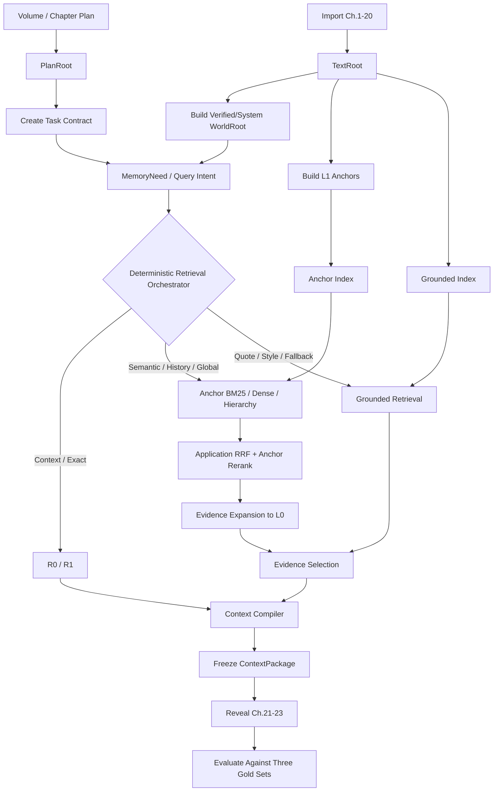

# 长篇小说 Agent 正式开发执行规划

**版本**：v0.2（兼容路径仍保留 `_v0.1` 文件名）

**状态**：正式开发当前基线 / Evolving Execution Plan

**初始日期**：2026-07-20

**最近更新**：2026-07-31
**上位架构**：《长篇小说 Agent 资产、世界模型、控制平面、运行与自演化总体架构设计》v2.2  
**配套技术设计**：《长篇小说 Agent 技术实施与选型设计》v0.1  
**首个研究核心**：Narrative Memory & State Kernel / Real-Novel Replay Kernel  
**本轮执行确认**：Query Intent 路由的 Anchor-first、Anchor/Grounded 双候选池、Stage 1 应用层 RRF、Stage 1B 最小 Derived 传播闭环、Linux 用户态原生开发路径
**阶段编号依据**：`docs/adr/0005-stage-numbering-and-document-lifecycle.md`
**当前进度依据**：`docs/project_status.md`

---

## 0. 执行结论

本项目从现在开始进入正式开发，但不采用“一次性实现完整多 Agent 系统”的方式。开发按两个层次推进：

1. **先搭建完整但极薄的工程骨架**，使领域对象、Artifact、运行事件、检查点、模型调用、检索、提交和评测都拥有稳定接口；
2. **再实现首个可独立验证的纵向切片——叙事记忆—状态内核**，使用真实小说进行只读检索、上下文构造、章节写回和连续回放测试。

Stage 1 工程闭环完成后，可先进入 Stage 2A 的 Planner/Memory Agent Harness 与真实 Scenario
构建，用它完成项目初始化、连续状态重建和正式读写质量取证；只有 Memory Kernel 正式门禁通过，
才进入 Stage 3 Writer/Editor 与最小生成闭环。复杂风险路径、长期自主运行和 Skill 演化分别保留
在后续 Stage 4～7。这样可以
保证后续质量问题能够被定位到明确模块，而不是在完整系统中相互混杂。

本执行规划对原技术实施文档的阶段顺序做一项关键调整：

```text
原计划：
Phase 1 最小 Writer 单章闭环
    → Phase 2 Hybrid Retrieval

调整后：
Stage 0 工程骨架
    → Stage 1A 真实小说只读回放与 Hybrid Retrieval Benchmark
    → Stage 1B 真实章节写回与连续 Commit Replay
    → Stage 2A Memory Agent Harness 与连续 Scenario 重建
    → Stage 3 最小 Writer 生成 A/B
```

即：**基础 Hybrid Retrieval、Narrative Hierarchy 和 Context Compiler 的实验前移；完整 Planner—Writer—Editor 闭环后移。**

本轮进一步确认四项 Stage 1 执行规则：

1. **按 Query Intent 路由的 Anchor-first**：语义历史、全局脉络和计划义务查询默认先检索 L1 Anchor，再按需展开 L0 Evidence；R0/R1 精确状态、精确原句和连续文风样例允许绕过 Anchor；
2. **Anchor / Grounded 双逻辑候选池**：L1 Anchor 与 L0 Grounded Chunk 在同一 L2 系统内分池召回、分配候选配额和统计指标，不在同一个未分型 top-k 中直接竞争；
3. **Stage 1 应用层统一 RRF**：BM25、Dense、Hierarchy 和后续 Graph 通道先保留各自独立 rank，由确定性 Python Service 统一融合；OpenSearch 原生 Hybrid / RRF 作为后续等价性能优化候选；
4. **Stage 1B 前移最小 Derived 传播闭环**：每次连续 Replay Commit 后必须通过 Outbox 构建与目标 Commit 匹配的 Derived Snapshot Lite，并以 Freshness Gate 防止下一章静默读取旧 Anchor 或旧索引。

当前《择天记》Pilot 可作为 Human-Authoring SourceBundle 使用；它必须经过 canonical compiler、
Genesis 初始化和逐章 Scenario Builder 后才进入 Runner。当前开发范围包括完成可导入、可运行、
可评测的系统与 Benchmark Runner；补充正式 Gate 所需的精确 Evidence、replay Gold、复标和
held-out 划分属于数据升级工作，不得用工程 smoke 代替。

由于当前 Linux 宿主机无法提供 Docker Engine / Compose 或兼容运行时，Stage 0 不再把 Docker 作为唯一基础设施路径。当前正式执行方式改为：**在项目目录内以普通用户运行版本锁定的 PostgreSQL、OpenSearch、MinIO 和 OTel Collector；Docker Compose 只保留为未来可选的等价验证路径。** 该调整只改变部署与测试编排，不改变 PostgreSQL、OpenSearch、ObjectStore、OTel 的技术选型，不进入领域模型，也不降低真实基础设施门禁。

原生路径不得以“已经安装了服务”代替可重复性。必须实现版本锁、checksum、隔离数据目录、loopback 网络边界、确定性健康检查、受控故障注入和 suite 级清理；服务缺失或不可达时集成测试必须 fail，不得再以全量 skip 返回成功。

---

# 1. 开发目标、非目标与阶段原则

## 1.1 当前开发目标

### G-001：建立可持续扩展的工程底座

工程底座必须支持：

- 领域 Schema 的类型化定义与版本演进；
- PostgreSQL、Object Store、OpenSearch 的可替换 Port / Adapter；
- Artifact 的内容寻址、版本引用与血缘追踪；
- RunEventLog、Checkpoint、暂停与恢复；
- 模型端点的统一调用与 fake model 测试；
- 最小 LangGraph 执行图；
- Evaluation Ledger 和可复现实验；
- 后续模块在不破坏领域语义的情况下替换。

### G-002：验证叙事记忆—状态内核是否成立

首个研究问题不是“模型能否写出好看的章节”，而是：

> 在长篇历史、卷级计划和当前章节目标下，系统能否知道当前状态、找到未来章节真正需要的长期信息、将其编译成受控上下文，并在读完真实章节后正确写回变化，而不逐章污染后续 Canon。

### G-003：建立设计—实现—评测—修正闭环

每个阶段必须产生：

```text
可运行实现
+ 固定测试数据
+ 可重复 Benchmark
+ 失败分类
+ ADR 结论
+ 下一阶段准入决定
```

不能以“功能已经写完”代替“设计已经被验证”。

## 1.2 当前明确非目标

Stage 0 和 Stage 1 不实现：

- 全部七个稳定 Agent；
- 完整 Planner—Writer—Editor 自主创作；
- 复杂 R2 多轮 Agentic Retrieval；
- Neo4j、Qdrant、Kafka、Temporal、Kubernetes；
- Multi-Worldline、完整 Epistemic State 和复杂 Retcon；
- SkillOpt、MemSkill、ReasoningBank 式自动演化；
- 面向最终用户的完整 Web UI；
- 生产级高可用和多租户。

这些能力均保留接口位置，但不能成为前两个阶段的阻塞项。

## 1.3 阶段执行原则

1. **纵向切片优先**：每个阶段必须形成可端到端运行、可测量的闭环，而不是横向铺开大量半成品模块。
2. **Oracle 与 End-to-End 分离**：先用校正后的状态验证检索和 Context，再用系统自行构建的状态验证完整链路，避免归因混乱。
3. **未来正文严格隔离**：真实第 N～N+2 章只能在 ContextPackage 冻结后用于评测和写回，不得泄漏到检索输入。
4. **权威状态与派生索引分离**：索引可以失败或重建，但不得改变 TextRoot、PlanRoot、WorldRoot 和 Commit 语义。
5. **模型能力与架构能力分离**：消融实验保持同一模型、Prompt 骨架、token 预算和采样设置，只替换记忆/检索/上下文方案。
6. **可回退**：每个 proposed / experimental 机制必须有替代方案、失败判据和回退路径。
7. **不提前微服务化**：采用模块化单体；同进程 Service 直接调用，只有真实跨进程需求出现后才引入 MCP 或独立服务。
8. **先固定路由，后引入 Agentic Retrieval**：Stage 1 使用可枚举、可测试的确定性 Retrieval Orchestrator；只有 Stage 4 才引入 R2 Memory Controller 的开放式多轮检索。
9. **Benchmark 内容与执行系统解耦**：Runner、Manifest、Importer、Gold Loader 和 Evaluator 先用最小合成 fixture 完成契约测试；真实 Benchmark 到位后无需修改领域和检索接口即可运行。

---

# 2. 不得破坏的实现边界

本执行规划允许实现细节动态调整，但以下边界在所有阶段保持不变：

1. 正文只由 `TextRoot` 拥有；Memory、World 和索引只保存可解析 `EvidenceRef`。
2. Plan 是作者意图和叙事义务，不得被当作已经发生的世界事实。
3. Canonical 与 Derived 分离；BM25、Dense、Graph、Summary 和缓存均可重建。
4. 生成结果、Candidate ChangeBundle 与 Accepted Commit 必须分离。
5. 正式状态变更必须经过验证和 Atomic Commit，Agent 不得直接修改 Canon。
6. `RunEventLog` 是运行事实，Checkpoint 只是恢复快照，两者不得混同。
7. R0/R1 确定性路径与 R2 Agentic 路径分层；简单读取不得无条件升级为昂贵 LLM Controller。
8. Context Compiler 是确定性 Service，不是拥有真值或检索治理权的独立 Agent。
9. 阻断级正确性不能依赖 top-k RAG；Exact / Temporal / Constraint 路径必须可确定执行。
10. 所有关键 Context、状态变化和评测结论必须能回到原文证据。
11. Anchor-first 必须由 Query Intent 路由，不得让 R0/R1 精确查询、精确原句或连续文风检索无条件绕行 Anchor。
12. L1 Anchor 与 L0 Grounded Chunk 必须作为两个逻辑候选池独立召回和限额；L2 可以同时索引二者，但不得把异构单元混入同一未分型 top-k。
13. Stage 1 的 RRF 必须由确定性应用 Service 统一执行，并保留各通道原始 rank、候选数和淘汰原因；不得形成 OpenSearch 融合后再与应用通道二次融合的不可解释路径。
14. Stage 1B 的下一章读取必须通过 Freshness Gate：目标 Canonical Commit 与检索 Snapshot 不一致时，只能显式等待、降级或阻断，不得静默使用旧索引。

---

# 3. 总体阶段路线图

| 阶段 | 目标 | 主要交付物 | 阶段门禁 |
|---|---|---|---|
| **Stage 0** | 建立薄而完整的工程骨架 | Domain、Ports、基础设施、RunEventLog、最小图、Artifact、Evaluation Harness | fake model 端到端运行、暂停恢复、幂等提交、可复现实验 |
| **Stage 1A** | 验证“写前能否找到需要的信息” | Benchmark 接入协议、L1、Query Intent Router、Anchor/Grounded 双候选池、应用层 RRF、Context Compiler、Retrieval Benchmark | 路由可诊断；关键状态与证据可测；优于简单基线；无未来泄漏 |
| **Stage 1B** | 验证“读完一章后能否正确更新自己” | Curator、ObservedChangeSet、Overlay、Validation、Atomic Commit、Derived Snapshot Lite、Outbox、Freshness Gate、连续 Replay | 变化抽取达到门禁；连续回放无静默 Canon 或旧索引污染 |
| **Stage 2A** | 用真实项目状态验证记忆 Agent Harness | 完整 Planner 六种 Mode、Curator Bootstrap/Replay、Scenario Builder、受限 Memory Controller、Tool/Prompt/Skill 合同 | 五个 cutoff 可连续重建；无未来泄漏；读写侧失败可分解 |
| **Stage 3** | 验证记忆内核对生成质量的实际贡献 | Writer、Editor、上下文 A/B 生成、Declared/Observed 对账 | 同模型条件下，一致性和计划遵循显著优于基线 |
| **Stage 4** | 引入复杂检索和高风险路径 | R2 Controller、Reactive MemoryNeed、ContextDelta、Guardian、Epistemic | 高风险场景收益覆盖新增成本与复杂度 |
| **Stage 5** | 完整章节与卷级创作闭环 | 动态规划、候选、修复、计划偏离、质量状态 | 多章生成稳定、门禁可解释、错误可恢复 |
| **Stage 6** | 长期自主运行 | 跨卷调度、维护、分支/Retcon、延迟评价、Durable Runtime | 数百章级运行可恢复、可审计、无失控循环 |
| **Stage 7** | 受控自演化与生产扩展 | Experience、Skill 优化、生产部署与容量设计 | held-out gate 证明演化稳定且不损害回归集 |

Stage 3 及以后是初步站位，允许根据 Stage 1/2A 的实证结果重新拆分。Stage 0、Stage 1 和用于
完成真实记忆评测的 Stage 2A 是当前实施范围；Writer/Editor 仍受 Memory Kernel 正式门禁约束。

---

# 4. Stage 0：工程骨架与执行契约

## 4.1 阶段目标

Stage 0 只冻结“接口、依赖方向和运行事实”，不开发完整创作能力。完成后，系统应像一个空的操作系统内核：功能很少，但后续模块有固定插槽，运行可重放，数据可审计，实验可复现。

## 4.2 技术基线

```text
Language                Python 3.12+
Environment Isolation   项目专用 Conda 环境；不得使用 base
Package / Lock           environment.yml + pyproject.toml + uv.lock
Domain Schema            Pydantic v2
API                      FastAPI
Workflow                 LangGraph
Relational / Transaction PostgreSQL + SQLAlchemy 2 + psycopg 3 + Alembic
Artifact Store           S3-compatible Object Store；本地使用 MinIO
Search                   OpenSearch
Model Integration        自研 ModelGateway Port；LangChain Core 只做 provider integration
Observability            OpenTelemetry
Testing                  pytest + Hypothesis + Linux Native Integration Harness
Deployment               Linux 用户态原生服务；Docker Compose 为可选等价路径
```

`domain/` 不得导入 LangChain、LangGraph、SQLAlchemy、OpenSearch SDK 或供应商模型 SDK。

Conda 与 uv 的职责固定为：

```text
Conda
    创建项目独立 Python 运行环境
    固定 Python 大版本
    管理需要 Conda 的系统级、编译型或 GPU 依赖

uv
    在该 Conda 环境内安装项目 Python 包
    维护 pyproject.toml 与 uv.lock
    提供可复现的 Python 依赖解析
```

不得把依赖直接安装到 Conda `base`。项目环境默认使用仓库内 `.conda-env` 前缀或明确的专用环境名；实际路径不得写入领域配置、Artifact 或 Benchmark Manifest。

### 4.2.1 Git 仓库管理规范

当前开发版本从 Stage 0 起由 Git 管理：

- 默认主分支使用 `main`；
- 代码、设计文档、Schema、migration、测试、`environment.yml`、`pyproject.toml` 和 lockfile 必须纳入版本管理；
- `.env`、密钥、Conda 环境目录、模型权重、数据库 volume、OpenSearch 数据、运行日志、Trace、大型 Artifact 和真实小说正文不得提交；
- 功能开发使用短生命周期分支，命名为 `feat/*`、`fix/*`、`experiment/*`、`docs/*`；
- Commit 应保持单一意图，并在提交信息中说明变更模块和验证方式；
- Benchmark Manifest、Schema 和已用于门禁的配置变更必须与对应代码一同提交；
- 不得通过 Git 提交绕过 Project Commit 的运行时五 Root 语义。Git 管工程版本，Project Commit 管小说项目权威状态，两者职责不同。

### 4.2.2 开发模型与批量测试模型隔离

开发过程使用两个逻辑模型角色，具体模型和端点由用户配置：

```text
implementation_model
    用于代码搭建、重构和开发期技术分析
    不作为自动化 Benchmark、批量回放或持续监控的默认端点

batch_test_model
    使用成本较低的独立模型端点
    用于需要模型调用的批量回放、测试执行和监控任务
```

执行规则：

1. pytest、Hypothesis、数据库/Search 集成测试、Schema 校验、哈希和回放测试均由本地确定性程序运行，不调用任何模型；
2. CI 默认使用 `fake_model` 或 recorded fixture，不得隐式调用 `implementation_model`；
3. 只有显式标记为 `model_required` 的批量测试才能调用模型，默认路由到 `batch_test_model`；
4. `implementation_model` 不得既生成待测结果又作为同一运行的唯一验收者；
5. Model Gateway、RunEventLog 和 EvaluationEntry 必须记录 `model_role`、endpoint、model version、cost、latency 和调用目的；
6. 若某项正式质量门禁超出低成本模型能力，应单独声明 evaluator 需求或转人工，不得静默改回开发模型直接自测。

### 4.2.3 Linux 用户态原生开发与安全基线

#### 选择结论

当前宿主机采用无 Docker 的原生开发模式：所有服务均由当前普通用户启动，不注册 root systemd service，不写入 `/usr`、`/etc` 或 `/var/lib`，不要求关闭宿主机防火墙或安全模块。Docker Compose 文件继续保留，用于未来在具备兼容运行时的机器做行为等价验证，但不是本机 Stage 0 的前置条件。

#### 目录与版本边界

```text
.conda-env/                    # Python 与 PostgreSQL 17.10 client/server；Conda 锁定
tmp/native/downloads/          # 临时下载；Git ignored
tmp/native/dist/               # OpenSearch / MinIO / OTel 解包目录；Git ignored
tmp/native/run/                # PID、端口、lease、健康状态；Git ignored
tmp/native/logs/               # 服务日志；Git ignored
volumes/native/dev/            # 可保留的本地开发数据；Git ignored
volumes/native/integration/    # suite 独占、可销毁的测试数据；Git ignored
infra/native-services.lock     # 版本、官方 URL、架构、SHA-256；纳入 Git
```

执行要求：

1. PostgreSQL 17.10 通过项目 Conda 环境安装并锁定；`initdb`、`pg_ctl`、`postgres` 必须来自 `.conda-env/bin`，不得意外连接系统级 PostgreSQL；
2. OpenSearch 3.7.0 使用官方 Linux tarball 及其内置 JDK；MinIO 固定 `RELEASE.2025-06-13T11-33-47Z`；OTel Collector Contrib 固定 0.156.0；三者均使用官方版本化 Linux 二进制；
3. 下载只允许 HTTPS 官方域名或官方 GitHub Release，不允许 `curl | sh`；安装前校验 `infra/native-services.lock` 中的 digest；禁止运行时自动追随 `latest`；Archive 解包前拒绝绝对路径和 `..` 路径；
4. Harness 每次启动都记录真实二进制 digest、版本、配置指纹、PID、进程 start time 和端口，作为 Evaluation / Stage 0 验收证据；
5. 普通开发数据与 integration suite 数据严格分目录；测试不得清空 `volumes/native/dev`。

#### 网络、认证与文件权限

| 服务 | 本地绑定 | 最低安全要求 |
|---|---|---|
| PostgreSQL | `127.0.0.1:${POSTGRES_PORT}` 与项目私有 Unix socket | `listen_addresses=127.0.0.1`；host auth 使用 `scram-sha-256`；data dir `0700` |
| OpenSearch | `127.0.0.1:${OPENSEARCH_PORT}`；transport 同样只在 loopback | `discovery.type=single-node`；若关闭 Security plugin，只能 loopback，启动前拒绝 `0.0.0.0` |
| MinIO | `127.0.0.1:${MINIO_API_PORT}` / `127.0.0.1:${MINIO_CONSOLE_PORT}` | 每次 bootstrap 生成非默认高熵凭据；数据目录 `0700`；不打印 secret |
| OTel Collector | `127.0.0.1:4317/4318/13133` | native 专用配置不得沿用容器内的 `0.0.0.0` receiver |

`.env` 必须为 `0600` 且已被 `.gitignore` 排除；`.env.example` 只保存变量名和明显不可用于正式运行的占位符。日志、Trace、异常和命令输出必须对数据库密码、MinIO Secret 和模型 API Key 脱敏。

启动前执行端口与配置守卫：发现任一服务将绑定非 loopback、目标目录不归当前用户、凭据仍为示例值、端口已被未知进程占用或 endpoint 指向非开发环境时，立即 fail closed。

#### OpenSearch 无 root 兼容策略

当前宿主机 `vm.max_map_count=65530`，低于 OpenSearch 推荐的 262144，且本轮不为开发修改全局 sysctl。因此 native 开发配置采用：

```yaml
network.host: 127.0.0.1
discovery.type: single-node
plugins.security.disabled: true
node.store.allow_mmap: false
```

启动脚本仅对 OpenSearch 子进程把 soft `nofile` 提升至 65535；当前 hard limit 足够时无需 root。JVM 初始固定 `-Xms512m -Xmx512m`。禁用 mmap 的环境只用于功能、恢复和检索正确性测试；绝对延迟、吞吐和容量结论必须记录该环境 profile，不得冒充生产性能数据。

#### 进程生命周期与安全停止

仓库实现一个确定性的 `scripts/native_infra.py`，提供 `bootstrap / up / health / stop / restart / down / status`。PID 文件不是停止依据的全部条件；发送信号前必须同时核对：

- PID 仍存在且 owner 是当前 UID；
- `/proc/<pid>/exe` 或命令行指向锁定的项目二进制；
- 进程 start time 与 lease 一致；
- 数据目录位于已解析的 `volumes/native/...` 精确路径内。

不得使用宽泛 `pkill`、进程名全杀、未解析变量或递归删除个人目录。正常停止先发 `SIGTERM` 并等待；超时后只允许处理已经完成上述身份核验的单个 PID。开发数据默认保留；只有 suite 独占的 integration run 目录可在测试成功停止并验证路径后清理。

#### 集成测试替代 Testcontainers

`tests/integration` 的业务断言保留，但基础设施 fixture 改为支持 `native` backend：

1. suite 创建唯一 run id、隔离 PostgreSQL cluster/database、MinIO data/bucket 和 OpenSearch data/index prefix；
2. 使用原生 Harness 启动 suite 专属实例，健康后执行 Alembic migration；
3. PostgreSQL 用 `pg_ctl stop/start`，MinIO/OpenSearch 用经过身份核验的进程 lease 执行停机/恢复；恢复时重用同一数据目录，验证持久化；
4. 测试 endpoint 必须是 loopback，数据库名、bucket、index 必须带 integration run 前缀，防止误操作开发或生产数据；
5. 服务或二进制不可用时测试失败；不得以 skip 形成绿色结果；
6. suite 结束始终尝试优雅停止，保留失败日志和配置指纹；只有成功路径自动清理隔离数据。

Docker/Testcontainers fixture 可作为可选 backend 保留，但两条路径必须调用同一断言函数，避免形成两套语义不同的集成测试。

#### 标准命令合同

实现完成后保持顶层命令不变：

```text
make bootstrap             # 重建 Conda/Python 依赖并准备锁定的 native 二进制
make infra-up              # 默认 INFRA_BACKEND=native
make infra-health          # 检查版本、loopback、认证和服务健康
make integration           # 真实 native suite；0 个 executed test 必须失败
make stage0                # bootstrap → native up → health → migrate → demo
make infra-down            # 只停止本项目 lease 下的进程；默认保留开发数据
```

可选 Docker 路径使用显式 `INFRA_BACKEND=docker`，不得自动探测后静默切换，保证验收报告能够准确记录实际 backend。

#### 官方实施依据

- PostgreSQL 17 Connection / Authentication：<https://www.postgresql.org/docs/17/runtime-config-connection.html>
- PostgreSQL 17 File Locations：<https://www.postgresql.org/docs/17/runtime-config-file-locations.html>
- Conda 用户态 PostgreSQL 说明：<https://conda.org/blog/2026-01-27-you-can-install-postgresql-with-conda>
- conda-forge PostgreSQL 17.10 Linux 包：<https://anaconda.org/conda-forge/postgresql/files?type=conda&version=17.0>
- OpenSearch Tarball：<https://docs.opensearch.org/latest/install-and-configure/install-opensearch/tar/>
- OpenSearch System Settings：<https://docs.opensearch.org/latest/install-and-configure/configuring-opensearch/configuration-system/>
- OpenSearch Security Plugin：<https://docs.opensearch.org/latest/security/configuration/disable-enable-security/>
- MinIO on Linux：<https://min.io/docs/minio/linux/index.html>
- MinIO Server address：<https://min.io/docs/minio/linux/reference/minio-server/minio-server.html>
- OpenTelemetry Collector Linux binary：<https://opentelemetry.io/docs/collector/install/binary/linux/>

## 4.3 建议仓库结构

```text
src/novel_agent/
├── domain/                 # 纯领域对象和规则
├── application/            # Use Case / Command / Query
├── ports/                  # Repository、ObjectStore、Search、Model、Telemetry 接口
├── adapters/               # PostgreSQL、OpenSearch、S3、模型 Provider
├── runtime/                # LangGraph、RunEventLog、Checkpoint、Scheduler
├── services/               # Retrieval、Context、Validation、Commit、Evaluation
├── agents/                 # 后续 Agent；Stage 0 仅保留接口或 fake
├── api/
├── workers/
└── tests/
    ├── unit/
    ├── contract/
    ├── integration/
    ├── replay/
    └── fixtures/
```

## 4.4 Stage 0 最小领域对象

本阶段不要求冻结全部字段，但必须先定义下列对象及版本字段：

```text
Identity / Version
    ProjectId, RunId, TaskId, ArtifactId, CommitId, SchemaVersion

Artifact / Root
    ArtifactRef, RootManifest, TextRootRef, PlanRootRef, WorldRootRef,
    ReferenceRootRef, ProjectProfileRootRef

Text / Evidence
    TextBlock, TextSpanRef, EvidenceRef, QuoteHash

Plan / World Minimal
    PlanNode, Entity, Event, StateRecord, RelationRecord,
    TruthClass, StoryTime, NarrativeOrder

Read Side
    QueryContract, MemoryNeed, EvidenceItem, EvidencePack,
    ContextAssemblyPlan, ContextPackage

Write Side
    ObservedChangeSet, CandidateChangeBundle, ValidationReport,
    CommitRequest, CommitResult

Runtime / Evaluation
    RunEvent, RunCheckpoint, EffectReceipt, EvaluationEntry
```

所有模型默认采用：

```python
extra="forbid"
strict=True
frozen=True
```

持久化变更通过新对象和 Domain Event 表达，不允许对已提交对象原地修改。

## 4.5 Stage 0 最小执行图


该图不需要调用真实 Writer。`Process Chapter` 可以接收固定测试文本；检索、抽取和模型节点可先使用确定性 fake adapter。

## 4.6 工作包

| 编号 | 工作包 | 关键任务 | 交付物 | 依赖 |
|---|---|---|---|---|
| F0-01 | 仓库与质量基线 | Git/main、`.gitignore`、项目专用 Conda、uv lock、lint/type/test、pre-commit、配置分层 | 可安装 package、隔离环境、CI 基线 | 无 |
| F0-02 | 本地基础设施 | Linux 用户态原生 Harness 启动 PostgreSQL、OpenSearch、MinIO、OTel；Docker Compose 保留可选 | native lock、启动/停止/健康检查、可选 `compose.yaml` | F0-01 |
| F0-03 | Domain Contract | 实现最小领域对象、JSON Schema 导出、SchemaVersion | `domain/` 与 contract tests | F0-01 |
| F0-04 | Artifact 与 Root | 内容哈希、ObjectStore Port、RootManifest、ArtifactRef 解析 | Artifact Repository | F0-02/03 |
| F0-05 | Commit 基础 | Commit Manifest、base commit、幂等键、事务、最小 read/write set | Commit Service v0 | F0-04 |
| F0-06 | RunEventLog | append-only event、序号、checkpoint pointer、replay | Event Log Repository | F0-02/03 |
| F0-07 | Model Gateway | fake model、`implementation_model` / `batch_test_model` 角色、统一请求/响应、超时和调用记录 | ModelEndpoint Port | F0-03/06 |
| F0-08 | LangGraph Runtime | 最小图、节点 Artifact 化、interrupt/resume | Replayable Graph v0 | F0-05/06/07 |
| F0-09 | Evaluation Harness | EvaluationEntry、模型角色隔离、`model_required` 显式标记、运行参数固定、Parquet 导出 | Benchmark Runner v0 | F0-06/08 |
| F0-10 | 故障与集成测试 | DB/OpenSearch/ObjectStore 故障、重复执行、恢复测试 | 集成测试报告 | 全部 |

## 4.7 关键运行事件

Stage 0 至少记录：

```text
run.created
run.resumed
run.completed
run.failed

task.started
task.suspended
task.completed
task.failed

model.requested
model.completed
model.failed

artifact.produced
artifact.superseded

commit.requested
commit.accepted
commit.rejected

effect.requested
effect.completed
effect.uncertain

checkpoint.created
```

每条事件具有：`run_id`、`task_id`、单调序号、事件时间、幂等身份、payload schema version 和 trace_id。

## 4.8 Stage 0 验收场景

### E0-01：全新环境启动

从空目录执行后，应完成：

```text
创建/恢复项目专用 Conda 环境
→ uv 按 lockfile 安装依赖
→ 校验并准备锁版本 native 二进制
→ 以普通用户在 loopback 启动隔离基础设施
→ Alembic migration
→ 创建 Project
→ 运行 fake chapter workflow
→ 产生 Artifact 和 Commit
```

### E0-02：暂停与恢复

在 `Process Chapter` 后中断，重启进程并恢复；已完成副作用不得重复，最终 Commit 与不中断运行一致。

### E0-03：幂等提交

使用同一 `idempotency_key` 重复提交两次，只产生一个 Accepted Commit。

### E0-04：Artifact 可验证

Artifact 内容哈希、对象存储内容和元数据一致；篡改内容后验证必须失败。

### E0-05：运行事实与 Trace 贯通

给定 `run_id`，可以追溯节点、模型调用、Artifact、Commit、Checkpoint 和 OTel trace。

### E0-06：模型角色隔离

运行确定性测试时 Model Gateway 调用数必须为零；运行标记为 `model_required` 的批量 smoke suite 时只允许解析 `batch_test_model`，未配置该端点则显式 skip / fail，不得回退到 `implementation_model`。

## 4.9 Stage 0 退出门禁

以下条件全部满足，才进入 Stage 1：

- [x] fresh clone 可以用一条标准命令启动 Linux 用户态原生集成环境，不要求 Docker 或 sudo；
- [x] 项目专用 Conda 环境可由 `environment.yml` 重建，且未向 `base` 安装项目依赖；
- [x] Git 主分支、忽略规则和工程资产跟踪范围已生效，真实正文、密钥、环境目录和运行数据未被跟踪；
- [x] Domain unit test、Schema contract test 和数据库集成测试通过；
- [x] fake model 图可运行、暂停、恢复和重放；
- [x] Artifact、Commit 和 RunEventLog 有稳定 ID、版本与幂等语义；
- [x] PostgreSQL、OpenSearch、Object Store 均有真实原生集成测试，且不可用时 fail、不得全量 skip；
- [x] 所有 native endpoint 仅绑定 loopback，凭据非默认、文件权限和进程 owner 检查通过；
- [x] native 故障注入只控制 suite 独占进程并能复用同一数据目录完成恢复验证；
- [x] 任一实验能够固定配置并导出 EvaluationEntry；
- [x] 确定性测试不调用模型；模型批量测试默认只调用 `batch_test_model`，且 `implementation_model` 不参与自动自测；
- [x] 没有引入完整 Writer、多 Agent 或与当前目标无关的生产组件。

---

# 5. Stage 1：叙事记忆—状态内核与真实小说回放

## 5.1 阶段定义

Stage 1 的正式名称为：

# Narrative Memory & State Kernel

其测试载体为：

# Real-Novel Replay Kernel

端到端流程为：

```text
真实历史正文 + 卷级/章节级计划
    ↓
TextRoot / PlanRoot 导入
    ↓
最小 WorldRoot 与 L1 Anchor 构建
    ↓
MemoryNeed 生成
    ↓
Query Intent Route
    ↓
R0/R1 Exact，或 L1 Anchor Retrieval
    ↓
应用层 RRF + Anchor Rerank
    ↓
按需展开 L0 Evidence / Grounded Fallback
    ↓
ContextPackage
    ↓
冻结输出并揭示真实后续章节
    ↓
评测未来信息覆盖与上下文效率
    ↓
输入真实下一章
    ↓
ObservedChangeSet / Validation / Atomic Commit
    ↓
进入下一章并连续回放
```

Stage 1 不以生成原创正文为目标，而以隔离并验证记忆内核为目标。

Stage 1 的检索编排由确定性的 `Retrieval Orchestrator` 承担。它根据注册 Query Intent 和 QueryContract 选择 R0、R1、Anchor、Grounded、Hierarchy 等固定路径，执行应用层 RRF、Evidence Expansion 和有界 fallback；它不是 Memory Controller Agent，不执行开放式 LLM Tool Loop。复杂 R2 Agentic Retrieval 继续后置到 Stage 4。

## 5.2 首轮标准实验场景

首个可运行用例采用用户提出的 20→3 方案：

```text
输入：
    小说第 1～20 章正文
    当前卷大纲
    当前卷已有计划状态
    可选：第 21～23 章的章节目标或简要计划

系统输出：
    第 21、22、23 章分别需要的信息类别
    每项信息的当前值、置信度和历史证据
    跨三章共享的长期约束
    每章 ContextPackage

评测：
    冻结输出后读取真实第 21～23 章
    判断哪些信息被显式使用
    判断哪些信息虽未复述但构成必须遵守的约束
    判断哪些 Plan Obligation 在未来三章被推进或兑现
```

为避免将两个不同问题混为一谈，实验分为两种模式：

### Mode A：Plan-conditioned Retrieval

输入卷大纲和第 21～23 章目标。该模式最接近未来系统真实运行，主要测试检索和 Context Compiler。

### Mode B：History-only Need Forecasting

只输入前 20 章和卷级大纲，不给章节级目标。该模式测试系统预测未来信息需求的能力，难度更高，单独报告，不与 Mode A 合并评分。

Mode A 是 Stage 1 的主门禁；Mode B 是研究性扩展。

真实 20→3、Fine-grained Set 和 Replay Set 由用户后续构造并以 `BenchmarkBundle` 提供。系统开发先使用不承担质量门禁的最小合成 fixture 验证导入、索引、路由、回放和评测接口；真实 Bundle 到位后直接运行正式 Benchmark，不要求为具体小说修改代码。

## 5.3 Gold 标注不能只看“未来正文提到了什么”

真实后续正文应形成三类 Gold，而不是单一关键词集合：

| Gold 类型 | 定义 | 示例 |
|---|---|---|
| **Observed Use Gold** | 在第 21～23 章被明确提及、调用或回忆的信息 | 旧承诺、物品来源、过去事件 |
| **Operational Constraint Gold** | 未必被复述，但写作时不能违反的当前状态 | 人物位置、生死、伤势、持有关系、知识边界 |
| **Plan Obligation Gold** | 由卷纲/章纲要求推进、延迟或兑现的叙事义务 | 伏笔、目标、冲突、角色弧节点 |

只比较显式提及会漏掉最重要的隐性约束，因此 ContextPackage 的核心门禁是三类 Gold 的联合覆盖。

## 5.4 数据协议

### 5.4.1 BenchmarkBundle 接入边界

工程侧负责定义、校验和导入 `BenchmarkBundle`，不负责创作真实小说或替用户完成正式 Gold 标注。Bundle 可以按以下完整度接入：

1. 正文 + 全书/分卷/章节大纲 + 人物/世界设定；
2. 正文 + 分卷大纲或章节概要；
3. 只有完整正文和最小 Gold；缺失的 Plan / Verified World 信息在 Manifest 中显式标为不可用，不得由导入器静默猜测。

工程仓库只保存 Schema、脱敏样例和最小合成 fixture；真实正文与正式 Gold 通过外部 Bundle 路径加载，不混入公开代码资产。

### 5.4.2 首轮数据规模

BenchmarkBundle 协议支持三种规模；具体数据由用户后续提供，不要求工程开发阶段先完成真实语料：

```text
Pilot Set
    1 部小说
    1 个连续 20→3 窗口
    用于打通流程和校准 Schema

Fine-grained Set
    30～50 个目标章节窗口
    高密度标注 Gold Evidence、状态和义务

Replay Set
    连续 50～200 章
    标注关键状态、事件、物品、位置、伏笔
    用于累计漂移测试
```

Runner 不得假定固定书名、章节数量、人物类型或文件路径。数据必须具有明确授权或符合研究使用条件；原文不得混入公开仓库。

### 5.4.3 Benchmark Manifest

每个案例至少包含：

```yaml
case_id:
project_id:
history_range: [1, 20]
target_range: [21, 23]
input_text_root:
input_plan_root:
input_world_root_verified:        # Oracle Track 使用
chapter_goals:                    # 可选
future_text_root_private:         # 只供 evaluator
observed_use_gold:
operational_constraint_gold:
plan_obligation_gold:
gold_evidence_refs:
annotation_version:
```

Bundle 顶层还必须包含：

```yaml
bundle_id:
bundle_schema_version:
content_hash:
case_manifests: []
history_access_policy:
evaluator_access_policy:
expected_profiles:
```

Importer 必须验证章节边界、所有 EvidenceRef、内容哈希和 Manifest 引用；正式 Benchmark 缺失必填 Gold 时应拒绝进入门禁运行，而不是自动补全。

## 5.5 双轨验证设计

为了定位失败来源，Stage 1 必须同时维护两个 Track。

### Track O：Oracle / Verified Memory

使用人工校正或抽样审核后的 WorldRoot、L1 Anchor 和 EvidenceRef。它回答：

> 在状态和索引材料正确的前提下，MemoryNeed、检索、融合与 Context Compiler 是否有效？

### Track E：End-to-End Memory Construction

系统从第 1～20 章自行抽取 WorldRoot 和 L1，再运行相同检索。它回答：

> 从原始小说到 ContextPackage 的完整链路是否有效？

两者差值用于量化“记忆构建误差”对后续检索的影响。若 Track O 通过而 Track E 失败，应优先修复抽取/写回，而不是盲目更换检索算法。

## 5.6 Stage 1 最小 Canonical State

首轮 Schema 只覆盖长篇最易崩坏的高价值类型：

```text
Entity
    character / location / organization / item / ability / concept
    stable id + aliases

Event
    关键发生事件、参与者、作用对象、story time、narrative order

State
    alive / injury / ability / emotion-functional / goal / status

Relation
    located_at / owns / holds / member_of / trusts / hostile_to / knows

Timeline
    明确时间、相对时间、事件顺序

Plan Obligation
    foreshadowing / promise / objective / unresolved conflict

Truth Class
    world_fact / assertion / rumor / dream / prediction / hypothetical

EvidenceRef
    text root / chapter / block / codepoint span / quote hash
```

完整 EpistemicState、Disclosure、Multi-Worldline 和复杂历法后置，但不得把“角色声称”自动提升为 World Fact。

## 5.7 Stage 1A：只读回放与 Context Benchmark

### 5.7.1 Read Side 流程



### 5.7.2 MemoryNeed 输出

每个目标章节至少输出：

```text
need_id
chapter_target / horizon_target
need_type
query_intent
entities / predicates / time scope
why_needed
risk_level
mandatory_or_optional
preferred_resolution_path
allowed_candidate_pools
expected_evidence_type
stop_condition
```

对于第 21～23 章，应额外输出一个 `HorizonNeedSet`，区分：

- 三章共享的硬约束；
- 只在某一章需要的历史事件；
- 需要逐章更新后才能确定的信息；
- 卷级义务和节奏目标。

### 5.7.3 Query Intent 路由与检索通道

Stage 1A 不采用“所有查询同时跑全部通道”，而由确定性 `Retrieval Orchestrator` 按注册 Intent 路由：

| Query Intent | 默认入口 | 说明 |
|---|---|---|
| `current_state / known_id / plan_node / mandatory_constraint` | R0 / R1 Exact + Temporal | 不经 Anchor，不进入 RRF；需要核验时再展开 EvidenceRef |
| `semantic_history / related_event / plan_obligation` | Anchor Index 的 BM25 + Dense | 默认 Anchor-first，排序后再展开 L0 |
| `global_arc / chapter_thread / character_arc` | Hierarchy 上层 Anchor | Arc/Volume/Chapter → Scene/Fact 下钻 |
| `exact_quote / rare_phrase` | Grounded Index 的 L0 BM25 | 直接定位 Span 和有限上下文窗口 |
| `style_voice / dialogue_sample` | Grounded Scene/Block + 可选 Style Anchor | 最终必须读取连续原文，摘要不能替代 |
| `causal_multi_hop / relation_chain` | PostgreSQL Typed Graph 返回 AnchorRef | Stage 1 仅固定深度和固定模板；开放式调查后置 R2 |
| `anchor_insufficient` | Grounded BM25 / Dense fallback | 只在 Anchor 召回或证据展开不足时触发 |

底层通道仍包括：

```text
R0          当前 Task / Context 内直接读取
R1          PostgreSQL Exact + Entity + Temporal
Anchor BM25 OpenSearch L1 lexical retrieval
Anchor Dense OpenSearch L1 vector retrieval（BGE-M3 baseline）
Grounded BM25 / Dense OpenSearch L0 retrieval
Hierarchy   Book → Volume → Arc → Chapter → Scene → Span
Typed Graph PostgreSQL 节点/边表 + recursive CTE
Rerank      BGE-reranker-v2-m3 candidate；只处理小型 Anchor 候选集
```

Stage 1 不引入 Neo4j，也不允许 Retrieval Orchestrator 自由生成无界 Tool Loop。Intent、允许通道、候选上限、fallback 和停止条件均由版本化配置枚举。

#### 5.7.3.1 Anchor / Grounded 双逻辑候选池

```text
Anchor Index / Alias
    L1 Fact / State / Relation / Event / Scene / Chapter / Arc / Plan Anchors
    默认服务 semantic/history/global 查询

Grounded Index / Alias
    L0 TextRoot / ReferenceRoot 的 Block / Span / bounded chunk
    服务 exact quote、style sample、Evidence Expansion 和 fallback
```

两个候选池可以位于同一 OpenSearch 集群，但必须具有独立 alias 或等价的强制 `retrieval_unit_kind` 过滤、独立 top-k 和独立指标。Chapter Summary、Fact Anchor 与 L0 Chunk 不得在没有类型配额的同一 top-k 中直接竞争。

#### 5.7.3.2 Stage 1 应用层统一 RRF

Stage 1 的融合所有者为确定性 Python `FusionService`：

```text
BM25 rank ───────┐
Dense rank ──────┤
Hierarchy rank ──┼→ Application RRF → typed candidate list
Graph rank ──────┘
```

要求：

- 每个通道返回独立 `channel_rank`、原始 score、candidate count 和命中理由；
- RRF 只融合被当前 Query Intent 允许的候选，R0/R1 mandatory 结果不进入 RRF；
- 不允许先使用 OpenSearch Hybrid 融合 BM25 + Dense，再将结果与 Graph/Hierarchy 做第二次不可解释融合；
- OpenSearch 原生 Hybrid / RRF 只作为后续 Adapter 优化，必须通过与应用层基线的结果和延迟对照后才能替换；
- RRF 参数、通道配额和实现版本进入 Benchmark Manifest。

#### 5.7.3.3 Anchor 排序与 Evidence Expansion

执行顺序固定为：

```text
Anchor coarse retrieval
    → application RRF / dedupe
    → optional Anchor rerank
    → Anchor SourceRef
    → L0 Span
    → bounded Block window
    → Scene when required
    → Chapter only by explicit reason
```

Anchor rerank 与 Evidence 选择分成两个阶段。系统不得因一个 Anchor 入选就展开其全部原文；只有支持 Need、解释冲突或满足文风连续性要求的 L0 证据进入 Context 候选。

默认最多一轮主检索和一轮 fallback。每次运行必须记录 Anchor 展开数、L0 token、Scene 展开数、整章读取数、fallback 原因和停止原因。

### 5.7.4 ContextPackage 最小分区

```text
ContextPackage
├── task_contract
├── mandatory_constraints
├── current_world_state
├── active_plan_obligations
├── relevant_historical_events
├── truth_and_knowledge_boundaries
├── raw_evidence_spans
├── style_or_reference_optional
├── unresolved_gaps
└── provenance_and_budget_report
```

`mandatory_constraints` 不得因相似度低而被 token 裁剪。普通相关材料才参与预算竞争。

## 5.8 Baseline 与消融矩阵

至少比较：

```text
B0  最近 2～3 章正文
B1  最近章节 + 章节摘要
B2  Naive Dense Vector RAG
B3  BM25
B4  BM25 + Dense RRF
K1  Exact + Temporal + BM25 + Dense
K2  K1 + Narrative Hierarchy
K3  K2 + Reranker
K4  完整 Memory-State-Context Kernel
```

为直接验证已确认的 Anchor-first 执行规则，增加以下专项消融：

```text
A0  L0 Grounded BM25 direct
A1  L1 Anchor BM25 only，不展开 L0
A2  L1 Anchor BM25 → L0 Evidence Expansion
A3  L1 Anchor BM25 + Dense application RRF → L0 Expansion
A4  A3 + Anchor Reranker → L0 Expansion
A5  A4 + Grounded fallback / targeted Hierarchy or Graph supplement
A6  Anchor 与 Grounded 并行全量召回，作为高成本上界对照
```

实验控制变量：

- 同一历史输入和计划；
- 同一 MemoryNeed 生成模型，或分别报告 Oracle Query 与 Generated Query；
- 同一 Context token 预算；
- 同一 retrieval candidate、rerank pair 和 evidence expansion 预算；
- 同一 embedding / reranker 版本；
- 同一评测 Gold 和 evaluator 配置；
- 至少运行固定随机种子或记录非确定性调用。

建议额外设置两种 Query 条件：

```text
Oracle Need Query
    人工提供真实信息需求，隔离检索能力

Generated MemoryNeed
    系统自行判断需求，测试完整读侧能力
```

这样可以区分“没有想到要找”和“想到但没有找到”。

## 5.9 Stage 1A 指标

### 5.9.1 Need 与检索层

```text
Need Recall / Precision / F1
Query Intent Routing Accuracy
Wrong Route / Unnecessary Channel Rate
Gold Evidence Recall@k
MRR / nDCG
Anchor Recall@k / Precision@k
Anchor-to-Gold-Evidence Conversion Rate
Evidence Recall after Expansion
平均展开 Anchor / Span / Block / Scene 数
Full Chapter Read Rate
Grounded Fallback Rate
Reranker Pair Tokens
L0 Evidence Tokens Read
Current-state Accuracy
Temporal Validity Accuracy
Stale State Rate
Wrong Entity Binding Rate
Future Leakage Rate
```

### 5.9.2 ContextPackage 层

```text
Observed Use Coverage
Operational Constraint Coverage
Plan Obligation Coverage
Mandatory Constraint Coverage
Irrelevant Token Ratio
Evidence Traceability
Conflict Exposure Rate
Context Utility per 1K Tokens
Unresolved Gap Calibration
```

### 5.9.3 多章预测层

```text
N+1 / N+2 / N+3 分层覆盖率
Shared Horizon Constraint Coverage
Horizon Decay
过早注入未来信息比例
章节间 Context 重复率
```

## 5.10 Stage 1A 初始工程门禁

以下数值是 Pilot 后可校准的工程目标，不是永久架构承诺：

| 指标 | v0.1 目标 |
|---|---:|
| P0 当前状态准确率 | ≥ 95% |
| 关键 Evidence Recall@20 | ≥ 90% |
| Mandatory Constraint Coverage | 100% |
| Operational Constraint Coverage | ≥ 95% |
| Future Leakage Rate | 0 |
| Evidence 可回溯率 | 100% |
| 相对 B0/B1 的 Context Utility | 显著提升 |

Stage 1A 的第一个门禁不是单纯达到某个分数，而是：

1. 指标可稳定复现；
2. 错误可分解到 Need、State、Retrieval 或 Context；
3. 至少一个结构化方案在关键覆盖率上稳定优于最近章节和 Naive RAG；
4. 没有通过读取未来章节获得提升；
5. Exact/current-state 查询能够稳定绕过 Anchor，semantic/history 查询默认进入 Anchor Index，quote/style 查询能够按契约进入 Grounded Index；
6. Anchor 与 Grounded 候选池可独立统计、独立限额，不存在未分型混合 top-k；
7. 应用层 RRF 能完整记录每通道原始 rank，且没有双重融合；
8. Anchor-first 相对直接 L0 检索在不降低 Mandatory / Gold Evidence Coverage 的前提下，减少 L0 阅读量或提高 Context Utility per Token。

## 5.11 Stage 1B：真实章节写回与连续 Commit Replay

### 5.11.1 Teacher-forced Replay

```text
以第 N 章开始前 Commit 为基线
    ↓
使用真实第 N 章作为 ProcessChapter 输出
    ↓
Curator 抽取 ObservedChangeSet
    ↓
生成 EvidenceRef 和 Truth Class
    ↓
构造 Candidate Overlay
    ↓
执行确定性与模型辅助 Validation
    ↓
形成 Candidate ChangeBundle
    ↓
Atomic Commit
    ↓
第 N+1 章从新 Commit 继续
```

此阶段暂不评估 Writer 文学质量，从而只测试“读完一章后系统是否理解并正确更新”。

### 5.11.2 最小变化类型

```text
entity introduced / alias resolved
event occurred
state created / changed / ended
relation created / changed / ended
item ownership / location changed
time advanced / relative order added
plan obligation created / progressed / resolved
assertion recorded without truth promotion
```

### 5.11.3 验证层

第一版至少包含：

1. Pydantic / JSON Schema 校验；
2. Entity、Predicate、枚举和 ID 存在性校验；
3. EvidenceRef 可解析与 QuoteHash 校验；
4. Valid Time 与 Narrative Order 校验；
5. 状态转移合法性校验；
6. Assertion / Rumor / Dream 错误提升检查；
7. 同一 write set 的冲突检查；
8. base commit 与幂等键检查；
9. Candidate Overlay 查询后的关键约束检查；
10. Commit 后 Root Hash 与物化结果一致性检查。

### 5.11.4 写回指标

```text
State Delta Precision / Recall / F1
Event Extraction F1
Relation Delta F1
Plan Obligation Update F1
Wrong Target Binding Rate
False World-Fact Promotion Rate
Missed Critical Change Rate
Invalid State Overwrite Rate
Evidence Binding Accuracy
Commit Conflict / Reject Rate
```

### 5.11.5 长程回放指标

```text
20 / 50 / 100 / 200 章后的当前状态准确率
累计状态漂移曲线
错误物品归属数
错误人物位置数
错误生死/伤势状态数
错误伏笔债务数
孤立 EvidenceRef 数
人工修复 Commit 数
首次污染发生章节
污染传播深度
```

### 5.11.6 Derived Snapshot Lite、Outbox 与 Freshness Gate

Stage 1B 每次 Atomic Commit 后必须完成最小派生传播闭环：

```text
Atomic Commit C_N
    └── 同事务写 projection_outbox
            ├── build new L1 anchors
            ├── update Anchor Index
            ├── update Grounded Index for new Text blocks
            ├── build/update embeddings
            ├── publish Derived Snapshot Lite DS_N
            └── evaluate replay-scope freshness/readiness
```

`Derived Snapshot Lite` 至少记录：

```text
snapshot_id
source_commit
anchor_build_id
anchor_index_version
grounded_index_version
embedding_profile
fusion_profile
build_status: building / exact / partial / failed
failure_debt
published_at
```

第 N+1 章开始前执行 Freshness Gate：

```text
Canonical Commit = C_N
R1 current-state basis = C_N
Retrieval Snapshot source_commit = C_N
Anchor / Grounded alias 指向已发布 DS_N
ContextManifest 记录实际使用的 DS_N
```

如果派生构建失败，C_N 不回滚，但系统必须选择并记录以下一种结果：

- `WAIT_FOR_EXACT`：等待 DS_N 构建完成；
- `DEGRADED_CANONICAL`：显式退化到 R1 / Canonical / L0 direct；
- `BLOCKED_BY_FRESHNESS`：当前 replay scope 阻断；
- `MANUAL_OVERRIDE`：经批准使用指定范围和指定 Snapshot，保留风险记录。

严禁在没有 stale/degraded 标记的情况下继续使用 DS_(N-1)。Outbox 重试、alias 发布和 Snapshot 构建必须幂等；索引文档必须携带 `source_commit / snapshot_id / retrieval_unit_kind`。

### 5.11.7 Stage 1B 初始门禁

| 指标 | v0.1 目标 |
|---|---:|
| 高风险 State Delta F1 | ≥ 0.85 |
| False World-Fact Promotion | ≤ 1% |
| Evidence Binding Accuracy | ≥ 99% |
| 连续 50 章回放 | 无静默 Canon 污染 |
| Commit 幂等与恢复 | 100% 通过 |
| Outbox 任务幂等与可恢复 | 100% 通过 |
| Snapshot / Canonical basis 匹配 | 100% 或显式 degraded / blocked |
| 静默旧索引读取 | 0 |
| 检出的阻断错误 | 不得自动提交 |

“无静默 Canon 污染”表示：任何高风险错误必须被 Validator 阻断或被 Evaluation Ledger 标记，不能无记录地进入后续基线。“无静默旧索引污染”表示：任何 Canonical / Snapshot basis 不一致必须由 Freshness Gate 检出并等待、降级、阻断或获批覆盖，不能让下一章误认为旧检索结果是当前状态。

## 5.12 Stage 1 工作包

| 编号 | 工作包 | 关键交付物 | 主要依赖 |
|---|---|---|---|
| M1-01 | 小说导入器与规范化 | 通用 Chapter/Scene/Block、Unicode codepoint、TextRoot，不绑定具体作品 | Stage 0 |
| M1-02 | Plan Importer | 通用卷纲、章纲、目标和义务的 PlanRoot 接入 | M1-01 |
| M1-03 | BenchmarkBundle / Manifest 接入 | Bundle Schema、Importer、三类 Gold Loader、Evidence 校验、合成 fixture | M1-01/02 |
| M1-04 | 最小 WorldRoot | Entity/Event/State/Relation/Time/Truth | M1-01 |
| M1-05 | L1 Anchor Pipeline | 章节、场景、事实与事件锚点 | M1-01/04 |
| M1-06 | R1 Exact / Temporal | PostgreSQL 查询与版本过滤 | M1-04 |
| M1-07 | Anchor / Grounded Retrieval | 双逻辑索引、BM25、Dense、Hierarchy、typed candidate | M1-05 |
| M1-08 | Query Intent / MemoryNeed | 确定性 Retrieval Orchestrator、Oracle 与生成式 Need 两条路径 | M1-02/04/06/07 |
| M1-08A | Application Fusion | 统一 RRF、通道独立 rank、配额、去重、rerank adapter | M1-07/08 |
| M1-09 | Evidence Expansion / Context Compiler | Anchor→L0、展开预算、分区、mandatory closure、provenance | M1-06/07/08/08A |
| M1-10 | Retrieval Benchmark Runner | Baseline、消融、指标与报告 | M1-03/09 |
| M1-11 | Curator / Change Extraction | ObservedChangeSet、EvidenceRef | M1-04 |
| M1-12 | Overlay / Validation / Commit | CandidateChangeBundle、Atomic Commit | M1-11 |
| M1-12A | Derived Propagation Lite | projection_outbox、Snapshot Lite、Anchor/Grounded 增量更新、Freshness Gate | M1-05/07/12 |
| M1-13 | Continuous Replay Runner | 50～200 章 teacher-forced replay | M1-10/12/12A |
| M1-14 | Failure Analysis 与 ADR | 失败归因、选型晋升或回退 | 全部 |

## 5.13 失败归因规则

Stage 1 的核心价值是让每次失败都能定位。报告必须按以下类别标记：

```text
F-STATE      Canonical State 或 Anchor 构建错误
F-NEED       系统没有识别需要检索的信息
F-ROUTE      Query Intent 或候选池路由错误
F-RETRIEVE   Query 正确但未召回证据
F-RANK       召回但排序/预算导致丢失
F-EXPAND     Anchor 正确但 L0 Evidence 展开不足、过量或展开层级错误
F-CONTEXT    Context Compiler 选择或表达错误
F-EXTRACT    章节变化抽取错误
F-TRUTH      真值或认知类型错误
F-VALIDATE   Validator 漏检或误拦截
F-COMMIT     事务、幂等或物化错误
F-FRESH      Snapshot、alias 或索引 basis 过期/错配且未被正确处理
F-EVAL       Gold 或 evaluator 不可靠
```

优化时只修改主要责任模块，并在固定回归集上重跑，避免多处同时变更导致无法判断收益来源。

## 5.14 Stage 1 最终退出门禁

Stage 1 完成后，由以下三种结论之一决定下一步：

### PASS

- Read Side 和 Write Side 门禁均达到校准目标；
- 至少 50 章连续回放没有静默高风险污染；
- 连续回放中 Canonical / Snapshot basis 始终一致，或每次不一致均被显式降级/阻断；
- 完整内核稳定优于最近章节/Naive RAG；
- 主要技术选型有 Benchmark 证据；
- 可以冻结 `Memory Kernel v0.1`，进入 Stage 2。

### CONDITIONAL PASS

- 总体架构成立，但某个模块成为明确瓶颈；
- 只开启该模块的专项优化迭代，例如 L1、Need、reranker 或 Curator；
- 其余模块保持冻结，达标后再进入 Stage 2。

### FAIL / ARCHITECTURE REVIEW

出现以下情况之一，应回到领域或检索设计，而不是继续加 Agent：

- Verified Memory Track 仍无法稳定覆盖关键上下文；
- ContextPackage 在合理 token 预算下没有优于简单基线；
- 状态 Schema 无法表达常见小说变化；
- 连续回放出现系统性不可检测污染；
- Freshness Gate 无法阻止旧 Anchor / 索引进入下一章 Context；
- EvidenceRef 和版本语义无法稳定重放。

---

## 5.15 2026-07-21 实施检查点

Stage 1A/1B 的通用工程闭环已实现：BenchmarkBundle/Replay Manifest、双轨只读 Runner、
Intent Router、PostgreSQL R1、OpenSearch Anchor/Grounded 双索引、应用层 RRF、Evidence
Expansion、Context Compiler、Curator、Candidate Overlay、Validator、Atomic Commit、带 lease
恢复的同事务 projection_outbox、跨 MinIO/PostgreSQL/OpenSearch 的 Derived Snapshot Lite、
Freshness Gate 和合成 21→22→23 连续回放均已进入确定性回归。Replay Evaluator 同时比较
目标键与 Gold `expected_record` 标注内容，避免“目标正确但状态值错误”获得命中分。

截至本检查点，生产接线也已补齐以下通用能力：版本化 embedding/reranker HTTP adapter 与
`batch_test_model` 批测角色隔离；B1 最近 3 章原文加历史 Evidence-bound Summary 的真实协议；
仅暴露当前揭示章节和当前 WorldRoot 的审计化模型 Curator；确定性规则优先且模型只能追加
finding 的模型 Validator；版本化状态迁移/义务生命周期策略；以及逐章 checkpoint、分类状态
错误、非法覆盖、孤儿证据、人工修复、首次污染和传播深度的回放漂移账本。确定性回放与模型
辅助回放复用同一 Overlay、Validation、Commit、Projection 和 Freshness 路径。

2026-07-21 后续生产化检查已完成锁定的 BGE-M3 与 BGE-reranker-v2-m3 制品、官方 HTTPS
逐文件 SHA 校验、CPU-only loopback 模型服务、严格 PID/版本/runtime fingerprint 健康检查、
批处理 HTTP adapter，以及 PostgreSQL R1 + OpenSearch 双索引 + 两个真实模型的 16-profile
Oracle 运行路径。合成端到端烟测同时验证模型调用逐条进入 RunEventLog、16 个 profile 进入
append-only Evaluation Ledger。外部 verified basis 会先以父提交为空的 RootManifest 注册到合法
Project/Commit，再物化 R1，不绕过关系约束。原生 integration 也显式关闭 OTel Collector 自身的
默认 8888 metrics reader，保证 suite 独占端口；OTLP 三信号管线不受影响。

本检查点只表示工程门禁通过，不改变 5.14 的正式退出条件。真实 DEV-110 与 DEV-113 仍等待
用户提供有授权的 BenchmarkBundle；在真实 20→3 和至少 50 章 Gold replay 完成前，Stage 1
状态为“formal gate pending”，Stage 2A 只允许推进 Agent Harness、Scenario Builder 和真实门禁
取证，Stage 3～7 继续按第 9 节保持阻断。详细证据见
`docs/stage1_acceptance.md`，工程基线决策见
`docs/adr/0001-stage1-memory-kernel-baseline.md`，逐工作包剩余缺口见
`docs/stage1_gap_audit.md`。确定性 hash embedding、词法 reranker、规则 Curator 和合成模型响应
只承担工程回归，不得被解释为 BGE-M3、BGE-reranker、Curator 或 Validator 的真实质量已经通过。
通用 adapter、锁定模型服务、真实模型功能烟测、生产 runner 和审计持久化已经完成；在正式
Bundle 上运行质量/延迟与 DEV-110/DEV-113，仍是 Stage 1 正式放行的前置条件。当前 CPU
功能数据不得被解释为生产容量或 GPU 性能证据。

---

# 6. Stage 2 及后续阶段的初步站位

## 6.1 Stage 2A：Memory Agent Harness 与连续项目回放

Stage 2A 先把真实 Benchmark 变成“写到某章时的项目状态”，不是把 5 个 case 当成彼此独立的
静态问答。其专项实施合同见 `docs/stage2_memory_agents_development.md`。最小能力为：

```text
Planner Agent
    PROJECT_BOOTSTRAP / STORY / ARC_VOLUME / CHAPTER / SCENE / REPLAN
Memory Curator
    BOOTSTRAP / REPLAY
Benchmark Scenario Builder
    Source classification / Genesis / Sequential teacher-forced replay / checkpoint freeze
Memory Controller
    只读、有界、可回放的 BOUNDED_R2 Baseline
Deterministic Services
    Validation / Commit / Projection / Freshness / Context Compiler / Evaluation
```

Planner 不只把已有大纲转换为 Schema。项目创立时，它接收作者的初始设定、目标、主题、灵感、
结局想法和粗略规划，形成带 `author_supplied / planner_proposed` 来源区分的
`ProjectIntentModel + PlanProposal`；之后继续负责全书、卷、章、场景规划和 Replan。混合输入中
属于 World baseline 的事实仍由 Memory Curator 规范化，原始资料进入 Reference 候选，Planner
不得直接写任何 Canonical Root。

当前《择天记》Pilot 的主执行序列固定为：

```text
初始 brief / 设定 / 合法计划 → Planner + Curator → Genesis C0
序章与 1-20 章逐章 TextRoot + Curator 写回 → C20 → 冻结 → 检索 → 私有 21-25 评分
21-40 章继续逐章 teacher-forced 写回 → C40 → 冻结 → 检索 → 私有 41-45 评分
41-60 → C60；61-80 → C80；81-95 → C95
```

每次冻结都必须绑定 Canonical Commit、Derived Snapshot、索引别名、Profile、Prompt/Skill/Tool/Model
指纹和 receipt chain。未来正文与 Gold 只在冻结后对 Evaluator 可见；它们若用于后续状态构建，
必须作为原始章节通过正常 TextRoot → Curator → Validation → Commit 链路重新揭示。

现有 5 个 case 分 3 类 Gold，可作为 15 个评分切片，但不是 15 个统计独立样本。当前目录可直接
作为 Human-Authoring SourceBundle；在实际运行前必须经过 canonical compiler 和 Scenario Builder，
不能直接跳过资产初始化与逐章维护。

“前 100 章总结”需要按来源分流：作者动笔前已经持有的总体规划可以进入 PlanRoot 的
intent/obligation；根据完整正文事后整理的回顾性总结只能用于 preparation/evaluator。无论哪种，
未来计划都不能伪装成当前已经发生的 World Fact。主报告使用 `VISIBLE_AT_CUTOFF`，另行报告
`AUTHOR_PLAN_CONDITIONED`，不得混算。

Stage 2A 可以在 Stage 1 正式 Gate 等待真实数据时先完成合同和工程接线；但连续回放结果本身也
是 Stage 1 真实读写质量证据。在 Gate 通过前，不启动 Writer / Editor 的正式质量实验。

### 6.1.1 Stage 2R：真实多形态检索接线与分流门禁

2026-07-22 的真实连续回放完成了 canonical 项目状态构建，但实际 checkpoint 查询仍使用
metadata-only projection 和 InMemory retrieval smoke。它没有物化 R1，也没有构建真实 BM25、
BGE-M3 向量索引和 Typed Graph。因此五个 checkpoint 的零召回不能直接归因为 Controller，
也不能被解释为完整 Memory Kernel 已经过真实检索测试。

在继续 Stage 2A 质量运行前插入 Stage 2R：

```text
已有 97 commit/root chain
→ Full Derived Projection backfill
→ PostgreSQL R1 / Temporal / Typed Graph
→ OpenSearch Anchor/Grounded BM25 + BGE-M3 Dense
→ Hierarchy + one-pass RRF + BGE reranker
→ Tier → Domain → Channel 路由
→ C20/P001 单点诊断
→ 五 checkpoint paired benchmark
```

专项执行合同见 `docs/stage2_hybrid_retrieval_execution.md`。Stage 2 正式报告必须同时证明生成
模型和检索后端真实；`semantic_quality_eligible` 不得只由生成模型配置决定。P001 未证明 Gold
Evidence 能从 Canonical 经 L1/L2、路由、候选、展开进入最终 Selection 前，不重跑完整 C20～C95。

## 6.2 Stage 3：Writer Core 与最小生成闭环

Memory Kernel 正式冻结后加入：

```text
Writer
Editor
Writer-declared ChangeBundle
Declared vs Observed Reconciliation
```

实验使用同一 Writer 模型和相同生成参数，只替换上下文方案：

```text
最近章节
Naive RAG
Stage 1 Kernel ContextPackage
```

评测重点不是复现真实第 21～23 章，而是：

- 是否遵守当前状态；
- 是否使用计划要求的信息；
- 是否减少人物、时间、物品和世界规则矛盾；
- 是否减少修复轮次；
- 是否在相同 token 成本下提升质量。

Stage 3 仍不实现复杂 R2、长期自主调度和 Skill 演化。

## 6.3 Stage 4：Agentic Retrieval 与高风险路径

只有基础检索出现规则路由无法解决的系统性缺口时，加入：

```text
Advanced R2 Memory Controller（扩展 Stage 2A bounded baseline）
Planner / Writer / Editor 发起 Reactive MemoryNeed
ContextDelta 与局部恢复
Memory Guardian
更完整的 Assertion / Epistemic / Disclosure
复杂多跳与 Graph Retrieval
STRICT Profile
```

Neo4j 是否引入由多跳质量和 PostgreSQL recursive CTE 性能 Benchmark 决定。

## 6.4 Stage 5：完整章节与卷级闭环

逐步加入：

- 动态卷/章/场景规划；
- NarrativeEventBlueprint 与滚动计划；
- 候选 Goal / Event / Plan 搜索；
- Editor 修复与独立 Quality Judge；
- PlanDeviationRecord；
- ArcTrajectory、Storyline 和长期质量状态；
- FAST / STANDARD / STRICT 风险自适应执行。

## 6.5 Stage 6：长期自主运行

重点从单章质量转向数百章运行可靠性：

- 跨卷 TaskGraph；
- 预算、优先级、暂停、恢复和 poison-loop；
- Maintenance Worker；
- Derived Snapshot 重建和 freshness；
- 分支、Retcon、影响分析和回滚；
- 延迟评价；
- 多模型调度；
- 达到跨天/跨机器恢复需求后再评估 Temporal。

## 6.6 Stage 7：受控 Experience / Skill 演化与生产扩展

加入：

- 成功/失败轨迹的 Experience 抽象；
- Memory Operation Skill Bank；
- Skill 的 bounded edit、held-out gate 和回归门禁；
- retrieval policy / routing / fusion learning；
- 多项目、容量、HA、Kubernetes 和生产安全。

任何自动演化都不能直接修改已采用 Skill；必须生成候选版本并通过独立验证集晋升。

---

# 7. 跨阶段测试与质量治理

## 7.1 测试层级

```text
Domain Unit Test
Schema Contract Test
Database / Search / ObjectStore Integration Test
Run Replay Test
Fault Injection Test
Golden ContextPackage Test
Golden ChangeBundle Test
Retrieval Benchmark
Continuous Novel Replay Regression
Generated Chapter A/B Evaluation
Long-horizon Autonomous Regression
```

## 7.2 固定回归资产

从 Stage 1 开始，以下内容一旦用于门禁就必须版本化：

- benchmark case manifest；
- Gold 标注；
- 模型和 endpoint 配置；
- embedding / reranker 版本；
- Prompt / Skill 版本；
- index build profile；
- Context token 预算；
- evaluator 版本；
- 运行 seed 和 commit。

## 7.3 三类记录不得混用

| 记录 | 目的 | 真源 |
|---|---|---|
| RunEventLog | 运行事实与恢复 | PostgreSQL |
| OTel Trace | 性能、调用和故障诊断 | Trace backend |
| Evaluation Ledger | 质量、检索、写回和长期效果 | PostgreSQL + Artifact Store |

## 7.4 ADR 管理

每个重大决策记录：

```text
Decision
Status
Hypothesis
Experiment
Success Criteria
Failure Evidence
Fallback
Revisit Trigger
Affected Modules
```

Stage 1 结束时必须对以下候选给出证据结论：

- BGE-M3 是否作为 Dense baseline 保留；
- reranker 是否进入默认路径；
- Narrative Hierarchy 是否带来稳定收益；
- PostgreSQL Typed Graph 是否足够；
- RRF 是否继续作为默认融合；
- Query Intent 路由的 Anchor-first 是否继续作为默认语义检索路径；
- Anchor / Grounded 双候选池的物理实现是否保持分离；
- 应用层 RRF 是否具备下推 OpenSearch 原生 Hybrid / RRF 的条件；
- Derived Snapshot Lite / Outbox / Freshness Gate 是否满足连续回放；
- L1 粒度和摘要策略；
- ContextPackage 各分区的最低预算；
- Curator 是否需要双模型或高风险复核。

## 7.5 本轮已确认的执行 ADR

| ADR | 决定 | 当前状态 | 重新评估条件 |
|---|---|---|---|
| EADR-01 | Stage 1 使用按 Query Intent 路由的 Anchor-first；Exact、Quote、Style 按契约绕过 | accepted for Stage 1 | held-out benchmark 证明固定并行检索更优且成本可接受 |
| EADR-02 | Stage 1 使用 Anchor Index 与 Grounded Index 两个逻辑候选池 | accepted for Stage 1 | 单索引强类型分区可证明完全等价且更易运维 |
| EADR-03 | Stage 1 由应用层 FusionService 统一执行 RRF | accepted for Stage 1 baseline | 原生 Hybrid / RRF 通过结果、诊断和延迟等价测试 |
| EADR-04 | Derived Snapshot Lite、Outbox 与 Freshness Gate 前移至 Stage 1B | accepted | 不回退；后续只允许扩展实现，不得取消 freshness 语义 |
| EADR-05 | 开发模型与批量测试模型分离，确定性测试不调用模型 | accepted | 仅可增加独立 evaluator，不得默认让开发模型自测 |
| EADR-06 | Git 管工程版本；项目专用 Conda 隔离环境，uv 锁定 Python 项目依赖 | accepted | 跨语言或部署体系变化时补充，不取消隔离与锁定 |
| EADR-07 | 当前 Stage 0 使用 Linux 用户态原生服务；Docker Compose/Testcontainers 只作可选等价 backend | accepted | Docker 可用后可增加 parity run，但不得取消 native 安全边界或改变领域/Adapter 契约 |

---

# 8. 第一批可直接创建的开发任务

以下任务按依赖顺序执行，建议直接建立为 Issue / Epic：

```text
EPIC-00  Bootstrap and Contracts
    DEV-001 初始化 Git/main、`.gitignore`、项目专用 Conda、Python/uv 项目、CI、lint/type/test
    DEV-002 实现 native-services.lock、Linux 用户态 bootstrap/lifecycle/健康检查；Compose 保留可选
    DEV-003 定义 DomainModel、ID、ArtifactRef、SchemaVersion
    DEV-004 建立 PostgreSQL migration 和 Repository 基类
    DEV-005 实现 MinIO ObjectStore Adapter 与内容哈希
    DEV-006 实现 RunEventLog append/replay
    DEV-007 实现最小 Commit Service 与幂等测试
    DEV-008 实现 fake ModelGateway 与 implementation/batch-test 模型角色路由
    DEV-009 实现 LangGraph hello workflow 和 interrupt/resume
    DEV-010 实现 EvaluationEntry 与实验配置固定
    DEV-011 将集成断言参数化为 native backend，建立 suite 隔离、真实停机/恢复和 zero-skip gate；Testcontainers 可选
    DEV-012 完成 Stage 0 演示和验收报告

EPIC-01  Real-Novel Replay Pilot
    DEV-101 定义 BenchmarkBundle、Case Manifest、Importer 与最小合成 fixture
    DEV-102 建立通用 Chapter/Scene/Block 与 EvidenceRef 导入，不绑定具体小说
    DEV-103 实现卷纲、章纲和目标的 Plan Importer
    DEV-104 定义三类 Gold Loader、校验器和正式 Bundle 接入口
    DEV-105 实现最小 Entity/Event/State/Relation/Time Schema
    DEV-106 构建 Verified Track 与 System Track
    DEV-107 实现 R1 Exact / Temporal 查询
    DEV-108 实现 Anchor/Grounded 双候选池、BM25、Dense 与 Hierarchy baseline
    DEV-109 实现 Query Intent Router、应用层 RRF、MemoryNeed、Evidence Expansion 和 Context Compiler
    DEV-110 在用户提供的正式 Bundle 上运行 20→3 只读回放 Benchmark
    DEV-111 实现 Curator、Validation、Atomic Commit
    DEV-112 实现 Snapshot Lite、Outbox、Freshness Gate 并完成 21→22→23 teacher-forced replay
    DEV-113 在正式 Replay Bundle 到位后扩展到连续 50 章回放
    DEV-114 输出 Stage 1 失败分析、ADR 与准入结论
```

在 `DEV-012` 完成前，不开始 `DEV-108` 之外的算法性优化；在 `DEV-110` 完成前，不开始 Writer。

---

# 9. 当前正式实施基线

截至 2026-07-31，当前范围更新为：

```text
COMPLETE
    Stage 0 PASS
    Stage 1A/1B engineering closure
    Stage 2A development
    Stage 2R real hybrid retrieval
    Stage 2W memory write, repair, recovery, and C95 continuous replay

CONDITIONAL PASS
    Stage 2A Memory Gate
    deterministic real-hybrid Memory Gateway frozen
    Agentic Controller not promoted

ACTIVE
    Stage 2M WP8 diagnostic quality program
    Stage 3 Writer Core preparation and isolated engineering

BLOCKED
    Stage 3 Writer Semantic / Production Gate
    Stage 4 advanced Agentic default promotion and risk paths
    Stage 5 full chapter/volume loop
    Stage 6 long-horizon autonomous operation
    Stage 7 Skill/Experience evolution and production expansion
```

Stage 3 preparation is permitted because the Stage 2A deterministic gateway and Canon safety
boundary are frozen. Stage 3 semantic promotion is not permitted merely because the isolated
Writer code exists. It requires migration to `WriterContextPackage`, current-main engineering
gates, and an independently evaluated real Writer experiment.

当前详细状态、Stage 2M 指标和下一步允许动作统一见 `docs/project_status.md`。

---

# 10. 文档维护规则

本文件是动态执行基线。更新规则如下：

1. 不因普通代码重构修改总体阶段目标；
2. 阶段边界、准入门禁或 Core Invariant 变化必须形成 ADR；
3. Benchmark 发现原指标不可标注或不可复现时，可以修订阈值，但必须保留旧结果和修订原因；
4. Stage 1 结束后发布 v0.2，冻结 Memory Kernel v0.1 的 Schema、接口、基线结果和已接受 ADR；
5. Stage 2 之后每个大阶段均以独立执行子文档细化，不在本文件中提前冻结所有实现细节。
